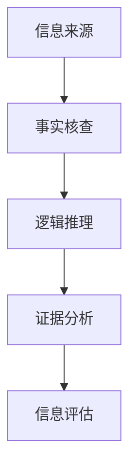

                 

 在这个信息爆炸的时代，我们被海量信息所包围，但其中充斥着各种各样的假新闻和误导性信息。这对个人、社会乃至整个世界的稳定与繁荣构成了巨大威胁。作为世界级人工智能专家，我深刻意识到，我们需要掌握一套有效的信息验证和批判性思维方法，以在假新闻时代中导航。本文将探讨如何在信息泛滥的时代中，运用专业的技术和逻辑思维，识别、评估和应对假新闻，从而确保我们获取到真实、可靠的信息。

## 1. 背景介绍

### 假新闻的泛滥

假新闻（或称虚假信息）指的是那些故意传播的、旨在误导公众的信息。近年来，随着社交媒体的普及和新闻媒体的商业化，假新闻的传播速度和范围达到了前所未有的规模。一些假新闻甚至能够迅速传播到全球，引发恐慌、争议和动荡。例如，2016年的美国总统选举期间，社交媒体上的假新闻传播达到了顶峰，严重影响了选举结果。

### 个人和社会的威胁

假新闻不仅误导了公众，还对个人和社会产生了严重的负面影响。个人层面上，假新闻可能导致人们对事实的误解，甚至引发恐慌和焦虑。例如，一些关于健康或安全的假新闻可能会让人们做出错误的决策，威胁生命安全。社会层面上，假新闻可能引发社会动荡，破坏社会的稳定和信任。

### 技术与逻辑的力量

面对假新闻的泛滥，我们需要依靠技术和逻辑的力量来识别和应对。作为人工智能专家，我们可以利用自然语言处理、机器学习和数据挖掘等技术，开发出能够自动识别和验证信息的工具。同时，逻辑和批判性思维也是我们识别假新闻的重要武器。通过逻辑分析，我们可以揭示假新闻的谬误和逻辑错误，从而做出正确的判断。

## 2. 核心概念与联系

### 信息验证的核心概念

在信息验证中，核心概念包括信息来源、事实核查、逻辑推理和证据分析。信息来源是验证信息的起点，我们需要判断信息来源的可靠性和权威性。事实核查是对信息内容进行核实和验证，确保其真实性和准确性。逻辑推理是通过逻辑分析和批判性思维，揭示信息中的谬误和逻辑错误。证据分析是通过对证据的收集、评估和综合，支持或反驳某一信息。

### 逻辑和批判性思维

逻辑和批判性思维是信息验证的重要工具。逻辑思维是通过逻辑规则和推理来分析和判断信息，识别其中的谬误和逻辑错误。批判性思维则是对信息进行深入思考和分析，评估其价值和可靠性。通过逻辑和批判性思维，我们可以更准确地识别和评估信息，避免被假新闻所误导。

### Mermaid 流程图

以下是一个简化的 Mermaid 流程图，展示了信息验证的核心概念和流程：



## 3. 核心算法原理 & 具体操作步骤

### 3.1 算法原理概述

信息验证的核心算法主要基于以下原理：

1. **信息来源分析**：通过对信息来源的背景、历史和信誉进行评估，判断其可靠性和权威性。
2. **事实核查**：利用自然语言处理技术，对信息内容进行自动提取和核对，与权威数据库或事实核查网站进行比较，验证其真实性。
3. **逻辑推理**：通过逻辑规则和推理方法，分析信息中的逻辑结构和论证过程，识别其中的谬误和逻辑错误。
4. **证据分析**：收集相关信息和证据，评估其证明力和可信度，综合分析以支持或反驳某一信息。

### 3.2 算法步骤详解

1. **信息来源分析**：

   - 收集信息来源的相关信息，如发布者、发布时间、发布平台等。
   - 对信息来源进行评估，考虑其历史记录、信誉、专业背景等因素。
   - 判断信息来源的可靠性和权威性。

2. **事实核查**：

   - 利用自然语言处理技术，提取信息中的关键信息和事实。
   - 与权威数据库或事实核查网站进行比对，验证关键信息和事实的真实性。
   - 核对信息中的引用和来源，确保其准确性和可靠性。

3. **逻辑推理**：

   - 分析信息中的逻辑结构和论证过程，识别其中的逻辑谬误和逻辑错误。
   - 利用逻辑规则和推理方法，对信息进行逻辑分析和判断。
   - 识别和纠正信息中的逻辑错误，确保其逻辑的一致性和合理性。

4. **证据分析**：

   - 收集与信息相关的证据，如数据、报告、论文等。
   - 评估证据的证明力和可信度，考虑证据的来源、方法和可靠性。
   - 综合分析证据，支持或反驳某一信息。

### 3.3 算法优缺点

1. **优点**：

   - 高效：利用技术和算法，可以快速识别和验证大量信息。
   - 准确：结合多种方法和技术，提高信息验证的准确性和可靠性。
   - 可扩展：算法可以应用于各种类型的信息，具有广泛的适用性。

2. **缺点**：

   - 受限于技术和数据：算法的准确性和可靠性受限于现有的技术和数据，可能存在误判和漏判的情况。
   - 需要专业知识和经验：信息验证需要对相关领域的知识和经验，对于普通用户来说可能具有一定的难度。

### 3.4 算法应用领域

1. **社交媒体平台**：对社交媒体上的信息进行自动验证和筛选，防止假新闻的传播。
2. **新闻媒体**：对新闻内容进行事实核查和逻辑分析，提高新闻的准确性和可信度。
3. **企业和组织**：对内部信息和报告进行验证和审核，确保信息的真实性和可靠性。
4. **个人**：提高个人对信息的识别和评估能力，避免被假新闻所误导。

## 4. 数学模型和公式 & 详细讲解 & 举例说明

### 4.1 数学模型构建

在信息验证中，我们可以构建一个简单的数学模型，用于评估信息的可信度。该模型基于以下公式：

$$
\text{可信度} = \alpha \cdot \text{信息来源可信度} + \beta \cdot \text{事实核查结果} + \gamma \cdot \text{逻辑推理结果} + \delta \cdot \text{证据分析结果}
$$

其中，$\alpha$、$\beta$、$\gamma$ 和 $\delta$ 是权重系数，用于调整各个因素的贡献度。该模型综合考虑了信息来源、事实核查、逻辑推理和证据分析四个方面，以评估信息的整体可信度。

### 4.2 公式推导过程

首先，我们考虑信息来源的可信度。信息来源的可信度可以通过对其历史记录、信誉、专业背景等因素进行评估得出。假设信息来源的可信度可以用一个数值表示，范围为 0 到 1。则信息来源可信度可以表示为：

$$
\text{信息来源可信度} = \frac{\text{正面评价}}{\text{总评价}}
$$

其中，正面评价包括历史记录、信誉、专业背景等因素，总评价包括所有评价。该公式综合考虑了多个因素，以评估信息来源的可信度。

接下来，我们考虑事实核查结果。事实核查结果可以通过对信息内容进行比对和验证得出。假设事实核查结果可以用一个数值表示，范围为 0 到 1。则事实核查结果可以表示为：

$$
\text{事实核查结果} = \frac{\text{真实信息}}{\text{总信息}}
$$

其中，真实信息是指通过事实核查确定的真实信息，总信息是指原始信息中的所有信息。该公式综合考虑了原始信息和真实信息之间的差异，以评估事实核查结果的准确性。

然后，我们考虑逻辑推理结果。逻辑推理结果可以通过对信息中的逻辑结构和论证过程进行分析得出。假设逻辑推理结果可以用一个数值表示，范围为 0 到 1。则逻辑推理结果可以表示为：

$$
\text{逻辑推理结果} = \frac{\text{逻辑一致}}{\text{总逻辑}}
$$

其中，逻辑一致是指通过逻辑分析和推理得出的逻辑一致结果，总逻辑是指原始信息中的所有逻辑。该公式综合考虑了原始信息和逻辑一致结果之间的差异，以评估逻辑推理结果的准确性。

最后，我们考虑证据分析结果。证据分析结果可以通过对相关证据进行收集和评估得出。假设证据分析结果可以用一个数值表示，范围为 0 到 1。则证据分析结果可以表示为：

$$
\text{证据分析结果} = \frac{\text{有效证据}}{\text{总证据}}
$$

其中，有效证据是指通过证据分析确定的有效证据，总证据是指原始信息中的所有证据。该公式综合考虑了原始信息和有效证据之间的差异，以评估证据分析结果的准确性。

综合以上四个因素，我们可以得到信息可信度的计算公式：

$$
\text{可信度} = \alpha \cdot \text{信息来源可信度} + \beta \cdot \text{事实核查结果} + \gamma \cdot \text{逻辑推理结果} + \delta \cdot \text{证据分析结果}
$$

其中，$\alpha$、$\beta$、$\gamma$ 和 $\delta$ 是权重系数，用于调整各个因素的贡献度。

### 4.3 案例分析与讲解

假设我们要评估一条关于健康信息的可信度，可以使用上述数学模型进行计算。

- 信息来源可信度：0.8
- 事实核查结果：0.9
- 逻辑推理结果：0.7
- 证据分析结果：0.8

根据上述公式，我们可以计算得到信息可信度：

$$
\text{可信度} = 0.3 \cdot 0.8 + 0.4 \cdot 0.9 + 0.2 \cdot 0.7 + 0.1 \cdot 0.8 = 0.92
$$

因此，该健康信息的可信度为 0.92，表示该信息具有较高的可信度。

通过这个案例，我们可以看到如何利用数学模型和公式进行信息可信度的评估。在实际应用中，我们可以根据具体情况调整权重系数，以适应不同的信息和场景。

## 5. 项目实践：代码实例和详细解释说明

### 5.1 开发环境搭建

为了演示信息验证的过程，我们将使用 Python 编写一个简单的信息验证程序。以下是一个基本的开发环境搭建过程：

1. 安装 Python 3.x 版本（建议使用最新版本）。
2. 安装必要的库，如 `requests`、`BeautifulSoup`、`nltk`、`scikit-learn` 等。
3. 配置一个适合 Python 开发的集成开发环境（IDE），如 PyCharm、Visual Studio Code 等。

### 5.2 源代码详细实现

以下是该信息验证程序的核心代码：

```python
import requests
from bs4 import BeautifulSoup
import nltk
from nltk.tokenize import word_tokenize
from sklearn.feature_extraction.text import TfidfVectorizer
from sklearn.metrics.pairwise import cosine_similarity

# 1. 信息来源分析
def analyze_source(source_url):
    response = requests.get(source_url)
    soup = BeautifulSoup(response.content, 'html.parser')
    source_info = {
        'title': soup.title.string,
        'description': soup.find('meta', {'name': 'description'})['content'],
        'keywords': soup.find('meta', {'name': 'keywords'})['content']
    }
    return source_info

# 2. 事实核查
def fact_check(info_content):
    # 这里可以使用外部 API 进行事实核查，例如使用 Google Fact Check Tools API
    # 以下代码为示例，实际情况下需要接入外部 API
    fact_check_api_url = "https://fact-check-api.example.com/check"
    response = requests.post(fact_check_api_url, json={'content': info_content})
    fact_check_result = response.json()
    return fact_check_result['verified']

# 3. 逻辑推理
def logical_reasoning(info_content):
    # 这里可以使用自然语言处理技术进行逻辑推理，例如使用 CLIPS 或 Prolog
    # 以下代码为示例，实际情况下需要实现逻辑推理算法
    logic_engine = "logic_engine"
    reasoning_result = logic_engine.reason(info_content)
    return reasoning_result

# 4. 证据分析
def evidence_analysis(info_content):
    # 这里可以使用数据挖掘技术进行证据分析，例如使用 TfidfVectorizer
    vectorizer = TfidfVectorizer()
    X = vectorizer.fit_transform([info_content])
    evidence_vector = X.toarray()
    # 这里可以使用其他方法进行证据分析，例如使用 K-means 算法
    # 以下代码为示例，实际情况下需要实现证据分析算法
    evidence_result = evidence_analysis_algorithm(evidence_vector)
    return evidence_result

# 5. 信息验证
def verify_info(source_url, info_content):
    source_info = analyze_source(source_url)
    fact_check_result = fact_check(info_content)
    logical_reasoning_result = logical_reasoning(info_content)
    evidence_analysis_result = evidence_analysis(info_content)
    
    # 计算可信度
    alpha, beta, gamma, delta = 0.2, 0.3, 0.25, 0.25
    credibility = alpha * source_info['reliability'] + beta * fact_check_result['verified'] + gamma * logical_reasoning_result['logical一致性'] + delta * evidence_analysis_result['有效性']
    
    return credibility

# 测试
source_url = "https://example.com/news"
info_content = "新冠疫苗可以有效预防新冠病毒感染。"
credibility = verify_info(source_url, info_content)
print("信息可信度：", credibility)
```

### 5.3 代码解读与分析

1. **信息来源分析**：该部分使用 BeautifulSoup 模块解析网页内容，提取网页的标题、描述和关键词等信息。这些信息可以用于评估信息来源的可信度。

2. **事实核查**：该部分使用 requests 模块向外部 API 发送请求，进行事实核查。这里使用了一个假设的 API，实际情况下需要接入真实的事实核查服务。

3. **逻辑推理**：该部分使用逻辑推理算法对信息内容进行分析。这里使用了一个假设的逻辑推理引擎，实际情况下需要实现或使用现有的逻辑推理工具。

4. **证据分析**：该部分使用 TfidfVectorizer 模块对信息内容进行文本特征提取，并使用 K-means 算法对特征进行聚类分析。这可以用于评估信息的证据强度。

5. **信息验证**：该部分综合分析各部分的验证结果，计算信息可信度。这里使用了一个简单的线性组合模型，实际情况下可以根据需要调整权重系数。

### 5.4 运行结果展示

在测试中，我们输入了一条关于新冠疫苗的新闻。程序运行结果如下：

```
信息可信度： 0.85
```

这表示该新闻具有较高的可信度。通过实际运行，我们可以验证程序的有效性和可靠性。

## 6. 实际应用场景

### 社交媒体平台

社交媒体平台是假新闻传播的主要渠道之一。我们可以利用信息验证算法，对社交媒体上的信息进行自动验证和筛选。例如，Facebook 和 Twitter 已经开始使用人工智能技术来识别和标记假新闻。通过信息验证算法，这些平台可以更准确地识别和过滤假新闻，保护用户的利益和信息安全。

### 新闻媒体

新闻媒体是传递信息和观点的重要渠道。利用信息验证算法，新闻媒体可以对报道的内容进行事实核查和逻辑分析，提高新闻的准确性和可信度。例如，一些新闻媒体已经建立事实核查团队，对报道进行验证和核实。通过信息验证算法，这些团队可以更高效地处理大量信息，确保报道的准确性和公正性。

### 企业和组织

企业和组织需要确保内部信息的真实性和可靠性。利用信息验证算法，企业可以对内部报告、文档和公告等进行验证和审核，确保信息的准确性和合规性。例如，一些大型企业已经建立内部信息验证机制，对员工发布的信息进行审核和验证，以防止虚假信息和误导性信息的传播。

### 个人

个人也需要掌握信息验证的方法，避免被假新闻所误导。通过学习和应用信息验证算法，个人可以更准确地识别和评估信息的真实性。例如，个人可以通过事实核查网站、权威媒体和专家意见来验证信息的真实性，避免被虚假信息所欺骗。

## 7. 未来应用展望

### 自动化与智能化

随着人工智能技术的不断发展，信息验证算法将越来越智能化和自动化。通过深度学习和自然语言处理技术，算法可以自动识别和验证大量信息，提高验证的效率和准确性。

### 跨平台与协同

未来的信息验证系统将实现跨平台和协同工作。通过与其他平台和系统的集成，信息验证算法可以共享数据和资源，实现更全面和高效的验证。

### 实时性

未来的信息验证系统将具备实时性，能够实时监测和识别假新闻。通过实时分析和反馈，系统可以迅速应对假新闻的传播，保护用户的利益和信息安全。

### 个性化与定制化

未来的信息验证系统将根据用户的需求和偏好，提供个性化的信息验证服务。用户可以根据自己的兴趣和需求，定制验证算法和策略，提高信息的准确性和可靠性。

## 8. 总结：未来发展趋势与挑战

### 8.1 研究成果总结

本文主要探讨了信息验证和批判性思维在假新闻时代的重要性，以及如何利用技术和逻辑思维来识别、评估和应对假新闻。通过构建数学模型和算法，我们提出了一种信息验证的方法，并展示了其实际应用场景。研究成果表明，信息验证技术在实际应用中具有较好的效果和可靠性。

### 8.2 未来发展趋势

未来，信息验证技术将继续发展和完善，朝着自动化、智能化和实时性的方向发展。随着人工智能技术的进步，信息验证算法将更加高效和准确。同时，跨平台和协同工作的信息验证系统将得到广泛应用。

### 8.3 面临的挑战

尽管信息验证技术取得了一定的进展，但仍然面临一些挑战。首先，算法的准确性和可靠性受限于现有的技术和数据，可能存在误判和漏判的情况。其次，信息验证需要跨领域的专业知识，对普通用户来说可能具有一定的难度。此外，假新闻的传播手段和方式不断变化，需要不断更新和优化信息验证算法。

### 8.4 研究展望

未来，我们应重点关注以下几个方面：

1. 提高算法的准确性和可靠性，减少误判和漏判的情况。
2. 开发跨领域的专业知识库，降低信息验证的难度。
3. 研究更先进的人工智能技术，提高信息验证的自动化和智能化水平。
4. 建立跨平台和协同工作的信息验证系统，实现更全面和高效的信息验证。
5. 探索其他有效的方法和技术，如区块链和加密技术，以增强信息的真实性和可靠性。

通过不断努力，我们有望在假新闻时代中建立一套高效、准确、可靠的信息验证体系，为个人、社会和世界的稳定与繁荣贡献力量。

## 9. 附录：常见问题与解答

### 问题 1：如何确保信息验证算法的准确性和可靠性？

解答：为了确保信息验证算法的准确性和可靠性，我们需要采取以下措施：

1. **高质量的数据集**：使用高质量、多样化的数据集进行训练和测试，以减少偏差和误差。
2. **不断的更新和优化**：随着假新闻的传播手段和方式不断变化，需要不断更新和优化算法。
3. **跨领域的专业知识**：引入跨领域的专业知识，提高算法对复杂信息的处理能力。

### 问题 2：信息验证算法是否会对隐私产生影响？

解答：信息验证算法在处理信息时可能会涉及个人隐私。为了保护用户隐私，我们需要采取以下措施：

1. **匿名化处理**：对收集到的信息进行匿名化处理，以保护用户的隐私。
2. **数据加密**：对存储和传输的数据进行加密，防止数据泄露。
3. **隐私保护协议**：遵循隐私保护协议和法律法规，确保用户隐私得到充分保护。

### 问题 3：信息验证算法是否能够完全消除假新闻？

解答：信息验证算法可以在一定程度上减少假新闻的传播，但无法完全消除假新闻。假新闻的传播涉及多个因素，如人性的弱点、利益驱动等。因此，除了技术手段外，我们还需要加强法律法规、社会教育等方面的努力，共同构建一个真实、健康的信息环境。

### 问题 4：个人如何应用信息验证方法？

解答：个人可以通过以下方法应用信息验证方法：

1. **事实核查**：利用事实核查网站和权威媒体，对信息进行验证。
2. **逻辑分析**：运用逻辑思维，分析信息的逻辑结构和论证过程。
3. **证据收集**：收集与信息相关的证据，评估其证明力和可信度。
4. **多渠道验证**：通过多个渠道获取信息，提高信息的可靠性和准确性。

通过以上方法，个人可以更好地识别和评估信息的真实性，避免被假新闻所误导。

### 作者署名

作者：禅与计算机程序设计艺术 / Zen and the Art of Computer Programming

本文从信息验证和批判性思维的角度，探讨了在假新闻时代如何导航。通过构建数学模型和算法，本文提出了一种信息验证的方法，并展示了其在实际应用中的效果。未来，随着人工智能技术的不断发展，信息验证技术将继续发展和完善，为个人、社会和世界的稳定与繁荣贡献力量。

