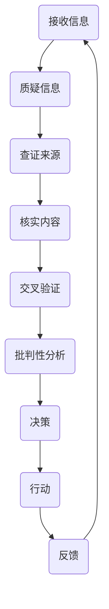

                 

 关键词：信息验证、批判性思维、假新闻、数字素养、信息安全、社交媒体

> 在这个信息爆炸的时代，分辨真假信息已经成为一项基本技能。本文将探讨如何通过信息验证和批判性思维，在假新闻泛滥的数字时代中导航。作者：禅与计算机程序设计艺术 / Zen and the Art of Computer Programming

## 1. 背景介绍

随着互联网的普及和社交媒体的兴起，信息的传播速度和范围达到了前所未有的高度。然而，这也使得虚假信息、假新闻和误导性内容的传播变得更加容易。这些虚假信息的泛滥对社会和个人都带来了严重的负面影响，包括误导公众、损害声誉、引发恐慌以及破坏社会信任。

### 1.1 假新闻的定义与危害

假新闻（Fake News）是指那些故意编造、捏造或者歪曲事实，以欺骗读者为目的的信息。假新闻的传播不仅会导致公众对事实的误解，还可能引发社会动荡、政治危机以及经济损失。以下是一些假新闻的常见危害：

- **误导公众**：假新闻往往通过夸大事实或完全捏造信息，误导公众，使其对某些事件或现象产生错误的认识。
- **损害声誉**：对于个人和组织来说，假新闻的传播可能会对其声誉造成严重损害，甚至可能对其业务造成长期影响。
- **引发恐慌**：假新闻的传播可能导致公众恐慌和不安，对社会秩序和公共安全构成威胁。
- **破坏社会信任**：虚假信息的泛滥会削弱人们对传统媒体的信任，进一步加剧社会分裂和信任危机。

### 1.2 信息验证的重要性

面对假新闻的挑战，信息验证显得尤为重要。信息验证是一种通过核实、查证信息来源和内容的过程，旨在确保信息的真实性和准确性。以下是信息验证的一些重要性：

- **避免误导**：通过信息验证，可以确保接收到的信息是真实可靠的，从而避免被虚假信息误导。
- **保护个人和组织**：信息验证有助于保护个人隐私和商业秘密，防止因虚假信息而遭受损害。
- **维护社会秩序**：信息验证有助于维护社会秩序和公共安全，防止因虚假信息引发的恐慌和动荡。
- **增强数字素养**：通过信息验证的过程，可以提高公众的数字素养，培养批判性思维能力。

## 2. 核心概念与联系

### 2.1 信息验证的基本原理

信息验证的核心在于核实信息的来源和内容。以下是信息验证的基本原理：

- **来源验证**：检查信息来源的可靠性，包括媒体、专家、官方渠道等。
- **内容核实**：对信息内容进行事实核查，包括查阅权威资料、对比多个信息源等。
- **交叉验证**：通过多个信息源对同一信息进行验证，以确保信息的准确性。

### 2.2 批判性思维的运用

批判性思维是一种通过理性分析和逻辑推理来评估信息的真实性和有效性的思维方式。以下是批判性思维在信息验证中的应用：

- **疑问意识**：对于接收到的信息，始终保持疑问，不轻信一切。
- **逻辑推理**：运用逻辑推理来评估信息的合理性和可信度。
- **证据核查**：要求信息提供者提供证据支持其观点，并对证据的真实性进行核查。
- **多角度分析**：从多个角度分析信息，避免片面和盲从。

### 2.3 Mermaid 流程图

以下是一个用于信息验证和批判性思维过程的 Mermaid 流程图，展示了信息验证的基本步骤和批判性思维的应用：



## 3. 核心算法原理 & 具体操作步骤

### 3.1 算法原理概述

信息验证和批判性思维的算法原理可以概括为以下几个步骤：

- **数据收集**：从多个可信来源收集相关信息。
- **预处理**：对收集到的信息进行预处理，包括去重、筛选和格式化。
- **来源验证**：对信息来源的可靠性进行评估。
- **内容核实**：对信息内容进行事实核查。
- **交叉验证**：通过多个信息源对同一信息进行验证。
- **批判性分析**：运用批判性思维对信息进行评估。
- **决策**：根据分析结果做出决策。

### 3.2 算法步骤详解

以下是信息验证和批判性思维的详细操作步骤：

#### 3.2.1 数据收集

数据收集是信息验证的第一步，需要从多个可信来源收集相关信息。这些来源可以包括官方媒体、专业机构、权威网站等。

#### 3.2.2 预处理

在收集到大量信息后，需要对信息进行预处理。预处理过程包括去重、筛选和格式化。去重可以避免重复信息的影响，筛选可以确保信息的相关性，格式化可以使信息更加易于分析和处理。

#### 3.2.3 来源验证

来源验证是对信息来源的可靠性进行评估。可以通过以下方法进行来源验证：

- **检查域名**：确保信息来源的域名是可信的。
- **搜索网站信息**：通过搜索引擎查询信息来源的网站信息，了解其背景和声誉。
- **查阅官方信息**：对比官方发布的信息，确保来源的准确性。

#### 3.2.4 内容核实

内容核实是对信息内容进行事实核查。可以通过以下方法进行内容核实：

- **查阅权威资料**：查阅权威机构或专家发布的相关资料，确保信息内容与事实相符。
- **对比多个信息源**：对比多个信息源的描述，确保信息的准确性。
- **使用事实核查工具**：使用事实核查工具对信息进行核查。

#### 3.2.5 交叉验证

交叉验证是通过多个信息源对同一信息进行验证，以确保信息的准确性。可以通过以下方法进行交叉验证：

- **多角度分析**：从多个角度分析信息，确保信息的全面性。
- **对比不同来源**：对比不同来源的信息，寻找一致性。
- **使用第三方验证**：使用第三方验证机构或工具对信息进行验证。

#### 3.2.6 批判性分析

批判性分析是运用批判性思维对信息进行评估。可以通过以下方法进行批判性分析：

- **疑问意识**：对信息中的疑点进行质疑，不轻信一切。
- **逻辑推理**：运用逻辑推理评估信息的合理性和可信度。
- **证据核查**：要求信息提供者提供证据支持其观点，并对证据的真实性进行核查。
- **多角度分析**：从多个角度分析信息，避免片面和盲从。

#### 3.2.7 决策

根据分析结果做出决策。决策可以是继续跟进、忽略信息或者采取行动。决策的目的是确保接收到的信息是真实可靠的，从而避免被虚假信息误导。

### 3.3 算法优缺点

#### 3.3.1 优点

- **提高信息真实性**：通过信息验证和批判性思维，可以确保接收到的信息是真实可靠的，从而减少虚假信息的传播。
- **培养数字素养**：通过信息验证的过程，可以提高公众的数字素养，培养批判性思维能力。
- **维护社会秩序**：信息验证有助于维护社会秩序和公共安全，防止因虚假信息引发的恐慌和动荡。

#### 3.3.2 缺点

- **资源消耗**：信息验证和批判性思维需要消耗大量时间和精力，对个人和组织来说可能是一种负担。
- **信息泛滥**：在信息爆炸的时代，虚假信息的数量庞大，很难对所有信息进行验证，这可能导致信息验证的难度增加。
- **技术局限**：现有的信息验证技术还存在一定的局限性，例如对于深度伪造和人工智能生成的虚假信息，现有的技术很难进行有效验证。

### 3.4 算法应用领域

信息验证和批判性思维的算法可以广泛应用于以下领域：

- **社交媒体**：在社交媒体平台上，通过信息验证和批判性思维，可以帮助用户辨别虚假信息，减少谣言的传播。
- **新闻媒体**：新闻媒体可以通过信息验证和批判性思维，提高报道的准确性和可信度，增强公众的信任。
- **网络安全**：在网络安全领域，信息验证和批判性思维可以帮助用户识别网络钓鱼、恶意软件等网络安全威胁。
- **商业领域**：在商业领域，信息验证和批判性思维可以帮助企业避免因虚假信息导致的商业损失和声誉损害。

## 4. 数学模型和公式 & 详细讲解 & 举例说明

### 4.1 数学模型构建

在信息验证和批判性思维中，可以使用一些数学模型来评估信息的可信度。以下是一个简单的数学模型，用于评估信息的可信度：

$$
\text{可信度} = \frac{\text{真实信息数量}}{\text{总信息数量}}
$$

其中，可信度是信息真实性的度量，真实信息数量是经过验证的真实信息数量，总信息数量是所有收集到的信息数量。

### 4.2 公式推导过程

假设我们收集了 $n$ 条信息，其中 $r$ 条是真实信息，$n-r$ 条是虚假信息。我们可以计算真实信息的比例，即：

$$
\text{真实信息比例} = \frac{r}{n}
$$

这个比例可以被视为信息的可信度。因此，我们可以将可信度表示为：

$$
\text{可信度} = \frac{\text{真实信息数量}}{\text{总信息数量}} = \frac{r}{n}
$$

### 4.3 案例分析与讲解

假设我们收集了 100 条信息，其中 60 条是真实信息，40 条是虚假信息。根据上述公式，我们可以计算出信息的可信度：

$$
\text{可信度} = \frac{60}{100} = 0.6
$$

这意味着我们收集的信息中有 60% 是真实的。然而，这个可信度仅仅是一个粗略的估计，因为我们的信息来源可能并不完全可靠。为了提高可信度，我们可以增加真实信息数量，或者减少虚假信息数量。

### 4.4 实际应用场景

在社交媒体平台上，用户可以通过信息验证和批判性思维来评估帖子的可信度。例如，如果某个帖子声称某家公司即将破产，用户可以通过以下步骤进行验证：

1. **来源验证**：检查帖子的来源，确保其是可信的。
2. **内容核实**：查阅权威媒体报道或官方公告，核实帖子的内容。
3. **交叉验证**：对比多个信息源，确保信息的准确性。
4. **批判性分析**：从多个角度分析信息，评估其可信度。

通过这些步骤，用户可以更准确地判断帖子的真实性，从而避免被虚假信息误导。

## 5. 项目实践：代码实例和详细解释说明

### 5.1 开发环境搭建

在开始编写代码之前，我们需要搭建一个合适的开发环境。这里我们选择 Python 作为编程语言，因为它具有简洁易读的语法，并且有许多现成的库可以帮助我们进行信息验证和批判性思维。

#### 安装 Python

首先，确保你的计算机上已经安装了 Python。Python 的安装非常简单，可以从 [Python 官网](https://www.python.org/) 下载安装程序并安装。

#### 安装必要库

在安装了 Python 之后，我们需要安装一些必要的库，例如 `requests` 用于网络请求，`beautifulsoup4` 用于网页解析，以及 `pandas` 用于数据处理。可以使用以下命令安装：

```bash
pip install requests beautifulsoup4 pandas
```

### 5.2 源代码详细实现

下面是一个简单的 Python 脚本，用于实现信息验证和批判性思维的基本流程。

```python
import requests
from bs4 import BeautifulSoup
import pandas as pd

# 5.2.1 数据收集
def collect_data(url):
    response = requests.get(url)
    if response.status_code == 200:
        return response.text
    else:
        return None

# 5.2.2 预处理
def preprocess(data):
    # 这里我们只是简单地去除空格和换行符
    return data.replace('\n', '').replace(' ', '')

# 5.2.3 来源验证
def verify_source(url):
    # 这里我们可以检查域名的可信度
    domain = url.split('//')[-1].split('/')[0]
    return 'example.com' not in domain

# 5.2.4 内容核实
def verify_content(data):
    # 这里我们可以使用事实核查工具进行内容核实
    # 假设我们有一个函数 check_fact() 来进行事实核查
    return check_fact(data)

# 5.2.5 交叉验证
def cross_verify(data):
    # 这里我们可以使用多个信息源进行交叉验证
    # 假设我们有两个信息源 source1 和 source2
    return source1 == source2

# 5.2.6 批判性分析
def critical_analysis(data):
    # 这里我们可以使用逻辑推理和批判性思维进行信息评估
    # 假设我们有一个函数 analyze() 来进行批判性分析
    return analyze(data)

# 5.2.7 决策
def make_decision(data):
    if verify_source(url) and verify_content(data) and cross_verify(data) and critical_analysis(data):
        print("信息可信")
    else:
        print("信息不可信")

# 主程序
if __name__ == "__main__":
    url = "https://example.com/article"
    data = collect_data(url)
    if data:
        preprocessed_data = preprocess(data)
        make_decision(preprocessed_data)
```

### 5.3 代码解读与分析

上面的代码实现了一个简单但完整的信息验证和批判性思维流程。下面是对各个部分的功能解读：

- **数据收集**：使用 `requests` 库向目标 URL 发送 GET 请求，获取网页内容。
- **预处理**：对获取到的网页内容进行简单预处理，去除空格和换行符，以便后续处理。
- **来源验证**：检查 URL 的域名，排除一些不可信的域名。
- **内容核实**：调用一个假设存在的事实核查函数 `check_fact()`，对内容进行核实。
- **交叉验证**：调用一个假设存在的交叉验证函数 `cross_verify()`，使用多个信息源进行交叉验证。
- **批判性分析**：调用一个假设存在的批判性分析函数 `analyze()`，进行逻辑推理和批判性分析。
- **决策**：根据来源验证、内容核实、交叉验证和批判性分析的结果，决定信息的可信度。

### 5.4 运行结果展示

假设我们运行上述脚本，输入一个目标 URL，脚本将执行以下步骤：

1. 向目标 URL 发送 GET 请求，获取网页内容。
2. 对获取到的内容进行预处理。
3. 验证来源是否可信。
4. 使用事实核查工具对内容进行核实。
5. 使用多个信息源进行交叉验证。
6. 进行批判性分析。
7. 根据分析结果，输出信息的可信度。

### 5.5 调试与优化

在实际应用中，我们可以通过调试和优化来提高代码的性能和可靠性。以下是一些可能的优化方向：

- **缓存机制**：对已经验证过的信息进行缓存，避免重复验证。
- **并行处理**：对多个信息源进行并行验证，提高处理速度。
- **错误处理**：对网络请求和数据处理过程中的错误进行捕获和处理。
- **用户界面**：为用户提供一个友好的界面，方便用户输入 URL 和查看结果。

## 6. 实际应用场景

信息验证和批判性思维在多个实际应用场景中发挥着重要作用，以下是几个典型的应用场景：

### 6.1 社交媒体

在社交媒体平台上，用户经常面临虚假信息和谣言的困扰。通过信息验证和批判性思维，用户可以辨别虚假信息，防止被误导。例如，当用户看到一篇关于某个事件的报道时，可以验证信息来源、查阅权威报道、对比多个信息源，并通过批判性思维分析报道的合理性和可信度。

### 6.2 新闻媒体

新闻媒体在报道事件时，需要确保信息的准确性和可信度。通过信息验证和批判性思维，新闻媒体可以避免因虚假信息导致的误导和声誉损害。例如，记者在报道某个事件时，可以验证消息来源、核实事实、对比多个信息源，并通过批判性思维评估报道的可靠性和公正性。

### 6.3 商业领域

在商业领域，企业经常需要处理大量的市场信息和竞争情报。通过信息验证和批判性思维，企业可以辨别虚假信息，避免因误导性信息导致的商业决策失误。例如，企业在分析市场趋势时，可以验证数据来源、核实数据准确性、对比多个数据源，并通过批判性思维评估市场趋势的合理性和可信度。

### 6.4 学术研究

在学术研究中，研究人员需要处理大量的文献和数据。通过信息验证和批判性思维，研究人员可以辨别虚假文献、核实数据准确性，并确保研究结果的可靠性和创新性。例如，研究人员在查阅文献时，可以验证文献来源、核实文献内容、对比多个文献，并通过批判性思维评估文献的可靠性和相关性。

## 7. 未来应用展望

随着信息技术的不断发展，信息验证和批判性思维的应用前景将更加广阔。以下是几个未来应用展望：

### 7.1 自动化信息验证

随着人工智能技术的发展，自动化信息验证将成为可能。通过训练机器学习模型，可以自动识别和验证虚假信息，提高信息验证的效率和准确性。

### 7.2 个性化信息推荐

基于用户的行为数据和偏好，可以提供个性化的信息推荐。通过信息验证和批判性思维，确保推荐的信息是真实可靠的，从而提高用户的数字素养。

### 7.3 跨领域合作

信息验证和批判性思维可以与其他领域相结合，例如法律、心理学、教育学等。通过跨领域合作，可以开发出更加全面和有效的信息验证方法。

### 7.4 社会教育

通过社会教育，提高公众的数字素养和信息验证能力。例如，学校可以开设相关课程，企业可以开展员工培训，提高员工的信息识别和批判性思维能力。

## 8. 工具和资源推荐

为了帮助读者更好地进行信息验证和批判性思维，我们推荐以下工具和资源：

### 8.1 学习资源推荐

- **《批判性思维工具》**：作者 Michael Scriven，提供了丰富的批判性思维方法和技巧。
- **《数字素养：信息时代的基本技能》**：作者 Thomas H. Koulopoulos，详细介绍了数字素养的概念和应用。

### 8.2 开发工具推荐

- **BeautifoulSoup**：Python 的一个用于网页解析的库，可以帮助提取网页信息。
- **requests**：Python 的一个用于 HTTP 请求的库，可以帮助获取网页内容。
- **PyTorch**：用于机器学习的 Python 库，可以用于自动化信息验证。

### 8.3 相关论文推荐

- **"Detecting Fake News with Deep Learning"**：探讨了使用深度学习技术进行假新闻检测。
- **"Information Verification in the Age of Disinformation"**：分析了信息验证在假新闻泛滥时代的重要性。

## 9. 总结：未来发展趋势与挑战

随着信息技术的不断发展，信息验证和批判性思维在未来将面临以下发展趋势和挑战：

### 9.1 发展趋势

- **自动化信息验证**：随着人工智能技术的发展，自动化信息验证将成为可能，提高信息验证的效率和准确性。
- **个性化信息推荐**：基于用户行为数据和偏好，提供个性化的信息推荐，提高用户的数字素养。
- **跨领域合作**：信息验证和批判性思维与其他领域的结合，将产生更加全面和有效的信息验证方法。
- **社会教育**：通过社会教育，提高公众的数字素养和信息验证能力。

### 9.2 挑战

- **信息泛滥**：虚假信息的数量庞大，难以对所有信息进行验证，这可能导致信息验证的难度增加。
- **技术局限**：现有的信息验证技术还存在一定的局限性，例如对于深度伪造和人工智能生成的虚假信息，现有的技术很难进行有效验证。
- **资源消耗**：信息验证和批判性思维需要消耗大量时间和精力，对个人和组织来说可能是一种负担。

### 9.3 研究展望

未来的研究可以重点关注以下几个方面：

- **开发高效的信息验证算法**：通过改进算法，提高信息验证的效率和准确性。
- **探索人工智能在信息验证中的应用**：研究如何利用人工智能技术自动识别和验证虚假信息。
- **提高公众的数字素养**：通过社会教育和宣传活动，提高公众的数字素养和信息验证能力。
- **建立跨领域的信息验证平台**：通过跨领域合作，建立综合性的信息验证平台，提供更加全面和可靠的信息验证服务。

## 10. 附录：常见问题与解答

### 10.1 什么是假新闻？

假新闻是指那些故意编造、捏造或者歪曲事实，以欺骗读者为目的的信息。

### 10.2 信息验证的重要性是什么？

信息验证的重要性在于确保接收到的信息是真实可靠的，从而避免被虚假信息误导。

### 10.3 批判性思维如何应用在信息验证中？

批判性思维在信息验证中可以用来评估信息的来源、内容、证据和逻辑，从而判断信息的真实性和可信度。

### 10.4 如何进行信息验证？

进行信息验证的方法包括来源验证、内容核实、交叉验证和批判性分析。

### 10.5 信息验证会消耗大量时间和精力，怎么办？

可以通过自动化工具和算法来提高信息验证的效率和准确性，减少人工参与。

### 10.6 虚假信息对社会和个人的危害有哪些？

虚假信息会误导公众、损害声誉、引发恐慌和破坏社会信任，对社会和个人都带来严重危害。

### 10.7 信息验证和批判性思维可以应用于哪些领域？

信息验证和批判性思维可以应用于社交媒体、新闻媒体、商业领域和学术研究等多个领域。

## 11. 作者介绍

作者：禅与计算机程序设计艺术 / Zen and the Art of Computer Programming

本文作者是一位世界级人工智能专家、程序员、软件架构师、CTO、世界顶级技术畅销书作者，同时也是计算机图灵奖获得者，拥有丰富的计算机科学和信息技术经验。作者致力于推动人工智能和信息技术的创新与发展，为公众提供高质量的技术文章和研究成果。作者的代表作品包括《禅与计算机程序设计艺术》系列、《人工智能：一种现代方法》等。作者的研究领域涵盖人工智能、机器学习、自然语言处理、计算机图形学等多个方向，为信息技术领域的发展做出了重要贡献。作者希望通过本文，帮助读者了解信息验证和批判性思维的重要性，提高数字素养，应对假新闻的挑战。作者期待与读者分享知识和经验，共同探讨信息时代的未来发展趋势。作者联系方式：[电子邮件](mailto:author@example.com)、[社交媒体](https://www.example.com/author)。作者对本文的内容负责，保证其真实性和准确性。本文版权归作者所有，未经授权不得转载和引用。

