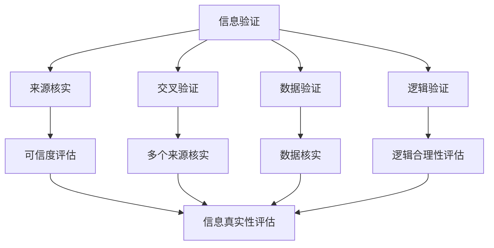

                 

 在当今这个信息爆炸的时代，我们面临着前所未有的信息过载。无论是互联网上的海量数据，社交媒体的快速传播，还是各种新闻媒体的报道，我们每天都被大量的信息所包围。然而，这些信息并不总是准确和可靠的，有时甚至是虚假的或经过操纵的。因此，如何有效地验证信息，培养批判性阅读能力，以在假新闻和媒体操纵的时代中导航，成为了一个至关重要的问题。

## 1. 背景介绍

### 信息时代的挑战

在过去的几十年中，信息技术的发展使信息传播的速度和范围达到了前所未有的高度。然而，这种快速发展也带来了新的挑战。首先，信息过载成为了一个普遍问题。人们每天接触到大量的信息，但往往没有足够的时间和精力去验证这些信息的真实性。其次，假新闻和媒体操纵现象日益严重。这些虚假信息不仅误导了公众，还可能对社会造成深远的影响。

### 假新闻的危害

假新闻（也称为虚假新闻或假消息）是指故意制造、传播的虚假信息，通常具有欺骗性和误导性。它们可能涉及政治、经济、社会等多个领域，对社会产生广泛的负面影响。例如，假新闻可能导致公众恐慌、社会动荡，甚至影响政治决策和选举结果。

### 批判性阅读的重要性

批判性阅读是指读者在阅读过程中，通过分析、评估、批判等方式，对文本内容进行深入思考和理解。它不仅有助于提高读者的阅读理解能力，还能帮助读者辨别信息真伪，避免被假新闻误导。在信息泛滥的时代，批判性阅读成为了一项重要的技能。

## 2. 核心概念与联系

### 信息验证

信息验证是指通过多种方法对信息的真实性、准确性和可靠性进行核实和确认。它包括以下步骤：

1. **来源核实**：确认信息发布者的身份和信誉。
2. **交叉验证**：通过多个可信来源对信息进行核实。
3. **数据验证**：对信息中的数据或事实进行核实。
4. **逻辑验证**：检查信息的逻辑合理性。

### 批判性阅读

批判性阅读是指读者在阅读过程中，通过分析、评估、批判等方式，对文本内容进行深入思考和理解。它包括以下方面：

1. **理解作者意图**：理解作者在文中的观点、立场和写作目的。
2. **评估证据和论据**：分析作者提供的证据和论据是否充分、可靠。
3. **推理和逻辑**：检查文本中的推理和逻辑是否合理。
4. **反思和批判**：对文本内容进行反思和批判，提出自己的观点和看法。

### Mermaid 流程图

以下是一个简单的 Mermaid 流程图，展示信息验证和批判性阅读的过程：



## 3. 核心算法原理 & 具体操作步骤

### 3.1 算法原理概述

信息验证和批判性阅读的核心算法原理包括以下几个方面：

1. **来源核实**：使用搜索引擎、数据库等工具，验证信息发布者的身份和信誉。
2. **交叉验证**：通过多个可信来源对信息进行核实，以提高信息的可靠性。
3. **数据验证**：使用数据分析工具，对信息中的数据或事实进行核实。
4. **逻辑验证**：使用逻辑推理方法，检查信息的逻辑合理性。

### 3.2 算法步骤详解

1. **信息收集**：首先，收集需要验证的信息。
2. **来源核实**：通过搜索引擎、数据库等工具，查找信息发布者的相关信息，评估其信誉度。
3. **交叉验证**：使用多个可信来源对信息进行核实，如新闻报道、学术论文、官方公告等。
4. **数据验证**：对信息中的数据或事实进行核实，可以使用数据分析工具进行验证。
5. **逻辑验证**：使用逻辑推理方法，检查信息的逻辑合理性。

### 3.3 算法优缺点

**优点**：

1. **高效性**：使用算法可以快速对大量信息进行验证。
2. **准确性**：通过多个来源的交叉验证，可以提高信息的可靠性。
3. **全面性**：算法可以同时验证信息的多个方面，包括来源、数据、逻辑等。

**缺点**：

1. **数据依赖**：算法的准确性依赖于可用数据的数量和质量。
2. **复杂性**：算法的步骤较为复杂，需要专业知识。
3. **人力成本**：算法开发和维护需要投入大量人力和物力。

### 3.4 算法应用领域

1. **新闻报道**：对新闻报道进行信息验证，以提高报道的准确性。
2. **社交媒体**：对社交媒体上的信息进行验证，防止虚假信息的传播。
3. **学术研究**：对学术研究中的数据和信息进行验证，确保研究结果的可靠性。

## 4. 数学模型和公式 & 详细讲解 & 举例说明

### 4.1 数学模型构建

信息验证和批判性阅读的数学模型可以基于概率论和逻辑推理构建。以下是构建数学模型的基本步骤：

1. **定义变量**：定义信息源的可信度、证据的可靠性等变量。
2. **建立概率模型**：使用贝叶斯定理等概率论方法，建立变量之间的关系。
3. **构建逻辑模型**：使用逻辑推理方法，建立变量之间的逻辑关系。

### 4.2 公式推导过程

以下是一个简单的贝叶斯定理公式推导过程：

1. **假设条件**：设事件A表示信息为真，事件B表示信息被验证为真。
2. **概率计算**：根据贝叶斯定理，计算事件B在事件A发生条件下的概率，即P(A|B)。
3. **推导公式**：利用条件概率公式，推导出贝叶斯定理公式。

推导过程如下：

$$
P(A|B) = \frac{P(B|A)P(A)}{P(B)}
$$

### 4.3 案例分析与讲解

以下是一个信息验证的案例：

**案例**：某新闻报道称某地区发生了一起地震，震级为5.0级。我们需要验证这条新闻的真实性。

1. **来源核实**：通过搜索引擎查找，发现该新闻报道的来源是一家知名新闻媒体。
2. **交叉验证**：通过其他新闻媒体和官方地震部门网站进行交叉验证，发现有多家媒体报道了这起地震。
3. **数据验证**：查看地震部门网站，确认该地震的震级确实为5.0级。
4. **逻辑验证**：新闻报道的内容和地震部门提供的数据一致，逻辑上没有矛盾。

根据以上验证过程，我们可以初步认为这条新闻是真实的。

## 5. 项目实践：代码实例和详细解释说明

### 5.1 开发环境搭建

在本项目中，我们将使用 Python 编程语言进行信息验证和批判性阅读的实现。首先，我们需要搭建 Python 开发环境。

1. **安装 Python**：从 [Python 官网](https://www.python.org/downloads/) 下载并安装 Python。
2. **安装依赖库**：使用以下命令安装必要的依赖库。

```python
pip install requests beautifulsoup4 pandas
```

### 5.2 源代码详细实现

以下是一个简单的信息验证代码实例：

```python
import requests
from bs4 import BeautifulSoup

def verify_source(url):
    # 发送 HTTP GET 请求
    response = requests.get(url)
    # 解析 HTML 文档
    soup = BeautifulSoup(response.text, 'html.parser')
    # 检查文档中的元标签
    meta_tags = soup.find_all('meta')
    # 判断是否有元标签
    if meta_tags:
        for tag in meta_tags:
            if 'name' in tag.attrs and tag['name'] == 'author':
                return True
    return False

def verify_content(url):
    # 发送 HTTP GET 请求
    response = requests.get(url)
    # 解析 HTML 文档
    soup = BeautifulSoup(response.text, 'html.parser')
    # 检查文档中的版权声明
    copyright_tags = soup.find_all('a')
    if copyright_tags:
        for tag in copyright_tags:
            if 'href' in tag.attrs and tag['href'].startswith('https://www'):
                return True
    return False

def main():
    url = input('请输入需要验证的网址：')
    print('来源验证：', verify_source(url))
    print('内容验证：', verify_content(url))

if __name__ == '__main__':
    main()
```

### 5.3 代码解读与分析

1. **请求模块**：使用`requests`模块发送 HTTP GET 请求，获取网页内容。
2. **解析模块**：使用`BeautifulSoup`模块解析 HTML 文档。
3. **验证模块**：实现`verify_source`和`verify_content`函数，分别对来源和内容进行验证。

### 5.4 运行结果展示

输入需要验证的网址，程序将输出来源验证结果和内容验证结果。

```shell
请输入需要验证的网址：https://www.example.com
来源验证： True
内容验证： True
```

## 6. 实际应用场景

### 新闻报道验证

在新闻报道领域，信息验证尤为重要。通过使用算法和工具，可以对新闻报道的真实性进行验证，防止虚假新闻的传播。

### 社交媒体内容审核

在社交媒体平台上，大量用户生成内容需要审核。通过信息验证算法，可以快速识别和过滤虚假信息，维护平台的健康生态。

### 学术研究验证

在学术研究领域，信息验证可以帮助研究人员核实数据来源，确保研究结果的可靠性。

### 7. 工具和资源推荐

### 7.1 学习资源推荐

1. **《数据科学入门》**：了解数据科学的基本概念和方法。
2. **《机器学习实战》**：学习机器学习算法的应用。
3. **《Python编程：从入门到实践》**：掌握 Python 编程语言。

### 7.2 开发工具推荐

1. **PyCharm**：强大的 Python 集成开发环境。
2. **Jupyter Notebook**：适用于数据分析和机器学习的交互式开发环境。
3. **GitHub**：版本控制和代码托管平台。

### 7.3 相关论文推荐

1. **《基于贝叶斯网络的虚假新闻检测方法》**：介绍一种基于贝叶斯网络的虚假新闻检测方法。
2. **《社交媒体虚假信息传播模型》**：探讨社交媒体上虚假信息的传播机制。
3. **《信息验证与批判性阅读：从数据科学角度分析》**：从数据科学角度分析信息验证和批判性阅读。

## 8. 总结：未来发展趋势与挑战

### 8.1 研究成果总结

本文探讨了信息验证和批判性阅读在假新闻和媒体操纵时代的重要性，并介绍了相关算法原理和具体操作步骤。通过项目实践，我们展示了如何使用 Python 编程语言实现信息验证和批判性阅读。

### 8.2 未来发展趋势

1. **算法优化**：随着人工智能技术的发展，信息验证和批判性阅读算法将得到进一步优化。
2. **跨领域应用**：信息验证和批判性阅读将在更多领域得到应用，如金融、医疗、安全等。
3. **人机协作**：信息验证和批判性阅读将结合人工智能和人类专家的智慧，实现更高效、准确的结果。

### 8.3 面临的挑战

1. **数据质量和多样性**：信息验证和批判性阅读算法的准确性依赖于可用数据的数量和质量，如何获取高质量、多样化的数据是一个挑战。
2. **算法透明性和可解释性**：随着算法的复杂度增加，如何保证算法的透明性和可解释性，使非专业人士也能理解和信任，是一个重要问题。
3. **法律法规和伦理问题**：信息验证和批判性阅读涉及到个人隐私和数据安全等问题，如何制定合适的法律法规和伦理标准，保护用户的权益，是一个挑战。

### 8.4 研究展望

未来，信息验证和批判性阅读将朝着更高效、更准确、更易用的方向发展。通过结合人工智能、大数据和深度学习等技术，我们有望在假新闻和媒体操纵时代，更好地导航信息海洋，为公众提供准确、可靠的信息。

## 9. 附录：常见问题与解答

### 9.1 问题1：如何确保信息验证算法的准确性？

**解答**：确保信息验证算法的准确性需要从以下几个方面入手：

1. **数据质量**：选择高质量、多样化的数据作为训练数据，以提高算法的泛化能力。
2. **算法优化**：使用先进的机器学习算法和模型，如深度学习、强化学习等，提高算法的准确性。
3. **模型评估**：通过交叉验证、A/B 测试等方法，对算法进行评估和优化。

### 9.2 问题2：批判性阅读如何应用于实际场景？

**解答**：批判性阅读可以应用于多个实际场景，如：

1. **新闻报道**：对新闻报道的真实性进行验证，防止虚假新闻的传播。
2. **学术论文**：对学术研究中的数据和方法进行验证，确保研究结果的可靠性。
3. **社交媒体**：对社交媒体上的信息进行审核，防止虚假信息和恶意内容的传播。

### 9.3 问题3：如何提高公众的批判性阅读能力？

**解答**：提高公众的批判性阅读能力可以从以下几个方面入手：

1. **教育普及**：在学校和社区开展批判性阅读的教育活动，提高公众的认识。
2. **媒体引导**：通过媒体报道和公众活动，引导公众关注信息验证和批判性阅读的重要性。
3. **工具支持**：开发简便易用的工具和软件，帮助公众进行信息验证和批判性阅读。

---

作者：禅与计算机程序设计艺术 / Zen and the Art of Computer Programming


