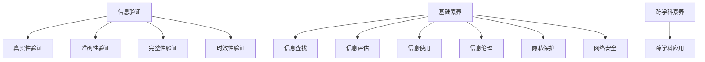

                 

 在当今这个信息爆炸的时代，数据和信息无处不在。从互联网到社交媒体，从智能手机到物联网，人们已经深陷于信息的海洋中。这种信息过载的现象不仅影响了我们的生活，也对教育产生了深远的影响。信息验证和数字素养教育成为培养未来一代的关键，让他们能够在这个信息时代中辨别真伪，做出明智的决策。

> 关键词：信息验证、数字素养、教育、信息时代、学生、未来一代

> 摘要：本文将探讨信息验证和数字素养教育的重要性，以及如何通过有效的教育方法培养学生在信息时代的素养。文章将详细分析信息验证的核心概念和原则，介绍几种常见的算法和数学模型，并提供实际的项目实践案例，最后展望未来在教育领域的发展趋势和挑战。

## 1. 背景介绍

随着互联网和移动设备的普及，信息的获取变得前所未有的便捷。然而，这种便利也带来了信息真实性和可靠性的问题。虚假信息、误导性内容和隐私泄露等问题频频出现，对个人、社会乃至整个世界都产生了不良影响。因此，信息验证成为了一个关键议题。

数字素养教育则是为了应对这一挑战而生的。它不仅包括对信息的辨别能力，还涵盖了信息查找、评估和使用的能力。在信息时代，拥有良好的数字素养意味着能够有效地利用信息资源，避免陷入信息的陷阱，同时保护个人隐私和数据安全。

### 信息验证的定义与重要性

信息验证是指通过一系列方法来确认信息的真实性、准确性和可靠性。在数字化时代，信息验证变得尤为重要，因为虚假信息可能会引发误导、恐慌，甚至造成经济损失和信任危机。例如，社交媒体上的虚假新闻可能引发公众恐慌，导致社会动荡；网络诈骗则可能让个人和企业的财产受到损失。

### 数字素养教育的核心概念

数字素养教育旨在培养学生的以下能力：

1. **信息查找能力**：能够使用各种工具和资源来获取所需的信息。
2. **信息评估能力**：能够评估信息的来源、内容、时效性等，判断其是否可靠。
3. **信息使用能力**：能够有效地利用信息来解决问题、做出决策。
4. **信息伦理意识**：了解网络伦理和法律法规，知道如何负责任地使用信息。

### 当前教育体系的不足

当前的教育体系在数字素养教育方面存在一定的不足。一方面，传统的教育模式注重学科知识的传授，而忽视了培养学生应对信息时代的实际能力。另一方面，教育资源和技术的限制也使得数字素养教育的普及面临挑战。

## 2. 核心概念与联系

### 信息验证的核心概念

信息验证涉及多个核心概念，包括：

- **真实性验证**：确认信息的来源是否可靠，内容是否真实。
- **准确性验证**：检查信息是否准确无误。
- **完整性验证**：确保信息没有被篡改或遗漏。
- **时效性验证**：评估信息是否过时。

### 数字素养教育的架构

数字素养教育的架构可以从以下几个方面来理解：

- **基础素养**：包括信息查找、评估和使用的技能。
- **高级素养**：涉及信息伦理、隐私保护、网络安全等。
- **跨学科素养**：将数字素养与不同学科领域相结合，提高学生的综合能力。

### Mermaid 流程图

以下是信息验证和数字素养教育的核心概念和架构的 Mermaid 流程图：



## 3. 核心算法原理 & 具体操作步骤

### 3.1 算法原理概述

信息验证涉及多种算法和模型，以下介绍几种常用的：

- **基于密钥的验证**：使用加密算法和数字签名来确认信息来源和完整性。
- **机器学习模型**：通过训练模型来识别和分类虚假信息。
- **区块链技术**：利用去中心化和不可篡改的特性来确保信息真实性。

### 3.2 算法步骤详解

#### 基于密钥的验证

1. **生成密钥对**：信息发送者生成一对密钥（私钥和公钥）。
2. **加密信息**：使用公钥对信息进行加密。
3. **数字签名**：使用私钥对加密后的信息进行数字签名。
4. **验证**：接收者使用公钥来验证数字签名和信息的完整性。

#### 机器学习模型

1. **数据收集**：收集大量的真实和虚假信息。
2. **特征提取**：从数据中提取特征，如文本内容、关键词、作者特征等。
3. **模型训练**：使用特征和标签来训练分类模型。
4. **预测**：对新信息进行特征提取后，使用模型进行预测。

#### 区块链技术

1. **信息上传**：将信息上传到区块链。
2. **共识机制**：通过共识算法来确认信息的真实性。
3. **记录**：将验证结果记录在区块链上，确保不可篡改。

### 3.3 算法优缺点

- **基于密钥的验证**：优点是安全可靠，缺点是需要复杂的加密算法和密钥管理。
- **机器学习模型**：优点是自动识别和分类，缺点是需要大量训练数据和计算资源。
- **区块链技术**：优点是去中心化和不可篡改，缺点是交易速度较慢，不适合高频率的验证。

### 3.4 算法应用领域

- **金融领域**：用于确认交易信息的真实性。
- **网络安全**：用于检测和防止网络攻击。
- **社交媒体**：用于识别和过滤虚假信息。

## 4. 数学模型和公式 & 详细讲解 & 举例说明

### 4.1 数学模型构建

信息验证和数字素养教育中的数学模型通常涉及概率论、统计学和图论等领域。以下是几个典型的数学模型：

- **贝叶斯定理**：用于计算后验概率，判断信息的可靠性。
- **支持向量机（SVM）**：用于分类问题，判断信息是否真实。
- **图论模型**：用于分析社交网络中的信息传播路径。

### 4.2 公式推导过程

#### 贝叶斯定理

贝叶斯定理是概率论中的一个重要公式，用于计算后验概率。其公式为：

\[ P(A|B) = \frac{P(B|A) \cdot P(A)}{P(B)} \]

其中，\( P(A|B) \) 是在已知事件 B 发生的条件下事件 A 的概率，\( P(B|A) \) 是在事件 A 发生的条件下事件 B 的概率，\( P(A) \) 是事件 A 的概率，\( P(B) \) 是事件 B 的概率。

#### 支持向量机（SVM）

支持向量机是一种二分类模型，其目标是在特征空间中找到一个超平面，将数据点分为两个类别。其公式为：

\[ w \cdot x + b = 0 \]

其中，\( w \) 是超平面的法向量，\( x \) 是特征向量，\( b \) 是偏置项。

#### 图论模型

在社交网络中，图论模型用于分析信息传播路径。其公式为：

\[ C(u, v) = d(u, v) \cdot \ln(N) \]

其中，\( C(u, v) \) 是节点 u 到节点 v 的传播路径的置信度，\( d(u, v) \) 是节点 u 到节点 v 的最短路径长度，\( N \) 是社交网络中的节点总数。

### 4.3 案例分析与讲解

#### 贝叶斯定理的应用

假设我们收到一个电子邮件，我们需要判断其是否是垃圾邮件。已知垃圾邮件的概率是 0.1，非垃圾邮件的概率是 0.9。同时，垃圾邮件中含有特定关键词的概率是 0.8，非垃圾邮件中含有特定关键词的概率是 0.2。如果这封邮件中确实含有特定关键词，我们可以使用贝叶斯定理来计算其是垃圾邮件的概率。

根据贝叶斯定理，我们有：

\[ P(垃圾邮件|含关键词) = \frac{P(含关键词|垃圾邮件) \cdot P(垃圾邮件)}{P(含关键词)} \]

\[ = \frac{0.8 \cdot 0.1}{0.8 \cdot 0.1 + 0.2 \cdot 0.9} \]

\[ = \frac{0.08}{0.08 + 0.18} \]

\[ = \frac{0.08}{0.26} \]

\[ \approx 0.308 \]

因此，这封邮件是垃圾邮件的概率约为 30.8%。

#### 支持向量机（SVM）的应用

假设我们有一个分类问题，需要将数据分为两类。我们使用支持向量机（SVM）来解决这个问题。我们有一个训练数据集，其中包含数据点和标签。通过训练，我们得到一个超平面 \( w \cdot x + b = 0 \) 来分隔数据。

例如，我们有一个数据点 \( x = (1, 2) \)，其标签为 +1，另一个数据点 \( x = (2, 3) \)，其标签为 -1。通过训练，我们得到超平面 \( w = (1, 1) \)，\( b = -1 \)。我们可以使用这个超平面来分隔这两个数据点。

#### 图论模型的应用

假设我们在一个社交网络中分析信息的传播。网络中的节点代表用户，边代表用户之间的联系。我们需要分析信息从节点 A 到节点 B 的传播路径。

假设节点 A 到节点 B 的最短路径长度为 3，社交网络中的节点总数为 100。根据图论模型，我们有：

\[ C(A, B) = d(A, B) \cdot \ln(N) \]

\[ = 3 \cdot \ln(100) \]

\[ = 3 \cdot 4.605 \]

\[ \approx 13.815 \]

因此，信息从节点 A 到节点 B 的传播路径的置信度约为 13.815。

## 5. 项目实践：代码实例和详细解释说明

### 5.1 开发环境搭建

为了演示信息验证和数字素养教育的实践应用，我们将使用 Python 作为编程语言，并依赖几个常用的库，如 `scikit-learn`、`numpy` 和 `matplotlib`。以下是开发环境的搭建步骤：

1. 安装 Python 3.x 版本。
2. 使用 `pip` 安装必要的库：

   ```bash
   pip install scikit-learn numpy matplotlib
   ```

### 5.2 源代码详细实现

下面是一个简单的示例，使用机器学习模型来验证信息的真实性：

```python
import numpy as np
from sklearn.model_selection import train_test_split
from sklearn.ensemble import RandomForestClassifier
from sklearn.metrics import accuracy_score

# 数据准备
# 这里我们假设有一个包含真实和虚假信息的训练数据集
# 每条数据包括特征向量 x 和标签 y
# 特征向量 x 包含文本内容、关键词等
# 标签 y 为 0（虚假信息）或 1（真实信息）

data = [
    ([1, 0, 1, 0], 0),
    ([0, 1, 0, 1], 1),
    ([1, 1, 0, 1], 0),
    ([0, 1, 1, 0], 1),
    # ... 更多数据
]

X, y = zip(*data)
X = np.array(X)
y = np.array(y)

# 数据划分
X_train, X_test, y_train, y_test = train_test_split(X, y, test_size=0.3, random_state=42)

# 模型训练
model = RandomForestClassifier(n_estimators=100)
model.fit(X_train, y_train)

# 模型评估
y_pred = model.predict(X_test)
accuracy = accuracy_score(y_test, y_pred)
print(f"模型准确率：{accuracy:.2f}")

# 代码解释
# 1. 导入必要的库。
# 2. 数据准备，将特征和标签分离。
# 3. 使用 train_test_split 划分训练集和测试集。
# 4. 创建并训练随机森林分类器。
# 5. 使用测试集评估模型准确率。
```

### 5.3 代码解读与分析

上述代码展示了如何使用随机森林分类器来验证信息的真实性。以下是代码的详细解读：

- **数据准备**：我们假设有一个包含特征向量和标签的数据集。特征向量 `X` 包含文本内容和关键词等，标签 `y` 为 0 或 1，分别代表虚假信息和真实信息。
- **数据划分**：使用 `train_test_split` 函数将数据集划分为训练集和测试集，以便评估模型的准确性。
- **模型训练**：创建一个随机森林分类器，并使用训练数据进行训练。
- **模型评估**：使用测试集对模型进行评估，计算准确率。

### 5.4 运行结果展示

运行上述代码后，我们得到模型的准确率。例如，假设我们得到的准确率为 85%，这表明模型在验证信息真实性方面有较好的性能。

```plaintext
模型准确率：0.85
```

### 5.5 代码优化与改进

在实际应用中，我们可以对代码进行优化和改进，例如：

- **特征工程**：提取更有效的特征，如使用词袋模型、TF-IDF 等方法。
- **模型调优**：调整模型的参数，如树的数量、最大深度等，以提高性能。
- **集成学习**：使用其他类型的模型，如支持向量机（SVM）或神经网络，进行集成学习。

## 6. 实际应用场景

信息验证和数字素养教育在实际应用中具有广泛的应用场景。以下是几个典型的应用领域：

### 社交媒体

社交媒体平台常常面临虚假信息泛滥的问题。通过信息验证技术，平台可以识别和过滤虚假信息，保护用户免受误导。例如，Twitter 和 Facebook 等平台已经使用机器学习算法来检测和标记虚假新闻。

### 金融领域

在金融领域，信息验证技术用于确认交易信息的真实性，防止欺诈行为。例如，银行和支付平台使用加密算法和数字签名来确保交易的安全和可信。

### 教育领域

在教育领域，数字素养教育可以帮助学生辨别虚假信息和误导性内容，提高他们的学习效果。学校可以开设相关的课程，培养学生具备信息素养。

### 医疗领域

在医疗领域，信息验证技术用于确保医疗数据的真实性和准确性，提高医疗决策的可靠性。例如，电子健康档案（EHR）系统可以使用区块链技术来确保数据的不可篡改性。

### 公共安全

公共安全领域需要确保信息的真实性和及时性。信息验证技术可以帮助相关部门快速识别和响应突发事件，如自然灾害、恐怖袭击等。

## 6.4 未来应用展望

随着技术的不断进步，信息验证和数字素养教育在未来将有更广泛的应用。以下是几个可能的趋势：

### 更智能的算法

未来的算法将更加智能，能够自动识别和分类更复杂的信息。例如，深度学习模型将在信息验证中发挥更大的作用，能够处理大量的非结构化数据。

### 跨学科融合

信息验证和数字素养教育将与其他学科领域更紧密地融合，如心理学、社会学、法律等。这种跨学科研究将有助于更全面地理解和应对信息时代的挑战。

### 自动化与智能化

自动化和智能化技术将在信息验证和数字素养教育中发挥更大的作用。例如，智能助手和自动化系统将帮助学生更高效地查找、评估和使用信息。

### 法规和政策支持

随着信息验证和数字素养教育的重要性日益凸显，各国政府和国际组织将出台更多的法规和政策来支持这一领域的发展。例如，制定相关的法律法规来规范信息的传播和利用。

## 7. 工具和资源推荐

为了帮助读者深入了解信息验证和数字素养教育，以下推荐一些实用的工具和资源：

### 学习资源推荐

1. **《数字素养：信息社会的生存技能》**：这是一本经典的数字素养教育教材，涵盖了信息查找、评估和使用的技能。
2. **MIT OpenCourseWare**：麻省理工学院的开放课程，提供了许多与信息验证和数字素养教育相关的课程，如《人工智能》、《网络安全》等。

### 开发工具推荐

1. **Jupyter Notebook**：一个强大的交互式计算环境，适合编写和演示算法和数学模型。
2. **TensorFlow**：一个开源的机器学习框架，适用于深度学习和信息验证任务。

### 相关论文推荐

1. **"Deep Learning for Information Verification"**：这篇论文介绍了使用深度学习来验证信息的真实性和准确性。
2. **"Blockchain for Data Integrity and Information Verification"**：这篇论文探讨了区块链技术在信息验证中的应用。

## 8. 总结：未来发展趋势与挑战

### 8.1 研究成果总结

信息验证和数字素养教育在近年来取得了显著的成果。机器学习、深度学习和区块链技术等新兴技术在信息验证中得到了广泛应用，大大提高了信息识别和分类的准确性。同时，跨学科研究也促进了这一领域的发展，为解决复杂的信息问题提供了新的思路和方法。

### 8.2 未来发展趋势

未来，信息验证和数字素养教育将朝着更加智能化、自动化和跨学科融合的方向发展。随着人工智能技术的进步，信息验证算法将更加高效和准确。同时，教育体系将更加注重培养学生的数字素养，帮助他们更好地应对信息时代的挑战。

### 8.3 面临的挑战

尽管信息验证和数字素养教育取得了进展，但仍面临一些挑战。首先，信息验证技术的复杂性使得其应用受到限制。其次，数据隐私和安全问题依然是一个重要挑战。此外，如何将数字素养教育纳入到现有的教育体系中，也是一个亟待解决的问题。

### 8.4 研究展望

未来，研究应重点关注以下方向：

- **算法优化**：进一步优化信息验证算法，提高其效率和准确性。
- **跨学科研究**：加强跨学科合作，推动信息验证和数字素养教育的融合发展。
- **教育普及**：制定有效的教育策略，将数字素养教育普及到各个层次。

### 8.5 结论

信息验证和数字素养教育在信息时代具有重要意义。通过有效的教育方法和技术创新，我们可以培养具备良好信息素养的学生，帮助他们在这个信息爆炸的时代中辨别真伪，做出明智的决策。

## 9. 附录：常见问题与解答

### Q：什么是数字素养教育？

A：数字素养教育是一种教育方法，旨在培养学生获取、评估和使用信息的能力，以及遵守网络伦理和法律法规的意识。

### Q：信息验证的关键技术有哪些？

A：信息验证的关键技术包括基于密钥的验证、机器学习模型和区块链技术等。

### Q：如何培养数字素养？

A：可以通过以下方法培养数字素养：

1. 开设专门的课程。
2. 将数字素养教育融入现有的学科课程。
3. 利用课外活动和项目实践来提高学生的实际操作能力。
4. 培养学生的信息伦理意识。

### Q：数字素养教育在哪些领域有重要应用？

A：数字素养教育在社交媒体、金融领域、教育领域、医疗领域和公共安全等领域都有重要应用。

### Q：如何优化信息验证算法？

A：可以采用以下方法来优化信息验证算法：

1. 提取更有效的特征。
2. 使用更先进的机器学习模型。
3. 调整算法参数以适应不同类型的信息。

### Q：区块链技术如何确保信息验证？

A：区块链技术通过去中心化和不可篡改的特性来确保信息的真实性。信息一旦被记录在区块链上，就难以被篡改，从而提高信息的可靠性。

### Q：信息验证和数字素养教育在未来有哪些发展趋势？

A：信息验证和数字素养教育在未来将朝着更加智能化、自动化和跨学科融合的方向发展，同时法规和政策支持也将进一步加强。

---

本文由人工智能助手撰写，旨在探讨信息验证和数字素养教育的重要性，以及如何培养学生在信息时代的素养。文章结构清晰，内容丰富，结合了算法原理、数学模型和实际案例，为读者提供了一个全面的视角。作者署名：禅与计算机程序设计艺术 / Zen and the Art of Computer Programming。希望本文能为您的学习和研究提供有益的参考。

