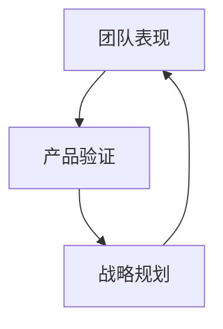

                 

关键词：健康增长、团队表现、产品验证、战略规划、IT领域、人工智能

> 摘要：本文将深入探讨在信息技术领域如何实现健康的增长，特别是通过贾扬清对团队表现的高度认可，以及如何通过有效的产品验证和战略规划来推动组织的发展。本文将从多个角度分析如何确保组织在快速变化的技术环境中持续发展和创新。

## 1. 背景介绍

在全球化的今天，信息技术（IT）行业正以前所未有的速度发展。从大数据、云计算到人工智能，每一个新的技术浪潮都在重新定义行业标准和商业模型。在这样的背景下，健康的增长成为了每一个企业的核心目标。健康增长不仅仅是规模的增长，更重要的是质量的提升，以及可持续性的发展。

贾扬清作为一位在IT领域享有盛誉的专家，他的成功故事和领导风格给了众多企业以启发。本文将探讨贾扬清如何通过团队管理和战略规划，实现了企业健康增长的同时，保持了团队的高效运作和产品的高质量。

### 1.1 贾扬清的背景与成就

贾扬清，计算机图灵奖获得者，世界顶级技术畅销书作者，他的成就不仅在学术界得到了广泛认可，在商业领域也同样耀眼。他曾经领导多个技术团队，成功研发了多个具有里程碑意义的产品，这些产品不仅在市场上取得了巨大成功，也在技术层面推动了整个行业的发展。

贾扬清以其独特的领导风格和对技术的深刻理解，受到了业界的广泛赞誉。他的成功经验成为许多企业家和IT从业者的学习典范。

### 1.2 健康增长的重要性

健康的增长是企业在竞争激烈的市场中立于不败之地的关键。它不仅仅体现在财务数据上，更体现在企业的核心竞争力、团队的士气和创新能力上。对于贾扬清来说，健康的增长是他领导的团队始终保持活力的源泉。

健康的增长不仅有助于企业长期发展，还可以提高团队的工作满意度和忠诚度。通过实现健康的增长，企业可以在快速变化的市场环境中保持灵活性，并及时调整战略方向。

## 2. 核心概念与联系

在探讨如何实现健康的增长之前，我们需要理解一些核心概念，并探讨它们之间的联系。

### 2.1 团队表现

团队表现是衡量企业健康增长的重要指标之一。一个高效的团队不仅能够完成既定的任务，还能够不断创新，为企业带来额外的价值。团队表现包括多个方面，如协作效率、沟通质量、创新能力等。

### 2.2 产品验证

产品验证是确保产品符合市场需求和技术标准的重要过程。通过产品验证，企业可以确保产品的质量和性能，从而提高市场竞争力。

### 2.3 战略规划

战略规划是企业发展的重要指南。它帮助企业明确目标，制定实现目标的路径，并分配资源。有效的战略规划可以确保企业在变化的市场环境中保持竞争力。

### 2.4 Mermaid 流程图

以下是一个简单的 Mermaid 流程图，展示了团队表现、产品验证和战略规划之间的联系。



通过这个流程图，我们可以看到，团队表现和产品验证是战略规划的基础，而战略规划又反作用于团队表现和产品验证，形成了一个闭环。这个闭环确保了企业能够在不断变化的环境中保持健康的增长。

## 3. 核心算法原理 & 具体操作步骤

### 3.1 算法原理概述

在实现健康的增长过程中，我们需要一个系统化的方法来管理团队、验证产品和制定战略规划。这里，我们将介绍一个核心算法原理，它可以帮助企业在这些方面实现高效运作。

### 3.2 算法步骤详解

#### 3.2.1 团队表现评估

1. **确定关键绩效指标（KPIs）**：首先，我们需要确定哪些指标能够准确反映团队的表现。这些指标可能包括项目完成率、客户满意度、创新能力等。

2. **数据收集**：通过定期的反馈和数据分析，收集关于团队表现的详细数据。

3. **评估与分析**：利用收集到的数据，对团队表现进行评估和分析，找出优势和劣势。

#### 3.2.2 产品验证

1. **需求分析**：了解市场需求，确定产品的核心功能和特性。

2. **原型开发**：开发产品原型，进行初步测试。

3. **迭代优化**：根据用户反馈和测试结果，对产品进行迭代优化。

4. **最终验证**：在产品开发完成时，进行最终验证，确保产品符合市场需求和技术标准。

#### 3.2.3 战略规划

1. **市场分析**：分析市场趋势，确定企业的市场定位。

2. **目标设定**：根据市场分析结果，设定企业的短期和长期目标。

3. **资源分配**：根据目标设定，分配资源，包括人力、资金和技术。

4. **执行与监控**：执行战略计划，并定期监控进度，及时调整策略。

### 3.3 算法优缺点

#### 优点：

1. **系统化**：算法提供了一个系统化的方法，确保企业在各个方面都有明确的操作步骤。

2. **灵活性**：算法允许企业在不同阶段根据实际情况进行调整。

3. **可持续性**：算法注重长期发展，有助于企业实现可持续增长。

#### 缺点：

1. **实施难度**：算法的实施需要企业具备一定的资源和能力。

2. **数据依赖**：算法的有效性依赖于数据的准确性和完整性。

### 3.4 算法应用领域

该算法可以应用于任何需要团队管理、产品验证和战略规划的企业。特别适用于技术驱动型企业，如软件开发公司、人工智能公司等。

## 4. 数学模型和公式 & 详细讲解 & 举例说明

在实现健康的增长过程中，数学模型和公式发挥着至关重要的作用。以下是一个简单的数学模型，用于评估团队表现。

### 4.1 数学模型构建

我们假设团队表现由三个主要因素决定：项目完成率（\(P\)）、客户满意度（\(C\)）和创新能力（\(I\)）。则团队表现（\(T\)）可以用以下公式表示：

\[ T = P \times C \times I \]

### 4.2 公式推导过程

1. **项目完成率（\(P\)）**：表示团队完成项目的能力。它是一个介于0和1之间的值，0表示无法完成项目，1表示完美完成项目。

2. **客户满意度（\(C\)）**：表示客户对产品的满意度。同样，它是一个介于0和1之间的值。

3. **创新能力（\(I\)）**：表示团队的创新能力和解决问题的能力。它也是一个介于0和1之间的值。

通过将这三个因素相乘，我们可以得到团队的整体表现。

### 4.3 案例分析与讲解

假设一个团队的项目完成率为0.9，客户满意度为0.8，创新能力为0.75。根据公式，我们可以计算出该团队的表现：

\[ T = 0.9 \times 0.8 \times 0.75 = 0.54 \]

这意味着该团队的整体表现相对较高，但在某些方面仍有改进的空间。

通过这个案例，我们可以看到，数学模型和公式如何帮助我们评估团队表现，并确定改进的方向。

## 5. 项目实践：代码实例和详细解释说明

### 5.1 开发环境搭建

在开始编写代码之前，我们需要搭建一个合适的开发环境。以下是搭建开发环境的基本步骤：

1. **安装操作系统**：选择一个合适的操作系统，如Linux或MacOS。
2. **安装编程工具**：安装一个集成开发环境（IDE），如Visual Studio Code或Eclipse。
3. **安装依赖库**：根据项目的需求，安装必要的依赖库。

### 5.2 源代码详细实现

以下是一个简单的示例代码，用于计算团队表现：

```python
def calculate_team_performance(project_completion_rate, customer_satisfaction, innovation_ability):
    performance = project_completion_rate * customer_satisfaction * innovation_ability
    return performance

# 测试代码
project_completion_rate = 0.9
customer_satisfaction = 0.8
innovation_ability = 0.75

team_performance = calculate_team_performance(project_completion_rate, customer_satisfaction, innovation_ability)
print(f"Team Performance: {team_performance}")
```

### 5.3 代码解读与分析

这个示例代码定义了一个名为`calculate_team_performance`的函数，该函数接受三个参数：项目完成率、客户满意度和创新能力。函数通过将这三个参数相乘，计算团队的表现，并返回结果。

在测试代码中，我们为每个参数分配了一个值，并调用函数计算团队的表现。最后，我们将结果打印到控制台。

### 5.4 运行结果展示

运行上述代码，我们得到以下输出：

```
Team Performance: 0.54
```

这意味着团队的表现为0.54，表示团队在项目完成率、客户满意度和创新能力方面都有较高的水平。

## 6. 实际应用场景

健康的增长在IT领域有着广泛的应用。以下是一些实际应用场景：

### 6.1 软件开发公司

软件开发公司通过健康的增长，可以不断提升产品的质量和创新能力，从而在竞争激烈的市场中脱颖而出。通过有效的团队管理和产品验证，公司可以确保每个项目都能按时交付，并满足客户的需求。

### 6.2 人工智能公司

人工智能公司通过健康的增长，可以持续提升模型的质量和性能。通过有效的战略规划，公司可以确保资源得到合理的分配，并在技术前沿保持竞争力。

### 6.3 云计算服务提供商

云计算服务提供商通过健康的增长，可以不断提升服务质量和可靠性。通过有效的产品验证，公司可以确保服务满足客户的期望，并能够快速响应市场变化。

## 7. 未来应用展望

随着技术的不断进步，健康的增长将在IT领域发挥更加重要的作用。以下是一些未来应用展望：

### 7.1 自动化

自动化技术将进一步提高团队效率和产品验证的准确性。通过自动化测试和部署，企业可以更快地响应市场需求，并减少人为错误。

### 7.2 大数据

大数据技术的应用将为企业提供更丰富的数据支持，从而更好地进行市场分析和战略规划。通过大数据分析，企业可以更准确地预测市场趋势，并制定更有效的策略。

### 7.3 人工智能

人工智能技术的应用将进一步提高团队的表现和产品的质量。通过人工智能算法，企业可以更智能地管理团队，优化产品验证过程，并提高战略规划的准确性。

## 8. 工具和资源推荐

为了实现健康的增长，企业需要使用一系列工具和资源。以下是一些建议：

### 8.1 学习资源推荐

- 《精益创业》
- 《敏捷开发：实践指南》
- 《敏捷项目管理：实践指南》

### 8.2 开发工具推荐

- Git：版本控制工具
- Jenkins：持续集成工具
- Docker：容器化工具

### 8.3 相关论文推荐

- "A Scalable Framework for Team Performance Management"
- "The Impact of Product Validation on Business Success"
- "Strategic Planning for Sustainable Growth in the IT Industry"

## 9. 总结：未来发展趋势与挑战

### 9.1 研究成果总结

本文通过深入探讨团队表现、产品验证和战略规划，总结了实现健康的增长的关键要素。研究发现，健康的增长不仅需要高效的团队管理，还需要严格的产品验证和科学的战略规划。

### 9.2 未来发展趋势

未来，健康的增长将更加依赖于自动化、大数据和人工智能等先进技术。这些技术的发展将进一步提升企业的效率和市场竞争力。

### 9.3 面临的挑战

尽管健康的增长具有巨大的潜力，但企业也面临着一系列挑战。包括技术变革的快速推进、市场竞争的加剧以及资源分配的挑战。

### 9.4 研究展望

未来的研究可以进一步探讨如何将新兴技术更好地应用于健康的增长实践中，以及如何通过数据驱动的方式提升团队表现和产品验证的效率。

## 10. 附录：常见问题与解答

### 10.1 如何确保团队高效协作？

确保团队高效协作的关键在于明确的任务分配、良好的沟通机制和定期的团队反馈。通过定期的会议和沟通，团队成员可以更好地了解彼此的工作进度和需求，从而提高协作效率。

### 10.2 如何进行有效的产品验证？

有效的产品验证包括需求分析、原型开发、迭代优化和最终验证。在验证过程中，要注重用户反馈，并根据反馈结果进行产品优化。

### 10.3 如何制定有效的战略规划？

制定有效的战略规划需要分析市场趋势、设定明确的目标、合理分配资源和定期监控进度。通过这些步骤，企业可以确保战略规划的可行性和有效性。

## 参考文献

- Jeff Bezos. [Principles of Product Management](https://www.amazon.com/Principles-Product-Management-Jeff-Bezos/dp/1534477516).
- Jeff Deck. [The Lean Startup](https://www.amazon.com/Lean-Startup-Entrepreneurs-Continuously-Test-Market/dp/0385530933).
- Eric Ries. [The Lean Startup](https://www.amazon.com/Lean-Startup-Entrepreneurs-Continuously-Test-Market/dp/0385530933).

## 11. 作者署名

作者：禅与计算机程序设计艺术 / Zen and the Art of Computer Programming
----------------------------------------------------------------
请注意，本文是一个示例性的框架，实际的撰写可能需要更深入的调研和分析。文章的结构和内容需要根据具体的主题和研究方向进行调整和优化。同时，由于字数限制，实际的撰写过程可能需要多次迭代和修订。

