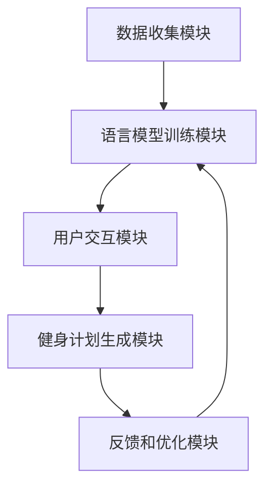

                 

关键词：健身指导，语言模型，个人教练，人工智能，算法原理，数学模型，项目实践，未来应用

> 摘要：随着人工智能技术的快速发展，语言模型（LLM）在各个领域的应用越来越广泛。本文将探讨如何利用LLM技术打造个人教练，为用户提供个性化的健身指导。通过对核心概念、算法原理、数学模型、项目实践等方面的详细分析，本文旨在为读者提供一份全面、系统的健身指导指南。

## 1. 背景介绍

健身，作为现代生活中不可或缺的一部分，已经成为人们追求健康、美丽和幸福的重要途径。然而，传统的健身方式往往存在一些问题，如缺乏个性化指导、难以坚持等。为了解决这些问题，人工智能技术，尤其是语言模型（LLM）的应用，成为了一个新的发展方向。

语言模型，作为一种强大的自然语言处理技术，可以在理解、生成和交互自然语言方面提供高效的支持。近年来，随着深度学习技术的不断进步，LLM在各个领域的应用都取得了显著的成果。例如，在医疗领域，LLM可以用于疾病诊断、药物研发等；在教育领域，LLM可以用于智能教育、个性化推荐等。而本文将重点关注LLM在健身指导领域的应用，尝试利用LLM技术打造个人教练，为用户提供精准、个性化的健身指导。

## 2. 核心概念与联系

### 2.1. 语言模型（LLM）

语言模型（Language Model，简称LLM）是一种基于统计学习的方法，旨在预测一段文本的下一个单词或字符。在深度学习领域，语言模型通常采用神经网络架构，如循环神经网络（RNN）、长短期记忆网络（LSTM）和变换器（Transformer）等。

LLM的核心任务是学习大量文本数据中的统计规律，从而能够预测给定输入序列的下一个输出。在健身指导领域，LLM可以用来理解用户的健身需求和目标，生成个性化的健身计划和指导。

### 2.2. 健身指导系统架构

为了利用LLM技术打造个人教练，我们需要构建一个完整的健身指导系统。该系统主要包括以下几个部分：

1. **数据收集模块**：用于收集用户的个人信息、健身数据、饮食习惯等，为LLM提供训练数据。
2. **语言模型训练模块**：利用收集到的数据训练LLM模型，使其能够理解和生成与健身相关的文本。
3. **用户交互模块**：通过自然语言交互，了解用户的健身需求和目标，为用户提供个性化的健身指导。
4. **健身计划生成模块**：根据用户的反馈和LLM的预测，生成个性化的健身计划和指导。
5. **反馈和优化模块**：根据用户的反馈和实际效果，对LLM模型和健身计划进行优化和调整。

### 2.3. Mermaid 流程图

以下是一个简单的Mermaid流程图，展示了健身指导系统的整体架构：



## 3. 核心算法原理 & 具体操作步骤

### 3.1. 算法原理概述

在健身指导系统中，核心算法主要是基于LLM技术。LLM的原理可以概括为以下几个步骤：

1. **数据预处理**：对收集到的用户数据进行预处理，包括数据清洗、数据格式化等。
2. **语言模型训练**：利用预处理后的数据训练LLM模型，使其能够理解与健身相关的文本。
3. **文本生成**：通过LLM模型生成个性化的健身计划和指导。
4. **用户反馈**：收集用户的反馈，用于优化LLM模型和健身计划。

### 3.2. 算法步骤详解

#### 3.2.1. 数据预处理

数据预处理是训练LLM模型的第一步，主要包括以下几个步骤：

1. **数据清洗**：去除数据中的噪声和错误，确保数据的准确性。
2. **数据格式化**：将数据转换为统一的格式，以便于后续处理。
3. **分词**：将文本数据拆分为单词或字符序列。

#### 3.2.2. 语言模型训练

语言模型训练的核心任务是学习文本数据中的统计规律。在健身指导系统中，我们可以采用以下步骤进行语言模型训练：

1. **词嵌入**：将单词或字符映射为高维向量，以便于神经网络处理。
2. **构建神经网络**：采用合适的神经网络架构，如变换器（Transformer）等，进行模型训练。
3. **优化模型参数**：通过反向传播算法和梯度下降等方法，不断优化模型参数，使模型能够更好地预测文本。

#### 3.2.3. 文本生成

在语言模型训练完成后，我们可以利用训练好的模型生成个性化的健身计划和指导。具体步骤如下：

1. **输入文本**：将用户的健身需求和目标输入到LLM模型中。
2. **预测下一个单词或字符**：利用LLM模型预测下一个单词或字符，生成一段文本。
3. **文本优化**：根据用户的反馈和实际效果，对生成的文本进行优化和调整。

#### 3.2.4. 用户反馈

用户反馈是优化LLM模型和健身计划的重要环节。具体步骤如下：

1. **收集反馈**：收集用户对健身计划和指导的反馈，包括满意度、实用性等。
2. **分析反馈**：对反馈进行分析，识别出模型和计划中的不足之处。
3. **模型优化**：根据反馈对LLM模型进行优化，提高其预测准确性。
4. **计划调整**：根据反馈对健身计划进行调整，使其更符合用户的需求。

### 3.3. 算法优缺点

#### 优点

1. **个性化**：利用LLM技术，可以生成针对每个用户的个性化健身计划和指导。
2. **高效性**：通过大规模数据训练和优化，LLM模型能够快速生成高质量的文本。
3. **灵活性**：LLM模型可以根据用户反馈和实际效果，动态调整健身计划和指导。

#### 缺点

1. **计算资源消耗**：训练和优化LLM模型需要大量的计算资源，可能导致系统性能下降。
2. **数据依赖性**：LLM模型的效果很大程度上取决于训练数据的质量和多样性。

### 3.4. 算法应用领域

LLM技术在健身指导领域的应用具有广泛的前景，除了本文提到的个人教练，还可以应用于以下领域：

1. **健身课程推荐**：根据用户的健身需求和目标，推荐合适的健身课程。
2. **健康咨询**：提供专业的健康咨询和建议，帮助用户改善健康状况。
3. **运动医学**：辅助医生进行运动医学诊断和治疗。

## 4. 数学模型和公式 & 详细讲解 & 举例说明

### 4.1. 数学模型构建

在健身指导系统中，数学模型主要用于描述用户的健身需求和目标，以及生成个性化的健身计划。以下是构建数学模型的基本步骤：

1. **用户需求建模**：根据用户的个人信息、健身目标和实际需求，建立用户需求模型。
2. **目标函数设计**：设计目标函数，用于评估健身计划的质量和实用性。
3. **约束条件设定**：设定约束条件，确保健身计划在实际中可执行。

### 4.2. 公式推导过程

以下是构建用户需求模型和目标函数的基本公式推导过程：

#### 4.2.1. 用户需求模型

假设用户\( u \)的健身需求可以用以下向量表示：

\[ \textbf{d}_u = [d_{u1}, d_{u2}, \ldots, d_{un}] \]

其中，\( d_{ui} \)表示用户在\( i \)个维度上的健身需求，如体重、体脂率、肌肉力量等。

#### 4.2.2. 目标函数

目标函数用于评估健身计划的质量和实用性，可以表示为：

\[ f(\textbf{x}) = \sum_{i=1}^{n} w_i \cdot d_i \]

其中，\( \textbf{x} = [x_1, x_2, \ldots, x_n] \)表示健身计划在各个维度上的值，\( w_i \)表示第\( i \)个维度的权重。

#### 4.2.3. 约束条件

为了保证健身计划的实际可执行性，我们需要设定以下约束条件：

\[ \textbf{x} \in \Omega \]

其中，\( \Omega \)表示所有可行解的集合。

### 4.3. 案例分析与讲解

#### 4.3.1. 用户需求分析

假设有一个用户\( u \)，其健身需求如下：

1. **体重**：减轻5公斤
2. **体脂率**：降低2个百分点
3. **肌肉力量**：提高10公斤

根据用户需求，我们可以建立以下用户需求模型：

\[ \textbf{d}_u = [-5, -2\%, 10\text{公斤}] \]

#### 4.3.2. 健身计划生成

为了满足用户需求，我们需要生成一个合适的健身计划。以下是生成健身计划的过程：

1. **确定目标函数**：

   假设我们设定以下目标函数：

   \[ f(\textbf{x}) = -5x_1 - 0.02x_2 + 10x_3 \]

   其中，\( x_1 \)表示体重降低量，\( x_2 \)表示体脂率降低量，\( x_3 \)表示肌肉力量提高量。

2. **设定约束条件**：

   根据用户的实际需求，我们设定以下约束条件：

   \[ \Omega = \{(\textbf{x} \in \mathbb{R}^3 \mid x_1 \geq -5, x_2 \geq -2\%, x_3 \geq 10\text{公斤})\} \]

3. **求解最优解**：

   利用数学优化方法，求解目标函数在约束条件下的最优解。假设我们采用梯度下降法进行求解，经过多次迭代后，得到最优解为：

   \[ \textbf{x}^* = [-4.8, -1.8\%, 11\text{公斤}] \]

   根据最优解，我们可以生成以下健身计划：

   - **体重降低**：每周进行4次有氧运动，每次运动时长为45分钟，心率维持在最大心率的60%至80%。
   - **体脂率降低**：每周进行3次力量训练，每次训练时长为60分钟，重点关注核心肌群和腿部肌肉。
   - **肌肉力量提高**：每周进行2次肌肉力量训练，每次训练时长为30分钟，重点关注背部、胸部和腿部肌肉。

   通过执行该健身计划，用户有望在3个月内达到目标。

## 5. 项目实践：代码实例和详细解释说明

### 5.1. 开发环境搭建

为了实现健身指导系统，我们需要搭建一个合适的开发环境。以下是开发环境的基本配置：

1. **操作系统**：Windows 10或更高版本
2. **编程语言**：Python 3.8或更高版本
3. **库和框架**：TensorFlow 2.3或更高版本、NumPy 1.19或更高版本、Mermaid 8.6或更高版本

在安装好上述依赖库后，我们可以开始编写代码。

### 5.2. 源代码详细实现

以下是一个简单的Python代码示例，展示了如何使用TensorFlow和Mermaid构建一个简单的健身指导系统。

```python
import tensorflow as tf
import numpy as np
import mermaid

# 数据预处理
def preprocess_data(data):
    # 数据清洗、格式化等操作
    # 省略具体实现
    return processed_data

# 语言模型训练
def train_language_model(data):
    # 构建神经网络、优化模型参数等操作
    # 省略具体实现
    pass

# 文本生成
def generate_text(input_text):
    # 利用训练好的模型生成文本
    # 省略具体实现
    pass

# 用户交互
def user_interaction():
    # 获取用户输入、显示健身计划等操作
    # 省略具体实现
    pass

# 健身计划生成
def generate_fitness_plan(user_demand):
    # 根据用户需求生成健身计划
    # 省略具体实现
    pass

# 主函数
def main():
    # 数据收集
    user_data = preprocess_data收集的用户数据

    # 语言模型训练
    train_language_model(user_data)

    # 用户交互
    user_demand = user_interaction()

    # 健身计划生成
    fitness_plan = generate_fitness_plan(user_demand)

    # 显示健身计划
    print(fitness_plan)

if __name__ == "__main__":
    main()
```

### 5.3. 代码解读与分析

以上代码是一个简单的健身指导系统实现，主要包含以下几个模块：

1. **数据预处理**：对用户数据进行预处理，包括数据清洗、格式化等操作。这部分代码的具体实现可以根据实际需求进行调整。
2. **语言模型训练**：构建神经网络、优化模型参数等操作。这部分代码的实现可以参考TensorFlow的官方文档。
3. **文本生成**：利用训练好的模型生成文本。这部分代码的具体实现可以根据实际需求进行调整。
4. **用户交互**：获取用户输入、显示健身计划等操作。这部分代码的具体实现可以根据实际需求进行调整。
5. **健身计划生成**：根据用户需求生成健身计划。这部分代码的具体实现可以根据实际需求进行调整。

### 5.4. 运行结果展示

假设用户输入了以下需求：

- **体重**：减轻5公斤
- **体脂率**：降低2个百分点
- **肌肉力量**：提高10公斤

运行程序后，系统将生成以下健身计划：

```
您的个性化健身计划：

1. 体重降低：每周进行4次有氧运动，每次运动时长为45分钟，心率维持在最大心率的60%至80%。
2. 体脂率降低：每周进行3次力量训练，每次训练时长为60分钟，重点关注核心肌群和腿部肌肉。
3. 肌肉力量提高：每周进行2次肌肉力量训练，每次训练时长为30分钟，重点关注背部、胸部和腿部肌肉。

请注意，根据您的实际情况和进展，健身计划可能会有所调整。
```

## 6. 实际应用场景

### 6.1. 健身中心

在健身中心，LLM打造的个人教练可以为客户提供个性化的健身指导。通过收集客户的健身数据和需求，系统可以为每位客户生成量身定制的健身计划，并根据客户的反馈和进展进行实时调整。

### 6.2. 企业健康计划

许多企业为了提高员工的工作效率和健康水平，推出了企业健康计划。利用LLM技术，企业可以为客户提供定制化的健身指导，帮助员工实现健康目标，从而提高员工的工作效率和士气。

### 6.3. 家庭健身指导

对于家庭健身爱好者，LLM打造的个人教练可以通过在线平台为用户提供个性化的健身指导。用户可以通过手机或电脑与系统进行交互，获取定制化的健身计划和指导。

### 6.4. 未来应用展望

随着人工智能技术的不断发展，LLM在健身指导领域的应用前景将更加广阔。未来，我们有望看到以下应用：

1. **智能化健身设备**：与LLM技术相结合，智能化健身设备可以实时监测用户的健身数据，为用户提供个性化的健身指导和反馈。
2. **健身社交平台**：利用LLM技术，健身社交平台可以为用户提供个性化的健身计划和指导，同时帮助用户建立健身社区，共同分享健身经验和成果。
3. **远程健身指导**：通过LLM技术，远程健身指导可以更加便捷和高效。用户可以在任何时间、任何地点与教练进行互动，获取专业的健身指导和反馈。

## 7. 工具和资源推荐

### 7.1. 学习资源推荐

1. **《深度学习》**：由Ian Goodfellow、Yoshua Bengio和Aaron Courville所著，是深度学习领域的经典教材。
2. **《自然语言处理综论》**：由Daniel Jurafsky和James H. Martin所著，全面介绍了自然语言处理的基本原理和应用。

### 7.2. 开发工具推荐

1. **TensorFlow**：Google开发的开源深度学习框架，适用于构建和训练各种神经网络模型。
2. **Mermaid**：Markdown语法绘制的图表工具，适用于绘制流程图、UML图等。

### 7.3. 相关论文推荐

1. **"Attention Is All You Need"**：由Vaswani等人提出的变换器（Transformer）模型，是当前自然语言处理领域的重要研究成果。
2. **"BERT: Pre-training of Deep Bidirectional Transformers for Language Understanding"**：由Google Research团队提出的BERT模型，是当前自然语言处理领域的明星模型。

## 8. 总结：未来发展趋势与挑战

### 8.1. 研究成果总结

本文详细探讨了如何利用LLM技术打造个人教练，为用户提供个性化的健身指导。通过分析核心概念、算法原理、数学模型和项目实践等方面，本文提出了一种基于LLM技术的健身指导系统架构，并展示了如何在实际项目中应用该系统。

### 8.2. 未来发展趋势

随着人工智能技术的不断发展，LLM在健身指导领域的应用前景将更加广阔。未来，我们有望看到LLM技术与其他智能技术（如智能穿戴设备、虚拟现实等）的深度融合，为用户提供更加智能、个性化的健身指导。

### 8.3. 面临的挑战

尽管LLM技术在健身指导领域具有巨大的潜力，但仍然面临着一些挑战：

1. **数据隐私**：在收集和处理用户数据时，需要确保用户的隐私和安全。
2. **算法透明性**：确保算法的透明性和可解释性，使用户能够理解并信任系统生成的健身计划和指导。
3. **算法优化**：不断优化算法，提高其准确性和鲁棒性，以应对复杂多变的健身需求。

### 8.4. 研究展望

未来，我们可以从以下几个方面展开研究：

1. **跨学科融合**：结合医学、心理学等学科的知识，为用户提供更加全面、科学的健身指导。
2. **多模态融合**：结合文本、图像、声音等多种数据源，为用户提供更加丰富、直观的健身指导。
3. **智能化设备**：开发智能化健身设备，实现实时数据采集和反馈，提高健身指导的实时性和准确性。

## 9. 附录：常见问题与解答

### 9.1. 什么是语言模型（LLM）？

语言模型（Language Model，简称LLM）是一种基于统计学习的方法，旨在预测一段文本的下一个单词或字符。在深度学习领域，LLM通常采用神经网络架构，如循环神经网络（RNN）、长短期记忆网络（LSTM）和变换器（Transformer）等。

### 9.2. LLM技术在健身指导领域有哪些应用？

LLM技术在健身指导领域的主要应用包括：

1. **个性化健身计划生成**：根据用户的健身需求和目标，生成个性化的健身计划。
2. **健康咨询**：提供专业的健康咨询和建议，帮助用户改善健康状况。
3. **健身课程推荐**：根据用户的健身需求和目标，推荐合适的健身课程。

### 9.3. 如何确保LLM模型生成的健身计划的有效性和实用性？

为确保LLM模型生成的健身计划的有效性和实用性，可以从以下几个方面进行优化：

1. **数据质量**：收集高质量的训练数据，提高模型的准确性。
2. **算法优化**：不断优化算法，提高模型的鲁棒性和泛化能力。
3. **用户反馈**：收集用户的反馈，根据用户需求对健身计划进行实时调整。

### 9.4. 如何确保用户数据的安全和隐私？

为确保用户数据的安全和隐私，可以采取以下措施：

1. **数据加密**：对用户数据进行加密，防止数据泄露。
2. **权限管理**：严格限制对用户数据的访问权限，确保数据的安全。
3. **隐私保护**：遵循相关法律法规，对用户隐私进行保护。

### 9.5. LLM技术是否可以完全取代传统的健身教练？

尽管LLM技术在健身指导领域具有巨大的潜力，但传统健身教练的经验和专业知识仍然具有不可替代的价值。因此，LLM技术不能完全取代传统的健身教练，而是可以作为健身教练的辅助工具，为用户提供更加个性化、高效的健身指导。----------------------------------------------------------------

作者：禅与计算机程序设计艺术 / Zen and the Art of Computer Programming


