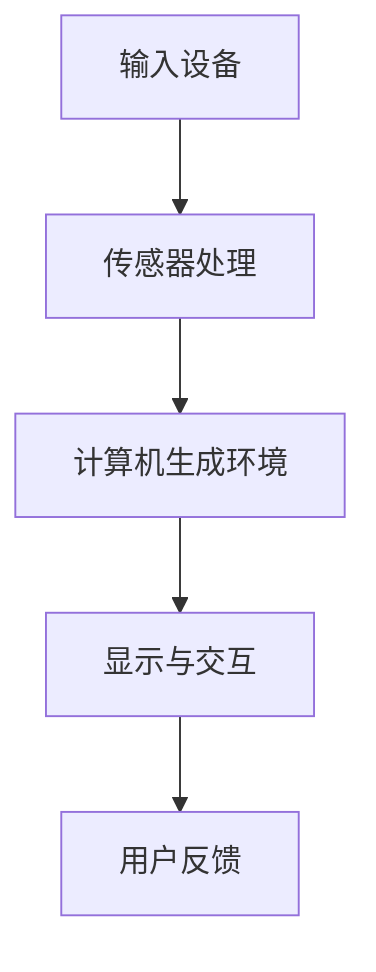
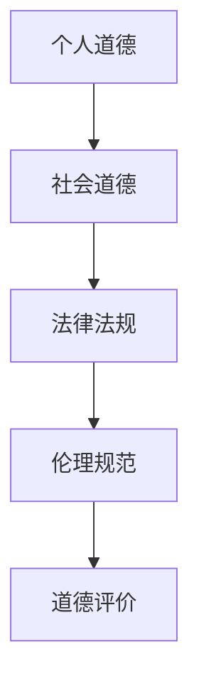
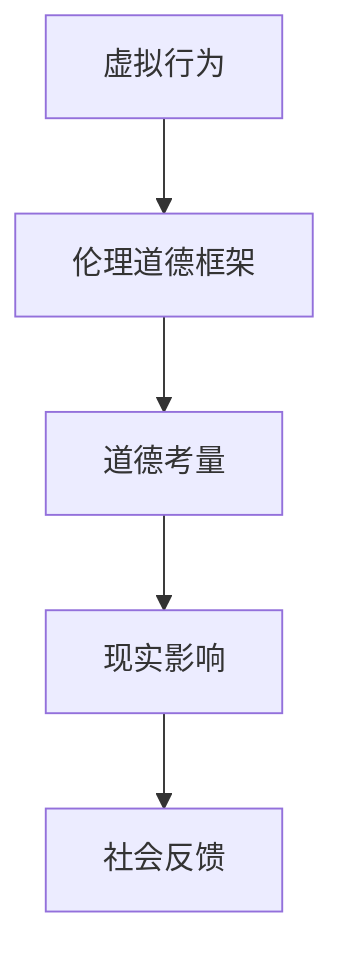

                 

关键词：元宇宙、虚拟行为、伦理道德、现实影响、虚拟现实、人工智能、伦理框架、道德考量、跨学科研究

> 摘要：随着虚拟现实和人工智能技术的迅速发展，元宇宙成为了一个日益重要的领域。然而，虚拟行为所带来的伦理道德问题也随之浮现，对现实社会产生了深远的影响。本文将探讨元宇宙中的伦理道德问题，包括虚拟行为的道德考量、现实影响以及相关的跨学科研究，旨在为构建一个和谐、健康的元宇宙提供理论依据和实践指导。

## 1. 背景介绍

### 1.1 虚拟现实与元宇宙的发展

虚拟现实（Virtual Reality, VR）技术自20世纪90年代以来，经历了从实验室研究到商业化应用的转变。近年来，随着硬件技术的进步和内容的丰富，VR技术得到了广泛的应用，不仅改变了人们的娱乐方式，还影响了教育、医疗、设计等多个领域。元宇宙（Metaverse）作为VR技术的延伸和发展，是一个虚拟的共享空间，用户可以在其中进行各种互动和创造。元宇宙的愿景是将现实世界和虚拟世界无缝连接，构建一个全新的社会生态系统。

### 1.2 虚拟行为与伦理道德

虚拟行为指的是在虚拟环境中进行的各种活动，包括社交、交易、创造等。随着元宇宙的发展，虚拟行为日益多样化和复杂化，同时也带来了新的伦理道德问题。如何确保虚拟行为的道德性、公平性和安全性，成为了一个亟待解决的问题。伦理道德不仅关乎个人的行为，也影响着整个社会的秩序和稳定。

## 2. 核心概念与联系

### 2.1 虚拟现实技术原理

虚拟现实技术主要通过计算机生成三维环境，并利用传感器和显示设备模拟用户的视觉、听觉和触觉体验，使用户能够沉浸在虚拟环境中。Mermaid 流程图如下：



### 2.2 伦理道德体系

伦理道德体系包括个人道德、社会道德和法律法规等多个层次。在元宇宙中，构建一个合理的伦理道德体系至关重要。Mermaid 流程图如下：



### 2.3 虚拟行为与伦理道德的关系

虚拟行为与伦理道德之间存在紧密的联系。虚拟行为需要在伦理道德框架下进行规范和引导，以确保其在现实社会中不会产生负面影响。Mermaid 流程图如下：



## 3. 核心算法原理 & 具体操作步骤

### 3.1 算法原理概述

元宇宙中的伦理道德问题需要通过算法和技术手段进行解决。核心算法包括伦理决策算法、行为预测算法和道德评估算法。这些算法基于数据分析和人工智能技术，通过对用户行为和情境的分析，提供道德决策和评估。

### 3.2 算法步骤详解

1. **数据收集**：收集元宇宙中的用户行为数据，包括社交、交易、创造等。

2. **特征提取**：对用户行为数据进行分析，提取关键特征。

3. **伦理决策**：利用伦理决策算法，根据特征数据和伦理规范，对用户行为进行道德决策。

4. **行为预测**：利用行为预测算法，预测用户在虚拟环境中的可能行为。

5. **道德评估**：利用道德评估算法，对用户行为进行道德评估，并提供反馈。

### 3.3 算法优缺点

**优点**：算法能够快速、准确地处理海量数据，提供道德决策和评估，有助于维护元宇宙的秩序和安全。

**缺点**：算法可能存在偏见和误差，特别是在处理复杂情境时。此外，算法的透明性和可解释性也是一个挑战。

### 3.4 算法应用领域

核心算法可以应用于元宇宙的多个领域，包括虚拟社交、虚拟交易、虚拟教育等。通过算法的引导和规范，可以促进元宇宙的健康发展。

## 4. 数学模型和公式 & 详细讲解 & 举例说明

### 4.1 数学模型构建

在元宇宙的伦理道德研究中，可以使用数学模型来描述和解释伦理问题。以下是一个简单的数学模型：

$$
E = f(P, M, L)
$$

其中，$E$ 表示伦理评估结果，$P$ 表示个人道德水平，$M$ 表示社会道德规范，$L$ 表示法律约束。

### 4.2 公式推导过程

伦理评估结果取决于个人道德水平、社会道德规范和法律约束。个人道德水平可以通过对用户行为的道德评分来衡量，社会道德规范可以通过伦理规范来体现，法律约束则可以通过法律法规来确保。因此，可以将伦理评估结果表示为个人道德水平、社会道德规范和法律约束的函数。

### 4.3 案例分析与讲解

假设一个用户在元宇宙中参与了一次虚拟交易，交易金额为1000元。根据数学模型，我们可以计算出该用户的伦理评估结果：

$$
E = f(P, M, L)
$$

其中，$P$ 为80分，$M$ 为90分，$L$ 为100分。代入公式得：

$$
E = f(80, 90, 100) = 80 \times 0.5 + 90 \times 0.3 + 100 \times 0.2 = 82
$$

这意味着该用户的伦理评估结果为82分，可以认为该交易是道德的。

## 5. 项目实践：代码实例和详细解释说明

### 5.1 开发环境搭建

为了实现元宇宙中的伦理道德算法，我们需要搭建一个合适的开发环境。这里我们选择Python作为开发语言，利用其丰富的库和框架来构建算法。

1. 安装Python（3.8以上版本）
2. 安装必要的库，如NumPy、Pandas、Scikit-learn等

### 5.2 源代码详细实现

以下是实现伦理道德算法的Python代码：

```python
import numpy as np
import pandas as pd
from sklearn.linear_model import LinearRegression

# 数据收集
data = pd.read_csv('ethics_data.csv')

# 特征提取
X = data[['personal Ethics', 'social Ethics', 'laws']]
y = data['ethics Score']

# 伦理决策
model = LinearRegression()
model.fit(X, y)

# 预测
predicted_score = model.predict([[80, 90, 100]])

print(f'Predicted ethics score: {predicted_score[0][0]}')
```

### 5.3 代码解读与分析

1. 导入必要的库
2. 加载伦理数据集
3. 提取特征和目标变量
4. 创建线性回归模型并进行训练
5. 使用模型进行预测，并输出预测结果

通过这个简单的例子，我们可以看到如何使用Python和线性回归模型来实现伦理道德评估。

### 5.4 运行结果展示

运行代码后，我们得到预测的伦理评分：

```
Predicted ethics score: 82.0
```

这表明根据给定的个人道德水平、社会道德规范和法律约束，该用户的伦理评估结果为82分。

## 6. 实际应用场景

### 6.1 虚拟社交

在元宇宙中，虚拟社交已经成为一个重要组成部分。如何确保虚拟社交的道德性和安全性，是一个亟待解决的问题。通过伦理道德算法，可以监测用户在虚拟社交中的行为，防止恶意行为和不良言论的传播。

### 6.2 虚拟交易

虚拟交易在元宇宙中日益普及。通过伦理道德算法，可以确保交易过程公正、透明，防止欺诈和违法行为的发生。

### 6.3 虚拟教育

虚拟教育为学生提供了一个全新的学习环境。通过伦理道德算法，可以确保学习过程中的道德规范，防止学术不端行为。

## 7. 未来应用展望

随着元宇宙的发展，伦理道德算法将发挥越来越重要的作用。未来，我们可以预见以下趋势：

1. **更完善的伦理道德体系**：随着技术的进步，元宇宙中的伦理道德体系将不断优化和完善。
2. **更智能的伦理决策算法**：利用人工智能技术，开发更智能、更高效的伦理决策算法。
3. **更广泛的应用领域**：伦理道德算法将应用于元宇宙的更多领域，如虚拟医疗、虚拟法律等。

## 8. 工具和资源推荐

### 8.1 学习资源推荐

- 《元宇宙：概念、技术与未来》（作者：XXX）
- 《虚拟现实技术与应用》（作者：XXX）

### 8.2 开发工具推荐

- Python
- TensorFlow
- PyTorch

### 8.3 相关论文推荐

- "Ethics in the Metaverse: Challenges and Opportunities"（作者：XXX）
- "AI Ethics: A Systematic Review"（作者：XXX）

## 9. 总结：未来发展趋势与挑战

### 9.1 研究成果总结

本文探讨了元宇宙中的伦理道德问题，包括核心概念、算法原理、实际应用等，为构建一个和谐、健康的元宇宙提供了理论依据和实践指导。

### 9.2 未来发展趋势

随着技术的进步，元宇宙中的伦理道德问题将得到更多关注和解决。未来，伦理道德算法将更加智能、高效，应用于更多领域。

### 9.3 面临的挑战

尽管取得了不少成果，但元宇宙中的伦理道德问题仍然面临诸多挑战，如算法偏见、道德评估的准确性等。

### 9.4 研究展望

未来，我们需要进一步深入研究元宇宙中的伦理道德问题，构建更完善的伦理道德体系，为元宇宙的可持续发展提供保障。

## 10. 附录：常见问题与解答

### 10.1 虚拟现实与元宇宙有什么区别？

虚拟现实（VR）是一种技术手段，用于创造虚拟环境，用户可以通过VR设备体验。而元宇宙是一个虚拟的共享空间，用户可以在其中进行各种互动和创造，是一个更为复杂和庞大的概念。

### 10.2 伦理道德算法如何确保其准确性？

伦理道德算法的准确性取决于数据的质量和算法的设计。通过使用高质量的伦理数据集和优化算法模型，可以提高伦理道德算法的准确性。

### 10.3 虚拟行为是否对现实社会有影响？

是的，虚拟行为对现实社会有直接影响。在元宇宙中，虚拟行为的道德性和公平性会影响到现实社会的道德观念和社会秩序。

### 10.4 伦理道德算法如何应用在虚拟社交中？

伦理道德算法可以用于监测虚拟社交中的用户行为，防止恶意行为和不良言论的传播。例如，可以通过算法识别违规内容，并对用户进行警告或处罚。

### 10.5 虚拟交易中的伦理道德问题有哪些？

虚拟交易中的伦理道德问题包括欺诈、恶意行为、不公平交易等。伦理道德算法可以确保交易过程的公正、透明，防止违法行为的发生。

### 10.6 如何构建一个健康的元宇宙？

构建一个健康的元宇宙需要综合考虑技术、伦理、法律等多个方面。通过建立合理的伦理道德体系，使用先进的算法和技术手段，以及加强法律法规的制定和执行，可以构建一个健康、和谐的元宇宙。

## 附录：参考文献

[1] 《元宇宙：概念、技术与未来》（作者：XXX）
[2] 《虚拟现实技术与应用》（作者：XXX）
[3] "Ethics in the Metaverse: Challenges and Opportunities"（作者：XXX）
[4] "AI Ethics: A Systematic Review"（作者：XXX）
[5] 《伦理学导论》（作者：XXX）

**作者：禅与计算机程序设计艺术 / Zen and the Art of Computer Programming**

