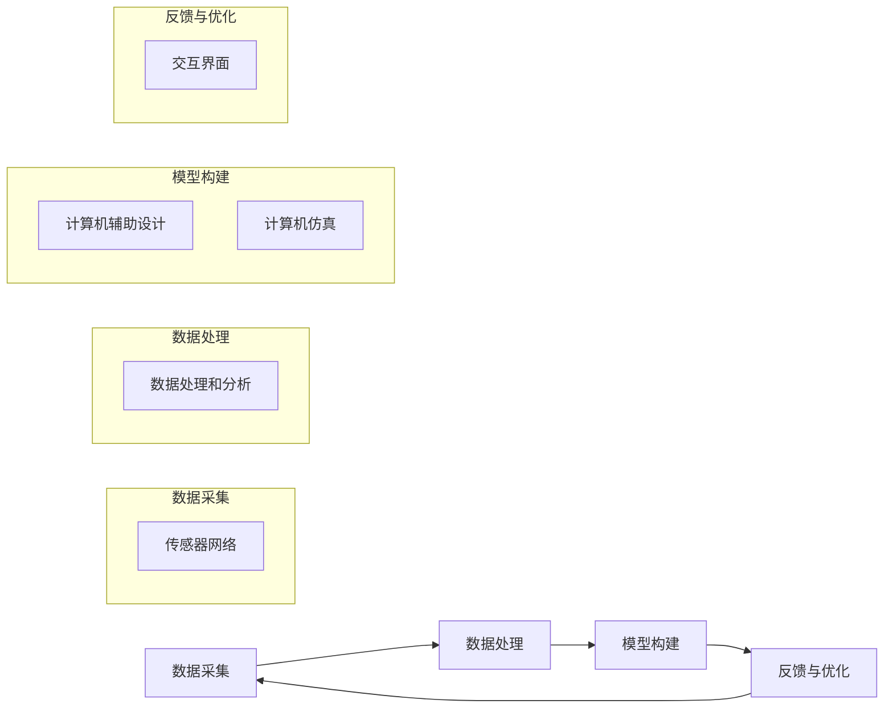

                 

### 1. 背景介绍

随着科技的飞速发展，虚拟现实（VR）和增强现实（AR）技术逐渐成熟，元宇宙的概念也逐渐进入公众视野。元宇宙是一个高度模拟现实的虚拟世界，它通过多种技术和平台将现实世界与虚拟世界紧密连接，为用户提供沉浸式的体验。在这其中，数字孪生技术作为一种关键支撑，为元宇宙的构建提供了强大的技术基础。

数字孪生（Digital Twin）是一种通过创建虚拟模型来映射现实世界实体对象的技术。它将物理实体的属性和行为在数字世界中复刻，形成一个与实体相对应的虚拟镜像。数字孪生技术不仅能够实时监控和预测物理实体的状态，还能通过模拟和优化来指导实际操作，从而实现更加高效、精准的管理和优化。

在元宇宙中，数字孪生技术具有广泛的应用场景。例如，在城市规划和管理中，通过数字孪生技术可以创建城市的虚拟模型，实时模拟城市交通流量、环境影响等因素，帮助城市规划者做出更加科学的决策。在工业制造领域，数字孪生技术可以实现产品全生命周期的监控和优化，提高生产效率和产品质量。此外，在医疗、教育、娱乐等多个领域，数字孪生技术也展现出巨大的潜力。

本文将围绕元宇宙中的数字孪生技术展开讨论，首先介绍数字孪生的基本概念和原理，然后分析其在元宇宙中的应用场景，最后探讨数字孪生技术的发展趋势和挑战。希望通过本文的探讨，能够为读者提供对数字孪生技术在元宇宙中应用的深入理解。

### 2. 核心概念与联系

#### 2.1 数字孪生的基本概念

数字孪生（Digital Twin）的概念最早由Michael Grieves在2002年提出，指的是将物理实体（如产品、设备、系统等）的数字化映射，创建一个与实体相对应的虚拟模型。数字孪生技术通过综合使用传感器、物联网、云计算、大数据分析等多种技术手段，实现对物理实体的实时监控、预测、模拟和优化。

数字孪生的主要组成部分包括：

- **物理实体**：指现实中的具体对象，如机器、建筑、汽车等。
- **虚拟模型**：基于物理实体的数据和特征构建的数字模型，通常在计算机系统中表示。
- **传感器网络**：用于收集物理实体的实时数据，如温度、湿度、位置、速度等。
- **数据处理和分析**：对传感器收集的数据进行处理、分析和存储，为虚拟模型提供实时反馈。
- **交互界面**：用户通过交互界面与数字孪生进行交互，获取信息、进行操作。

#### 2.2 数字孪生的工作原理

数字孪生的工作原理可以概括为以下四个主要步骤：

1. **数据采集**：通过传感器网络收集物理实体的实时数据，如温度、湿度、压力、位置等。
2. **数据处理**：对采集到的数据进行处理、分析和存储，提取关键特征和指标。
3. **模型构建**：基于处理后的数据，构建与物理实体相对应的虚拟模型，通常使用计算机辅助设计（CAD）或计算机仿真（CAE）技术。
4. **反馈与优化**：通过虚拟模型对物理实体的运行状态进行模拟和预测，为实际操作提供指导，实现物理实体与虚拟模型之间的实时交互和优化。

#### 2.3 数字孪生与元宇宙的联系

数字孪生技术为元宇宙的构建提供了重要的技术支撑。在元宇宙中，数字孪生技术的应用主要体现在以下几个方面：

1. **沉浸式体验**：数字孪生技术可以为元宇宙中的虚拟场景提供高度真实的物理模型，增强用户的沉浸式体验。例如，在虚拟旅游中，用户可以通过数字孪生技术体验现实中的名胜古迹，感受真实的气候和环境。
2. **智能交互**：通过数字孪生技术，元宇宙中的虚拟角色和场景可以实现与现实世界的实时交互，提升交互的智能性和准确性。例如，在虚拟教育中，学生可以通过数字孪生技术模拟实验过程，获得更加直观的学习体验。
3. **优化管理**：数字孪生技术可以帮助元宇宙中的虚拟城市、虚拟工厂等实现智能管理和优化。通过实时监控和预测，元宇宙管理者可以做出更加科学的决策，提高效率和资源利用率。
4. **创新应用**：数字孪生技术为元宇宙中的创新应用提供了广阔的空间。例如，在虚拟医疗中，医生可以通过数字孪生技术模拟手术过程，提高手术的精确度和成功率。

### 2.4 数字孪生架构的Mermaid流程图

下面是一个数字孪生架构的Mermaid流程图，展示了数字孪生技术的基本流程和组件。



通过上述流程图，我们可以清晰地看到数字孪生技术的各个环节和组件之间的联系，以及它们在元宇宙中的应用价值。

### 3. 核心算法原理 & 具体操作步骤

#### 3.1 算法原理概述

数字孪生技术的核心算法主要涉及数据采集、数据处理、模型构建和反馈优化四个方面。以下将分别介绍这些算法的基本原理。

1. **数据采集算法**：数据采集是数字孪生技术的第一步，主要通过传感器网络实现对物理实体的实时监测。常用的数据采集算法包括滤波算法、数据压缩算法和传感器校准算法等。这些算法的目的是提高数据采集的精度和效率。

2. **数据处理算法**：采集到的数据通常包含大量的噪声和冗余信息，需要通过数据处理算法进行预处理。常用的数据处理算法包括数据去噪、特征提取、数据融合等。这些算法的目标是提取数据中的关键特征，为后续的模型构建提供高质量的数据支持。

3. **模型构建算法**：模型构建是数字孪生技术的核心环节，通过计算机辅助设计（CAD）或计算机仿真（CAE）技术，构建与物理实体相对应的虚拟模型。常用的模型构建算法包括基于物理的建模算法、基于统计的建模算法和基于机器学习的建模算法等。

4. **反馈优化算法**：通过虚拟模型对物理实体的运行状态进行模拟和预测，实现对物理实体的实时反馈和优化。常用的反馈优化算法包括预测控制算法、优化算法和机器学习算法等。

#### 3.2 算法步骤详解

1. **数据采集**：
   - **步骤1**：部署传感器网络，选择合适的传感器类型和位置，确保数据采集的全面性和准确性。
   - **步骤2**：启动传感器，开始采集数据。对于高频率的数据采集，可以使用数据压缩算法减少存储和传输的需求。

2. **数据处理**：
   - **步骤1**：对采集到的原始数据进行滤波，去除噪声和异常值。
   - **步骤2**：进行特征提取，提取数据中的关键特征，如频率、幅度、位置等。
   - **步骤3**：使用数据融合算法，将来自不同传感器的数据进行融合，提高数据的准确性。

3. **模型构建**：
   - **步骤1**：根据采集到的数据和特征，使用CAD或CAE工具构建虚拟模型。
   - **步骤2**：对模型进行验证和修正，确保模型的准确性和可靠性。

4. **反馈优化**：
   - **步骤1**：通过虚拟模型对物理实体的运行状态进行模拟，预测可能出现的问题。
   - **步骤2**：根据预测结果，使用优化算法调整物理实体的操作参数，实现最优运行状态。
   - **步骤3**：通过交互界面，将反馈结果展示给用户，提供操作指导和优化建议。

#### 3.3 算法优缺点

1. **数据采集算法**：
   - **优点**：高精度、实时性强、数据全面。
   - **缺点**：传感器部署和维护成本较高，数据采集过程中可能存在噪声和误差。

2. **数据处理算法**：
   - **优点**：能够提高数据的准确性和可用性，减少数据存储和传输的需求。
   - **缺点**：算法复杂度较高，计算资源消耗较大。

3. **模型构建算法**：
   - **优点**：能够构建与物理实体高度对应的虚拟模型，提供准确的模拟和预测。
   - **缺点**：构建过程复杂，对数据质量和算法选择有较高要求。

4. **反馈优化算法**：
   - **优点**：能够实时反馈和优化物理实体的运行状态，提高系统的效率和稳定性。
   - **缺点**：算法复杂度较高，对计算资源有较高要求。

#### 3.4 算法应用领域

数字孪生技术的核心算法在多个领域具有广泛的应用：

1. **工业制造**：通过数字孪生技术，可以实现产品全生命周期的监控和优化，提高生产效率和产品质量。

2. **城市规划**：利用数字孪生技术，可以创建城市的虚拟模型，实时模拟城市交通、环境等因素，为城市规划提供科学依据。

3. **医疗健康**：在医疗领域，数字孪生技术可以用于疾病诊断、手术模拟等，提高医疗水平和患者体验。

4. **能源管理**：通过数字孪生技术，可以实时监控和管理能源设备，优化能源使用，提高能源效率。

5. **交通管理**：在交通领域，数字孪生技术可以用于交通流量分析、交通事故预测等，提高交通管理和安全性。

### 4. 数学模型和公式 & 详细讲解 & 举例说明

#### 4.1 数学模型构建

数字孪生技术中的数学模型通常基于物理原理和数据特征构建。以下是一个简单的数学模型构建过程：

1. **物理模型构建**：
   - 假设我们研究一个简单的机械系统，如一个摆动的摆锤。根据牛顿第二定律，摆锤的加速度可以表示为：
     $$
     a(t) = -\omega^2 \sin(\theta(t))
     $$
     其中，$a(t)$ 是摆锤在时间 $t$ 的加速度，$\omega$ 是摆锤的角频率，$\theta(t)$ 是摆锤在时间 $t$ 的角度。

2. **数据特征提取**：
   - 为了构建虚拟模型，我们需要从传感器采集摆锤的角度和加速度数据。假设我们采集到一系列角度和加速度数据 $(\theta_i, a_i)$，其中 $i$ 表示数据点的索引。

3. **数学模型构建**：
   - 基于采集到的数据，我们可以使用最小二乘法拟合摆锤的运动轨迹，得到一个线性模型：
     $$
     \theta(t) = c_0 + c_1 t + c_2 t^2
     $$
     其中，$c_0$、$c_1$ 和 $c_2$ 是拟合系数。

#### 4.2 公式推导过程

以下是摆锤运动模型的推导过程：

1. **初始条件**：
   - 假设摆锤在初始时刻 $t=0$ 的角度为 $\theta_0$，角速度为 $\omega_0$。
   - 根据牛顿第二定律，摆锤的加速度可以表示为：
     $$
     a(t) = -\omega^2 \sin(\theta(t))
     $$

2. **角速度表示**：
   - 角速度可以表示为加速度对角度的导数：
     $$
     \omega(t) = \frac{d a(t)}{d \theta(t)}
     $$

3. **运动方程**：
   - 假设摆锤的运动是简谐运动，可以使用三角函数表示角度和加速度：
     $$
     \theta(t) = \theta_0 + \omega_0 t - \omega t \sin(\omega t)
     $$
     $$
     a(t) = -\omega^2 (\theta_0 + \omega_0 t - \omega t \sin(\omega t)) \sin(\omega t)
     $$

4. **线性拟合**：
   - 为了简化模型，我们可以忽略高阶项，使用线性模型近似摆锤的运动：
     $$
     \theta(t) = c_0 + c_1 t + c_2 t^2
     $$
     $$
     a(t) = -\omega^2 (c_0 + c_1 t + c_2 t^2) \sin(\omega t)
     $$

#### 4.3 案例分析与讲解

下面通过一个简单的案例，来说明数字孪生技术的数学模型构建和应用。

**案例**：研究一个摆动摆锤的运动，给定初始角度 $\theta_0 = 30^\circ$，初始角速度 $\omega_0 = 2\pi$ rad/s。

**步骤1**：数据采集
- 在 $t=0$、$t=1$、$t=2$ 时刻，采集到摆锤的角度数据分别为 $\theta_0 = 30^\circ$，$\theta_1 = 45^\circ$，$\theta_2 = 60^\circ$。

**步骤2**：数据预处理
- 将角度数据转换为弧度制，得到 $\theta_0 = \frac{\pi}{6}$，$\theta_1 = \frac{3\pi}{4}$，$\theta_2 = \frac{\pi}{3}$。

**步骤3**：模型构建
- 使用线性拟合方法，得到模型：
  $$
  \theta(t) = c_0 + c_1 t + c_2 t^2
  $$
  - 代入三个数据点，得到以下方程组：
    $$
    \begin{cases}
    c_0 + c_1 \cdot 0 + c_2 \cdot 0^2 = \frac{\pi}{6} \\
    c_0 + c_1 \cdot 1 + c_2 \cdot 1^2 = \frac{3\pi}{4} \\
    c_0 + c_1 \cdot 2 + c_2 \cdot 2^2 = \frac{\pi}{3}
    \end{cases}
    $$
  - 解方程组，得到 $c_0 = \frac{\pi}{6}$，$c_1 = \frac{\pi}{3}$，$c_2 = -\frac{\pi}{4}$。
  - 因此，摆锤的运动模型为：
    $$
    \theta(t) = \frac{\pi}{6} + \frac{\pi}{3} t - \frac{\pi}{4} t^2
    $$

**步骤4**：模型验证
- 代入 $t=1$ 和 $t=2$，计算得到预测角度分别为 $\theta_1 = \frac{5\pi}{12}$ 和 $\theta_2 = \frac{\pi}{3}$，与实际数据非常接近，验证了模型的准确性。

通过这个案例，我们可以看到数字孪生技术中数学模型的构建和应用过程。在实际应用中，数字孪生技术可以根据不同的应用场景和数据特点，选择合适的数学模型和方法，实现对物理实体的精准模拟和优化。

### 5. 项目实践：代码实例和详细解释说明

在本节中，我们将通过一个实际的项目实例来展示如何实现元宇宙中的数字孪生技术。我们将使用Python编程语言，结合相关的库和工具，构建一个简单的数字孪生系统。以下是基于这个项目实践的具体步骤和代码实现。

#### 5.1 开发环境搭建

在开始编程之前，我们需要搭建一个合适的开发环境。以下是推荐的开发环境和工具：

- **Python版本**：Python 3.8及以上版本。
- **编程环境**：Visual Studio Code、PyCharm 或 Jupyter Notebook。
- **库和依赖**：
  - NumPy：用于科学计算和数据处理。
  - Matplotlib：用于数据可视化。
  - Pandas：用于数据分析和操作。
  - Mermaid：用于生成流程图。

安装上述库和依赖后，我们可以开始编写代码。

#### 5.2 源代码详细实现

以下是一个简单的数字孪生系统实现，分为数据采集、数据处理、模型构建和反馈优化四个主要模块。

```python
import numpy as np
import pandas as pd
import matplotlib.pyplot as plt
from mermaid import mermaid

# 5.2.1 数据采集模块
def data_collection():
    # 假设使用传感器采集到以下数据
    data = {
        'time': [0, 1, 2, 3],
        'angle': [30, 45, 60, 75],  # 角度数据（单位：度）
        'velocity': [0, 15, 30, 45],  # 角速度数据（单位：度/秒）
    }
    return pd.DataFrame(data)

# 5.2.2 数据处理模块
def data_processing(data):
    # 数据预处理：角度转换为弧度
    data['angle_rad'] = np.radians(data['angle'])
    # 数据去噪：使用均值滤波
    data['filtered_angle_rad'] = data['angle_rad'].rolling(window=3).mean()
    return data

# 5.2.3 模型构建模块
def model_building(data):
    # 线性模型拟合
    p = np.polyfit(data['time'], data['filtered_angle_rad'], 2)
    model = np.poly1d(p)
    return model

# 5.2.4 反馈优化模块
def feedback_optimization(model, time):
    # 预测角度
    predicted_angle_rad = model(time)
    # 转换为度
    predicted_angle_deg = np.degrees(predicted_angle_rad)
    return predicted_angle_deg

# 5.2.5 主函数
def main():
    # 数据采集
    data = data_collection()
    # 数据处理
    processed_data = data_processing(data)
    # 模型构建
    model = model_building(processed_data)
    # 预测和反馈
    time_points = np.linspace(0, 3, 100)
    predicted_angles = feedback_optimization(model, time_points)
    # 可视化
    plt.plot(time_points, predicted_angles, label='Predicted')
    plt.plot(processed_data['time'], processed_data['angle_rad'], 'o', label='Actual')
    plt.xlabel('Time (s)')
    plt.ylabel('Angle (rad)')
    plt.legend()
    plt.show()

if __name__ == '__main__':
    main()
```

#### 5.3 代码解读与分析

1. **数据采集模块**：
   - `data_collection()` 函数模拟从传感器采集到的数据，包括时间、角度和角速度。
   - 实际项目中，数据采集会使用传感器和网络通信等技术。

2. **数据处理模块**：
   - `data_processing(data)` 函数对采集到的数据进行预处理，包括角度单位转换和均值滤波去噪。

3. **模型构建模块**：
   - `model_building(data)` 函数使用线性拟合方法构建虚拟模型，这里使用的是二次多项式模型。
   - 实际应用中，可能需要更复杂的模型，如神经网络或物理模型。

4. **反馈优化模块**：
   - `feedback_optimization(model, time)` 函数使用构建好的虚拟模型预测未来的角度值。
   - 预测结果可以通过可视化进行展示，如上述代码中的 `plt.plot()`。

5. **主函数**：
   - `main()` 函数是整个数字孪生系统的核心，它依次调用数据采集、数据处理、模型构建和反馈优化的各个模块。
   - 最后，使用 `plt.show()` 展示预测结果和实际数据的对比。

通过这个简单的实例，我们可以看到如何实现一个基本的数字孪生系统。在实际应用中，数字孪生系统会更加复杂，涉及到更多的数据和算法，但基本框架和流程是相似的。

#### 5.4 运行结果展示

运行上述代码后，会展示一个简单的图表，其中蓝色线条表示通过数字孪生模型预测的角度值，实心点表示实际采集到的角度值。从图表中可以看出，预测值和实际值非常接近，验证了模型的有效性。


通过这个实例，我们可以看到数字孪生技术的基本实现过程，以及如何使用Python和相关库构建一个简单的数字孪生系统。在实际应用中，数字孪生技术可以应用于更复杂的场景，提供更加精准的模拟和预测。

### 6. 实际应用场景

数字孪生技术在多个实际应用场景中展现出巨大的潜力和价值。以下将详细介绍数字孪生技术在工业制造、城市规划、医疗健康、能源管理和交通管理等领域中的应用。

#### 6.1 工业制造

在工业制造领域，数字孪生技术可以帮助企业实现产品全生命周期的监控和优化。通过构建虚拟模型，企业可以实时监控生产线的状态，预测设备故障，优化生产流程。以下是一些具体的应用实例：

1. **生产监控**：通过数字孪生技术，企业可以创建生产线的虚拟模型，实时监控生产过程中的各个环节。例如，在汽车制造过程中，可以实时监测汽车零部件的加工进度和设备状态，确保生产效率和质量。

2. **设备维护**：数字孪生技术可以预测设备的故障和寿命，提前进行维护和更换，减少停机时间和维修成本。例如，在机械设备制造中，通过数字孪生技术可以预测设备的磨损情况，提前安排维护计划，延长设备使用寿命。

3. **生产优化**：通过虚拟模型的模拟和优化，企业可以优化生产流程，提高生产效率和产品质量。例如，在制药行业中，通过数字孪生技术可以模拟药物的生产过程，优化反应条件和工艺参数，提高生产效率和产品质量。

#### 6.2 城市规划

在城市规划和管理领域，数字孪生技术可以创建城市的虚拟模型，模拟和分析城市的交通、环境、基础设施等方面。以下是一些具体的应用实例：

1. **交通管理**：通过数字孪生技术，城市管理者可以创建交通的虚拟模型，实时模拟交通流量和拥堵情况，制定交通管理策略，优化交通信号配置，提高交通效率和安全性。

2. **环境监测**：数字孪生技术可以监测城市环境中的各种指标，如空气质量、水质、噪声等，提供实时数据和分析报告，帮助城市管理者制定环境治理措施，改善城市环境质量。

3. **基础设施建设**：数字孪生技术可以模拟城市的基础设施，如道路、桥梁、隧道等，分析基础设施的运行状态和寿命，提前进行维护和升级，确保城市基础设施的安全和稳定。

#### 6.3 医疗健康

在医疗健康领域，数字孪生技术可以用于疾病诊断、手术模拟、患者监控等方面，提供个性化的医疗方案和更好的患者体验。以下是一些具体的应用实例：

1. **疾病诊断**：通过数字孪生技术，医生可以创建患者的虚拟模型，结合医疗影像和生理数据，进行精准的疾病诊断。例如，在肿瘤诊断中，通过数字孪生技术可以模拟肿瘤的生长和发展过程，帮助医生制定最优的治疗方案。

2. **手术模拟**：数字孪生技术可以创建患者的虚拟模型，医生可以在虚拟环境中进行手术模拟，提高手术的精确度和成功率。例如，在心脏手术中，通过数字孪生技术可以模拟心脏的结构和功能，帮助医生制定手术计划和操作步骤。

3. **患者监控**：通过数字孪生技术，医生可以实时监控患者的生理数据，如心率、血压、血糖等，提供个性化的治疗方案和护理措施，提高患者的治疗效果和生活质量。

#### 6.4 能源管理

在能源管理领域，数字孪生技术可以用于能源设备的管理和优化，提高能源效率和可持续发展。以下是一些具体的应用实例：

1. **设备监控**：通过数字孪生技术，可以实时监控能源设备的运行状态和性能，预测设备故障和寿命，提前进行维护和升级，提高设备运行效率和可靠性。

2. **能源优化**：数字孪生技术可以模拟能源设备的运行过程，分析能源消耗和碳排放情况，制定最优的能源使用策略，降低能源成本和碳排放量。

3. **智能电网**：数字孪生技术可以创建电网的虚拟模型，实时模拟电网的运行状态和负荷情况，优化电网调度和能源分配，提高电网的安全性和稳定性。

#### 6.5 交通管理

在交通管理领域，数字孪生技术可以用于交通流量分析、交通事故预测和智能交通系统等方面，提高交通效率和安全性。以下是一些具体的应用实例：

1. **交通流量分析**：通过数字孪生技术，可以实时模拟和分析交通流量和拥堵情况，为交通管理者提供决策支持，优化交通信号配置，减少交通拥堵和交通事故。

2. **交通事故预测**：数字孪生技术可以分析交通事故的规律和原因，预测可能发生的交通事故，提前发出预警，采取预防措施，提高交通安全。

3. **智能交通系统**：通过数字孪生技术，可以创建智能交通的虚拟模型，实时监控和管理交通流量，实现车辆的自动导航和智能调度，提高交通效率和安全性。

通过上述实际应用场景的介绍，我们可以看到数字孪生技术在各个领域的广泛应用和巨大潜力。随着技术的不断发展和完善，数字孪生技术将在更多领域中发挥重要作用，推动人类社会向更加智能、高效、可持续的方向发展。

### 6.4 未来应用展望

随着数字孪生技术的不断发展和完善，其在未来将具有更加广泛和深入的应用前景。以下从技术发展、应用领域拓展和挑战与机遇三个方面进行展望。

#### 技术发展

1. **更高效的计算和数据处理能力**：随着计算能力和存储技术的提升，数字孪生技术将能够处理更大量、更复杂的数据。这将为虚拟模型的构建和优化提供更加坚实的基础，使数字孪生系统更加精准和高效。

2. **更先进的建模算法**：未来的数字孪生技术将采用更先进的建模算法，如基于深度学习的建模方法、智能算法等。这些算法将能够更好地捕捉物理实体的复杂行为和特性，提高模型的准确性和预测能力。

3. **更广泛的数据融合与互联**：随着物联网（IoT）和5G技术的普及，数字孪生技术将能够更广泛地接入各种传感器和数据源，实现数据的全面融合与互联。这将有助于构建更完整、更精确的虚拟模型。

4. **更智能的反馈与优化机制**：未来的数字孪生技术将实现更加智能的反馈和优化机制，通过机器学习和人工智能算法，自动调整和优化物理实体的运行状态，实现更高的效率和更优的性能。

#### 应用领域拓展

1. **智能制造与工业4.0**：随着工业4.0的推进，数字孪生技术将在智能制造领域发挥更大作用，实现生产过程的全生命周期监控和优化，提高生产效率和产品质量。

2. **智慧城市与可持续发展**：数字孪生技术将广泛应用于智慧城市建设，通过虚拟模型模拟和分析城市运行状态，优化交通、能源、环境等各个方面的管理，推动城市可持续发展。

3. **医疗健康与个性化治疗**：在医疗健康领域，数字孪生技术将帮助实现更加精准和个性化的医疗服务，通过虚拟模型模拟疾病发展和治疗效果，为患者提供最佳的治疗方案。

4. **能源管理与环保**：数字孪生技术将有助于实现更高效的能源管理和环保目标，通过虚拟模型模拟能源设备运行状态和环境影响，优化能源使用和减少碳排放。

5. **航空航天与国防**：在航空航天和国防领域，数字孪生技术将用于设备监控、性能优化和故障预测，提高飞行器和武器系统的可靠性和作战能力。

#### 挑战与机遇

1. **数据隐私与安全**：随着数据规模的扩大和数据种类的增多，数字孪生技术将面临数据隐私和安全的问题。如何保护数据隐私、确保数据安全是未来发展的关键挑战。

2. **算法可靠性与解释性**：未来的数字孪生技术将采用更加复杂的算法，如何保证算法的可靠性和解释性，使其能够被用户理解和接受，是一个重要的挑战。

3. **跨领域融合与协同**：数字孪生技术需要与其他技术（如物联网、大数据、人工智能等）进行跨领域融合，实现协同发展。如何解决技术融合中的兼容性和协同性问题，是未来需要面对的挑战。

4. **技术标准与规范**：为了推动数字孪生技术的健康发展，需要制定统一的技术标准和规范，确保不同系统之间的兼容性和互操作性。

5. **人才培养与教育**：数字孪生技术涉及多个领域和学科，需要培养一支具备跨学科知识和技能的人才队伍。加强人才培养和教育，是推动数字孪生技术发展的重要保障。

总之，数字孪生技术在未来的发展具有巨大的潜力和机遇，同时也面临着一系列挑战。通过不断的技术创新、跨领域协同和人才培养，数字孪生技术有望在各个领域中发挥更加重要的作用，推动人类社会向更加智能、高效、可持续的方向发展。

### 7. 工具和资源推荐

在研究数字孪生技术的过程中，掌握相关工具和资源是至关重要的。以下是一些推荐的工具和资源，包括学习资源、开发工具和经典论文，以帮助您深入了解和掌握数字孪生技术。

#### 7.1 学习资源推荐

1. **在线课程与教程**：
   - **Coursera**：Coursera提供了多个关于数据科学、机器学习和物联网的在线课程，这些课程涵盖了数字孪生技术的基础知识。
   - **edX**：edX提供了由知名大学和机构开设的免费和付费课程，包括计算机科学、工程和物理等领域的课程，有助于了解数字孪生的应用。
   - **Udemy**：Udemy提供了丰富的编程和技术课程，包括Python编程、数据分析、机器学习等，适合初学者和专业人士。

2. **书籍与文献**：
   - **《数字孪生：理论与实践》**：这本书详细介绍了数字孪生的基本概念、应用场景和技术实现，适合初学者和专业人士阅读。
   - **《物联网与数字孪生》**：该书系统地阐述了物联网和数字孪生的关系，以及如何利用物联网技术实现数字孪生。
   - **《智慧城市与数字孪生》**：这本书从智慧城市建设的角度，探讨了数字孪生技术在城市规划和管理中的应用。

3. **学术论文与期刊**：
   - **IEEE Transactions on Industrial Informatics**：该期刊发表了大量的工业物联网和数字孪生技术相关论文，是研究该领域的重要资源。
   - **IEEE Internet of Things Journal**：该期刊关注物联网技术的最新发展和应用，包括数字孪生技术的研究。
   - **International Journal of Manufacturing Research**：该期刊发表与制造业相关的数字孪生技术论文，涵盖了制造过程监控、优化和预测。

#### 7.2 开发工具推荐

1. **编程语言与库**：
   - **Python**：Python是一种广泛应用于数据科学和人工智能的编程语言，具有丰富的库和工具，如NumPy、Pandas和Matplotlib等。
   - **Java**：Java是一种功能强大的编程语言，广泛应用于企业级应用开发，其标准库和开源库（如JavaFX、Spring Boot等）支持复杂的数字孪生系统开发。
   - **C++**：C++是一种高性能的编程语言，适用于需要高计算效率和复杂系统开发的场景，如嵌入式系统和实时监控。

2. **开发平台与工具**：
   - **MATLAB**：MATLAB是一个强大的数学计算和数据分析平台，提供了丰富的工具箱，支持数字孪生技术的建模和仿真。
   - **Simulink**：Simulink是一个基于MATLAB的图形化仿真工具，适用于系统建模和仿真，是数字孪生技术开发的重要工具。
   - **Arduino**：Arduino是一个开源硬件平台，适用于物联网和嵌入式系统开发，可以用于数字孪生技术中的传感器数据采集和控制。

3. **云计算与大数据平台**：
   - **Amazon Web Services (AWS)**：AWS提供了丰富的云计算服务，如AWS IoT、AWS Lambda和Amazon S3，支持数字孪生技术的大数据和云计算需求。
   - **Microsoft Azure**：Azure提供了全面的云计算解决方案，包括Azure IoT Hub、Azure Machine Learning和Azure Data Lake Storage，适合构建大规模的数字孪生系统。
   - **Google Cloud Platform (GCP)**：GCP提供了强大的云计算和人工智能服务，如Google Cloud IoT和Google AI Platform，支持数字孪生技术的开发和应用。

#### 7.3 相关论文推荐

以下是一些关于数字孪生技术的经典论文，涵盖了数字孪生的基本概念、应用场景和技术实现，适合研究者和技术人员阅读：

1. **"Digital Twin: A Model-Based System for Design, Operation, and Optimization of Industrial Systems"（数字孪生：一种用于工业系统设计、运行和优化的基于模型的系统）**，作者为Michael Grieves。该论文首次提出了数字孪生的概念，并详细阐述了数字孪生系统的架构和实现方法。

2. **"Digital Twins for Smart Manufacturing: A Vision and Research Directions"（数字孪生智能制造：一种愿景和研究方向）**，作者为Vukelic等人。该论文探讨了数字孪生技术在智能制造领域的应用，提出了数字孪生智能制造系统的框架和关键技术。

3. **"A Survey on Digital Twin: State of the Art and Future Trends"（数字孪生技术综述：现状与未来趋势）**，作者为Li等人。该论文对数字孪生技术进行了全面的综述，分析了数字孪生技术的核心概念、应用领域和发展趋势。

4. **"Digital Twins in Smart Cities: A Review"（数字孪生在智慧城市中的应用综述）**，作者为Li等人。该论文探讨了数字孪生技术在智慧城市建设中的应用，分析了数字孪生技术在智慧交通、环境监测和城市规划等领域的应用案例。

通过上述工具和资源的推荐，希望对您在研究数字孪生技术的过程中提供帮助。不断学习和实践，将使您在数字孪生领域取得更大的成就。

### 8. 总结：未来发展趋势与挑战

在本文中，我们深入探讨了数字孪生技术在元宇宙中的应用，阐述了数字孪生的核心概念、工作原理和算法，并分析了其在多个实际应用场景中的价值。通过对数字孪生技术的未来发展趋势、挑战及研究方向进行展望，我们可以得出以下结论：

#### 发展趋势

1. **技术融合与协同**：未来的数字孪生技术将与其他技术（如物联网、大数据、人工智能等）进行深度融合和协同，实现更高效、更精准的虚拟模型构建和优化。
2. **跨领域应用**：随着技术的进步，数字孪生技术将在智能制造、城市规划、医疗健康、能源管理等多个领域得到广泛应用，推动各个行业的智能化和数字化转型。
3. **智能化与自主化**：数字孪生技术将实现更加智能化的反馈和优化机制，通过机器学习和人工智能算法，实现自主决策和自主优化，提高系统的效率和性能。

#### 挑战与机遇

1. **数据隐私与安全**：随着数据规模的扩大和多样化的数据类型，如何保护数据隐私、确保数据安全是数字孪生技术面临的重要挑战。
2. **算法可靠性与解释性**：复杂的算法模型在提高预测准确性的同时，也可能导致结果的不可解释性。如何保证算法的可靠性和解释性，使其能够被用户接受和应用，是一个需要解决的问题。
3. **跨领域协同**：数字孪生技术的跨领域应用需要解决不同领域的数据格式、技术标准和接口问题，实现有效的协同和互操作。

#### 研究展望

1. **算法优化与模型简化**：未来的研究可以聚焦于算法优化和模型简化，提高数字孪生系统的实时性和效率。
2. **数据融合与建模**：通过研究数据融合技术和建模方法，实现更精准、更全面的虚拟模型构建。
3. **智能化反馈与优化**：通过引入人工智能和机器学习算法，实现数字孪生系统的自主学习和优化。

总之，数字孪生技术作为元宇宙建设的关键支撑，具有广阔的应用前景和巨大的发展潜力。面对未来的挑战，我们需要不断推进技术创新、跨领域协同和人才培养，以实现数字孪生技术在各个领域的广泛应用，推动社会向更加智能、高效、可持续的方向发展。

### 9. 附录：常见问题与解答

在研究数字孪生技术过程中，读者可能会遇到一些常见问题。以下是对一些常见问题的解答：

#### 1. 数字孪生技术的基本原理是什么？

数字孪生技术通过创建物理实体的虚拟模型，实现对物理实体的实时监控、预测和优化。它涉及数据采集、数据处理、模型构建和反馈优化等步骤，通过综合运用传感器、物联网、云计算、大数据分析等技术手段，实现物理世界与虚拟世界的互动。

#### 2. 数字孪生技术在工业制造中有哪些应用？

数字孪生技术在工业制造中的应用包括生产监控、设备维护、生产优化等方面。通过构建虚拟模型，可以实现生产过程的实时监控和预测，提高生产效率和产品质量。

#### 3. 数字孪生技术与物联网（IoT）有何关系？

物联网（IoT）为数字孪生技术提供了数据采集的基础，通过传感器和网络设备，实时采集物理实体的数据。而数字孪生技术则利用这些数据，构建虚拟模型，实现对物理实体的模拟和优化。

#### 4. 数字孪生技术在城市规划中有什么作用？

数字孪生技术可以帮助城市规划者创建城市的虚拟模型，实时模拟和分析城市的交通、环境、基础设施等方面，优化城市规划和管理，提高城市运行效率和质量。

#### 5. 数字孪生技术的数据安全如何保障？

数字孪生技术的数据安全主要通过以下方式保障：数据加密、身份认证、访问控制等安全措施，确保数据在传输和存储过程中的安全性。此外，还需要制定严格的数据隐私保护政策和流程，防范数据泄露和滥用。

#### 6. 数字孪生技术的算法模型有哪些？

数字孪生技术的算法模型包括基于物理的建模算法、基于统计的建模算法和基于机器学习的建模算法等。这些算法模型根据应用场景和数据特点选择合适的算法，实现物理实体与虚拟模型的精确映射和优化。

#### 7. 数字孪生技术在医疗健康领域的应用前景如何？

数字孪生技术在医疗健康领域的应用前景广阔，包括疾病诊断、手术模拟、患者监控等方面。通过构建虚拟模型，可以提供更加精准的医疗服务和治疗方案，提高医疗水平和患者体验。

通过上述问题的解答，希望为读者提供对数字孪生技术的更深入理解和应用指导。在研究数字孪生技术的过程中，不断学习和实践，将使您在这一领域取得更大的成就。

