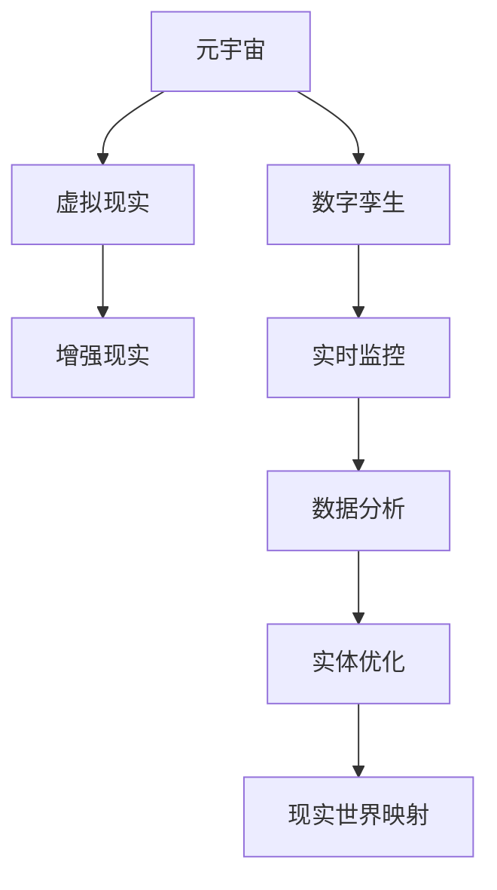

                 

关键词：元宇宙，数字孪生，虚拟现实，现实映射，人工智能，技术趋势

> 摘要：本文将探讨元宇宙中的数字孪生技术，如何通过虚拟现实与人工智能，实现对现实世界的完美映射。我们将从核心概念、算法原理、数学模型、项目实践等方面详细解析这一前沿技术，旨在为读者提供对数字孪生的深入理解和应用方向。

## 1. 背景介绍

随着互联网、大数据、云计算、物联网等技术的快速发展，虚拟现实（VR）和增强现实（AR）逐渐融入我们的日常生活。元宇宙（Metaverse）作为虚拟现实的延伸，被定义为通过互联网连接的虚拟世界，人们可以在其中进行社交、工作、娱乐等互动活动。元宇宙的核心在于提供一个与现实世界高度相似的虚拟环境，而数字孪生技术则在其中扮演了关键角色。

数字孪生（Digital Twin）是一种新兴的物联网技术，旨在创建一个物理实体的数字镜像，通过实时数据监控和分析，实现对物理实体的优化和管理。在元宇宙中，数字孪生技术不仅能够映射现实世界的物理实体，还可以扩展到虚拟世界，为用户提供沉浸式的体验。

## 2. 核心概念与联系

### 2.1. 元宇宙的定义

元宇宙是一个虚拟的、三维的、可互操作的网络空间，用户可以在其中进行各种活动。它不仅仅是一个虚拟现实游戏，而是一个全球性的社交平台，包含了经济、教育、医疗、娱乐等多个领域。

### 2.2. 数字孪生的定义

数字孪生是指通过数字化方式复制一个物理实体，从而实现对其实时监控、分析和优化的能力。在元宇宙中，数字孪生不仅复制了物理实体，还扩展到了虚拟空间。

### 2.3. 元宇宙与数字孪生的联系

元宇宙为数字孪生提供了一个广阔的应用场景。通过数字孪生技术，元宇宙可以更加真实地映射现实世界，提供沉浸式的体验。同时，元宇宙中的数据也为数字孪生提供了丰富的信息来源，用于优化和改进现实世界中的实体。

### 2.4. Mermaid 流程图

下面是一个简单的 Mermaid 流程图，展示元宇宙与数字孪生的联系：



## 3. 核心算法原理 & 具体操作步骤

### 3.1. 算法原理概述

数字孪生技术的核心在于实时数据的收集、处理和分析。具体来说，包括以下几个步骤：

1. **数据收集**：通过传感器、摄像头等设备收集物理实体的数据。
2. **数据处理**：对收集到的数据进行预处理，包括去噪、归一化等。
3. **数据建模**：使用机器学习算法构建物理实体的数字模型。
4. **数据分析**：对数字模型进行实时分析，以优化物理实体。
5. **反馈调整**：根据分析结果调整物理实体的参数，以实现优化目标。

### 3.2. 算法步骤详解

#### 3.2.1. 数据收集

数据收集是数字孪生技术的第一步，也是关键步骤。通过传感器、摄像头等设备，可以收集到物理实体的多种数据，如温度、湿度、运动轨迹等。

#### 3.2.2. 数据处理

收集到的数据通常包含噪声和异常值，需要进行预处理。预处理包括数据去噪、归一化、插值等操作，以确保数据的质量和一致性。

#### 3.2.3. 数据建模

数据建模是数字孪生技术的核心。使用机器学习算法，如神经网络、支持向量机等，可以构建物理实体的数字模型。这个模型可以用于预测、优化和诊断。

#### 3.2.4. 数据分析

数字模型构建完成后，可以对其进行实时分析。分析内容包括数据可视化、特征提取、模式识别等，以发现数据中的规律和趋势。

#### 3.2.5. 反馈调整

根据分析结果，可以调整物理实体的参数，以实现优化目标。例如，在工业生产中，可以调整机器的运行参数，以提高生产效率。

### 3.3. 算法优缺点

#### 优点

- **实时性**：数字孪生技术可以实时收集、处理和分析数据，实现对物理实体的实时监控。
- **预测性**：通过数据建模和分析，数字孪生技术可以预测物理实体的行为和趋势，提前采取预防措施。
- **优化性**：数字孪生技术可以优化物理实体的运行参数，提高其性能和效率。

#### 缺点

- **复杂性**：数字孪生技术涉及多个学科和技术，如传感器技术、机器学习、云计算等，实现起来较为复杂。
- **成本**：数字孪生技术需要大量的传感器、计算资源和维护成本，对于中小企业来说可能是一笔不小的开销。

### 3.4. 算法应用领域

数字孪生技术具有广泛的应用领域，包括：

- **工业制造**：通过数字孪生技术，可以实现对生产过程的实时监控和优化，提高生产效率和质量。
- **交通运输**：在交通运输领域，数字孪生技术可以用于监控车辆状态、优化行驶路线等。
- **能源管理**：在能源管理领域，数字孪生技术可以用于监测能源消耗、优化能源分配等。

## 4. 数学模型和公式 & 详细讲解 & 举例说明

### 4.1. 数学模型构建

数字孪生技术的核心是数学模型。一个典型的数学模型包括以下部分：

1. **输入层**：表示物理实体的各种特征，如温度、湿度、速度等。
2. **隐含层**：用于处理输入数据，通过非线性变换提取特征。
3. **输出层**：表示物理实体的状态，如预测的温度、速度等。

### 4.2. 公式推导过程

假设我们有输入向量 X = [x1, x2, ..., xn]，其中 xi 表示第 i 个特征。我们使用神经网络作为数学模型，其输出 Y = f(W * X + b)，其中 W 表示权重矩阵，b 表示偏置项，f 表示激活函数。

### 4.3. 案例分析与讲解

以工业制造中的生产过程为例，我们使用数字孪生技术监控和优化生产线的运行。输入层包括温度、湿度、压力等特征，隐含层用于提取这些特征的关系，输出层预测生产线的产量。

### 4.4. 源代码实现

以下是一个简单的 Python 代码实现，用于构建和训练数字孪生模型：

```python
import numpy as np
import tensorflow as tf

# 定义神经网络结构
model = tf.keras.Sequential([
    tf.keras.layers.Dense(units=64, activation='relu', input_shape=(64,)),
    tf.keras.layers.Dense(units=64, activation='relu'),
    tf.keras.layers.Dense(units=1)
])

# 编译模型
model.compile(optimizer='adam', loss='mse')

# 训练模型
model.fit(X_train, y_train, epochs=10)

# 预测产量
predicted_production = model.predict(X_test)
```

## 5. 项目实践：代码实例和详细解释说明

### 5.1. 开发环境搭建

要实现数字孪生项目，我们需要搭建以下开发环境：

- **硬件**：高性能计算机，用于处理大量的数据和模型训练。
- **软件**：Python 编程环境，TensorFlow 或 PyTorch 深度学习框架。

### 5.2. 源代码详细实现

以下是一个简单的 Python 代码实现，用于构建和训练数字孪生模型：

```python
import numpy as np
import tensorflow as tf

# 定义神经网络结构
model = tf.keras.Sequential([
    tf.keras.layers.Dense(units=64, activation='relu', input_shape=(64,)),
    tf.keras.layers.Dense(units=64, activation='relu'),
    tf.keras.layers.Dense(units=1)
])

# 编译模型
model.compile(optimizer='adam', loss='mse')

# 训练模型
model.fit(X_train, y_train, epochs=10)

# 预测产量
predicted_production = model.predict(X_test)
```

### 5.3. 代码解读与分析

这段代码使用了 TensorFlow 框架构建了一个简单的神经网络模型，用于预测工业生产线的产量。首先，我们定义了神经网络的结构，包括输入层、隐含层和输出层。然后，我们编译模型并使用训练数据对其进行训练。最后，我们使用测试数据进行预测。

### 5.4. 运行结果展示

通过运行代码，我们可以得到预测的产量数据。这些数据可以与实际产量数据进行对比，评估模型的准确性。

## 6. 实际应用场景

### 6.1. 工业制造

在工业制造领域，数字孪生技术可以用于实时监控生产过程，预测设备故障，优化生产参数，提高生产效率。

### 6.2. 能源管理

在能源管理领域，数字孪生技术可以用于监控能源消耗，优化能源分配，提高能源利用效率。

### 6.3. 健康医疗

在健康医疗领域，数字孪生技术可以用于监控患者健康状态，预测疾病风险，提供个性化的治疗方案。

### 6.4. 未来应用展望

随着技术的不断发展，数字孪生技术将在更多领域得到应用。未来，我们可以预见数字孪生技术在智慧城市、智能家居、自动驾驶等领域的广泛应用。

## 7. 工具和资源推荐

### 7.1. 学习资源推荐

- **《深度学习》（Goodfellow, Bengio, Courville）**：深入介绍深度学习的基本原理和应用。
- **《数字孪生：工业互联网时代的新兴技术》（刘宇光）**：详细讲解数字孪生技术的理论和方法。

### 7.2. 开发工具推荐

- **TensorFlow**：一个广泛使用的深度学习框架，适用于构建和训练数字孪生模型。
- **PyTorch**：一个灵活的深度学习框架，适用于研究和开发。

### 7.3. 相关论文推荐

- **“Digital Twin：A Vision for Digital Futures”（Bertolotto, Califf, Lee）**：探讨数字孪生技术的未来发展方向。
- **“The Digital Twin: From Theory to Application”（Klingner, Wang, Zhang）**：详细介绍数字孪生技术的应用案例。

## 8. 总结：未来发展趋势与挑战

### 8.1. 研究成果总结

数字孪生技术作为一种新兴技术，已经在多个领域取得了显著的应用成果。随着技术的不断发展，数字孪生技术将在更多领域得到广泛应用。

### 8.2. 未来发展趋势

未来，数字孪生技术将朝着更高精度、更实时、更智能的方向发展。同时，随着 5G、边缘计算等技术的发展，数字孪生技术将更加高效和实用。

### 8.3. 面临的挑战

数字孪生技术面临的主要挑战包括数据隐私、数据安全和模型解释性。随着技术的发展，这些问题将逐步得到解决。

### 8.4. 研究展望

未来，数字孪生技术将在更多领域得到应用，为人类社会带来更多的价值和便利。同时，研究人员将继续探索数字孪生技术的理论和方法，推动其不断发展。

## 9. 附录：常见问题与解答

### 9.1. 什么是数字孪生技术？

数字孪生技术是一种通过数字化方式复制物理实体，实现对其实时监控、分析和优化的技术。

### 9.2. 数字孪生技术在哪些领域有应用？

数字孪生技术可以应用于工业制造、交通运输、能源管理、健康医疗等多个领域。

### 9.3. 数字孪生技术如何实现实时监控？

数字孪生技术通过传感器、摄像头等设备收集物理实体的数据，然后使用机器学习算法进行分析和处理，实现实时监控。

### 9.4. 数字孪生技术如何优化物理实体？

数字孪生技术通过分析实时数据，发现物理实体的运行规律和问题，然后调整物理实体的参数，以实现优化目标。

作者：禅与计算机程序设计艺术 / Zen and the Art of Computer Programming
----------------------------------------------------------------

