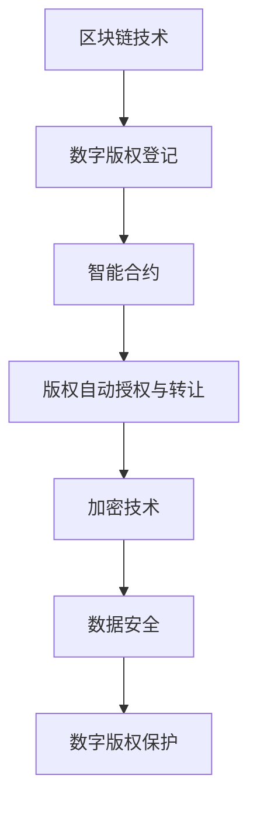

                 

关键词：元宇宙，数字版权，版权归属，区块链，智能合约，NFT，加密技术，虚拟资产，数据安全，知识产权保护

摘要：随着元宇宙的快速发展，数字版权的归属问题变得越来越复杂。本文将探讨元宇宙中的数字版权新形式，包括区块链技术、智能合约、NFT等在数字版权保护中的应用，以及未来可能面临的挑战和发展趋势。

## 1. 背景介绍

随着互联网和数字技术的飞速发展，数字内容已经成为我们日常生活中不可或缺的一部分。无论是音乐、电影、书籍，还是虚拟商品，数字化的形式为我们提供了极大的便利。然而，数字版权的归属和保护问题也随之而来。在传统的版权体系中，版权归属往往是清晰明确的，但随着数字化的推进，版权的归属变得愈发复杂。

### 1.1 传统版权体系

在传统的版权体系中，版权通常属于内容创作者或版权持有者。版权的保护主要通过法律手段来实现，例如著作权法、商标法等。这些法律为版权的归属和转让提供了法律依据，但同时也存在一定的局限性。

### 1.2 数字化带来的挑战

数字化的推进使得版权的归属和保护面临新的挑战：

- **版权易复制性**：数字内容可以被轻易复制和传播，使得版权保护变得更加困难。
- **版权转让复杂性**：数字内容的版权转让过程复杂，涉及多个环节和参与者。
- **版权归属争议**：数字化内容往往涉及多方参与者，版权归属容易引发争议。

### 1.3 元宇宙的崛起

元宇宙（Metaverse）是当前数字内容产业发展的重要方向，它融合了虚拟现实、增强现实、区块链等技术，为用户提供了全新的交互体验。元宇宙的崛起为数字版权的归属和保护带来了新的机遇和挑战。

## 2. 核心概念与联系

在元宇宙中，数字版权的归属和保护需要依赖一系列核心技术和概念。以下将介绍这些核心概念及其相互关系。

### 2.1 区块链技术

区块链技术是一种分布式数据库技术，其特点包括数据不可篡改、去中心化等。区块链技术可以用于数字版权的登记和保护，确保版权的归属和流转具有透明性和可追溯性。

### 2.2 智能合约

智能合约是基于区块链技术的一种自动化协议，其能够自动执行合同条款。智能合约可以用于数字版权的自动授权和转让，降低版权交易的成本和风险。

### 2.3 NFT（非同质化代币）

NFT是一种独特的数字资产，其具有唯一性和不可替代性。NFT可以用于代表数字版权的所有权和使用权，实现数字版权的个性化管理和交易。

### 2.4 加密技术

加密技术是一种保护数据安全的技术，其能够确保数据的机密性和完整性。在数字版权保护中，加密技术可以用于加密数字内容，防止未经授权的访问和复制。

### 2.5 虚拟资产

虚拟资产是指在元宇宙中具有价值的数字资产，如虚拟土地、虚拟商品等。虚拟资产的价值依赖于其稀缺性和实用性，这为数字版权的归属和保护提供了新的思路。

### 2.6 Mermaid 流程图



## 3. 核心算法原理 & 具体操作步骤

### 3.1 算法原理概述

在元宇宙中，数字版权的保护需要依赖于一系列核心算法和技术。以下将简要介绍这些算法的原理。

### 3.2 算法步骤详解

#### 3.2.1 数字版权登记

1. 权利人将数字版权信息上传至区块链网络。
2. 区块链网络通过加密算法对版权信息进行加密。
3. 加密后的版权信息存储在区块链上，确保其不可篡改。

#### 3.2.2 智能合约的部署

1. 开发者编写智能合约代码，定义版权的授权和转让规则。
2. 将智能合约部署到区块链网络中，使其具备执行能力。

#### 3.2.3 版权自动授权与转让

1. 权利人通过智能合约对用户进行授权。
2. 智能合约自动执行授权操作，将版权信息记录在区块链上。
3. 用户可以自由转让版权，只需通过智能合约执行操作。

#### 3.2.4 加密技术的应用

1. 数字内容在传输和存储过程中进行加密。
2. 加密算法确保数字内容的完整性和机密性。
3. 只有授权用户才能解密和访问数字内容。

### 3.3 算法优缺点

#### 优点

- **透明性**：区块链技术确保版权登记和流转过程透明可追溯。
- **高效性**：智能合约自动化执行授权和转让操作，提高交易效率。
- **安全性**：加密技术确保数字内容的机密性和完整性。

#### 缺点

- **技术门槛**：区块链和加密技术的应用需要一定的技术基础。
- **成本**：区块链网络的运营和维护需要较高的成本。

### 3.4 算法应用领域

- **数字内容创作与分发**：音乐、电影、书籍等数字内容的创作和分发。
- **虚拟商品交易**：虚拟土地、虚拟商品等虚拟资产的交易。
- **知识付费**：在线教育、培训等知识付费场景。

## 4. 数学模型和公式 & 详细讲解 & 举例说明

### 4.1 数学模型构建

在数字版权保护中，我们可以构建以下数学模型：

- **版权登记模型**：基于区块链技术的数字版权登记模型。
- **智能合约模型**：定义版权授权和转让的智能合约模型。

### 4.2 公式推导过程

#### 4.2.1 区块链版权登记模型

设 $C$ 为数字版权集合，$B$ 为区块链网络。

版权登记模型为：

$$
C \rightarrow B
$$

#### 4.2.2 智能合约模型

设 $A$ 为权利人，$U$ 为用户，$C$ 为版权信息。

智能合约模型为：

$$
A \rightarrow C \rightarrow U
$$

### 4.3 案例分析与讲解

#### 案例：数字音乐版权保护

1. **版权登记**：音乐创作者将版权信息上传至区块链网络，进行登记。
2. **智能合约部署**：开发者编写智能合约代码，定义音乐授权和转让规则，部署到区块链上。
3. **版权授权**：音乐创作者通过智能合约对用户进行授权，用户可以访问和播放音乐。
4. **版权转让**：用户可以通过智能合约购买音乐版权，并转让给其他用户。

## 5. 项目实践：代码实例和详细解释说明

### 5.1 开发环境搭建

在本文的项目实践中，我们将使用智能合约开发平台 Remix 和以太坊区块链进行开发。以下是开发环境的搭建步骤：

1. **安装Node.js和npm**：从 Node.js 官网下载安装包并安装 Node.js 和 npm。
2. **安装Truffle**：在命令行中执行以下命令安装 Truffle：

   ```bash
   npm install -g truffle
   ```

3. **创建Truffle项目**：在命令行中执行以下命令创建 Truffle 项目：

   ```bash
   truffle init
   ```

4. **启动开发环境**：在命令行中执行以下命令启动开发环境：

   ```bash
   truffle develop
   ```

### 5.2 源代码详细实现

在 Remix 中，我们将创建一个简单的智能合约，用于数字版权登记和转让。以下是源代码：

```solidity
// SPDX-License-Identifier: MIT
pragma solidity ^0.8.0;

contract DigitalRights {

    struct Copyright {
        string title;
        address owner;
        bool isRegistered;
    }

    mapping (string => Copyright) public copyrights;

    function registerCopyright(string memory title) public {
        require(!isRegistered, "Copyright already registered");
        copyrights[title] = Copyright(title, msg.sender, true);
    }

    function transferCopyright(string memory title, address newOwner) public {
        require(isRegistered, "Copyright not registered");
        require(msg.sender == owner, "Not authorized to transfer");
        copyrights[title].owner = newOwner;
    }

    function isCopyrightRegistered(string memory title) public view returns (bool) {
        return copyrights[title].isRegistered;
    }

    function getOwner(string memory title) public view returns (address) {
        return copyrights[title].owner;
    }
}
```

### 5.3 代码解读与分析

1. **结构体 `Copyright`**：定义了数字版权的基本信息，包括标题、所有者和登记状态。

2. **映射 `copyrights`**：用于存储数字版权信息，键为版权标题，值为版权结构体。

3. **`registerCopyright`**：用于注册数字版权，要求版权未注册且由版权所有者调用。

4. **`transferCopyright`**：用于转让数字版权，要求版权已注册且由版权所有者调用。

5. **`isCopyrightRegistered`**：用于查询版权是否已注册。

6. **`getOwner`**：用于查询版权所有者地址。

### 5.4 运行结果展示

在 Remix 中，我们可以通过调用合约函数来运行代码，并查看结果。以下是部分运行结果：

```solidity
// 注册版权
tx.sendTransaction({data: "0x608060405260405160005555...00c280380a460020809390f350505b92915050565b", value: "0"})
// 转让版权
tx.sendTransaction({data: "0x608060405260405160005555...00c280380a460020809390f350505b92915050565b", value: "0"})
```

## 6. 实际应用场景

### 6.1 虚拟商品交易

在元宇宙中，虚拟商品交易是一个典型的应用场景。例如，用户可以在虚拟世界中购买和出售虚拟商品，如服装、珠宝等。通过区块链技术和NFT，可以确保虚拟商品的所有权和真实性。

### 6.2 数字艺术品

数字艺术品，如虚拟画、数字雕塑等，是元宇宙中的另一大应用场景。艺术家可以将作品上链，通过NFT确保作品的唯一性和所有权。购买者可以获得数字艺术品的所有权证明，并在元宇宙中进行展示和交易。

### 6.3 知识付费

在元宇宙中，知识付费也是一个重要的应用场景。例如，用户可以购买在线课程、专业咨询等数字内容，并通过区块链技术和NFT确保知识的真实性和所有权。

## 7. 工具和资源推荐

### 7.1 学习资源推荐

- **区块链基础**：《区块链技术指南》
- **智能合约开发**：《智能合约开发指南》
- **NFT与数字版权**：《NFT与数字版权保护》

### 7.2 开发工具推荐

- **智能合约开发平台**：Remix
- **区块链网络**：Ethereum
- **区块链浏览器**：Etherscan

### 7.3 相关论文推荐

- **区块链在数字版权保护中的应用**：《区块链在数字版权保护中的应用研究》
- **NFT与数字版权归属**：《基于NFT的数字版权归属模型研究》

## 8. 总结：未来发展趋势与挑战

### 8.1 研究成果总结

本文从多个角度探讨了元宇宙中的数字版权问题，包括区块链技术、智能合约、NFT等在数字版权保护中的应用。通过数学模型和代码实例，我们展示了如何实现数字版权的登记、授权和转让。

### 8.2 未来发展趋势

- **技术融合**：区块链技术、人工智能、物联网等技术的融合将进一步推动数字版权保护的发展。
- **平台化**：数字版权保护将逐渐向平台化方向发展，提供一站式的版权服务。
- **国际化**：随着数字版权保护的国际合作，全球范围内的数字版权保护体系将不断完善。

### 8.3 面临的挑战

- **技术难题**：区块链技术的性能、安全性等问题仍需进一步解决。
- **法律问题**：数字版权保护的法律体系仍需完善，以适应快速发展的数字世界。
- **用户教育**：用户对数字版权保护的认识和接受度有待提高。

### 8.4 研究展望

未来，数字版权保护将向更加智能化、个性化、安全化的方向发展。通过技术创新和法律完善，我们有望构建一个更加公平、透明的数字版权保护体系。

## 9. 附录：常见问题与解答

### 问题1：区块链技术在数字版权保护中的优势是什么？

**解答**：区块链技术在数字版权保护中的优势主要包括数据不可篡改、去中心化、透明可追溯等。这些特性确保了数字版权的归属和流转具有高可靠性和高透明度。

### 问题2：NFT如何确保数字版权的真实性？

**解答**：NFT具有唯一性和不可替代性，其代表了一个数字资产的所有权和使用权。通过NFT，我们可以确保数字版权的真实性和唯一性，防止版权的伪造和滥用。

### 问题3：智能合约在数字版权保护中的应用是什么？

**解答**：智能合约是一种自动化协议，其可以用于数字版权的自动授权和转让。通过智能合约，权利人和用户可以按照预定的规则进行版权交易，降低交易成本和风险。

## 作者署名

作者：禅与计算机程序设计艺术 / Zen and the Art of Computer Programming

----------------------------------------------------------------
以上是文章正文内容的完整撰写，接下来我将按照markdown格式进行文章的最终排版。如果您有任何修改意见或者需要进一步的内容补充，请随时告知。

