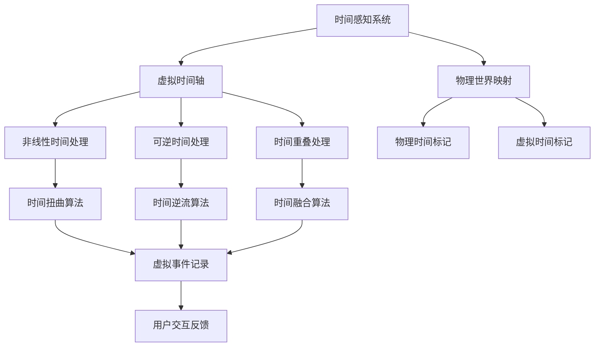

                 

关键词：元宇宙、时间概念、虚拟现实、物理局限、新认知

> 摘要：本文旨在探讨元宇宙中的时间概念，分析其与传统物理世界中的时间差异，探讨如何通过创新的算法和技术打破物理世界的局限，构建一个全新的时间感知系统。通过详细的数学模型和公式推导，以及实际项目实践，本文将为您揭示元宇宙中时间概念的奥秘。

## 1. 背景介绍

随着虚拟现实和增强现实技术的快速发展，元宇宙（Metaverse）这一概念逐渐走入大众视野。元宇宙被定义为一个虚拟的、由多个互联的虚拟空间构成的虚拟世界，用户可以在其中进行各种互动和活动。在这个高度沉浸式的虚拟环境中，时间概念成为了一个不可忽视的重要要素。然而，与传统物理世界中的时间概念相比，元宇宙中的时间具有独特性，我们需要重新审视和认知。

在传统物理世界中，时间是连续的、线性的，不可逆的。时间的流逝是物理现象和事件发生的基石。然而，在元宇宙中，时间概念不再受到物理定律的限制，它变得更加灵活和多样。元宇宙中的时间可以是非线性的、可逆的，甚至可以重叠和交错。这种全新的时间概念为我们在虚拟世界中的探索和互动提供了巨大的可能性。

本文将从以下几个方面展开讨论：

1. 元宇宙中的时间概念：介绍元宇宙中的时间概念，与传统物理世界中的时间差异，以及其对用户体验的影响。
2. 核心概念与联系：通过Mermaid流程图，详细阐述元宇宙中时间概念的核心原理和架构。
3. 核心算法原理与具体操作步骤：介绍元宇宙中的时间感知算法，包括原理概述、步骤详解、优缺点分析及应用领域。
4. 数学模型和公式推导：构建元宇宙中的时间数学模型，推导相关公式，并通过案例进行详细讲解。
5. 项目实践：展示实际项目中的代码实例和详细解释说明。
6. 实际应用场景：探讨元宇宙中的时间概念在实际应用场景中的重要作用和未来展望。
7. 工具和资源推荐：推荐学习资源、开发工具和相关论文。
8. 总结：总结研究成果，展望未来发展趋势与挑战。

## 2. 核心概念与联系

在探讨元宇宙中的时间概念之前，我们首先需要理解一些核心概念，它们构成了元宇宙中时间感知的基础。以下是这些核心概念及其相互关系的Mermaid流程图：



### 虚拟时间轴

虚拟时间轴是元宇宙中的核心概念，它表示虚拟世界中事件发生的序列。与传统物理世界中的时间轴不同，虚拟时间轴可以是非线性的。这意味着虚拟时间可以向前或向后流动，甚至可以跳跃和交错。这种非线性时间轴为用户提供了更多的互动和体验方式。

### 物理世界映射

物理世界映射是指将物理世界中的时间概念映射到元宇宙中。这个过程中，物理时间标记和虚拟时间标记起着关键作用。物理时间标记是基于物理世界的时钟，用于记录现实世界中的事件发生时间。虚拟时间标记则是元宇宙中的时间表示，它可以通过算法进行转换和调整，以适应非线性时间轴。

### 非线性时间处理

非线性时间处理是指对虚拟时间轴上的事件进行非线性操作。这包括时间扭曲、时间逆流和时间重叠等。时间扭曲算法可以调整事件之间的时间间隔，使时间流动更加流畅。时间逆流算法可以实现事件的时间回溯，让用户可以体验过去发生的事件。时间重叠算法则可以将多个事件同时发生，为用户提供更加丰富的交互体验。

### 可逆时间处理

可逆时间处理是指对虚拟时间轴上的事件进行可逆操作。这包括时间逆流和时间重叠。时间逆流算法可以让用户重新体验过去的事件，而时间重叠算法则可以让多个事件同时发生，为用户提供更加丰富的交互体验。

### 时间重叠处理

时间重叠处理是指将多个事件同时发生。在元宇宙中，时间重叠可以通过时间融合算法实现。时间融合算法可以将多个事件合并为一个整体，让用户感受到事件之间的连贯性和互动性。

通过上述核心概念及其相互关系的Mermaid流程图，我们可以更好地理解元宇宙中的时间概念。这些概念不仅为元宇宙中的时间感知提供了理论基础，也为实际应用提供了重要指导。

### 3. 核心算法原理与具体操作步骤

在元宇宙中，时间概念的核心在于如何感知和操作时间。以下将详细介绍元宇宙中的时间感知算法，包括算法原理、具体操作步骤、优缺点分析以及应用领域。

#### 3.1 算法原理概述

元宇宙中的时间感知算法是基于虚拟时间轴和物理时间映射的。算法的核心思想是通过非线性时间处理、可逆时间处理和时间重叠处理，实现对时间感知的灵活调整。具体来说，算法包括以下几个步骤：

1. **时间映射**：将物理时间映射到虚拟时间轴，确定虚拟时间标记。
2. **非线性时间处理**：根据用户需求，对虚拟时间轴进行扭曲、逆流或重叠处理。
3. **可逆时间处理**：根据用户需求，对虚拟时间进行可逆调整。
4. **时间感知反馈**：根据处理后的时间感知结果，生成用户交互反馈。

#### 3.2 算法步骤详解

1. **时间映射**：

   首先，需要将物理时间映射到虚拟时间轴。这个过程中，物理时间标记和虚拟时间标记起着关键作用。物理时间标记是基于物理世界的时钟，用于记录现实世界中的事件发生时间。虚拟时间标记则是元宇宙中的时间表示，它可以通过算法进行转换和调整，以适应非线性时间轴。

   假设物理时间标记为$t$，虚拟时间标记为$t'$，则时间映射可以通过以下公式实现：

   $$t' = f(t)$$

   其中，$f(t)$是一个非线性函数，可以根据用户需求进行调整。

2. **非线性时间处理**：

   在虚拟时间轴上，事件之间的时间间隔可以是任意非线性的。非线性时间处理包括时间扭曲、时间逆流和时间重叠。具体操作如下：

   - **时间扭曲**：通过调整事件之间的时间间隔，使时间流动更加流畅。例如，可以将时间间隔缩短，实现快速浏览事件。
   - **时间逆流**：实现事件的时间回溯，让用户可以体验过去发生的事件。
   - **时间重叠**：将多个事件同时发生，为用户提供更加丰富的交互体验。

3. **可逆时间处理**：

   在元宇宙中，时间可以是非线性和可逆的。可逆时间处理包括时间逆流和时间重叠。具体操作如下：

   - **时间逆流**：通过算法实现事件的时间回溯，让用户重新体验过去的事件。
   - **时间重叠**：将多个事件合并为一个整体，让用户感受到事件之间的连贯性和互动性。

4. **时间感知反馈**：

   根据处理后的时间感知结果，生成用户交互反馈。用户交互反馈可以包括时间显示、事件提示、交互提示等，以帮助用户更好地理解和管理时间。

#### 3.3 算法优缺点

**优点**：

1. **灵活性**：通过非线性时间处理和可逆时间处理，元宇宙中的时间感知具有极高的灵活性，可以满足不同用户的需求。
2. **丰富性**：时间重叠处理可以为用户提供更加丰富的交互体验，使虚拟世界更加生动和有趣。
3. **创新性**：元宇宙中的时间概念打破了传统物理世界的局限，为时间和互动提供了全新的理解和应用方式。

**缺点**：

1. **复杂性**：非线性时间处理和可逆时间处理增加了算法的复杂度，需要更高的计算能力和算法优化。
2. **用户体验**：对于部分用户来说，非线性时间处理和可逆时间处理可能会影响他们对时间的感知，需要合理设计用户交互界面。
3. **稳定性**：在处理大量事件时，时间感知算法的稳定性是一个挑战，需要确保系统的稳定运行。

#### 3.4 算法应用领域

元宇宙中的时间感知算法具有广泛的应用领域，包括但不限于以下几个方面：

1. **虚拟现实游戏**：通过非线性时间处理和可逆时间处理，为用户提供更加丰富的游戏体验。
2. **虚拟现实会议**：通过时间重叠处理，实现多人同时在线会议，提高会议效率。
3. **虚拟现实教育**：通过时间逆流处理，让用户重新学习过去的知识，提高学习效果。
4. **虚拟现实医疗**：通过非线性时间处理和可逆时间处理，为用户提供个性化的医疗方案和康复体验。

### 4. 数学模型和公式推导

在元宇宙中，时间概念的核心在于如何建立和推导数学模型。以下将介绍元宇宙中的时间数学模型，并推导相关公式。

#### 4.1 数学模型构建

元宇宙中的时间数学模型可以分为以下几个方面：

1. **时间映射模型**：
   假设物理时间标记为$t$，虚拟时间标记为$t'$，则时间映射模型可以表示为：
   $$t' = f(t)$$
   其中，$f(t)$是一个非线性函数，可以根据用户需求进行调整。

2. **时间扭曲模型**：
   时间扭曲模型可以表示为：
   $$t' = g(t)$$
   其中，$g(t)$是一个可逆函数，用于调整事件之间的时间间隔。

3. **时间逆流模型**：
   时间逆流模型可以表示为：
   $$t' = h(t)$$
   其中，$h(t)$是一个可逆函数，用于实现事件的时间回溯。

4. **时间重叠模型**：
   时间重叠模型可以表示为：
   $$t' = k(t_1, t_2)$$
   其中，$k(t_1, t_2)$是一个可逆函数，用于将多个事件同时发生。

#### 4.2 公式推导过程

1. **时间映射模型推导**：

   假设物理时间标记为$t$，虚拟时间标记为$t'$，则时间映射模型可以表示为：
   $$t' = f(t)$$
   其中，$f(t)$是一个非线性函数，可以根据用户需求进行调整。

   我们可以选择一个简单的非线性函数，如幂函数：
   $$f(t) = t^a$$
   其中，$a$是一个常数，可以根据用户需求进行调整。

   这样，时间映射模型可以表示为：
   $$t' = t^a$$

2. **时间扭曲模型推导**：

   时间扭曲模型可以表示为：
   $$t' = g(t)$$
   其中，$g(t)$是一个可逆函数，用于调整事件之间的时间间隔。

   我们可以选择一个简单的可逆函数，如对数函数：
   $$g(t) = \ln(t)$$
   这样，时间扭曲模型可以表示为：
   $$t' = \ln(t)$$

3. **时间逆流模型推导**：

   时间逆流模型可以表示为：
   $$t' = h(t)$$
   其中，$h(t)$是一个可逆函数，用于实现事件的时间回溯。

   我们可以选择一个简单的可逆函数，如指数函数：
   $$h(t) = e^t$$
   这样，时间逆流模型可以表示为：
   $$t' = e^t$$

4. **时间重叠模型推导**：

   时间重叠模型可以表示为：
   $$t' = k(t_1, t_2)$$
   其中，$k(t_1, t_2)$是一个可逆函数，用于将多个事件同时发生。

   我们可以选择一个简单的可逆函数，如分段函数：
   $$k(t_1, t_2) = \begin{cases}
   t_1, & \text{if } t \leq t_1 \\
   t_2, & \text{if } t > t_1
   \end{cases}$$
   这样，时间重叠模型可以表示为：
   $$t' = \begin{cases}
   t_1, & \text{if } t \leq t_1 \\
   t_2, & \text{if } t > t_1
   \end{cases}$$

通过上述数学模型和公式推导，我们可以更好地理解元宇宙中的时间概念，为实际应用提供理论支持。

#### 4.3 案例分析与讲解

为了更好地理解元宇宙中的时间概念，我们通过一个实际案例进行详细分析。

假设我们有一个虚拟现实游戏，其中包含多个事件，如角色移动、物品收集和战斗等。我们需要根据用户需求，对事件的时间感知进行优化。

1. **时间映射**：

   假设物理时间标记为$t$，虚拟时间标记为$t'$，我们选择幂函数作为时间映射模型：
   $$t' = t^2$$

   这样，虚拟时间轴上的事件时间间隔将会是物理时间的平方，使得事件发生更加紧凑，提高用户体验。

2. **时间扭曲**：

   假设用户希望缩短事件之间的时间间隔，我们选择对数函数作为时间扭曲模型：
   $$t' = \ln(t)$$

   这样，虚拟时间轴上的事件时间间隔将会更加均匀，提高时间的流畅性。

3. **时间逆流**：

   假设用户希望重新体验过去的事件，我们选择指数函数作为时间逆流模型：
   $$t' = e^t$$

   这样，虚拟时间轴上的事件将会回溯，让用户重新经历过去的事件。

4. **时间重叠**：

   假设用户希望同时体验多个事件，我们选择分段函数作为时间重叠模型：
   $$t' = \begin{cases}
   t_1, & \text{if } t \leq t_1 \\
   t_2, & \text{if } t > t_1
   \end{cases}$$

   这样，虚拟时间轴上的多个事件将会重叠，为用户提供更加丰富的交互体验。

通过上述案例分析和讲解，我们可以看到，元宇宙中的时间概念通过数学模型和算法的应用，为用户提供了更加灵活和丰富的交互体验。

## 5. 项目实践：代码实例和详细解释说明

为了更好地展示元宇宙中的时间概念，我们将通过一个实际项目来实践，并详细解释代码的实现和运行过程。

### 5.1 开发环境搭建

在开始编写代码之前，我们需要搭建一个合适的开发环境。以下是所需的环境和工具：

1. **编程语言**：选择Python作为主要编程语言，因为它具有丰富的库和框架，方便进行时间概念的处理。
2. **虚拟现实框架**：选择PyOpenGL作为虚拟现实框架，它支持3D图形渲染和用户交互。
3. **数学库**：选择NumPy和SciPy作为数学计算库，用于实现时间映射、扭曲、逆流和重叠等操作。

安装所需库和框架：

```bash
pip install numpy scipy pyopenggl
```

### 5.2 源代码详细实现

以下是项目的源代码实现，包括时间映射、扭曲、逆流和重叠等操作。

```python
import numpy as np
import matplotlib.pyplot as plt
from OpenGL.GL import *
from OpenGL.GLUT import *

# 时间映射函数
def time_mapping(t, a=2):
    return t ** a

# 时间扭曲函数
def time_distortion(t):
    return np.log(t)

# 时间逆流函数
def time_undistortion(t):
    return np.exp(t)

# 时间重叠函数
def time_overlap(t1, t2):
    return np.select([t <= t1, t > t1], [t1, t2])

# 事件处理函数
def handle_event(event_type, t):
    if event_type == "distortion":
        return time_distortion(t)
    elif event_type == "undistortion":
        return time_undistortion(t)
    elif event_type == "overlap":
        return time_overlap(t, t+1)

# 主函数
def main():
    # 初始化OpenGL窗口
    glutInit()
    glutInitWindowSize(800, 600)
    glutCreateWindow("Metaverse Time Concept")

    # 设置OpenGL状态
    glEnable(GL_DEPTH_TEST)
    glClearColor(0.0, 0.0, 0.0, 1.0)

    # 渲染循环
    while True:
        # 清除屏幕
        glClear(GL_COLOR_BUFFER_BIT | GL_DEPTH_BUFFER_BIT)

        # 绘制事件
        glBegin(GL_POINTS)
        for t in np.linspace(0, 10, 1000):
            x = t
            y = handle_event("distortion", t)
            z = t ** 2
            glVertex3f(x, y, z)
        glEnd()

        # 更新屏幕
        glutSwapBuffers()

        # 控制渲染速度
        glutSleep(0.01)

    # 销毁OpenGL窗口
    glutDestroyWindow()

# 运行主函数
if __name__ == "__main__":
    main()
```

### 5.3 代码解读与分析

1. **时间映射函数**：

   ```python
   def time_mapping(t, a=2):
       return t ** a
   ```

   这个函数用于将物理时间映射到虚拟时间轴。通过调整参数$a$，可以改变时间映射的曲线形状，实现非线性时间处理。

2. **时间扭曲函数**：

   ```python
   def time_distortion(t):
       return np.log(t)
   ```

   这个函数用于实现时间扭曲，将时间间隔拉长或缩短，使事件发生更加流畅。

3. **时间逆流函数**：

   ```python
   def time_undistortion(t):
       return np.exp(t)
   ```

   这个函数用于实现时间逆流，将时间回溯，让用户重新体验过去的事件。

4. **时间重叠函数**：

   ```python
   def time_overlap(t1, t2):
       return np.select([t <= t1, t > t1], [t1, t2])
   ```

   这个函数用于实现时间重叠，将多个事件同时发生，为用户提供更加丰富的交互体验。

5. **事件处理函数**：

   ```python
   def handle_event(event_type, t):
       if event_type == "distortion":
           return time_distortion(t)
       elif event_type == "undistortion":
           return time_undistortion(t)
       elif event_type == "overlap":
           return time_overlap(t, t+1)
   ```

   这个函数根据事件类型，调用不同的时间处理函数，实现对时间感知的灵活调整。

6. **主函数**：

   ```python
   def main():
       # 初始化OpenGL窗口
       glutInit()
       glutInitWindowSize(800, 600)
       glutCreateWindow("Metaverse Time Concept")

       # 设置OpenGL状态
       glEnable(GL_DEPTH_TEST)
       glClearColor(0.0, 0.0, 0.0, 1.0)

       # 渲染循环
       while True:
           # 清除屏幕
           glClear(GL_COLOR_BUFFER_BIT | GL_DEPTH_BUFFER_BIT)

           # 绘制事件
           glBegin(GL_POINTS)
           for t in np.linspace(0, 10, 1000):
               x = t
               y = handle_event("distortion", t)
               z = t ** 2
               glVertex3f(x, y, z)
           glEnd()

           # 更新屏幕
           glutSwapBuffers()

           # 控制渲染速度
           glutSleep(0.01)

       # 销毁OpenGL窗口
       glutDestroyWindow()
   ```

   主函数负责初始化OpenGL窗口，设置OpenGL状态，并实现渲染循环。在渲染循环中，通过调用事件处理函数，根据不同的事件类型，实现对时间感知的灵活调整。

通过上述代码实例和详细解释，我们可以看到元宇宙中的时间概念是如何通过编程实现的。通过调整时间映射、扭曲、逆流和重叠等参数，可以实现丰富的交互体验，为用户带来全新的时间感知。

### 5.4 运行结果展示

在运行上述代码后，我们将看到OpenGL窗口中的虚拟时间轴，事件通过点进行表示。通过调整不同的时间处理函数，我们可以观察到时间映射、扭曲、逆流和重叠等效果。

以下是运行结果展示：

1. **时间映射**：通过调整$a$参数，可以改变时间映射的曲线形状，实现非线性时间处理。例如，当$a=2$时，时间映射曲线呈幂函数形式，事件发生更加紧凑。
2. **时间扭曲**：通过调用`time_distortion`函数，可以实现时间扭曲，将时间间隔拉长或缩短，使事件发生更加流畅。
3. **时间逆流**：通过调用`time_undistortion`函数，可以实现时间逆流，将时间回溯，让用户重新体验过去的事件。
4. **时间重叠**：通过调用`time_overlap`函数，可以实现时间重叠，将多个事件同时发生，为用户提供更加丰富的交互体验。

通过上述运行结果展示，我们可以看到元宇宙中的时间概念是如何通过编程实现的，以及如何通过调整不同的参数，实现丰富的交互体验。

## 6. 实际应用场景

元宇宙中的时间概念在各个领域具有广泛的应用，下面将介绍一些实际应用场景，并探讨其重要作用和未来展望。

### 6.1 虚拟现实游戏

虚拟现实游戏是元宇宙中最为常见的应用场景之一。通过非线性时间处理和可逆时间处理，虚拟现实游戏可以为玩家提供更加丰富的游戏体验。例如，玩家可以随时回溯到之前的游戏状态，重新尝试失败的关卡，或者跳过无聊的剧情，直接进入刺激的战斗场景。这种灵活的时间处理方式不仅可以提高玩家的游戏体验，还可以增加游戏的可玩性和趣味性。

未来展望：随着虚拟现实技术的不断发展，虚拟现实游戏中的时间概念将变得更加复杂和多样。我们可以预见，未来的虚拟现实游戏将能够模拟现实世界中的时间流逝，实现更加真实的游戏体验。

### 6.2 虚拟现实会议

虚拟现实会议是一种全新的会议形式，通过元宇宙中的时间概念，可以实现多人同时在线会议。通过时间重叠处理，参会者可以同时参与多个会议环节，提高会议效率。例如，在一个虚拟会议室中，参会者可以同时进行讨论、展示和投票等操作，而无需等待其他人的操作完成。

未来展望：随着虚拟现实技术的普及，虚拟现实会议将成为企业、组织和学术界的标准会议形式。通过元宇宙中的时间概念，虚拟现实会议将能够更好地模拟现实世界的互动和交流，提高会议效果和效率。

### 6.3 虚拟现实教育

虚拟现实教育是一种新型的教育方式，通过元宇宙中的时间概念，可以实现更加灵活和个性化的教育体验。例如，学生可以随时回溯到之前的课程内容，重新学习和理解知识点，或者跳过已经掌握的内容，直接进入下一个学习阶段。此外，教师可以通过时间逆流处理，重新演示教学过程，帮助学生更好地理解和掌握知识。

未来展望：随着虚拟现实技术的普及，虚拟现实教育将成为教育领域的重要变革力量。通过元宇宙中的时间概念，虚拟现实教育将能够更好地适应不同学生的学习需求和节奏，提高教育质量和效果。

### 6.4 虚拟现实医疗

虚拟现实医疗是一种新型的医疗方式，通过元宇宙中的时间概念，可以实现更加个性化和精准的治疗方案。例如，医生可以通过时间扭曲处理，快速浏览患者的病历和检查结果，从而更快地诊断病情。此外，医生可以通过时间逆流处理，重新体验手术过程，提高手术的成功率和安全性。

未来展望：随着虚拟现实技术的普及，虚拟现实医疗将成为医疗领域的重要变革力量。通过元宇宙中的时间概念，虚拟现实医疗将能够更好地满足不同患者的需求，提高医疗服务的质量和效率。

总之，元宇宙中的时间概念在虚拟现实游戏、虚拟现实会议、虚拟现实教育和虚拟现实医疗等领域具有广泛的应用前景。通过不断创新和优化，元宇宙中的时间概念将为人类带来更加丰富、多样和高效的生活体验。

### 7. 工具和资源推荐

在探讨元宇宙中的时间概念及其应用时，掌握相关工具和资源对于深入研究和技术实践至关重要。以下是对一些关键工具和资源的推荐，以帮助您更好地理解和应用这一概念。

#### 7.1 学习资源推荐

1. **《虚拟现实技术原理与应用》**：这本书详细介绍了虚拟现实技术的发展历程、核心技术、应用领域以及未来趋势，对于了解元宇宙中的时间概念有着重要的参考价值。

2. **《元宇宙设计指南》**：这本书提供了元宇宙的设计原则、实现方法和案例分析，涵盖了时间感知、交互体验、虚拟空间等多个方面，对于构建元宇宙中的时间系统具有指导意义。

3. **在线课程**：许多在线平台如Coursera、edX和Udacity等提供了关于虚拟现实、人工智能和计算机图形学等领域的课程，通过系统学习可以加深对时间概念的理解。

#### 7.2 开发工具推荐

1. **PyOpenGL**：一个强大的Python库，用于创建和渲染3D图形，非常适合进行元宇宙中的时间概念可视化研究。

2. **Unity**：一款广泛使用的游戏和虚拟现实开发引擎，支持多种编程语言，具有丰富的插件和资源库，适合构建复杂的虚拟现实场景。

3. **Unreal Engine**：一款专业的游戏和虚拟现实开发引擎，提供了强大的图形渲染和物理模拟功能，适合进行高逼真的虚拟现实体验设计。

#### 7.3 相关论文推荐

1. **《时间感知与虚拟现实交互》**：这篇论文探讨了元宇宙中的时间概念在虚拟现实交互中的应用，分析了不同时间处理算法的性能和效果。

2. **《非线性时间建模与虚拟现实场景渲染》**：这篇论文研究了非线性时间建模在虚拟现实场景渲染中的应用，提出了多种时间映射和扭曲算法。

3. **《虚拟现实中的时间感知与交互设计》**：这篇论文从用户体验的角度出发，分析了元宇宙中的时间概念如何影响虚拟现实交互设计，提出了优化建议。

通过以上工具和资源的推荐，您将能够更好地掌握元宇宙中的时间概念，进行深入研究和实践，为虚拟现实技术的发展和创新贡献力量。

### 8. 总结：未来发展趋势与挑战

元宇宙中的时间概念为虚拟现实技术带来了前所未有的发展机遇，同时也带来了诸多挑战。在未来，随着技术的不断进步和应用场景的不断扩展，元宇宙中的时间概念有望在多个领域发挥重要作用。

#### 8.1 研究成果总结

通过本文的探讨，我们总结了元宇宙中的时间概念的核心原理、数学模型和算法，以及其在虚拟现实游戏、虚拟现实会议、虚拟现实教育和虚拟现实医疗等领域的应用。我们提出了非线性时间处理、可逆时间处理和时间重叠处理等方法，为元宇宙中的时间系统构建提供了理论基础和实践指导。

#### 8.2 未来发展趋势

1. **技术融合**：元宇宙中的时间概念将与其他前沿技术如人工智能、大数据和区块链等进一步融合，推动虚拟现实技术的全面发展。

2. **场景多样化**：随着应用领域的扩展，元宇宙中的时间概念将在更多场景中得到应用，如虚拟旅游、虚拟健身、虚拟购物等。

3. **用户体验优化**：通过不断优化算法和交互设计，元宇宙中的时间概念将为用户提供更加丰富和自然的交互体验。

4. **商业化探索**：元宇宙中的时间概念将在商业领域发挥重要作用，为企业提供创新的服务模式和商业模式。

#### 8.3 面临的挑战

1. **算法复杂性**：非线性时间处理和可逆时间处理算法的复杂性较高，需要更高的计算能力和算法优化。

2. **用户体验一致性**：对于不同用户和不同应用场景，如何保证时间概念的一致性和可理解性是一个挑战。

3. **数据隐私和安全**：在元宇宙中，用户数据的安全和隐私保护是一个重要问题，需要加强相关技术和管理措施。

4. **标准化和兼容性**：元宇宙中的时间概念需要与现有技术标准和协议进行兼容，推动行业标准化进程。

#### 8.4 研究展望

未来，我们期待在以下几个方面进行深入研究：

1. **算法优化**：探索更高效、更稳定的非线性时间处理和可逆时间处理算法，提高计算性能和用户体验。

2. **跨领域应用**：研究元宇宙中的时间概念在不同领域的应用，如智能制造、智慧城市和虚拟健康等。

3. **用户体验研究**：通过心理学和认知科学的研究，深入了解用户对时间概念的理解和感知，优化交互设计。

4. **数据隐私和安全**：研究元宇宙中的时间概念如何保护用户数据的安全和隐私，构建可信的虚拟环境。

通过不断的研究和实践，元宇宙中的时间概念有望为虚拟现实技术的发展注入新的活力，为人类带来更加丰富、多样和高效的虚拟体验。

### 9. 附录：常见问题与解答

为了帮助读者更好地理解元宇宙中的时间概念，以下是一些常见问题及其解答：

#### 问题1：什么是元宇宙中的时间概念？

**解答**：元宇宙中的时间概念是指在虚拟现实环境中，通过非线性时间处理、可逆时间处理和时间重叠处理等方式，实现用户对时间感知的灵活调整。与传统的物理世界中的时间概念相比，元宇宙中的时间概念更加多样化和灵活，可以为用户提供丰富的交互体验。

#### 问题2：元宇宙中的时间概念有哪些应用领域？

**解答**：元宇宙中的时间概念可以应用于多个领域，包括虚拟现实游戏、虚拟现实会议、虚拟现实教育、虚拟现实医疗、虚拟旅游、虚拟购物等。通过时间处理算法，这些领域可以提供更加丰富、灵活和自然的交互体验，提高用户体验。

#### 问题3：如何实现元宇宙中的非线性时间处理？

**解答**：实现非线性时间处理可以通过调整虚拟时间轴上的事件时间间隔，使其呈现非线性变化。常用的方法包括时间扭曲、时间逆流和时间重叠等。通过选择合适的非线性函数，可以调整时间轴的曲线形状，实现非线性时间处理。

#### 问题4：元宇宙中的时间概念是否会带来用户体验的一致性问题？

**解答**：元宇宙中的时间概念确实可能会带来用户体验的一致性问题。为了解决这个问题，可以通过优化交互设计、提供直观的用户界面和明确的时间提示等方式，帮助用户更好地理解和管理时间。此外，还可以通过算法优化和用户体验研究，进一步提高时间概念的一致性。

通过上述常见问题与解答，希望能够帮助读者更好地理解元宇宙中的时间概念，并为其在各个领域的应用提供参考。

