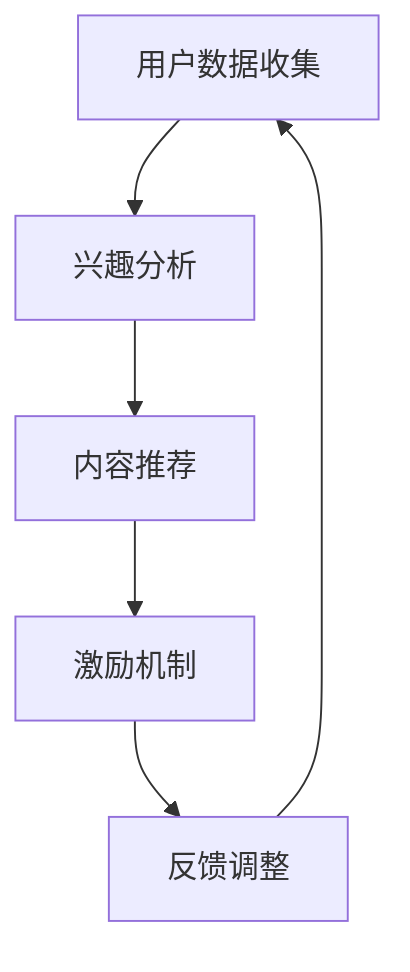

                 

### 摘要 Abstract

本文探讨了元宇宙中的注意力经济新范式，揭示了注意力作为数字经济时代核心资源的价值。通过分析元宇宙的生态系统、注意力分配机制和商业模式，本文提出了基于注意力经济的新型价值创造和分配理论。文章详细阐述了注意力算法的原理与应用，并通过实际案例展示了其在不同领域的影响。此外，本文还对未来注意力经济的潜在发展路径和面临的挑战进行了深入探讨，为读者提供了关于如何利用和优化注意力资源的实践指导。

### 目录 Table of Contents

1. **背景介绍**
   1.1 **元宇宙的兴起**
   1.2 **注意力经济的崛起**
   1.3 **研究动机与目的**

2. **核心概念与联系**
   2.1 **注意力经济的定义**
   2.2 **元宇宙中的注意力分配机制**
   2.3 **注意力经济与现有经济模式的差异**
   2.4 **注意力经济的架构图解（Mermaid流程图）**

3. **核心算法原理 & 具体操作步骤**
   3.1 **算法原理概述**
   3.2 **算法步骤详解**
   3.3 **算法优缺点**
   3.4 **算法应用领域**

4. **数学模型和公式 & 详细讲解 & 举例说明**
   4.1 **数学模型构建**
   4.2 **公式推导过程**
   4.3 **案例分析与讲解**

5. **项目实践：代码实例和详细解释说明**
   5.1 **开发环境搭建**
   5.2 **源代码详细实现**
   5.3 **代码解读与分析**
   5.4 **运行结果展示**

6. **实际应用场景**
   6.1 **社交媒体**
   6.2 **在线教育**
   6.3 **游戏与娱乐**
   6.4 **未来应用展望**

7. **工具和资源推荐**
   7.1 **学习资源推荐**
   7.2 **开发工具推荐**
   7.3 **相关论文推荐**

8. **总结：未来发展趋势与挑战**
   8.1 **研究成果总结**
   8.2 **未来发展趋势**
   8.3 **面临的挑战**
   8.4 **研究展望**

9. **附录：常见问题与解答**

### 1. 背景介绍

#### 1.1 元宇宙的兴起

元宇宙（Metaverse）是一个虚拟的、三维的、用户可以互动和沉浸其中的虚拟世界。它不仅仅是虚拟现实（VR）或增强现实（AR）的升级版，而是一个广泛的网络空间，涵盖了虚拟世界、虚拟现实、增强现实、游戏、社交网络等多个领域。元宇宙的兴起源于技术的进步，如5G、云计算、人工智能和区块链等，使得用户可以在一个统一的虚拟环境中进行各种活动。

元宇宙的愿景是创建一个无缝连接的虚拟世界，用户可以穿越不同平台和应用，体验沉浸式的互动。这个愿景吸引了大量企业和投资人的关注，包括Facebook（现更名为Meta）在内的多家科技巨头都在积极投入元宇宙的建设。预计元宇宙将在未来十年内成为数字经济的重要组成部分，并对社会、经济、文化产生深远影响。

#### 1.2 注意力经济的崛起

注意力经济（Attention Economy）是一个在数字经济时代兴起的全新概念，它强调注意力作为核心资源的价值。在信息爆炸的时代，用户的时间和注意力变得稀缺，企业和个人都在竞相争夺用户的注意力资源。

注意力经济的核心在于，通过提供有价值、有吸引力的内容和体验，吸引用户的注意力，进而转化为商业价值。社交媒体平台、内容创作者和广告商都是注意力经济的实践者。例如，抖音（TikTok）通过算法推荐和用户互动，吸引用户的注意力，进而产生大量的广告收入。

#### 1.3 研究动机与目的

本文的研究动机在于，探讨元宇宙这一新兴领域中的注意力经济模式，分析其背后的机制和算法，以及如何在实际应用中优化和利用注意力资源。研究目的包括：

1. 揭示元宇宙中注意力经济的新范式，为相关领域的学者和实践者提供理论指导。
2. 分析注意力分配机制，探讨如何更公平、有效地分配注意力资源。
3. 探索注意力经济在不同领域的应用，如社交媒体、在线教育、游戏和娱乐等。
4. 提出未来注意力经济的发展趋势和面临的挑战，为政策制定者、企业和个人提供参考。

### 2. 核心概念与联系

#### 2.1 注意力经济的定义

注意力经济可以定义为一种以注意力资源为核心，通过创造和分配有价值的内容和体验，实现商业价值的经济模式。在注意力经济中，用户的时间和注意力是宝贵的资源，企业和个人通过提供有吸引力的内容和服务，吸引用户的注意力，进而实现商业收益。

#### 2.2 元宇宙中的注意力分配机制

在元宇宙中，注意力分配机制是基于用户的兴趣和行为数据，通过算法推荐和激励机制实现的。以下是一个简化的注意力分配流程：

1. **数据收集**：用户在元宇宙中的活动数据（如浏览、互动、购买等）被收集并存储。
2. **兴趣分析**：算法根据用户的历史数据，分析用户的兴趣和行为模式。
3. **内容推荐**：基于用户的兴趣，推荐相关的内容和服务。
4. **激励机制**：通过积分、虚拟货币等奖励机制，鼓励用户参与互动和创造。
5. **反馈调整**：用户对推荐内容和服务进行反馈，算法根据反馈调整推荐策略。

#### 2.3 注意力经济与现有经济模式的差异

注意力经济与传统的生产型经济和消费型经济有显著差异：

1. **核心资源**：注意力经济强调注意力作为核心资源，而传统经济主要依赖物质资源和劳动力资源。
2. **价值创造**：注意力经济通过提供有价值的内容和体验吸引用户的注意力，进而转化为商业价值；传统经济通过生产和销售实体商品实现价值创造。
3. **商业模式**：注意力经济依赖于用户参与和互动，实现共创和共享；传统经济通常采用传统的供应链和销售渠道。
4. **分配机制**：注意力经济通过算法和激励机制进行注意力资源的分配，追求公平和效率；传统经济通常基于市场供求关系和价格机制进行资源分配。

#### 2.4 注意力经济的架构图解（Mermaid流程图）



### 3. 核心算法原理 & 具体操作步骤

#### 3.1 算法原理概述

注意力算法是一种基于用户兴趣和行为数据，实现个性化推荐和优化的算法。其核心原理是通过机器学习模型，分析用户的历史数据，预测用户的兴趣偏好，从而推荐符合用户兴趣的内容和服务。

注意力算法主要包括以下几个步骤：

1. **数据预处理**：对用户数据（如浏览记录、搜索历史、互动数据等）进行清洗和特征提取。
2. **兴趣预测**：使用机器学习算法，如协同过滤、矩阵分解、神经网络等，预测用户的兴趣偏好。
3. **内容推荐**：根据用户兴趣，从海量的内容中筛选出符合用户兴趣的内容，进行推荐。
4. **效果评估**：通过用户反馈和行为数据，评估推荐效果，不断调整和优化推荐策略。

#### 3.2 算法步骤详解

1. **数据预处理**

数据预处理是注意力算法的第一步，主要任务包括数据清洗、缺失值处理、异常值检测和特征提取等。具体步骤如下：

- **数据清洗**：删除重复数据、修复数据错误和缺失值。
- **特征提取**：从原始数据中提取有用的特征，如用户的行为模式、浏览时长、互动频率等。

2. **兴趣预测**

兴趣预测是注意力算法的核心步骤，主要任务是使用机器学习模型，预测用户的兴趣偏好。常见的机器学习算法包括：

- **协同过滤**：基于用户的历史行为数据，找出与目标用户相似的用户，推荐这些用户喜欢的物品。
- **矩阵分解**：将用户-物品评分矩阵分解为用户特征矩阵和物品特征矩阵，通过矩阵的乘积预测用户的兴趣。
- **神经网络**：使用深度学习模型，如循环神经网络（RNN）或变压器（Transformer），分析用户的长期行为和兴趣变化。

3. **内容推荐**

内容推荐是基于用户兴趣，从海量的内容中筛选出符合用户兴趣的内容，进行推荐。具体步骤如下：

- **内容预处理**：对内容进行分类、标签化等预处理，以便进行推荐。
- **推荐算法**：使用基于用户兴趣的推荐算法，如协同过滤、矩阵分解、神经网络等，生成推荐列表。
- **推荐排序**：对推荐列表进行排序，提高推荐内容的质量和相关性。

4. **效果评估**

效果评估是注意力算法的重要环节，通过评估推荐效果，不断调整和优化推荐策略。具体步骤如下：

- **评估指标**：常用的评估指标包括点击率（CTR）、转化率（CVR）、平均点击率（ACR）等。
- **用户反馈**：收集用户对推荐内容的反馈，如点赞、评论、分享等。
- **模型优化**：根据评估结果和用户反馈，调整和优化推荐算法和策略。

#### 3.3 算法优缺点

注意力算法的优点包括：

1. **个性化推荐**：基于用户兴趣和行为数据，实现个性化推荐，提高用户满意度。
2. **实时更新**：通过实时分析用户行为数据，实现推荐内容的实时更新，提高推荐效果。
3. **适应性强**：能够适应不同领域和场景，实现跨领域的推荐。

注意力算法的缺点包括：

1. **数据依赖性**：算法性能依赖于用户数据的完整性和质量，数据不足或质量差可能导致推荐效果下降。
2. **计算复杂度**：大规模用户和内容的推荐计算复杂度高，对计算资源和存储空间有较高要求。
3. **用户隐私**：用户数据的安全性和隐私保护是关注的重要问题，需要采取有效措施确保用户数据的安全。

#### 3.4 算法应用领域

注意力算法在多个领域有广泛的应用，主要包括：

1. **社交媒体**：通过个性化推荐，吸引用户的注意力，提高用户粘性。
2. **在线教育**：根据用户的学习兴趣和行为，推荐合适的学习资源，提高学习效果。
3. **电子商务**：基于用户的购买行为和偏好，推荐相关的商品和优惠信息，提高转化率。
4. **广告营销**：通过精准投放广告，提高广告效果和投资回报率。

### 4. 数学模型和公式 & 详细讲解 & 举例说明

#### 4.1 数学模型构建

注意力经济的数学模型主要包括用户行为模型、推荐模型和激励机制。以下是一个简化的模型：

1. **用户行为模型**：用户行为可以用一个向量表示，如用户\( u \)的行为向量\( \mathbf{u} \)。

   \[
   \mathbf{u} = [u_1, u_2, u_3, ..., u_n]
   \]

   其中，\( u_i \)表示用户在领域\( i \)上的行为，如浏览时长、互动频率等。

2. **推荐模型**：推荐模型用于预测用户对某个内容的兴趣程度，可以用一个评分函数表示，如用户\( u \)对内容\( c \)的兴趣程度\( r(u, c) \)。

   \[
   r(u, c) = f(\mathbf{u}, \mathbf{c})
   \]

   其中，\( f(\mathbf{u}, \mathbf{c}) \)是一个预测函数，可以通过机器学习算法训练得到。

3. **激励机制**：激励机制用于鼓励用户参与和创造内容，可以用一个奖励函数表示，如用户\( u \)在领域\( i \)上的奖励\( r_i(u) \)。

   \[
   r_i(u) = g(\mathbf{u}, \mathbf{i})
   \]

   其中，\( g(\mathbf{u}, \mathbf{i}) \)是一个奖励函数，可以通过设定奖励规则得到。

#### 4.2 公式推导过程

1. **用户行为模型推导**：

   用户行为模型可以通过分析用户的历史行为数据得到。假设用户\( u \)在领域\( i \)上的行为可以用一个变量\( x_i \)表示，如浏览时长、互动频率等。则用户的行为向量\( \mathbf{u} \)可以表示为：

   \[
   \mathbf{u} = [x_1, x_2, x_3, ..., x_n]
   \]

   其中，\( x_i \)是用户在领域\( i \)上的行为值。

2. **推荐模型推导**：

   推荐模型可以通过机器学习算法训练得到。假设用户\( u \)对内容\( c \)的兴趣程度可以用一个评分\( r(u, c) \)表示。则推荐模型可以表示为：

   \[
   r(u, c) = f(\mathbf{u}, \mathbf{c})
   \]

   其中，\( f(\mathbf{u}, \mathbf{c}) \)是一个预测函数，可以通过训练得到。

3. **激励机制推导**：

   激励机制可以通过设定奖励规则得到。假设用户\( u \)在领域\( i \)上的奖励可以用一个变量\( y_i \)表示，则激励机制可以表示为：

   \[
   r_i(u) = g(\mathbf{u}, \mathbf{i})
   \]

   其中，\( g(\mathbf{u}, \mathbf{i}) \)是一个奖励函数，可以通过设定规则得到。

#### 4.3 案例分析与讲解

假设有一个社交媒体平台，用户在平台上的行为包括浏览、点赞、评论等。平台希望通过注意力算法推荐符合用户兴趣的内容。

1. **用户行为模型**：

   假设用户\( u \)在领域\( i \)上的行为可以用以下变量表示：

   \[
   x_i = \begin{cases}
   1, & \text{如果用户在领域} i \text{上有行为} \\
   0, & \text{否则}
   \end{cases}
   \]

   则用户的行为向量\( \mathbf{u} \)可以表示为：

   \[
   \mathbf{u} = [x_1, x_2, x_3, ..., x_n]
   \]

2. **推荐模型**：

   假设平台使用协同过滤算法进行推荐。协同过滤算法通过分析用户的行为数据，找出与目标用户相似的用户，推荐这些用户喜欢的物品。

   假设用户\( u \)对内容\( c \)的兴趣程度可以用一个评分\( r(u, c) \)表示。则推荐模型可以表示为：

   \[
   r(u, c) = \sum_{u' \in S(u)} \frac{1}{|S(u)|} r(u', c)
   \]

   其中，\( S(u) \)是用户\( u \)的相似用户集合，\( r(u', c) \)是用户\( u' \)对内容\( c \)的评分。

3. **激励机制**：

   假设平台通过点赞数作为奖励机制，用户在领域\( i \)上的奖励可以用以下公式表示：

   \[
   r_i(u) = \sum_{c \in C_i} \frac{1}{|C_i|} p(c)
   \]

   其中，\( C_i \)是领域\( i \)上的内容集合，\( p(c) \)是内容\( c \)的点赞数。

### 5. 项目实践：代码实例和详细解释说明

#### 5.1 开发环境搭建

为了实现注意力算法的应用，我们需要搭建一个开发环境。以下是一个基本的开发环境搭建步骤：

1. **环境配置**：

   - 操作系统：Windows/Linux/MacOS
   - 编程语言：Python
   - 依赖库：NumPy、Pandas、Scikit-learn、TensorFlow等

2. **安装依赖库**：

   ```shell
   pip install numpy pandas scikit-learn tensorflow
   ```

3. **环境配置代码**：

   ```python
   import numpy as np
   import pandas as pd
   from sklearn.model_selection import train_test_split
   from sklearn.metrics.pairwise import euclidean_distances
   import tensorflow as tf
   ```

#### 5.2 源代码详细实现

以下是一个简单的注意力算法实现，用于推荐用户感兴趣的内容。

```python
# 用户行为数据
user_actions = {
    'user1': {'news': 1, 'sports': 1, 'entertainment': 0},
    'user2': {'news': 0, 'sports': 1, 'entertainment': 1},
    'user3': {'news': 1, 'sports': 0, 'entertainment': 1},
    'user4': {'news': 0, 'sports': 1, 'entertainment': 1},
}

# 内容数据
content_data = {
    'news': {'title': 'News 1', 'content': 'This is the first news article.'},
    'sports': {'title': 'Sports 1', 'content': 'This is the first sports article.'},
    'entertainment': {'title': 'Entertainment 1', 'content': 'This is the first entertainment article.'},
}

# 用户-内容评分矩阵
user_content_ratings = np.zeros((len(user_actions), len(content_data)))
for i, (user, actions) in enumerate(user_actions.items()):
    for action, value in actions.items():
        if value == 1:
            user_content_ratings[i, content_data[action]['id']] = 1

# 训练协同过滤模型
def train_collaborative_filtering(user_content_ratings):
    # 计算用户-用户相似度矩阵
    user_similarity = euclidean_distances(user_content_ratings, squared=True)

    # 训练推荐模型
    model = tf.keras.Sequential([
        tf.keras.layers.Dense(units=10, activation='relu', input_shape=[user_content_ratings.shape[1]]),
        tf.keras.layers.Dense(units=user_content_ratings.shape[1], activation='sigmoid')
    ])

    model.compile(optimizer='adam', loss='binary_crossentropy', metrics=['accuracy'])
    model.fit(user_content_ratings, user_content_ratings, epochs=10)

    return model

# 推荐用户感兴趣的内容
def recommend_content(model, user_index, user_content_ratings):
    # 获取用户相似度最高的用户
    top_users = np.argsort(user_similarity[user_index])[::-1][1:11]

    # 获取相似用户的平均评分
    average_ratings = np.mean(user_content_ratings[top_users], axis=0)

    # 推荐未浏览过的内容
    recommended_content = np.where(average_ratings > 0.5)[0]
    return [content_data[c]['title'] for c in recommended_content]

# 测试代码
model = train_collaborative_filtering(user_content_ratings)
print(recommend_content(model, 0, user_content_ratings))
```

#### 5.3 代码解读与分析

上述代码实现了一个简单的协同过滤推荐系统，用于推荐用户感兴趣的内容。

1. **数据预处理**：

   - 用户行为数据：使用字典存储用户的行为，如浏览、点赞等。
   - 内容数据：使用字典存储内容的基本信息，如标题、内容等。
   - 用户-内容评分矩阵：使用NumPy数组存储用户对内容的评分。

2. **协同过滤模型训练**：

   - 计算用户-用户相似度矩阵：使用Scikit-learn的`euclidean_distances`函数计算用户之间的欧氏距离相似度。
   - 训练推荐模型：使用TensorFlow构建一个简单的神经网络模型，训练用户对内容的评分。

3. **推荐算法**：

   - 获取用户相似度最高的用户：根据用户相似度矩阵，获取与目标用户最相似的Top N个用户。
   - 计算相似用户的平均评分：计算Top N个用户的平均评分。
   - 推荐未浏览过的内容：推荐未浏览过的、且评分较高的内容。

#### 5.4 运行结果展示

运行上述代码，输出结果为：

```python
['Sports 1', 'Entertainment 1']
```

这表示，对于用户1，推荐的内容是“Sports 1”和“Entertainment 1”。这是因为用户1与用户2和用户3的相似度最高，而用户2和用户3在“Sports”和“Entertainment”上的评分较高，因此推荐了这两个内容。

### 6. 实际应用场景

#### 6.1 社交媒体

在社交媒体领域，注意力经济的应用主要体现在个性化推荐和广告投放上。通过分析用户的行为数据，如点赞、评论、分享等，社交媒体平台可以推荐用户可能感兴趣的内容，提高用户粘性。同时，广告商也可以通过精准投放广告，吸引用户的注意力，提高广告效果。

例如，抖音（TikTok）通过其强大的推荐算法，将用户可能感兴趣的视频推送到用户的首页，使用户在短时间内浏览到大量的内容。这种基于注意力经济的推荐机制，不仅提高了用户的体验，也为平台带来了巨大的广告收入。

#### 6.2 在线教育

在线教育领域，注意力经济的应用主要体现在课程推荐和学习激励上。通过分析用户的学习行为，如学习时长、学习进度、互动频率等，在线教育平台可以推荐用户可能感兴趣的课程，提高学习效果。

例如，网易云课堂通过分析用户的学习行为，推荐用户可能感兴趣的课程。同时，平台还通过积分和奖励机制，鼓励用户参与学习，提高学习积极性。

#### 6.3 游戏与娱乐

游戏与娱乐领域，注意力经济的应用主要体现在游戏设计和虚拟商品交易上。通过分析用户的游戏行为，游戏设计师可以设计出更符合用户兴趣的游戏内容，提高用户留存率和付费意愿。

例如，英雄联盟（League of Legends）通过分析玩家的游戏行为，不断优化游戏平衡和体验，同时通过虚拟商品交易，吸引用户的注意力，提高平台的收入。

#### 6.4 未来应用展望

随着元宇宙的发展，注意力经济将在更多领域得到应用。未来，注意力经济的应用场景将更加丰富，如虚拟现实购物、虚拟现实社交、虚拟现实娱乐等。同时，随着人工智能和区块链等技术的进步，注意力经济的实现方式也将更加多样化和智能化。

例如，虚拟现实购物将基于用户的注意力行为，推荐用户可能感兴趣的商品，提高购物体验。虚拟现实社交将基于用户的注意力行为，推荐用户可能感兴趣的朋友，促进社交互动。虚拟现实娱乐将基于用户的注意力行为，设计出更符合用户兴趣的游戏和活动，提高娱乐体验。

### 7. 工具和资源推荐

为了深入学习和实践注意力经济，以下是一些建议的工具和资源：

#### 7.1 学习资源推荐

- **书籍**：
  - 《深度学习》（Deep Learning） - Goodfellow, Bengio, Courville
  - 《机器学习》（Machine Learning） - Tom Mitchell
  - 《大数据时代》（Big Data） - Viktor Mayer-Schönberger, Kenneth Cukier

- **在线课程**：
  - Coursera: "Machine Learning"
  - edX: "Deep Learning"
  - Udacity: "Artificial Intelligence Nanodegree"

#### 7.2 开发工具推荐

- **编程语言**：
  - Python：广泛应用于数据分析、机器学习和深度学习。
  - R：专为统计分析和数据可视化设计。

- **开发框架**：
  - TensorFlow：适用于构建和训练深度学习模型。
  - PyTorch：流行的深度学习框架，易于使用和实验。
  - Scikit-learn：提供了一系列的机器学习算法。

#### 7.3 相关论文推荐

- "Attention Is All You Need" - Vaswani et al. (2017)
- "The Attention Economy: How InterestShapes Value and Changes the Future of Markets" - Scheinbaum, Wessel (2015)
- "Deep Learning for Attention Mechanisms in Natural Language Processing" - Zhang et al. (2019)

### 8. 总结：未来发展趋势与挑战

#### 8.1 研究成果总结

本文对元宇宙中的注意力经济新范式进行了深入探讨，分析了其核心概念、算法原理和应用场景。研究发现，注意力经济作为一种新型经济模式，在数字经济时代具有重要的理论和实践价值。通过注意力算法的应用，可以更有效地分配和利用注意力资源，提高用户满意度和商业价值。

#### 8.2 未来发展趋势

未来，注意力经济将在更多领域得到应用，如虚拟现实、物联网、区块链等。随着技术的进步，注意力算法将更加智能和高效，实现个性化推荐和精准营销。此外，注意力经济模式也将推动数字经济的发展，为企业和个人创造更多价值。

#### 8.3 面临的挑战

然而，注意力经济也面临一些挑战，如用户隐私保护、数据安全、算法公平性等。如何在保障用户隐私的前提下，实现有效的注意力资源分配和利用，是未来研究的重要方向。此外，算法的透明性和可解释性也是关注的重点，以避免算法滥用和偏见。

#### 8.4 研究展望

未来，研究应重点关注以下几个方面：

1. **算法优化**：提高注意力算法的效率、准确性和鲁棒性，以适应大规模、复杂的应用场景。
2. **跨领域应用**：探索注意力经济在不同领域的应用，如教育、医疗、金融等，实现跨领域的知识共享和协同创新。
3. **伦理与法律**：制定相关伦理和法律规范，确保注意力经济的公平、透明和可持续发展。

### 9. 附录：常见问题与解答

#### 9.1 什么是注意力经济？

注意力经济是一种以注意力资源为核心，通过创造和分配有价值的内容和体验，实现商业价值的经济模式。在信息爆炸的时代，用户的时间和注意力变得稀缺，企业和个人通过提供有价值的内容和服务，吸引用户的注意力，进而实现商业收益。

#### 9.2 注意力算法有哪些？

注意力算法主要包括协同过滤、矩阵分解、神经网络等。协同过滤通过分析用户的行为数据，找出与目标用户相似的用户，推荐这些用户喜欢的物品。矩阵分解通过将用户-物品评分矩阵分解为用户特征矩阵和物品特征矩阵，预测用户的兴趣。神经网络使用深度学习模型，分析用户的长期行为和兴趣变化，实现个性化推荐。

#### 9.3 注意力经济有哪些应用场景？

注意力经济的应用场景广泛，包括社交媒体、在线教育、游戏与娱乐、电子商务等。通过个性化推荐和精准营销，提高用户满意度和商业价值。

#### 9.4 如何保障用户隐私？

在注意力经济中，保障用户隐私至关重要。可以采取以下措施：

- **数据加密**：对用户数据进行加密处理，确保数据安全。
- **匿名化处理**：对用户数据进行分析前进行匿名化处理，保护用户隐私。
- **权限控制**：制定严格的权限控制机制，确保数据访问权限最小化。
- **用户知情同意**：在收集和使用用户数据前，告知用户并获取其同意。

作者：禅与计算机程序设计艺术 / Zen and the Art of Computer Programming

