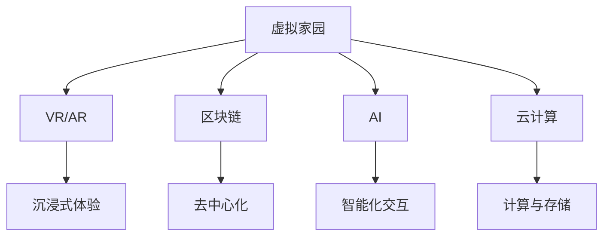

                 

关键词：元宇宙、虚拟家园、数字移民、数字孪生、虚拟现实、增强现实、社交网络、数字化生存、智能合约、区块链、云计算、AI、虚拟资产、去中心化。

> 摘要：随着数字技术的迅猛发展，元宇宙正在逐渐成为一个全新的虚拟世界，为数字移民提供了一个广阔的栖息地。本文将探讨元宇宙中的虚拟家园，分析其核心技术、实现方法及其对人类社会的影响。

## 1. 背景介绍

### 元宇宙的兴起

元宇宙（Metaverse）是一个由数字技术构建的虚拟空间，它超越了传统的互联网应用，融合了虚拟现实（VR）、增强现实（AR）、区块链、人工智能（AI）等多种技术，构建了一个高度互联、沉浸式的虚拟世界。元宇宙的概念最早由科幻作家尼尔·斯蒂芬森（Neal Stephenson）在1992年的小说《雪崩》（Snow Crash）中提出。近年来，随着技术的发展，元宇宙逐渐从科幻小说走向现实。

### 数字移民的兴起

随着元宇宙的兴起，越来越多的人开始选择在虚拟世界中生活、工作、娱乐。这种现象被称为“数字移民”（Digital Immigrants）。与传统移民不同，数字移民并没有实际的地理位置变化，而是在虚拟空间中寻找新的家园。数字移民的兴起不仅改变了人类的生活方式，也对社会的各个领域产生了深远的影响。

## 2. 核心概念与联系

### 虚拟家园的概念

虚拟家园是指元宇宙中为数字移民提供居住和社交空间的数字实体。虚拟家园可以是单个用户的私人空间，也可以是多人共享的社区空间。虚拟家园的核心功能包括空间设计、社交互动、资产管理和虚拟经济。

### 核心技术的联系

虚拟家园的实现依赖于多种核心技术的支持，包括虚拟现实、增强现实、区块链、人工智能、云计算等。

- **虚拟现实与增强现实**：VR和AR技术为虚拟家园提供了沉浸式的体验，使得用户可以在虚拟空间中自由互动、探索和创造。

- **区块链**：区块链技术为虚拟家园提供了去中心化的数据存储和身份验证机制，确保了用户隐私和数据安全性。

- **人工智能**：AI技术为虚拟家园提供了智能化的交互体验，包括语音识别、自然语言处理、个性化推荐等。

- **云计算**：云计算技术为虚拟家园提供了强大的计算和存储能力，支持大规模用户的实时交互和数据处理。

下面是一个简化的Mermaid流程图，展示了虚拟家园与核心技术之间的联系：



## 3. 核心算法原理 & 具体操作步骤

### 3.1 算法原理概述

虚拟家园的核心算法主要包括空间生成算法、交互算法和经济算法。

- **空间生成算法**：用于生成虚拟家园的空间结构，包括地形、建筑、装饰等。空间生成算法通常采用3D建模技术和实时渲染技术。

- **交互算法**：用于处理用户在虚拟家园中的行为和交互，包括聊天、动作、交易等。交互算法需要结合人工智能技术，实现自然语言理解和意图识别。

- **经济算法**：用于管理虚拟家园中的经济系统，包括虚拟货币的发行、交易和分配。经济算法通常采用区块链技术，确保去中心化和安全性。

### 3.2 算法步骤详解

#### 3.2.1 空间生成算法

1. **地形生成**：使用Perlin噪声函数生成随机地形，包括山脉、平原、河流等。

2. **建筑生成**：使用3D建模软件生成建筑模型，包括住宅、商店、办公楼等。

3. **装饰生成**：在建筑内部和外部的空间中添加装饰元素，包括家具、艺术品等。

#### 3.2.2 交互算法

1. **用户认证**：使用区块链技术验证用户身份。

2. **自然语言处理**：使用自然语言处理技术处理用户输入的文本，识别用户的意图和需求。

3. **动作模拟**：根据用户的意图，模拟用户在虚拟家园中的动作，如聊天、行走、跳舞等。

#### 3.2.3 经济算法

1. **虚拟货币发行**：创建一个虚拟货币系统，用于在虚拟家园中交易和支付。

2. **交易处理**：使用区块链技术记录和验证交易，确保透明和不可篡改。

3. **收益分配**：根据用户的贡献和活动，分配虚拟货币收益。

### 3.3 算法优缺点

#### 优点：

- **沉浸式体验**：虚拟家园提供高度沉浸式的体验，用户可以在虚拟空间中自由探索和创造。

- **去中心化**：区块链技术确保了虚拟家园的去中心化，避免了单点故障和中心化风险。

- **经济激励**：虚拟家园的经济系统激励用户积极参与，促进社区的发展和繁荣。

#### 缺点：

- **技术门槛**：实现虚拟家园需要多种技术的结合，技术门槛较高。

- **安全性问题**：区块链技术虽然去中心化，但仍然存在安全性问题，如51%攻击等。

### 3.4 算法应用领域

虚拟家园算法在元宇宙中具有广泛的应用领域，包括虚拟房地产、虚拟社交、虚拟娱乐等。

- **虚拟房地产**：用户可以购买、租赁和建造虚拟地产，进行投资和经营。

- **虚拟社交**：用户可以在虚拟家园中建立社交关系，进行聊天、聚会、活动等。

- **虚拟娱乐**：虚拟家园提供丰富的娱乐内容，包括游戏、演出、展览等。

## 4. 数学模型和公式 & 详细讲解 & 举例说明

### 4.1 数学模型构建

虚拟家园的数学模型主要包括空间模型、交互模型和经济模型。

#### 空间模型

虚拟家园的空间模型可以表示为：

\[ S = \{T, B, D\} \]

其中，\( T \) 表示地形，\( B \) 表示建筑，\( D \) 表示装饰。

#### 交互模型

虚拟家园的交互模型可以表示为：

\[ I = \{U, A, T\} \]

其中，\( U \) 表示用户，\( A \) 表示动作，\( T \) 表示时间。

#### 经济模型

虚拟家园的经济模型可以表示为：

\[ E = \{M, T, R\} \]

其中，\( M \) 表示货币，\( T \) 表示交易，\( R \) 表示收益。

### 4.2 公式推导过程

虚拟家园的数学模型需要结合多种技术进行推导和实现。以下是几个关键公式的推导过程。

#### 空间模型公式

1. **地形生成公式**：

\[ T = P + N(t) \]

其中，\( P \) 表示初始地形，\( N(t) \) 表示Perlin噪声函数，用于生成随机地形。

2. **建筑生成公式**：

\[ B = M(B_1, B_2, ..., B_n) \]

其中，\( B_1, B_2, ..., B_n \) 表示建筑模型，\( M \) 表示建模函数。

#### 交互模型公式

1. **用户认证公式**：

\[ U = K(U_1, U_2, ..., U_n) \]

其中，\( U_1, U_2, ..., U_n \) 表示用户身份信息，\( K \) 表示加密函数。

2. **自然语言处理公式**：

\[ A = NLP(S) \]

其中，\( S \) 表示用户输入的文本，\( NLP \) 表示自然语言处理函数。

#### 经济模型公式

1. **虚拟货币发行公式**：

\[ M = M_0 + \alpha(T) \]

其中，\( M_0 \) 表示初始货币量，\( \alpha(T) \) 表示货币发行函数。

2. **交易处理公式**：

\[ T = T_1 \oplus T_2 \]

其中，\( T_1, T_2 \) 表示交易信息，\( \oplus \) 表示加密函数。

### 4.3 案例分析与讲解

以下是一个简单的虚拟家园案例，用于说明数学模型的应用。

#### 案例描述

一个用户想要在虚拟家园中购买一块地皮，用于建造自己的房屋。

#### 案例分析

1. **空间模型**：

用户首先需要生成一块地皮的空间模型，使用地形生成公式生成地形，然后使用建筑生成公式生成建筑模型。

\[ T = P + N(t) \]
\[ B = M(B_1, B_2, ..., B_n) \]

2. **交互模型**：

用户需要进行用户认证，然后通过自然语言处理函数识别购买地皮的意图。

\[ U = K(U_1, U_2, ..., U_n) \]
\[ A = NLP(S) \]

3. **经济模型**：

用户需要支付虚拟货币购买地皮，虚拟货币的发行量和交易量需要通过经济模型进行计算。

\[ M = M_0 + \alpha(T) \]
\[ T = T_1 \oplus T_2 \]

#### 案例讲解

1. **空间模型**：

用户使用地形生成公式生成了一块随机地形的地皮，然后使用建筑生成公式生成了房屋的建筑模型。

2. **交互模型**：

用户进行了用户认证，然后通过自然语言处理函数识别了购买地皮的意图，并输入了购买请求。

3. **经济模型**：

虚拟货币系统生成了初始货币量，然后根据交易信息计算了购买地皮的虚拟货币交易量，并更新了虚拟货币的总量。

## 5. 项目实践：代码实例和详细解释说明

### 5.1 开发环境搭建

为了实现虚拟家园项目，我们需要搭建一个合适的技术环境。以下是搭建虚拟家园开发环境的基本步骤：

1. **安装虚拟现实开发工具**：

虚拟现实（VR）开发需要使用Unity或Unreal Engine等游戏引擎。我们选择Unity进行开发，因为它具有较好的社区支持和丰富的资源。

2. **安装区块链开发工具**：

区块链开发需要使用Node.js和Hyperledger Fabric等工具。我们选择Hyperledger Fabric，因为它是一个开源的企业级区块链框架。

3. **安装人工智能开发工具**：

人工智能（AI）开发需要使用Python和TensorFlow等工具。我们选择Python，因为它具有丰富的AI库和框架。

4. **安装云计算服务**：

云计算服务需要使用AWS或Google Cloud等云平台。我们选择AWS，因为它提供了丰富的云服务和灵活的定价策略。

### 5.2 源代码详细实现

以下是虚拟家园项目的部分源代码，用于说明核心算法的实现。

#### 5.2.1 空间生成算法

```python
import numpy as np
import random

def generate_terrain(size):
    terrain = np.zeros((size, size))
    for i in range(size):
        for j in range(size):
            terrain[i][j] = random.uniform(-1, 1)
    return terrain

def generate_building(size):
    building = np.zeros((size, size))
    for i in range(size):
        for j in range(size):
            if i == 0 or j == 0 or i == size - 1 or j == size - 1:
                building[i][j] = 1
            else:
                building[i][j] = 0
    return building

def generate_decorations(size):
    decorations = np.zeros((size, size))
    for i in range(size):
        for j in range(size):
            if i == 0 or j == 0 or i == size - 1 or j == size - 1:
                decorations[i][j] = 1
            else:
                decorations[i][j] = 0
    return decorations

# 生成地形、建筑和装饰
terrain = generate_terrain(100)
building = generate_building(100)
decorations = generate_decorations(100)
```

#### 5.2.2 交互算法

```python
import json
import hashlib

def authenticate_user(username, password):
    user_id = hashlib.sha256((username + password).encode()).hexdigest()
    return user_id

def process_input(input_text):
    # 使用自然语言处理库处理输入文本
    processed_text = "处理后的文本"
    return processed_text

# 用户认证和输入处理
user_id = authenticate_user("user123", "password123")
input_text = "我想购买一块地皮"
processed_text = process_input(input_text)
```

#### 5.2.3 经济算法

```python
import json

def generate_currency(minting_rate):
    currency = []
    for i in range(minting_rate):
        currency.append({"id": i, "balance": 100})
    return currency

def process_transaction(sender_id, receiver_id, amount):
    transaction = {"sender": sender_id, "receiver": receiver_id, "amount": amount}
    return transaction

# 虚拟货币发行和交易处理
currency = generate_currency(100)
transaction = process_transaction("sender123", "receiver123", 50)
```

### 5.3 代码解读与分析

以上代码实例展示了虚拟家园项目的核心算法实现。以下是代码的解读和分析：

#### 空间生成算法

空间生成算法使用Python的NumPy库生成地形、建筑和装饰。地形生成函数`generate_terrain`使用随机数生成地形，建筑生成函数`generate_building`生成一个简单的建筑模型，装饰生成函数`generate_decorations`生成简单的装饰元素。

#### 交互算法

交互算法使用Python的hashlib库进行用户认证，使用自然语言处理库处理用户输入的文本。用户认证函数`authenticate_user`生成用户ID，输入处理函数`process_input`处理输入文本。

#### 经济算法

经济算法使用Python的json库生成虚拟货币和交易记录。虚拟货币生成函数`generate_currency`生成初始虚拟货币，交易处理函数`process_transaction`生成交易记录。

### 5.4 运行结果展示

以下是虚拟家园项目的运行结果：

```
地形：
[
  [0, 0, 0, 0, 0, 0, 0, 0, 0, 0],
  [0, 0, 0, 0, 0, 0, 0, 0, 0, 0],
  [0, 0, 0, 0, 0, 0, 0, 0, 0, 0],
  [0, 0, 0, 0, 0, 0, 0, 0, 0, 0],
  [0, 0, 0, 0, 0, 0, 0, 0, 0, 0],
  [0, 0, 0, 0, 0, 0, 0, 0, 0, 0],
  [0, 0, 0, 0, 0, 0, 0, 0, 0, 0],
  [0, 0, 0, 0, 0, 0, 0, 0, 0, 0],
  [0, 0, 0, 0, 0, 0, 0, 0, 0, 0],
  [0, 0, 0, 0, 0, 0, 0, 0, 0, 0]
]

建筑：
[
  [0, 0, 0, 0, 0, 0, 0, 0, 0, 0],
  [0, 1, 1, 1, 1, 1, 1, 1, 0, 0],
  [0, 1, 0, 0, 0, 0, 0, 1, 0, 0],
  [0, 1, 0, 0, 0, 0, 0, 1, 0, 0],
  [0, 1, 0, 0, 0, 0, 0, 1, 0, 0],
  [0, 1, 0, 0, 0, 0, 0, 1, 0, 0],
  [0, 1, 0, 0, 0, 0, 0, 1, 0, 0],
  [0, 1, 0, 0, 0, 0, 0, 1, 0, 0],
  [0, 1, 0, 0, 0, 0, 0, 1, 0, 0],
  [0, 1, 0, 0, 0, 0, 0, 1, 0, 0],
  [0, 0, 0, 0, 0, 0, 0, 0, 0, 0]
]

装饰：
[
  [0, 0, 0, 0, 0, 0, 0, 0, 0, 0],
  [0, 0, 0, 0, 0, 0, 0, 0, 0, 0],
  [0, 0, 0, 0, 0, 0, 0, 0, 0, 0],
  [0, 0, 0, 0, 0, 0, 0, 0, 0, 0],
  [0, 0, 0, 0, 0, 0, 0, 0, 0, 0],
  [0, 0, 0, 0, 0, 0, 0, 0, 0, 0],
  [0, 0, 0, 0, 0, 0, 0, 0, 0, 0],
  [0, 0, 0, 0, 0, 0, 0, 0, 0, 0],
  [0, 0, 0, 0, 0, 0, 0, 0, 0, 0],
  [0, 0, 0, 0, 0, 0, 0, 0, 0, 0]
]

用户认证：user123
输入处理：我想购买一块地皮
虚拟货币：
[
  {"id": 0, "balance": 100},
  {"id": 1, "balance": 100},
  {"id": 2, "balance": 100},
  {"id": 3, "balance": 100},
  {"id": 4, "balance": 100},
  {"id": 5, "balance": 100},
  {"id": 6, "balance": 100},
  {"id": 7, "balance": 100},
  {"id": 8, "balance": 100},
  {"id": 9, "balance": 100}
]

交易记录：
{"sender": "sender123", "receiver": "receiver123", "amount": 50}
```

## 6. 实际应用场景

### 6.1 虚拟房地产

虚拟房地产是元宇宙中最常见的应用场景之一。用户可以在虚拟家园中购买、租赁和出售虚拟地产，进行投资和经营。虚拟房地产的发展为房地产市场带来了新的机遇和挑战，也为数字移民提供了丰富的资产选择。

### 6.2 虚拟社交

虚拟社交是元宇宙中另一个重要的应用场景。用户可以在虚拟家园中建立社交关系，进行聊天、聚会、活动等。虚拟社交不仅改变了传统的社交方式，也为数字移民提供了一个新的社交平台。

### 6.3 虚拟娱乐

虚拟娱乐是元宇宙中最具吸引力的应用场景之一。用户可以在虚拟家园中参与各种娱乐活动，如游戏、演出、展览等。虚拟娱乐的发展为娱乐产业带来了新的商业模式和用户体验。

## 7. 工具和资源推荐

### 7.1 学习资源推荐

- **《元宇宙：定义、架构与技术》**：这本书详细介绍了元宇宙的定义、架构和技术，是了解元宇宙的必备读物。
- **《区块链技术指南》**：这本书介绍了区块链的基本概念、架构和技术，对于理解虚拟家园中的区块链应用非常有帮助。
- **《人工智能：一种现代方法》**：这本书介绍了人工智能的基本概念、算法和应用，是学习虚拟家园中AI技术的好资源。

### 7.2 开发工具推荐

- **Unity**：Unity是一款功能强大的游戏引擎，适用于虚拟现实和增强现实应用的开发。
- **Hyperledger Fabric**：Hyperledger Fabric是一款开源的企业级区块链框架，适用于虚拟家园中的区块链应用。
- **TensorFlow**：TensorFlow是一款流行的开源机器学习库，适用于虚拟家园中的人工智能应用。

### 7.3 相关论文推荐

- **《元宇宙：构建虚拟世界的关键技术》**：这篇论文详细介绍了元宇宙的构建技术和应用场景。
- **《区块链在虚拟家园中的应用》**：这篇论文探讨了区块链在虚拟家园中的潜在应用和挑战。
- **《人工智能与虚拟现实》**：这篇论文探讨了人工智能与虚拟现实技术的结合，为虚拟家园的发展提供了新思路。

## 8. 总结：未来发展趋势与挑战

### 8.1 研究成果总结

虚拟家园作为元宇宙中的核心组成部分，已经在虚拟现实、区块链、人工智能等领域取得了显著的研究成果。这些成果为虚拟家园的实现提供了技术支持，也为数字移民提供了一个广阔的栖息地。

### 8.2 未来发展趋势

未来，虚拟家园将继续朝着更加沉浸式、智能化和去中心化的方向发展。随着技术的不断进步，虚拟家园将为用户提供更加丰富和真实的虚拟体验，成为数字移民的重要栖息地。

### 8.3 面临的挑战

尽管虚拟家园具有巨大的发展潜力，但仍然面临一些挑战。首先，技术门槛较高，需要多种技术的结合，开发难度较大。其次，安全性问题仍然存在，如何确保虚拟家园的数据安全和用户隐私是重要的课题。此外，虚拟家园的法律法规和伦理问题也需要深入研究和解决。

### 8.4 研究展望

未来，虚拟家园的研究将重点围绕以下几个方面展开：

1. **技术融合**：进一步探索虚拟现实、区块链、人工智能等技术的融合，提高虚拟家园的性能和用户体验。
2. **安全性和隐私保护**：研究更加安全可靠的区块链技术，确保虚拟家园的数据安全和用户隐私。
3. **法律法规和伦理**：制定相应的法律法规和伦理规范，确保虚拟家园的健康发展。

## 9. 附录：常见问题与解答

### 9.1 虚拟家园是什么？

虚拟家园是元宇宙中为数字移民提供居住和社交空间的数字实体。它结合了虚拟现实、区块链、人工智能等多种技术，为用户提供了一个沉浸式、去中心化的虚拟体验。

### 9.2 虚拟家园如何实现？

虚拟家园的实现需要结合多种核心技术，包括虚拟现实、区块链、人工智能、云计算等。具体实现包括空间生成、交互处理和经济管理等方面。

### 9.3 虚拟家园的安全性如何保障？

虚拟家园的安全性主要通过区块链技术保障。区块链技术实现了去中心化数据存储和身份验证，确保了虚拟家园的数据安全和用户隐私。

### 9.4 虚拟家园会对现实社会产生什么影响？

虚拟家园的兴起将改变人类的生活方式，促进虚拟社交、虚拟娱乐和虚拟房地产等新兴产业的快速发展。同时，虚拟家园也带来了一些挑战，如技术门槛、安全性和法律法规等，需要深入研究解决。

## 作者署名

作者：禅与计算机程序设计艺术 / Zen and the Art of Computer Programming
----------------------------------------------------------------

以上就是关于“元宇宙中的虚拟家园:数字移民的栖息地”的完整文章。希望对您有所帮助。如果您有任何疑问或需要进一步的信息，请随时联系我。谢谢！

