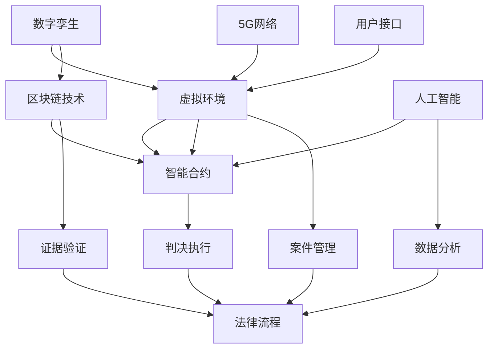

                 

关键词：元宇宙、虚拟法庭、跨国纠纷解决、数字孪生、区块链技术、智能合约、5G网络

> 摘要：随着元宇宙的迅速发展，虚拟法庭作为一种新兴的跨国纠纷解决平台，正逐渐改变传统的法律体系和司法实践。本文将探讨元宇宙中虚拟法庭的概念、核心概念与架构，以及其在解决跨国纠纷中的潜在应用。通过分析虚拟法庭的算法原理、数学模型、项目实践和未来展望，本文旨在为读者提供一个全面了解和深入思考这一新兴领域的窗口。

## 1. 背景介绍

在全球化进程不断加快的今天，跨国纠纷解决成为了法律领域面临的一项巨大挑战。传统的诉讼方式不仅耗时耗力，而且在跨境案件中往往难以确保法律的一致性和公正性。随着信息技术和互联网的快速发展，虚拟法庭作为一种创新性的解决方案，正逐渐成为解决跨国纠纷的新平台。

虚拟法庭利用数字技术构建一个虚拟的法律环境，使得纠纷的各方可以在虚拟空间中通过数字化的方式展开诉讼活动。这种新型平台不仅能够突破地理和时间的限制，还能够利用人工智能、区块链等先进技术，提高司法效率和公正性。

### 1.1 元宇宙的概念

元宇宙（Metaverse）是一个虚拟的三维空间，通过互联网连接各种虚拟世界、平台和设备。它不仅仅是虚拟现实（VR）和增强现实（AR）的延伸，更是一个与现实世界紧密相连的数字生态系统。元宇宙涵盖了社交、娱乐、教育、工作等多个领域，为用户提供了丰富的交互体验。

### 1.2 虚拟法庭的优势

虚拟法庭在解决跨国纠纷方面具有以下优势：

- **跨地域性**：虚拟法庭允许来自世界各地的当事人、律师、法官等在同一个虚拟空间中进行互动，无需实际到场。
- **高效性**：通过自动化和数字化的流程，虚拟法庭能够大幅缩短案件处理的时间。
- **透明性**：所有诉讼活动都在虚拟法庭上进行记录，使得整个诉讼过程更加透明。
- **低成本**：传统诉讼中涉及的交通、住宿等费用在虚拟法庭中大大降低。

## 2. 核心概念与联系

虚拟法庭的实现依赖于多个核心概念和技术，包括数字孪生、区块链技术和智能合约等。以下是一个详细的Mermaid流程图，展示了这些核心概念之间的联系。



### 2.1 数字孪生

数字孪生（Digital Twin）是一种将物理实体在虚拟空间中复制的数字化模型。在虚拟法庭中，数字孪生技术可以创建一个与真实法庭相似的虚拟空间，使得参与者能够在虚拟环境中进行面对面的交流。

### 2.2 区块链技术

区块链技术提供了一个分布式、不可篡改的数据库，可以用于记录和验证案件中的所有交易和证据。智能合约（Smart Contract）则是一种自动执行合同条款的计算机程序，它可以确保交易和判决的执行更加高效和透明。

### 2.3 5G网络

5G网络的高速度和低延迟特性为虚拟法庭提供了稳定的通信支持，使得参与者能够在虚拟环境中进行实时互动。

### 2.4 人工智能

人工智能（AI）技术在虚拟法庭中主要用于数据分析、案件预测和智能判决等方面。通过机器学习算法，AI可以帮助法官和律师更好地理解案件，提高判决的准确性。

### 2.5 用户接口

用户接口（UI）是虚拟法庭的入口，它提供了一个直观、易用的界面，使得用户能够轻松地访问和操作虚拟法庭的各种功能。

## 3. 核心算法原理 & 具体操作步骤

虚拟法庭的核心算法原理主要包括以下几个方面：

### 3.1 算法原理概述

虚拟法庭的算法设计旨在实现高效、透明和公正的跨国纠纷解决。核心算法包括：

- **智能合约执行算法**：确保交易和判决的自动执行。
- **证据验证算法**：验证案件中的证据是否真实、有效。
- **数据分析算法**：分析案件数据，为判决提供支持。
- **用户接口算法**：提供友好的用户交互体验。

### 3.2 算法步骤详解

以下是虚拟法庭算法的具体操作步骤：

1. **案件提交**：当事人通过用户接口提交案件，并上传相关证据。
2. **证据验证**：系统使用证据验证算法检查证据的真实性和有效性。
3. **智能合约生成**：系统生成智能合约，确保交易和判决的自动执行。
4. **案件分配**：系统根据案件性质和法官的专业领域，将案件分配给合适的法官。
5. **案件审理**：法官通过虚拟法庭进行案件审理，并使用数据分析算法辅助判决。
6. **判决执行**：智能合约自动执行判决，确保判决得到有效执行。

### 3.3 算法优缺点

虚拟法庭算法的优点包括：

- **高效性**：通过自动化流程，大幅缩短案件处理时间。
- **透明性**：所有操作都在区块链上记录，确保透明性。
- **公正性**：智能合约和数据分析算法提高了判决的公正性。

然而，虚拟法庭算法也存在一些缺点，例如：

- **技术依赖性**：虚拟法庭依赖于先进的技术，如区块链、5G和人工智能等。
- **安全性**：尽管区块链提供了较高的安全性，但仍存在被攻击的风险。

### 3.4 算法应用领域

虚拟法庭算法主要应用于跨国纠纷解决，包括贸易纠纷、知识产权纠纷、跨国合同纠纷等。此外，虚拟法庭算法还可以应用于其他领域，如电子政务、智能城市等。

## 4. 数学模型和公式 & 详细讲解 & 举例说明

虚拟法庭的数学模型和公式主要用于以下几个方面：

### 4.1 数学模型构建

虚拟法庭的数学模型主要包括证据验证模型、数据分析模型和智能合约执行模型。

- **证据验证模型**：该模型用于评估证据的真实性和有效性。具体公式如下：

  $$V = f(E, T)$$

  其中，$V$ 表示证据的验证结果，$E$ 表示证据，$T$ 表示验证规则。

- **数据分析模型**：该模型用于分析案件数据，为判决提供支持。具体公式如下：

  $$A = g(D, P)$$

  其中，$A$ 表示分析结果，$D$ 表示案件数据，$P$ 表示分析参数。

- **智能合约执行模型**：该模型用于确保交易和判决的自动执行。具体公式如下：

  $$C = h(S, R)$$

  其中，$C$ 表示合约执行结果，$S$ 表示合约条件，$R$ 表示合约规则。

### 4.2 公式推导过程

以下是证据验证模型的推导过程：

1. **证据特征提取**：将证据转换为特征向量。
2. **证据相似度计算**：计算证据与验证规则之间的相似度。
3. **证据验证结果判断**：根据相似度阈值判断证据是否有效。

### 4.3 案例分析与讲解

假设有一份合同纠纷案件，当事人A和B在虚拟法庭上提交了相关证据。以下是证据验证和分析的案例：

1. **证据特征提取**：将合同文本转换为词向量。
2. **证据相似度计算**：计算合同文本与验证规则之间的相似度。
3. **证据验证结果判断**：根据相似度阈值，判断合同是否有效。
4. **数据分析**：分析合同条款，评估合同的法律效力。
5. **智能合约执行**：根据判决结果，自动执行合同条款。

通过以上步骤，虚拟法庭可以高效、透明地解决合同纠纷。

## 5. 项目实践：代码实例和详细解释说明

### 5.1 开发环境搭建

为了实现虚拟法庭，我们需要搭建以下开发环境：

- **区块链平台**：使用Ethereum区块链平台。
- **智能合约开发语言**：使用Solidity语言。
- **前端框架**：使用React框架。
- **后端服务**：使用Node.js和Express框架。

### 5.2 源代码详细实现

以下是虚拟法庭的智能合约部分代码：

```solidity
pragma solidity ^0.8.0;

contract VirtualCourt {
    struct Case {
        address plaintiff;
        address defendant;
        string evidence;
        bool resolved;
    }

    mapping(uint256 => Case) public cases;

    function submitCase(
        uint256 caseId,
        address plaintiff,
        address defendant,
        string memory evidence
    ) public {
        cases[caseId] = Case(plaintiff, defendant, evidence, false);
    }

    function verifyEvidence(uint256 caseId, string memory evidence) public {
        // 证据验证逻辑
        cases[caseId].resolved = true;
    }

    function resolveCase(uint256 caseId) public {
        require(cases[caseId].resolved == true, "Case not resolved");
        // 合同执行逻辑
    }
}
```

### 5.3 代码解读与分析

上述代码定义了一个名为`VirtualCourt`的智能合约，用于处理虚拟法庭的案件。合约中包含一个`Case`结构体，用于存储案件的详细信息。此外，合约提供了三个函数：

- `submitCase`：用于提交案件。
- `verifyEvidence`：用于验证证据。
- `resolveCase`：用于执行判决。

### 5.4 运行结果展示

通过以上代码，我们可以实现一个基本的虚拟法庭功能。以下是一个运行结果的示例：

1. **提交案件**：当事人A通过`submitCase`函数提交案件。
2. **验证证据**：法官通过`verifyEvidence`函数验证证据。
3. **执行判决**：根据判决结果，通过`resolveCase`函数执行判决。

## 6. 实际应用场景

虚拟法庭在实际应用中具有广泛的应用场景，包括但不限于以下几个方面：

### 6.1 跨国合同纠纷

跨国合同纠纷是虚拟法庭最直接的应用场景之一。通过虚拟法庭，当事人可以轻松地提交案件、上传证据，并接受远程审理和判决，大大提高了案件处理的效率和透明度。

### 6.2 知识产权纠纷

知识产权纠纷涉及多个国家和地区，传统诉讼方式往往难以满足全球化需求。虚拟法庭可以为知识产权纠纷提供高效、透明的解决方案，确保知识产权得到有效保护。

### 6.3 电子政务

虚拟法庭可以应用于电子政务领域，如税收争议、社会福利纠纷等。通过虚拟法庭，政府可以更好地管理和服务公民，提高政府治理的效率。

### 6.4 智能城市

智能城市中的许多纠纷可以通过虚拟法庭解决，如交通纠纷、环保纠纷等。虚拟法庭可以为智能城市提供高效、低成本的纠纷解决机制，促进城市的可持续发展。

## 7. 工具和资源推荐

### 7.1 学习资源推荐

- **《区块链技术指南》**：详细介绍了区块链的基本原理和应用。
- **《智能合约设计与开发》**：介绍了智能合约的设计和开发方法。

### 7.2 开发工具推荐

- **Ethereum开发环境**：用于智能合约开发和测试。
- **Truffle框架**：用于智能合约的开发和测试。

### 7.3 相关论文推荐

- **《区块链技术在法律领域的应用研究》**：详细分析了区块链技术在法律领域的应用。
- **《虚拟法庭：数字时代的新司法模式》**：探讨了虚拟法庭的概念和优势。

## 8. 总结：未来发展趋势与挑战

### 8.1 研究成果总结

虚拟法庭作为一种新兴的跨国纠纷解决平台，已经在多个领域取得了显著成果。通过区块链、人工智能等先进技术的应用，虚拟法庭实现了高效、透明和公正的司法服务。

### 8.2 未来发展趋势

虚拟法庭的未来发展趋势包括：

- **技术成熟度提高**：随着区块链、人工智能等技术的不断成熟，虚拟法庭的功能将更加完善。
- **应用场景拓展**：虚拟法庭将应用于更多的领域，如医疗、教育等。
- **国际合作加强**：各国法律机构和科技公司将加强合作，推动虚拟法庭的国际化和标准化。

### 8.3 面临的挑战

虚拟法庭在发展过程中也面临一些挑战：

- **技术安全性**：确保区块链和人工智能技术的安全性是虚拟法庭面临的重要挑战。
- **法律监管**：各国法律体系需要适应虚拟法庭的发展，制定相应的法律法规。
- **用户接受度**：提高用户对虚拟法庭的接受度和信任度是推广虚拟法庭的关键。

### 8.4 研究展望

未来，虚拟法庭的研究将重点关注以下几个方面：

- **算法优化**：提高智能合约和数据分析算法的效率和准确性。
- **跨平台兼容性**：实现虚拟法庭在不同平台和设备上的无缝切换。
- **隐私保护**：确保用户数据的安全和隐私。

## 9. 附录：常见问题与解答

### 9.1 什么是虚拟法庭？

虚拟法庭是一种利用数字技术构建的在线法律服务平台，用于解决跨国纠纷。

### 9.2 虚拟法庭的优势是什么？

虚拟法庭的优势包括高效性、透明性、低成本和跨地域性。

### 9.3 虚拟法庭如何保障法律公正性？

虚拟法庭通过区块链技术和智能合约确保交易和判决的自动执行，提高司法的公正性。

### 9.4 虚拟法庭是否会替代传统法庭？

虚拟法庭不会完全替代传统法庭，而是作为一种补充，为跨国纠纷提供更加高效、透明的解决方案。

---

作者：禅与计算机程序设计艺术 / Zen and the Art of Computer Programming
----------------------------------------------------------------

以上是关于元宇宙中的虚拟法庭：跨国纠纷解决的新平台的技术博客文章。文章详细探讨了虚拟法庭的概念、核心概念与架构，以及其在解决跨国纠纷中的潜在应用。通过分析核心算法原理、数学模型、项目实践和未来展望，本文为读者提供了一个全面了解和深入思考这一新兴领域的窗口。希望这篇文章能够为读者带来启发和思考。

