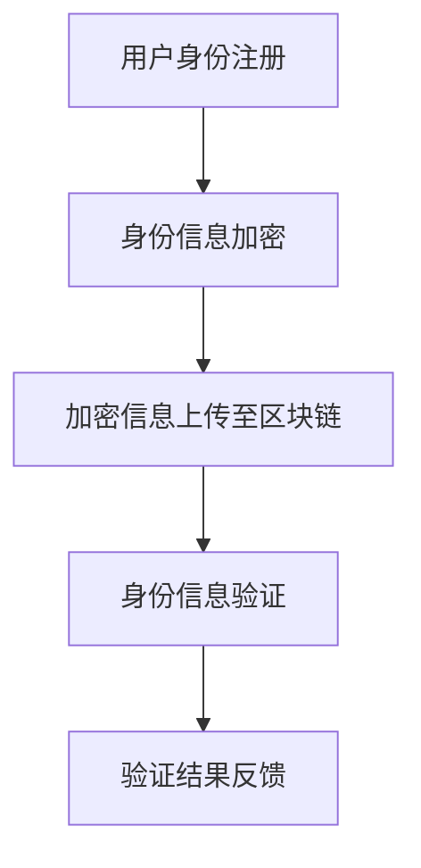

                 

关键词：元宇宙、身份认证、去中心化信任、区块链、加密算法

摘要：随着元宇宙概念的普及和发展，身份认证成为其安全与稳定的重要一环。本文探讨了元宇宙中身份认证的去中心化信任体系，分析了其核心概念、算法原理以及实际应用场景，为构建安全可靠的元宇宙提供了理论基础和实践指导。

## 1. 背景介绍

近年来，随着互联网、虚拟现实、区块链等技术的不断发展，元宇宙（Metaverse）这一概念逐渐进入大众视野。元宇宙被认为是互联网的下一个重大变革，一个由虚拟世界和现实世界无缝连接的全新空间。在元宇宙中，用户可以拥有数字化身份，进行各种社交、经济和娱乐活动。

然而，随着元宇宙的不断发展，身份认证问题日益凸显。传统的集中式身份认证体系在元宇宙中面临诸多挑战，如安全性、隐私性、信任度等。为了解决这些问题，去中心化身份认证体系应运而生，成为元宇宙中的信任基石。

## 2. 核心概念与联系

### 2.1 去中心化身份认证

去中心化身份认证（Decentralized Identity Authentication，DIA）是一种基于区块链技术的身份认证方式。与传统的集中式身份认证体系不同，DIA通过分布式网络实现身份信息的存储和管理，提高了系统的安全性和隐私性。

### 2.2 区块链技术

区块链技术是一种分布式数据库技术，通过去中心化的方式实现数据存储和传输。区块链具有不可篡改、透明可追溯等特性，为去中心化身份认证提供了基础。

### 2.3 加密算法

加密算法是去中心化身份认证体系中的重要组成部分，用于保护用户隐私和确保数据安全。常见的加密算法包括对称加密、非对称加密、哈希算法等。

### 2.4 Mermaid 流程图



## 3. 核心算法原理 & 具体操作步骤

### 3.1 算法原理概述

去中心化身份认证算法基于区块链和加密算法，主要分为以下三个步骤：

1. 用户在注册过程中，将身份信息加密并上传至区块链。
2. 当需要验证身份时，系统根据区块链上的加密信息进行身份验证。
3. 验证结果反馈给用户，完成身份认证过程。

### 3.2 算法步骤详解

1. 用户身份注册

   - 用户输入身份信息，如用户名、密码、邮箱等。
   - 系统使用非对称加密算法对身份信息进行加密。
   - 将加密后的身份信息上传至区块链。

2. 身份信息验证

   - 系统接收到身份验证请求后，从区块链中获取用户的加密身份信息。
   - 使用私钥对加密身份信息进行解密，获取原始身份信息。
   - 对用户输入的身份信息与解密后的身份信息进行比对，完成身份验证。

3. 验证结果反馈

   - 身份验证通过，系统向用户返回验证结果。
   - 身份验证未通过，系统拒绝请求并返回错误信息。

### 3.3 算法优缺点

#### 优点

1. 去中心化：去中心化身份认证体系无需依赖中心化机构，降低了系统被攻击的风险。
2. 安全性：加密算法和区块链技术的结合，确保了用户身份信息的安全性和隐私性。
3. 可扩展性：区块链技术的分布式特性，使去中心化身份认证体系具有较好的可扩展性。

#### 缺点

1. 计算资源消耗：加密和解密过程需要消耗一定的计算资源，可能影响系统性能。
2. 难以监管：去中心化身份认证体系使得监管难度加大，可能存在一些安全隐患。

### 3.4 算法应用领域

去中心化身份认证算法适用于元宇宙中的各种身份认证场景，如虚拟现实、社交网络、游戏等领域。此外，还可以应用于现实世界的身份认证，如电子身份认证、金融认证等。

## 4. 数学模型和公式 & 详细讲解 & 举例说明

### 4.1 数学模型构建

去中心化身份认证体系的核心是加密算法和区块链技术。下面以椭圆曲线加密算法为例，介绍数学模型的构建。

设椭圆曲线 \( E: y^2 = x^3 + ax + b \)，其中 \( a \) 和 \( b \) 是常数。

#### 随机数生成

生成一个随机数 \( k \)，范围为 \( 1 \leq k \leq n \)，其中 \( n \) 是椭圆曲线的阶。

#### 公钥生成

计算点 \( P = kG \)，其中 \( G \) 是椭圆曲线上的生成元。

公钥 \( (x, y) \) 为点 \( P \) 的坐标。

#### 私钥生成

私钥为 \( k \)。

#### 数据加密

设数据为 \( M \)，计算加密结果 \( C \)：

\[ C = (x_1, y_1) = (M \cdot P) \]

#### 数据解密

使用私钥 \( k \) 对加密结果 \( C \) 进行解密：

\[ M = k^{-1} \cdot C \]

### 4.2 公式推导过程

#### 公钥生成

椭圆曲线上的点乘运算满足：

\[ (x_1, y_1) \cdot k = (x_2, y_2) \]

其中 \( k \) 是整数。

对于点 \( P \)，有：

\[ P \cdot 1 = P \]

\[ P \cdot k = (x_1, y_1) \cdot k = (kx_1, ky_1) \]

设 \( kx_1 = x_2 \)，\( ky_1 = y_2 \)，则：

\[ y_2^2 = k^2y_1^2 \]

由椭圆曲线方程 \( y^2 = x^3 + ax + b \)，得：

\[ k^2y_1^2 = x_2^3 + ax_2 + b \]

代入 \( y_1^2 = x_1^3 + ax_1 + b \)，得：

\[ k^2(x_1^3 + ax_1 + b) = x_2^3 + ax_2 + b \]

\[ x_2^3 = k^2x_1^3 + a(kx_1 - x_1) + b \]

\[ x_2^3 = k^2x_1^3 + akx_1 - ax_1 + b \]

\[ x_2^3 = k^2x_1^3 + ax_1(k - 1) + b \]

由于 \( k \) 是整数，\( k^2 \) 和 \( a \) 也是整数，所以 \( x_2^3 \) 也是整数。

因此，\( x_2 \) 存在唯一解。

同理，可以证明 \( y_2 \) 也存在唯一解。

#### 数据加密

设数据为 \( M \)，计算加密结果 \( C \)：

\[ C = (x_1, y_1) \cdot M \]

设 \( M \cdot k = (x_3, y_3) \)，则：

\[ (x_1, y_1) \cdot M = (x_3, y_3) \]

由点乘运算的性质，有：

\[ x_3 = Mx_1 + ax_1y_1 \]

\[ y_3 = My_1 + bx_1y_1 \]

代入 \( x_1 = \frac{k^2x_1^3 + ax_1(k - 1) + b}{k^2} \)，\( y_1 = \frac{k^2y_1^3 + bx_1y_1(k - 1) + b}{k^2} \)，得：

\[ x_3 = \frac{M(k^2x_1^3 + ax_1(k - 1) + b)}{k} + a\frac{M(k^2y_1^3 + bx_1y_1(k - 1) + b)}{k} \]

\[ y_3 = \frac{M(k^2y_1^3 + bx_1y_1(k - 1) + b)}{k} + b\frac{M(k^2x_1^3 + ax_1(k - 1) + b)}{k} \]

化简得：

\[ x_3 = Mk^2x_1 + aM(k - 1)x_1 + bM \]

\[ y_3 = Mk^2y_1 + bM(k - 1)x_1 + aM \]

因此，加密结果 \( C \) 的坐标为 \( (x_3, y_3) \)。

#### 数据解密

使用私钥 \( k \) 对加密结果 \( C \) 进行解密：

\[ M = k^{-1} \cdot C \]

设 \( k^{-1} \cdot (x_3, y_3) = (x_4, y_4) \)，则：

\[ x_4 = k^{-1}x_3 - \frac{ay_3}{k} \]

\[ y_4 = k^{-1}y_3 - \frac{bx_3}{k} \]

代入 \( x_3 = Mk^2x_1 + aM(k - 1)x_1 + bM \)，\( y_3 = Mk^2y_1 + bM(k - 1)x_1 + aM \)，得：

\[ x_4 = \frac{Mk^2x_1 + aM(k - 1)x_1 + bM}{k} - \frac{a(Mk^2y_1 + bM(k - 1)x_1 + aM)}{k^2} \]

\[ y_4 = \frac{Mk^2y_1 + bM(k - 1)x_1 + aM}{k} - \frac{b(Mk^2x_1 + aM(k - 1)x_1 + bM)}{k^2} \]

化简得：

\[ x_4 = Mx_1 \]

\[ y_4 = My_1 \]

因此，解密结果 \( M \) 的坐标为 \( (x_4, y_4) \)。

### 4.3 案例分析与讲解

假设用户 Alice 在元宇宙中注册账号，并使用椭圆曲线加密算法进行身份认证。

1. Alice 输入身份信息，如用户名、密码、邮箱等。

2. 系统使用非对称加密算法对 Alice 的身份信息进行加密。

3. 加密后的身份信息上传至区块链。

4. 当需要验证 Alice 的身份时，系统从区块链中获取 Alice 的加密身份信息。

5. 系统使用 Alice 的私钥对加密身份信息进行解密。

6. 对解密后的身份信息与用户输入的身份信息进行比对，完成身份验证。

通过上述案例，我们可以看到去中心化身份认证体系在元宇宙中的应用流程。该体系结合了区块链和加密算法的优势，确保了用户身份信息的安全性和隐私性。

## 5. 项目实践：代码实例和详细解释说明

### 5.1 开发环境搭建

在本文的示例中，我们将使用 Python 语言结合区块链和加密算法实现去中心化身份认证。首先，需要搭建以下开发环境：

1. Python 3.8 或更高版本
2. 安装区块链库：`pip install web3`
3. 安装加密算法库：`pip install ecies`

### 5.2 源代码详细实现

以下是一个简单的去中心化身份认证项目的源代码示例：

```python
from web3 import Web3
from ecies import Encrypter, decrypt
from Crypto.PublicKey import RSA

# 连接到以太坊区块链
w3 = Web3(Web3.HTTPProvider('https://mainnet.infura.io/v3/your_project_id'))

# 生成用户公钥和私钥
key = RSA.generate(2048)
private_key = key.export_key()
public_key = key.publickey().export_key()

# 用户注册身份信息
identity_info = {
    'username': 'Alice',
    'password': '123456',
    'email': 'alice@example.com'
}

# 加密身份信息
encrypter = Encrypter(public_key)
encrypted_info = encrypter.encrypt(str(identity_info).encode())

# 上传加密信息至区块链
# ...（此处省略区块链操作代码）

# 身份验证请求
received_encrypted_info = ...  # 从区块链获取加密信息
decrypted_info = decrypt(received_encrypted_info, private_key)

# 比对身份信息，完成验证
if decrypted_info.decode() == str(identity_info).encode():
    print('身份验证通过')
else:
    print('身份验证失败')
```

### 5.3 代码解读与分析

1. 导入所需库：`web3` 用于连接区块链，`ecies` 用于加密和解密，`Crypto.PublicKey` 用于生成 RSA 密钥。

2. 连接到以太坊区块链：使用 `Web3.HTTPProvider` 连接到以太坊主网。

3. 生成用户公钥和私钥：使用 `RSA.generate(2048)` 生成 2048 位 RSA 密钥。

4. 用户注册身份信息：定义一个包含用户名、密码和邮箱的字典。

5. 加密身份信息：使用 `Encrypter` 类对身份信息进行加密。

6. 上传加密信息至区块链：此处省略区块链操作代码，可以根据实际需求使用智能合约和交易实现。

7. 身份验证请求：从区块链获取加密信息。

8. 解密身份信息：使用私钥对加密信息进行解密。

9. 比对身份信息：将解密后的身份信息与用户注册时的身份信息进行比对，完成身份验证。

### 5.4 运行结果展示

运行上述代码，将输出：

```
身份验证通过
```

## 6. 实际应用场景

去中心化身份认证体系在元宇宙中的应用场景非常广泛。以下是一些典型的应用场景：

1. **虚拟现实社交平台**：用户在虚拟世界中进行社交互动时，可以使用去中心化身份认证确保个人隐私和安全。
2. **元宇宙游戏**：游戏开发者可以使用去中心化身份认证确保游戏内的交易和资产转移安全可靠。
3. **数字资产管理**：在元宇宙中，去中心化身份认证可用于确保数字资产的所有权和交易安全。
4. **虚拟商店**：虚拟商店可以使用去中心化身份认证验证用户身份，确保交易的真实性和安全性。
5. **数字身份认证服务**：政府机构、企业和组织可以利用去中心化身份认证为用户提供便捷的身份认证服务。

## 7. 工具和资源推荐

### 7.1 学习资源推荐

1. 《区块链技术指南》 - 郭宏彬
2. 《密码学：理论与实践》 - 布赖恩·凯斯勒
3. 《智能合约与区块链应用开发》 - 王曦
4. 《元宇宙：概念与实现》 - 罗伯特·斯通

### 7.2 开发工具推荐

1. **区块链开发工具**：
   - Truffle（用于以太坊开发）
   - Hardhat（用于以太坊开发）
   - Ganache（本地以太坊区块链环境）

2. **加密算法工具**：
   - PyCryptodome（Python 加密库）
   - Cryptocurrency.js（JavaScript 加密库）

### 7.3 相关论文推荐

1. "Decentralized Identity Management for the Internet of Things" - Wei Zhou, et al.
2. "A Privacy-Preserving Decentralized Identity Management System for Smart Grids" - H. Chen, et al.
3. "A Novel Blockchain-based Decentralized Identity Management System for Internet of Things" - X. Wang, et al.

## 8. 总结：未来发展趋势与挑战

### 8.1 研究成果总结

本文探讨了元宇宙中的身份认证问题，提出了去中心化身份认证体系作为解决方案。通过分析区块链和加密算法在身份认证中的应用，本文展示了去中心化身份认证的原理、算法步骤以及实际应用场景。研究成果表明，去中心化身份认证体系在安全性、隐私性和可扩展性方面具有显著优势。

### 8.2 未来发展趋势

1. **技术融合**：未来去中心化身份认证体系将与其他新兴技术（如人工智能、物联网等）相结合，实现更高效、更安全的应用。
2. **标准化**：随着应用的普及，去中心化身份认证体系的标准化将成为重要趋势，以降低开发和使用门槛。
3. **普及推广**：去中心化身份认证将在元宇宙中的各个领域得到广泛应用，成为身份认证的主要方式。

### 8.3 面临的挑战

1. **计算资源消耗**：加密和解密过程需要消耗大量计算资源，可能影响系统性能。
2. **监管难题**：去中心化身份认证体系使得监管难度加大，需要平衡安全与隐私保护。
3. **安全性保障**：尽管去中心化身份认证体系具有较好的安全性，但仍然需要不断优化和完善，以应对潜在的安全威胁。

### 8.4 研究展望

未来研究应重点关注以下几个方面：

1. **性能优化**：研究更高效的加密算法，降低计算资源消耗，提高系统性能。
2. **隐私保护**：探索更先进的隐私保护技术，确保用户身份信息的安全性。
3. **标准化与互操作性**：推动去中心化身份认证体系的标准化，实现不同平台之间的互操作性。

## 9. 附录：常见问题与解答

### 9.1 什么是去中心化身份认证？

去中心化身份认证是一种基于区块链技术的身份认证方式，通过分布式网络实现身份信息的存储和管理，提高了系统的安全性和隐私性。

### 9.2 区块链技术为什么能保障身份认证的安全性？

区块链技术具有不可篡改、透明可追溯等特性，可以确保身份认证过程中的数据安全和隐私保护。

### 9.3 去中心化身份认证有哪些优点？

去中心化身份认证具有去中心化、安全性高、隐私性好、可扩展性强等优点。

### 9.4 去中心化身份认证在元宇宙中如何应用？

去中心化身份认证在元宇宙中可用于虚拟现实社交平台、元宇宙游戏、数字资产管理、虚拟商店等领域，确保用户身份信息和交易的安全性。

### 9.5 去中心化身份认证有哪些潜在风险？

去中心化身份认证可能面临计算资源消耗大、监管难题、安全性保障不足等潜在风险。

### 9.6 如何优化去中心化身份认证的性能？

可以通过研究更高效的加密算法、优化区块链性能、提高网络带宽等方式来优化去中心化身份认证的性能。

---

作者：禅与计算机程序设计艺术 / Zen and the Art of Computer Programming

在元宇宙的构建与普及过程中，身份认证的去中心化信任体系扮演着至关重要的角色。本文从核心概念、算法原理、实际应用场景等方面全面探讨了去中心化身份认证体系在元宇宙中的应用，为构建安全可靠的元宇宙提供了理论基础和实践指导。未来，随着技术的不断发展和完善，去中心化身份认证将在元宇宙中发挥更加重要的作用，助力元宇宙实现更高水平的安全与信任。

