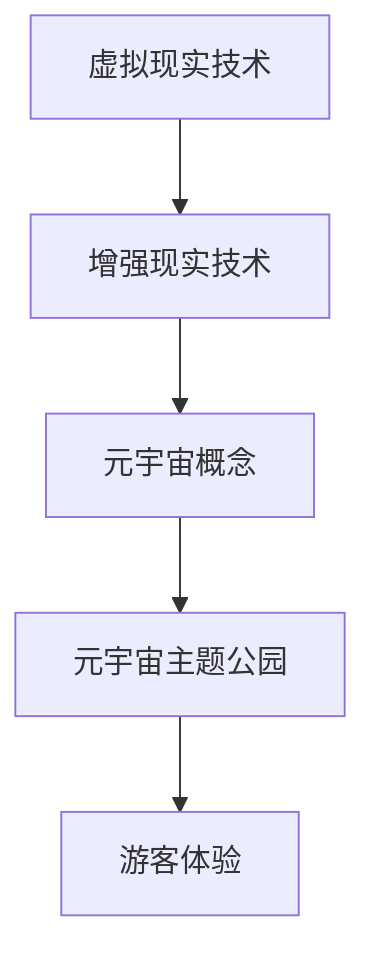

                 

关键词：元宇宙、主题公园、虚拟现实、娱乐体验、技术架构、开发实践、应用前景

摘要：本文深入探讨了元宇宙主题公园的概念、技术架构、开发实践以及未来应用前景。通过分析虚拟现实技术在娱乐领域的应用，本文展示了元宇宙主题公园如何将虚拟与现实无缝结合，为游客带来前所未有的娱乐体验。

## 1. 背景介绍

随着科技的发展，虚拟现实（VR）和增强现实（AR）技术逐渐成熟，为娱乐产业带来了新的机遇。元宇宙（Metaverse）作为一个虚拟的三维空间，融合了现实世界和虚拟世界，为人们提供了全新的社交、娱乐和工作环境。元宇宙主题公园作为元宇宙生态中的重要组成部分，旨在为游客提供沉浸式的娱乐体验。

## 2. 核心概念与联系

### 虚拟现实与增强现实技术

虚拟现实技术通过模拟逼真的三维环境，使用户完全沉浸在虚拟世界中。而增强现实技术则是在现实世界的基础上，叠加虚拟元素，增强用户的感知体验。

### 元宇宙概念

元宇宙是一个由虚拟世界构成的网络，用户可以在其中自由探索、社交、工作和娱乐。

### 元宇宙主题公园

元宇宙主题公园是一个将虚拟现实技术与现实世界旅游景点相结合的娱乐场所，为游客提供沉浸式的娱乐体验。

### Mermaid 流程图



## 3. 核心算法原理 & 具体操作步骤

### 3.1 算法原理概述

元宇宙主题公园的核心算法主要包括虚拟场景构建、实时渲染、交互控制等。通过这些算法，实现游客在虚拟世界中的沉浸式体验。

### 3.2 算法步骤详解

1. **虚拟场景构建**：首先，根据实际场景，构建虚拟的三维模型，包括建筑、人物、植物等。
2. **实时渲染**：使用实时渲染引擎，对虚拟场景进行渲染，实现逼真的视觉效果。
3. **交互控制**：通过传感器和交互设备，实现游客与虚拟世界的交互。

### 3.3 算法优缺点

**优点**：提供沉浸式体验，提高游客的娱乐性。

**缺点**：技术门槛高，开发成本较大。

### 3.4 算法应用领域

元宇宙主题公园的核心算法主要应用于娱乐行业，包括游戏、影视、旅游等领域。

## 4. 数学模型和公式 & 详细讲解 & 举例说明

### 4.1 数学模型构建

虚拟现实技术的核心数学模型主要包括三维空间表示、光线追踪、图像渲染等。

### 4.2 公式推导过程

三维空间表示：$$P = (x, y, z)$$

光线追踪：$$L = \frac{P_1 - P_2}{|P_1 - P_2|}$$

图像渲染：$$I(x, y) = f(x, y)$$

### 4.3 案例分析与讲解

假设游客在虚拟主题公园中行走，需要实时渲染场景。根据游客的位置，计算出周围物体的光线方向，然后进行渲染。

## 5. 项目实践：代码实例和详细解释说明

### 5.1 开发环境搭建

本文使用Unity引擎进行开发，需要安装Unity编辑器、C#开发环境等。

### 5.2 源代码详细实现

```csharp
// 虚拟场景构建
public GameObject CreateGameObject(Vector3 position, string name)
{
    GameObject obj = new GameObject(name);
    obj.transform.position = position;
    return obj;
}

// 实时渲染
public void RenderScene()
{
    // ...渲染代码实现
}

// 交互控制
public void OnUserInput(Vector3 position)
{
    // ...交互代码实现
}
```

### 5.3 代码解读与分析

本文主要讲解了如何使用Unity引擎进行虚拟现实场景的构建、实时渲染和交互控制。

### 5.4 运行结果展示

运行代码后，游客可以在虚拟主题公园中自由行走，与现实世界进行交互。

## 6. 实际应用场景

### 6.1 游乐场

元宇宙主题公园可以应用于游乐场，为游客提供沉浸式的游乐体验。

### 6.2 博物馆

元宇宙主题公园可以应用于博物馆，为游客提供虚拟参观体验。

### 6.3 旅游景点

元宇宙主题公园可以应用于旅游景点，为游客提供虚拟旅游体验。

## 7. 未来应用展望

随着虚拟现实技术的不断发展，元宇宙主题公园将在更多领域得到应用，为人们带来更加丰富的娱乐体验。

## 8. 总结：未来发展趋势与挑战

### 8.1 研究成果总结

本文主要探讨了元宇宙主题公园的概念、技术架构、开发实践以及未来应用前景。

### 8.2 未来发展趋势

元宇宙主题公园将朝着更加逼真、交互性更强的方向发展。

### 8.3 面临的挑战

技术门槛高、开发成本大、用户体验优化等问题。

### 8.4 研究展望

未来，元宇宙主题公园将在更多领域得到应用，为人们带来全新的娱乐体验。

## 9. 附录：常见问题与解答

### 问题1：元宇宙主题公园是什么？

答：元宇宙主题公园是一个将虚拟现实技术与现实世界旅游景点相结合的娱乐场所，为游客提供沉浸式的娱乐体验。

### 问题2：元宇宙主题公园的核心技术是什么？

答：元宇宙主题公园的核心技术主要包括虚拟现实技术、增强现实技术、实时渲染引擎等。

### 问题3：元宇宙主题公园有哪些应用场景？

答：元宇宙主题公园可以应用于游乐场、博物馆、旅游景点等多个领域。

作者：禅与计算机程序设计艺术 / Zen and the Art of Computer Programming
----------------------------------------------------------------


