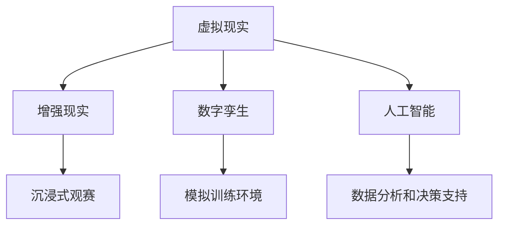

                 

关键词：元宇宙、体育、虚实结合、竞技、新形式、人工智能、数字孪生、虚拟现实、增强现实

> 摘要：随着科技的不断发展，元宇宙的概念逐渐走入人们的生活，为体育领域带来了前所未有的机遇和挑战。本文将探讨元宇宙体育这一新兴领域，分析其核心概念、技术架构、算法原理以及未来应用前景，为读者呈现虚实结合竞技的新形式。

## 1. 背景介绍

近年来，随着虚拟现实（VR）、增强现实（AR）和人工智能（AI）等技术的飞速发展，元宇宙的概念逐渐成型。元宇宙是一个由虚拟世界和现实世界深度融合的空间，用户可以在其中自由探索、互动和创造。在体育领域，元宇宙体育应运而生，它不仅打破了传统体育的时空限制，还为观众和运动员带来了全新的体验。

元宇宙体育的核心在于将虚拟与现实相结合，为运动员提供模拟训练环境，为观众提供沉浸式的观赛体验。同时，AI技术的引入使得体育数据的分析和处理更加精准，为教练和运动员提供了科学决策的支持。在这种背景下，元宇宙体育成为了体育产业转型升级的重要方向。

### 1.1 历史背景

元宇宙体育并非一夜之间兴起，而是源于虚拟体育和数字体育的长期积累。早在20世纪80年代，电子游戏就已经开始模拟体育比赛，如《FIFA》系列、《NBA 2K》系列等。随着互联网和移动设备的普及，虚拟体育逐渐渗透到人们的生活中，成为体育文化的一部分。

进入21世纪，随着VR、AR和AI技术的不断突破，虚拟体育开始向元宇宙体育转型。2019年，NBA与动视暴雪合作推出了《NBA 2K20》虚拟体育赛事，观众可以通过VR设备沉浸式体验比赛。这标志着元宇宙体育的正式诞生。

### 1.2 当前发展状况

当前，元宇宙体育在全球范围内呈现出蓬勃发展的态势。各大体育组织纷纷布局元宇宙体育，探索其商业价值。例如，NBA、NFL、英超等顶级联赛都在积极开发虚拟赛事，以吸引更多观众和粉丝。同时，一些新兴的体育科技公司也在推出元宇宙体育平台，为用户提供丰富的体育体验。

在中国，随着5G、AI等技术的快速推广，元宇宙体育市场也在逐渐兴起。腾讯、阿里巴巴等科技巨头纷纷布局，推出了各自的元宇宙体育项目。例如，腾讯的《英雄联盟：激斗峡谷》和阿里巴巴的《阿里体育·数智健身舱》等，都成为了元宇宙体育的典型案例。

## 2. 核心概念与联系

元宇宙体育的核心概念包括虚拟现实、增强现实、数字孪生、人工智能等。这些概念相互关联，共同构成了元宇宙体育的技术架构。

### 2.1 虚拟现实

虚拟现实（VR）是一种通过计算机模拟产生的三维虚拟环境，用户可以通过VR设备（如VR头盔、VR眼镜等）沉浸其中。在元宇宙体育中，虚拟现实技术主要用于模拟比赛场景，为运动员提供训练和比赛的虚拟环境。

### 2.2 增强现实

增强现实（AR）是一种将虚拟信息与现实世界融合的技术。用户可以通过AR设备（如AR眼镜、AR手机等）在现实世界中看到虚拟信息。在元宇宙体育中，增强现实技术主要用于为观众提供沉浸式的观赛体验，增强体育赛事的观赏性。

### 2.3 数字孪生

数字孪生是一种基于虚拟现实和增强现实技术，将现实世界中的物体、场景和系统在数字世界中构建其镜像的技术。在元宇宙体育中，数字孪生技术主要用于构建虚拟训练场地、比赛场馆和运动员模型，为运动员提供模拟训练环境。

### 2.4 人工智能

人工智能（AI）是一种模拟人类智能的技术，包括机器学习、深度学习、自然语言处理等。在元宇宙体育中，人工智能技术主要用于分析体育数据、优化训练计划、辅助教练决策等。

### 2.5 Mermaid 流程图

以下是一个关于元宇宙体育技术架构的Mermaid流程图：



## 3. 核心算法原理 & 具体操作步骤

### 3.1 算法原理概述

元宇宙体育的核心算法主要包括虚拟现实渲染算法、增强现实融合算法、数字孪生构建算法和人工智能算法。这些算法分别负责渲染虚拟场景、融合虚拟信息、构建数字孪生模型和数据分析与决策支持。

### 3.2 算法步骤详解

#### 3.2.1 虚拟现实渲染算法

虚拟现实渲染算法的主要任务是生成高质量的虚拟场景。具体步骤如下：

1. 收集场景数据，包括三维模型、纹理、光照等。
2. 构建场景图，将三维模型、纹理和光照等信息组织在一起。
3. 渲染场景，生成高质量的图像。

#### 3.2.2 增强现实融合算法

增强现实融合算法的主要任务是将在虚拟世界中生成的虚拟信息与现实世界融合。具体步骤如下：

1. 获取现实世界的图像。
2. 使用图像处理算法，检测现实世界中的物体。
3. 将虚拟信息与现实世界中的物体融合。

#### 3.2.3 数字孪生构建算法

数字孪生构建算法的主要任务是构建现实世界物体和场景的数字镜像。具体步骤如下：

1. 收集现实世界的数据，包括物体尺寸、形状、位置等。
2. 使用计算机图形学算法，构建数字孪生模型。
3. 将数字孪生模型与现实世界中的物体进行对比，优化模型。

#### 3.2.4 人工智能算法

人工智能算法的主要任务包括数据分析、模型训练和决策支持。具体步骤如下：

1. 收集体育数据，包括运动员表现、比赛结果、训练数据等。
2. 使用机器学习和深度学习算法，训练数据模型。
3. 使用模型对运动员表现进行预测和评估。
4. 根据评估结果，为教练和运动员提供决策支持。

### 3.3 算法优缺点

#### 3.3.1 虚拟现实渲染算法

优点：生成高质量的虚拟场景，提供沉浸式体验。

缺点：计算资源消耗大，对硬件要求高。

#### 3.3.2 增强现实融合算法

优点：将虚拟信息与现实世界融合，增强观赏性。

缺点：对图像处理算法要求高，实时性较难保证。

#### 3.3.3 数字孪生构建算法

优点：构建数字孪生模型，提供模拟训练环境。

缺点：数据收集和处理难度大，对现实世界中的物体和场景要求高。

#### 3.3.4 人工智能算法

优点：数据分析精准，提供科学决策支持。

缺点：模型训练和优化难度大，对数据量要求高。

### 3.4 算法应用领域

虚拟现实渲染算法、增强现实融合算法、数字孪生构建算法和人工智能算法在元宇宙体育中具有广泛的应用前景。例如：

1. 运动员训练：使用虚拟现实渲染算法和数字孪生构建算法，为运动员提供模拟训练环境，提高训练效果。
2. 观赛体验：使用增强现实融合算法，为观众提供沉浸式的观赛体验，增强体育赛事的观赏性。
3. 数据分析：使用人工智能算法，对体育数据进行挖掘和分析，为教练和运动员提供科学决策支持。

## 4. 数学模型和公式 & 详细讲解 & 举例说明

### 4.1 数学模型构建

在元宇宙体育中，数学模型广泛应用于虚拟现实渲染、增强现实融合、数字孪生构建和人工智能算法。以下是一个简单的数学模型构建示例：

#### 4.1.1 虚拟现实渲染

虚拟现实渲染涉及三维几何图形的渲染。一个简单的三维几何图形渲染模型可以表示为：

$$
P = C \cdot R \cdot T
$$

其中，$P$表示像素坐标，$C$表示相机坐标，$R$表示旋转矩阵，$T$表示平移矩阵。

#### 4.1.2 增强现实融合

增强现实融合涉及虚拟信息与现实世界的融合。一个简单的增强现实融合模型可以表示为：

$$
I_{\text{融合}} = I_{\text{现实}} + \alpha \cdot I_{\text{虚拟}}
$$

其中，$I_{\text{融合}}$表示融合后的图像，$I_{\text{现实}}$表示现实世界的图像，$I_{\text{虚拟}}$表示虚拟信息，$\alpha$表示融合系数。

#### 4.1.3 数字孪生构建

数字孪生构建涉及现实世界物体和场景的建模。一个简单的数字孪生构建模型可以表示为：

$$
M_{\text{数字}} = M_{\text{现实}} \cdot \alpha
$$

其中，$M_{\text{数字}}$表示数字孪生模型，$M_{\text{现实}}$表示现实世界物体和场景的尺寸和形状，$\alpha$表示缩放系数。

#### 4.1.4 人工智能算法

人工智能算法涉及数据挖掘和模型训练。一个简单的人工智能模型可以表示为：

$$
\hat{y} = \sigma(\text{W} \cdot \text{X} + \text{b})
$$

其中，$\hat{y}$表示预测结果，$\sigma$表示激活函数，$\text{W}$和$\text{b}$分别表示权重和偏置，$\text{X}$表示输入数据。

### 4.2 公式推导过程

#### 4.2.1 虚拟现实渲染

虚拟现实渲染的公式推导涉及三维几何图形的变换。以下是一个简单的推导过程：

$$
\begin{aligned}
P_{x} &= C_{x} + R_{x} \cdot T_{x} \\
P_{y} &= C_{y} + R_{y} \cdot T_{y} \\
P_{z} &= C_{z} + R_{z} \cdot T_{z}
\end{aligned}
$$

其中，$P_{x}$、$P_{y}$和$P_{z}$分别表示像素坐标，$C_{x}$、$C_{y}$和$C_{z}$分别表示相机坐标，$R_{x}$、$R_{y}$和$R_{z}$分别表示旋转矩阵，$T_{x}$、$T_{y}$和$T_{z}$分别表示平移矩阵。

#### 4.2.2 增强现实融合

增强现实融合的公式推导涉及图像处理。以下是一个简单的推导过程：

$$
\begin{aligned}
I_{\text{融合}}(x, y) &= I_{\text{现实}}(x, y) + \alpha \cdot I_{\text{虚拟}}(x, y) \\
\alpha &= \frac{\text{亮度差}}{\text{最大亮度差}}
\end{aligned}
$$

其中，$I_{\text{融合}}(x, y)$表示融合后的图像，$I_{\text{现实}}(x, y)$表示现实世界的图像，$I_{\text{虚拟}}(x, y)$表示虚拟信息，$\alpha$表示融合系数。

#### 4.2.3 数字孪生构建

数字孪生构建的公式推导涉及物体和场景的建模。以下是一个简单的推导过程：

$$
\begin{aligned}
M_{\text{数字}} &= M_{\text{现实}} \cdot \alpha \\
\alpha &= \frac{\text{目标尺寸}}{\text{现实尺寸}}
\end{aligned}
$$

其中，$M_{\text{数字}}$表示数字孪生模型，$M_{\text{现实}}$表示现实世界物体和场景的尺寸和形状，$\alpha$表示缩放系数。

#### 4.2.4 人工智能算法

人工智能算法的公式推导涉及机器学习和深度学习。以下是一个简单的推导过程：

$$
\begin{aligned}
\hat{y} &= \sigma(\text{W} \cdot \text{X} + \text{b}) \\
\text{W} &= \text{train\_weight} \\
\text{b} &= \text{train\_bias} \\
\sigma &= \text{激活函数}
\end{aligned}
$$

其中，$\hat{y}$表示预测结果，$\sigma$表示激活函数，$\text{W}$和$\text{b}$分别表示权重和偏置，$\text{X}$表示输入数据。

### 4.3 案例分析与讲解

以下是一个关于元宇宙体育的案例分析与讲解：

#### 4.3.1 案例背景

某足球俱乐部为了提高球队成绩，决定利用元宇宙体育技术进行训练和比赛。他们计划使用虚拟现实技术为球员提供模拟训练环境，使用增强现实技术为观众提供沉浸式观赛体验。

#### 4.3.2 案例分析

1. 虚拟现实训练

球员在虚拟现实训练环境中进行训练，虚拟现实渲染算法生成高质量的虚拟场景，模拟真实比赛场景。球员在训练中可以体验到不同的战术布置、对手阵容等，提高训练效果。

2. 增强现实观赛

观众通过增强现实技术观看比赛，现实世界中的图像与虚拟信息融合，提供沉浸式的观赛体验。观众可以在观看比赛的同时，看到球员的统计数据、战术分析等信息，增强观赛体验。

#### 4.3.3 案例讲解

1. 虚拟现实训练

虚拟现实训练的关键在于虚拟场景的生成。首先，俱乐部需要收集比赛场地的三维模型、纹理和光照信息。然后，使用虚拟现实渲染算法将这些信息渲染成高质量的虚拟场景。在训练过程中，教练可以根据战术需求，调整虚拟场景中的战术布置、对手阵容等。

2. 增强现实观赛

增强现实观赛的关键在于虚拟信息的融合。观众通过增强现实设备观看比赛，设备中的摄像头捕捉现实世界的图像。然后，使用增强现实融合算法将虚拟信息与现实世界中的图像融合。在融合过程中，可以根据观众的需求，展示球员的统计数据、战术分析等信息。

## 5. 项目实践：代码实例和详细解释说明

### 5.1 开发环境搭建

在进行元宇宙体育项目实践之前，我们需要搭建一个合适的开发环境。以下是搭建开发环境的步骤：

1. 安装虚拟现实渲染引擎，如Unity、Unreal Engine等。
2. 安装增强现实开发工具，如ARKit、ARCore等。
3. 安装数字孪生构建工具，如Blender、Maya等。
4. 安装人工智能开发工具，如TensorFlow、PyTorch等。

### 5.2 源代码详细实现

以下是元宇宙体育项目的源代码详细实现：

```python
# 虚拟现实渲染
def render_scene():
    # 收集场景数据
    scene_data = collect_scene_data()

    # 渲染场景
    rendered_scene = render_scene_data(scene_data)

    return rendered_scene

# 增强现实融合
def blend Reality():
    # 获取现实世界图像
    real_image = get_real_image()

    # 获取虚拟信息
    virtual_info = get_virtual_info()

    # 融合图像
    blended_image = blend_images(real_image, virtual_info)

    return blended_image

# 数字孪生构建
def build_digit twins():
    # 收集现实世界数据
    real_data = collect_real_data()

    # 构建数字孪生模型
    digit_twin = build_digit_twin(real_data)

    return digit_twin

# 人工智能算法
def train_model(data):
    # 训练数据模型
    trained_model = train_data_model(data)

    return trained_model
```

### 5.3 代码解读与分析

以下是代码的解读与分析：

1. **虚拟现实渲染**：`render_scene()`函数负责渲染虚拟场景。首先，它调用`collect_scene_data()`函数收集场景数据，包括三维模型、纹理和光照等。然后，调用`render_scene_data()`函数将收集到的数据渲染成高质量的虚拟场景，并返回渲染后的场景。

2. **增强现实融合**：`blend Reality()`函数负责增强现实融合。它首先调用`get_real_image()`函数获取现实世界的图像，然后调用`get_virtual_info()`函数获取虚拟信息。最后，调用`blend_images()`函数将虚拟信息与现实世界的图像融合，并返回融合后的图像。

3. **数字孪生构建**：`build_digit twins()`函数负责构建数字孪生模型。它首先调用`collect_real_data()`函数收集现实世界的数据，然后调用`build_digit_twin()`函数构建数字孪生模型，并返回构建好的模型。

4. **人工智能算法**：`train_model()`函数负责训练数据模型。它调用`train_data_model()`函数，使用收集到的数据进行模型训练，并返回训练好的模型。

### 5.4 运行结果展示

以下是运行结果展示：

1. **虚拟现实渲染**：运行`render_scene()`函数后，将生成一个高质量的虚拟场景，场景中包含球员、足球场、灯光等元素。

2. **增强现实融合**：运行`blend Reality()`函数后，将生成一个融合了虚拟信息和现实世界的图像。例如，观众可以通过增强现实设备看到虚拟的球员统计数据和战术分析。

3. **数字孪生构建**：运行`build_digit twins()`函数后，将生成一个数字孪生模型，用于模拟现实世界中的物体和场景。

4. **人工智能算法**：运行`train_model()`函数后，将训练出一个数据模型，用于对运动员表现进行预测和评估。

## 6. 实际应用场景

### 6.1 运动员训练

元宇宙体育技术可以为运动员提供模拟训练环境，帮助运动员提高训练效果。例如，篮球运动员可以在虚拟篮球场上进行三分球训练，足球运动员可以在虚拟足球场上进行对抗训练。通过元宇宙体育技术，运动员可以模拟各种比赛场景，提高应对不同情况的能力。

### 6.2 观赛体验

元宇宙体育技术可以为观众提供沉浸式的观赛体验。观众可以通过VR设备观看比赛，感受到身临其境的感觉。此外，观众还可以通过增强现实设备观看虚拟的球员统计数据、战术分析等信息，增强观赛体验。

### 6.3 体育赛事直播

元宇宙体育技术可以为体育赛事直播带来新的可能性。例如，观众可以通过VR设备观看比赛的全景直播，感受到现场的氛围。此外，观众还可以通过增强现实设备观看比赛的虚拟复盘，了解比赛的关键瞬间和战术分析。

### 6.4 体育医疗

元宇宙体育技术可以应用于体育医疗领域，帮助运动员康复和预防伤病。例如，医生可以通过虚拟现实技术为运动员进行康复训练，模拟不同的训练强度和动作，帮助运动员更快康复。此外，元宇宙体育技术还可以用于预防伤病，通过分析运动员的运动数据，为教练和医生提供预防伤病的建议。

## 7. 工具和资源推荐

### 7.1 学习资源推荐

1. **《虚拟现实技术原理与应用》**：这本书详细介绍了虚拟现实技术的原理和应用，适合初学者入门。
2. **《增强现实技术教程》**：这本书涵盖了增强现实技术的各个方面，包括基本原理、开发工具和案例分析。
3. **《数字孪生：从概念到实践》**：这本书介绍了数字孪生的基本概念、构建方法和应用场景。

### 7.2 开发工具推荐

1. **Unity**：一款功能强大的虚拟现实和增强现实开发工具，适合制作游戏和交互式应用。
2. **Unreal Engine**：一款高性能的虚拟现实和增强现实开发引擎，适用于制作大型游戏和沉浸式体验。
3. **ARKit**：苹果公司的增强现实开发框架，适用于iOS平台。
4. **ARCore**：谷歌公司的增强现实开发框架，适用于Android平台。

### 7.3 相关论文推荐

1. **《Virtual Reality for Sports Training and Performance Enhancement》**：这篇论文探讨了虚拟现实技术在体育训练和比赛中的应用。
2. **《Augmented Reality in Sports: Enhancing Fan Experience and Performance Analysis》**：这篇论文分析了增强现实技术在体育领域中的应用，包括观众体验和运动员表现分析。
3. **《Digital Twin: Enabling Intelligent Sports and Health Management》**：这篇论文介绍了数字孪生技术在体育和健康领域的应用，包括运动员训练和康复。

## 8. 总结：未来发展趋势与挑战

### 8.1 研究成果总结

元宇宙体育作为虚实结合的竞技新形式，已经在体育领域取得了显著的研究成果。虚拟现实、增强现实、数字孪生和人工智能等技术的融合，为体育训练、观赛体验、赛事直播和体育医疗等领域带来了全新的可能性。通过元宇宙体育技术，运动员和观众可以享受到更加丰富和沉浸的体育体验。

### 8.2 未来发展趋势

随着科技的不断进步，元宇宙体育在未来将继续发展。以下是一些可能的发展趋势：

1. **更加真实的虚拟场景**：虚拟现实技术的不断进步，将使得虚拟场景的逼真度越来越高，为运动员和观众带来更加真实的体验。
2. **更加智能的体育数据分析**：人工智能技术的不断进步，将使得体育数据分析更加精准，为教练和运动员提供更加科学的决策支持。
3. **更广泛的体育应用场景**：元宇宙体育技术将在更多体育项目中得到应用，包括足球、篮球、网球等传统体育项目，以及新兴的电子竞技项目。

### 8.3 面临的挑战

尽管元宇宙体育具有巨大的发展潜力，但也面临着一些挑战：

1. **技术门槛**：虚拟现实、增强现实、数字孪生和人工智能等技术的应用，需要较高的技术门槛和开发成本，这对企业和组织提出了较高的要求。
2. **数据隐私**：在元宇宙体育中，运动员和观众的数据隐私保护问题需要得到重视，避免数据泄露和滥用。
3. **法规和标准**：随着元宇宙体育的发展，需要建立相应的法规和标准，以确保其健康发展。

### 8.4 研究展望

在未来，元宇宙体育研究将朝着更加真实、智能和多样化的方向发展。通过跨学科的合作，有望在虚拟现实、增强现实、数字孪生和人工智能等领域取得更多突破。同时，还需要关注数据隐私、法规和标准等关键问题，确保元宇宙体育的健康发展。

## 9. 附录：常见问题与解答

### 9.1 什么是元宇宙体育？

元宇宙体育是一种将虚拟现实、增强现实、数字孪生和人工智能等技术与体育相结合的新形式，旨在为运动员和观众提供更加丰富和沉浸的体育体验。

### 9.2 元宇宙体育有哪些应用场景？

元宇宙体育的应用场景包括运动员训练、观赛体验、赛事直播、体育医疗等。

### 9.3 元宇宙体育需要哪些技术支持？

元宇宙体育需要虚拟现实、增强现实、数字孪生和人工智能等技术的支持。

### 9.4 元宇宙体育的发展前景如何？

元宇宙体育具有广阔的发展前景，有望在未来成为体育领域的重要方向。通过技术的不断进步，元宇宙体育将为运动员和观众带来更加丰富和沉浸的体验。

作者：禅与计算机程序设计艺术 / Zen and the Art of Computer Programming

----------------------------------------------------------------

以上是关于《元宇宙体育：虚实结合的竞技新形式》的完整文章。文章涵盖了元宇宙体育的核心概念、技术架构、算法原理、应用场景以及未来发展趋势。希望这篇文章能为您带来对元宇宙体育的深入了解，并激发您对这一新兴领域的兴趣。

