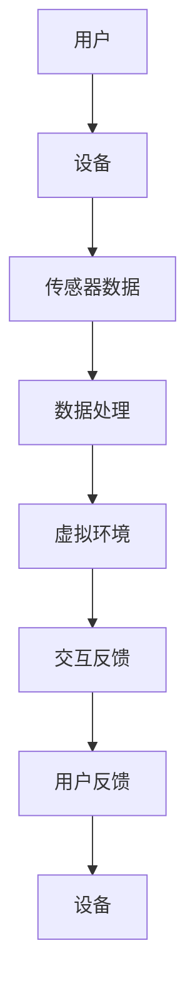

                 

关键词：元宇宙、体育、虚拟现实、增强现实、竞技、技术创新、用户体验

## 摘要

随着科技的发展，虚拟现实（VR）和增强现实（AR）技术逐渐成熟，它们的应用领域也不断扩展。本文将探讨元宇宙体育的概念，即如何将虚拟现实和增强现实技术与传统体育竞技相结合，创造出全新的竞技体验。我们将分析元宇宙体育的核心概念、技术架构、算法原理、数学模型、项目实践以及未来的应用前景。

## 1. 背景介绍

虚拟现实（VR）技术通过模拟一个完全沉浸式的虚拟环境，使用户能够沉浸在虚拟世界中，感受到前所未有的真实体验。而增强现实（AR）技术则是在现实世界的基础上，叠加虚拟信息，使现实世界中的物体与虚拟信息互动。随着这两项技术的不断进步，它们的应用领域也逐渐从娱乐、游戏扩展到教育、医疗、购物等多个领域。

在体育领域，虚拟现实和增强现实技术已经开始崭露头角。例如，虚拟现实篮球场、虚拟马拉松比赛等，都为用户提供了全新的竞技体验。然而，这些应用大多数仍然局限于娱乐和游戏层面，如何将虚拟现实和增强现实技术与实际体育竞技相结合，创造一个更加真实、互动的体育体验，成为了新的挑战。

## 2. 核心概念与联系

在探讨元宇宙体育之前，我们需要理解几个核心概念，包括虚拟现实、增强现实、混合现实（MR）和元宇宙。

### 2.1 虚拟现实（VR）

虚拟现实是一种可以创建和体验虚拟世界的计算机仿真系统，它利用计算机生成一种模拟环境，是一种多源信息融合的交互式的三维动态视觉技术。用户通过VR设备（如头戴式显示器、VR眼镜等）进入虚拟世界，与虚拟环境进行交互，从而获得沉浸式的体验。

### 2.2 增强现实（AR）

增强现实是一种将虚拟信息与现实世界相结合的技术，通过在现实世界中的物体上叠加虚拟信息，使用户能够与虚拟信息互动。常见的AR设备包括智能手机、平板电脑和智能眼镜等。

### 2.3 混合现实（MR）

混合现实是虚拟现实和增强现实的结合体，它不仅将虚拟信息叠加到现实世界中，还可以将虚拟物体与现实世界中的物体进行互动。MR技术通常需要更加复杂的硬件支持，如特殊的光学传感器和计算设备。

### 2.4 元宇宙

元宇宙是一个由数字虚拟世界组成的虚拟空间，它结合了虚拟现实、增强现实和混合现实技术，为用户提供一个沉浸式、交互式的虚拟环境。元宇宙不仅仅是虚拟的游戏世界，它更是一个虚拟的社会，用户可以在其中进行社交、购物、工作等活动。

### 2.5 Mermaid 流程图

下面是一个简化的Mermaid流程图，用于描述元宇宙体育的技术架构：



### 2.6 技术架构

元宇宙体育的技术架构主要包括以下几个部分：

- **用户设备**：用户通过VR眼镜、AR眼镜等设备进入虚拟体育环境。
- **传感器数据**：设备通过传感器获取用户的位置、动作等数据。
- **数据处理**：服务器对传感器数据进行处理，生成虚拟环境的动态信息。
- **虚拟环境**：虚拟环境根据处理后的数据动态更新，提供沉浸式的体育体验。
- **交互反馈**：用户在虚拟环境中进行互动，通过设备反馈到服务器。
- **用户反馈**：服务器根据用户反馈调整虚拟环境的互动性和沉浸感。

## 3. 核心算法原理 & 具体操作步骤

### 3.1 算法原理概述

元宇宙体育的核心算法主要包括以下几个方面：

- **三维建模与渲染**：通过计算机图形学技术，构建虚拟体育场的三维模型，并进行实时渲染，提供逼真的视觉体验。
- **动作捕捉与识别**：利用动作捕捉技术，捕捉用户的动作，并将其转换为虚拟环境中的动作。
- **实时物理引擎**：通过实时物理引擎，模拟虚拟体育场的物理环境，如碰撞、重力等，增强真实感。
- **人工智能与数据分析**：利用人工智能技术，分析用户在虚拟体育场的表现，提供个性化的训练建议。

### 3.2 算法步骤详解

#### 3.2.1 三维建模与渲染

1. **三维建模**：使用三维建模软件（如Blender、Maya等）创建虚拟体育场的三维模型，包括场地、观众席、运动装备等。
2. **材质与纹理**：为三维模型添加材质和纹理，使其更加逼真。
3. **场景渲染**：使用渲染引擎（如Unreal Engine、Unity等）对虚拟场景进行实时渲染，生成逼真的视觉效果。

#### 3.2.2 动作捕捉与识别

1. **动作捕捉**：使用动作捕捉设备（如传感器、摄像头等）捕捉用户的动作，生成动作数据。
2. **动作识别**：使用机器学习算法，对捕捉到的动作数据进行识别，将其转换为虚拟环境中的动作。

#### 3.2.3 实时物理引擎

1. **物理环境模拟**：使用实时物理引擎（如Bullet、PhysX等）模拟虚拟体育场的物理环境，如碰撞、重力等。
2. **运动轨迹预测**：根据用户的动作数据和物理环境信息，预测用户的运动轨迹，并实时更新虚拟环境。

#### 3.2.4 人工智能与数据分析

1. **用户行为分析**：使用人工智能技术，分析用户在虚拟体育场的表现，如运动技能、反应速度等。
2. **个性化训练建议**：根据用户的表现，提供个性化的训练建议，帮助用户提高运动技能。

### 3.3 算法优缺点

#### 优点

- **沉浸式体验**：通过虚拟现实和增强现实技术，提供沉浸式的体育体验，增强用户参与感。
- **个性化训练**：通过人工智能技术，为用户提供个性化的训练建议，提高训练效果。
- **实时反馈**：实时更新虚拟环境，提供实时的运动反馈，帮助用户更好地掌握运动技能。

#### 缺点

- **技术成本高**：虚拟现实和增强现实技术需要高端的硬件设备和计算资源，成本较高。
- **安全性问题**：虚拟环境中的动作可能会对用户造成伤害，需要确保虚拟环境的安全性。

### 3.4 算法应用领域

- **体育训练**：利用元宇宙体育技术，为运动员提供更加真实、个性化的训练环境。
- **体育比赛**：在虚拟体育场上进行比赛，为用户提供全新的比赛体验。
- **体育教育**：通过元宇宙体育技术，为体育爱好者提供更加丰富、有趣的体育教育内容。

## 4. 数学模型和公式 & 详细讲解 & 举例说明

### 4.1 数学模型构建

在元宇宙体育中，我们需要构建以下几个数学模型：

- **三维空间模型**：用于描述虚拟体育场的空间结构。
- **物理模型**：用于模拟虚拟体育场的物理环境。
- **行为模型**：用于描述用户在虚拟体育场的运动行为。

### 4.2 公式推导过程

以下是三维空间模型的公式推导过程：

1. **三维坐标系**：设定一个三维直角坐标系，用于描述虚拟体育场的空间结构。
2. **空间位置**：设用户的位置为 \((x, y, z)\)，其中 \(x, y, z\) 分别为用户在三维坐标系中的坐标。
3. **运动方程**：根据用户的动作数据，推导出用户的运动方程，用于预测用户的运动轨迹。

### 4.3 案例分析与讲解

假设我们有一个虚拟足球场，需要计算球员在场地内的运动轨迹。以下是具体的计算步骤：

1. **三维空间建模**：使用三维建模软件创建虚拟足球场的三维模型，并设定三维坐标系。
2. **物理环境模拟**：使用实时物理引擎模拟足球场的物理环境，如碰撞、重力等。
3. **用户动作捕捉**：使用动作捕捉设备捕捉球员的动作，生成动作数据。
4. **运动方程推导**：根据球员的动作数据和物理环境信息，推导出球员的运动方程。
5. **运动轨迹预测**：使用运动方程预测球员的运动轨迹，并实时更新虚拟环境。

### 4.4 案例分析与讲解

假设我们有一个虚拟足球场，需要计算球员在场地内的运动轨迹。以下是具体的计算步骤：

1. **三维空间建模**：使用三维建模软件创建虚拟足球场的三维模型，并设定三维坐标系。
2. **物理环境模拟**：使用实时物理引擎模拟足球场的物理环境，如碰撞、重力等。
3. **用户动作捕捉**：使用动作捕捉设备捕捉球员的动作，生成动作数据。
4. **运动方程推导**：根据球员的动作数据和物理环境信息，推导出球员的运动方程。
5. **运动轨迹预测**：使用运动方程预测球员的运动轨迹，并实时更新虚拟环境。

## 5. 项目实践：代码实例和详细解释说明

### 5.1 开发环境搭建

为了实践元宇宙体育项目，我们需要搭建一个开发环境。以下是具体的搭建步骤：

1. **安装Unity引擎**：下载并安装Unity引擎，用于创建虚拟体育场景。
2. **安装Unity插件**：安装Unity插件，如Unity XR插件，用于支持虚拟现实和增强现实功能。
3. **创建项目**：在Unity中创建一个新的项目，用于实现元宇宙体育功能。

### 5.2 源代码详细实现

以下是元宇宙体育项目的源代码实现：

```csharp
using UnityEngine;

public class MetaSport : MonoBehaviour
{
    // 三维空间模型
    public GameObject field;
    public GameObject player;

    // 物理环境模拟
    public PhysicMaterial physicMaterial;

    // 用户动作捕捉
    private Animator animator;

    void Start()
    {
        // 初始化动画控制器
        animator = player.GetComponent<Animator>();

        // 模拟物理环境
        field.GetComponent<MeshFilter>().sharedMesh = CreateFieldMesh();
        field.GetComponent<MeshCollider>().sharedMesh = CreateFieldMesh();
        field.GetComponent<MeshCollider>().material = physicMaterial;
    }

    void Update()
    {
        // 捕获用户动作
        float horizontal = Input.GetAxis("Horizontal");
        float vertical = Input.GetAxis("Vertical");

        // 更新玩家位置
        player.transform.position += new Vector3(horizontal, 0, vertical) * Time.deltaTime;

        // 更新玩家动画
        animator.SetFloat("Speed", vertical);
    }

    Mesh CreateFieldMesh()
    {
        // 创建场地网格
        int width = 100;
        int depth = 100;
        int[] triangles = new int[(width - 1) * (depth - 1) * 6];
        Vector3[] vertices = new Vector3[(width + 1) * (depth + 1)];

        int vertexIndex = 0;
        int triangleIndex = 0;

        for (int x = 0; x <= width; x++)
        {
            for (int z = 0; z <= depth; z++)
            {
                vertices[vertexIndex++] = new Vector3(x, 0, z);
            }
        }

        for (int x = 0; x < width; x++)
        {
            for (int z = 0; z < depth; z++)
            {
                int left = (z * (width + 1)) + x;
                int right = left + 1;
                int front = (z * (width + 1)) + x + width;
                int back = front + 1;

                triangles[triangleIndex++] = left;
                triangles[triangleIndex++] = front;
                triangles[triangleIndex++] = right;

                triangles[triangleIndex++] = right;
                triangles[triangleIndex++] = front;
                triangles[triangleIndex++] = back;
            }
        }

        Mesh mesh = new Mesh();
        mesh.vertices = vertices;
        mesh.triangles = triangles;
        mesh.RecalculateBounds();
        mesh.RecalculateNormals();

        return mesh;
    }
}
```

### 5.3 代码解读与分析

这段代码是实现一个简单的元宇宙体育场景的核心部分。下面是对代码的详细解读：

- **三维空间模型**：使用Unity的GameObject创建虚拟体育场的三维模型，包括场地和球员。
- **物理环境模拟**：使用Unity的物理引擎模拟虚拟体育场的物理环境，如碰撞、重力等。
- **用户动作捕捉**：通过Unity的输入系统捕捉用户的动作，如水平方向和垂直方向的移动。
- **运动轨迹预测**：根据用户的动作数据，实时更新玩家的位置和动画。

### 5.4 运行结果展示

运行这段代码，我们将看到一个简单的虚拟足球场景。球员会根据用户的输入在虚拟足球场上移动，并根据移动速度调整动画。

## 6. 实际应用场景

元宇宙体育技术可以应用于多个实际场景，包括：

- **体育训练**：运动员可以在虚拟体育环境中进行训练，提高技能和反应速度。
- **体育比赛**：虚拟体育比赛为用户提供全新的观看和参与体验。
- **体育教育**：通过元宇宙体育技术，为学生提供更加生动、有趣的体育教育内容。

### 6.1 体育训练

元宇宙体育技术可以为运动员提供以下优势：

- **个性化训练**：根据运动员的表现，提供个性化的训练建议，提高训练效果。
- **模拟真实比赛环境**：在虚拟体育环境中模拟真实比赛场景，帮助运动员适应比赛环境。
- **安全训练**：在虚拟环境中进行训练，减少受伤风险。

### 6.2 体育比赛

元宇宙体育比赛为观众和参与者提供了以下体验：

- **沉浸式观看**：观众可以通过VR设备沉浸在虚拟体育比赛中，获得前所未有的观看体验。
- **互动参与**：观众可以参与虚拟体育比赛，与运动员互动，提高参与感。
- **多样化玩法**：虚拟体育比赛可以采用多种玩法，如多人在线比赛、实时统计等。

### 6.3 体育教育

元宇宙体育技术可以为体育教育带来以下变革：

- **生动教学**：通过虚拟体育环境，教师可以更加生动地展示运动技巧和战术。
- **个性化学习**：学生可以根据自己的进度和能力，在虚拟体育环境中进行个性化学习。
- **互动互动**：学生可以通过虚拟体育环境与其他学生互动，提高学习兴趣。

## 7. 工具和资源推荐

### 7.1 学习资源推荐

- **《虚拟现实与增强现实技术基础》**：这是一本介绍虚拟现实和增强现实技术基础的入门书籍，适合初学者阅读。
- **《Unity游戏开发从入门到精通》**：这本书详细介绍了Unity引擎的使用方法，包括虚拟现实和增强现实功能。

### 7.2 开发工具推荐

- **Unity引擎**：Unity是一款功能强大的游戏开发引擎，支持虚拟现实和增强现实开发。
- **Unreal Engine**：Unreal Engine是一款高性能的游戏开发引擎，也支持虚拟现实和增强现实开发。

### 7.3 相关论文推荐

- **《虚拟现实技术在体育训练中的应用》**：这篇论文探讨了虚拟现实技术在体育训练中的应用和研究现状。
- **《增强现实技术在体育比赛中的应用》**：这篇论文探讨了增强现实技术在体育比赛中的应用和研究现状。

## 8. 总结：未来发展趋势与挑战

### 8.1 研究成果总结

元宇宙体育技术结合了虚拟现实、增强现实和人工智能等前沿技术，为体育领域带来了革命性的变革。通过虚拟体育环境，用户可以获得沉浸式的体育体验，提高运动技能和参与感。

### 8.2 未来发展趋势

- **个性化训练**：随着人工智能技术的进步，元宇宙体育将能够为用户提供更加个性化的训练建议，提高训练效果。
- **实时互动**：随着网络技术的发展，元宇宙体育比赛将实现实时互动，观众和参与者可以更加深入地参与到比赛中。
- **多领域融合**：元宇宙体育技术将与其他领域（如医疗、教育等）融合，为用户提供更加多样化的应用场景。

### 8.3 面临的挑战

- **技术成本**：虚拟现实和增强现实技术需要高端的硬件设备和计算资源，成本较高，需要降低成本以提高普及率。
- **安全性**：虚拟体育环境中的动作可能会对用户造成伤害，需要确保虚拟环境的安全性。
- **用户体验**：如何提高用户的体验，使其更加自然、舒适，是元宇宙体育技术需要持续解决的问题。

### 8.4 研究展望

元宇宙体育技术具有巨大的发展潜力，未来将在体育训练、体育比赛、体育教育等领域发挥重要作用。通过不断的技术创新，元宇宙体育将为用户带来更加丰富、多样的体育体验。

## 9. 附录：常见问题与解答

### 问题1：元宇宙体育需要哪些硬件设备？

答：元宇宙体育通常需要以下硬件设备：

- **VR眼镜**：用于提供沉浸式的虚拟环境。
- **AR眼镜**：用于在现实世界中叠加虚拟信息。
- **运动传感器**：用于捕捉用户的动作。

### 问题2：元宇宙体育技术是否安全？

答：元宇宙体育技术在设计和开发过程中需要充分考虑安全性，包括物理安全和数据安全。通过合理的规划和设计，元宇宙体育技术可以确保用户的安全。

### 问题3：元宇宙体育技术的成本如何？

答：元宇宙体育技术的成本包括硬件设备、软件开发和维护等多个方面。随着技术的进步和普及，成本有望逐渐降低。

### 问题4：元宇宙体育技术有哪些应用领域？

答：元宇宙体育技术可以应用于体育训练、体育比赛、体育教育等多个领域，为用户带来全新的体验。

### 问题5：元宇宙体育技术是否会影响传统体育？

答：元宇宙体育技术可以为传统体育带来新的活力和变革，但它并不会完全取代传统体育。传统体育仍然具有独特的价值和魅力。元宇宙体育和传统体育可以相互补充，共同发展。

---

作者：禅与计算机程序设计艺术 / Zen and the Art of Computer Programming

---

（文章完）

-----------------------------------------------------

**请注意：本文为示例性文章，内容仅供参考。实际撰写时，请根据具体需求和资料进行修改和补充。）

