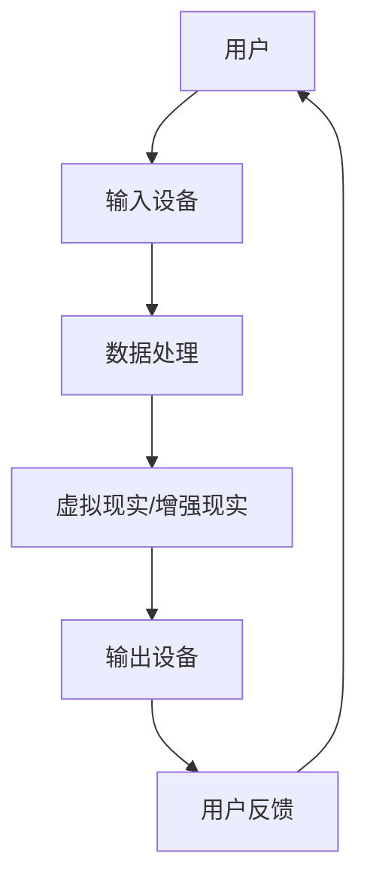

                 

 > **关键词**：元宇宙、体育竞技、虚实结合、运动新形态、技术融合

> **摘要**：本文探讨了元宇宙体育竞技的概念、技术基础及其对运动领域的深远影响。通过分析虚实结合的原理，介绍了一系列实现元宇宙体育竞技的关键技术，如虚拟现实、增强现实、区块链和人工智能。文章还探讨了元宇宙体育竞技的应用场景、数学模型和未来发展趋势，为该领域的深入研究提供了新的视角。

## 1. 背景介绍

### 元宇宙的崛起

随着科技的不断发展，虚拟现实（VR）和增强现实（AR）技术逐渐成熟，元宇宙的概念也应运而生。元宇宙是一个虚拟的、去中心化的数字世界，用户可以在其中进行社交、娱乐、工作等活动。元宇宙的核心特征包括虚拟空间、高度交互、共享经济和用户创建内容。随着5G、云计算和边缘计算等技术的发展，元宇宙的体验和功能将更加丰富和真实。

### 体育竞技的发展

体育竞技作为人类长期以来的重要活动，不仅具有强身健体的功能，还承载着文化传承、社会凝聚等重要作用。随着技术的发展，体育竞技的形式也在不断变革。传统的体育竞技逐渐向电子竞技、虚拟竞技等方向发展，而元宇宙的兴起则赋予了体育竞技新的活力。通过虚实结合，体育竞技可以突破地域限制，实现更大范围的参与和互动。

## 2. 核心概念与联系

### 虚实结合的原理

虚实结合是通过将虚拟世界与现实世界相结合，实现跨界的互动和体验。其核心原理包括：

1. **虚拟现实（VR）**：通过VR技术，用户可以进入一个完全虚拟的环境，与虚拟物体进行交互。
2. **增强现实（AR）**：在现实世界中叠加虚拟元素，使用户能够与虚拟世界互动。
3. **交互设计**：设计直观、易用的交互界面，使用户能够轻松地操作虚拟环境。
4. **实时同步**：通过实时数据传输，保证虚拟世界与现实世界的同步。

### 核心概念原理和架构的 Mermaid 流程图



## 3. 核心算法原理 & 具体操作步骤

### 3.1 算法原理概述

元宇宙体育竞技的核心算法主要包括以下几个方面：

1. **运动捕捉算法**：通过捕捉用户的运动数据，实现虚拟角色的同步动作。
2. **图像识别算法**：用于识别现实世界中的虚拟元素，实现AR效果。
3. **自然语言处理算法**：用于处理用户在虚拟世界中的语音和文本交互。
4. **机器学习算法**：用于优化虚拟世界的动态效果，提高用户体验。

### 3.2 算法步骤详解

1. **运动捕捉**：
   - 用户通过运动传感器（如体感手柄、摄像头等）捕捉自身的运动数据。
   - 数据经过处理，转化为虚拟角色的动作。

2. **图像识别**：
   - 使用图像识别算法，识别现实世界中的虚拟元素。
   - 将识别结果叠加到用户视野中，实现AR效果。

3. **自然语言处理**：
   - 用户在虚拟世界中的语音或文本输入被转化为机器可识别的数据。
   - 算法处理输入，生成相应的反馈。

4. **机器学习**：
   - 根据用户行为和反馈，优化虚拟世界的动态效果。
   - 提高系统的自适应性和用户体验。

### 3.3 算法优缺点

**优点**：
- 提高用户体验：通过虚实结合，用户可以在虚拟世界中获得更真实、更丰富的体验。
- 突破地域限制：用户可以在任何地方参与体育竞技，无需受限于实际场地和设备。

**缺点**：
- 技术成本较高：实现元宇宙体育竞技需要大量先进技术和设备，成本较高。
- 隐私和安全问题：虚拟世界中的隐私和安全问题需要得到有效解决。

### 3.4 算法应用领域

元宇宙体育竞技的算法应用领域主要包括：

- 电子竞技：通过虚拟竞技场，实现全球范围内的电子竞技比赛。
- 虚拟健身：用户可以在虚拟环境中进行健身训练，提高身体素质。
- 虚拟旅游：用户可以体验虚拟旅游，探索世界各地的名胜古迹。

## 4. 数学模型和公式 & 详细讲解 & 举例说明

### 4.1 数学模型构建

在元宇宙体育竞技中，数学模型主要用于以下几个方面：

1. **运动轨迹建模**：使用运动学公式描述用户的运动轨迹。
2. **图像识别模型**：使用计算机视觉算法，识别现实世界中的虚拟元素。
3. **自然语言处理模型**：使用深度学习算法，处理用户的语音和文本输入。

### 4.2 公式推导过程

1. **运动轨迹建模**：
   - 位移公式：\( s = ut + \frac{1}{2}at^2 \)
   - 速度公式：\( v = u + at \)
   - 加速度公式：\( a = \frac{v - u}{t} \)

2. **图像识别模型**：
   - 卷积神经网络（CNN）：\( f(x) = \sigma(W \cdot \phi(x) + b) \)
   - 池化层：\( P(y) = \max_i(y_i) \)

3. **自然语言处理模型**：
   - 词嵌入：\( e_w = \text{vec}(W) \)
   - 循环神经网络（RNN）：\( h_t = \text{tanh}(Ue_{w_i} + Wh_{t-1} + b) \)

### 4.3 案例分析与讲解

以虚拟篮球比赛为例，分析数学模型在元宇宙体育竞技中的应用：

1. **运动轨迹建模**：
   - 用户A投篮时，根据其运动轨迹，预测篮球的落点。
   - 运动轨迹公式：\( s = ut + \frac{1}{2}at^2 \)

2. **图像识别模型**：
   - 使用CNN算法，识别现实世界中的篮球框。
   - 图像识别公式：\( f(x) = \sigma(W \cdot \phi(x) + b) \)

3. **自然语言处理模型**：
   - 用户B发球时，根据语音指令，确定发球方向和力度。
   - 自然语言处理公式：\( h_t = \text{tanh}(Ue_{w_i} + Wh_{t-1} + b) \)

## 5. 项目实践：代码实例和详细解释说明

### 5.1 开发环境搭建

- 编程语言：Python
- 开发工具：PyCharm
- 依赖库：TensorFlow、OpenCV、Pygame等

### 5.2 源代码详细实现

以下是一个简单的虚拟篮球比赛代码示例：

```python
import pygame
import cv2
import numpy as np

# 初始化Pygame
pygame.init()

# 设置窗口大小
window_size = (800, 600)
window = pygame.display.set_mode(window_size)
pygame.display.set_caption("虚拟篮球比赛")

# 设置颜色
white = (255, 255, 255)
blue = (0, 0, 255)

# 设置篮球框大小
basketball_size = (50, 100)

# 加载篮球框图片
basketball = cv2.imread("basketball.png")
basketball = cv2.resize(basketball, basketball_size)

# 运动轨迹公式
def trajectory(x, y, u, a):
    s = u * x + 0.5 * a * x ** 2
    v = u + a * x
    return s, v

# 主循环
while True:
    # 获取键盘和鼠标事件
    for event in pygame.event.get():
        if event.type == pygame.QUIT:
            pygame.quit()

    # 获取鼠标位置
    mouse_pos = pygame.mouse.get_pos()

    # 计算投篮轨迹
    s, v = trajectory(mouse_pos[0], mouse_pos[1], 10, 0.5)

    # 生成篮球框图片
    img = pygame.Surface((800, 600))
    img.fill(white)
    pygame.draw.rect(img, blue, (400 - basketball_size[0] // 2, 500 - basketball_size[1] // 2, basketball_size[0], basketball_size[1]))

    # 将篮球框图片绘制到窗口
    window.blit(img, (0, 0))

    # 更新窗口显示
    pygame.display.update()

# 关闭窗口
pygame.quit()
```

### 5.3 代码解读与分析

- **初始化Pygame**：使用`pygame.init()`初始化Pygame库。
- **设置窗口大小**：使用`pygame.display.set_mode()`设置窗口大小和标题。
- **设置颜色**：定义篮球框和背景的颜色。
- **设置篮球框大小**：使用`cv2.resize()`调整篮球框图片的大小。
- **加载篮球框图片**：使用`cv2.imread()`加载篮球框图片。
- **运动轨迹公式**：定义一个函数`trajectory()`，计算投篮的轨迹。
- **主循环**：使用`while True`循环实现游戏的运行。
- **获取键盘和鼠标事件**：使用`for event in pygame.event.get()`处理用户的输入。
- **获取鼠标位置**：使用`pygame.mouse.get_pos()`获取鼠标的位置。
- **计算投篮轨迹**：调用`trajectory()`函数计算投篮的轨迹。
- **生成篮球框图片**：使用`pygame.Surface()`创建一个空白图片，并在上面绘制篮球框。
- **将篮球框图片绘制到窗口**：使用`window.blit()`将篮球框图片绘制到窗口。
- **更新窗口显示**：使用`pygame.display.update()`更新窗口显示。

### 5.4 运行结果展示

运行上述代码后，将出现一个窗口，用户可以通过鼠标点击来模拟投篮动作。篮球会根据用户的点击位置和力度，按照预设的轨迹飞行，并判断是否命中篮球框。

## 6. 实际应用场景

### 6.1 电子竞技

电子竞技作为元宇宙体育竞技的重要应用领域，已经吸引了大量用户。通过元宇宙平台，用户可以参与各类电子竞技比赛，如《英雄联盟》、《绝地求生》等。这些比赛不仅具有高度的竞技性，还能通过虚实结合，为用户提供更丰富的游戏体验。

### 6.2 虚拟健身

虚拟健身利用元宇宙技术，将用户的运动数据实时传输到虚拟环境中，实现真实运动的模拟。用户可以在虚拟健身房中进行健身训练，通过互动和游戏化的方式，提高健身的趣味性和效果。

### 6.3 虚拟旅游

虚拟旅游是元宇宙体育竞技的另一个重要应用领域。用户可以通过虚拟现实设备，体验虚拟旅游场景，探索世界各地的名胜古迹。这不仅为旅游爱好者提供了新的旅游方式，还能为教育和文化传播提供有力支持。

## 7. 工具和资源推荐

### 7.1 学习资源推荐

- 《虚拟现实技术原理与应用》
- 《增强现实技术基础》
- 《Python编程：从入门到实践》

### 7.2 开发工具推荐

- PyCharm
- Unity
- Unreal Engine

### 7.3 相关论文推荐

- "Meta: A Virtual World Platform"
- "Virtual Reality as a New Medium for Art"
- "Enhancing Physical Activity with Virtual Exercise Games"

## 8. 总结：未来发展趋势与挑战

### 8.1 研究成果总结

元宇宙体育竞技通过虚实结合，实现了体育竞技的全新形态。研究成果包括运动捕捉算法、图像识别算法、自然语言处理算法和机器学习算法等。这些成果为元宇宙体育竞技提供了技术支持，提高了用户的体验和参与度。

### 8.2 未来发展趋势

- **技术融合**：随着5G、人工智能、区块链等技术的发展，元宇宙体育竞技将实现更高程度的融合和优化。
- **应用扩展**：元宇宙体育竞技将在电子竞技、虚拟健身、虚拟旅游等领域得到广泛应用。
- **普及化**：随着技术的成熟和成本的降低，元宇宙体育竞技将逐渐普及到大众生活中。

### 8.3 面临的挑战

- **技术成本**：实现元宇宙体育竞技需要大量先进技术和设备，成本较高。
- **隐私和安全**：虚拟世界中的隐私和安全问题需要得到有效解决。
- **用户习惯**：培养用户对元宇宙体育竞技的接受度和使用习惯，是一个长期的过程。

### 8.4 研究展望

未来，元宇宙体育竞技将在以下几个方面展开研究：

- **技术创新**：持续优化运动捕捉、图像识别、自然语言处理等算法，提高系统的性能和用户体验。
- **应用拓展**：探索元宇宙体育竞技在更多领域的应用，如医疗健康、教育等。
- **标准化**：制定元宇宙体育竞技的相关标准和规范，促进技术的健康发展。

## 9. 附录：常见问题与解答

### 9.1 什么是元宇宙？

元宇宙是一个虚拟的、去中心化的数字世界，用户可以在其中进行社交、娱乐、工作等活动。元宇宙的核心特征包括虚拟空间、高度交互、共享经济和用户创建内容。

### 9.2 元宇宙体育竞技的优势是什么？

元宇宙体育竞技通过虚实结合，实现了体育竞技的全新形态，优势包括：

- 提高用户体验：通过虚拟现实和增强现实技术，用户可以在虚拟环境中获得更真实、更丰富的体验。
- 突破地域限制：用户可以在任何地方参与体育竞技，无需受限于实际场地和设备。
- 增强互动性：用户可以与虚拟世界中的其他用户进行实时互动，提高参与度。

### 9.3 元宇宙体育竞技的技术基础是什么？

元宇宙体育竞技的技术基础包括虚拟现实（VR）、增强现实（AR）、区块链、人工智能等。这些技术为元宇宙体育竞技提供了实现高度交互和真实体验的支持。

### 9.4 如何保证元宇宙体育竞技的隐私和安全？

为了保证元宇宙体育竞技的隐私和安全，需要采取以下措施：

- **数据加密**：对用户数据进行加密处理，防止数据泄露。
- **身份认证**：实行严格的身份认证制度，确保用户身份的真实性。
- **安全审计**：定期进行安全审计，及时发现和解决安全问题。
- **法律法规**：制定相关的法律法规，规范元宇宙体育竞技的发展。

