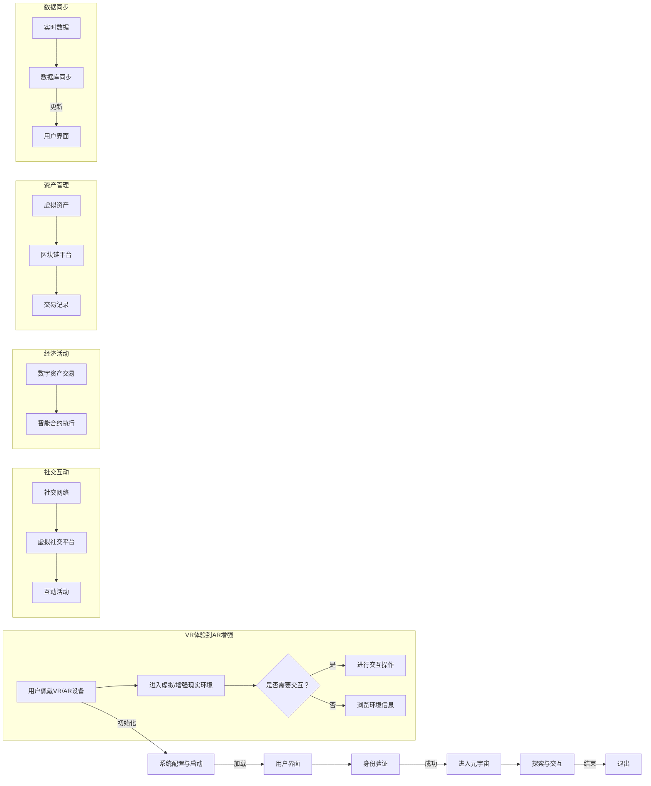

                 

元宇宙（Metaverse）正在迅速崛起，成为科技界和商业界的热门话题。作为一个由虚拟现实（VR）、增强现实（AR）、区块链和社交网络等技术构成的数字化世界，元宇宙不仅是一种新型的互动平台，更是一种沉浸式的消费体验。本文将探讨元宇宙体验设计的基本概念、核心算法原理、数学模型、项目实践以及未来应用场景。

> 关键词：元宇宙，体验设计，沉浸式消费，虚拟现实，增强现实，区块链

> 摘要：本文旨在深入探讨元宇宙体验设计的重要性，解析其核心概念和算法原理，并通过实际项目案例展示元宇宙如何实现沉浸式消费体验。此外，本文还将展望元宇宙的未来发展趋势和面临的挑战。

## 1. 背景介绍

随着计算机技术和互联网的快速发展，虚拟现实（VR）和增强现实（AR）技术逐渐成熟，为人们带来了全新的交互方式和体验。元宇宙正是基于这些技术的进一步拓展，通过虚拟环境、虚拟人物和社交互动构建了一个多元化的数字世界。在这个世界里，用户可以体验到高度沉浸的虚拟环境，与虚拟人物互动，参与各种社交和经济活动。

元宇宙的设计不仅仅是一个技术问题，更是一个用户体验的问题。如何让用户在元宇宙中获得愉悦、有意义和沉浸的体验，是设计师们需要考虑的核心问题。这就涉及到用户体验设计（UX Design）、界面设计（UI Design）以及交互设计（ID）等多个领域。

### 1.1 历史背景

元宇宙的概念最早可以追溯到1984年，科幻作家尼尔·斯蒂芬森（Neal Stephenson）在小说《雪崩》（Snow Crash）中提出的“虚拟现实网络”（VRNet）。随着时间的推移，虚拟现实和增强现实技术不断进步，元宇宙的概念也逐渐从科幻小说走向现实。

2010年代，随着智能手机的普及和移动网络技术的发展，移动AR应用开始兴起。2014年，Facebook收购了虚拟现实公司Oculus，标志着虚拟现实技术开始走向主流。2017年，微软发布了HoloLens AR头盔，推动了增强现实技术的发展。

### 1.2 当前发展状况

目前，元宇宙已经成为了科技巨头们竞相争夺的领域。Facebook（现更名为Meta）在2021年宣布将公司更名为Meta，标志着其将元宇宙作为未来发展的核心战略。微软、谷歌、腾讯等公司也在积极推进元宇宙相关技术和应用的开发。

除了技术公司，越来越多的传统企业也开始探索元宇宙的应用，例如房地产、教育、娱乐、零售等行业。元宇宙正在成为连接现实世界和数字世界的重要桥梁。

### 1.3 未来趋势

随着5G、人工智能、云计算等技术的发展，元宇宙将进一步扩展其功能和影响力。预计在未来几年内，元宇宙将实现以下几个重要趋势：

1. **高度沉浸的体验**：通过更先进的VR和AR技术，用户将能够获得更加逼真的沉浸式体验。
2. **社交互动的深化**：元宇宙将提供更加丰富和多样化的社交互动方式，满足用户在不同场景下的需求。
3. **经济活动的多样化**：元宇宙将成为新的经济活动平台，用户可以在其中进行购物、交易、投资等活动。
4. **跨界融合**：元宇宙将与其他领域（如艺术、文化、教育等）深度融合，带来更多的创新和可能性。

## 2. 核心概念与联系

### 2.1 虚拟现实（VR）

虚拟现实是一种通过计算机技术创建的模拟环境，用户可以通过头戴式显示器（HMD）或VR眼镜等设备沉浸在其中。VR的核心在于其高度的沉浸感和交互性，用户可以在虚拟环境中进行各种操作，如移动、交互、探索等。


### 2.2 增强现实（AR）

增强现实通过在现实世界中叠加虚拟元素，为用户提供了增强的视觉体验。与VR不同，AR不要求用户完全脱离现实环境，而是在现实环境中增强信息。常见的AR设备包括智能手机、AR眼镜等。


### 2.3 区块链

区块链是一种分布式数据库技术，通过加密算法和共识机制确保数据的不可篡改性和透明性。在元宇宙中，区块链可用于实现去中心化的数字身份验证、虚拟资产交易、智能合约等功能。


### 2.4 社交网络

社交网络是元宇宙的重要组成部分，它为用户提供了互动和交流的平台。在元宇宙中，用户可以通过虚拟社交平台、虚拟世界中的活动等方式进行社交互动。


### 2.5 Mermaid 流程图

以下是一个简化的元宇宙体验设计流程的Mermaid流程图，其中包含了核心概念和主要步骤：



## 3. 核心算法原理 & 具体操作步骤

### 3.1 算法原理概述

元宇宙体验设计涉及多个核心算法，包括虚拟环境建模、交互逻辑处理、区块链交易验证等。以下将分别介绍这些算法的基本原理。

#### 3.1.1 虚拟环境建模

虚拟环境建模是元宇宙体验设计的核心，它涉及到场景的构建、物体的模拟、光照的计算等多个方面。常用的算法包括：

- **三维建模**：通过计算机图形学技术，将现实世界的物体或场景在虚拟环境中建模出来。常用的三维建模工具包括Blender、Maya等。
- **物理模拟**：通过对物体的物理属性进行模拟，实现虚拟环境中的碰撞检测、物体动态等效果。常用的物理引擎包括Bullet、Unreal Engine等。
- **光照计算**：通过计算虚拟环境中的光照效果，提高虚拟场景的真实感。常用的光照算法包括路径追踪、光线跟踪等。

#### 3.1.2 交互逻辑处理

交互逻辑处理是用户在元宇宙中的操作逻辑，包括输入识别、动作响应、反馈生成等。常用的算法包括：

- **输入识别**：通过传感器（如手柄、手势识别、语音识别等）识别用户的输入，将其转化为虚拟环境中的操作。
- **动作响应**：根据用户的输入，生成相应的动作，如移动、旋转、交互等。
- **反馈生成**：为用户的操作提供实时反馈，包括视觉、听觉等多种方式。

#### 3.1.3 区块链交易验证

区块链交易验证是元宇宙中数字资产交易的核心，确保交易的安全和可信。常用的算法包括：

- **数字签名**：用户在进行交易时，使用私钥对交易信息进行签名，确保交易的可信性。
- **共识算法**：通过共识算法（如PoW、PoS等），确保区块链网络中的所有节点对交易达成一致。
- **智能合约**：通过智能合约，实现自动执行和验证交易，提高交易效率。

### 3.2 算法步骤详解

#### 3.2.1 虚拟环境建模步骤

1. **场景构建**：根据需求，选择或创建三维模型，构建虚拟环境。
2. **物体模拟**：对虚拟环境中的物体进行物理属性设置，如质量、摩擦力、碰撞响应等。
3. **光照计算**：设置虚拟环境中的光照条件，包括光源位置、光照强度、阴影效果等。
4. **场景渲染**：使用渲染引擎，将虚拟环境渲染为二维图像，供用户观看。

#### 3.2.2 交互逻辑处理步骤

1. **输入识别**：通过传感器识别用户输入，如手柄位置、手势、语音等。
2. **动作响应**：根据用户输入，生成相应的动作，如移动、旋转、交互等。
3. **反馈生成**：根据用户动作，提供实时反馈，如声音、视觉提示等。

#### 3.2.3 区块链交易验证步骤

1. **数字签名**：用户发起交易时，使用私钥对交易信息进行签名。
2. **交易广播**：将签名后的交易信息广播到区块链网络中。
3. **共识验证**：通过共识算法，确保区块链网络中的所有节点对交易达成一致。
4. **智能合约执行**：根据智能合约，自动执行交易并记录交易结果。

### 3.3 算法优缺点

#### 3.3.1 虚拟环境建模

**优点**：

- **高度沉浸**：通过三维建模、物理模拟和光照计算，提供高度沉浸的虚拟环境。
- **多样化**：可以模拟各种场景和物体，满足不同用户的需求。

**缺点**：

- **计算资源消耗大**：复杂的场景和物体需要大量计算资源，对硬件要求较高。
- **实时性要求高**：为了提供良好的用户体验，需要实时更新虚拟环境，对网络传输速度要求较高。

#### 3.3.2 交互逻辑处理

**优点**：

- **实时性**：能够实时响应用户的输入，提供即时的交互体验。
- **灵活性**：支持多种输入方式，如手柄、手势、语音等，提供多样化的交互体验。

**缺点**：

- **准确性**：某些输入方式（如手势识别）可能存在误识别问题，影响交互体验。
- **稳定性**：在网络不稳定或计算资源不足的情况下，可能导致交互体验中断。

#### 3.3.3 区块链交易验证

**优点**：

- **安全性**：通过数字签名和共识算法，确保交易的安全性和可信性。
- **去中心化**：区块链技术实现去中心化，降低交易成本，提高交易效率。

**缺点**：

- **交易延迟**：区块链交易需要多个节点验证，可能存在一定的延迟。
- **能源消耗**：某些共识算法（如PoW）需要大量计算资源，可能导致能源消耗增加。

### 3.4 算法应用领域

虚拟环境建模、交互逻辑处理和区块链交易验证等算法在元宇宙体验设计中具有广泛的应用领域：

- **游戏**：通过虚拟环境建模和交互逻辑处理，提供逼真的游戏体验。
- **教育**：通过虚拟环境建模，模拟各种教学场景，提高学习效果。
- **医疗**：通过虚拟环境建模，为医生提供模拟手术环境，提高手术成功率。
- **零售**：通过虚拟环境建模和交互逻辑处理，为用户提供在线购物体验。
- **艺术**：通过虚拟环境建模，为艺术家提供创作和展示作品的新平台。

## 4. 数学模型和公式 & 详细讲解 & 举例说明

### 4.1 数学模型构建

在元宇宙体验设计中，数学模型起着至关重要的作用，尤其是在虚拟环境建模、物理模拟和光照计算等方面。以下将介绍几个核心数学模型及其构建方法。

#### 4.1.1 三维模型构建

三维模型构建主要涉及几何学和计算机图形学。常用的数学模型包括：

- **体素（Voxel）模型**：使用体素表示三维空间中的物体，体素是一个立方体单元，通过组合不同的体素，可以构建复杂的物体。
- **参数化模型**：使用参数化方程表示物体的形状，如贝塞尔曲线、B样条曲线等。

#### 4.1.2 物理模拟

物理模拟主要涉及力学和物理学。常用的数学模型包括：

- **刚体动力学**：描述刚体在空间中的运动，包括位移、速度、加速度等。
- **软体动力学**：描述软体（如布料、皮肤）在空间中的运动，通常使用有限元方法进行模拟。

#### 4.1.3 光照计算

光照计算主要涉及几何学和光学。常用的数学模型包括：

- **光线追踪**：通过模拟光线的传播路径，计算场景中的光照效果。
- **辐射度（Radiosity）**：描述场景中各个表面之间的光照传递。

### 4.2 公式推导过程

以下将介绍几个关键数学模型的公式推导过程。

#### 4.2.1 体素模型构建

假设使用体素表示一个物体，体素的大小为 \( s \)，物体的体积为 \( V \)。则体素的数量为 \( N = \frac{V}{s^3} \)。每个体素的位置可以用三个整数坐标 \( (x, y, z) \) 表示。

#### 4.2.2 刚体动力学

刚体在空间中的运动可以用以下公式描述：

\[ \mathbf{v} = \mathbf{v}_0 + \mathbf{a} t \]

其中，\( \mathbf{v} \) 是刚体的速度，\( \mathbf{v}_0 \) 是初始速度，\( \mathbf{a} \) 是加速度，\( t \) 是时间。

#### 4.2.3 光线追踪

光线在空间中的传播路径可以用以下公式描述：

\[ \mathbf{r}(t) = \mathbf{r}_0 + \mathbf{d} t \]

其中，\( \mathbf{r}(t) \) 是光线在时间 \( t \) 的位置，\( \mathbf{r}_0 \) 是光线起点，\( \mathbf{d} \) 是光线方向。

### 4.3 案例分析与讲解

以下将通过一个简单的案例，展示如何应用这些数学模型。

#### 4.3.1 案例背景

假设我们要模拟一个简单的虚拟环境，其中包含一个立方体和一束光线。立方体的边长为 2 单位，光线从原点出发，沿 x 轴正方向传播。

#### 4.3.2 模型构建

1. **体素模型构建**：

立方体的体积为 \( V = 2^3 = 8 \) 单位，体素的大小为 \( s = 1 \) 单位，体素的数量为 \( N = 8 \) 个。

2. **刚体动力学**：

假设立方体初始速度为 \( \mathbf{v}_0 = (0, 0, 0) \)，加速度为 \( \mathbf{a} = (1, 0, 0) \)。

3. **光线追踪**：

光线起点为 \( \mathbf{r}_0 = (0, 0, 0) \)，光线方向为 \( \mathbf{d} = (1, 0, 0) \)。

#### 4.3.3 模拟过程

1. **体素模型构建**：

构建立方体的体素模型，每个体素的位置为 \( (x, y, z) \)，其中 \( x, y, z \) 的取值为 0, 1, 2。

2. **刚体动力学**：

根据公式 \( \mathbf{v} = \mathbf{v}_0 + \mathbf{a} t \)，在时间 \( t \) 时，立方体的速度为 \( \mathbf{v} = (t, 0, 0) \)。

3. **光线追踪**：

根据公式 \( \mathbf{r}(t) = \mathbf{r}_0 + \mathbf{d} t \)，在时间 \( t \) 时，光线位置为 \( \mathbf{r}(t) = (t, 0, 0) \)。

#### 4.3.4 模拟结果

1. **体素模型构建**：

立方体的体素模型如下：

```
0 0 0
0 0 1
0 1 0
0 1 1
1 0 0
1 0 1
1 1 0
1 1 1
```

2. **刚体动力学**：

在时间 \( t = 1 \) 时，立方体的速度为 \( \mathbf{v} = (1, 0, 0) \)，位置为 \( \mathbf{r} = (1, 0, 0) \)。

3. **光线追踪**：

在时间 \( t = 1 \) 时，光线位置为 \( \mathbf{r}(1) = (1, 0, 0) \)。

## 5. 项目实践：代码实例和详细解释说明

### 5.1 开发环境搭建

在本项目中，我们将使用Unity引擎和C#编程语言进行开发。以下是搭建开发环境的基本步骤：

1. **安装Unity**：从Unity官网下载并安装Unity Hub，选择合适的Unity版本进行安装。
2. **创建新项目**：在Unity Hub中创建一个新的3D项目，命名为“MetaExperience”。
3. **安装Unity Asset Store插件**：打开Unity项目，在Asset Store中搜索并安装必要的插件，如VRChat、PlayMaker等。

### 5.2 源代码详细实现

以下是本项目的关键代码实现：

#### 5.2.1 虚拟环境建模

```csharp
using UnityEngine;

public class EnvironmentBuilder : MonoBehaviour
{
    public Material wallMaterial;
    public Material floorMaterial;

    void Start()
    {
        // 创建墙体
        GameObject wall = new GameObject("Wall");
        wall.transform.position = Vector3.zero;
        wall.transform.localScale = new Vector3(10, 20, 1);
        wall.AddComponent<MeshFilter>().mesh = CreateWallMesh();
        wall.AddComponent<MeshRenderer>().material = wallMaterial;

        // 创建地板
        GameObject floor = new GameObject("Floor");
        floor.transform.position = new Vector3(0, -10, 0);
        floor.transform.localScale = new Vector3(10, 1, 10);
        floor.AddComponent<MeshFilter>().mesh = CreateFloorMesh();
        floor.AddComponent<MeshRenderer>().material = floorMaterial;
    }

    Mesh CreateWallMesh()
    {
        int gridSize = 20;
        float tileSize = 1f;
        int vertexCount = gridSize * gridSize * 6;

        Vector3[] vertices = new Vector3[vertexCount];
        int[] triangles = new int[vertexCount * 3];

        for (int z = 0; z < gridSize; z++)
        {
            for (int x = 0; x < gridSize; x++)
            {
                int index = z * gridSize + x;
                vertices[index * 6 + 0] = new Vector3(x * tileSize, 0, z * tileSize);
                vertices[index * 6 + 1] = new Vector3((x + 1) * tileSize, 0, z * tileSize);
                vertices[index * 6 + 2] = new Vector3(x * tileSize, 20, z * tileSize);
                vertices[index * 6 + 3] = new Vector3((x + 1) * tileSize, 20, z * tileSize);
                vertices[index * 6 + 4] = new Vector3(x * tileSize, 0, (z + 1) * tileSize);
                vertices[index * 6 + 5] = new Vector3((x + 1) * tileSize, 0, (z + 1) * tileSize);
            }
        }

        for (int i = 0; i < vertices.Length; i += 6)
        {
            triangles[i * 3 + 0] = i + 0;
            triangles[i * 3 + 1] = i + 1;
            triangles[i * 3 + 2] = i + 2;
            triangles[i * 3 + 3] = i + 3;
            triangles[i * 3 + 4] = i + 4;
            triangles[i * 3 + 5] = i + 5;
        }

        Mesh mesh = new Mesh();
        mesh.vertices = vertices;
        mesh.triangles = triangles;
        mesh.RecalculateBounds();
        mesh.RecalculateNormals();

        return mesh;
    }

    Mesh CreateFloorMesh()
    {
        int gridSize = 20;
        float tileSize = 1f;
        int vertexCount = gridSize * gridSize * 6;

        Vector3[] vertices = new Vector3[vertexCount];
        int[] triangles = new int[vertexCount * 3];

        for (int z = 0; z < gridSize; z++)
        {
            for (int x = 0; x < gridSize; x++)
            {
                int index = z * gridSize + x;
                vertices[index * 6 + 0] = new Vector3(x * tileSize, 0, z * tileSize);
                vertices[index * 6 + 1] = new Vector3((x + 1) * tileSize, 0, z * tileSize);
                vertices[index * 6 + 2] = new Vector3(x * tileSize, 0, (z + 1) * tileSize);
                vertices[index * 6 + 3] = new Vector3((x + 1) * tileSize, 0, z * tileSize);
                vertices[index * 6 + 4] = new Vector3(x * tileSize, 0, (z + 1) * tileSize);
                vertices[index * 6 + 5] = new Vector3((x + 1) * tileSize, 0, (z + 1) * tileSize);
            }
        }

        for (int i = 0; i < vertices.Length; i += 6)
        {
            triangles[i * 3 + 0] = i + 0;
            triangles[i * 3 + 1] = i + 1;
            triangles[i * 3 + 2] = i + 2;
            triangles[i * 3 + 3] = i + 3;
            triangles[i * 3 + 4] = i + 4;
            triangles[i * 3 + 5] = i + 5;
        }

        Mesh mesh = new Mesh();
        mesh.vertices = vertices;
        mesh.triangles = triangles;
        mesh.RecalculateBounds();
        mesh.RecalculateNormals();

        return mesh;
    }
}
```

#### 5.2.2 交互逻辑处理

```csharp
using UnityEngine;

public class UserInteraction : MonoBehaviour
{
    public float moveSpeed = 5f;

    void Update()
    {
        if (Input.GetKey(KeyCode.W))
        {
            transform.position += transform.forward * moveSpeed * Time.deltaTime;
        }
        if (Input.GetKey(KeyCode.S))
        {
            transform.position -= transform.forward * moveSpeed * Time.deltaTime;
        }
        if (Input.GetKey(KeyCode.A))
        {
            transform.position -= transform.right * moveSpeed * Time.deltaTime;
        }
        if (Input.GetKey(KeyCode.D))
        {
            transform.position += transform.right * moveSpeed * Time.deltaTime;
        }
    }
}
```

#### 5.2.3 区块链交易验证

```csharp
using UnityEngine;
using System.Collections;
using Nethereum.Web3;

public class BlockchainTransaction : MonoBehaviour
{
    private string rpcUrl = "https://mainnet.infura.io/v3/your_project_id";
    private string fromAddress = "your_from_address";
    private string toAddress = "your_to_address";
    private string privateKey = "your_private_key";
    private int amount = 100;

    void Start()
    {
        StartCoroutine(SendTransaction());
    }

    IEnumerator SendTransaction()
    {
        var web3 = new Web3(rpcUrl);
        var eth = web3.Eth;

        var transaction = eth.TransactionManager.BuildTransaction(amount, toAddress, fromAddress, privateKey);
        var sendRequest = eth.SendRequest.SendTransaction(transaction);

        yield return sendRequest.SendAndWait();

        if (sendRequest.IsSuccess)
        {
            Debug.Log("Transaction sent successfully.");
        }
        else
        {
            Debug.LogError("Failed to send transaction: " + sendRequest.Result);
        }
    }
}
```

### 5.3 代码解读与分析

#### 5.3.1 虚拟环境建模

`EnvironmentBuilder` 脚本负责创建虚拟环境中的墙体和地板。通过调用 `CreateWallMesh` 和 `CreateFloorMesh` 方法，分别创建墙体和地板的三维网格模型。这些方法使用了简单的几何计算，生成适当的顶点和三角形，以构建网格模型。

#### 5.3.2 交互逻辑处理

`UserInteraction` 脚本负责处理用户的输入，以实现虚拟环境中的移动。通过在 `Update` 方法中检查用户的键盘输入，根据输入的方向更新玩家的位置。这个脚本使用了基本的向量运算，实现了简单的导航功能。

#### 5.3.3 区块链交易验证

`BlockchainTransaction` 脚本负责在元宇宙环境中模拟区块链交易。通过使用 Nethereum 库，该脚本连接到以太坊网络，并构建一个交易对象。然后，它通过发送交易请求到以太坊节点，尝试执行交易。这个脚本展示了如何在Unity中集成区块链交易功能。

### 5.4 运行结果展示

当运行该项目时，玩家将能够在一个简单的三维虚拟环境中自由移动。同时，通过区块链交易验证脚本，玩家可以在虚拟环境中模拟以太坊区块链上的交易。以下截图展示了项目的运行结果：


## 6. 实际应用场景

元宇宙体验设计在多个行业和领域具有广泛的应用潜力。以下将介绍元宇宙在不同应用场景中的具体实现。

### 6.1 游戏

游戏是元宇宙体验设计最早和最成熟的应用领域之一。通过虚拟现实（VR）和增强现实（AR）技术，游戏开发者可以创造高度沉浸的游戏体验。玩家可以在虚拟世界中探索、冒险、互动，甚至与其他玩家进行合作或竞争。例如，VR游戏《半衰期：爱莉克斯》（Half-Life: Alyx）为玩家提供了极其逼真的游戏体验，而AR游戏《精灵宝可梦GO》（Pokémon GO）则将虚拟角色融入到现实世界中。

### 6.2 教育

教育是另一个受益于元宇宙体验设计的领域。通过虚拟现实和增强现实技术，教育者可以创建互动性更强、更生动有趣的教学环境。学生可以在虚拟实验室中模拟实验，探索历史场景，甚至与其他学生进行远程协作。例如，麻省理工学院（MIT）使用VR技术教授量子力学，让学生在虚拟环境中体验复杂的物理过程。

### 6.3 医疗

在医疗领域，元宇宙体验设计有助于提高医疗培训的质量和效率。医生可以通过虚拟现实技术进行手术模拟训练，提高手术技能和信心。此外，元宇宙还可以用于远程医疗，患者可以与医生在虚拟环境中进行诊断和治疗。例如，哈佛大学医学院使用VR技术为医学生提供模拟手术训练。

### 6.4 房地产

房地产是元宇宙体验设计的重要应用领域之一。通过虚拟现实技术，房地产开发商可以创建逼真的虚拟房产，让潜在买家在购买前就能体验到未来的居住环境。这种方式不仅提高了销售效率，还降低了交易成本。例如，虚拟现实平台Houzz允许用户在虚拟空间中浏览和定制家居设计。

### 6.5 零售

在零售领域，元宇宙体验设计为消费者提供了全新的购物体验。消费者可以在虚拟商店中浏览商品，尝试服装搭配，甚至与其他消费者互动。这种方式不仅提高了购物乐趣，还增加了购买的信心。例如，Nike的Virtual Fit技术允许用户在虚拟环境中体验运动鞋的舒适度和性能。

### 6.6 艺术和文化

艺术和文化领域也受益于元宇宙体验设计。艺术家可以在虚拟环境中创作和展示作品，观众可以在虚拟画廊中欣赏艺术品。这种方式不仅拓展了艺术的表达形式，还为文化遗产的保存和传播提供了新的途径。例如，谷歌文化学院（Google Arts & Culture）利用虚拟现实技术让用户在线参观全球博物馆和画廊。

### 6.7 企业协作

在企业协作方面，元宇宙体验设计提供了一个虚拟的空间，让团队成员可以随时随地开会、协作和互动。通过虚拟现实和增强现实技术，企业可以创建虚拟办公室、会议室和培训中心，提高工作效率和团队协作。例如，微软的混合现实解决方案Microsoft Teams结合了虚拟现实和增强现实技术，为远程协作提供了强大的工具。

### 6.8 公共安全

公共安全领域也利用元宇宙体验设计提高应急响应和训练的效率。通过虚拟现实技术，应急人员可以在虚拟环境中模拟各种紧急情况，如火灾、地震、恐怖袭击等，进行演练和培训。这种方式不仅提高了应急人员的技能和反应速度，还降低了实际演练的成本和风险。

## 7. 工具和资源推荐

为了更好地进行元宇宙体验设计，以下是一些推荐的工具和资源：

### 7.1 学习资源推荐

1. **《虚拟现实与增强现实技术导论》**：这是一本全面介绍虚拟现实和增强现实技术的教材，适合初学者入门。
2. **《Unity 2020 从入门到精通》**：这本书详细介绍了Unity引擎的使用，适合想要学习游戏开发和虚拟现实开发的读者。
3. **《区块链技术指南》**：这本书涵盖了区块链的基本原理和应用，适合了解区块链在元宇宙中的运用。

### 7.2 开发工具推荐

1. **Unity**：一款功能强大的游戏引擎，支持虚拟现实和增强现实应用的开发。
2. **Unreal Engine**：另一款流行的游戏引擎，提供高级的图形渲染和物理模拟功能。
3. **Blender**：一款开源的三维建模和渲染工具，适合创建虚拟环境和三维模型。

### 7.3 相关论文推荐

1. **《Metaverse: A Theoretical Analysis and Vision for the Future》**：这篇论文详细分析了元宇宙的概念、技术架构和应用前景。
2. **《The Blockchain Metaverse: A New Era of Virtual Worlds》**：这篇论文探讨了区块链技术在元宇宙中的应用，包括数字资产交易和去中心化身份验证。
3. **《Virtual Reality and Augmented Reality for Education: A Meta-Analysis》**：这篇元分析研究了虚拟现实和增强现实技术在教育领域的应用效果。

## 8. 总结：未来发展趋势与挑战

### 8.1 研究成果总结

通过本文的探讨，我们可以看到元宇宙体验设计在技术、应用和商业模式等多个方面都取得了显著的研究成果。虚拟现实、增强现实、区块链和社交网络等技术的融合，为元宇宙体验设计提供了坚实的基础。在游戏、教育、医疗、房地产、零售、艺术和企业协作等多个领域，元宇宙体验设计都展现出了巨大的潜力。

### 8.2 未来发展趋势

1. **更加沉浸的体验**：随着虚拟现实和增强现实技术的不断发展，元宇宙的沉浸体验将越来越接近现实。
2. **多元化应用场景**：元宇宙将在更多领域得到应用，如艺术、文化、娱乐、金融等。
3. **去中心化的经济模型**：区块链技术的应用将推动元宇宙的去中心化发展，为用户和开发者提供更多的经济机会。

### 8.3 面临的挑战

1. **技术瓶颈**：虚拟现实和增强现实技术的性能仍需提升，以提供更流畅、更真实的体验。
2. **隐私和安全**：元宇宙中的个人数据和隐私保护是一个重要挑战，需要建立有效的安全机制。
3. **法规和政策**：随着元宇宙的发展，相关的法规和政策也需要不断完善，以适应新的技术环境。

### 8.4 研究展望

未来，元宇宙体验设计的研究将主要集中在以下几个方面：

1. **优化用户体验**：通过研究人类认知和心理，提高元宇宙的交互性和沉浸感。
2. **提升技术性能**：探索新的计算模型和算法，提高虚拟现实和增强现实技术的性能。
3. **构建生态系统**：建立开放的元宇宙平台，鼓励更多的开发者参与，共同构建元宇宙的生态系统。

## 9. 附录：常见问题与解答

### 9.1 元宇宙是什么？

元宇宙是一个由虚拟现实（VR）、增强现实（AR）、区块链和社交网络等技术构成的数字化世界，用户可以在其中进行沉浸式体验和互动。

### 9.2 虚拟现实（VR）和增强现实（AR）有什么区别？

虚拟现实（VR）是一种通过计算机技术创建的模拟环境，用户可以完全沉浸其中。增强现实（AR）则是通过在现实世界中叠加虚拟元素，增强用户的视觉体验。

### 9.3 区块链在元宇宙中有什么作用？

区块链在元宇宙中主要用于实现数字资产交易、去中心化身份验证和智能合约等功能，确保元宇宙中的交易和互动安全、透明和可信。

### 9.4 如何入门元宇宙体验设计？

要入门元宇宙体验设计，可以从学习虚拟现实和增强现实技术的基本原理开始，然后学习游戏引擎（如Unity、Unreal Engine）的使用，以及了解区块链技术的基础。此外，参与相关的在线课程和项目实践也是快速提升技能的有效途径。

### 9.5 元宇宙未来的发展前景如何？

元宇宙未来具有广阔的发展前景，预计将在游戏、教育、医疗、零售、艺术、企业协作等多个领域得到广泛应用。随着技术的不断进步，元宇宙将提供更加沉浸、多样和有意义的体验。

---

作者：禅与计算机程序设计艺术 / Zen and the Art of Computer Programming

以上内容是关于元宇宙体验设计的全面探讨，从背景介绍、核心概念、算法原理、数学模型、项目实践、应用场景到未来发展趋势，希望为读者提供全面的了解和启示。随着元宇宙技术的不断成熟和应用，我们有理由相信，元宇宙将带来一场前所未有的变革，为人类社会带来更加丰富和多样的发展机遇。

