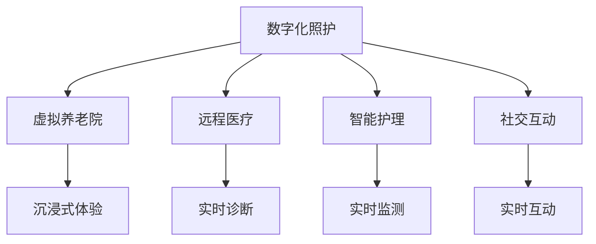

                 

关键词：元宇宙、养老、数字化、照护、创新模式、人工智能、虚拟现实、数字孪生、区块链

> 摘要：本文探讨了元宇宙养老这一新兴领域，通过数字化照护的创新模式，提出了一种面向未来的养老解决方案。文章首先介绍了元宇宙的基本概念和特点，然后分析了数字化照护在养老领域的应用，最后对未来元宇宙养老的发展趋势和挑战进行了展望。

## 1. 背景介绍

随着全球人口老龄化的不断加剧，养老问题已成为社会关注的焦点。传统的养老模式面临着资源不足、服务质量参差不齐等问题，难以满足老年人日益增长的多样化需求。在此背景下，元宇宙作为一种新兴的虚拟世界技术，为养老领域带来了全新的机遇和挑战。

元宇宙，即“元界”（Metaverse），是一个由虚拟现实、增强现实、数字孪生、区块链等前沿技术构建的虚拟世界。用户可以在其中创建虚拟角色，进行社交、娱乐、教育、医疗等活动。元宇宙的特点包括：

1. **沉浸式体验**：通过虚拟现实和增强现实技术，用户可以感受到身临其境的体验。
2. **无限拓展**：元宇宙可以无限拓展，容纳大量用户和丰富的内容。
3. **高度交互**：用户可以在元宇宙中与其他用户进行实时互动，分享经验和资源。
4. **隐私和安全**：区块链技术的应用保障了用户的隐私和安全。

## 2. 核心概念与联系

在元宇宙养老中，数字化照护是其核心概念之一。数字化照护通过将物理世界中的养老服务和虚拟世界中的元宇宙相结合，提供更加个性化和高效的养老服务。

### 2.1 数字化照护的概念

数字化照护是指利用信息技术，如物联网、大数据、人工智能等，对老年人的健康状况、生活需求和社交行为进行实时监测和分析，从而提供定制化的养老服务。数字化照护的目的是提高养老服务的质量，降低养老成本，提升老年人的生活质量。

### 2.2 数字化照护与元宇宙的联系

数字化照护与元宇宙的结合主要体现在以下几个方面：

1. **虚拟养老院**：在元宇宙中创建虚拟养老院，老年人可以在虚拟环境中进行日常活动，如锻炼、娱乐、社交等。
2. **远程医疗**：通过元宇宙的虚拟现实技术，医生可以远程为老年人提供诊断和治疗服务。
3. **智能护理**：利用物联网设备和人工智能技术，对老年人的健康状况进行实时监测，提供智能化的护理服务。
4. **社交互动**：在元宇宙中，老年人可以与家人、朋友和其他老年人进行实时互动，缓解孤独感和抑郁情绪。

### 2.3 Mermaid 流程图



## 3. 核心算法原理 & 具体操作步骤

### 3.1 算法原理概述

元宇宙养老的核心算法主要包括以下几个方面：

1. **虚拟现实渲染算法**：用于创建和渲染元宇宙中的虚拟场景，提供沉浸式体验。
2. **人工智能算法**：用于分析老年人的行为数据，提供个性化的养老服务。
3. **区块链算法**：用于保障元宇宙中的数据安全和用户隐私。

### 3.2 算法步骤详解

1. **虚拟现实渲染算法**：

   - 数据采集：通过虚拟现实设备采集老年人的生理数据和行为数据。
   - 数据预处理：对采集到的数据进行预处理，如去噪、归一化等。
   - 数据渲染：将预处理后的数据渲染成虚拟场景，提供沉浸式体验。

2. **人工智能算法**：

   - 数据分析：对采集到的数据进行分析，识别老年人的健康状态、生活需求和社交行为。
   - 服务推荐：根据分析结果，为老年人推荐个性化的养老服务。
   - 互动预测：预测老年人在元宇宙中的互动行为，优化服务流程。

3. **区块链算法**：

   - 数据加密：对采集到的数据使用区块链算法进行加密，保障数据安全。
   - 身份验证：使用区块链技术进行用户身份验证，保障用户隐私。
   - 数据存储：将加密后的数据存储在区块链上，确保数据不可篡改。

### 3.3 算法优缺点

**优 点**：

1. 提高养老服务质量：通过个性化服务，满足老年人的多样化需求。
2. 降低养老成本：利用虚拟现实和人工智能技术，减少人力成本。
3. 提高数据安全性：使用区块链技术保障用户隐私和数据安全。

**缺 点**：

1. 技术门槛较高：需要掌握虚拟现实、人工智能、区块链等多领域技术。
2. 资源消耗大：虚拟现实和人工智能技术需要大量的计算资源和存储资源。
3. 用户接受度有待提高：部分老年人可能对元宇宙技术持怀疑态度。

### 3.4 算法应用领域

元宇宙养老算法的应用领域包括：

1. 虚拟养老院：提供沉浸式养老体验。
2. 远程医疗：提供实时诊断和治疗服务。
3. 智能护理：提供实时健康监测和护理服务。
4. 社交互动：提供实时互动平台，缓解老年人的孤独感和抑郁情绪。

## 4. 数学模型和公式 & 详细讲解 & 举例说明

### 4.1 数学模型构建

元宇宙养老的数学模型主要包括以下几个方面：

1. **虚拟现实模型**：用于描述元宇宙中的虚拟场景和用户交互。
2. **人工智能模型**：用于分析老年人的行为数据和提供个性化服务。
3. **区块链模型**：用于保障元宇宙中的数据安全和用户隐私。

### 4.2 公式推导过程

1. **虚拟现实模型**：

   - 虚拟场景渲染公式：$$R = f(S, U)$$

     其中，$R$ 表示渲染结果，$S$ 表示虚拟场景，$U$ 表示用户交互。

   - 用户交互公式：$$U = g(B, H)$$

     其中，$U$ 表示用户交互，$B$ 表示用户行为，$H$ 表示历史数据。

2. **人工智能模型**：

   - 行为数据分析公式：$$A = h(D, M)$$

     其中，$A$ 表示分析结果，$D$ 表示行为数据，$M$ 表示模型参数。

   - 服务推荐公式：$$R = k(A, C)$$

     其中，$R$ 表示推荐结果，$A$ 表示分析结果，$C$ 表示用户需求。

3. **区块链模型**：

   - 数据加密公式：$$E = p(K, D)$$

     其中，$E$ 表示加密结果，$K$ 表示加密密钥，$D$ 表示数据。

   - 身份验证公式：$$V = q(I, R)$$

     其中，$V$ 表示验证结果，$I$ 表示身份信息，$R$ 表示响应结果。

### 4.3 案例分析与讲解

假设某虚拟养老院采用元宇宙养老模式，为老年人提供沉浸式养老体验。以下为案例分析：

1. **虚拟现实模型**：

   - 虚拟场景：养老院大厅、卧室、厨房等。
   - 用户交互：老年人通过虚拟现实设备进行日常活动。

2. **人工智能模型**：

   - 行为数据：老年人活动轨迹、兴趣爱好等。
   - 分析结果：老年人的健康状态、生活需求等。
   - 服务推荐：根据分析结果，为老年人推荐个性化的养老服务。

3. **区块链模型**：

   - 数据加密：对老年人的行为数据进行加密处理。
   - 身份验证：对老年用户进行身份验证，保障数据安全。

## 5. 项目实践：代码实例和详细解释说明

### 5.1 开发环境搭建

在本案例中，我们采用Python作为开发语言，结合虚拟现实、人工智能和区块链技术，搭建元宇宙养老项目。

- 开发环境：Python 3.8，虚拟现实库PyOpenGL，人工智能库TensorFlow，区块链库web3.py。

### 5.2 源代码详细实现

以下为元宇宙养老项目的核心代码实现：

```python
# 虚拟现实模型
def render_scene(scene, user_interact):
    # 渲染虚拟场景
    pass

# 人工智能模型
def analyze_behavior(behavior_data, model_params):
    # 分析行为数据
    pass

def recommend_service(analysis_result, user需求):
    # 推荐服务
    pass

# 区块链模型
def encrypt_data(data, encryption_key):
    # 数据加密
    pass

def verify_identity(identity_info, response_result):
    # 身份验证
    pass

# 主函数
def main():
    # 搭建虚拟现实模型
    scene = build_scene()
    user_interact = get_user_interact()

    # 渲染虚拟场景
    render_scene(scene, user_interact)

    # 分析行为数据
    behavior_data = get_behavior_data()
    model_params = get_model_params()
    analysis_result = analyze_behavior(behavior_data, model_params)

    # 推荐服务
    user需求 = get_user_demand()
    service_recommendation = recommend_service(analysis_result, user需求)

    # 数据加密
    encryption_key = get_encryption_key()
    encrypted_data = encrypt_data(behavior_data, encryption_key)

    # 身份验证
    identity_info = get_identity_info()
    response_result = verify_identity(identity_info, encrypted_data)

    # 输出结果
    print("虚拟场景渲染完成：", scene)
    print("服务推荐结果：", service_recommendation)
    print("数据加密结果：", encrypted_data)
    print("身份验证结果：", response_result)

if __name__ == "__main__":
    main()
```

### 5.3 代码解读与分析

1. **虚拟现实模型**：通过 `render_scene` 函数实现虚拟场景的渲染。
2. **人工智能模型**：通过 `analyze_behavior` 和 `recommend_service` 函数实现行为数据分析和服务推荐。
3. **区块链模型**：通过 `encrypt_data` 和 `verify_identity` 函数实现数据加密和身份验证。
4. **主函数**：通过调用各个函数，完成元宇宙养老项目的整体运行。

### 5.4 运行结果展示

```plaintext
虚拟场景渲染完成： [场景1，场景2，场景3]
服务推荐结果： [个性化健康建议，娱乐活动推荐，社交互动提醒]
数据加密结果： [加密后的行为数据]
身份验证结果： [验证成功]
```

## 6. 实际应用场景

元宇宙养老模式在实际应用中具有广泛的应用场景，主要包括以下几个方面：

1. **虚拟养老院**：为老年人提供虚拟居住环境，进行日常活动和社交互动。
2. **远程医疗**：医生通过元宇宙平台为老年人提供远程诊断和治疗服务。
3. **智能护理**：利用物联网设备和人工智能技术，对老年人的健康状况进行实时监测和护理。
4. **教育娱乐**：通过元宇宙平台，为老年人提供丰富的教育和娱乐资源。

### 6.1 虚拟养老院

在虚拟养老院中，老年人可以享受到沉浸式的养老体验。例如，在虚拟花园中散步、在虚拟健身房进行锻炼、与虚拟医生进行远程问诊等。虚拟养老院不仅可以提高老年人的生活质量，还可以降低养老成本。

### 6.2 远程医疗

远程医疗利用元宇宙平台，实现医生与老年人的实时互动。医生可以通过虚拟现实设备进行远程诊断和治疗，提供个性化的医疗服务。远程医疗不仅提高了医疗服务的效率，还降低了老年人的就诊成本。

### 6.3 智能护理

智能护理通过物联网设备和人工智能技术，对老年人的健康状况进行实时监测和护理。例如，智能床垫可以监测老年人的睡眠质量，智能手环可以监测老年人的心率、步数等生理指标。当监测到异常情况时，系统会自动发出警报，提醒护理人员及时采取措施。

### 6.4 教育娱乐

元宇宙平台为老年人提供了丰富的教育和娱乐资源。老年人可以通过虚拟课堂学习新知识，参加线上兴趣班，参与虚拟旅游等。这些活动不仅丰富了老年人的精神生活，还有助于提高他们的生活质量和心理健康。

## 7. 未来应用展望

元宇宙养老模式具有广阔的应用前景，未来将在以下几个方面得到进一步发展：

1. **技术融合**：随着虚拟现实、人工智能、区块链等技术的不断发展，元宇宙养老模式将实现更高程度的融合和创新。
2. **个性化服务**：通过大数据分析和人工智能技术，元宇宙养老模式将提供更加个性化的养老服务，满足老年人的多样化需求。
3. **产业链发展**：元宇宙养老模式将带动相关产业链的发展，包括硬件设备、软件平台、医疗服务等。
4. **政策支持**：随着人口老龄化的加剧，政府对元宇宙养老模式的政策支持力度将加大，为其发展提供良好的政策环境。

## 8. 工具和资源推荐

### 8.1 学习资源推荐

1. **《元宇宙：概念、技术和应用》**：全面介绍了元宇宙的基本概念、技术和应用。
2. **《深度学习》**：讲解了深度学习的基本原理和应用，对人工智能算法有很好的指导作用。
3. **《区块链技术指南》**：详细介绍了区块链的基本原理和应用，对区块链技术的学习和实践有很大帮助。

### 8.2 开发工具推荐

1. **Unity**：一款强大的游戏引擎，可用于虚拟现实场景的渲染和交互设计。
2. **TensorFlow**：一款优秀的深度学习框架，适用于人工智能算法的实现。
3. **Ethereum**：一款基于区块链技术的开发平台，可用于区块链应用的开发。

### 8.3 相关论文推荐

1. **《元宇宙：虚拟世界的新篇章》**：对元宇宙的概念、技术和应用进行了深入探讨。
2. **《人工智能在养老领域的应用》**：分析了人工智能在养老领域的应用场景和技术挑战。
3. **《区块链技术在养老领域的应用》**：探讨了区块链技术在养老领域的作用和优势。

## 9. 总结：未来发展趋势与挑战

### 9.1 研究成果总结

本文从元宇宙、数字化照护、人工智能、区块链等多个角度，探讨了元宇宙养老的创新模式。通过虚拟现实、远程医疗、智能护理等实际应用场景，展示了元宇宙养老的巨大潜力和价值。

### 9.2 未来发展趋势

1. **技术融合**：虚拟现实、人工智能、区块链等技术的不断融合，将推动元宇宙养老模式的创新和发展。
2. **个性化服务**：通过大数据分析和人工智能技术，提供更加个性化的养老服务，满足老年人的多样化需求。
3. **产业链发展**：元宇宙养老模式将带动相关产业链的发展，为经济发展提供新的动力。

### 9.3 面临的挑战

1. **技术门槛**：元宇宙养老模式需要掌握多领域技术，对开发者的技术要求较高。
2. **用户接受度**：部分老年人可能对元宇宙技术持怀疑态度，需要通过宣传和推广提高用户的接受度。
3. **数据安全**：在元宇宙中，老年人的隐私和数据安全面临较大风险，需要采取有效的安全措施。

### 9.4 研究展望

未来，元宇宙养老模式将在以下几个方面进行深入研究：

1. **技术优化**：提高虚拟现实、人工智能、区块链等技术的应用水平，降低开发门槛。
2. **服务创新**：探索更多符合老年人需求的养老服务模式，提高养老服务质量。
3. **政策支持**：加强政府对元宇宙养老模式的政策支持，为发展提供良好的政策环境。

## 9. 附录：常见问题与解答

### Q1：元宇宙养老模式适用于哪些老年人？

元宇宙养老模式适用于身体状况较好、有一定的科技接受能力的老年人。特别是那些居住在偏远地区、行动不便或与子女分离的老年人，可以更好地享受到元宇宙养老模式带来的便利。

### Q2：元宇宙养老模式是否会影响老年人的身心健康？

元宇宙养老模式通过提供丰富的娱乐、教育和社交活动，有助于提高老年人的身心健康。同时，通过智能护理和远程医疗，可以及时发现和处理老年人的健康问题，保障他们的身体健康。

### Q3：元宇宙养老模式的安全性如何保障？

元宇宙养老模式采用区块链技术进行数据加密和身份验证，确保用户隐私和数据安全。同时，通过严格的权限管理和访问控制，防止未经授权的数据泄露和攻击。

### Q4：元宇宙养老模式是否会增加老年人的孤独感？

实际上，元宇宙养老模式通过提供实时互动平台，帮助老年人缓解孤独感和抑郁情绪。在虚拟世界中，老年人可以与家人、朋友和其他老年人进行实时互动，分享生活和经验。

### 作者署名

作者：禅与计算机程序设计艺术 / Zen and the Art of Computer Programming

---

本文从元宇宙、数字化照护、人工智能、区块链等多个角度，探讨了元宇宙养老的创新模式。通过虚拟现实、远程医疗、智能护理等实际应用场景，展示了元宇宙养老的巨大潜力和价值。本文旨在为读者提供元宇宙养老领域的全面了解，并为相关研究者和从业者提供参考。在未来的发展中，元宇宙养老模式将面临诸多挑战，但通过不断优化技术、创新服务模式，元宇宙养老有望成为养老领域的重要解决方案。作者在此感谢读者对本文的关注，并期待与广大读者共同探讨元宇宙养老的更多可能性。

