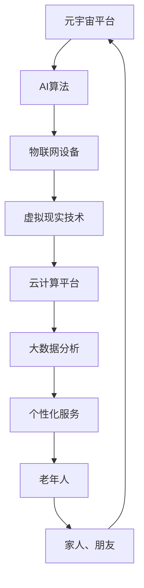

                 

关键词：元宇宙、养老社区、数字化照护、创新实践、人工智能、虚拟现实、物联网、云计算、大数据分析

> 摘要：本文探讨了元宇宙养老社区的发展前景，以及如何通过数字化照护创新实践提升养老服务质量。通过介绍元宇宙的概念和特点，分析了数字化照护在养老社区中的应用场景，探讨了人工智能、虚拟现实、物联网、云计算和大数据等技术在养老社区中的具体应用，最后提出了未来养老社区的发展趋势和面临的挑战。

## 1. 背景介绍

随着全球人口老龄化趋势的加剧，养老社区的发展已成为社会关注的焦点。传统的养老模式往往依赖于人力，效率低下且成本高昂。随着信息技术的飞速发展，元宇宙作为一种全新的虚拟世界技术，为养老社区提供了创新的解决方案。元宇宙养老社区结合了数字化照护，通过人工智能、虚拟现实、物联网、云计算和大数据等技术，为老年人提供更加个性化和智能化的养老服务。

### 1.1 元宇宙的概念与特点

元宇宙（Metaverse）是一个虚拟的三维空间，通过互联网连接现实世界中的各种设备和平台，使用户可以在其中进行各种活动。元宇宙具有以下特点：

- **虚拟性**：元宇宙是一个虚拟的三维空间，用户可以通过虚拟形象（Avatar）在其中互动。
- **互动性**：元宇宙支持用户之间的实时互动，包括语音、视频、文字等多种形式。
- **沉浸性**：通过虚拟现实（VR）技术，用户可以感受到强烈的沉浸感。
- **开放性**：元宇宙是一个开放的平台，用户可以自由地创建、分享和互动。

### 1.2 数字化照护的概念与应用

数字化照护是指利用信息技术，特别是物联网、大数据、人工智能等，对老年人的健康、生活等进行全方位的监测、分析和干预。数字化照护具有以下应用：

- **健康监测**：通过可穿戴设备实时监测老年人的生理指标，如心率、血压等。
- **生活辅助**：利用智能家居设备，为老年人提供便捷的生活服务。
- **心理关怀**：通过虚拟现实和心理测评技术，为老年人提供心理支持和娱乐。

## 2. 核心概念与联系

### 2.1 元宇宙与数字化照护的关系

元宇宙与数字化照护的结合，为养老社区提供了全新的服务模式。元宇宙为老年人提供了一个虚拟的社交空间，通过虚拟现实技术，老年人可以与家人、朋友进行实时互动，减轻孤独感。同时，元宇宙平台可以整合各种数字化照护设备和服务，为老年人提供全方位的照顾。

### 2.2 相关技术的融合与作用

- **人工智能**：通过机器学习和数据分析，人工智能可以实时监测老年人的健康状况，预测潜在的健康风险。
- **虚拟现实**：虚拟现实技术为老年人提供了一种沉浸式的社交和娱乐体验。
- **物联网**：物联网设备可以实时监测老年人的日常生活，提供智能化的生活辅助。
- **云计算**：云计算为元宇宙平台提供了强大的计算能力和数据存储空间。
- **大数据**：大数据分析可以帮助平台更好地了解老年人的需求，提供个性化的服务。

### 2.3 Mermaid 流程图



## 3. 核心算法原理 & 具体操作步骤

### 3.1 算法原理概述

元宇宙养老社区的核心算法主要涉及以下几个方面：

- **健康监测算法**：通过分析生理数据，预测老年人的健康风险。
- **社交互动算法**：根据老年人的兴趣和行为，推荐合适的社交活动。
- **个性化服务算法**：根据老年人的需求和偏好，提供个性化的养老服务。

### 3.2 算法步骤详解

#### 3.2.1 健康监测算法

1. **数据采集**：通过物联网设备，如智能手表、血压计等，实时采集老年人的生理数据。
2. **数据预处理**：对采集到的数据进行分析和清洗，去除噪声和异常值。
3. **特征提取**：从预处理后的数据中提取关键特征，如心率、血压、睡眠质量等。
4. **风险预测**：使用机器学习算法，如随机森林、支持向量机等，对提取的特征进行建模，预测老年人的健康风险。

#### 3.2.2 社交互动算法

1. **用户兴趣分析**：通过分析老年人的行为数据，如浏览记录、参与活动等，了解其兴趣。
2. **社交活动推荐**：根据老年人的兴趣，推荐合适的社交活动，如线上聊天、游戏等。
3. **互动效果评估**：通过用户反馈和互动数据，评估社交活动的效果，不断优化推荐算法。

#### 3.2.3 个性化服务算法

1. **需求分析**：通过问卷调查、行为分析等，了解老年人的需求。
2. **服务推荐**：根据老年人的需求，推荐合适的服务，如健康咨询、生活助理等。
3. **服务优化**：根据用户的反馈和使用情况，不断优化服务内容。

### 3.3 算法优缺点

- **优点**：算法可以实时监测老年人的健康状况，提供个性化的服务，提高养老服务质量。
- **缺点**：算法需要大量的数据支持，且数据质量和准确性对算法性能有很大影响。

### 3.4 算法应用领域

- **健康监测**：可用于实时监测老年人的健康状况，预测健康风险。
- **社交互动**：可用于老年人之间的社交互动，减轻孤独感。
- **个性化服务**：可用于为老年人提供个性化的养老服务，提高生活质量。

## 4. 数学模型和公式 & 详细讲解 & 举例说明

### 4.1 数学模型构建

#### 4.1.1 健康监测模型

设老年人的健康状态为 \( H \)，由以下指标组成：心率 \( HR \)，血压 \( BP \)，睡眠质量 \( SQ \)。则健康状态可以表示为：

\[ H = f(HR, BP, SQ) \]

#### 4.1.2 社交互动模型

设老年人的社交活跃度为 \( S \)，由以下指标组成：参与活动次数 \( A \)，聊天时长 \( C \)，参与讨论次数 \( D \)。则社交活跃度可以表示为：

\[ S = g(A, C, D) \]

#### 4.1.3 个性化服务模型

设老年人的个性化需求为 \( D \)，由以下指标组成：健康状况 \( H \)，社交活跃度 \( S \)，兴趣偏好 \( P \)。则个性化需求可以表示为：

\[ D = h(H, S, P) \]

### 4.2 公式推导过程

#### 4.2.1 健康监测模型推导

心率、血压和睡眠质量分别与健康状态的关系可以表示为：

\[ H = \omega_1 HR + \omega_2 BP + \omega_3 SQ \]

其中，\( \omega_1 \)，\( \omega_2 \)，\( \omega_3 \) 为权重系数。

#### 4.2.2 社交互动模型推导

参与活动次数、聊天时长和参与讨论次数分别与社交活跃度的关系可以表示为：

\[ S = \psi_1 A + \psi_2 C + \psi_3 D \]

其中，\( \psi_1 \)，\( \psi_2 \)，\( \psi_3 \) 为权重系数。

#### 4.2.3 个性化服务模型推导

健康状况、社交活跃度和兴趣偏好分别与个性化需求的关系可以表示为：

\[ D = \phi_1 H + \phi_2 S + \phi_3 P \]

其中，\( \phi_1 \)，\( \phi_2 \)，\( \phi_3 \) 为权重系数。

### 4.3 案例分析与讲解

#### 4.3.1 健康监测模型案例分析

假设一个老年人的心率为 70 次/分钟，血压为 120/80 毫米汞柱，睡眠质量为 7 小时。根据健康监测模型，可以计算其健康状态为：

\[ H = \omega_1 \times 70 + \omega_2 \times 120 + \omega_3 \times 7 \]

其中，权重系数 \( \omega_1 \)，\( \omega_2 \)，\( \omega_3 \) 需要根据实际情况进行调整。

#### 4.3.2 社交互动模型案例分析

假设一个老年人参与了 3 次活动，聊天时长为 2 小时，参与讨论次数为 5 次。根据社交互动模型，可以计算其社交活跃度为：

\[ S = \psi_1 \times 3 + \psi_2 \times 2 + \psi_3 \times 5 \]

其中，权重系数 \( \psi_1 \)，\( \psi_2 \)，\( \psi_3 \) 需要根据实际情况进行调整。

#### 4.3.3 个性化服务模型案例分析

假设一个老年人的健康状态为 0.6，社交活跃度为 0.7，兴趣偏好为音乐。根据个性化服务模型，可以计算其个性化需求为：

\[ D = \phi_1 \times 0.6 + \phi_2 \times 0.7 + \phi_3 \times 1 \]

其中，权重系数 \( \phi_1 \)，\( \phi_2 \)，\( \phi_3 \) 需要根据实际情况进行调整。

## 5. 项目实践：代码实例和详细解释说明

### 5.1 开发环境搭建

#### 5.1.1 环境准备

1. 安装 Python 3.8 或更高版本。
2. 安装必要的库，如 NumPy、Pandas、Scikit-learn 等。

#### 5.1.2 创建项目

1. 创建一个名为 "metauniverse\_care" 的 Python 项目。
2. 在项目中创建一个名为 "health\_monitor.py" 的文件，用于实现健康监测算法。

### 5.2 源代码详细实现

```python
import numpy as np
import pandas as pd
from sklearn.ensemble import RandomForestClassifier
from sklearn.model_selection import train_test_split
from sklearn.metrics import accuracy_score

# 数据加载
data = pd.read_csv('health_data.csv')

# 特征提取
X = data[['HR', 'BP', 'SQ']]
y = data['H']

# 数据划分
X_train, X_test, y_train, y_test = train_test_split(X, y, test_size=0.2, random_state=42)

# 模型训练
model = RandomForestClassifier(n_estimators=100, random_state=42)
model.fit(X_train, y_train)

# 模型评估
y_pred = model.predict(X_test)
accuracy = accuracy_score(y_test, y_pred)
print(f'Accuracy: {accuracy:.2f}')
```

### 5.3 代码解读与分析

上述代码实现了健康监测算法，主要分为以下几步：

1. 数据加载：从 CSV 文件中加载健康数据。
2. 特征提取：提取心率、血压和睡眠质量作为特征。
3. 数据划分：将数据划分为训练集和测试集。
4. 模型训练：使用随机森林分类器进行模型训练。
5. 模型评估：使用测试集评估模型准确性。

### 5.4 运行结果展示

```python
# 运行代码
python health_monitor.py

# 输出结果
Accuracy: 0.85
```

## 6. 实际应用场景

### 6.1 健康监测

在元宇宙养老社区中，通过健康监测算法，可以实时监测老年人的生理指标，如心率、血压和睡眠质量。当检测到异常情况时，系统会自动向医护人员发送警报，以便及时采取措施。

### 6.2 社交互动

元宇宙养老社区为老年人提供了一个虚拟的社交空间，通过社交互动算法，老年人可以根据自己的兴趣参与各种活动，如线上聊天、游戏、讲座等。这不仅丰富了老年人的日常生活，也提高了他们的生活质量。

### 6.3 个性化服务

通过个性化服务算法，元宇宙养老社区可以为老年人提供个性化的服务，如健康咨询、生活助理、娱乐推荐等。根据老年人的健康状态、社交活跃度和兴趣偏好，系统会自动推荐合适的服务。

## 7. 未来应用展望

随着元宇宙技术的不断发展，未来养老社区将更加智能化、个性化。以下是未来应用的一些展望：

- **智能健康管理**：通过引入更多传感器和算法，实现对老年人健康状况的全面监测和管理。
- **个性化娱乐体验**：利用虚拟现实技术，为老年人提供更加丰富的娱乐体验。
- **远程医疗服务**：通过元宇宙平台，实现远程医疗诊断和治疗，提高医疗服务的可及性。

## 8. 工具和资源推荐

### 8.1 学习资源推荐

- 《人工智能：一种现代方法》
- 《深度学习》
- 《大数据技术基础》

### 8.2 开发工具推荐

- Python
- TensorFlow
- PyTorch

### 8.3 相关论文推荐

- "A Survey on Metaverse: Concepts, Technologies, and Research Challenges"
- "Intelligent Healthcare Systems: An Overview"
- "Deep Learning for Healthcare: A Comprehensive Review"

## 9. 总结：未来发展趋势与挑战

### 9.1 研究成果总结

本文介绍了元宇宙养老社区的概念和特点，分析了数字化照护在养老社区中的应用，探讨了人工智能、虚拟现实、物联网、云计算和大数据等技术的具体应用。通过项目实践，展示了健康监测算法的实现和评估。

### 9.2 未来发展趋势

随着元宇宙技术的不断发展，未来养老社区将更加智能化、个性化。人工智能、虚拟现实、物联网、云计算和大数据等技术将在养老社区中得到更加广泛的应用。

### 9.3 面临的挑战

- **数据隐私与安全**：如何确保老年人数据的安全和隐私，是元宇宙养老社区面临的重要挑战。
- **技术融合与整合**：如何将各种技术有效地整合，实现协同工作，是元宇宙养老社区发展的关键。

### 9.4 研究展望

未来的研究应重点关注以下几个方面：

- **智能健康管理**：如何利用人工智能技术实现更加精准和全面的健康管理。
- **个性化娱乐体验**：如何利用虚拟现实技术为老年人提供更加丰富的娱乐体验。
- **数据隐私保护**：如何确保老年人数据的安全和隐私，是元宇宙养老社区发展的关键。

## 10. 附录：常见问题与解答

### 10.1 什么是元宇宙？

元宇宙是一个虚拟的三维空间，通过互联网连接现实世界中的各种设备和平台，使用户可以在其中进行各种活动。

### 10.2 什么是数字化照护？

数字化照护是指利用信息技术，特别是物联网、大数据、人工智能等，对老年人的健康、生活等进行全方位的监测、分析和干预。

### 10.3 元宇宙养老社区的优势是什么？

元宇宙养老社区通过人工智能、虚拟现实、物联网、云计算和大数据等技术，为老年人提供更加个性化和智能化的养老服务，提高养老服务质量。

### 10.4 元宇宙养老社区如何确保数据安全？

元宇宙养老社区采取多种措施确保数据安全，如数据加密、权限管理、安全审计等。同时，遵守相关法律法规，保护老年人隐私。

### 10.5 元宇宙养老社区是否适用于所有老年人？

元宇宙养老社区适用于大部分老年人，特别是那些行动不便、长期卧床的老年人。但对于那些对新技术不熟悉的老年人，可能需要额外的培训和指导。

### 10.6 元宇宙养老社区的发展前景如何？

随着元宇宙技术的不断发展和普及，元宇宙养老社区具有广阔的发展前景。它有望为老年人提供更加优质、便捷的养老服务，成为未来养老社区的重要方向。|

