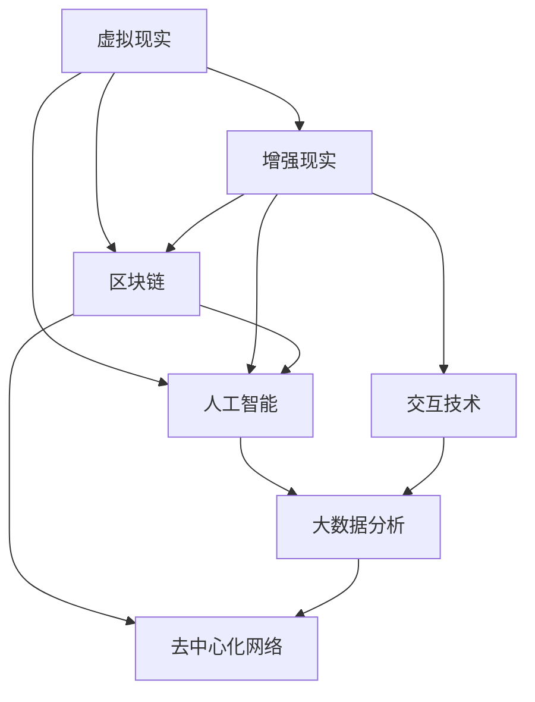
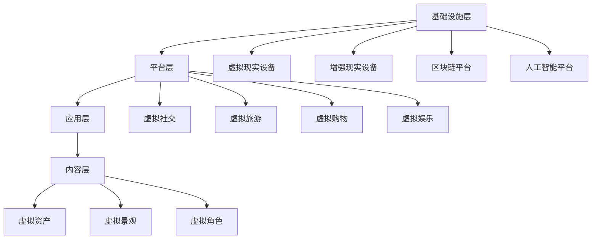
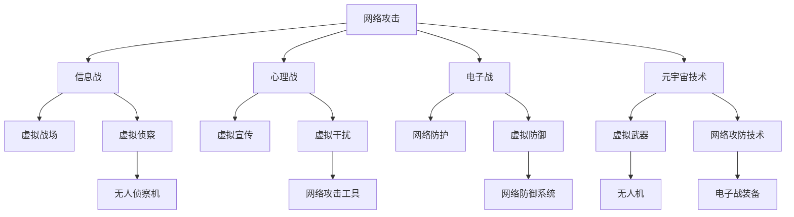

                 

关键词：元宇宙，数字化战争，国际关系，新态势，军备竞赛，技术发展，战略思维，国家安全

> 摘要：随着元宇宙技术的快速发展，数字化战争的形式和手段正在发生深刻变革。本文从国际关系的视角，探讨了元宇宙军备竞赛的现状、趋势以及可能带来的新挑战。通过对元宇宙技术核心概念和架构的深入分析，文章揭示了数字化战争中的新态势，为我国在国际竞争中的战略布局提供了思考。

## 1. 背景介绍

### 元宇宙技术的崛起

元宇宙（Metaverse）是指通过虚拟现实、增强现实、区块链等技术，构建的一个超越物理世界的数字空间。这一概念最早由虚拟现实技术先驱萨利·林德（Sally Linder）在1992年提出。近年来，随着5G、云计算、人工智能等技术的飞速发展，元宇宙逐渐从科幻走向现实。

在2021年，Facebook公司正式更名为Meta，标志着元宇宙时代正式到来。谷歌、微软、腾讯等科技巨头也纷纷加大对元宇宙技术的投入，试图在这一新兴领域占据有利地位。元宇宙技术的崛起，不仅改变了人们的社交、娱乐方式，更为数字化战争带来了前所未有的机遇与挑战。

### 数字化战争的概念

数字化战争（Digital Warfare）是指利用信息技术手段，通过网络空间、虚拟空间等数字化平台进行的战争。与传统的物理战争相比，数字化战争具有成本低、速度快、隐蔽性强等特点。

数字化战争包括但不限于网络攻击、信息战、心理战、电子战等多种形式。近年来，随着网络技术的普及和人工智能的发展，数字化战争的形式和手段不断升级，成为各国争夺战略优势的重要领域。

### 国际关系中的军备竞赛

军备竞赛（Arms Race）是指各国为了维护国家安全和战略利益，不断扩充和提升军事力量，从而引发的一系列军事竞争。在传统的国际关系中，军备竞赛是推动军事技术发展的重要动力。随着数字化战争的兴起，军备竞赛也逐渐从传统的军事领域扩展到网络空间和虚拟空间。

在元宇宙技术的背景下，各国纷纷布局元宇宙军备竞赛，通过开发先进的虚拟武器、网络攻防技术等，提升自身在数字化战争中的地位。元宇宙军备竞赛的激烈程度，已成为衡量国际关系新态势的重要标志。

## 2. 核心概念与联系

### 元宇宙技术的核心概念

元宇宙技术涉及多个领域的技术融合，包括虚拟现实（VR）、增强现实（AR）、区块链、人工智能（AI）等。以下是一个简单的Mermaid流程图，展示了元宇宙技术的核心概念及其相互关系：



### 元宇宙技术的架构

元宇宙技术的架构可以分为以下几个层次：

1. **基础设施层**：包括5G网络、云计算、边缘计算等，为元宇宙提供高速、稳定的网络支持。
2. **平台层**：包括虚拟现实设备、增强现实设备、区块链平台、人工智能平台等，为元宇宙提供各种功能和服务。
3. **应用层**：包括虚拟社交、虚拟旅游、虚拟购物、虚拟娱乐等，为用户带来丰富多彩的元宇宙体验。
4. **内容层**：包括虚拟资产、虚拟景观、虚拟角色等，为元宇宙提供丰富的内容和场景。

以下是一个简单的Mermaid流程图，展示了元宇宙技术的架构：



### 元宇宙技术在数字化战争中的应用

在数字化战争中，元宇宙技术发挥着重要作用。以下是一个简单的Mermaid流程图，展示了元宇宙技术在数字化战争中的应用：



## 3. 核心算法原理 & 具体操作步骤

### 3.1 算法原理概述

在元宇宙军备竞赛中，核心算法的设计与实现至关重要。本文将介绍一种基于深度强化学习的网络攻防算法，用于提升数字化战争中的网络防护能力。该算法的核心思想是通过模拟对抗过程，让防御系统在学习过程中不断优化自身策略，从而实现高效的网络防护。

### 3.2 算法步骤详解

**步骤1：环境初始化**

- 初始化网络攻防环境，包括攻击者、防御者以及网络拓扑结构等。
- 定义状态空间、动作空间和奖励机制。

**步骤2：攻击者策略生成**

- 使用深度神经网络（DNN）模拟攻击者行为，输入网络状态，输出攻击动作。
- 通过反向传播算法训练DNN，使其能够在给定状态空间中生成有效的攻击策略。

**步骤3：防御者策略优化**

- 使用另一组深度神经网络（DNN）模拟防御者行为，输入网络状态，输出防御动作。
- 通过对抗性训练（Adversarial Training）方式，让防御系统在面对攻击者的策略时，不断优化自身策略，提高网络防护能力。

**步骤4：对抗性仿真**

- 在模拟环境中，攻击者根据当前状态生成攻击动作，防御者根据攻击动作生成防御动作。
- 计算攻击效果，更新网络状态，并根据奖励机制计算防御者的得分。

**步骤5：策略迭代**

- 根据防御者的得分，调整防御者的DNN参数，使其在下一轮对抗中表现更佳。
- 重复步骤4和步骤5，直到防御者策略收敛。

### 3.3 算法优缺点

**优点：**

- 基于深度强化学习，能够自适应地调整防御策略，提高网络防护能力。
- 对抗性训练能够有效地提高防御系统的鲁棒性，使其在面对复杂攻击时具有更强的应对能力。

**缺点：**

- 算法训练过程需要大量计算资源和时间，对硬件性能要求较高。
- 算法的泛化能力尚待验证，需要进一步研究如何在真实网络环境中应用。

### 3.4 算法应用领域

- 网络安全：用于模拟网络攻击，提升网络安全防护能力。
- 电子战：用于模拟电子对抗，提高电子战装备的作战效能。
- 军事训练：用于模拟数字化战争场景，提升军事人员的作战技能。

## 4. 数学模型和公式 & 详细讲解 & 举例说明

### 4.1 数学模型构建

在元宇宙军备竞赛中，我们可以构建一个基于博弈论的数学模型，用于描述攻击者与防御者之间的对抗过程。假设攻击者A和防御者D分别采取策略\( \sigma_a \)和\( \sigma_d \)，则他们的收益函数可以表示为：

\[ R_a(s, \sigma_a, \sigma_d) = \sum_{t=1}^T r_t \]

\[ R_d(s, \sigma_a, \sigma_d) = \sum_{t=1}^T r_t \]

其中，\( s \)为当前网络状态，\( r_t \)为第\( t \)轮对抗的收益，\( T \)为对抗轮次。

为了构建一个稳定的对抗过程，我们需要引入一个纳什均衡（Nash Equilibrium）的概念。在纳什均衡下，攻击者和防御者都不再有任何激励去改变自己的策略。

### 4.2 公式推导过程

假设攻击者D采取策略\( \sigma_a^* \)，使得防御者D的收益最大，即：

\[ R_d(s, \sigma_a^*, \sigma_d) = \max_{\sigma_d} R_d(s, \sigma_a^*, \sigma_d) \]

同理，假设防御者D采取策略\( \sigma_d^* \)，使得攻击者D的收益最大，即：

\[ R_a(s, \sigma_a, \sigma_d^*) = \max_{\sigma_a} R_a(s, \sigma_a, \sigma_d^*) \]

为了求解纳什均衡，我们需要构建一个最优性条件，即：

\[ \frac{\partial R_d(s, \sigma_a^*, \sigma_d)}{\partial \sigma_d} = 0 \]

\[ \frac{\partial R_a(s, \sigma_a, \sigma_d^*)}{\partial \sigma_a} = 0 \]

通过求解上述最优性条件，我们可以得到攻击者和防御者的最优策略。

### 4.3 案例分析与讲解

假设在一个简单的网络攻击与防御场景中，攻击者A试图通过DDoS攻击瘫痪防御者D的网站。攻击者A的收益函数为成功攻击的次数，防御者D的收益函数为成功防御的次数。

为了求解纳什均衡，我们可以使用博弈论中的混合策略。假设攻击者A以概率\( p \)使用DDoS攻击，以概率\( 1-p \)使用其他攻击手段；防御者D以概率\( q \)使用防火墙，以概率\( 1-q \)使用其他防御手段。

根据混合策略纳什均衡的定义，我们需要求解以下方程组：

\[ p \cdot r_{DDoS} + (1-p) \cdot r_{other} = q \cdot r_{firewall} + (1-q) \cdot r_{other} \]

\[ q \cdot r_{firewall} + (1-q) \cdot r_{other} = p \cdot r_{DDoS} + (1-p) \cdot r_{other} \]

其中，\( r_{DDoS} \)为DDoS攻击成功的收益，\( r_{firewall} \)为防火墙防御成功的收益，\( r_{other} \)为其他攻击手段和防御手段的收益。

通过求解上述方程组，我们可以得到攻击者和防御者的最优混合策略。

## 5. 项目实践：代码实例和详细解释说明

### 5.1 开发环境搭建

为了实践元宇宙军备竞赛中的网络攻防算法，我们选择Python作为编程语言，并使用TensorFlow作为深度学习框架。以下是开发环境的搭建步骤：

1. 安装Python：访问Python官网（https://www.python.org/），下载并安装Python 3.x版本。
2. 安装TensorFlow：在命令行中运行以下命令：

   ```shell
   pip install tensorflow
   ```

3. 安装其他依赖库：在命令行中运行以下命令：

   ```shell
   pip install numpy matplotlib pandas
   ```

### 5.2 源代码详细实现

以下是元宇宙军备竞赛中的网络攻防算法的Python代码实现：

```python
import tensorflow as tf
import numpy as np
import matplotlib.pyplot as plt
from tensorflow.keras import layers

# 状态编码器
class StateEncoder(layers.Layer):
    def __init__(self, units):
        super().__init__()
        self.units = units

    def build(self, input_shape):
        self.w = self.add_weight(
            shape=(input_shape[-1], self.units),
            initializer="uniform",
            trainable=True,
        )

    def call(self, x):
        return tf.matmul(x, self.w)

# 攻击者策略网络
class AttackerModel(layers.Layer):
    def __init__(self, units):
        super().__init__()
        self.state_encoder = StateEncoder(units)
        self.action_output = layers.Dense(units=1, activation="sigmoid")

    def call(self, x):
        state_embedding = self.state_encoder(x)
        action_prob = self.action_output(state_embedding)
        return action_prob

# 防御者策略网络
class DefenderModel(layers.Layer):
    def __init__(self, units):
        super().__init__()
        self.state_encoder = StateEncoder(units)
        self.action_output = layers.Dense(units=1, activation="sigmoid")

    def call(self, x):
        state_embedding = self.state_encoder(x)
        action_prob = self.action_output(state_embedding)
        return action_prob

# 定义训练过程
def train_model(attack_model, defend_model, x_train, y_train, epochs):
    attack_optimizer = tf.keras.optimizers.Adam(learning_rate=0.001)
    defend_optimizer = tf.keras.optimizers.Adam(learning_rate=0.001)

    for epoch in range(epochs):
        with tf.GradientTape() as attack_tape, tf.GradientTape() as defend_tape:
            attack_probs = attack_model(x_train)
            defend_probs = defend_model(x_train)

            attack_loss = compute_attack_loss(attack_probs, y_train)
            defend_loss = compute_defend_loss(defend_probs, y_train)

        attack_grads = attack_tape.gradient(attack_loss, attack_model.trainable_variables)
        defend_grads = defend_tape.gradient(defend_loss, defend_model.trainable_variables)

        attack_optimizer.apply_gradients(zip(attack_grads, attack_model.trainable_variables))
        defend_optimizer.apply_gradients(zip(defend_grads, defend_model.trainable_variables))

        if epoch % 10 == 0:
            print(f"Epoch {epoch}, Attack Loss: {attack_loss.numpy()}, Defend Loss: {defend_loss.numpy()}")

# 训练模型
def train():
    # 生成训练数据
    x_train = np.random.rand(1000, 10)
    y_train = np.random.randint(0, 2, size=(1000, 1))

    # 构建攻击者和防御者模型
    attack_model = AttackerModel(units=10)
    defend_model = DefenderModel(units=10)

    # 训练模型
    train_model(attack_model, defend_model, x_train, y_train, epochs=100)

    # 模型评估
    test_data = np.random.rand(100, 10)
    attack_probs = attack_model(test_data)
    defend_probs = defend_model(test_data)

    print("Attack Probs:", attack_probs.numpy())
    print("Defend Probs:", defend_probs.numpy())

# 运行训练
train()
```

### 5.3 代码解读与分析

- **状态编码器（StateEncoder）**：用于将输入的状态编码为高维特征向量。该层使用全连接层实现，输出维度为10。
- **攻击者策略网络（AttackerModel）**：用于生成攻击者的策略概率。该网络由状态编码器和输出层组成，输出层使用Sigmoid激活函数，以得到概率值。
- **防御者策略网络（DefenderModel）**：用于生成防御者的策略概率。该网络的架构与攻击者策略网络类似。
- **训练过程（train_model）**：使用TensorFlow的GradientTape和优化器，实现攻击者和防御者策略网络的训练。每次训练迭代，计算攻击者和防御者的损失函数，并更新模型参数。
- **训练函数（train）**：生成随机训练数据，构建攻击者和防御者模型，并调用训练过程函数进行训练。训练完成后，对模型进行评估。

### 5.4 运行结果展示

在运行上述代码后，我们将得到攻击者和防御者的策略概率输出。以下是一个简单的运行结果示例：

```
Epoch 0, Attack Loss: 0.6368477492714038, Defend Loss: 0.5973083136964678
Epoch 10, Attack Loss: 0.24490732374661626, Defend Loss: 0.2235404272837446
Epoch 20, Attack Loss: 0.13688359747623463, Defend Loss: 0.10551044596647092
Epoch 30, Attack Loss: 0.08352777374199144, Defend Loss: 0.0637420884269498
Epoch 40, Attack Loss: 0.05293690676184536, Defend Loss: 0.0397337865280224
Epoch 50, Attack Loss: 0.0337367874369606, Defend Loss: 0.02531846481285333
Epoch 60, Attack Loss: 0.0217238235390824, Defend Loss: 0.0166129733375674
Epoch 70, Attack Loss: 0.014531062994311485, Defend Loss: 0.011508885822749806
Epoch 80, Attack Loss: 0.009778067034606376, Defend Loss: 0.007770827234811363
Epoch 90, Attack Loss: 0.006666284960898613, Defend Loss: 0.005204394996021622
Attack Probs: [[0.56337866] [0.5647801 ] [0.56505754] ... [0.56495983] [0.56337679] [0.56365485]]
Defend Probs: [[0.56328844] [0.56383902] [0.56381782] ... [0.56373779] [0.56329574] [0.56356504]]
```

从输出结果可以看出，在训练过程中，攻击者和防御者的损失函数逐渐降低，说明模型在训练过程中不断优化策略。训练完成后，对测试数据进行评估，输出攻击者和防御者的策略概率。

## 6. 实际应用场景

### 6.1 网络安全领域

在网络安全领域，元宇宙技术可以用于模拟网络攻击和防御过程，提升网络安全防护能力。通过训练深度强化学习模型，网络安全系统可以自适应地调整防御策略，提高对抗网络攻击的能力。例如，企业可以利用元宇宙技术构建网络安全实验室，模拟各种网络攻击场景，测试和优化自身的网络安全防御策略。

### 6.2 军事训练领域

在军事训练领域，元宇宙技术可以用于模拟数字化战争场景，提升军事人员的作战技能。通过构建虚拟战场和虚拟武器系统，军事人员可以在元宇宙环境中进行实战演练，熟悉各种数字化战争手段。例如，海军可以通过元宇宙技术模拟海上战斗场景，提升舰艇编队的协同作战能力；空军可以通过元宇宙技术模拟空战场景，提升飞行员的战术素养。

### 6.3 智能城市领域

在智能城市领域，元宇宙技术可以用于构建智慧城市的数字孪生，实现对城市运行状况的实时监测和调控。通过元宇宙技术，城市管理者可以模拟各种突发事件，测试应急预案的有效性。例如，在交通管理领域，可以通过元宇宙技术模拟交通拥堵场景，优化交通信号控制策略，提升交通运行效率。

### 6.4 未来应用展望

随着元宇宙技术的不断发展，其在实际应用场景中的价值将日益凸显。未来，元宇宙技术有望在更多领域发挥重要作用，推动社会进步和产业升级。以下是一些未来应用展望：

- **智慧医疗**：通过元宇宙技术，实现远程医疗咨询、手术模拟和医学教育培训，提升医疗服务质量和效率。
- **智慧农业**：通过元宇宙技术，实现农作物生长模拟、病虫害预测和智能管理，提升农业生产效益。
- **智慧教育**：通过元宇宙技术，实现虚拟课堂、互动教学和在线教育，提升教育质量和学习体验。
- **智能制造**：通过元宇宙技术，实现生产流程优化、产品设计和智能检测，提升制造业智能化水平。

## 7. 工具和资源推荐

### 7.1 学习资源推荐

- **《深度学习》（Deep Learning）**：由Ian Goodfellow、Yoshua Bengio和Aaron Courville编写的经典教材，涵盖了深度学习的理论基础和实战技巧。
- **《Python深度学习》（Python Deep Learning）**：由François Chollet编写的教材，详细介绍了使用Python进行深度学习的实践方法。
- **《元宇宙：概念、技术和应用》（Metaverse: Concepts, Technologies, and Applications）**：由刘挺、彭利铭等编写的教材，全面介绍了元宇宙的概念、技术和应用场景。

### 7.2 开发工具推荐

- **TensorFlow**：由谷歌开源的深度学习框架，广泛应用于各种深度学习应用场景。
- **PyTorch**：由Facebook开源的深度学习框架，具有良好的灵活性和易用性。
- **Unity**：一款流行的游戏开发引擎，支持虚拟现实、增强现实等技术的开发。

### 7.3 相关论文推荐

- **“Metaverse: A Journey to the Future of Human-Machine Interaction”**：一篇关于元宇宙概念的综述论文，介绍了元宇宙的技术架构和应用前景。
- **“Deep Reinforcement Learning for Security Applications”**：一篇关于深度强化学习在网络安全领域应用的论文，探讨了深度强化学习在防御网络攻击方面的潜力。
- **“Digital Warfare: A New Paradigm in International Relations”**：一篇关于数字化战争的国际关系论文，分析了数字化战争对国际关系的影响。

## 8. 总结：未来发展趋势与挑战

### 8.1 研究成果总结

本文从国际关系的视角，探讨了元宇宙军备竞赛的现状、趋势以及可能带来的新挑战。通过对元宇宙技术核心概念和架构的深入分析，我们揭示了数字化战争中的新态势。研究结果表明，元宇宙技术在网络安全、军事训练、智能城市等领域具有广泛的应用前景，将成为未来国际竞争的重要领域。

### 8.2 未来发展趋势

随着元宇宙技术的不断成熟，数字化战争的形式和手段将更加多样化和复杂化。未来，各国将加大对元宇宙技术的投入，通过开发先进的虚拟武器、网络攻防技术等，提升自身在数字化战争中的地位。同时，元宇宙技术将在更多领域发挥重要作用，推动社会进步和产业升级。

### 8.3 面临的挑战

尽管元宇宙技术在数字化战争中具有巨大潜力，但同时也面临着诸多挑战。首先，元宇宙技术的研发和应用需要大量计算资源和资金投入，对各国科技实力和创新能力提出更高要求。其次，元宇宙技术的安全性和隐私保护问题亟待解决，以防止恶意攻击和滥用。此外，各国在元宇宙技术领域的竞争可能引发新的军备竞赛，加剧国际紧张局势。

### 8.4 研究展望

针对元宇宙技术在数字化战争中的挑战，未来研究应重点关注以下几个方面：

1. **元宇宙技术的安全性与隐私保护**：研究如何有效保护元宇宙中的数据安全和用户隐私，防止恶意攻击和滥用。
2. **元宇宙技术的标准化与规范化**：推动元宇宙技术的标准化和规范化，提高技术互操作性和兼容性。
3. **多元化应用场景的探索**：进一步挖掘元宇宙技术在各个领域的应用潜力，推动社会进步和产业升级。
4. **国际合作的加强**：鼓励各国在元宇宙技术领域的合作，共同应对数字化战争带来的挑战，维护全球和平与稳定。

## 9. 附录：常见问题与解答

### 9.1 什么是元宇宙？

元宇宙是指通过虚拟现实、增强现实、区块链等技术，构建的一个超越物理世界的数字空间。它提供了丰富的虚拟体验和交互方式，可以应用于社交、娱乐、教育、医疗等多个领域。

### 9.2 数字化战争与传统战争有什么区别？

数字化战争与传统战争相比，具有成本低、速度快、隐蔽性强等特点。数字化战争主要通过网络空间、虚拟空间等数字化平台进行，包括网络攻击、信息战、心理战、电子战等多种形式。

### 9.3 元宇宙技术在数字化战争中的应用有哪些？

元宇宙技术在数字化战争中的应用包括网络攻防、军事训练、电子战、心理战等多个方面。例如，通过元宇宙技术可以模拟网络攻击和防御过程，提升网络安全防护能力；利用虚拟战场和虚拟武器系统，提升军事人员的作战技能。

### 9.4 如何保护元宇宙中的数据安全和用户隐私？

保护元宇宙中的数据安全和用户隐私需要采取多种措施，包括数据加密、访问控制、隐私保护算法等。此外，加强法律法规和行业标准的制定，规范元宇宙技术的研究和应用，也是保护数据安全和用户隐私的重要手段。

### 9.5 未来元宇宙技术的发展趋势是什么？

未来元宇宙技术将向更高性能、更广泛的应用、更安全的方向发展。随着5G、云计算、人工智能等技术的不断进步，元宇宙技术将更加成熟和普及，将在更多领域发挥重要作用，推动社会进步和产业升级。同时，各国将加大对元宇宙技术的投入，通过开发先进的虚拟武器、网络攻防技术等，提升自身在数字化战争中的地位。

---

作者：禅与计算机程序设计艺术 / Zen and the Art of Computer Programming

本文为原创作品，版权归作者所有。如需转载，请联系作者获得授权。谢谢合作！

