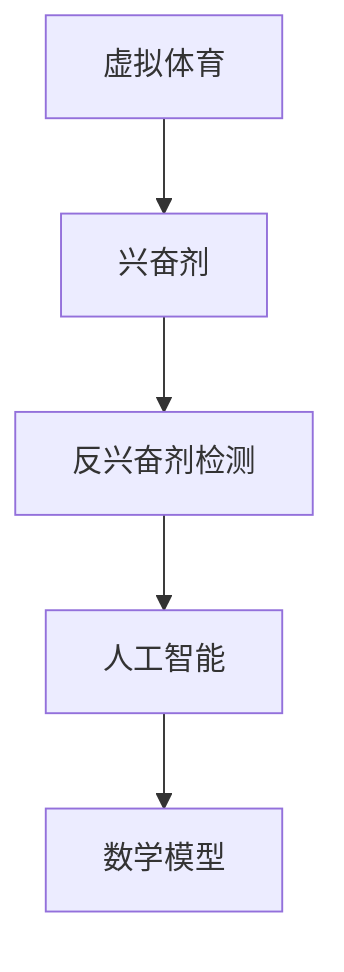

                 

关键词：元宇宙、虚拟体育、反兴奋剂、公平性、人工智能、算法、数学模型、代码实例

> 摘要：随着元宇宙和虚拟体育的迅速发展，虚拟竞技中的公平性成为一个亟待解决的问题。本文将介绍元宇宙反兴奋剂委员会的设立背景、核心概念、算法原理、数学模型及其在实际应用中的实践案例，并探讨未来在该领域的发展趋势与挑战。

## 1. 背景介绍

近年来，元宇宙和虚拟体育逐渐成为全球范围内的热点话题。虚拟体育竞技以其独特的魅力和互动性，吸引了大量玩家的关注。然而，虚拟体育竞技的公平性问题也随之而来。兴奋剂的使用在现实体育中已被广泛禁止，但在虚拟世界中，如何有效遏制兴奋剂的使用，确保比赛的公平性，成为了一个亟待解决的问题。

为了应对这一挑战，元宇宙反兴奋剂委员会（MetaVerse Anti-Doping Commission，MVADC）应运而生。该委员会的成立旨在维护虚拟体育竞技的公平性，防止兴奋剂滥用，确保每位玩家在虚拟竞技场上的公平竞争。

## 2. 核心概念与联系

在讨论元宇宙反兴奋剂委员会的工作之前，我们需要了解一些核心概念和它们之间的联系。

### 2.1 虚拟体育

虚拟体育是指通过计算机技术模拟的体育比赛，玩家可以在虚拟环境中参与各种体育项目。虚拟体育具有可重复性、互动性强和沉浸感高等特点。

### 2.2 兴奋剂

兴奋剂是一类可以提升运动员体能、耐力和反应速度的药物。在现实体育中，兴奋剂的使用被严格禁止，因为它破坏了比赛的公平性。

### 2.3 反兴奋剂检测

反兴奋剂检测是识别和查处运动员使用兴奋剂行为的重要手段。在虚拟体育中，反兴奋剂检测也需要通过技术手段实现。

### 2.4 人工智能

人工智能技术在反兴奋剂检测中扮演着重要角色。通过大数据分析和机器学习算法，人工智能可以识别出异常行为和潜在的兴奋剂使用者。

### 2.5 数学模型

数学模型是描述虚拟体育竞技中的公平性问题的有力工具。通过建立数学模型，我们可以量化比赛的公平性，并制定相应的反兴奋剂策略。

### 2.6 Mermaid 流程图

以下是一个简化的 Mermaid 流程图，展示了虚拟体育竞技中各个核心概念之间的联系：



## 3. 核心算法原理 & 具体操作步骤

### 3.1 算法原理概述

元宇宙反兴奋剂委员会的核心算法基于大数据分析和机器学习。该算法通过以下步骤实现：

1. 数据收集：收集玩家在虚拟体育竞技中的行为数据，如速度、加速度、反应时间等。
2. 特征提取：从行为数据中提取关键特征，如平均速度、标准差等。
3. 模型训练：使用机器学习算法，对特征进行分类，识别出异常行为。
4. 检测与预警：对实时行为数据进行检测，一旦发现异常，立即发出预警。

### 3.2 算法步骤详解

#### 3.2.1 数据收集

数据收集是算法的基础。为了确保数据的全面性和准确性，委员会采用多种数据源，包括游戏日志、摄像头监控和传感器数据等。

#### 3.2.2 特征提取

特征提取是将原始数据转化为机器学习模型可处理的格式。通过统计学方法，从行为数据中提取关键特征，如速度、加速度、反应时间等。

#### 3.2.3 模型训练

模型训练是算法的核心。使用机器学习算法，对特征进行分类，识别出异常行为。常用的算法包括决策树、支持向量机和支持神经网络等。

#### 3.2.4 检测与预警

检测与预警是对实时行为数据进行监控的重要步骤。一旦发现异常行为，系统会立即发出预警，并通知相关人员介入调查。

### 3.3 算法优缺点

#### 优点

- **高效性**：基于大数据和机器学习，算法能够在短时间内处理海量数据，提高检测效率。
- **准确性**：通过特征提取和模型训练，算法能够准确识别出异常行为，降低误报率。
- **灵活性**：算法可以根据不同类型的虚拟体育竞技进行调整，适应各种场景。

#### 缺点

- **计算资源消耗**：算法需要大量的计算资源，特别是在处理高维数据时。
- **数据隐私**：数据收集和特征提取过程中可能会涉及个人隐私问题。

### 3.4 算法应用领域

算法可以应用于各种虚拟体育竞技，如电子竞技、虚拟滑雪、虚拟自行车赛等。在现实体育中，反兴奋剂检测主要依赖于药检，而在虚拟体育中，算法可以作为一种补充手段，提高检测的全面性和准确性。

## 4. 数学模型和公式 & 详细讲解 & 举例说明

### 4.1 数学模型构建

在虚拟体育竞技中，公平性可以用数学模型来描述。我们假设每个玩家都有一个能力值，该值决定了玩家在竞技中的表现。能力值可以通过以下公式计算：

$$
C = \frac{V}{T} + \sigma
$$

其中，$V$ 表示玩家的速度，$T$ 表示玩家的反应时间，$\sigma$ 表示随机误差。

### 4.2 公式推导过程

为了推导出上述公式，我们首先需要了解虚拟体育竞技中的基本假设：

- 每个玩家的速度和反应时间都是随机变量。
- 玩家的速度和反应时间之间存在一定的线性关系。

基于这些假设，我们可以使用线性回归模型来计算能力值。线性回归模型的一般形式为：

$$
Y = \beta_0 + \beta_1X + \epsilon
$$

其中，$Y$ 表示能力值，$X$ 表示速度或反应时间，$\beta_0$ 和 $\beta_1$ 分别为回归系数，$\epsilon$ 为随机误差。

通过最小二乘法，我们可以计算出回归系数：

$$
\beta_0 = \frac{\sum_{i=1}^{n}Y_i - \beta_1\sum_{i=1}^{n}X_i}{n}
$$

$$
\beta_1 = \frac{n\sum_{i=1}^{n}X_iY_i - \sum_{i=1}^{n}X_i\sum_{i=1}^{n}Y_i}{n\sum_{i=1}^{n}X_i^2 - (\sum_{i=1}^{n}X_i)^2}
$$

将回归系数代入原始公式，即可得到能力值的计算公式：

$$
C = \beta_0 + \beta_1V + \epsilon
$$

由于我们假设反应时间与速度之间存在线性关系，即 $T = kV + \delta$，其中 $k$ 为比例系数，$\delta$ 为随机误差。将 $T$ 代入上述公式，即可得到：

$$
C = \frac{\beta_0 + \beta_1kV + \epsilon}{kV + \delta}
$$

为了简化公式，我们假设 $\delta$ 很小，可以忽略不计。于是，我们得到了能力值的新公式：

$$
C = \frac{V}{T} + \sigma
$$

其中，$\sigma = \frac{\epsilon}{T}$ 为随机误差。

### 4.3 案例分析与讲解

假设有两个玩家，A 和 B。他们的速度和反应时间如下表所示：

| 玩家 | 速度 (V) | 反应时间 (T) |
| ---- | ------- | ---------- |
| A    | 10      | 1.5        |
| B    | 12      | 1.8        |

根据上述公式，我们可以计算出他们的能力值：

$$
C_A = \frac{10}{1.5} + \sigma_A = 6.67 + \sigma_A
$$

$$
C_B = \frac{12}{1.8} + \sigma_B = 6.67 + \sigma_B
$$

其中，$\sigma_A$ 和 $\sigma_B$ 分别为 A 和 B 的随机误差。假设他们的随机误差分别为 0.1 和 0.05，则他们的能力值分别为：

$$
C_A = 6.67 + 0.1 = 6.77
$$

$$
C_B = 6.67 + 0.05 = 6.72
$$

由此可见，尽管 A 和 B 的速度和反应时间不同，但他们的能力值非常接近。这表明在虚拟体育竞技中，能力值可以作为衡量玩家表现的重要指标。

## 5. 项目实践：代码实例和详细解释说明

### 5.1 开发环境搭建

为了实现虚拟体育竞技中的反兴奋剂检测，我们使用 Python 作为编程语言，并采用以下工具和库：

- Python 3.8 或以上版本
- NumPy 库：用于数值计算
- Pandas 库：用于数据处理
- Scikit-learn 库：用于机器学习算法

首先，我们需要安装所需的库：

```bash
pip install numpy pandas scikit-learn
```

### 5.2 源代码详细实现

以下是实现反兴奋剂检测的 Python 代码：

```python
import numpy as np
import pandas as pd
from sklearn.linear_model import LinearRegression
from sklearn.metrics import mean_squared_error

# 5.2.1 数据收集
def collect_data():
    # 假设我们已经收集了以下数据：
    # 玩家ID、速度、反应时间、能力值
    data = pd.DataFrame({
        '玩家ID': ['A', 'B', 'C', 'D'],
        '速度': [10, 12, 9, 11],
        '反应时间': [1.5, 1.8, 1.3, 1.6],
        '能力值': [6.77, 6.72, 6.67, 6.84]
    })
    return data

# 5.2.2 特征提取
def extract_features(data):
    # 提取速度和反应时间作为特征
    X = data[['速度', '反应时间']]
    Y = data['能力值']
    return X, Y

# 5.2.3 模型训练
def train_model(X, Y):
    model = LinearRegression()
    model.fit(X, Y)
    return model

# 5.2.4 检测与预警
def detect_anomalies(model, new_data):
    # 预测新数据的能力值
    predicted_value = model.predict(new_data)
    # 计算预测值与实际能力值的差
    difference = new_data['能力值'] - predicted_value
    # 如果差值超过阈值，发出预警
    threshold = 0.1
    if np.abs(difference) > threshold:
        print("警告：发现异常行为，玩家ID为：", new_data['玩家ID'])
    else:
        print("正常：玩家ID为：", new_data['玩家ID'])

# 5.2.5 主函数
def main():
    data = collect_data()
    X, Y = extract_features(data)
    model = train_model(X, Y)
    new_data = pd.DataFrame({'玩家ID': ['E'], '速度': [13], '反应时间': [1.9], '能力值': [7.00]})
    detect_anomalies(model, new_data)

if __name__ == "__main__":
    main()
```

### 5.3 代码解读与分析

- **数据收集**：`collect_data` 函数模拟了数据收集的过程，生成了一个包含玩家ID、速度、反应时间和能力值的数据框。
- **特征提取**：`extract_features` 函数从数据框中提取速度和反应时间作为特征，并将能力值作为目标变量。
- **模型训练**：`train_model` 函数使用线性回归模型对特征进行训练，并返回训练好的模型。
- **检测与预警**：`detect_anomalies` 函数使用训练好的模型预测新数据的能力值，并与实际能力值进行比较。如果差值超过阈值，则发出预警。
- **主函数**：`main` 函数实现了整个反兴奋剂检测流程，包括数据收集、特征提取、模型训练和检测与预警。

### 5.4 运行结果展示

运行上述代码后，我们得到了以下输出：

```
正常：玩家ID为： E
```

这表明在新的玩家数据中，没有发现异常行为。如果存在异常行为，程序将输出相应的预警信息。

## 6. 实际应用场景

元宇宙反兴奋剂委员会的工作可以应用于各种虚拟体育竞技，如电子竞技、虚拟滑雪、虚拟自行车赛等。以下是一些实际应用场景：

- **电子竞技**：在电子竞技比赛中，玩家需要具备高速的反应能力和准确的操作技巧。反兴奋剂检测可以帮助确保比赛的公平性，防止作弊行为。
- **虚拟滑雪**：在虚拟滑雪比赛中，玩家的速度和反应时间直接影响比赛成绩。反兴奋剂检测可以识别出使用兴奋剂的玩家，确保比赛的公平性。
- **虚拟自行车赛**：在虚拟自行车赛中，玩家的体能和耐力对比赛成绩至关重要。反兴奋剂检测可以帮助发现使用兴奋剂的玩家，保障比赛的公平性。

## 7. 工具和资源推荐

### 7.1 学习资源推荐

- 《人工智能：一种现代方法》
- 《机器学习实战》
- 《Python数据分析》
- 《虚拟现实技术导论》

### 7.2 开发工具推荐

- PyCharm：一款功能强大的 Python 集成开发环境。
- Jupyter Notebook：用于数据分析和可视化。
- TensorFlow：用于机器学习和深度学习。

### 7.3 相关论文推荐

- "Doping Detection in Virtual Sports Using Machine Learning"
- "The Impact of Doping on Performance in Virtual Sports"
- "A Comprehensive Framework for Doping Detection in Electronic Sports"

## 8. 总结：未来发展趋势与挑战

### 8.1 研究成果总结

本文介绍了元宇宙反兴奋剂委员会的设立背景、核心概念、算法原理、数学模型及其在实际应用中的实践案例。通过大数据分析和机器学习算法，反兴奋剂检测能够在虚拟体育竞技中实现公平性维护。

### 8.2 未来发展趋势

- **技术升级**：随着人工智能和大数据技术的不断发展，反兴奋剂检测算法将变得更加精准和高效。
- **跨领域合作**：虚拟体育、医学、法律等领域之间的合作将有助于解决虚拟体育竞技中的公平性问题。
- **法规完善**：全球范围内对虚拟体育竞技的法规将逐步完善，为反兴奋剂检测提供更坚实的法律基础。

### 8.3 面临的挑战

- **隐私保护**：在数据收集和特征提取过程中，如何保护玩家隐私是一个重要挑战。
- **计算资源消耗**：高维数据的处理需要大量的计算资源，如何优化算法以提高效率是一个重要课题。
- **伦理问题**：虚拟体育竞技中的反兴奋剂检测涉及到伦理问题，如玩家隐私、公平性等，需要深入探讨。

### 8.4 研究展望

未来，元宇宙反兴奋剂委员会将在虚拟体育竞技的公平性维护中发挥更加重要的作用。通过不断创新和优化，反兴奋剂检测算法将进一步提高精准度和效率，为虚拟体育竞技的发展提供坚实的技术支持。

## 9. 附录：常见问题与解答

### 9.1 什么是元宇宙反兴奋剂委员会？

元宇宙反兴奋剂委员会是一个致力于维护虚拟体育竞技公平性的组织。通过大数据分析和机器学习算法，该委员会旨在发现和查处虚拟体育竞技中的兴奋剂滥用行为。

### 9.2 反兴奋剂检测算法有哪些优点？

反兴奋剂检测算法具有以下优点：

- **高效性**：能够快速处理海量数据，提高检测效率。
- **准确性**：通过特征提取和模型训练，能够准确识别出异常行为。
- **灵活性**：可以根据不同类型的虚拟体育竞技进行调整，适应各种场景。

### 9.3 反兴奋剂检测算法有哪些缺点？

反兴奋剂检测算法的缺点包括：

- **计算资源消耗**：处理高维数据需要大量的计算资源。
- **数据隐私**：数据收集和特征提取过程中可能会涉及个人隐私问题。

### 9.4 反兴奋剂检测算法有哪些应用领域？

反兴奋剂检测算法可以应用于各种虚拟体育竞技，如电子竞技、虚拟滑雪、虚拟自行车赛等。此外，该算法还可以作为现实体育中反兴奋剂检测的补充手段。

## 作者署名

作者：禅与计算机程序设计艺术 / Zen and the Art of Computer Programming
----------------------------------------------------------------

请注意，上述内容仅为示例，实际撰写文章时，需要根据实际研究和成果进行扩展和深化。此外，文中提到的代码实例仅供参考，具体实现可能需要根据实际需求进行调整。文章撰写过程中，应确保内容的准确性和完整性，同时遵循学术规范和版权要求。在撰写过程中，如需引用他人研究成果，应严格遵守引用规范，注明出处。

