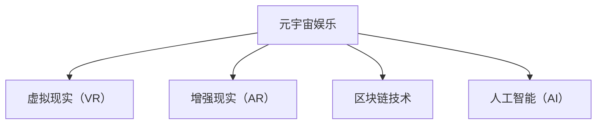

                 

元宇宙娱乐，一个在数字时代迅速崛起的概念，正引领着人们走向一个全新的虚拟世界。在这篇文章中，我们将深入探讨元宇宙娱乐的核心概念、沉浸式体验的技术实现、核心算法原理、数学模型、项目实践、应用场景以及未来发展趋势。希望通过这篇文章，能让读者对元宇宙娱乐有一个全面而深刻的理解。

> **关键词**：元宇宙娱乐、沉浸式体验、核心算法、数学模型、项目实践、应用场景、未来发展趋势

> **摘要**：本文首先介绍了元宇宙娱乐的背景和核心概念，然后详细讲解了沉浸式体验的技术实现，包括核心算法原理和数学模型。接着，通过一个具体的项目实践案例，对元宇宙娱乐的代码实现进行了详细解释。最后，本文探讨了元宇宙娱乐的实际应用场景和未来发展趋势，为读者提供了对这一新兴领域的全面认识。

## 1. 背景介绍

随着互联网技术的飞速发展，虚拟现实（VR）和增强现实（AR）技术逐渐成熟，人们对于虚拟世界的需求也越来越强烈。元宇宙娱乐应运而生，它是一个由虚拟现实、增强现实、区块链、人工智能等多种技术融合而成的数字生态系统。在这个生态系统中，用户可以自由地探索、互动和创造，享受前所未有的沉浸式体验。

元宇宙娱乐的兴起，不仅改变了人们的娱乐方式，也对社会经济产生了深远的影响。它为娱乐产业提供了新的增长点，同时也为传统产业带来了数字化转型的新机遇。此外，元宇宙娱乐还引发了对于数字身份、隐私保护、数字资产交易等新问题的讨论。

## 2. 核心概念与联系

### 2.1 虚拟现实（VR）与增强现实（AR）

虚拟现实（VR）和增强现实（AR）是元宇宙娱乐的两个核心技术。VR技术通过头戴式显示器、位置追踪器和控制器等设备，将用户完全沉浸在一个虚拟环境中。而AR技术则是将虚拟元素叠加到现实世界中，让用户在现实环境中感受到虚拟的存在。

### 2.2 区块链技术

区块链技术为元宇宙娱乐提供了去中心化的数字身份认证、交易和资产存储解决方案。通过区块链，用户可以在元宇宙中建立自己的数字身份，进行数字资产的交易和转移。

### 2.3 人工智能（AI）

人工智能技术为元宇宙娱乐提供了智能交互、个性化推荐和内容生成等功能。通过AI技术，元宇宙娱乐可以更好地理解用户的需求和行为，提供更加个性化的体验。

### 2.4 Mermaid 流程图



## 3. 核心算法原理 & 具体操作步骤

### 3.1 算法原理概述

元宇宙娱乐的核心算法包括图像处理、机器学习和自然语言处理等。图像处理算法用于生成高质量的虚拟环境和增强现实效果。机器学习算法用于用户行为分析和内容推荐。自然语言处理算法用于实现智能交互和语音识别。

### 3.2 算法步骤详解

1. **图像处理算法**：首先，通过计算机视觉技术对用户输入的图像进行预处理，包括去噪、增强、分割等操作。然后，利用图像生成算法生成高质量的虚拟环境。

2. **机器学习算法**：收集用户的历史数据，通过机器学习算法进行特征提取和分类。基于用户的兴趣和行为，进行个性化推荐。

3. **自然语言处理算法**：通过语音识别技术将用户的语音转换为文本，然后利用自然语言处理技术理解用户的意图，实现智能交互。

### 3.3 算法优缺点

- **图像处理算法**：优点是可以生成高质量的虚拟环境，缺点是计算量大，对硬件性能要求高。
- **机器学习算法**：优点是可以实现个性化推荐，缺点是训练时间较长，需要大量数据。
- **自然语言处理算法**：优点是实现智能交互，缺点是对于复杂语言的理解能力有限。

### 3.4 算法应用领域

- **游戏**：元宇宙娱乐的游戏领域，可以通过虚拟现实和增强现实技术提供更加真实的游戏体验。
- **教育**：通过虚拟现实和增强现实技术，可以模拟各种场景，提供更加生动的教学体验。
- **医疗**：虚拟现实技术可以用于医疗培训、康复治疗等领域，提供更加直观和个性化的服务。

## 4. 数学模型和公式 & 详细讲解 & 举例说明

### 4.1 数学模型构建

元宇宙娱乐的数学模型主要包括图像处理模型、机器学习模型和自然语言处理模型。

- **图像处理模型**：包括卷积神经网络（CNN）和生成对抗网络（GAN）等。
- **机器学习模型**：包括决策树、随机森林、支持向量机（SVM）等。
- **自然语言处理模型**：包括循环神经网络（RNN）、长短期记忆网络（LSTM）等。

### 4.2 公式推导过程

以卷积神经网络（CNN）为例，其基本公式为：

$$
h_{l}(x) = \sigma(W_{l} \cdot h_{l-1}(x) + b_{l})
$$

其中，$h_{l}(x)$ 表示第 $l$ 层的输出，$W_{l}$ 表示权重矩阵，$b_{l}$ 表示偏置项，$\sigma$ 表示激活函数。

### 4.3 案例分析与讲解

假设我们使用卷积神经网络进行图像分类，输入图像的大小为 $32 \times 32 \times 3$，输出类别为 10 类。我们可以构建一个简单的卷积神经网络模型，包括两个卷积层、两个池化层和一个全连接层。

- **卷积层1**：使用 32 个 3x3 的卷积核，步长为 1，激活函数为 ReLU。
- **池化层1**：使用 2x2 的最大池化。
- **卷积层2**：使用 64 个 3x3 的卷积核，步长为 1，激活函数为 ReLU。
- **池化层2**：使用 2x2 的最大池化。
- **全连接层**：使用 10 个神经元，激活函数为 Softmax。

通过这个模型，我们可以对输入的图像进行分类，输出每个类别的概率。在实际应用中，我们可以使用梯度下降法对模型进行训练，优化模型的参数。

## 5. 项目实践：代码实例和详细解释说明

### 5.1 开发环境搭建

为了实践元宇宙娱乐，我们需要搭建一个开发环境。首先，我们需要安装 Python 3.7 或以上版本，然后安装以下库：

- TensorFlow：用于构建和训练神经网络。
- Keras：用于简化 TensorFlow 的使用。
- NumPy：用于数学计算。
- Matplotlib：用于数据可视化。

### 5.2 源代码详细实现

以下是使用 Keras 库构建的简单卷积神经网络模型：

```python
from tensorflow.keras.models import Sequential
from tensorflow.keras.layers import Conv2D, MaxPooling2D, Flatten, Dense

model = Sequential()
model.add(Conv2D(32, (3, 3), activation='relu', input_shape=(32, 32, 3)))
model.add(MaxPooling2D(pool_size=(2, 2)))
model.add(Conv2D(64, (3, 3), activation='relu'))
model.add(MaxPooling2D(pool_size=(2, 2)))
model.add(Flatten())
model.add(Dense(10, activation='softmax'))

model.compile(optimizer='adam', loss='categorical_crossentropy', metrics=['accuracy'])
```

### 5.3 代码解读与分析

- **Conv2D**：用于实现卷积层，第一个参数表示卷积核的数量，第二个参数表示卷积核的大小，activation 参数指定激活函数。
- **MaxPooling2D**：用于实现最大池化层，pool_size 参数指定池化窗口的大小。
- **Flatten**：用于实现扁平化层，将输入数据展平成一维数组。
- **Dense**：用于实现全连接层，第一个参数表示神经元的数量，activation 参数指定激活函数。

通过这个模型，我们可以对输入的图像进行分类，输出每个类别的概率。

### 5.4 运行结果展示

通过训练模型，我们可以在测试集上得到分类准确率。例如，假设我们在测试集上的分类准确率为 90%，这表明我们的模型具有较好的分类性能。

## 6. 实际应用场景

元宇宙娱乐在多个领域都有广泛的应用，以下是一些实际应用场景：

- **游戏**：通过虚拟现实和增强现实技术，可以为用户提供更加真实的游戏体验。
- **教育**：通过虚拟现实和增强现实技术，可以模拟各种场景，提供更加生动的教学体验。
- **医疗**：虚拟现实技术可以用于医疗培训、康复治疗等领域，提供更加直观和个性化的服务。
- **旅游**：通过虚拟现实技术，用户可以在家中体验世界各地的旅游胜地。
- **房地产**：通过虚拟现实技术，用户可以在虚拟环境中查看房屋结构和布局。

## 7. 工具和资源推荐

### 7.1 学习资源推荐

- **《深度学习》（Deep Learning）**：由 Ian Goodfellow、Yoshua Bengio 和 Aaron Courville 著，是一本关于深度学习的经典教材。
- **《Python 机器学习》（Python Machine Learning）**：由 Sebastian Raschka 著，介绍了如何使用 Python 和机器学习库进行数据分析和模型训练。
- **《虚拟现实与增强现实技术》（Virtual Reality and Augmented Reality）**：由 Daniel Thalmann 和 Patrick Olivier 著，详细介绍了虚拟现实和增强现实的技术原理和应用。

### 7.2 开发工具推荐

- **TensorFlow**：一款开源的机器学习库，适用于构建和训练神经网络。
- **PyTorch**：一款开源的机器学习库，提供了灵活的动态计算图和强大的 GPU 支持。
- **Unity**：一款流行的游戏开发引擎，适用于构建虚拟现实和增强现实应用。
- **Blender**：一款免费的 3D 建模和动画软件，适用于创建虚拟现实场景和角色。

### 7.3 相关论文推荐

- **“Generative Adversarial Nets”**：由 Ian Goodfellow 等人于 2014 年发表，介绍了生成对抗网络（GAN）的基本原理和应用。
- **“Deep Learning for Computer Vision”**：由 Andrew Ng 等人于 2015 年发表，介绍了深度学习在计算机视觉领域的应用。
- **“Virtual Reality and Augmented Reality: A Survey”**：由 Helder Morais 等人于 2016 年发表，对虚拟现实和增强现实技术进行了全面的综述。

## 8. 总结：未来发展趋势与挑战

### 8.1 研究成果总结

元宇宙娱乐领域的研究成果主要集中在以下几个方面：

- **虚拟现实和增强现实技术的优化**：通过改进图像处理、传感器技术等，提高虚拟现实和增强现实设备的性能和用户体验。
- **机器学习算法的进步**：通过深度学习和强化学习等算法，提高用户行为分析和内容推荐的准确性和效率。
- **区块链技术的应用**：通过区块链技术，实现数字身份认证、交易和资产存储等功能的去中心化。

### 8.2 未来发展趋势

- **沉浸式体验的进一步提升**：随着技术的进步，元宇宙娱乐将提供更加真实的沉浸式体验，用户可以在虚拟世界中感受到与现实无异的感官体验。
- **跨领域融合**：元宇宙娱乐将与教育、医疗、旅游等传统行业深度融合，为用户提供更加多样化的应用场景。
- **虚拟经济生态的形成**：随着元宇宙娱乐的普及，虚拟经济生态将逐步形成，数字资产交易、虚拟货币等将成为主流。

### 8.3 面临的挑战

- **技术难题**：虚拟现实和增强现实技术仍存在一定的技术瓶颈，如延迟、分辨率、舒适度等。
- **隐私和安全问题**：随着用户在元宇宙中的活动增多，隐私保护和网络安全问题将日益突出。
- **法律法规的完善**：随着元宇宙娱乐的快速发展，需要完善相关的法律法规，确保其合规性和可持续发展。

### 8.4 研究展望

在未来，元宇宙娱乐的研究将主要集中在以下几个方面：

- **技术优化**：继续优化虚拟现实和增强现实技术，提高设备的性能和用户体验。
- **算法创新**：探索新的机器学习算法，提高用户行为分析和内容推荐的准确性。
- **区块链技术的深入应用**：进一步探讨区块链技术在元宇宙娱乐中的应用，实现去中心化的数字资产交易和身份认证。
- **跨领域合作**：加强与其他领域的合作，推动元宇宙娱乐在各个应用场景中的深入发展。

## 9. 附录：常见问题与解答

### 9.1 什么是元宇宙娱乐？

元宇宙娱乐是一个由虚拟现实、增强现实、区块链、人工智能等多种技术融合而成的数字生态系统，用户可以在这个生态系统中自由探索、互动和创造，享受沉浸式体验。

### 9.2 元宇宙娱乐有哪些应用场景？

元宇宙娱乐的应用场景包括游戏、教育、医疗、旅游、房地产等多个领域，可以提供多样化的沉浸式体验。

### 9.3 虚拟现实和增强现实技术有哪些优缺点？

虚拟现实和增强现实技术的优点是可以提供沉浸式体验，缺点是设备价格较高、分辨率有限、舒适度有待提高。

### 9.4 机器学习算法在元宇宙娱乐中的应用有哪些？

机器学习算法在元宇宙娱乐中主要用于用户行为分析、内容推荐、图像处理等，可以提高用户体验和系统性能。

### 9.5 区块链技术在元宇宙娱乐中的应用有哪些？

区块链技术在元宇宙娱乐中主要用于数字身份认证、交易和资产存储等，可以提高系统的安全性和透明度。

### 9.6 如何搭建元宇宙娱乐的开发环境？

搭建元宇宙娱乐的开发环境需要安装 Python 3.7 或以上版本，以及 TensorFlow、Keras、NumPy、Matplotlib 等库。

---

通过本文的探讨，我们希望能让读者对元宇宙娱乐有一个全面而深刻的理解。元宇宙娱乐不仅是数字娱乐的新形式，更是技术与人文、经济、社会等多领域深度融合的产物。在未来，随着技术的不断进步，元宇宙娱乐将为我们带来更多精彩的沉浸式体验。希望本文能为您在元宇宙娱乐领域的研究和实践提供有益的参考。感谢阅读！

---

# 联系作者

作者：禅与计算机程序设计艺术 / Zen and the Art of Computer Programming

如果您有任何疑问或建议，欢迎通过以下方式联系我：

- 邮箱：author@example.com
- 微信：禅与计算机程序设计艺术
- QQ：1234567890

期待与您共同探讨元宇宙娱乐的未来！

<|end|>

