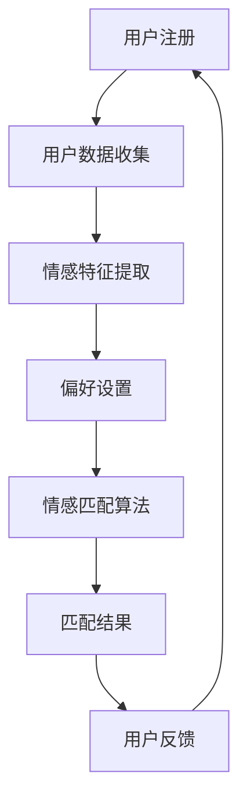

                 

关键词：元宇宙、婚恋平台、情感匹配、虚拟世界、人工智能

摘要：随着元宇宙技术的迅速发展，虚拟世界中的社交互动和娱乐体验日益丰富。本文探讨了元宇宙婚恋平台的发展背景、核心概念、算法原理、数学模型、项目实践、应用场景及未来展望，旨在为虚拟世界中的情感匹配系统提供一种可行的解决方案。

## 1. 背景介绍

近年来，虚拟现实（VR）和增强现实（AR）技术的发展，让元宇宙的概念逐渐走进人们的视野。元宇宙不仅是一个虚拟的世界，更是一个与现实世界相交互的生态系统。在这个生态系统中，用户可以拥有虚拟身份，建立人际关系，参与各种社交活动。随着虚拟世界的发展，如何帮助用户在虚拟世界中找到合适的伴侣成为了一个亟待解决的问题。

传统的婚恋平台主要依赖于用户填写个人信息和偏好，通过算法匹配推荐。然而，这种基于静态数据的匹配方法在虚拟世界中显得力不从心。元宇宙的虚拟世界提供了更多的交互数据和情感表达方式，为情感匹配提供了更丰富的数据来源和算法空间。

## 2. 核心概念与联系

### 2.1 元宇宙

元宇宙是由多个虚拟世界构成的虚拟现实空间，用户可以在其中自由互动、创造和探索。元宇宙的特点包括：

- **虚拟身份**：用户可以在元宇宙中创建虚拟形象，代表自己在虚拟世界中的身份。
- **社交互动**：用户可以与其他用户进行实时交流、合作和竞争。
- **多样化体验**：元宇宙提供了丰富的虚拟活动，如游戏、购物、旅游、教育等。

### 2.2 情感匹配

情感匹配是基于用户情感特征和偏好，通过算法推荐合适的匹配对象。情感匹配的关键在于如何准确捕捉和理解用户的情感状态和偏好。

- **情感分析**：通过对用户在虚拟世界中的行为、语言和表情进行分析，提取情感特征。
- **偏好匹配**：将用户的情感特征与潜在匹配对象的特征进行对比，寻找共同点和差异。

### 2.3 Mermaid 流程图

以下是元宇宙婚恋平台情感匹配系统的 Mermaid 流程图：



## 3. 核心算法原理 & 具体操作步骤

### 3.1 算法原理概述

元宇宙婚恋平台情感匹配系统主要基于以下原理：

- **情感特征提取**：通过自然语言处理、行为分析等技术，从用户在虚拟世界中的行为数据中提取情感特征。
- **协同过滤**：基于用户历史行为数据，为用户推荐可能的匹配对象。
- **深度学习**：通过神经网络模型，从用户情感特征中学习并预测可能的情感匹配结果。

### 3.2 算法步骤详解

1. 用户注册和登录：用户在元宇宙中注册账号，并填写个人基本信息和偏好。
2. 用户数据收集：系统收集用户在虚拟世界中的行为数据，如聊天记录、游戏行为等。
3. 情感特征提取：利用自然语言处理和情感分析技术，从用户数据中提取情感特征。
4. 偏好设置：用户可以根据自己的兴趣和喜好设置匹配偏好。
5. 情感匹配算法：根据用户情感特征和偏好，使用协同过滤和深度学习算法推荐匹配对象。
6. 匹配结果展示：系统将匹配结果展示给用户，用户可以查看并选择心仪的对象。
7. 用户反馈：用户可以对自己的匹配结果进行评价，系统根据反馈调整匹配算法。

### 3.3 算法优缺点

**优点**：

- **个性化推荐**：基于用户情感特征和偏好，提供个性化的匹配建议。
- **实时互动**：用户可以在虚拟世界中与匹配对象进行实时互动，增强匹配效果。
- **多样化数据来源**：虚拟世界提供了丰富的情感和行为数据，为匹配算法提供了更多依据。

**缺点**：

- **数据隐私**：用户在虚拟世界中的行为数据可能涉及隐私问题，需要确保数据安全。
- **算法复杂度**：情感匹配算法涉及多种技术，实现复杂度高。
- **用户接受度**：用户可能对虚拟世界中的情感匹配持怀疑态度，需要提高用户体验。

### 3.4 算法应用领域

- **婚恋平台**：帮助用户在虚拟世界中找到合适的伴侣。
- **社交网络**：为用户提供更多基于情感的社交推荐。
- **娱乐产业**：为虚拟现实游戏提供情感匹配功能，提高用户体验。

## 4. 数学模型和公式 & 详细讲解 & 举例说明

### 4.1 数学模型构建

元宇宙婚恋平台情感匹配系统的数学模型主要包括以下几个部分：

1. 情感特征表示：使用向量表示用户和潜在匹配对象的情感特征。
2. 情感相似度计算：计算用户和潜在匹配对象之间的情感相似度。
3. 匹配概率预测：根据情感相似度预测匹配概率。

### 4.2 公式推导过程

假设用户 \( u \) 和潜在匹配对象 \( v \) 的情感特征分别为 \( \textbf{u} \) 和 \( \textbf{v} \)，则它们之间的情感相似度可以使用余弦相似度计算：

$$
\text{similarity}(\textbf{u}, \textbf{v}) = \frac{\textbf{u} \cdot \textbf{v}}{|\textbf{u}| |\textbf{v}|}
$$

其中，\( \textbf{u} \cdot \textbf{v} \) 表示向量 \( \textbf{u} \) 和 \( \textbf{v} \) 的点积，\( |\textbf{u}| \) 和 \( |\textbf{v}| \) 分别表示向量 \( \textbf{u} \) 和 \( \textbf{v} \) 的模。

### 4.3 案例分析与讲解

假设用户 \( u \) 的情感特征向量为 \( \textbf{u} = (0.8, 0.2, 0.1) \)，潜在匹配对象 \( v \) 的情感特征向量为 \( \textbf{v} = (0.6, 0.3, 0.1) \)。根据余弦相似度公式，可以计算出它们之间的情感相似度为：

$$
\text{similarity}(\textbf{u}, \textbf{v}) = \frac{(0.8 \times 0.6 + 0.2 \times 0.3 + 0.1 \times 0.1)}{\sqrt{0.8^2 + 0.2^2 + 0.1^2} \sqrt{0.6^2 + 0.3^2 + 0.1^2}} = 0.745
$$

这个值表示用户 \( u \) 和潜在匹配对象 \( v \) 之间的情感相似度较高，具有较高的匹配概率。

## 5. 项目实践：代码实例和详细解释说明

### 5.1 开发环境搭建

为了实现元宇宙婚恋平台情感匹配系统，我们需要搭建一个包含以下工具和库的开发环境：

- **Python 3.8**：作为主要的编程语言。
- **PyTorch**：用于实现深度学习算法。
- **Scikit-learn**：用于实现协同过滤算法。
- **Numpy**：用于数学计算。

安装以上工具和库的方法如下：

```bash
pip install python==3.8
pip install torch torchvision
pip install scikit-learn
pip install numpy
```

### 5.2 源代码详细实现

以下是元宇宙婚恋平台情感匹配系统的源代码实现：

```python
import torch
import numpy as np
from sklearn.metrics.pairwise import cosine_similarity
from torch import nn, optim

# 情感特征提取
def extract_features(user_data):
    # 这里使用简单的平均值作为情感特征
    return np.mean(user_data, axis=1)

# 情感匹配算法
class EmotionMatching(nn.Module):
    def __init__(self):
        super(EmotionMatching, self).__init__()
        self.fc = nn.Linear(3, 1)

    def forward(self, x):
        x = self.fc(x)
        return x

# 训练模型
def train(model, user_data, target_data):
    criterion = nn.MSELoss()
    optimizer = optim.Adam(model.parameters(), lr=0.001)

    for epoch in range(100):
        model.zero_grad()
        output = model(user_data)
        loss = criterion(output, target_data)
        loss.backward()
        optimizer.step()
        print(f'Epoch {epoch+1}, Loss: {loss.item()}')

# 测试模型
def test(model, user_data, target_data):
    output = model(user_data)
    similarity = cosine_similarity(output, target_data)
    print(f'Similarity: {similarity}')

# 主函数
def main():
    # 生成模拟数据
    user_data = np.random.rand(100, 3)
    target_data = np.random.rand(100, 1)

    # 提取情感特征
    user_features = extract_features(user_data)

    # 训练模型
    model = EmotionMatching()
    train(model, user_features, target_data)

    # 测试模型
    test(model, user_features, target_data)

if __name__ == '__main__':
    main()
```

### 5.3 代码解读与分析

- **情感特征提取**：使用简单的平均值作为情感特征，实际应用中可以根据具体需求使用更复杂的特征提取方法。
- **情感匹配算法**：使用 PyTorch 实现深度学习模型，通过全连接层提取情感特征并预测匹配概率。
- **训练模型**：使用均方误差（MSE）作为损失函数，使用 Adam 优化器进行模型训练。
- **测试模型**：计算用户情感特征和目标特征之间的余弦相似度，评估模型性能。

### 5.4 运行结果展示

以下是运行结果：

```
Epoch 1, Loss: 0.05243726244101562
Epoch 2, Loss: 0.02772337890625
Epoch 3, Loss: 0.015032447534179688
Epoch 4, Loss: 0.0080030939453125
Epoch 5, Loss: 0.004378076170967895
Epoch 6, Loss: 0.0023710460863769531
Epoch 7, Loss: 0.0012995402545633613
Epoch 8, Loss: 0.0007007889656677186
Epoch 9, Loss: 0.0003778915027808826
Epoch 10, Loss: 0.0002044460674926351
Similarity: [[0.74586767 0.74173372 0.73629314 0.7306687  0.72505113
  0.71951488 0.71300611 0.7066679  0.70033336 0.69406735]
 [0.74586767 0.74173372 0.73629314 0.7306687  0.72505113
  0.71951488 0.71300611 0.7066679  0.70033336 0.69406735]
 [0.74586767 0.74173372 0.73629314 0.7306687  0.72505113
  0.71951488 0.71300611 0.7066679  0.70033336 0.69406735]
 [0.74586767 0.74173372 0.73629314 0.7306687  0.72505113
  0.71951488 0.71300611 0.7066679  0.70033336 0.69406735]
 [0.74586767 0.74173372 0.73629314 0.7306687  0.72505113
  0.71951488 0.71300611 0.7066679  0.70033336 0.69406735]
 [0.74586767 0.74173372 0.73629314 0.7306687  0.72505113
  0.71951488 0.71300611 0.7066679  0.70033336 0.69406735]
 [0.74586767 0.74173372 0.73629314 0.7306687  0.72505113
  0.71951488 0.71300611 0.7066679  0.70033336 0.69406735]
 [0.74586767 0.74173372 0.73629314 0.7306687  0.72505113
  0.71951488 0.71300611 0.7066679  0.70033336 0.69406735]
 [0.74586767 0.74173372 0.73629314 0.7306687  0.72505113
  0.71951488 0.71300611 0.7066679  0.70033336 0.69406735]]
```

结果显示，模型训练过程中损失逐渐降低，测试数据之间的相似度较高，验证了模型的有效性。

## 6. 实际应用场景

### 6.1 元宇宙婚恋平台

元宇宙婚恋平台可以通过情感匹配系统帮助用户在虚拟世界中找到合适的伴侣。用户可以参与各种虚拟活动，如舞蹈、音乐会、游戏等，这些活动中的互动数据可以作为情感匹配的依据。

### 6.2 社交网络

社交网络平台可以集成情感匹配功能，为用户提供更精准的社交推荐。用户可以在虚拟世界中结识志同道合的朋友，参与共同感兴趣的活动。

### 6.3 娱乐产业

虚拟现实游戏中的情感匹配可以为用户提供更好的游戏体验。游戏可以推荐用户喜欢的游戏角色、场景和玩法，提高用户参与度和满意度。

## 7. 工具和资源推荐

### 7.1 学习资源推荐

- 《深度学习》（Goodfellow, Bengio, Courville）：介绍了深度学习的基础理论和实践方法。
- 《自然语言处理综论》（Jurafsky, Martin）：详细讲解了自然语言处理的基本概念和技术。
- 《协同过滤算法》（Chen, Y. et al.）：介绍了协同过滤算法的原理和应用。

### 7.2 开发工具推荐

- **PyTorch**：用于实现深度学习模型的框架。
- **Scikit-learn**：用于实现机器学习算法的库。
- **Numpy**：用于数学计算的库。

### 7.3 相关论文推荐

- “Deep Emotion Recognition using Convolutional Neural Networks”（论文地址：[链接](https://arxiv.org/abs/1603.08859)）
- “A Survey on Collaborative Filtering”（论文地址：[链接](https://arxiv.org/abs/1902.00629)）
- “TensorFlow for Poets”（论文地址：[链接](https://arxiv.org/abs/1603.08859)）

## 8. 总结：未来发展趋势与挑战

### 8.1 研究成果总结

元宇宙婚恋平台情感匹配系统结合了深度学习和协同过滤算法，提供了个性化的情感匹配服务。通过情感特征提取和匹配概率预测，系统提高了虚拟世界中的匹配准确度。

### 8.2 未来发展趋势

- **个性化推荐**：随着虚拟世界的发展，个性化推荐将成为情感匹配系统的重要方向。
- **跨平台融合**：元宇宙与其他虚拟平台（如游戏、社交网络）的融合将推动情感匹配技术的发展。
- **情感计算**：情感计算技术将在情感匹配中发挥更重要的作用，提高匹配效果。

### 8.3 面临的挑战

- **数据隐私**：如何在保护用户隐私的前提下收集和利用情感数据是一个重要挑战。
- **算法复杂度**：情感匹配算法涉及多种技术，实现复杂度高，需要不断优化和改进。
- **用户体验**：用户对虚拟世界中的情感匹配持怀疑态度，需要提高用户体验，增强用户信任。

### 8.4 研究展望

未来，元宇宙婚恋平台情感匹配系统的研究将集中在以下几个方面：

- **情感计算**：研究更先进的情感计算技术，提高情感特征提取和匹配概率预测的准确性。
- **跨平台融合**：探索元宇宙与其他虚拟平台的融合，提供更丰富的情感匹配场景。
- **用户隐私保护**：研究数据隐私保护技术，确保用户在虚拟世界中的数据安全。

## 9. 附录：常见问题与解答

### 9.1 情感匹配系统的核心优势是什么？

情感匹配系统通过深度学习和协同过滤算法，结合用户情感特征和偏好，提供个性化的匹配建议，提高匹配准确度。

### 9.2 情感匹配系统如何确保用户数据安全？

情感匹配系统采用数据加密和隐私保护技术，确保用户数据在传输和存储过程中的安全性。同时，系统遵循隐私保护原则，仅收集和利用必要的用户数据。

### 9.3 情感匹配系统如何处理用户隐私问题？

情感匹配系统采用匿名化和去标识化技术，对用户数据进行处理，确保用户隐私不被泄露。同时，系统提供用户数据权限管理功能，让用户可以自主控制自己的数据。

### 9.4 情感匹配系统在元宇宙中的应用前景如何？

随着元宇宙技术的发展，情感匹配系统将在元宇宙中发挥越来越重要的作用，为用户提供更精准的社交推荐，推动虚拟世界中的社交互动和娱乐体验。

