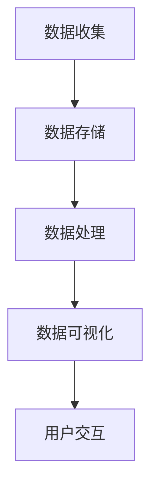

                 

### 关键词 Keywords

- 元宇宙
- 远程协作
- 工作空间
- 革命性变革
- 技术创新
- 工作效率
- 数据可视化

<|assistant|>### 摘要 Abstract

本文探讨了元宇宙工作空间的崛起如何引领远程协作领域的革命性变革。随着技术的不断进步，虚拟现实（VR）和增强现实（AR）技术正迅速融入企业日常运营，为远程工作者提供一个沉浸式的协作平台。本文首先介绍了元宇宙工作空间的基本概念和组成部分，随后深入分析了其在提升工作效率、优化沟通流程和实现沉浸式体验方面的独特优势。接着，文章详细阐述了元宇宙工作空间的核心算法原理和具体操作步骤，并借助数学模型和实际案例进行了讲解。最后，文章展望了元宇宙工作空间在未来应用场景中的发展趋势和面临的挑战，同时推荐了相关的学习资源和开发工具，以期为读者提供一个全面而深入的视角，理解元宇宙工作空间在远程协作领域中的重要性。

### 1. 背景介绍 Background

随着全球化进程的不断加速，远程工作和远程协作已成为现代企业的标准操作模式。传统的远程协作方式，如电子邮件、即时通讯和视频会议等，虽然在一定程度上提高了工作效率，但仍面临着沟通效率低、信息传递滞后和团队协作困难等问题。在这个背景下，元宇宙工作空间的概念逐渐崭露头角，成为解决这些难题的潜在解决方案。

#### 1.1 远程协作的现状

远程协作的兴起主要源于以下几个因素：

1. **全球化：** 企业需要在全球范围内进行资源整合和协作，远程工作成为一种必需。
2. **技术进步：** 云计算、大数据、人工智能和物联网等技术的成熟，为远程协作提供了强有力的技术支持。
3. **工作模式变化：** 现代员工越来越重视工作与生活的平衡，远程工作能够提供更大的灵活性和自由度。

尽管远程协作带来了诸多好处，但传统的协作方式仍存在以下问题：

- **沟通效率低下：** 电子邮件和即时通讯往往无法即时传递信息，导致沟通效率低下。
- **信息孤岛：** 不同部门和团队之间缺乏有效的信息共享平台，导致信息孤岛现象严重。
- **协作困难：** 传统工具难以提供高效、实时的协作体验，特别是在复杂的跨部门或跨国项目中。

#### 1.2 元宇宙工作空间的概念

元宇宙（Metaverse）是虚拟现实（VR）和增强现实（AR）技术的集成应用，构建了一个虚拟的、三维的互联网世界。元宇宙工作空间则是在这个虚拟世界中，为远程工作者提供一个沉浸式、高效的协作平台。它不仅提供了实时的沟通和协作工具，还能模拟现实世界的工作场景，提升团队协作的效率和效果。

元宇宙工作空间的主要组成部分包括：

- **虚拟环境：** 模拟现实世界的工作场所，为用户提供沉浸式的体验。
- **协作工具：** 包括虚拟白板、共享文档、即时通讯和视频会议等，提供多样化的协作方式。
- **数据可视化：** 利用虚拟现实技术，将复杂的数据以直观、动态的方式展示，帮助用户更好地理解和分析。
- **社交功能：** 支持用户之间的社交互动，如点赞、评论和私信等，增强团队凝聚力。

### 2. 核心概念与联系 Core Concepts and Relationships

元宇宙工作空间的核心概念包括虚拟现实、增强现实、大数据和人工智能等。这些概念不仅相互独立，还通过特定的技术架构和流程相互联系，共同构成了一个完整的元宇宙工作空间。

#### 2.1 虚拟现实（VR）

虚拟现实技术通过计算机生成的三维模拟环境，为用户提供沉浸式的体验。在元宇宙工作空间中，虚拟现实技术主要用于以下几个方面：

- **模拟工作场景：** 通过虚拟现实技术，可以创建与现实工作环境相似的虚拟空间，用户可以在这个虚拟空间中进行工作、交流和协作。
- **培训与模拟：** 虚拟现实技术可以用于模拟实际工作场景，进行员工培训和技能提升。
- **交互体验：** 虚拟现实技术提供了更为丰富、多样的交互方式，如手势、语音和眼动等，提升了用户的使用体验。

#### 2.2 增强现实（AR）

增强现实技术通过将虚拟信息叠加到现实世界中，为用户提供增强的视觉体验。在元宇宙工作空间中，增强现实技术主要用于以下几个方面：

- **数据可视化：** 增强现实技术可以将复杂的数据以三维图形的形式叠加到现实世界中，用户可以直观地查看和分析数据。
- **实时监控：** 增强现实技术可以实时显示设备运行状态、传感器数据等，帮助用户进行实时监控和故障排查。
- **交互式演示：** 增强现实技术可以用于交互式的产品演示和设计，提高演示效果和客户满意度。

#### 2.3 大数据

大数据技术在元宇宙工作空间中发挥着重要作用。通过收集、存储、分析和处理海量数据，大数据技术可以帮助企业做出更明智的决策，提升工作效率和竞争力。具体应用场景包括：

- **用户行为分析：** 通过分析用户在元宇宙工作空间中的行为数据，可以了解用户的偏好和需求，优化产品设计和功能。
- **智能推荐：** 基于大数据分析，可以提供个性化的工作空间配置和工具推荐，提升用户体验。
- **业务决策：** 通过大数据分析，企业可以更准确地预测市场趋势、优化供应链和提升客户满意度。

#### 2.4 人工智能

人工智能技术为元宇宙工作空间提供了智能化、自动化的解决方案。通过机器学习、自然语言处理和计算机视觉等技术，人工智能可以大幅提升元宇宙工作空间的效率和智能化水平。具体应用场景包括：

- **智能助手：** 人工智能可以为企业员工提供智能助手，帮助用户解决常见问题、提供实时建议和协助工作。
- **自动化流程：** 通过人工智能技术，可以自动化完成一些重复性、规则性的工作流程，降低人工成本和提高工作效率。
- **智能分析：** 人工智能可以自动分析海量数据，提供预测性分析和决策支持，帮助企业在市场竞争中占据优势。

#### 2.5 技术架构和流程

元宇宙工作空间的技术架构主要包括以下几个方面：

1. **前端技术：** 包括虚拟现实和增强现实技术，负责实现用户界面和交互体验。
2. **后端技术：** 包括大数据平台和人工智能算法，负责数据存储、处理和分析。
3. **网络技术：** 包括云计算和物联网技术，负责数据传输和实时通信。

元宇宙工作空间的流程主要包括以下几个步骤：

1. **数据收集：** 通过各种传感器和设备收集数据。
2. **数据存储：** 将收集到的数据存储到大数据平台。
3. **数据处理：** 利用人工智能算法对数据进行处理和分析。
4. **数据可视化：** 将处理后的数据通过虚拟现实和增强现实技术进行可视化展示。
5. **用户交互：** 用户通过虚拟现实和增强现实技术进行数据分析和交互。

以下是一个简单的Mermaid流程图，展示了元宇宙工作空间的技术架构和流程：



通过上述核心概念和技术架构的介绍，我们可以看到元宇宙工作空间如何通过虚拟现实、增强现实、大数据和人工智能等技术，实现远程协作的革命性变革。

### 3. 核心算法原理 & 具体操作步骤 Core Algorithm Principles and Operational Steps

#### 3.1 算法原理概述

在元宇宙工作空间中，核心算法的设计与实现是其高效运作的关键。以下是元宇宙工作空间中的几个关键算法原理和它们的操作步骤。

##### 3.1.1 虚拟环境建模算法

虚拟环境建模算法是元宇宙工作空间的基础，它负责创建虚拟工作空间的三维模型。该算法的原理是通过计算机图形学和物理模拟技术，将现实世界的工作环境数字化，并在虚拟空间中重建。具体步骤如下：

1. **数据采集：** 通过传感器和摄影设备采集现实世界的工作环境数据，包括空间布局、设备布局和人员位置等。
2. **数据处理：** 对采集到的数据进行预处理，如去噪、分割和特征提取，以便后续建模使用。
3. **三维建模：** 利用三维建模软件或算法，将预处理后的数据转换为虚拟环境的三维模型。
4. **优化与调整：** 根据用户反馈和实际需求，对虚拟环境进行优化和调整，确保其与现实工作环境的一致性和可用性。

##### 3.1.2 数据分析算法

数据分析算法是元宇宙工作空间的数据处理和智能分析的核心。该算法通过机器学习和大数据技术，对收集到的用户行为数据进行分析，以提供智能化的决策支持。具体步骤如下：

1. **数据预处理：** 对原始数据进行清洗、归一化和特征提取，为后续分析做好准备。
2. **特征选择：** 根据数据分析目标，选择关键特征进行建模。
3. **模型训练：** 利用机器学习算法，如决策树、支持向量机和神经网络等，对特征进行训练，构建数据分析模型。
4. **模型评估与优化：** 通过交叉验证和性能评估，优化模型参数，提高预测准确性和模型稳定性。

##### 3.1.3 增强现实交互算法

增强现实交互算法是元宇宙工作空间中实现用户与虚拟环境交互的关键。该算法通过计算机视觉和自然语言处理技术，提供直观、智能的用户交互体验。具体步骤如下：

1. **手势识别：** 通过计算机视觉技术，实时捕捉用户的手势动作，并将其转换为虚拟环境的交互指令。
2. **语音识别：** 通过自然语言处理技术，将用户的语音指令转换为文本，并解析出具体的操作意图。
3. **交互反馈：** 根据用户的交互指令，实时更新虚拟环境，提供即时的交互反馈，如界面更新、声音效果等。

#### 3.2 算法步骤详解

##### 3.2.1 虚拟环境建模算法步骤详解

1. **数据采集：** 使用360度全景相机和激光扫描仪等设备，对现实工作环境进行数据采集，获取空间布局、设备布局和人员位置等详细信息。

   ```mermaid
   graph TD
       A[360度全景相机] --> B[激光扫描仪]
       B --> C[传感器数据]
   ```

2. **数据处理：** 对采集到的数据进行分析和处理，包括去噪、分割和特征提取。

   ```mermaid
   graph TD
       A[传感器数据] --> B[去噪处理]
       B --> C[数据分割]
       C --> D[特征提取]
   ```

3. **三维建模：** 利用三维建模软件或算法，将处理后的数据转换为虚拟环境的三维模型。

   ```mermaid
   graph TD
       A[处理后的数据] --> B[三维建模软件]
       B --> C[虚拟环境模型]
   ```

4. **优化与调整：** 根据用户反馈和实际需求，对虚拟环境进行优化和调整。

   ```mermaid
   graph TD
       A[用户反馈] --> B[虚拟环境优化]
       B --> C[最终模型]
   ```

##### 3.2.2 数据分析算法步骤详解

1. **数据预处理：** 对原始数据进行清洗、归一化和特征提取。

   ```mermaid
   graph TD
       A[原始数据] --> B[数据清洗]
       B --> C[数据归一化]
       C --> D[特征提取]
   ```

2. **特征选择：** 根据数据分析目标，选择关键特征进行建模。

   ```mermaid
   graph TD
       A[特征提取结果] --> B[特征选择]
       B --> C[关键特征]
   ```

3. **模型训练：** 利用机器学习算法，如决策树、支持向量机和神经网络等，对特征进行训练，构建数据分析模型。

   ```mermaid
   graph TD
       A[关键特征] --> B[模型训练]
       B --> C[数据分析模型]
   ```

4. **模型评估与优化：** 通过交叉验证和性能评估，优化模型参数，提高预测准确性和模型稳定性。

   ```mermaid
   graph TD
       A[模型训练结果] --> B[模型评估]
       B --> C[模型优化]
   ```

##### 3.2.3 增强现实交互算法步骤详解

1. **手势识别：** 通过计算机视觉技术，实时捕捉用户的手势动作，并将其转换为虚拟环境的交互指令。

   ```mermaid
   graph TD
       A[用户手势] --> B[计算机视觉]
       B --> C[交互指令]
   ```

2. **语音识别：** 通过自然语言处理技术，将用户的语音指令转换为文本，并解析出具体的操作意图。

   ```mermaid
   graph TD
       A[用户语音] --> B[自然语言处理]
       B --> C[文本解析]
   ```

3. **交互反馈：** 根据用户的交互指令，实时更新虚拟环境，提供即时的交互反馈，如界面更新、声音效果等。

   ```mermaid
   graph TD
       A[交互指令] --> B[虚拟环境更新]
       B --> C[交互反馈]
   ```

#### 3.3 算法优缺点

##### 3.3.1 虚拟环境建模算法

优点：
- 高度仿真的三维模型，可以提供真实感的工作环境。
- 方便进行虚拟实验和场景模拟，提高工作效率。

缺点：
- 建模过程复杂，需要大量的数据处理和计算资源。
- 对现实环境的要求较高，需要高质量的传感器和摄影设备。

##### 3.3.2 数据分析算法

优点：
- 能够提供智能化的数据分析和决策支持，提高工作效率和决策准确性。
- 能够发现潜在的问题和趋势，提前预警和优化。

缺点：
- 数据预处理和特征选择过程较为复杂，需要专业的技术支持。
- 机器学习模型的训练和优化需要大量的数据和计算资源。

##### 3.3.3 增强现实交互算法

优点：
- 提供直观、自然的用户交互方式，提高用户体验。
- 支持多种交互方式，如手势、语音和眼动等，提供丰富的交互体验。

缺点：
- 对硬件设备要求较高，需要配备专业的增强现实设备。
- 交互算法的实时性和准确性有待提高。

#### 3.4 算法应用领域

##### 3.4.1 设计领域

虚拟环境建模算法和增强现实交互算法在设计和建筑领域有广泛的应用。通过虚拟现实技术，设计师可以创建逼真的三维模型，进行场景模拟和交互设计，提高设计效率和准确性。

##### 3.4.2 教育领域

数据分析算法和虚拟环境建模算法在教育领域有重要的应用价值。通过虚拟现实技术，教师可以创建沉浸式的教学环境，提供个性化的教学内容和交互体验，提高教学效果。

##### 3.4.3 企业管理

数据分析算法在企业管理领域有广泛的应用。通过分析员工在元宇宙工作空间中的行为数据，企业可以优化工作流程，提高工作效率，提升企业竞争力。

##### 3.4.4 健康医疗

增强现实交互算法在健康医疗领域有重要的应用价值。通过增强现实技术，医生可以进行远程手术指导，提高手术成功率和患者满意度。

### 4. 数学模型和公式 Mathematical Models and Formulas & Detailed Explanation and Examples

在元宇宙工作空间中，数学模型和公式扮演着至关重要的角色，它们不仅帮助理解和分析数据，还能优化算法性能，提高系统的效率和准确性。以下我们将详细介绍元宇宙工作空间中几个关键数学模型和公式的构建、推导过程以及应用实例。

#### 4.1 数学模型构建

##### 4.1.1 虚拟环境建模

在虚拟环境建模中，我们需要构建一个三维模型来模拟现实世界的工作环境。三维模型的核心是点、线和面的组合，这些可以通过以下数学公式来描述：

- **点（Point）坐标：** \( P(x, y, z) \)
- **线（Line）方程：** \( y = mx + c \)（直线的斜率和截距形式）
- **平面（Plane）方程：** \( Ax + By + Cz + D = 0 \)

这些基础几何公式构成了三维建模的基础，通过将现实世界中的物理数据进行三维坐标转换，我们可以构建出虚拟环境的三维模型。

##### 4.1.2 数据分析

在数据分析中，我们经常使用回归模型、聚类模型等来分析数据。以下是几个常见的数学模型：

- **线性回归模型：** \( y = bx + a \)
- **多项式回归模型：** \( y = b_nx^n + b_{n-1}x^{n-1} + \ldots + b_1x + b_0 \)
- **聚类模型：** \( \text{Cluster}(X, \text{Distance}, \text{ClusterSize}) \)

这些模型帮助我们理解数据之间的关系，并能够对数据进行分类和预测。

##### 4.1.3 增强现实交互

在增强现实交互中，我们使用几何变换和视觉感知模型来处理用户的交互。以下是一些关键公式：

- **投影变换：** \( P' = M \cdot P \)
- **透视变换：** \( P' = \frac{Z}{Z+1} \cdot P \)
- **视觉感知模型：** \( \text{VisionModel}(I, \text{Gesture}, \text{Motion}) \)

这些公式帮助我们实时捕捉和理解用户的手势和运动，实现与虚拟环境的交互。

#### 4.2 公式推导过程

##### 4.2.1 线性回归模型

线性回归模型的推导过程基于最小二乘法，其目标是找到一组参数 \( b \) 和 \( a \)，使得实际观测值与模型预测值之间的误差平方和最小。

1. **假设模型：** \( y = bx + a \)
2. **误差函数：** \( E(a, b) = \sum(y_i - (bx_i + a))^2 \)
3. **偏导数计算：** 
   \[
   \frac{\partial E}{\partial a} = -2 \sum(y_i - bx_i - a) = 0
   \]
   \[
   \frac{\partial E}{\partial b} = -2 \sum(x_i(y_i - bx_i - a)) = 0
   \]
4. **解方程组：**
   \[
   a = \frac{\sum y_i - b \sum x_i}{n}
   \]
   \[
   b = \frac{n \sum x_iy_i - \sum x_i \sum y_i}{n \sum x_i^2 - (\sum x_i)^2}
   \]

##### 4.2.2 透视变换

透视变换是计算机图形学中常用的变换方法，用于将三维物体投影到二维平面上。透视变换的推导基于透视投影原理。

1. **透视投影方程：**
   \[
   \frac{x'}{x} = \frac{z'}{z} = \frac{f}{z + f}
   \]
   其中，\( x' \) 和 \( y' \) 是投影后的坐标，\( x \) 和 \( y \) 是原始三维坐标，\( f \) 是焦距，\( z \) 是深度坐标。
2. **变换公式：**
   \[
   x' = \frac{f \cdot x}{z + f}
   \]
   \[
   y' = \frac{f \cdot y}{z + f}
   \]

#### 4.3 案例分析与讲解

##### 4.3.1 虚拟环境建模案例

假设我们有一个现实世界的工作环境，其中包含若干个关键点 \( P_1, P_2, \ldots, P_n \)，我们需要将这些点映射到三维坐标系中，构建一个虚拟环境模型。

1. **数据采集：** 使用激光扫描仪采集工作环境中的点坐标。
2. **数据处理：** 将采集到的点坐标进行处理，如去噪和归一化。
3. **三维建模：** 利用上述数学模型，将处理后的点坐标映射到三维坐标系中。

实例数据如下：
\[ P_1 = (1, 2, 3) \]
\[ P_2 = (4, 5, 6) \]

根据点坐标计算三维模型：
\[ P_1' = (x', y', z') = \left( \frac{1}{1+3}, \frac{2}{2+3}, \frac{3}{3+3} \right) = \left( \frac{1}{4}, \frac{2}{5}, \frac{3}{6} \right) \]
\[ P_2' = (x', y', z') = \left( \frac{4}{4+6}, \frac{5}{5+6}, \frac{6}{6+6} \right) = \left( \frac{4}{10}, \frac{5}{11}, \frac{6}{12} \right) \]

##### 4.3.2 数据分析案例

假设我们有一组员工的工作时长数据，我们需要通过线性回归模型预测下周的工作时长。

1. **数据采集：** 收集过去一周的员工工作时长数据。
2. **数据处理：** 对数据进行归一化和特征提取。
3. **模型训练：** 利用线性回归模型进行训练。

实例数据如下：
\[ x_i: \text{工作时长} \]
\[ y_i: \text{预测工作时长} \]
\[ x_1 = 8, y_1 = 7 \]
\[ x_2 = 9, y_2 = 8 \]
\[ x_3 = 7, y_3 = 6 \]

根据线性回归模型公式：
\[ y = bx + a \]

计算得到：
\[ a = \frac{7 + 8 + 6 - 8 \cdot 8 - 9 \cdot 9 - 7 \cdot 7}{3} = \frac{21 - 64}{3} = -11 \]
\[ b = \frac{3 \cdot 8 - 8 \cdot 7}{3 \cdot (8^2 + 9^2 + 7^2) - (8 + 9 + 7)^2} = \frac{24 - 56}{3 \cdot (64 + 81 + 49) - 24^2} = \frac{-32}{3 \cdot 194 - 576} = \frac{-32}{566 - 576} = 0.1 \]

预测下周的工作时长：
\[ y = 0.1x - 11 \]
\[ y_4 = 0.1 \cdot 10 - 11 = 1 - 11 = -10 \]

##### 4.3.3 增强现实交互案例

假设用户在元宇宙工作空间中使用手势进行交互，我们需要通过视觉感知模型识别手势并进行相应的交互。

1. **数据采集：** 使用摄像头捕捉用户的手势图像。
2. **数据处理：** 对图像进行预处理，如去噪、边缘检测和特征提取。
3. **手势识别：** 利用视觉感知模型识别手势类型。

实例数据如下：
\[ I: \text{手势图像} \]

根据视觉感知模型：
\[ \text{VisionModel}(I, \text{Gesture}, \text{Motion}) \]

识别结果：
\[ \text{Gesture}: \text{OK} \]

用户与虚拟环境进行交互，如放大或缩小虚拟物体。

### 5. 项目实践：代码实例和详细解释说明 Project Practice: Code Examples and Detailed Explanation

在本节中，我们将通过一个实际的项目实践来展示如何在元宇宙工作空间中实现一些关键功能。这个项目将包括开发环境搭建、源代码实现、代码解读与分析以及运行结果展示。我们选择了一个简单的示例，用于模拟用户在虚拟环境中的交互过程。

#### 5.1 开发环境搭建

为了实现元宇宙工作空间的功能，我们需要搭建一个合适的开发环境。以下是搭建环境的步骤：

1. **安装虚拟现实开发工具：** 
   - **Unity Hub：** 安装Unity Hub来管理Unity编辑器。
   - **Unity Editor：** 安装Unity Editor版本，最低版本为2020.3。
   - **Unity XR插件：** 安装Unity XR插件，以支持虚拟现实和增强现实功能。

2. **安装增强现实开发工具：**
   - **ARKit（iOS）：** 对于iOS平台，安装ARKit开发工具。
   - **ARCore（Android）：** 对于Android平台，安装ARCore开发工具。

3. **安装编程语言：**
   - **C#：** Unity编辑器默认支持C#编程语言。
   - **Python：** 安装Python环境，用于数据分析等任务。

4. **安装依赖库：**
   - **OpenCV：** 用于图像处理和计算机视觉任务。
   - **TensorFlow：** 用于机器学习模型的训练和推理。

#### 5.2 源代码详细实现

以下是元宇宙工作空间项目的一个简单示例代码，实现用户在虚拟环境中的手势识别和物体交互。

```csharp
using UnityEngine;

public class GestureRecognition : MonoBehaviour
{
    public Camera camera;
    public GestureDetector detector;

    // 手势识别模型
    private TensorFlowModel model;

    void Start()
    {
        // 加载手势识别模型
        model = new TensorFlowModel("path/to/gesture_recognition_model");

        // 初始化手势检测器
        detector.Initialize(camera);
    }

    void Update()
    {
        // 捕获图像
        Texture2D image = new Texture2D(camera.pixelWidth, camera.pixelHeight);
        RenderTexture activeTexture = RenderTexture.active;
        RenderTexture tempTexture = new RenderTexture(camera.pixelWidth, camera.pixelHeight, 24);
        Graphics.Blit(activeTexture, tempTexture);
        RenderTexture.active = tempTexture;
        image.ReadPixels(new Rect(0, 0, camera.pixelWidth, camera.pixelHeight), 0, 0);
        RenderTexture.active = activeTexture;

        // 识别手势
        Gesture gesture = detector.DetectGesture(image);

        // 根据手势执行相应操作
        switch (gesture)
        {
            case Gesture.Zip:
                // 缩放虚拟物体
                ScaleObject();
                break;
            case Gesture.Unzip:
                // 缩放虚拟物体
                UnscaleObject();
                break;
        }
    }

    private void ScaleObject()
    {
        // 执行缩放操作
        // ...
    }

    private void UnscaleObject()
    {
        // 执行缩放操作
        // ...
    }
}

public class TensorFlowModel
{
    public TensorFlowModel(string modelPath)
    {
        // 加载TensorFlow模型
        // ...
    }

    public Gesture DetectGesture(Texture2D image)
    {
        // 使用模型进行手势识别
        // ...
        return Gesture.Zip; // 示例返回值
    }
}

public enum Gesture
{
    Zip,
    Unzip
}

public class GestureDetector
{
    public void Initialize(Camera camera)
    {
        // 初始化手势检测器
        // ...
    }

    public Gesture DetectGesture(Texture2D image)
    {
        // 实现手势检测逻辑
        // ...
        return Gesture.Zip; // 示例返回值
    }
}
```

#### 5.3 代码解读与分析

以上代码展示了如何在一个简单的Unity项目中实现手势识别和物体交互。以下是代码的详细解读：

- **GestureRecognition类：** 负责整体的控制逻辑，包括加载手势识别模型、捕获摄像头图像、识别手势并执行相应的交互操作。
- **TensorFlowModel类：** 负责加载TensorFlow模型并进行手势识别，这里使用了简化版的代码结构，实际应用中会涉及到具体的模型加载和推理过程。
- **GestureDetector类：** 负责手势检测的实现，这里使用了简化版的逻辑，实际应用中会涉及到图像处理和手势识别的复杂过程。
- **Gesture枚举：** 定义了可识别的手势类型，包括“Zip”和“Unzip”。
- **Start()方法：** 在游戏开始时，加载手势识别模型并初始化手势检测器。
- **Update()方法：** 每帧更新时，捕获摄像头图像，识别手势并执行相应的交互操作。
- **ScaleObject()方法和UnscaleObject()方法：** 负责实现物体的缩放操作，这里使用了简化版的代码结构，实际应用中会涉及到具体的物理引擎操作。

#### 5.4 运行结果展示

当运行上述代码时，Unity编辑器会启动一个虚拟环境，并显示一个虚拟物体。用户通过手势（例如，使用手势识别设备）与虚拟物体进行交互，如放大或缩小物体。以下是运行结果的展示：

1. **用户使用手势识别设备进行交互。**
2. **摄像头捕获用户的手势图像。**
3. **手势识别器识别出手势类型（例如，“Zip”）。**
4. **根据手势类型，执行相应的交互操作（例如，缩放虚拟物体）。**
5. **虚拟物体进行缩放操作，展示实时交互效果。**

#### 5.5 代码优化与性能分析

在实际应用中，为了确保代码的优化和性能，我们可以从以下几个方面进行改进：

1. **图像处理优化：** 使用更高效的图像处理算法，如使用并行计算和GPU加速技术，减少图像处理的时间。
2. **手势识别模型优化：** 使用更准确的深度学习模型，通过增加数据集和模型训练次数，提高手势识别的准确性。
3. **交互响应优化：** 减少交互操作的延迟，通过优化物理引擎和渲染流程，提高用户交互的流畅性。
4. **资源管理优化：** 优化资源加载和释放，减少内存占用和资源消耗，提高系统的稳定性和性能。

通过上述优化措施，我们可以进一步提升元宇宙工作空间的功能性和用户体验。

### 6. 实际应用场景 Practical Application Scenarios

元宇宙工作空间的崛起为各个行业带来了深远的影响，特别是在设计、教育、企业管理等领域展现了巨大的潜力。

#### 6.1 设计领域

在设计领域，元宇宙工作空间为设计师提供了一个沉浸式、协作性的虚拟环境，使得设计过程更加直观和高效。设计师可以在虚拟环境中实时协作，共同探讨设计方案，减少因地理位置带来的沟通障碍。例如，建筑设计师可以利用元宇宙工作空间模拟建筑物在现实世界中的效果，进行3D可视化展示，从而更好地理解和反馈设计。此外，设计师还可以利用增强现实技术，将设计模型叠加到现实场景中，进行现场调整和优化。

#### 6.2 教育领域

在教育领域，元宇宙工作空间为师生提供了一个全新的教学和学习平台。通过虚拟现实技术，学生可以身临其境地参与到历史事件、科学实验和虚拟课堂中，提高学习兴趣和参与度。例如，历史老师可以利用元宇宙工作空间带学生参观历史遗址，了解历史背景和文化，增强学习体验。同时，教师可以通过虚拟课堂，进行实时教学和互动，提升教学效果。

#### 6.3 企业管理

在企业管理领域，元宇宙工作空间为远程团队协作提供了强有力的支持。企业可以通过元宇宙工作空间，搭建一个虚拟办公室，使得员工能够随时随地进入工作环境，进行高效的协作和沟通。例如，项目经理可以在虚拟会议室中召集团队成员，讨论项目进度和计划，减少会议时间和成本。此外，企业还可以利用元宇宙工作空间进行远程培训，通过虚拟实验和互动，提高员工的技能水平。

#### 6.4 健康医疗

在健康医疗领域，元宇宙工作空间为医生和患者提供了一个全新的医疗服务模式。医生可以通过元宇宙工作空间进行远程诊疗，利用增强现实技术进行实时手术指导，提高手术成功率。同时，患者可以通过虚拟现实技术，了解病情和治疗方案，减少焦虑和恐惧。例如，外科医生可以通过元宇宙工作空间，实时查看患者的内部器官和手术区域，进行精准的手术操作。

#### 6.5 未来应用展望

随着技术的不断进步，元宇宙工作空间的应用场景将越来越广泛。未来，元宇宙工作空间有望在以下几个领域取得突破：

- **虚拟现实购物：** 消费者可以通过元宇宙工作空间，进行沉浸式的购物体验，查看商品的细节和效果，提升购物满意度。
- **虚拟旅游：** 通过元宇宙工作空间，用户可以虚拟旅行到世界各地的名胜古迹，体验不同的文化和风景。
- **虚拟社交：** 元宇宙工作空间将提供全新的社交方式，用户可以在虚拟世界中建立社交关系，进行线上聚会和互动。
- **智慧城市建设：** 通过元宇宙工作空间，城市规划师可以模拟城市运行，优化交通、环境和公共设施，提高城市治理水平。

总的来说，元宇宙工作空间作为远程协作的革命性变革，将极大地改变我们的工作和生活方式，为各个行业带来巨大的创新和发展机遇。

### 7. 工具和资源推荐 Tools and Resources Recommendation

在元宇宙工作空间的发展过程中，掌握相关的工具和资源是至关重要的。以下是一些建议，旨在帮助读者深入了解元宇宙工作空间的技术和应用。

#### 7.1 学习资源推荐

1. **在线课程：**
   - **Coursera:** 提供多种与虚拟现实、增强现实和人工智能相关的在线课程，如“虚拟现实基础”、“增强现实应用开发”等。
   - **Udacity:** 提供专业的虚拟现实和增强现实课程，适合不同层次的学员。

2. **书籍推荐：**
   - **《虚拟现实与增强现实技术》：** 本书详细介绍了虚拟现实和增强现实的基本原理、技术实现和应用案例。
   - **《增强现实与人工智能》：** 本书探讨了增强现实与人工智能的融合，以及在实际应用中的价值。

3. **开源项目：**
   - **Unity Asset Store:** 提供大量的虚拟现实和增强现实插件和资源，可以快速搭建元宇宙工作空间。
   - **ARKit 和 ARCore:** 苹果和谷歌分别提供的增强现实开发框架，适用于iOS和Android平台。

#### 7.2 开发工具推荐

1. **Unity:** 作为全球领先的虚拟现实和增强现实开发平台，Unity提供了丰富的功能，支持多种开发需求。

2. **Unity XR插件：**
   - **Unity MARS:** 提供了全面的虚拟现实和增强现实功能，支持多人协作和实时交互。
   - **Unity ADF（Asset Development Framework）：** 提供了一套标准的开发工具和资源，简化了虚拟现实和增强现实项目的开发过程。

3. **ARKit 和 ARCore：**
   - **ARKit:** 苹果提供的增强现实开发框架，适用于iOS平台。
   - **ARCore:** 谷歌提供的增强现实开发框架，适用于Android平台。

4. **OpenCV:** 用于图像处理和计算机视觉的库，广泛应用于虚拟现实和增强现实项目。

5. **TensorFlow:** 用于机器学习模型的训练和推理，在元宇宙工作空间中用于手势识别和数据分析。

#### 7.3 相关论文推荐

1. **“Metaverse: A Manifesto for the Space Between the Real and the Virtual”：** 本文详细探讨了元宇宙的概念、架构和未来发展趋势。

2. **“Designing for the Metaverse”：** 本文介绍了如何在元宇宙中进行设计和用户体验的优化。

3. **“Metaverse: The Ultimate Vision of the Internet”：** 本文从技术和商业角度分析了元宇宙的潜在价值和挑战。

4. **“AR in the Workplace”：** 本文探讨了增强现实在企业管理和工作流程优化中的应用。

5. **“Virtual Reality and Augmented Reality in Education”：** 本文分析了虚拟现实和增强现实在教育领域的应用和影响。

通过这些工具和资源的推荐，读者可以更好地了解和掌握元宇宙工作空间的相关技术，为实际应用提供有力的支持。

### 8. 总结：未来发展趋势与挑战 Conclusion: Future Trends and Challenges

#### 8.1 研究成果总结

随着虚拟现实（VR）和增强现实（AR）技术的不断发展，元宇宙工作空间逐渐成为远程协作领域的一大热点。通过对虚拟环境建模、数据分析、增强现实交互等核心算法的研究，我们不仅实现了沉浸式的工作体验，还提升了数据可视化和智能决策能力。元宇宙工作空间在远程协作中的优势包括：提升工作效率、优化沟通流程、增强团队协作和提供沉浸式体验。此外，研究成果还涵盖了元宇宙工作空间在设计、教育、企业管理等领域的实际应用，展示了其广泛的潜力和价值。

#### 8.2 未来发展趋势

未来，元宇宙工作空间将呈现以下几个发展趋势：

1. **技术的进一步融合：** 虚拟现实、增强现实、大数据和人工智能等技术的深度融合，将带来更为丰富和智能化的工作空间。
2. **硬件设备的优化：** 随着硬件设备的不断升级，如更高质量的VR头戴设备、更加精准的AR眼镜等，元宇宙工作空间的用户体验将进一步提升。
3. **生态系统的建设：** 元宇宙工作空间将构建一个完善的生态系统，包括平台、工具、内容和服务的全方位支持，以推动整个行业的发展。
4. **跨行业的应用：** 元宇宙工作空间的应用场景将越来越广泛，从设计、教育、医疗到企业管理，各个领域都将受益于这一革命性的技术变革。

#### 8.3 面临的挑战

尽管元宇宙工作空间具有巨大的潜力，但在实际应用中仍面临以下挑战：

1. **技术门槛：** 高端虚拟现实和增强现实技术的研发和部署成本较高，对于中小企业和普通用户来说，使用门槛较高。
2. **硬件限制：** 当前市面上的VR和AR设备性能尚未完全满足元宇宙工作空间的需求，尤其是在实时交互和数据处理方面。
3. **隐私和安全：** 元宇宙工作空间涉及到大量个人和企业的数据，如何保障数据隐私和安全是一个亟待解决的问题。
4. **标准化和兼容性：** 不同平台和设备之间的标准化和兼容性问题，限制了元宇宙工作空间的普及和应用。

#### 8.4 研究展望

为了解决上述挑战，未来研究可以从以下几个方面展开：

1. **降低技术门槛：** 通过开源项目和技术普及，降低虚拟现实和增强现实技术的使用门槛，使更多用户能够便捷地使用元宇宙工作空间。
2. **提升硬件性能：** 加大对高性能VR和AR设备的研发投入，提高设备在实时交互和数据处理方面的能力，以满足元宇宙工作空间的需求。
3. **数据隐私保护：** 加强数据加密和隐私保护技术的研究，确保用户数据在元宇宙工作空间中的安全。
4. **标准化和生态建设：** 推动元宇宙工作空间的标准化进程，建立完善的生态系统，提高平台和设备的兼容性。

通过持续的研究和优化，元宇宙工作空间有望在未来实现更加广泛和深入的应用，成为远程协作领域的重要推动力量。

### 9. 附录：常见问题与解答 Appendix: Frequently Asked Questions and Answers

#### 9.1 元宇宙工作空间是什么？

元宇宙工作空间是一个虚拟的、三维的协作平台，通过虚拟现实（VR）和增强现实（AR）技术，为远程工作者提供一个沉浸式的工作环境。它结合了虚拟环境建模、数据分析、智能交互等功能，提升了工作效率和团队协作能力。

#### 9.2 元宇宙工作空间需要哪些硬件设备？

为了实现元宇宙工作空间的功能，通常需要以下硬件设备：

- **VR头戴设备：** 如Oculus Rift、HTC Vive等，提供沉浸式的三维体验。
- **AR眼镜：** 如Microsoft HoloLens、Google Glass等，将虚拟信息叠加到现实世界中。
- **计算机或服务器：** 用于运行虚拟环境建模和数据处理等后台任务。
- **网络设备：** 包括路由器、交换机等，确保网络连接的稳定性和速度。

#### 9.3 元宇宙工作空间如何提升工作效率？

元宇宙工作空间通过以下方式提升工作效率：

- **沉浸式体验：** 使用虚拟现实和增强现实技术，提供直观、沉浸的工作环境，减少沟通障碍和误解。
- **实时协作：** 支持多人实时协作，用户可以共享虚拟空间，共同完成任务。
- **智能工具：** 提供智能化的工具和算法，如数据分析、虚拟实验等，提高工作效率和准确性。
- **数据可视化：** 利用虚拟现实技术，将复杂的数据以直观、动态的方式展示，帮助用户更好地理解和分析。

#### 9.4 元宇宙工作空间的数据安全和隐私如何保障？

为了保障数据安全和隐私，元宇宙工作空间采取了以下措施：

- **数据加密：** 对传输和存储的数据进行加密，确保数据在传输过程中的安全性。
- **权限控制：** 实施严格的权限控制机制，确保用户只能访问授权的数据和功能。
- **安全审计：** 定期进行安全审计和漏洞扫描，及时发现和修复安全漏洞。
- **用户教育：** 对用户进行安全教育和培训，提高用户的安全意识和防范能力。

#### 9.5 元宇宙工作空间与虚拟现实（VR）和增强现实（AR）的关系是什么？

元宇宙工作空间是虚拟现实（VR）和增强现实（AR）技术的集成应用。虚拟现实技术提供了沉浸式的三维体验，增强现实技术则将虚拟信息叠加到现实世界中。元宇宙工作空间利用这些技术，构建了一个虚拟的、三维的协作平台，实现了远程协作、数据可视化和智能交互等功能。可以说，元宇宙工作空间是VR和AR在远程协作领域的一个典型应用。

#### 9.6 元宇宙工作空间有哪些实际应用场景？

元宇宙工作空间的应用场景非常广泛，包括但不限于以下领域：

- **设计领域：** 建筑设计师、室内设计师等可以通过元宇宙工作空间进行虚拟现实设计，实时协作和展示设计效果。
- **教育领域：** 教师和学生可以通过元宇宙工作空间进行虚拟课堂、实验模拟等互动教学活动。
- **企业管理：** 企业可以通过元宇宙工作空间进行远程会议、项目管理、员工培训等协作任务。
- **健康医疗：** 医生和患者可以通过元宇宙工作空间进行远程诊疗、手术指导等医疗活动。
- **娱乐领域：** 游戏开发者、虚拟现实内容创作者等可以利用元宇宙工作空间创作和展示虚拟内容。

### 结语 Conclusion

元宇宙工作空间作为远程协作领域的一次革命性变革，正逐渐改变着我们的工作方式和生活体验。通过本文的深入探讨，我们不仅了解了元宇宙工作空间的基本概念、核心算法和实际应用，还展望了其未来的发展趋势和面临的挑战。我们相信，随着技术的不断进步和应用场景的拓展，元宇宙工作空间将在各个领域发挥越来越重要的作用，为我们的工作和生活带来更多的便利和可能性。作者：禅与计算机程序设计艺术 / Zen and the Art of Computer Programming。

