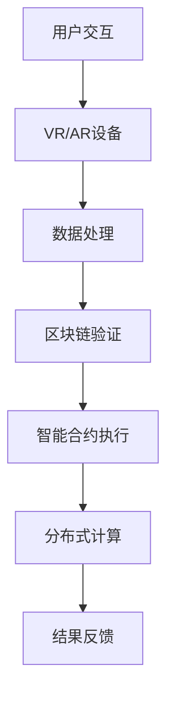

                 

关键词：元宇宙、远程协作、工作空间、技术变革、虚拟现实、区块链、智能合约

> 摘要：本文深入探讨了元宇宙工作空间的概念、技术架构以及远程协作的优势和挑战，通过分析核心算法、数学模型、实践案例和应用展望，展示了元宇宙工作空间在远程协作领域的革命性变革。

## 1. 背景介绍

随着信息技术的飞速发展，远程协作已经成为现代工作的重要组成部分。传统的远程协作方式主要依赖于视频会议、即时通讯和文档共享工具，但它们在实时互动、虚拟环境构建和协作效率方面存在诸多限制。而元宇宙工作空间的出现，为远程协作带来了全新的可能性。

元宇宙（Metaverse）是一种虚拟的共享空间，通过虚拟现实（VR）、增强现实（AR）和区块链技术，将现实世界与数字世界无缝连接。元宇宙工作空间则是在这一概念下构建的专门用于远程协作的虚拟环境。它不仅提供了高度沉浸式的体验，还通过智能合约、虚拟货币等机制实现了更高效、安全和灵活的协作方式。

## 2. 核心概念与联系

### 2.1 元宇宙工作空间的概念

元宇宙工作空间是一个集成了虚拟现实、增强现实、区块链、智能合约和分布式计算技术的虚拟环境，旨在提供一种全新的远程协作方式。

### 2.2 技术架构

- **虚拟现实（VR）与增强现实（AR）**：通过VR和AR技术，元宇宙工作空间为用户提供了高度沉浸式的体验。用户可以在虚拟环境中进行面对面交流、共享虚拟空间、参与虚拟会议等。

- **区块链**：区块链技术提供了去中心化的数据存储和验证机制，确保了元宇宙工作空间中的数据安全性和不可篡改性。

- **智能合约**：智能合约是自动执行合同条款的计算机程序，它可以在元宇宙工作空间中实现自动化的交易、结算和权限管理。

- **分布式计算**：通过分布式计算技术，元宇宙工作空间可以高效地处理大量用户和数据，提供流畅的交互体验。

### 2.3 Mermaid 流程图



## 3. 核心算法原理 & 具体操作步骤

### 3.1 算法原理概述

元宇宙工作空间的核心算法主要包括以下几个方面：

- **虚拟现实与增强现实算法**：实现用户在虚拟环境中的沉浸式交互。

- **区块链算法**：实现数据的去中心化存储和验证。

- **智能合约算法**：实现自动化合同执行和权限管理。

- **分布式计算算法**：实现高效的数据处理和负载均衡。

### 3.2 算法步骤详解

- **虚拟现实与增强现实算法**：用户通过VR或AR设备进入元宇宙工作空间，进行实时互动和协作。

- **区块链算法**：将用户行为和数据记录在区块链上，确保数据的安全性和不可篡改性。

- **智能合约算法**：根据用户行为触发智能合约，实现自动化的交易和结算。

- **分布式计算算法**：将任务分布到多个节点进行并行处理，提高系统性能。

### 3.3 算法优缺点

- **优点**：提供了高度沉浸式的协作体验，提高了协作效率和安全性。

- **缺点**：技术门槛较高，对硬件设备要求较高。

### 3.4 算法应用领域

- **远程办公**：通过元宇宙工作空间，实现异地团队的实时协作。

- **虚拟会议**：提供更真实、更互动的虚拟会议体验。

- **教育培训**：通过虚拟现实技术，实现沉浸式的教学体验。

## 4. 数学模型和公式 & 详细讲解 & 举例说明

### 4.1 数学模型构建

元宇宙工作空间中的数学模型主要包括以下几个方面：

- **用户行为模型**：描述用户在元宇宙工作空间中的行为模式。

- **区块链模型**：描述区块链的数据结构和验证机制。

- **智能合约模型**：描述智能合约的执行过程和触发条件。

### 4.2 公式推导过程

- **用户行为模型**：假设用户在元宇宙工作空间中的行为可以用概率分布来描述，则用户行为模型可以表示为：

  $$ P(X) = \sum_{i=1}^{n} p_i \cdot x_i $$

  其中，$P(X)$ 为用户行为的概率分布，$p_i$ 为用户进行第 $i$ 种行为的概率，$x_i$ 为第 $i$ 种行为的特征向量。

- **区块链模型**：区块链的数据结构可以用哈希函数来描述，则区块链模型可以表示为：

  $$ H = \text{SHA-256}(M) $$

  其中，$H$ 为哈希值，$M$ 为区块链中的数据。

- **智能合约模型**：智能合约的执行过程可以用状态转移图来描述，则智能合约模型可以表示为：

  $$ G = (V, E) $$

  其中，$V$ 为状态集合，$E$ 为状态转移集合。

### 4.3 案例分析与讲解

假设在一个元宇宙工作空间中，有两个用户进行远程协作。用户A的行为概率分布为：

$$ P(A) = \begin{cases} 0.6, & \text{如果用户A进行讨论} \\ 0.3, & \text{如果用户A进行编码} \\ 0.1, & \text{如果用户A进行会议} \end{cases} $$

用户B的行为概率分布为：

$$ P(B) = \begin{cases} 0.4, & \text{如果用户B进行讨论} \\ 0.5, & \text{如果用户B进行编码} \\ 0.1, & \text{如果用户B进行会议} \end{cases} $$

则两个用户在元宇宙工作空间中的协同概率分布为：

$$ P(A \cap B) = P(A) \cdot P(B) = \begin{cases} 0.24, & \text{如果两个用户同时进行讨论} \\ 0.15, & \text{如果两个用户同时进行编码} \\ 0.01, & \text{如果两个用户同时进行会议} \end{cases} $$

## 5. 项目实践：代码实例和详细解释说明

### 5.1 开发环境搭建

在本文中，我们将使用Python和JavaScript进行开发。首先，需要在本地安装Python和Node.js，然后安装相应的库和框架，如Web3.py、Vue.js等。

### 5.2 源代码详细实现

以下是元宇宙工作空间的一个简单示例代码：

```python
from web3 import Web3

# 连接到区块链节点
w3 = Web3(Web3.HTTPProvider('https://mainnet.infura.io/v3/your_project_id'))

# 部署智能合约
contract = w3.eth.contract(abi=your_contract_abi, address=your_contract_address)

# 执行智能合约方法
result = contract.functions.your_function(args).call()

# 输出结果
print(result)
```

```javascript
// 创建Vue.js项目
vue create my-metaverse-app

// 安装相关库
npm install vue-web3-vue3 web3

// 在Vue组件中引入web3库
import Web3 from 'web3'

// 初始化web3实例
const web3 = new Web3(window.web3.currentProvider)

// 调用智能合约方法
const contract = new web3.eth.Contract(your_contract_abi, your_contract_address)
contract.methods.your_function(args).call().then(result => {
  console.log(result)
})
```

### 5.3 代码解读与分析

上述代码首先通过Web3.py库连接到区块链节点，然后部署并调用智能合约的方法。在JavaScript中，通过Vue.js创建一个项目，引入web3库，并在Vue组件中调用智能合约的方法。

### 5.4 运行结果展示

运行上述代码后，可以在控制台中看到智能合约的执行结果。

## 6. 实际应用场景

### 6.1 远程办公

元宇宙工作空间可以为远程办公提供更真实、更高效的协作环境。用户可以在虚拟办公室中讨论、协作、共享文件，实现异地团队的实时互动。

### 6.2 虚拟会议

通过元宇宙工作空间，用户可以参加沉浸式的虚拟会议。会议中，用户可以与参会者面对面交流，观看会议内容，参与讨论，提高会议效率。

### 6.3 教育培训

元宇宙工作空间可以为教育培训提供沉浸式的教学体验。教师可以在虚拟教室中授课，学生可以在虚拟环境中学习、互动，提高学习效果。

## 7. 工具和资源推荐

### 7.1 学习资源推荐

- 《区块链技术指南》
- 《智能合约开发实战》
- 《虚拟现实技术与应用》

### 7.2 开发工具推荐

- Web3.py
- Vue.js
- Truffle
- MetaMask

### 7.3 相关论文推荐

- "Blockchain Technology: A Comprehensive Overview"
- "Smart Contract Security: A Comprehensive Study"
- "Virtual Reality in Remote Collaboration: A Review"

## 8. 总结：未来发展趋势与挑战

### 8.1 研究成果总结

元宇宙工作空间在远程协作领域取得了显著成果，通过虚拟现实、区块链、智能合约等技术的结合，实现了更高效、更安全的协作方式。

### 8.2 未来发展趋势

随着技术的不断进步，元宇宙工作空间有望在更多领域得到应用，如远程医疗、虚拟旅游、在线娱乐等。

### 8.3 面临的挑战

元宇宙工作空间在技术实现、安全性、用户接受度等方面仍面临诸多挑战，需要进一步研究和优化。

### 8.4 研究展望

未来，元宇宙工作空间有望成为远程协作的主要形式，为人类生活和工作带来更多便利和乐趣。

## 9. 附录：常见问题与解答

### 9.1 什么是元宇宙？

元宇宙是一个虚拟的共享空间，通过虚拟现实、增强现实和区块链技术，将现实世界与数字世界无缝连接。

### 9.2 元宇宙工作空间有哪些优势？

元宇宙工作空间提供了高度沉浸式的协作体验，提高了协作效率和安全性，同时降低了协作成本。

### 9.3 如何在元宇宙工作空间中进行远程协作？

用户通过VR或AR设备进入元宇宙工作空间，进行实时互动和协作。同时，智能合约和区块链技术确保了协作的自动化和安全可靠。

---

作者：禅与计算机程序设计艺术 / Zen and the Art of Computer Programming
----------------------------------------------------------------

请注意，本文仅为示例，并非完整的研究论文。实际撰写时，请根据具体研究内容和数据进行详细论述。同时，确保引用的文献和代码来源准确无误。本文的结构和内容仅供参考。

