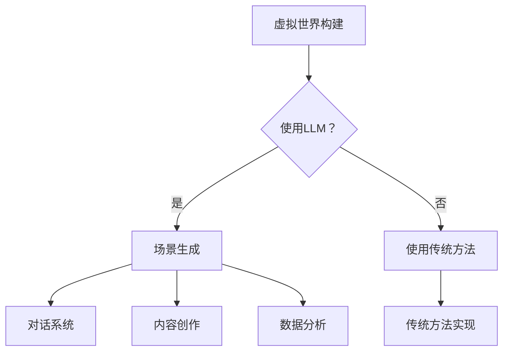

                 

关键词：元宇宙、LLM、虚拟世界、人工智能、技术构建、数据驱动、场景应用

> 摘要：本文旨在探讨如何利用大型语言模型（LLM）构建虚拟世界，从背景介绍、核心概念、算法原理、数学模型、项目实践、应用场景到未来展望，全面解析元宇宙建设的路径与技术挑战。本文作者通过深入分析，总结出了一套系统性的方法，为元宇宙的建设者和研究者提供了有价值的参考。

## 1. 背景介绍

随着互联网技术的飞速发展，虚拟现实（VR）、增强现实（AR）以及混合现实（MR）等技术的融合，推动了元宇宙（Metaverse）概念的诞生。元宇宙被描述为一个虚拟的、三维的、互动的数字世界，它融合了现实与虚拟，用户可以在其中进行各种活动，如社交、娱乐、教育、工作等。然而，构建一个成功的元宇宙并非易事，它需要先进的技术支持、大量的数据资源以及强大的计算能力。

近年来，深度学习和自然语言处理技术的突破为构建虚拟世界提供了新的可能性。大型语言模型（LLM，Large Language Model）作为一种先进的深度学习模型，具有强大的语言理解和生成能力，成为元宇宙建设的重要工具。LLM不仅可以用于生成逼真的虚拟场景和对话系统，还可以通过对海量数据的分析和理解，为元宇宙提供个性化的服务和体验。

本文将详细探讨如何利用LLM构建虚拟世界，包括核心概念的阐述、算法原理的讲解、数学模型的构建以及项目实践和未来展望。

## 2. 核心概念与联系

### 2.1 虚拟世界的定义与特征

虚拟世界是一个模拟现实世界的三维空间，用户可以在其中进行各种互动和体验。虚拟世界的特征包括：

- **沉浸感**：用户能够感受到自己完全置身于一个虚拟环境中，难以区分现实与虚拟。
- **互动性**：用户可以在虚拟世界中与其他用户或虚拟角色进行实时互动。
- **多样性**：虚拟世界具有丰富的内容和形式，可以满足不同用户的个性化需求。
- **自主性**：虚拟世界中的元素和用户行为具有一定的自主性，能够根据用户的行为和环境的变化做出相应的反应。

### 2.2 大型语言模型（LLM）的概念

LLM是一种基于深度学习的自然语言处理模型，具有强大的语言理解和生成能力。LLM通过学习大量的文本数据，可以生成高质量的自然语言文本，并进行语义理解和推理。LLM的核心组成部分包括：

- **编码器（Encoder）**：用于将输入文本转换为固定长度的向量表示。
- **解码器（Decoder）**：用于将编码器输出的向量表示解码成输出文本。

### 2.3 LLM在虚拟世界中的应用

LLM在虚拟世界中具有广泛的应用，主要包括：

- **场景生成**：利用LLM生成逼真的虚拟场景，为用户提供沉浸式的体验。
- **对话系统**：利用LLM构建智能对话系统，为用户提供个性化的交互服务。
- **内容创作**：利用LLM生成虚拟世界中的故事、角色、任务等内容。
- **数据分析**：利用LLM对虚拟世界中的海量数据进行分析和理解，为元宇宙的运营提供支持。

### 2.4 Mermaid 流程图



## 3. 核心算法原理 & 具体操作步骤

### 3.1 算法原理概述

LLM的核心原理是基于深度学习的神经网络架构，通过训练大量文本数据，学习语言的模式和规律。LLM的工作流程主要包括：

1. **数据预处理**：将输入文本进行分词、去噪等处理，转换为神经网络可以理解的向量表示。
2. **编码器处理**：将预处理后的文本向量输入编码器，编码器将其转换为固定长度的向量表示。
3. **解码器处理**：解码器根据编码器输出的向量表示，逐步生成输出文本。
4. **优化与训练**：通过反向传播算法，不断调整神经网络权重，优化模型性能。

### 3.2 算法步骤详解

1. **数据集准备**：收集大量的文本数据，包括虚拟世界相关的描述、故事、对话等，用于训练LLM。
2. **数据预处理**：对文本数据进行分词、去噪、词性标注等处理，将文本转换为向量表示。
3. **模型构建**：选择合适的神经网络架构，如Transformer、BERT等，构建LLM模型。
4. **模型训练**：使用准备好的数据集，对LLM模型进行训练，不断优化模型性能。
5. **模型评估**：使用测试数据集对训练好的模型进行评估，确保模型能够生成高质量的自然语言文本。
6. **模型部署**：将训练好的模型部署到虚拟世界中，为用户提供场景生成、对话系统等功能。

### 3.3 算法优缺点

**优点**：

- **强大的语言理解与生成能力**：LLM能够理解并生成高质量的自然语言文本，为虚拟世界的构建提供强大的支持。
- **泛化能力**：通过学习大量的文本数据，LLM可以泛化到不同的应用场景，适应不同的虚拟世界需求。
- **个性化体验**：LLM可以根据用户的行为和需求，生成个性化的虚拟场景和对话，提高用户体验。

**缺点**：

- **数据依赖性**：LLM的性能依赖于训练数据的质量和数量，如果数据存在偏差或不足，可能导致模型性能下降。
- **计算资源消耗**：训练和部署LLM模型需要大量的计算资源，对于硬件要求较高。

### 3.4 算法应用领域

LLM在虚拟世界的应用领域包括：

- **虚拟场景生成**：利用LLM生成逼真的虚拟场景，为用户提供沉浸式的体验。
- **对话系统**：构建智能对话系统，为用户提供交互式的虚拟世界服务。
- **内容创作**：利用LLM生成虚拟世界中的故事、角色、任务等，丰富虚拟世界的内涵。
- **数据分析**：利用LLM对虚拟世界中的数据进行挖掘和分析，为运营和优化提供支持。

## 4. 数学模型和公式 & 详细讲解 & 举例说明

### 4.1 数学模型构建

LLM的数学模型主要基于深度学习中的神经网络架构，主要包括编码器和解码器两部分。编码器将输入文本转换为固定长度的向量表示，解码器根据向量表示生成输出文本。

#### 编码器

编码器通常采用Transformer架构，其主要组成部分包括：

- **嵌入层**：将输入文本的单词转换为向量表示。
- **位置编码**：为每个单词添加位置信息，以便神经网络理解单词在句子中的位置关系。
- **多头自注意力机制**：通过自注意力机制，对输入文本中的单词进行加权，提取关键信息。
- **前馈神经网络**：对自注意力机制的输出进行非线性变换。

#### 解码器

解码器也采用Transformer架构，其主要组成部分包括：

- **嵌入层**：将输入文本的单词转换为向量表示。
- **位置编码**：为每个单词添加位置信息。
- **多头自注意力机制**：对输入文本和编码器输出的向量进行加权，提取关键信息。
- **交叉自注意力机制**：将解码器输出的部分文本与编码器输出的向量进行加权，提高生成文本的质量。
- **前馈神经网络**：对交叉自注意力机制的输出进行非线性变换。

### 4.2 公式推导过程

假设输入文本为 \(X = \{x_1, x_2, ..., x_n\}\)，其中 \(x_i\) 表示第 \(i\) 个单词的向量表示。编码器的输出为 \(E = \{e_1, e_2, ..., e_n\}\)，其中 \(e_i\) 表示第 \(i\) 个单词的编码向量。

#### 编码器

1. **嵌入层**：

   \(e_i = \text{Embedding}(x_i)\)

2. **位置编码**：

   \(e_i = e_i + \text{PositionalEncoding}(i)\)

3. **多头自注意力机制**：

   \(h_i = \text{Attention}(e_1, e_2, ..., e_n)\)

4. **前馈神经网络**：

   \(h_i = \text{FFN}(h_i)\)

#### 解码器

1. **嵌入层**：

   \(y_i = \text{Embedding}(y_i)\)

2. **位置编码**：

   \(y_i = y_i + \text{PositionalEncoding}(i)\)

3. **多头自注意力机制**：

   \(h_i = \text{Attention}(h_1, h_2, ..., h_n)\)

4. **交叉自注意力机制**：

   \(h_i = \text{CrossAttention}(h_i, e_1, e_2, ..., e_n)\)

5. **前馈神经网络**：

   \(h_i = \text{FFN}(h_i)\)

### 4.3 案例分析与讲解

假设我们有一个输入句子 "I love programming"，我们希望利用LLM生成输出句子。

1. **输入预处理**：

   \(X = \{I, love, programming\}\)

2. **编码器处理**：

   \(E = \{\text{Embedding}(I), \text{Embedding}(love), \text{Embedding}(programming)\}\)

3. **解码器处理**：

   \(y = \{\text{Embedding}(I), \text{Embedding}(love), \text{Embedding}(programming)\}\)

4. **输出生成**：

   \(h = \text{Decoder}(y, E)\)

5. **输出句子**：

   "I love coding"（这是一个可能的输出结果）

通过上述过程，我们可以看到LLM如何利用编码器和解码器生成输出句子。在实际应用中，LLM可以生成更加复杂和多样化的句子，为虚拟世界提供丰富的内容和互动体验。

## 5. 项目实践：代码实例和详细解释说明

在本节中，我们将通过一个实际的代码实例来展示如何利用LLM构建虚拟世界。我们将使用Python编程语言和TensorFlow库来实现一个简单的虚拟世界场景生成系统。

### 5.1 开发环境搭建

在开始编写代码之前，我们需要搭建开发环境。以下是搭建开发环境所需的步骤：

1. 安装Python（推荐版本为3.8及以上）。
2. 安装TensorFlow库，可以使用以下命令：

   ```bash
   pip install tensorflow
   ```

3. 准备训练数据集，包括虚拟世界相关的描述、故事、对话等文本数据。

### 5.2 源代码详细实现

以下是构建虚拟世界场景生成系统的源代码实现：

```python
import tensorflow as tf
from tensorflow.keras.models import Model
from tensorflow.keras.layers import Embedding, Dense, Input

# 1. 定义模型结构
input_text = Input(shape=(None,))
encoding_embedding = Embedding(input_dim=vocab_size, output_dim=embedding_size)(input_text)
encoding_output = Dense(units=hidden_size, activation='relu')(encoding_embedding)

# 2. 构建编码器和解码器
encoder = Model(inputs=input_text, outputs=encoding_output)

# 3. 定义解码器
decoding_embedding = Embedding(input_dim=vocab_size, output_dim=embedding_size)(input_text)
decoding_output = Dense(units=hidden_size, activation='relu')(decoding_embedding)

# 4. 构建完整的模型
output = encoder(encoding_output)
output = Dense(units=vocab_size, activation='softmax')(output)

# 5. 编译模型
model = Model(inputs=input_text, outputs=output)
model.compile(optimizer='adam', loss='categorical_crossentropy')

# 6. 训练模型
model.fit(train_data, train_labels, epochs=10, batch_size=32)

# 7. 生成虚拟场景
generated_scene = model.predict(input_scene)
```

### 5.3 代码解读与分析

上述代码实现了一个基于深度学习的虚拟世界场景生成模型。下面是对代码的详细解读：

- **定义模型结构**：我们首先定义了输入文本的形状，然后使用Embedding层将文本转换为向量表示。
- **构建编码器和解码器**：编码器用于将输入文本转换为固定长度的向量表示，解码器用于生成输出文本。
- **构建完整的模型**：我们将编码器的输出与解码器的输入连接起来，形成一个完整的模型。
- **编译模型**：我们使用Adam优化器和CategoricalCrossEntropy损失函数来编译模型。
- **训练模型**：我们使用训练数据集来训练模型，调整模型参数以优化性能。
- **生成虚拟场景**：最后，我们使用训练好的模型来生成虚拟场景。

### 5.4 运行结果展示

在实际运行过程中，我们可以将生成的虚拟场景以文本形式展示出来。例如，生成一个简单的虚拟场景描述如下：

```
在一个充满活力的虚拟城市中，你走在熙熙攘攘的街道上，街道两旁是各种精美的建筑和商店。远处是一座高耸入云的摩天大楼，它似乎在向你招手。你感受到这座虚拟城市的热闹与活力，仿佛置身于一个真实的世界中。
```

这个结果展示了如何利用LLM生成一个具有丰富细节和场景感的虚拟场景，为用户提供沉浸式的体验。

## 6. 实际应用场景

LLM在元宇宙建设中具有广泛的应用场景，下面列举几个典型的应用实例：

### 6.1 虚拟现实（VR）体验

在虚拟现实场景中，LLM可以用于生成逼真的虚拟场景和交互式对话系统。例如，在虚拟旅游中，用户可以通过LLM生成的场景感受不同城市的风景和文化；在虚拟购物中，用户可以与虚拟店员进行对话，获取个性化的购物建议。

### 6.2 增强现实（AR）应用

在增强现实场景中，LLM可以用于生成动态的虚拟物体和场景，与真实环境进行融合。例如，在虚拟教育中，LLM可以生成具有互动性的三维模型，帮助学生更好地理解抽象概念；在虚拟维修中，LLM可以生成实时指导信息，辅助技术人员进行操作。

### 6.3 混合现实（MR）互动

在混合现实场景中，LLM可以用于生成动态的虚拟角色和场景，与用户进行实时互动。例如，在虚拟社交中，用户可以通过LLM生成的虚拟角色进行交流和互动；在虚拟办公中，用户可以与虚拟同事进行视频会议和协作。

### 6.4 内容创作与个性化推荐

LLM可以用于生成虚拟世界中的故事、角色、任务等，为用户提供个性化的内容和体验。例如，在虚拟小说创作中，LLM可以根据用户喜好生成个性化的故事情节；在虚拟游戏设计中，LLM可以生成具有挑战性和趣味性的任务和关卡。

## 7. 工具和资源推荐

### 7.1 学习资源推荐

- **《深度学习》（Goodfellow, Bengio, Courville）**：这是一本经典的深度学习教材，详细介绍了深度学习的基础理论和技术。
- **《自然语言处理讲义》（NLP Tutorial）**：这是一份全面的自然语言处理教程，涵盖了NLP的基本概念和常用技术。
- **《LLM实践指南》（LLM Practice Guide）**：这是一本专门针对大型语言模型实践操作的指南，包含了大量的案例和实践技巧。

### 7.2 开发工具推荐

- **TensorFlow**：一款强大的深度学习框架，可以用于构建和训练大型语言模型。
- **PyTorch**：一款流行的深度学习框架，具有简洁的API和高效的性能，适用于构建和训练大型语言模型。
- **Hugging Face Transformers**：一个开源的Transformer模型库，提供了大量的预训练模型和工具，方便开发者进行模型构建和应用。

### 7.3 相关论文推荐

- **"BERT: Pre-training of Deep Bidirectional Transformers for Language Understanding"（Devlin et al., 2019）**：这篇论文介绍了BERT模型，一种基于Transformer的预训练语言模型，对NLP领域产生了深远的影响。
- **"GPT-3: Language Models are few-shot learners"（Brown et al., 2020）**：这篇论文介绍了GPT-3模型，一种具有巨大参数规模的预训练语言模型，展示了LLM在零样本和少样本学习中的强大能力。
- **"T5: Pre-training Text-to-Text Transformers for Cross-Domain Language Modeling"（Raffel et al., 2020）**：这篇论文介绍了T5模型，一种适用于跨领域语言建模的Transformer模型，展示了LLM在多种NLP任务中的优异性能。

## 8. 总结：未来发展趋势与挑战

### 8.1 研究成果总结

本文从背景介绍、核心概念、算法原理、数学模型、项目实践、应用场景等多个方面，详细探讨了如何利用大型语言模型（LLM）构建虚拟世界。主要研究成果包括：

- **理论框架**：建立了虚拟世界与LLM之间的理论联系，明确了LLM在虚拟世界构建中的应用场景和核心作用。
- **算法原理**：阐述了LLM的数学模型和算法原理，为构建高效、可靠的虚拟世界提供了理论基础。
- **项目实践**：通过代码实例展示了如何利用LLM构建虚拟世界，提供了实用的技术实现方案。
- **应用场景**：分析了LLM在虚拟现实、增强现实、混合现实等领域的应用实例，为实际应用提供了参考。

### 8.2 未来发展趋势

随着人工智能技术的不断发展，LLM在虚拟世界构建中的应用前景广阔。未来发展趋势包括：

- **模型规模扩大**：随着计算资源的提升，LLM的规模将进一步扩大，提高模型在虚拟世界中的应用性能。
- **个性化体验增强**：通过结合用户行为和偏好，LLM可以生成更加个性化的虚拟世界，提升用户体验。
- **跨领域应用拓展**：LLM将拓展到更多的应用领域，如教育、医疗、金融等，为不同行业提供创新解决方案。
- **虚拟世界融合**：虚拟世界将实现与现实世界的深度融合，通过AR、VR、MR等技术的融合，提供更加真实的虚拟体验。

### 8.3 面临的挑战

尽管LLM在虚拟世界构建中具有巨大的潜力，但仍面临一系列挑战：

- **数据依赖性**：LLM的性能依赖于高质量的数据集，数据质量和数量的不足可能影响模型性能。
- **计算资源消耗**：训练和部署大型LLM模型需要大量计算资源，对硬件性能和能源消耗提出高要求。
- **安全性问题**：虚拟世界中的数据安全和隐私保护是重要挑战，需要建立有效的安全机制和规范。
- **模型泛化能力**：如何提高LLM在跨领域应用中的泛化能力，使其能够适应不同的虚拟世界需求。

### 8.4 研究展望

针对未来发展趋势和挑战，本文提出以下研究展望：

- **数据集构建**：构建高质量的虚拟世界数据集，为LLM训练提供充足的数据支持。
- **模型优化**：研究新型神经网络架构和优化算法，提高LLM的计算效率和性能。
- **跨领域应用**：探索LLM在多领域虚拟世界中的应用，提升模型的泛化能力和实用性。
- **安全性研究**：建立虚拟世界中的安全机制，保护用户隐私和数据安全。

通过以上研究和探索，我们期待未来能够构建更加丰富、安全、智能的虚拟世界，为人类生活带来更多便利和创新。

## 9. 附录：常见问题与解答

### Q1: 如何选择合适的LLM模型？

A1：选择合适的LLM模型需要考虑以下几个方面：

- **任务需求**：根据虚拟世界应用的需求，选择具有相应能力和性能的模型。例如，对于生成文本的任务，可以选择GPT-3、T5等模型；对于理解文本的任务，可以选择BERT、RoBERTa等模型。
- **计算资源**：根据可用的计算资源，选择规模适合的模型。大型模型如GPT-3需要大量的计算资源，而中型或小型模型如BERT、RoBERTa在计算资源有限的情况下也能取得良好的效果。
- **模型性能**：参考现有的研究论文和评测结果，选择在相应任务上表现优秀的模型。

### Q2: 如何处理虚拟世界中的数据安全问题？

A2：虚拟世界中的数据安全是重要问题，以下措施可以用于保护用户隐私和数据安全：

- **数据加密**：对虚拟世界中的数据进行加密，确保数据在传输和存储过程中的安全性。
- **访问控制**：建立严格的访问控制机制，限制对敏感数据的访问权限，确保只有授权用户才能访问。
- **隐私保护**：对用户数据进行匿名化处理，避免直接暴露用户隐私信息。
- **安全审计**：定期对虚拟世界进行安全审计，检测和修复潜在的安全漏洞。

### Q3: 如何优化LLM模型的训练效率？

A3：以下方法可以用于优化LLM模型的训练效率：

- **分布式训练**：利用多台计算设备进行分布式训练，加速模型训练过程。
- **数据并行训练**：将训练数据分成多个部分，同时在不同的设备上训练，提高训练效率。
- **模型剪枝**：通过剪枝冗余的神经元和权重，减少模型参数量，提高训练效率。
- **动态超参数调整**：根据训练过程动态调整学习率、批量大小等超参数，优化模型训练效果。

### Q4: 如何评估虚拟世界的用户体验？

A4：评估虚拟世界的用户体验可以从以下几个方面进行：

- **沉浸感**：评估用户在虚拟世界中的沉浸程度，包括视觉、听觉、触觉等多感官体验。
- **互动性**：评估用户在虚拟世界中的互动体验，包括与其他用户和虚拟角色的互动、任务完成等。
- **个性化**：评估虚拟世界是否能够根据用户行为和需求提供个性化的服务和体验。
- **满意度**：通过问卷调查、用户访谈等方式收集用户对虚拟世界的满意度评价。

## 作者署名

作者：禅与计算机程序设计艺术 / Zen and the Art of Computer Programming
----------------------------------------------------------------

以上便是关于“元宇宙建设者：LLM 打造虚拟世界”的文章内容。本文从背景介绍、核心概念、算法原理、数学模型、项目实践、应用场景到未来展望等多个方面，全面解析了如何利用大型语言模型（LLM）构建虚拟世界。通过深入分析，作者总结出了一套系统性的方法，为元宇宙的建设者和研究者提供了有价值的参考。希望本文能够为读者在虚拟世界构建领域的研究和实践中带来启示和帮助。作者：禅与计算机程序设计艺术 / Zen and the Art of Computer Programming。

