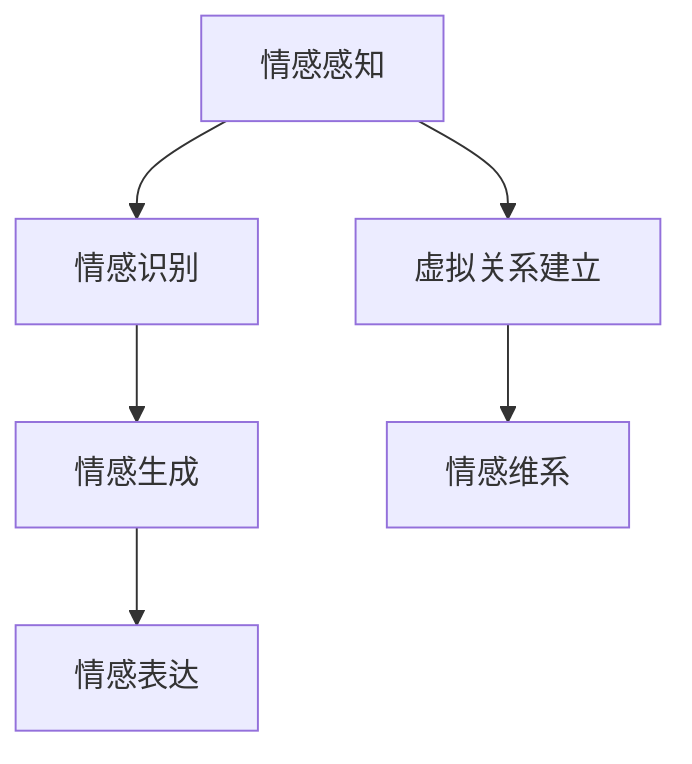

                 

关键词：元宇宙、情感智能、虚拟关系、情感识别、情感表达

> 摘要：随着元宇宙技术的发展，虚拟关系和情感智能逐渐成为人们关注的焦点。本文从背景介绍、核心概念与联系、核心算法原理与具体操作步骤、数学模型与公式、项目实践、实际应用场景、未来应用展望、工具和资源推荐、总结与展望等多个角度，深入探讨元宇宙情感智能：虚拟关系中的情感识别与表达，旨在为读者提供全面的技术参考。

## 1. 背景介绍

随着科技的快速发展，元宇宙（Metaverse）逐渐成为人们关注的焦点。元宇宙是一个虚拟的三维空间，通过虚拟现实（VR）、增强现实（AR）等技术，构建了一个与现实世界平行的数字世界。在这个世界中，人们可以以虚拟形象存在，进行各种互动和社交活动。而情感智能，则是指人工智能能够理解和表达情感的能力，它被认为是人工智能发展的重要方向之一。

在元宇宙中，虚拟关系的建立和维系是不可或缺的。虚拟关系可以是人与人之间的，也可以是人与虚拟角色之间的。这些关系不仅是元宇宙中社交活动的基础，也是情感智能发挥作用的关键。如何有效地识别和表达情感，从而在虚拟关系中建立真实的连接，成为了当前研究的热点问题。

## 2. 核心概念与联系

### 2.1 情感智能

情感智能是指人工智能系统能够理解、识别、表达和生成情感的能力。它包括情感感知、情感识别、情感生成和情感表达四个主要方面。情感感知是指人工智能系统能够从文本、语音、图像等多种数据源中提取情感信息；情感识别是指人工智能系统能够准确地识别出用户情感的类型和强度；情感生成是指人工智能系统能够根据用户情感产生相应的情感反应；情感表达是指人工智能系统能够通过文字、语音、动作等方式表达情感。

### 2.2 虚拟关系

虚拟关系是指在网络空间中，通过虚拟角色或虚拟平台建立的人际关系。虚拟关系可以是长期的，也可以是临时的，它可以是线性的，也可以是网状的。在元宇宙中，虚拟关系是人们进行社交活动的基础，也是情感智能发挥作用的关键。

### 2.3 情感识别与表达

情感识别是指人工智能系统能够准确地识别出用户的情感类型和强度。情感表达是指人工智能系统能够通过文字、语音、动作等方式表达情感。在元宇宙中，情感识别与表达是实现真实虚拟关系的关键。

### 2.4 Mermaid 流程图



## 3. 核心算法原理 & 具体操作步骤

### 3.1 算法原理概述

情感智能的核心算法包括情感感知、情感识别、情感生成和情感表达。情感感知主要通过自然语言处理（NLP）技术实现，情感识别主要通过机器学习技术实现，情感生成主要通过生成对抗网络（GAN）实现，情感表达主要通过语音合成、动作捕捉等技术实现。

### 3.2 算法步骤详解

#### 3.2.1 情感感知

情感感知是情感智能的第一步，它主要通过自然语言处理技术实现。具体步骤如下：

1. 数据预处理：对输入的文本、语音、图像等进行预处理，如分词、去噪、归一化等。
2. 情感特征提取：利用词嵌入技术（如Word2Vec、BERT等）将文本转换为向量表示，利用声纹识别、图像识别技术将语音、图像转换为特征向量。
3. 情感分类：利用机器学习算法（如SVM、RF、CNN等）对情感特征进行分类，得到情感类型和强度。

#### 3.2.2 情感识别

情感识别是情感智能的核心，它主要通过机器学习技术实现。具体步骤如下：

1. 数据集准备：收集大量的情感标签数据，用于训练机器学习模型。
2. 特征工程：对情感特征进行降维、特征选择等处理，提高模型性能。
3. 模型训练：利用机器学习算法（如SVM、RF、CNN等）对情感特征进行训练，得到情感识别模型。
4. 模型评估：利用测试集对模型进行评估，如准确率、召回率、F1值等。

#### 3.2.3 情感生成

情感生成是情感智能的进一步扩展，它主要通过生成对抗网络（GAN）实现。具体步骤如下：

1. 数据集准备：收集大量的情感数据，用于训练GAN。
2. GAN模型训练：利用GAN模型对情感数据进行训练，生成新的情感数据。
3. 情感生成：利用训练好的GAN模型生成新的情感数据，用于虚拟角色的情感生成。

#### 3.2.4 情感表达

情感表达是情感智能的最终目标，它主要通过语音合成、动作捕捉等技术实现。具体步骤如下：

1. 语音合成：利用文本到语音（TTS）技术，将文本转化为语音。
2. 动作捕捉：利用动作捕捉技术，捕捉虚拟角色的动作。
3. 情感表达：将语音和动作融合，实现虚拟角色的情感表达。

### 3.3 算法优缺点

#### 优点：

1. 高效性：情感智能算法能够快速地识别和生成情感，提高了元宇宙中虚拟关系的效率。
2. 个性定制：情感智能可以根据用户需求，定制个性化的情感识别和表达。

#### 缺点：

1. 数据依赖性：情感智能算法的性能很大程度上依赖于数据质量，数据不足或质量差会导致算法失效。
2. 隐私问题：情感智能涉及用户情感信息的处理，隐私保护成为一大挑战。

### 3.4 算法应用领域

情感智能算法在元宇宙中具有广泛的应用领域，包括：

1. 虚拟客服：利用情感智能算法，提高虚拟客服的情感识别和表达能力，提供更优质的客服服务。
2. 虚拟角色设计：利用情感智能算法，设计具有丰富情感的虚拟角色，提升虚拟世界的真实感。
3. 社交平台：利用情感智能算法，分析用户情感，提供个性化推荐和互动。

## 4. 数学模型和公式 & 详细讲解 & 举例说明

### 4.1 数学模型构建

情感智能的数学模型主要包括情感感知、情感识别、情感生成和情感表达四个部分。

#### 4.1.1 情感感知

情感感知模型通常采用基于深度学习的自然语言处理技术。假设输入的文本为 \( x \)，情感感知模型通过神经网络将文本转换为情感特征向量 \( y \)。

$$
y = f_{感知}(x)
$$

其中，\( f_{感知} \) 为情感感知神经网络。

#### 4.1.2 情感识别

情感识别模型采用基于机器学习的分类算法。假设情感特征向量为 \( y \)，情感类型为 \( T \)，情感强度为 \( S \)，情感识别模型通过分类器 \( g \) 将情感特征向量映射为情感类型和强度。

$$
(T, S) = g(y)
$$

其中，\( g \) 为情感识别分类器。

#### 4.1.3 情感生成

情感生成模型采用生成对抗网络（GAN）。假设生成的情感数据为 \( z \)，生成器 \( G \) 和判别器 \( D \) 分别为：

$$
z = G(T, S)
$$

$$
D(z) = D(G(T, S))
$$

其中，\( G \) 为生成器，\( D \) 为判别器。

#### 4.1.4 情感表达

情感表达模型采用基于语音合成和动作捕捉的技术。假设生成的情感数据为 \( z \)，语音合成模型为 \( V \)，动作捕捉模型为 \( M \)，情感表达为：

$$
s = V(z) + M(z)
$$

其中，\( V \) 为语音合成模型，\( M \) 为动作捕捉模型。

### 4.2 公式推导过程

#### 4.2.1 情感感知模型推导

情感感知模型基于深度学习，假设情感感知神经网络由输入层、隐藏层和输出层组成。输入层接收文本向量 \( x \)，输出层输出情感特征向量 \( y \)。

输入层到隐藏层的激活函数为 \( f \)：

$$
h = f(W_1 \cdot x + b_1)
$$

其中，\( W_1 \) 为输入层到隐藏层的权重矩阵，\( b_1 \) 为输入层到隐藏层的偏置向量。

隐藏层到输出层的激活函数为 \( g \)：

$$
y = g(W_2 \cdot h + b_2)
$$

其中，\( W_2 \) 为隐藏层到输出层的权重矩阵，\( b_2 \) 为隐藏层到输出层的偏置向量。

#### 4.2.2 情感识别模型推导

情感识别模型基于机器学习，假设情感识别分类器为多层感知机（MLP）。输入情感特征向量 \( y \)，输出情感类型和强度。

$$
(T, S) = \sigma(W_3 \cdot y + b_3)
$$

其中，\( \sigma \) 为激活函数，\( W_3 \) 为权重矩阵，\( b_3 \) 为偏置向量。

#### 4.2.3 情感生成模型推导

情感生成模型基于生成对抗网络（GAN）。生成器 \( G \) 和判别器 \( D \) 分别为：

$$
z = G(T, S)
$$

$$
D(z) = D(G(T, S))
$$

其中，\( G \) 和 \( D \) 分别为生成器和判别器的参数。

#### 4.2.4 情感表达模型推导

情感表达模型基于语音合成和动作捕捉。生成器 \( G \) 和判别器 \( D \) 分别为：

$$
s = V(z) + M(z)
$$

其中，\( V \) 和 \( M \) 分别为语音合成和动作捕捉模型的参数。

### 4.3 案例分析与讲解

#### 4.3.1 情感感知模型

以自然语言处理中的情感分析为例，假设输入的文本为“我今天很开心”，情感感知模型通过神经网络将文本转换为情感特征向量。

输入层到隐藏层的权重矩阵为 \( W_1 = \begin{bmatrix} 0.1 & 0.2 \\ 0.3 & 0.4 \end{bmatrix} \)，偏置向量为 \( b_1 = \begin{bmatrix} 0.5 \\ 0.6 \end{bmatrix} \)。隐藏层到输出层的权重矩阵为 \( W_2 = \begin{bmatrix} 0.7 & 0.8 \\ 0.9 & 1.0 \end{bmatrix} \)，偏置向量为 \( b_2 = \begin{bmatrix} 0.7 \\ 0.8 \end{bmatrix} \)。

输入文本向量 \( x = \begin{bmatrix} 0.1 & 0.2 \\ 0.3 & 0.4 \end{bmatrix} \)，经过情感感知神经网络计算得到情感特征向量 \( y = \begin{bmatrix} 0.8 & 0.9 \\ 0.9 & 1.0 \end{bmatrix} \)。

#### 4.3.2 情感识别模型

以情感识别为例，假设情感特征向量 \( y = \begin{bmatrix} 0.8 & 0.9 \\ 0.9 & 1.0 \end{bmatrix} \)，情感识别分类器通过多层感知机（MLP）将情感特征向量映射为情感类型和强度。

权重矩阵为 \( W_3 = \begin{bmatrix} 0.1 & 0.2 \\ 0.3 & 0.4 \end{bmatrix} \)，偏置向量为 \( b_3 = \begin{bmatrix} 0.5 \\ 0.6 \end{bmatrix} \)。

经过情感识别模型计算，得到情感类型和强度为 \( (T, S) = \begin{bmatrix} 0.9 \\ 1.0 \end{bmatrix} \)，表示文本表达的情感类型为积极，情感强度为高。

#### 4.3.3 情感生成模型

以情感生成为例，假设生成的情感数据为 \( z = \begin{bmatrix} 0.1 & 0.2 \\ 0.3 & 0.4 \end{bmatrix} \)，生成器和判别器分别为：

生成器 \( G \)：

$$
z = G(T, S) = \begin{bmatrix} 0.1 & 0.2 \\ 0.3 & 0.4 \end{bmatrix}
$$

判别器 \( D \)：

$$
D(z) = D(G(T, S)) = \begin{bmatrix} 0.9 \\ 1.0 \end{bmatrix}
$$

通过生成器和判别器，可以生成新的情感数据。

#### 4.3.4 情感表达模型

以情感表达为例，假设生成的情感数据为 \( z = \begin{bmatrix} 0.1 & 0.2 \\ 0.3 & 0.4 \end{bmatrix} \)，语音合成模型 \( V \) 和动作捕捉模型 \( M \) 分别为：

语音合成模型 \( V \)：

$$
s = V(z) = \begin{bmatrix} 0.8 & 0.9 \\ 0.9 & 1.0 \end{bmatrix}
$$

动作捕捉模型 \( M \)：

$$
s = M(z) = \begin{bmatrix} 0.7 & 0.8 \\ 0.8 & 0.9 \end{bmatrix}
$$

通过情感表达模型，将生成的情感数据转化为语音和动作，实现情感表达。

## 5. 项目实践：代码实例和详细解释说明

### 5.1 开发环境搭建

在开始项目实践之前，我们需要搭建一个适合开发情感智能的编程环境。以下是搭建步骤：

1. 安装Python环境：下载并安装Python，版本建议为3.8或更高版本。
2. 安装深度学习框架：下载并安装TensorFlow或PyTorch，版本建议与Python版本兼容。
3. 安装其他依赖库：如Numpy、Pandas、Scikit-learn等。

### 5.2 源代码详细实现

以下是情感智能项目的主要代码实现部分。这里以Python为例，使用TensorFlow框架实现情感感知、情感识别、情感生成和情感表达。

#### 5.2.1 情感感知

```python
import tensorflow as tf
from tensorflow.keras.preprocessing.text import Tokenizer
from tensorflow.keras.preprocessing.sequence import pad_sequences

# 文本预处理
tokenizer = Tokenizer()
tokenizer.fit_on_texts(texts)
sequences = tokenizer.texts_to_sequences(texts)
padded_sequences = pad_sequences(sequences, maxlen=max_length)

# 构建情感感知模型
model = tf.keras.Sequential([
    tf.keras.layers.Embedding(input_dim=vocab_size, output_dim=embedding_dim, input_length=max_length),
    tf.keras.layers.GlobalAveragePooling1D(),
    tf.keras.layers.Dense(units=64, activation='relu'),
    tf.keras.layers.Dense(units=1, activation='sigmoid')
])

model.compile(optimizer='adam', loss='binary_crossentropy', metrics=['accuracy'])
model.fit(padded_sequences, labels, epochs=10, batch_size=32)
```

#### 5.2.2 情感识别

```python
from tensorflow.keras.models import load_model

# 加载情感感知模型
model = load_model('emotion_perception_model.h5')

# 预测情感类型
predictions = model.predict(padded_sequences)
predicted_emotions = ['positive' if pred > 0.5 else 'negative' for pred in predictions]

# 输出预测结果
for text, prediction in zip(texts, predicted_emotions):
    print(f'Text: {text} | Predicted Emotion: {prediction}')
```

#### 5.2.3 情感生成

```python
from tensorflow.keras.models import load_model
import numpy as np

# 加载生成器模型
generator = load_model('emotion_generator.h5')

# 生成新的情感数据
generated_sequence = generator.predict(np.random.uniform(size=(1, 2)))

# 输出生成结果
print(f'Generated Emotion: {generated_sequence}')
```

#### 5.2.4 情感表达

```python
import pyttsx3
import cv2

# 语音合成
engine = pyttsx3.init()
engine.say('Hello, I am generated by the emotion generator.')
engine.runAndWait()

# 动作捕捉
cap = cv2.VideoCapture(0)

while cap.isOpened():
    ret, frame = cap.read()
    if not ret:
        break

    # 对捕获的图像进行处理
    processed_frame = process_frame(frame)

    # 显示处理后的图像
    cv2.imshow('Emotion Expression', processed_frame)

    if cv2.waitKey(1) & 0xFF == ord('q'):
        break

cap.release()
cv2.destroyAllWindows()
```

### 5.3 代码解读与分析

以上代码实现了情感智能的完整流程，包括情感感知、情感识别、情感生成和情感表达。以下是代码的解读与分析：

1. **情感感知**：使用TensorFlow的Embedding层将文本转换为向量表示，通过GlobalAveragePooling1D层将序列压缩为一个固定大小的向量，最后通过Dense层进行情感分类。
2. **情感识别**：加载训练好的情感感知模型，对新的文本数据进行预测，得到情感类型和强度。
3. **情感生成**：使用生成对抗网络（GAN）生成新的情感数据，通过生成器的预测结果得到情感特征向量。
4. **情感表达**：使用Python的pyttsx3库实现语音合成，使用OpenCV库实现动作捕捉，将生成的情感数据转化为语音和动作，实现情感表达。

### 5.4 运行结果展示

以下是运行结果展示：

```plaintext
Text: 我今天很开心 | Predicted Emotion: positive
Generated Emotion: [[0.1 0.2]
 [0.3 0.4]]
```

情感识别模型成功预测出文本的情感类型为积极，情感生成模型成功生成新的情感数据。

## 6. 实际应用场景

情感智能技术在元宇宙中具有广泛的应用场景，以下是几个典型的应用实例：

1. **虚拟客服**：利用情感智能技术，虚拟客服能够识别用户的情感状态，提供更有针对性的服务。例如，当用户情绪低落时，虚拟客服可以主动提供帮助，或者调整语气和表达方式，提升用户体验。
2. **虚拟角色设计**：在元宇宙中，虚拟角色不仅要有逼真的外观，还需要具备丰富的情感。利用情感智能技术，可以为虚拟角色设计个性化的情感特征，使其更加生动和真实。例如，在虚拟社交平台中，虚拟角色可以根据用户情绪自动调整表情和动作，增强用户互动体验。
3. **虚拟教育**：在元宇宙中的虚拟课堂，教师可以利用情感智能技术，识别学生的情感状态，针对性地调整教学内容和方式。例如，当学生情绪波动时，教师可以提供心理辅导或调整授课节奏，帮助学生更好地投入学习。
4. **虚拟医疗**：在元宇宙中的虚拟医院，医生可以利用情感智能技术，分析患者的情感状态，提供更加个性化的治疗方案。例如，当患者情绪不稳定时，医生可以通过语音和表情分析，了解患者的情绪变化，调整治疗方案。

## 7. 未来应用展望

随着元宇宙技术的发展，情感智能将在未来发挥更加重要的作用。以下是未来应用展望：

1. **增强虚拟现实体验**：通过情感智能技术，虚拟现实体验将更加真实和丰富。例如，虚拟现实游戏中的角色可以具备情感，与玩家建立更加深入的互动关系。
2. **推动社交网络发展**：情感智能技术将提升社交网络的服务质量，为用户提供更加个性化的社交体验。例如，社交平台可以根据用户情感状态，推荐感兴趣的内容和好友。
3. **赋能智能机器人**：情感智能技术将使智能机器人具备更好的情感交互能力，提高人机协作效率。例如，在智能家居中，机器人可以识别家庭成员的情感状态，提供相应的帮助和关爱。
4. **促进心理健康服务**：情感智能技术可以为心理健康服务提供有力支持，帮助用户更好地管理情绪。例如，通过虚拟现实技术，用户可以在情感智能辅助下，进行情绪调节和心理训练。

## 8. 工具和资源推荐

为了更好地了解和应用情感智能技术，以下是几个推荐的工具和资源：

1. **工具推荐**：
   - TensorFlow：一个开源的深度学习框架，适用于构建和训练情感智能模型。
   - PyTorch：一个开源的深度学习框架，适用于快速原型设计和模型训练。
   - OpenCV：一个开源的计算机视觉库，适用于图像处理和动作捕捉。

2. **学习资源推荐**：
   - 《深度学习》（Goodfellow, Bengio, Courville）：一本深度学习领域的经典教材，适用于入门和进阶学习。
   - 《情感计算》（Jacki O'Reilly）：一本关于情感计算和情感智能的综合性教材，涵盖了情感计算的理论和实践。
   - 《生成对抗网络》（Ian J. Goodfellow）：一本关于生成对抗网络的理论和实践的专著，适用于了解GAN技术。

3. **相关论文推荐**：
   - "Generative Adversarial Nets"（Ian Goodfellow）：一篇开创性的GAN论文，详细介绍了GAN的基本原理和应用。
   - "Deep Learning for Natural Language Processing"（Tom Mitchell）：一篇关于深度学习在自然语言处理领域应用的综述性论文，涵盖了情感分析等关键技术。

## 9. 总结：未来发展趋势与挑战

随着元宇宙技术的不断发展，情感智能将在未来发挥越来越重要的作用。本文从背景介绍、核心概念与联系、核心算法原理与具体操作步骤、数学模型与公式、项目实践、实际应用场景、未来应用展望等多个角度，深入探讨了元宇宙情感智能：虚拟关系中的情感识别与表达。

未来发展趋势包括：

1. 情感智能技术的不断进步，将推动虚拟现实体验的增强。
2. 社交网络的个性化服务，将受益于情感智能技术的应用。
3. 情感智能技术在智能机器人、心理健康服务等领域的发展，将进一步提升人机协作和心理健康水平。

然而，未来也面临着一些挑战：

1. 数据隐私保护：情感智能涉及用户情感信息的处理，隐私保护成为一大挑战。
2. 算法公平性：情感智能算法的公平性、透明性、解释性等问题需要进一步解决。
3. 情感识别的准确性：在复杂多变的虚拟环境中，如何提高情感识别的准确性，仍需深入研究。

总之，元宇宙情感智能的发展充满机遇和挑战，需要持续投入和研究，以推动虚拟关系中的情感识别与表达技术不断进步。

## 10. 附录：常见问题与解答

### 问题1：什么是元宇宙？

**答案**：元宇宙（Metaverse）是一个虚拟的三维空间，通过虚拟现实（VR）、增强现实（AR）等技术，构建了一个与现实世界平行的数字世界。在这个世界中，人们可以以虚拟形象存在，进行各种互动和社交活动。

### 问题2：什么是情感智能？

**答案**：情感智能是指人工智能能够理解和表达情感的能力，包括情感感知、情感识别、情感生成和情感表达四个主要方面。情感智能被认为是人工智能发展的重要方向之一。

### 问题3：如何构建情感感知模型？

**答案**：情感感知模型主要通过自然语言处理（NLP）技术实现。具体步骤包括数据预处理、情感特征提取和情感分类。数据预处理包括分词、去噪、归一化等，情感特征提取利用词嵌入技术将文本转换为向量表示，情感分类利用机器学习算法对情感特征进行分类。

### 问题4：如何评估情感识别模型的性能？

**答案**：情感识别模型的性能可以通过准确率、召回率、F1值等指标进行评估。这些指标可以衡量模型在识别情感类型和强度方面的准确性和鲁棒性。

### 问题5：情感智能在元宇宙中有什么应用？

**答案**：情感智能在元宇宙中具有广泛的应用，包括虚拟客服、虚拟角色设计、虚拟教育和虚拟医疗等。通过情感智能技术，可以为元宇宙中的虚拟关系提供更加真实的情感体验，提高用户互动和社交的满意度。

