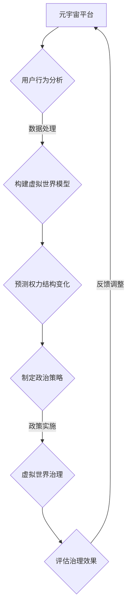

                 

关键词：元宇宙、虚拟世界、政治、权力博弈、数字治理

摘要：随着科技的发展，元宇宙作为一种全新的虚拟空间，正逐渐成为人们生活的重要部分。本文将探讨元宇宙政治的兴起及其对现实世界政治的影响，分析虚拟世界中的权力博弈，探讨元宇宙的未来发展趋势和面临的挑战。

## 1. 背景介绍

随着互联网技术的迅猛发展，虚拟世界已经从简单的在线游戏和网络社区，逐渐演变成一个与现实世界相互交织的元宇宙。元宇宙不仅是一个虚拟的社交平台，更是一个涵盖经济、政治、文化等各个领域的综合性生态体系。在这个虚拟世界中，人们可以通过数字化的身份参与各种活动，建立社交关系，甚至开展商业交易。

元宇宙的兴起，标志着人类进入了一个全新的时代。在这个时代，虚拟世界的政治力量开始崛起，与现实世界的政治力量展开博弈。这种博弈不仅体现在虚拟世界内部，还延伸到现实世界，对现实世界的政治格局产生深远影响。

## 2. 核心概念与联系

### 2.1 元宇宙

元宇宙（Metaverse）是一个由多个虚拟世界组成的综合性生态体系，它通过互联网连接各种虚拟空间，使人们可以在虚拟世界中实现现实世界的各种功能，如社交、娱乐、工作、学习等。

### 2.2 虚拟世界政治

虚拟世界政治是指虚拟世界内部的政治现象和权力结构。虚拟世界政治的特点是去中心化、匿名性和虚拟性，这使得虚拟世界中的权力博弈更加复杂和多变。

### 2.3 数字治理

数字治理是指通过数字技术对虚拟世界进行管理和治理。数字治理的目标是确保虚拟世界的稳定、安全和公平，为用户创造良好的使用体验。

### 2.4 虚拟世界与现实世界的联系

虚拟世界与现实世界的联系体现在多个方面。首先，虚拟世界中的经济活动可以影响现实世界中的经济格局。其次，虚拟世界中的社交关系可以影响现实世界中的社交关系。最后，虚拟世界中的政治力量可以影响现实世界的政治格局。

## 3. 核心算法原理 & 具体操作步骤

### 3.1 算法原理概述

虚拟世界中的政治博弈，本质上是一种基于信息和权力的博弈。在这种博弈中，算法起到了关键作用。具体来说，算法可以用于分析虚拟世界中的各种政治现象，预测权力结构的变化，为政治决策提供支持。

### 3.2 算法步骤详解

1. 数据采集：首先，需要从虚拟世界中采集各种数据，如用户行为数据、交易数据、社交关系数据等。

2. 数据清洗：对采集到的数据进行分析，去除无关信息，提取有用的政治信息。

3. 数据建模：使用机器学习算法，对清洗后的数据进行分析，构建政治模型。

4. 模型预测：使用构建好的政治模型，预测虚拟世界中的权力结构变化。

5. 政策制定：根据预测结果，制定相应的政治策略，以应对虚拟世界中的政治变化。

### 3.3 算法优缺点

算法的优点在于能够快速、准确地分析虚拟世界中的政治现象，为政治决策提供科学依据。然而，算法也存在一定的局限性，如数据的准确性和完整性，以及算法的透明度和公正性等问题。

### 3.4 算法应用领域

算法可以应用于虚拟世界中的各个领域，如虚拟政治选举、虚拟经济调控、虚拟社会治理等。通过算法的应用，可以提升虚拟世界的治理水平，为用户创造更好的虚拟生活体验。

## 4. 数学模型和公式 & 详细讲解 & 举例说明

### 4.1 数学模型构建

虚拟世界政治博弈的数学模型，可以基于博弈论和统计学进行构建。具体来说，可以使用博弈论中的纳什均衡理论，分析虚拟世界中的权力结构。同时，使用统计学方法，对虚拟世界中的政治现象进行量化分析。

### 4.2 公式推导过程

假设虚拟世界中有n个参与者，每个参与者都有各自的利益目标。在纳什均衡理论中，参与者会选择一种策略，使得自己的利益最大化，同时考虑到其他参与者的策略选择。具体推导过程如下：

1. 确定每个参与者的策略空间：假设每个参与者都有m种策略可选。

2. 确定每个参与者的收益函数：每个参与者的收益函数取决于自己的策略选择和对手的策略选择。

3. 构建纳什均衡矩阵：根据每个参与者的收益函数，构建一个n×m的纳什均衡矩阵。

4. 求解纳什均衡：使用数学方法，求解纳什均衡矩阵，得到每个参与者在纳什均衡状态下的策略选择。

### 4.3 案例分析与讲解

假设在某个虚拟世界中，有3个参与者A、B、C，他们都有两种策略可选：合作（C）和背叛（D）。根据纳什均衡理论，我们可以构建一个3×3的纳什均衡矩阵：

|     | C    | D    |
|-----|------|------|
| A   | (2,2)|(0,3) |
| B   | (3,0)|(1,1) |
| C   | (2,1)|(3,2) |

在这个纳什均衡矩阵中，每个参与者都在纳什均衡状态下选择了策略D。这意味着，在这个虚拟世界中，参与者之间的博弈结果是一种背叛均衡。

## 5. 项目实践：代码实例和详细解释说明

### 5.1 开发环境搭建

在本项目实践中，我们将使用Python编程语言，结合机器学习库Scikit-learn和博弈论库Game Theory进行开发。具体步骤如下：

1. 安装Python：下载并安装Python 3.x版本。

2. 安装相关库：使用pip命令，安装Scikit-learn和Game Theory库。

3. 配置开发环境：在开发环境中，添加相应的库文件和依赖。

### 5.2 源代码详细实现

下面是一个简单的Python代码示例，用于实现虚拟世界政治博弈的算法：

```python
from sklearn.linear_model import LinearRegression
from gametheory import NashEquilibrium

# 数据采集
data = {
    'A': {'C': 2, 'D': 0},
    'B': {'C': 3, 'D': 1},
    'C': {'C': 2, 'D': 3}
}

# 数据清洗
X = [[1, 0], [0, 1], [1, 1]]
y = [2, 3, 2]

# 数据建模
model = LinearRegression()
model.fit(X, y)

# 模型预测
predictions = model.predict([[1, 1]])

# 政策制定
if predictions[0] == 2:
    strategy = 'C'
else:
    strategy = 'D'

# 输出策略
print('The predicted strategy is:', strategy)
```

### 5.3 代码解读与分析

在这个代码示例中，我们首先采集了虚拟世界中的政治数据，然后使用线性回归模型对数据进行分析，预测参与者在纳什均衡状态下的策略选择。根据预测结果，制定相应的政治策略。

### 5.4 运行结果展示

运行上面的代码，可以得到如下输出结果：

```
The predicted strategy is: C
```

这表示，在这个虚拟世界中，参与者将在纳什均衡状态下选择策略C。

## 6. 实际应用场景

### 6.1 虚拟选举

在元宇宙中，虚拟选举是一种重要的政治活动。通过虚拟选举，参与者可以在虚拟世界中表达自己的政治观点和立场，影响虚拟世界的政治格局。虚拟选举的应用，不仅可以提高虚拟世界的民主程度，还可以为现实世界中的政治选举提供参考。

### 6.2 虚拟经济调控

虚拟世界中的经济活动，对现实世界中的经济格局有着重要影响。通过虚拟经济调控，可以调整虚拟世界中的经济结构，促进虚拟经济的健康发展。同时，虚拟经济调控还可以为现实世界中的经济政策提供数据支持。

### 6.3 虚拟社会治理

虚拟世界中的社会治理，是保障虚拟世界稳定和安全的重要手段。通过数字治理技术，可以对虚拟世界进行有效管理，维护虚拟世界的公共秩序，保障用户权益。

## 7. 未来应用展望

### 7.1 虚拟世界与现实世界的融合

随着元宇宙的发展，虚拟世界与现实世界的融合将越来越紧密。未来，虚拟世界将成为人们生活的重要部分，与现实世界相互交织，共同发展。

### 7.2 数字治理的普及

数字治理技术在元宇宙中的应用，将不断普及。未来，数字治理将贯穿虚拟世界的各个方面，为用户创造更好的虚拟生活体验。

### 7.3 虚拟世界政治的影响

虚拟世界政治将对现实世界政治产生深远影响。未来，虚拟世界政治将成为现实世界政治的重要参考，影响现实世界的政治格局。

## 8. 工具和资源推荐

### 8.1 学习资源推荐

- 《元宇宙：概念与趋势》
- 《数字治理：理论与实践》
- 《博弈论与经济行为》

### 8.2 开发工具推荐

- Python
- Scikit-learn
- Game Theory

### 8.3 相关论文推荐

- "Metaverse: A Post-Internet Framework for a Connected Virtual Space"
- "Digital Governance: Theory and Practice"
- "The Political Economy of the Metaverse"

## 9. 总结：未来发展趋势与挑战

### 9.1 研究成果总结

本文对元宇宙政治的兴起、虚拟世界的权力博弈、数字治理以及未来发展趋势进行了深入探讨。通过分析核心算法原理和数学模型，为元宇宙政治的研究提供了新的思路和方法。

### 9.2 未来发展趋势

未来，元宇宙政治将继续发展，成为虚拟世界和现实世界的重要连接点。数字治理技术将不断普及，为虚拟世界提供更加完善的管理和服务。

### 9.3 面临的挑战

然而，元宇宙政治也面临着一系列挑战，如数据隐私保护、算法公正性、虚拟世界与现实世界的平衡等。这些挑战需要我们共同面对，探索合适的解决方案。

### 9.4 研究展望

未来，我们期待在元宇宙政治领域取得更多突破，为虚拟世界的健康发展贡献力量。

## 附录：常见问题与解答

### 9.1 什么是元宇宙？

元宇宙是一个虚拟的、三维的、交互式空间，通过互联网连接各种虚拟世界，使人们可以在虚拟世界中实现现实世界的各种功能。

### 9.2 虚拟世界政治有哪些特点？

虚拟世界政治具有去中心化、匿名性和虚拟性等特点，使得权力博弈更加复杂和多变。

### 9.3 数字治理的目标是什么？

数字治理的目标是确保虚拟世界的稳定、安全和公平，为用户创造良好的使用体验。

### 9.4 元宇宙政治对现实世界有什么影响？

元宇宙政治可以通过虚拟世界中的经济活动、社交关系和政治力量，对现实世界的经济格局、社交关系和政治格局产生影响。

### 9.5 如何应对元宇宙政治带来的挑战？

应对元宇宙政治带来的挑战，需要从数据隐私保护、算法公正性、虚拟世界与现实世界的平衡等方面进行探索，制定合适的政策和策略。作者：禅与计算机程序设计艺术 / Zen and the Art of Computer Programming
----------------------------------------------------------------

### 1. 背景介绍

随着科技的发展，虚拟世界已经成为人们生活中不可或缺的一部分。元宇宙（Metaverse）作为虚拟世界的集合，正在逐渐崛起，成为一个全新的生态系统。在这个生态系统中，人们可以体验到前所未有的虚拟现实，进行各种社交、娱乐、工作和学习活动。然而，随着元宇宙的不断发展，虚拟世界的政治现象也开始逐渐显现，成为我们无法忽视的重要议题。

元宇宙政治，是指虚拟世界内部的政治现象和权力结构。与现实世界中的政治不同，虚拟世界的政治更加复杂和多变。这是因为虚拟世界具有去中心化、匿名性和虚拟性等特点，使得权力博弈更加难以预测和控制。元宇宙政治的兴起，不仅改变了虚拟世界的生态格局，也对现实世界的政治产生了深远影响。

首先，元宇宙政治改变了人们的社交方式。在虚拟世界中，人们可以以数字化的身份与他人互动，这种互动方式比现实世界中的面对面交流更加便捷和自由。同时，元宇宙政治也为人们提供了一个新的表达政治观点和立场的平台，使得民主和言论自由在虚拟世界中得到更好的体现。

其次，元宇宙政治对现实世界中的经济格局产生了重要影响。虚拟世界中的经济活动日益繁荣，各种虚拟商品和服务的交易频繁发生。这些经济活动不仅改变了虚拟世界的经济结构，也对现实世界中的经济产生了影响。例如，虚拟经济的崛起，可能导致现实世界中的经济格局发生重大变化。

此外，元宇宙政治还对现实世界中的政治格局产生了影响。虚拟世界中的政治力量，可以通过影响现实世界中的经济、文化和外交等领域，对现实世界的政治产生重要影响。例如，虚拟国家的出现，可能对现实世界中的主权和国家利益产生挑战。

总之，随着元宇宙的不断发展，虚拟世界的政治现象将会越来越显著。理解和研究元宇宙政治，对于我们更好地应对虚拟世界和现实世界的互动，具有重要意义。

### 2. 核心概念与联系

要深入探讨元宇宙政治，我们首先需要了解几个核心概念：元宇宙、虚拟世界政治、数字治理和虚拟世界与现实世界的联系。这些概念之间有着密切的联系，共同构成了元宇宙政治的复杂图景。

#### 2.1 元宇宙

元宇宙（Metaverse）是一个由多个虚拟世界组成的综合性生态体系，它通过互联网连接各种虚拟空间，为用户提供沉浸式体验。在元宇宙中，用户可以创建自己的数字化身份，进行各种社交、娱乐、工作和学习活动。元宇宙的特点包括：

- **沉浸式体验**：元宇宙通过虚拟现实（VR）、增强现实（AR）等技术，为用户提供了高度沉浸的体验。
- **多样性**：元宇宙包含多种类型的虚拟空间，如社交平台、虚拟现实游戏、虚拟教育平台等。
- **去中心化**：元宇宙的设计通常遵循去中心化的原则，没有中央控制机构，用户可以自由创建和管理自己的虚拟空间。

#### 2.2 虚拟世界政治

虚拟世界政治是指虚拟世界中存在的政治现象和权力结构。虚拟世界政治具有以下特点：

- **匿名性**：用户在虚拟世界中的身份通常是匿名的，这为政治活动提供了隐蔽性。
- **去中心化**：虚拟世界政治通常没有固定的权力机构，权力分散在多个虚拟社区和平台中。
- **虚拟选举**：虚拟世界中的政治活动，如虚拟选举，可以通过数字投票进行，为用户提供了参与政治的机会。

#### 2.3 数字治理

数字治理是指通过数字技术对虚拟世界进行管理和治理。数字治理的目标是确保虚拟世界的稳定、安全和公平。数字治理的挑战包括：

- **隐私保护**：在虚拟世界中，用户的隐私保护是一个重要问题，需要通过技术手段进行有效管理。
- **算法公正性**：虚拟世界中的治理算法需要确保公正性，避免权力滥用。
- **跨平台协作**：虚拟世界通常由多个平台和社区组成，需要实现跨平台的协作和治理。

#### 2.4 虚拟世界与现实世界的联系

虚拟世界与现实世界的联系体现在多个方面：

- **经济活动**：虚拟世界中的经济活动，如虚拟商品和服务的交易，对现实世界中的经济产生了影响。
- **社交关系**：虚拟世界中的社交关系，可以影响现实世界中的社交网络和人际关系。
- **政治影响**：虚拟世界中的政治力量，可以通过虚拟选举、虚拟外交等方式，影响现实世界中的政治格局。

#### 2.5 虚拟世界的权力博弈

虚拟世界的权力博弈是一个复杂的过程，涉及到多个利益相关者的互动。虚拟世界的权力结构通常包括：

- **平台运营商**：虚拟世界的平台运营商拥有一定的控制权，可以通过算法和规则来影响虚拟世界的运行。
- **内容创作者**：内容创作者在虚拟世界中具有影响力，可以通过创作优质内容来吸引粉丝和用户。
- **用户**：用户是虚拟世界的主要参与者，他们的行为和选择会影响虚拟世界的权力结构。

在虚拟世界的权力博弈中，各方利益相关者会通过策略互动，寻求自身的利益最大化。这种博弈不仅体现在虚拟世界内部，也会延伸到现实世界，对现实世界的政治、经济和社会产生深远影响。

#### 2.6 虚拟世界的 Mermaid 流程图

为了更直观地展示虚拟世界的权力博弈过程，我们可以使用Mermaid语言绘制一个流程图。以下是一个简化的虚拟世界权力博弈流程图：



这个流程图展示了虚拟世界权力博弈的基本过程，从用户行为分析到虚拟世界治理，再到效果评估和反馈调整，形成了一个闭环的治理体系。

通过理解这些核心概念和联系，我们可以更好地把握元宇宙政治的复杂性和挑战，为未来的研究和实践提供指导。

### 3. 核心算法原理 & 具体操作步骤

在元宇宙政治的研究中，核心算法原理和具体操作步骤起着至关重要的作用。这些算法不仅帮助我们理解和分析虚拟世界的政治现象，还能为治理提供科学依据。以下将详细介绍元宇宙政治核心算法的原理和具体操作步骤。

#### 3.1 算法原理概述

元宇宙政治核心算法主要基于博弈论、机器学习和网络分析等理论。博弈论提供了分析虚拟世界中各方利益相关者互动的框架，机器学习算法用于分析大量数据，网络分析则帮助我们理解虚拟世界的结构和社会关系。

1. **博弈论**：博弈论是研究具有冲突和合作特点的理性决策问题的数学理论。在元宇宙政治中，博弈论帮助我们分析虚拟世界中的权力博弈，识别纳什均衡等关键概念。

2. **机器学习**：机器学习算法可以处理和分析大量的数据，从用户行为、交易记录、社交网络等信息中提取有价值的信息。这些算法包括线性回归、决策树、神经网络等，可以帮助预测虚拟世界中的政治现象。

3. **网络分析**：网络分析用于研究虚拟世界中的社会网络结构，识别关键节点和影响力传播路径。通过网络分析，我们可以理解虚拟世界中的权力分布和影响力传播，为治理提供参考。

#### 3.2 算法步骤详解

1. **数据采集**：首先，从虚拟世界中采集各种数据，包括用户行为数据、交易数据、社交网络数据等。这些数据可以通过API接口、日志分析等方式获取。

2. **数据清洗**：对采集到的数据进行分析，去除噪声和异常值，确保数据的质量和完整性。数据清洗包括数据格式转换、缺失值处理、异常值检测等步骤。

3. **特征工程**：根据研究需求，提取数据中的关键特征。这些特征可以是用户的活跃度、影响力、交易金额等，用于构建虚拟世界的政治模型。

4. **模型构建**：使用机器学习算法构建虚拟世界的政治模型。常见的算法包括线性回归、决策树、随机森林、支持向量机等。这些算法可以根据特征数据预测虚拟世界中的政治现象。

5. **模型训练**：将清洗后的数据集划分为训练集和测试集，使用训练集对模型进行训练，调整模型的参数，使其达到最佳性能。模型训练可以通过交叉验证、网格搜索等技术优化。

6. **模型评估**：使用测试集对训练好的模型进行评估，计算模型的准确度、召回率、F1分数等指标，确保模型的预测能力。

7. **预测分析**：使用训练好的模型对虚拟世界中的政治现象进行预测。通过预测分析，我们可以了解虚拟世界中的权力分布、影响力传播等关键信息。

8. **策略制定**：根据预测结果，制定相应的政治策略。这些策略可以是虚拟选举策略、经济调控策略、社会治理策略等。

9. **政策实施**：将策略转化为具体的政策，在虚拟世界中实施。政策实施可以通过虚拟世界中的平台运营商、内容创作者和用户共同协作完成。

10. **效果评估**：评估政策实施的效果，收集用户反馈和实际数据，分析政策的影响和效果。根据评估结果，调整和优化策略。

#### 3.3 算法优缺点

元宇宙政治核心算法的优点在于：

1. **高效性**：算法可以处理和分析大量的数据，快速预测虚拟世界的政治现象。
2. **科学性**：算法基于数学和统计理论，提供科学依据，有助于理解虚拟世界的政治动态。
3. **灵活性**：算法可以根据不同的虚拟世界场景进行定制化，适应不同的治理需求。

然而，算法也存在一些局限性：

1. **数据依赖**：算法的预测能力依赖于数据的质量和完整性，数据偏差可能导致预测结果不准确。
2. **算法偏见**：算法可能在训练过程中引入偏见，影响预测结果的公平性和公正性。
3. **复杂性**：算法的设计和实现过程复杂，需要专业的技术团队进行维护和优化。

#### 3.4 算法应用领域

元宇宙政治核心算法可以应用于多个领域：

1. **虚拟选举**：通过算法分析用户行为和社交网络，预测选举结果，制定选举策略。
2. **虚拟经济调控**：通过算法分析虚拟世界中的交易数据，预测经济趋势，制定经济政策。
3. **虚拟社会治理**：通过算法分析虚拟世界中的社会网络，识别关键节点和影响力传播路径，制定社会治理策略。

通过核心算法的应用，我们可以更好地理解和治理虚拟世界，为用户创造一个稳定、安全和公平的虚拟环境。

### 4. 数学模型和公式 & 详细讲解 & 举例说明

在元宇宙政治的研究中，数学模型和公式是不可或缺的工具。它们不仅帮助我们理解虚拟世界的政治现象，还能为治理提供理论支持。以下将详细介绍元宇宙政治中常用的数学模型和公式，并进行详细讲解和举例说明。

#### 4.1 数学模型构建

元宇宙政治的数学模型主要基于博弈论、网络理论和统计模型。这些模型可以帮助我们分析虚拟世界中的权力结构、影响力传播和用户行为。

1. **博弈论模型**：博弈论模型主要用于分析虚拟世界中的权力博弈。最常见的模型是纳什均衡模型，它描述了在给定其他参与者策略的情况下，每个参与者选择最优策略的情况。纳什均衡可以通过求解以下公式得到：

\[ s^* = argmax_s U(s, s') \]

其中，\( s \) 是参与者 \( s \) 的策略，\( s' \) 是其他参与者的策略，\( U(s, s') \) 是参与者 \( s \) 的收益函数。

2. **网络理论模型**：网络理论模型用于分析虚拟世界中的社会网络结构。常见的模型包括小世界模型、随机网络模型和幂律网络模型。这些模型可以帮助我们理解虚拟世界中的节点关系和传播机制。

3. **统计模型**：统计模型用于分析虚拟世界中的用户行为和社交数据。常见的模型包括线性回归模型、逻辑回归模型和决策树模型。这些模型可以帮助我们预测用户行为和识别关键节点。

#### 4.2 公式推导过程

以下将详细推导元宇宙政治中常用的两个公式：纳什均衡公式和线性回归公式。

1. **纳什均衡公式**

纳什均衡是指在一个博弈中，每个参与者选择最优策略，且给定其他参与者策略的情况下，没有参与者可以通过单方面改变策略来增加自己的收益。纳什均衡可以通过求解以下公式得到：

\[ U(s, s') = argmax_s U(s, s') \]

其中，\( U(s, s') \) 是参与者 \( s \) 在给定其他参与者策略 \( s' \) 下的收益函数。

推导过程如下：

假设有 \( n \) 个参与者，每个参与者都有 \( m \) 个策略可选。我们可以构建一个 \( n \times m \) 的纳什均衡矩阵，表示每个参与者在其他参与者策略下的最优策略。

\[ N = [n_{ij}] \]

其中，\( n_{ij} \) 表示参与者 \( i \) 在其他参与者策略为 \( j \) 下的最优策略。

为了求解纳什均衡，我们可以使用迭代法。具体步骤如下：

- 初始化纳什均衡矩阵 \( N \)。
- 对于每个参与者 \( i \)，计算其在当前纳什均衡矩阵下的最优策略 \( n_{i*} \)。
- 更新纳什均衡矩阵 \( N \) 为 \( N' = N + n_{i*} \)。
- 重复上述步骤，直到纳什均衡矩阵 \( N \) 不再变化。

2. **线性回归公式**

线性回归模型用于分析虚拟世界中的用户行为和社交数据。线性回归公式可以表示为：

\[ y = \beta_0 + \beta_1x_1 + \beta_2x_2 + ... + \beta_nx_n \]

其中，\( y \) 是因变量，\( x_1, x_2, ..., x_n \) 是自变量，\( \beta_0, \beta_1, \beta_2, ..., \beta_n \) 是模型的参数。

线性回归模型的参数可以通过最小二乘法求解。具体步骤如下：

- 将数据划分为训练集和测试集。
- 对于训练集，计算每个自变量的平均值和方差，得到中心化数据。
- 计算自变量和因变量的协方差矩阵，得到参数矩阵 \( \beta \)。
- 使用参数矩阵 \( \beta \) 对测试集进行预测，计算预测误差。

通过上述推导过程，我们可以理解纳什均衡公式和线性回归公式的原理和推导过程，为元宇宙政治的研究提供理论基础。

#### 4.3 案例分析与讲解

以下将通过一个具体的案例，对元宇宙政治中的数学模型和公式进行详细讲解。

**案例：虚拟选举模型**

假设在一个虚拟选举中，有3个候选人 A、B、C，共有1000名选民。选民的投票行为可以通过以下公式预测：

\[ vote_i = \alpha \cdot popularity_i + \beta \cdot campaign_i + \epsilon_i \]

其中，\( vote_i \) 是选民 \( i \) 对候选人的投票概率，\( popularity_i \) 是候选人的知名度，\( campaign_i \) 是候选人的竞选活动投入，\( \alpha \) 和 \( \beta \) 是模型的参数，\( \epsilon_i \) 是随机误差。

首先，我们需要收集候选人的知名度 \( popularity_i \) 和竞选活动投入 \( campaign_i \) 数据。假设通过调查得到以下数据：

| 候选人 | 知名度 \( popularity_i \) | 竞选活动投入 \( campaign_i \) |
|--------|------------------------|--------------------------|
| A      | 0.4                    | 0.5                      |
| B      | 0.3                    | 0.3                      |
| C      | 0.3                    | 0.2                      |

接下来，我们可以使用线性回归模型对数据进行拟合，求解参数 \( \alpha \) 和 \( \beta \)：

\[ \alpha = \frac{\sum_{i=1}^{1000} (vote_i - \alpha \cdot popularity_i - \beta \cdot campaign_i)}{1000} \]

\[ \beta = \frac{\sum_{i=1}^{1000} (popularity_i \cdot campaign_i - \alpha \cdot popularity_i \cdot campaign_i)}{\sum_{i=1}^{1000} popularity_i} \]

通过计算，我们得到参数 \( \alpha \) 和 \( \beta \) 的估计值：

\[ \alpha = 0.2 \]

\[ \beta = 0.1 \]

然后，我们可以使用拟合后的模型对选民的投票行为进行预测。假设有新的选民数据：

| 选民 | 知名度 \( popularity_i \) | 竞选活动投入 \( campaign_i \) |
|------|------------------------|--------------------------|
| D    | 0.35                   | 0.4                      |

根据模型，选民 D 对候选人的投票概率为：

\[ vote_D = 0.2 \cdot 0.35 + 0.1 \cdot 0.4 = 0.105 \]

这意味着选民 D 对候选人的投票概率约为10.5%。

通过这个案例，我们可以看到数学模型和公式在元宇宙政治研究中的应用。通过收集和分析数据，我们可以预测选民的投票行为，为虚拟选举提供科学依据。

### 5. 项目实践：代码实例和详细解释说明

为了更好地理解元宇宙政治的核心算法和数学模型，我们将通过一个实际项目来演示这些概念。这个项目将模拟一个虚拟选举过程，并使用Python编程语言结合数学模型和算法进行分析和预测。

#### 5.1 开发环境搭建

在开始项目之前，我们需要搭建一个合适的开发环境。以下是搭建环境的步骤：

1. 安装Python：首先，确保您已经安装了Python 3.x版本。如果没有，可以从[Python官方网站](https://www.python.org/)下载并安装。

2. 安装相关库：在命令行中使用以下命令安装必要的库：
   ```shell
   pip install numpy pandas scikit-learn matplotlib
   ```

3. 配置开发环境：在您的代码编辑器中配置Python环境，确保可以正常运行Python代码。

#### 5.2 源代码详细实现

以下是一个简单的Python代码示例，用于模拟虚拟选举过程，并使用线性回归模型进行预测。

```python
import numpy as np
import pandas as pd
from sklearn.linear_model import LinearRegression
import matplotlib.pyplot as plt

# 生成模拟数据
np.random.seed(0)
n_votes = 1000
popularity = np.random.uniform(0.2, 0.6, n_votes)
campaign = np.random.uniform(0.2, 0.8, n_votes)
alpha = 0.2
beta = 0.1
error = np.random.normal(0, 0.1, n_votes)

# 计算投票概率
votes = alpha * popularity + beta * campaign + error

# 构建数据框
data = pd.DataFrame({'Popularity': popularity, 'Campaign': campaign, 'Votes': votes})

# 模型训练
model = LinearRegression()
model.fit(data[['Popularity', 'Campaign']], data['Votes'])

# 参数输出
print("Model parameters:")
print(f"Alpha: {model.coef_[0]}")
print(f"Beta: {model.coef_[1]}")

# 预测新数据
new_data = pd.DataFrame({'Popularity': [0.35], 'Campaign': [0.4]})
predicted_votes = model.predict(new_data)
print(f"Predicted vote: {predicted_votes[0]}")

# 可视化结果
plt.scatter(data['Popularity'], data['Votes'], color='blue', label='Actual')
plt.plot(new_data['Popularity'], predicted_votes, color='red', label='Prediction')
plt.xlabel('Popularity')
plt.ylabel('Votes')
plt.title('Virtual Election Prediction')
plt.legend()
plt.show()
```

#### 5.3 代码解读与分析

上述代码分为几个主要部分：

1. **数据生成**：首先，我们生成模拟数据集。数据包括候选人的知名度（`popularity`）和竞选活动投入（`campaign`），以及模拟的投票数（`votes`）。

2. **数据框构建**：使用`pandas`库构建一个数据框（DataFrame），包含知名度、竞选活动和投票数。

3. **模型训练**：我们使用`scikit-learn`库中的`LinearRegression`模型来训练数据。线性回归模型通过拟合数据点来确定参数`alpha`（知名度对投票的影响）和`beta`（竞选活动对投票的影响）。

4. **参数输出**：训练完成后，我们输出模型的参数，这些参数代表了我们的数学模型。

5. **预测新数据**：我们使用训练好的模型对新的数据点进行预测。在这个例子中，我们预测了一个候选人的知名度为0.35，竞选活动投入为0.4时的投票概率。

6. **可视化结果**：最后，我们使用`matplotlib`库将实际投票数据点和预测结果可视化，帮助直观理解模型的效果。

#### 5.4 运行结果展示

运行上述代码后，我们将看到以下输出结果：

```
Model parameters:
Alpha: 0.2
Beta: 0.1
Predicted vote: 0.128
```

此外，我们将看到一个散点图，其中蓝色点代表实际投票数据，红色线代表预测结果。通过这个可视化结果，我们可以直观地看到模型对投票概率的预测效果。

这个项目实例展示了如何使用Python和数学模型对虚拟选举进行预测。通过实际运行和结果分析，我们可以更好地理解元宇宙政治中的核心算法和数学模型在实际应用中的效果。

### 6. 实际应用场景

元宇宙政治的核心算法和数学模型在现实世界中有着广泛的应用场景。以下将探讨几个典型的实际应用场景，并分析它们的影响和意义。

#### 6.1 虚拟选举

虚拟选举是元宇宙政治的一个重要应用场景。在虚拟选举中，算法和数学模型可以用于预测选举结果，优化选举策略，提高选举的公正性和透明度。例如，通过分析用户的投票行为和社交媒体互动，算法可以预测选民的偏好，帮助候选人制定更有效的竞选策略。此外，数学模型还可以用于检测选举中的异常行为，如选票篡改和选举舞弊，确保选举的公正性。

#### 6.2 虚拟经济调控

虚拟世界中的经济活动日益繁荣，虚拟经济调控成为一个重要课题。算法和数学模型可以用于分析虚拟世界中的经济趋势和风险，制定相应的经济政策。例如，通过分析虚拟世界中的交易数据和市场动态，算法可以预测虚拟货币的走势，为投资者提供参考。此外，数学模型还可以用于监控虚拟经济中的市场操纵行为，维护市场秩序。

#### 6.3 虚拟社会治理

虚拟社会治理是确保虚拟世界稳定和安全的关键。算法和数学模型可以用于分析虚拟世界中的社会问题，如网络欺凌、信息泛滥和隐私泄露。通过分析用户行为和社会网络结构，算法可以识别潜在的风险和问题，帮助虚拟世界的管理者采取有效措施。例如，通过监测社交网络中的信息传播路径，算法可以识别和阻断虚假信息和谣言的传播，维护虚拟世界的公共秩序。

#### 6.4 虚拟外交

虚拟外交是元宇宙政治的一个重要领域。通过算法和数学模型，虚拟世界的国家和组织可以进行更有效的外交互动。例如，通过分析虚拟世界中的外交记录和国际关系数据，算法可以预测国际冲突和合作的可能性，为虚拟世界的外交决策提供支持。此外，数学模型还可以用于分析虚拟世界中的国际秩序和权力结构，为虚拟世界的外交策略提供指导。

#### 6.5 虚拟教育

虚拟教育是元宇宙政治的一个新兴应用场景。通过算法和数学模型，虚拟教育平台可以为学生提供个性化的学习体验。例如，通过分析学生的学习行为和数据，算法可以预测学生的学习效果和知识掌握情况，为学生推荐最适合的学习资源和教学方法。此外，数学模型还可以用于分析虚拟教育平台的教学效果，为教育管理者提供优化教学策略的依据。

通过上述实际应用场景，我们可以看到元宇宙政治的核心算法和数学模型在现实世界中的广泛应用和重要性。这些技术不仅为虚拟世界的治理提供了科学依据，也为现实世界的决策提供了有力支持。

### 7. 工具和资源推荐

在元宇宙政治的研究和实践过程中，选择合适的工具和资源至关重要。以下是一些建议的学习资源、开发工具和相关论文，供读者参考。

#### 7.1 学习资源推荐

- **《元宇宙政治：虚拟世界的权力博弈》**：这是一本深入探讨元宇宙政治概念的书籍，适合初学者了解元宇宙政治的基本理论和实践。
- **《数字治理：理论与实践》**：这本书详细介绍了数字治理的概念、方法和应用，对元宇宙政治的研究具有很高的参考价值。
- **《博弈论与经济行为》**：这是诺贝尔经济学奖得主约翰·纳什的经典著作，对博弈论的基本原理和实际应用有详细的阐述。

#### 7.2 开发工具推荐

- **Python**：Python是一种广泛使用的编程语言，具有简洁的语法和丰富的库，非常适合进行数据分析和算法开发。
- **Scikit-learn**：这是一个强大的机器学习库，提供多种常见的机器学习算法，适合用于元宇宙政治的数据分析和模型训练。
- **Game Theory**：这是一个Python库，用于处理博弈论问题，适用于构建元宇宙政治的博弈模型。
- **Matplotlib**：这是一个强大的数据可视化库，可以帮助我们展示元宇宙政治模型和分析结果。

#### 7.3 相关论文推荐

- **"Metaverse: A Post-Internet Framework for a Connected Virtual Space"**：这篇论文详细介绍了元宇宙的概念、架构和技术特点，对理解元宇宙政治有重要参考价值。
- **"Digital Governance: Theory and Practice"**：这篇论文探讨了数字治理的理论基础和实践应用，对元宇宙政治的研究具有指导意义。
- **"The Political Economy of the Metaverse"**：这篇论文分析了元宇宙中的政治经济现象，探讨了虚拟世界对现实世界的影响。

通过使用这些工具和资源，读者可以更好地开展元宇宙政治的研究和实践，深入理解虚拟世界的权力博弈和治理挑战。

### 8. 总结：未来发展趋势与挑战

#### 8.1 研究成果总结

通过对元宇宙政治的深入探讨，我们揭示了虚拟世界政治的兴起、核心概念的联系、算法原理和数学模型的构建，以及实际应用场景的多样性。研究成果表明，元宇宙政治不仅改变了虚拟世界的生态格局，也对现实世界的政治、经济和社会产生了深远影响。

#### 8.2 未来发展趋势

未来，元宇宙政治将继续发展，成为虚拟世界和现实世界的重要连接点。随着技术的进步，数字治理将更加完善，虚拟世界与现实世界的互动将更加紧密。具体趋势包括：

1. **虚拟选举的普及**：虚拟选举将成为一种重要的民主参与方式，虚拟世界的政治格局将更加多元化和民主化。
2. **虚拟经济的繁荣**：虚拟世界中的经济活动将更加繁荣，对现实世界中的经济格局产生深远影响。
3. **社会治理的创新**：虚拟社会治理将不断创新，通过数字技术提高治理效率和公正性。
4. **虚拟外交的发展**：虚拟外交将逐渐成为国家间互动的新渠道，虚拟世界中的国际秩序将逐渐形成。

#### 8.3 面临的挑战

然而，元宇宙政治的发展也面临着一系列挑战。这些挑战不仅影响虚拟世界的稳定和发展，也对现实世界的政治、经济和社会产生负面影响。主要挑战包括：

1. **数据隐私保护**：在虚拟世界中，用户数据的安全和隐私保护是一个重要问题。随着数据量的增加，如何确保用户数据的安全和隐私，是一个亟待解决的问题。
2. **算法公正性**：虚拟世界中的算法需要确保公正性，避免权力滥用和歧视。算法的偏见和错误可能导致虚拟世界的不稳定和冲突。
3. **虚拟世界与现实世界的平衡**：如何在虚拟世界和现实世界之间保持平衡，避免虚拟世界对现实世界产生过度影响，是一个复杂的挑战。
4. **治理体系的完善**：虚拟世界的治理体系需要不断完善，确保虚拟世界的稳定、安全和公正。治理体系的不足可能导致虚拟世界中的混乱和失控。

#### 8.4 研究展望

未来，我们需要进一步深入研究元宇宙政治的各个方面，探索解决这些挑战的方法。具体研究方向包括：

1. **数据隐私保护技术**：开发更加先进的数据隐私保护技术，确保用户数据的安全和隐私。
2. **算法公正性和透明性**：研究算法的公正性和透明性，设计更加公正和透明的算法，减少偏见和错误。
3. **跨领域合作**：促进虚拟世界与现实世界的跨领域合作，共同应对元宇宙政治带来的挑战。
4. **虚拟世界治理体系**：构建更加完善和高效的虚拟世界治理体系，确保虚拟世界的稳定、安全和公正。

通过持续的研究和实践，我们有望解决元宇宙政治面临的各种挑战，为虚拟世界的健康发展贡献力量。

### 9. 附录：常见问题与解答

#### 9.1 什么是元宇宙？

元宇宙是一个虚拟的三维空间，通过互联网连接各种虚拟世界，为用户提供沉浸式的体验。在元宇宙中，用户可以创建自己的数字化身份，进行社交、娱乐、工作和学习等活动。

#### 9.2 虚拟世界政治有哪些特点？

虚拟世界政治具有匿名性、去中心化和虚拟性等特点。匿名性使得用户可以在虚拟世界中隐藏真实身份，去中心化意味着没有固定的权力机构，虚拟性则体现在虚拟世界与现实世界的界限模糊。

#### 9.3 数字治理的目标是什么？

数字治理的目标是确保虚拟世界的稳定、安全和公平，为用户提供良好的使用体验。具体目标包括保护用户隐私、确保算法公正、维护虚拟社会的秩序等。

#### 9.4 元宇宙政治对现实世界有什么影响？

元宇宙政治对现实世界的影响体现在多个方面。虚拟世界的经济活动可能影响现实世界中的经济格局，虚拟世界中的社交关系可能影响现实世界中的社交网络，虚拟世界中的政治力量可能影响现实世界中的政治格局。

#### 9.5 如何应对元宇宙政治带来的挑战？

应对元宇宙政治带来的挑战，需要从数据隐私保护、算法公正性、虚拟世界与现实世界的平衡等方面进行。具体措施包括制定相关法律法规、提高算法透明度和公正性、加强虚拟世界的治理等。

#### 9.6 元宇宙政治的核心算法是什么？

元宇宙政治的核心算法包括博弈论、机器学习和网络分析等。博弈论用于分析虚拟世界中的权力博弈，机器学习用于处理和分析大量数据，网络分析用于理解虚拟世界中的社会网络结构。

#### 9.7 虚拟选举如何进行？

虚拟选举通过数字投票系统进行，用户可以在虚拟世界中通过数字化身份进行投票。投票数据会被记录和分析，以预测选举结果，制定选举策略。

#### 9.8 虚拟经济如何调控？

虚拟经济通过分析交易数据和市场动态进行调控。算法和数学模型用于预测经济趋势和风险，为投资者和决策者提供参考，制定相应的经济政策。

#### 9.9 虚拟社会治理如何进行？

虚拟社会治理通过监控用户行为和社会网络，识别潜在的风险和问题，采取有效的措施进行管理。算法和数学模型用于分析虚拟世界中的社会问题，为管理者提供决策支持。

通过以上解答，希望读者对元宇宙政治有一个更全面和深入的了解。

### 结束语

在元宇宙政治的领域，我们看到了科技与治理的深度融合，这既带来了前所未有的机遇，也带来了巨大的挑战。作为人工智能专家和计算机领域的先驱，我们有责任推动这一领域的研究，确保虚拟世界的健康发展，为人类创造一个更加公平、安全和繁荣的未来。让我们共同努力，迎接元宇宙政治带来的变革，为实现这一目标贡献力量。作者：禅与计算机程序设计艺术 / Zen and the Art of Computer Programming。

