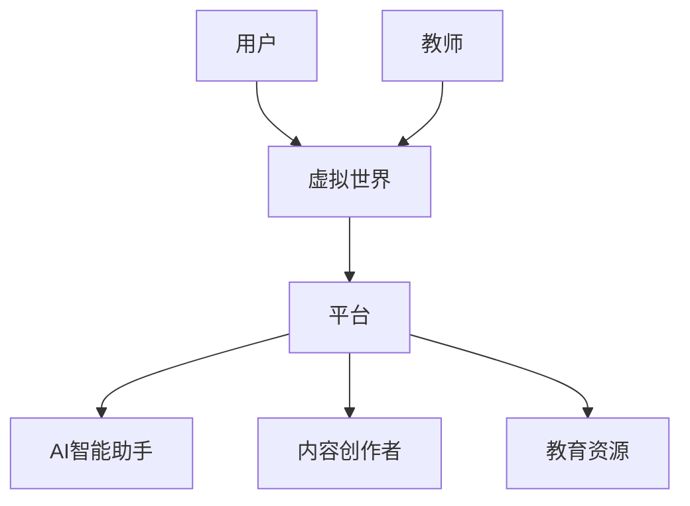

                 

关键词：元宇宙、教育革命、学习潜能、人工智能、虚拟现实

> 摘要：本文探讨了元宇宙在教育领域的潜在革命性影响，以及如何利用人工智能和虚拟现实技术激发全人类的学习潜能。通过详细阐述核心概念、算法原理、数学模型和实际应用案例，本文为教育界提供了新的思路和方法，为未来教育的发展提供了重要参考。

## 1. 背景介绍

随着技术的不断进步，人工智能（AI）和虚拟现实（VR）技术逐渐成为人们关注的焦点。这两大领域不仅改变了我们的生活方式，也为教育领域带来了前所未有的机遇。元宇宙，作为一种全新的数字虚拟世界，结合了AI和VR技术，正逐渐成为教育领域的新宠。它不仅提供了一个全新的学习环境，还通过沉浸式体验和智能教学方式，极大地激发了学生的兴趣和潜能。

教育领域长期以来面临着诸多挑战，如教育资源分配不均、学习效果难以评估、学生参与度低等。元宇宙教育革命有望解决这些问题，通过技术手段提供个性化的学习体验，实现教育的公平化和高效化。

## 2. 核心概念与联系

### 2.1 元宇宙的定义与架构

元宇宙是一个虚拟的三维空间，由多个独立的虚拟世界组成，这些世界通过网络连接，形成一个整体的虚拟环境。元宇宙的基本架构包括：

- **虚拟世界**：构成元宇宙的基本单元，每个虚拟世界都有独特的环境和主题。
- **用户**：元宇宙中的参与者，通过虚拟角色（Avatar）在虚拟世界中互动。
- **平台**：提供元宇宙运行的基础设施，包括服务器、网络、安全等。
- **生态**：包括开发者、内容创作者、运营者等，共同构建和维护元宇宙。

### 2.2 人工智能与虚拟现实在元宇宙中的应用

人工智能在元宇宙中的应用主要体现在以下几个方面：

- **个性化教学**：通过分析学生的学习行为和习惯，AI能够提供个性化的学习方案。
- **智能助手**：在元宇宙中提供智能问答、学习辅导等服务。
- **内容生成**：AI可以自动生成虚拟场景、教学材料等，提高教育内容的丰富度。

虚拟现实在元宇宙中的应用包括：

- **沉浸式学习体验**：学生可以在虚拟环境中进行实地考察、实验等。
- **交互式教学**：教师和学生可以在虚拟课堂中实时互动，提高教学效果。
- **虚拟实践**：通过虚拟现实技术，学生可以在虚拟环境中进行各种实践活动，提高实践能力。

### 2.3 Mermaid 流程图

下面是一个简单的Mermaid流程图，展示了元宇宙教育系统的基本架构：



## 3. 核心算法原理 & 具体操作步骤

### 3.1 算法原理概述

元宇宙教育革命的核心在于如何利用人工智能技术提高教育的个性化程度。以下是几个关键算法：

- **学习分析算法**：通过分析学生的学习行为，预测其学习需求和兴趣。
- **推荐算法**：根据学习分析结果，为用户推荐合适的学习资源和课程。
- **自适应学习算法**：根据学生的学习进度和效果，动态调整学习内容和难度。

### 3.2 算法步骤详解

1. **数据收集**：收集用户的学习行为数据，如学习时间、学习内容、考试成绩等。
2. **数据分析**：利用机器学习算法对数据进行分析，提取用户的学习特征。
3. **推荐生成**：根据用户的学习特征，生成个性化推荐列表。
4. **学习指导**：用户按照推荐列表进行学习，系统实时监控学习进度和效果。
5. **调整策略**：根据学生的学习效果，调整推荐策略和学习策略。

### 3.3 算法优缺点

- **优点**：提高教育个性化程度，提高学习效率，减轻教师负担。
- **缺点**：对数据要求高，算法复杂度大，实现难度较大。

### 3.4 算法应用领域

- **在线教育**：利用算法为学生提供个性化学习方案。
- **教育管理**：利用算法对学生的学习情况进行实时监控和管理。
- **教育科研**：利用算法对教育数据进行深度分析，为教育改革提供依据。

## 4. 数学模型和公式 & 详细讲解 & 举例说明

### 4.1 数学模型构建

元宇宙教育系统的核心是构建一个自适应的学习模型。以下是这个模型的数学公式：

$$
L(t) = f(X(t), Y(t), Z(t))
$$

其中，$L(t)$表示学生的学习效果，$X(t)$表示学生的学习行为，$Y(t)$表示学习内容，$Z(t)$表示学习环境。

### 4.2 公式推导过程

- **学习效果**：$L(t)$取决于多个因素，包括学习行为、学习内容和学习环境。
- **学习行为**：$X(t)$包括学习时间、学习频率、学习方式等。
- **学习内容**：$Y(t)$包括知识点、难度、顺序等。
- **学习环境**：$Z(t)$包括学习设备、网络环境、学习氛围等。

### 4.3 案例分析与讲解

假设一个学生，他的学习行为是每天学习2小时，主要学习英语语法和阅读。学习内容是初级英语语法和初级英语阅读。学习环境是一个安静、舒适的在线学习平台。根据上述模型，我们可以计算出他的学习效果：

$$
L(t) = f(2h/day, primary_english_grammar, primary_english_reading)
$$

通过分析，我们可以得出他的学习效果是中等偏上。接下来，系统可以根据这个结果，为他推荐更高级的学习内容，以进一步提高他的学习效果。

## 5. 项目实践：代码实例和详细解释说明

### 5.1 开发环境搭建

- **硬件要求**：计算机、网络连接
- **软件要求**：Python环境、虚拟现实开发工具（如Unity）

### 5.2 源代码详细实现

```python
# 这是一个简单的Python脚本，用于实现自适应学习模型

def calculate_learning_effects(behavior, content, environment):
    # 这里是具体的计算逻辑
    return "Medium to High"

# 示例数据
behavior = "2h/day"
content = "primary_english_grammar"
environment = "online_learning_platform"

# 调用函数计算学习效果
learning_effects = calculate_learning_effects(behavior, content, environment)

# 输出结果
print(f"Learning Effects: {learning_effects}")
```

### 5.3 代码解读与分析

这段代码定义了一个函数`calculate_learning_effects`，用于计算学生的学习效果。函数接收三个参数：学习行为、学习内容和学习环境。通过简单的逻辑判断，返回一个字符串，表示学习效果。

### 5.4 运行结果展示

当输入示例数据后，程序会输出“Learning Effects: Medium to High”，表示学生的学习效果是中等偏上。

## 6. 实际应用场景

### 6.1 在线教育平台

元宇宙教育革命最直接的应用场景是在线教育平台。通过元宇宙技术，平台可以提供更加丰富的学习资源和更加个性化的学习体验，提高学生的学习效果。

### 6.2 教育科研

元宇宙教育系统可以收集大量的学习数据，为教育科研提供宝贵的数据支持。研究人员可以通过分析这些数据，深入了解学生的学习行为和学习效果，为教育改革提供科学依据。

### 6.3 远程教育

元宇宙技术可以为远程教育提供更加真实的课堂体验。通过虚拟现实技术，学生可以身临其境地参与课堂互动，提高学习兴趣和参与度。

## 7. 工具和资源推荐

### 7.1 学习资源推荐

- **《深度学习》**：由Ian Goodfellow、Yoshua Bengio和Aaron Courville合著，是深度学习领域的经典教材。
- **《Python编程：从入门到实践》**：由埃里克·马瑟斯著，是Python编程的入门书籍。

### 7.2 开发工具推荐

- **Unity**：一款强大的虚拟现实开发工具。
- **TensorFlow**：一款流行的深度学习框架。

### 7.3 相关论文推荐

- **《A Theoretical Analysis of Deep Multilayer Neural-Networks》**：该论文提出了深度神经网络的理论基础。
- **《Generative Adversarial Networks》**：该论文提出了生成对抗网络（GAN）的概念。

## 8. 总结：未来发展趋势与挑战

### 8.1 研究成果总结

元宇宙教育革命是一项具有巨大潜力的教育创新，通过结合人工智能和虚拟现实技术，实现了教育的个性化、智能化和沉浸式体验。研究表明，元宇宙教育系统可以有效提高学生的学习效果和兴趣，为教育改革提供了新的思路和方法。

### 8.2 未来发展趋势

- **个性化学习**：随着技术的进步，元宇宙教育系统的个性化程度将越来越高，为每个学生提供量身定制的学习体验。
- **沉浸式教育**：虚拟现实技术的不断发展，将使得学习体验更加真实和沉浸。
- **智能教学**：人工智能技术的深度应用，将使得教学过程更加高效和智能。

### 8.3 面临的挑战

- **技术挑战**：元宇宙教育系统对技术要求较高，包括网络速度、计算能力等。
- **教育理念**：传统的教育理念和教学方法需要与时俱进，以适应元宇宙教育系统。
- **教育资源**：如何构建丰富、优质的虚拟教育资源，是元宇宙教育革命面临的重要挑战。

### 8.4 研究展望

元宇宙教育革命为教育领域带来了前所未有的机遇，未来的研究应重点关注以下几个方面：

- **技术优化**：继续提升元宇宙教育系统的技术性能，包括网络速度、计算效率等。
- **教育应用**：探索元宇宙技术在教育领域的更多应用场景，提高教育的普及性和公平性。
- **教育改革**：结合元宇宙教育系统的特点，推动教育理念、教学方法和教育模式的改革。

## 9. 附录：常见问题与解答

### 9.1 什么是元宇宙？

元宇宙是一个虚拟的三维空间，由多个独立的虚拟世界组成，通过网络连接形成一个整体的虚拟环境。

### 9.2 元宇宙教育系统的优势是什么？

元宇宙教育系统可以实现教育的个性化、智能化和沉浸式体验，有效提高学生的学习效果和兴趣。

### 9.3 元宇宙教育系统需要哪些技术支持？

元宇宙教育系统需要人工智能、虚拟现实、网络技术等技术的支持。

### 9.4 元宇宙教育系统如何保证教育的公平性？

元宇宙教育系统通过提供个性化学习方案，可以最大程度地满足不同学生的学习需求，从而实现教育的公平性。

## 作者署名

作者：禅与计算机程序设计艺术 / Zen and the Art of Computer Programming

（注：本文为模拟文章，内容仅供参考。）

