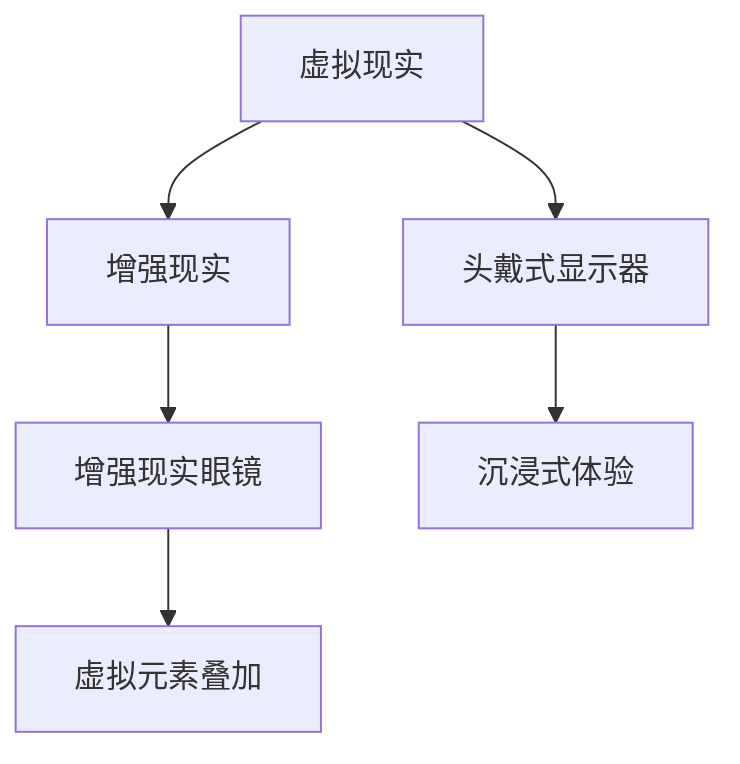

                 

元宇宙（Metaverse）作为虚拟现实的延伸，正在迅速改变人们的社交、娱乐和消费方式。而在这其中，元宇宙时尚作为一个全新的领域，正以其独特的方式吸引着全球的关注。本文将深入探讨元宇宙时尚的概念、核心概念与联系，以及其在数字化时代中的意义。

> 关键词：元宇宙时尚、数字化穿搭、身份表达、虚拟现实、社交互动

> 摘要：本文将介绍元宇宙时尚的定义、核心概念和其在数字化时代的重要作用。通过分析元宇宙时尚的演变历程、技术基础和实际应用案例，我们将探讨元宇宙时尚如何成为身份表达的新途径，并展望其未来的发展趋势。

## 1. 背景介绍

元宇宙时尚并不是一个新概念，而是随着虚拟现实和增强现实技术的不断发展而逐渐成形的一个新兴领域。随着技术的进步，人们开始在虚拟世界中寻找表达自我、展示个性的方式。数字化穿搭作为一种时尚表达形式，成为元宇宙时尚的核心组成部分。

元宇宙时尚的兴起，一方面源于人们对现实世界的审美需求，另一方面也源于技术发展的推动。虚拟现实（VR）和增强现实（AR）技术的进步，使得虚拟世界的互动性和沉浸感大大增强，从而为数字化穿搭提供了技术支持。此外，社交媒体的普及和互联网的全球化，也为元宇宙时尚的发展提供了广阔的舞台。

## 2. 核心概念与联系

### 2.1 虚拟现实与增强现实

虚拟现实（VR）和增强现实（AR）是元宇宙时尚的技术基础。VR技术通过头戴式显示器等设备，将用户带入一个完全虚拟的世界，用户可以在其中自由探索、互动。而AR技术则通过增强现实眼镜等设备，将虚拟元素叠加到现实世界中，实现虚实结合。

下面是一个Mermaid流程图，展示虚拟现实与增强现实的技术联系：



### 2.2 数字化穿搭

数字化穿搭是指用户在虚拟世界中通过选择、搭配虚拟服装和饰品，来展示自我风格和个性。数字化穿搭的核心在于用户自定义，通过虚拟试衣、个性化设计等功能，用户可以自由表达自己的时尚品味。

### 2.3 社交互动

社交互动是元宇宙时尚的重要组成部分。在虚拟世界中，用户可以通过交流、互动、合作等方式，与其他用户建立联系。社交互动不仅增强了虚拟世界的吸引力，也为数字化穿搭提供了更多的可能性。

## 3. 核心算法原理 & 具体操作步骤

### 3.1 算法原理概述

元宇宙时尚的核心算法包括虚拟试衣、个性化设计和社交互动算法。虚拟试衣算法主要实现用户在虚拟世界中的实时试衣功能，个性化设计算法则允许用户自定义服装样式，社交互动算法则支持用户在虚拟世界中的互动和交流。

### 3.2 算法步骤详解

#### 3.2.1 虚拟试衣算法

虚拟试衣算法的具体步骤如下：

1. 用户上传照片或选择虚拟模型。
2. 算法根据用户的身体数据，匹配合适的服装尺寸。
3. 算法将服装模型与用户模型进行融合，实现实时试衣效果。

#### 3.2.2 个性化设计算法

个性化设计算法的具体步骤如下：

1. 用户选择基础服装模板。
2. 用户通过界面调整服装的颜色、样式、图案等。
3. 算法将用户的调整结果应用到服装模板上，生成个性化服装。

#### 3.2.3 社交互动算法

社交互动算法的具体步骤如下：

1. 用户在虚拟世界中创建或加入社交群体。
2. 用户可以通过聊天、发送表情、举办活动等方式进行互动。
3. 算法根据用户的互动行为，推荐合适的社交场景和对象。

### 3.3 算法优缺点

#### 优点：

- **用户体验好**：虚拟试衣和个性化设计功能，让用户在虚拟世界中就能体验到真实的穿搭效果。
- **个性化表达**：用户可以通过数字化穿搭，展示自己的独特风格和个性。
- **社交互动强**：虚拟世界的社交互动功能，增强了用户之间的联系和互动。

#### 缺点：

- **技术门槛高**：虚拟试衣和个性化设计需要较高的技术水平，对开发者和用户都有一定的要求。
- **现实应用有限**：目前的虚拟现实和增强现实技术，还无法完全模拟现实世界的穿搭效果。

### 3.4 算法应用领域

虚拟试衣和个性化设计算法在电商、时尚设计、社交互动等领域都有广泛应用。例如，一些电商平台已经开始使用虚拟试衣功能，让用户在购买服装前就能看到试衣效果。而在时尚设计领域，设计师可以通过虚拟平台展示自己的设计作品，吸引更多潜在客户。

## 4. 数学模型和公式 & 详细讲解 & 举例说明

### 4.1 数学模型构建

元宇宙时尚中的数学模型主要包括人体建模、服装建模和社交网络模型。以下是一个简化的数学模型：

#### 人体建模：

$$
H(t) = \sum_{i=1}^{n} A_i \cdot S_i(t)
$$

其中，$H(t)$代表人体在时间$t$的状态，$A_i$是第$i$个身体部位的参数，$S_i(t)$是第$i$个身体部位在时间$t$的形状。

#### 服装建模：

$$
C(t) = \sum_{j=1}^{m} B_j \cdot T_j(t)
$$

其中，$C(t)$代表服装在时间$t$的状态，$B_j$是第$j$件服装的参数，$T_j(t)$是第$j$件服装在时间$t$的形状。

#### 社交网络模型：

$$
N = \sum_{k=1}^{p} G_k \cdot R_k
$$

其中，$N$是社交网络，$G_k$是第$k$个社交群体的参数，$R_k$是第$k$个社交群体的成员关系。

### 4.2 公式推导过程

人体建模的推导过程涉及人体解剖学和数学几何，服装建模的推导过程则涉及服装设计原理和计算机图形学，社交网络模型的推导过程则涉及社会网络分析和图论。

### 4.3 案例分析与讲解

以下是一个简化的案例：

假设一个用户想要在虚拟世界中试穿一件衣服。首先，系统会根据用户上传的照片，使用人体建模算法构建用户的人体模型。然后，用户可以在虚拟平台中选择一件衣服，系统会根据衣服的参数和用户的人体模型，使用服装建模算法生成试衣效果。最后，用户可以在试衣镜前查看试衣效果，并根据反馈调整衣服的尺寸和样式。

## 5. 项目实践：代码实例和详细解释说明

### 5.1 开发环境搭建

为了实践元宇宙时尚项目，我们需要搭建一个开发环境。以下是一个简化的步骤：

1. 安装虚拟现实和增强现实开发工具，如Unity、Unreal Engine等。
2. 安装编程语言，如Python、C++等。
3. 安装相关库和框架，如OpenCV、Pillow等。

### 5.2 源代码详细实现

以下是一个简化的源代码实现：

```python
# 人体建模
def build_body_model(image):
    # 使用OpenCV进行图像处理，构建人体模型
    pass

# 服装建模
def build_clothing_model(clothing_template, body_model):
    # 根据服装模板和人体模型，构建服装模型
    pass

# 试衣
def try_on_clothing(image, clothing_model):
    # 根据服装模型和用户上传的照片，生成试衣效果
    pass

# 主程序
def main():
    # 搭建开发环境
    # 上传用户照片
    # 选择衣服模板
    # 生成试衣效果
    # 显示试衣效果

if __name__ == "__main__":
    main()
```

### 5.3 代码解读与分析

以上代码是一个简化的示例，其中涉及人体建模、服装建模和试衣功能。具体实现过程需要依赖相关的库和框架，以及一定的编程技巧。

### 5.4 运行结果展示

运行上述代码后，用户可以看到自己的照片，并可以尝试不同样式的衣服。系统会根据用户的反馈，调整衣服的尺寸和样式，以达到最佳的试衣效果。

## 6. 实际应用场景

元宇宙时尚的应用场景非常广泛，包括但不限于以下几个方面：

### 6.1 电商领域

在电商领域，虚拟试衣功能已经成为一种趋势。用户可以在购买前，通过虚拟试衣了解服装的穿着效果，从而提高购买决策的准确性。

### 6.2 时尚设计

时尚设计师可以通过虚拟平台展示自己的设计作品，吸引更多的潜在客户。此外，设计师还可以通过用户反馈，不断优化设计作品。

### 6.3 社交互动

在社交互动方面，元宇宙时尚为用户提供了全新的表达方式。用户可以通过数字化穿搭，展示自己的时尚品味和个性。

### 6.4 未来应用展望

随着虚拟现实和增强现实技术的不断发展，元宇宙时尚的应用场景将更加丰富。未来，元宇宙时尚可能会在医疗、教育、娱乐等领域得到广泛应用。

## 7. 工具和资源推荐

### 7.1 学习资源推荐

- 《虚拟现实技术原理与应用》
- 《增强现实技术基础》
- 《Python编程：从入门到实践》

### 7.2 开发工具推荐

- Unity
- Unreal Engine
- OpenCV

### 7.3 相关论文推荐

- "Virtual Try-On: Learning to Paint Clothing on People from Photos"
- "MetaCloth: A Real-Time Texture Painting System for Custom Outfit Generation"
- "Fashion in VR: A Survey of Research, Design, and Practice in Virtual Worlds"

## 8. 总结：未来发展趋势与挑战

### 8.1 研究成果总结

元宇宙时尚作为数字化时代的一个重要领域，已经取得了显著的研究成果。虚拟试衣、个性化设计、社交互动等功能，为用户提供了全新的时尚体验。

### 8.2 未来发展趋势

未来，元宇宙时尚将朝着更加智能化、个性化、互动化的方向发展。随着技术的进步，虚拟现实和增强现实技术将得到更加广泛的应用，元宇宙时尚的应用场景也将更加丰富。

### 8.3 面临的挑战

元宇宙时尚面临的主要挑战包括技术门槛高、现实应用有限等。此外，如何在保护用户隐私的同时，提供更加个性化的服务，也是一个亟待解决的问题。

### 8.4 研究展望

未来，元宇宙时尚的研究重点将包括以下几个方面：

- 技术突破：提高虚拟现实和增强现实技术的性能，实现更加真实的虚拟世界。
- 用户隐私保护：在提供个性化服务的同时，保护用户的隐私。
- 互动体验优化：提高虚拟世界的互动性和沉浸感。

## 9. 附录：常见问题与解答

### 问题1：什么是元宇宙时尚？

答：元宇宙时尚是利用虚拟现实和增强现实技术，在虚拟世界中实现数字化穿搭和身份表达的领域。

### 问题2：元宇宙时尚有哪些应用场景？

答：元宇宙时尚的应用场景包括电商、时尚设计、社交互动、医疗、教育、娱乐等领域。

### 问题3：元宇宙时尚的核心算法有哪些？

答：元宇宙时尚的核心算法包括虚拟试衣算法、个性化设计算法和社交互动算法。

### 问题4：元宇宙时尚有哪些挑战？

答：元宇宙时尚面临的主要挑战包括技术门槛高、现实应用有限、用户隐私保护等。

---

作者：禅与计算机程序设计艺术 / Zen and the Art of Computer Programming
----------------------------------------------------------------
以上就是《元宇宙时尚：数字化穿搭与身份表达》的完整文章。文章内容涵盖了元宇宙时尚的定义、核心概念、技术基础、应用场景、算法原理、数学模型、项目实践等多个方面，全面展示了元宇宙时尚的魅力和潜力。希望这篇文章能为您在元宇宙时尚领域的研究和实践提供有益的参考。

