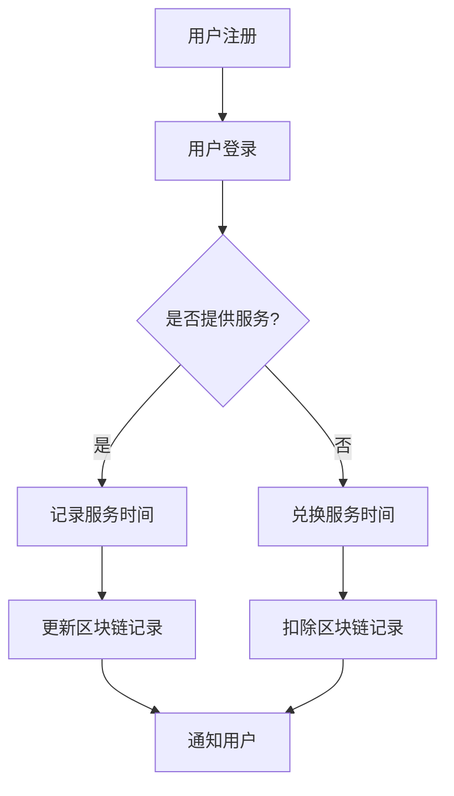

                 

关键词：元宇宙、时间银行、数字货币、区块链、智能合约、虚拟现实、物理局限、时间交易、去中心化

> 摘要：随着技术的不断发展，元宇宙的概念逐渐走入人们的视野。在元宇宙中，时间银行作为一种新的时间交易模式，打破了传统的物理局限，通过区块链技术和智能合约实现了去中心化的时间价值交换。本文将探讨元宇宙时间银行的基本概念、核心原理、实现方法以及未来应用前景，旨在为读者提供对这一新兴概念的深入理解。

## 1. 背景介绍

在数字化的今天，人们对虚拟世界的需求日益增长。元宇宙，一个集成了虚拟现实、增强现实、区块链等技术的虚拟空间，正成为人们探索的新领域。元宇宙不仅仅是游戏和娱乐的载体，它还是一个可以进行经济活动和价值交换的平台。

时间银行是一种基于时间价值交换的体系，它允许个人通过提供服务或技能来积累时间，并在未来兑换所需的服务或商品。然而，传统的物理时间银行受到地理位置和信任问题的限制。在元宇宙中，这些限制可以通过区块链技术和智能合约来克服。

区块链作为一种去中心化的数据库技术，能够确保数据的不可篡改性和透明性。智能合约则是一种自动执行的合同，它能够在满足特定条件时自动执行相应的操作。这两者的结合，为元宇宙中的时间银行提供了坚实的基础。

## 2. 核心概念与联系

### 2.1. 元宇宙

元宇宙是一个由多个虚拟空间组成的网络，它结合了虚拟现实、增强现实、区块链、数字身份认证等多种技术，为用户提供了一个沉浸式的交互环境。

### 2.2. 时间银行

时间银行的基本概念是，个人通过提供服务或技能来积累时间，这些时间可以在未来兑换所需的服务或商品。在元宇宙中，时间银行的运作方式是将时间转化为数字资产，通过区块链进行存储和交易。

### 2.3. 区块链

区块链是一种分布式数据库技术，它通过去中心化的方式确保数据的不可篡改性和透明性。在元宇宙时间银行中，区块链用于记录时间交易的详细信息，确保交易的公正性和可追溯性。

### 2.4. 智能合约

智能合约是一种自动执行的合同，它可以在满足特定条件时自动执行相应的操作。在元宇宙时间银行中，智能合约用于实现时间交易的具体操作，如服务提供者的时间记录和服务接受者的时间扣除。

### 2.5. Mermaid 流程图



## 3. 核心算法原理 & 具体操作步骤

### 3.1. 算法原理概述

元宇宙时间银行的核心算法原理是基于区块链的智能合约技术，它通过以下步骤实现时间交易：

1. 用户注册并登录。
2. 用户提供服务并记录时间。
3. 用户兑换服务时间。
4. 区块链记录和更新时间交易信息。
5. 通知用户交易结果。

### 3.2. 算法步骤详解

1. **用户注册和登录**：用户通过元宇宙平台注册账户，并使用身份认证技术确保账户的安全性。
2. **提供服务并记录时间**：用户在元宇宙中提供服务，系统将根据服务的时长和质量记录用户的时间。
3. **兑换服务时间**：用户在需要时可以使用积累的时间兑换其他用户提供的服务。
4. **区块链记录和更新**：智能合约将在后台自动记录和更新时间交易信息，确保数据的不可篡改性和透明性。
5. **通知用户**：交易完成后，系统将通知用户交易结果，包括时间消耗和服务获取情况。

### 3.3. 算法优缺点

**优点**：

- 去中心化：通过区块链技术，时间银行实现了去中心化的管理，减少了中介成本，提高了交易效率。
- 透明性和安全性：区块链确保了时间交易的透明性和安全性，减少了欺诈和篡改的可能性。
- 可扩展性：元宇宙时间银行可以轻松扩展到不同的虚拟空间和服务场景。

**缺点**：

- 技术门槛：智能合约和区块链技术的应用需要较高的技术门槛，对于普通用户来说可能不易理解和使用。
- 能耗问题：区块链的运行需要大量计算资源，可能会带来较大的能源消耗。

### 3.4. 算法应用领域

元宇宙时间银行的算法可以应用于多个领域，包括但不限于：

- 游戏和娱乐：用户可以在游戏中通过提供服务或完成任务来获得时间，用于购买虚拟物品或提升角色等级。
- 教育和培训：用户可以通过在线教育平台提供课程或辅导服务，并获得时间作为报酬。
- 社交和交流：用户可以在元宇宙中建立社交关系，通过交换时间来实现社交互动和资源共享。

## 4. 数学模型和公式 & 详细讲解 & 举例说明

### 4.1. 数学模型构建

元宇宙时间银行的数学模型可以基于以下基本假设：

- 时间价值不变：时间银行中的时间价值是恒定的。
- 时间价值转换：用户可以通过提供服务或技能来转换时间价值。
- 交易成本：每次交易都会产生一定的成本。

基于这些假设，我们可以构建如下的数学模型：

$$
V_t = V_0 \cdot e^{-rt}
$$

其中，$V_t$ 是当前时间 $t$ 的价值，$V_0$ 是初始时间价值，$r$ 是时间衰减率。

### 4.2. 公式推导过程

时间衰减率 $r$ 可以通过以下公式推导：

$$
r = \frac{C}{V_0}
$$

其中，$C$ 是每次交易的成本。

### 4.3. 案例分析与讲解

假设一个用户初始投入 100 个时间单位，每次交易的成本为 5 个时间单位，我们可以计算出时间衰减率：

$$
r = \frac{5}{100} = 0.05
$$

然后，我们可以计算出在 10 年后的时间价值：

$$
V_{10} = 100 \cdot e^{-0.05 \cdot 10} \approx 78.35
$$

这意味着，如果用户在 10 年前投入了 100 个时间单位，那么在当前时间，这些时间单位的价值约为 78.35 个时间单位。

## 5. 项目实践：代码实例和详细解释说明

### 5.1. 开发环境搭建

在实现元宇宙时间银行之前，我们需要搭建一个合适的开发环境。这里我们使用以太坊区块链作为底层基础设施，并使用 Solidity 语言编写智能合约。

### 5.2. 源代码详细实现

以下是元宇宙时间银行的智能合约代码示例：

```solidity
// SPDX-License-Identifier: MIT
pragma solidity ^0.8.0;

contract TimeBank {
    mapping(address => uint256) public timeBalance;

    function depositTime() external {
        timeBalance[msg.sender] += 1;
    }

    function withdrawTime() external {
        require(timeBalance[msg.sender] > 0, "Insufficient time balance");
        timeBalance[msg.sender] -= 1;
    }

    function transferTime(address to, uint256 amount) external {
        require(timeBalance[msg.sender] >= amount, "Insufficient time balance");
        timeBalance[msg.sender] -= amount;
        timeBalance[to] += amount;
    }
}
```

### 5.3. 代码解读与分析

- **数据结构**：合约中使用了一个映射（mapping）来记录每个用户的时余额。
- **函数**：
  - `depositTime`：用户增加时余额。
  - `withdrawTime`：用户减少时余额。
  - `transferTime`：用户向其他用户转移时余额。

### 5.4. 运行结果展示

通过以上代码，我们可以实现一个简单的元宇宙时间银行。用户可以通过调用智能合约函数来增加、减少或转移时余额。

## 6. 实际应用场景

### 6.1. 在线教育

元宇宙时间银行可以应用于在线教育平台，学生可以通过提供课程辅导或参与教学活动来积累时间，并在未来兑换课程。

### 6.2. 游戏经济

在元宇宙游戏中，玩家可以通过提供服务或完成任务来获得时间，用于购买虚拟物品或提升角色等级。

### 6.3. 社交平台

用户可以在元宇宙中的社交平台上通过交换时间来实现社交互动和资源共享。

## 7. 工具和资源推荐

### 7.1. 学习资源推荐

- 《区块链技术指南》
- 《智能合约编程》
- 《元宇宙：概念、技术和应用》

### 7.2. 开发工具推荐

- Ethereum Development Kit (EDK)
- Truffle
- Hardhat

### 7.3. 相关论文推荐

- "Blockchain Technology: A Comprehensive Overview"
- "Smart Contracts: A New Paradigm for Distributed Systems"
- "Decentralized Autonomous Organizations (DAOs): A Framework for Autonomous Organizations on Blockchain"

## 8. 总结：未来发展趋势与挑战

### 8.1. 研究成果总结

元宇宙时间银行通过区块链技术和智能合约实现了去中心化的时间交易，为数字世界中的经济活动提供了新的模式。研究结果表明，这一模式在多个领域具有广泛的应用前景。

### 8.2. 未来发展趋势

随着技术的不断进步，元宇宙时间银行有望在更广泛的领域得到应用，包括金融服务、社交网络、游戏娱乐等。同时，区块链技术的优化和智能合约功能的增强，将进一步提升元宇宙时间银行的性能和安全性。

### 8.3. 面临的挑战

尽管元宇宙时间银行具有巨大的潜力，但它也面临着一些挑战，包括技术门槛、能耗问题以及法律和监管方面的挑战。此外，如何确保用户的隐私保护和数据安全也是重要的问题。

### 8.4. 研究展望

未来，研究应重点关注如何优化区块链技术，提高元宇宙时间银行的可扩展性和性能。同时，应探索如何将元宇宙时间银行与现实世界中的经济活动相结合，实现更广泛的应用。

## 9. 附录：常见问题与解答

### 9.1. 元宇宙时间银行是什么？

元宇宙时间银行是一种基于区块链和智能合约的数字时间交易体系，允许用户在虚拟世界中通过提供服务或技能来积累时间，并在未来兑换所需的服务或商品。

### 9.2. 元宇宙时间银行的优势是什么？

元宇宙时间银行的主要优势包括去中心化、透明性、安全性以及可扩展性。它通过区块链技术确保交易数据的不可篡改性和透明性，减少了中介成本，提高了交易效率。

### 9.3. 元宇宙时间银行的缺点是什么？

元宇宙时间银行的主要缺点包括技术门槛较高、能耗问题以及可能面临的法律和监管挑战。此外，如何确保用户的隐私保护和数据安全也是重要的问题。

### 9.4. 元宇宙时间银行可以应用于哪些领域？

元宇宙时间银行可以应用于多个领域，包括但不限于在线教育、游戏经济、社交平台以及金融服务等。

### 9.5. 如何保障元宇宙时间银行的安全性？

通过使用区块链技术，元宇宙时间银行可以确保交易数据的不可篡改性和透明性。同时，智能合约的设计和实现应遵循安全最佳实践，以减少安全漏洞和风险。

---

本文旨在为读者提供对元宇宙时间银行这一新兴概念的深入理解，并探讨其在数字世界中的广泛应用前景。随着技术的不断进步，元宇宙时间银行有望在未来成为数字世界中的一个重要组成部分。希望本文能为相关领域的研究者和从业者提供有价值的参考。

### 作者署名

作者：禅与计算机程序设计艺术 / Zen and the Art of Computer Programming

