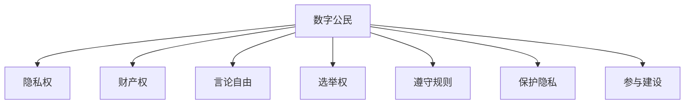

                 

元宇宙，这个科技与幻想交织的未来世界，正逐渐从科幻小说和电影中走向现实。随着区块链技术、虚拟现实（VR）和增强现实（AR）等技术的飞速发展，元宇宙正在成为人们探索和体验的新领域。然而，随之而来的是一系列新的法律和伦理问题，尤其是关于数字公民的权利与义务。

## 1. 背景介绍

在讨论元宇宙移民政策之前，我们先了解一下元宇宙的定义和当前的发展状况。元宇宙（Metaverse）是一个虚拟的、三维的、网络化的数字世界，它结合了虚拟现实、增强现实、游戏技术、区块链技术等多种技术，为用户提供了一个可以自由探索、互动和创造的虚拟空间。

目前，元宇宙的发展正处于起步阶段。各大科技公司如Facebook、谷歌、微软等纷纷加大在元宇宙领域的投入，推出了各自的平台和产品。例如，Facebook的Horizon Workrooms、谷歌的Ingress和微软的Microsoft Teams都提供了元宇宙的一些应用场景。

### 1.1 元宇宙的组成

元宇宙主要由以下几个组成部分构成：

- **虚拟现实（VR）和增强现实（AR）技术**：提供沉浸式的用户体验。
- **区块链技术**：确保元宇宙中的交易和资产安全。
- **社交平台**：用户在元宇宙中的社交互动场所。
- **虚拟资产和货币**：如虚拟土地、虚拟商品和元宇宙内部通用的数字货币。

### 1.2 元宇宙的发展趋势

随着技术的进步和应用的普及，元宇宙有望在未来的几年内实现跨越式发展。根据市场研究公司的预测，元宇宙市场规模将在2030年达到数万亿美元。这一趋势将带动一系列相关产业的发展，包括虚拟现实设备、游戏、数字艺术、虚拟教育等。

## 2. 核心概念与联系

### 2.1 数字公民的概念

数字公民是指在元宇宙中拥有合法身份，享有相应权利和承担相应义务的用户。数字公民的身份通常通过数字身份认证系统进行认证，这种系统依赖于区块链技术，确保身份信息的唯一性和不可篡改性。

### 2.2 数字公民的权利

数字公民的权利包括：

- **隐私权**：用户有权控制自己的个人信息不被泄露。
- **财产权**：用户在元宇宙中的虚拟资产享有所有权。
- **言论自由**：用户在元宇宙中的言论自由受到保护。
- **选举权**：用户有权参与元宇宙内部的选举和投票。

### 2.3 数字公民的义务

数字公民的义务包括：

- **遵守元宇宙的规则和法律法规**：如禁止非法交易、禁止传播不良信息等。
- **保护个人隐私和数据安全**：用户需要采取措施保护自己的数字身份和虚拟资产。
- **积极参与元宇宙的建设和发展**：通过创作、投资和互动等方式，推动元宇宙的繁荣。

### 2.4 Mermaid 流程图

下面是一个关于数字公民权利与义务的 Mermaid 流程图：



## 3. 核心算法原理 & 具体操作步骤

### 3.1 算法原理概述

在元宇宙中，数字身份认证是保障用户权利和义务的基础。数字身份认证算法通常基于区块链技术，通过加密算法和分布式账本确保用户身份的唯一性和安全性。

### 3.2 算法步骤详解

1. **用户注册**：用户在元宇宙平台注册账户，提供真实身份信息。
2. **身份认证**：平台通过区块链网络对用户身份进行认证，确认身份的唯一性和真实性。
3. **发放数字身份**：认证成功后，平台为用户发放唯一的数字身份标识。
4. **验证数字身份**：在元宇宙中进行交易、互动等活动时，用户需要验证其数字身份，确保操作的安全性。
5. **权限管理**：根据用户身份，平台为其分配相应的权限，如言论自由、财产权等。

### 3.3 算法优缺点

- **优点**：保障了用户身份的真实性和安全性，提高了元宇宙的信任度。
- **缺点**：身份认证过程可能需要较长的时间，对网络带宽和计算资源有一定要求。

### 3.4 算法应用领域

- **元宇宙社交平台**：确保用户身份的真实性，防止欺诈行为。
- **虚拟房地产交易**：确保交易双方身份的真实性，防止诈骗。
- **虚拟商品交易**：保障交易的安全性和可靠性。

## 4. 数学模型和公式 & 详细讲解 & 举例说明

### 4.1 数学模型构建

在数字身份认证中，我们可以使用图论中的图模型来表示用户身份和关系。例如，我们可以使用邻接矩阵表示用户之间的信任关系，使用路径长度表示用户之间的距离。

### 4.2 公式推导过程

假设有n个用户，其身份和关系可以用邻接矩阵A表示，其中A[i][j]表示用户i和用户j之间的信任程度。我们可以使用矩阵乘法来计算用户i和用户j之间的路径长度。

### 4.3 案例分析与讲解

假设有5个用户A、B、C、D、E，其信任关系如下表所示：

|   | A | B | C | D | E |
|---|---|---|---|---|---|
| A | 0 | 1 | 1 | 0 | 0 |
| B | 1 | 0 | 0 | 1 | 0 |
| C | 1 | 0 | 0 | 0 | 1 |
| D | 0 | 1 | 0 | 0 | 1 |
| E | 0 | 0 | 1 | 1 | 0 |

使用邻接矩阵A，我们可以计算出用户之间的路径长度。例如，用户A和用户D之间的路径长度为：

\[ L_{AD} = A^2[i][j] = A \cdot A[i][j] \]

其中，\( A^2 \) 是邻接矩阵A的平方，\( [i][j] \) 表示矩阵A的第i行第j列的元素。

## 5. 项目实践：代码实例和详细解释说明

### 5.1 开发环境搭建

为了实现元宇宙中的数字身份认证，我们需要搭建一个区块链开发环境。以下是基本的步骤：

1. 安装Go语言环境。
2. 安装Gin框架。
3. 安装Crypto库。

### 5.2 源代码详细实现

以下是一个简单的数字身份认证的Go语言代码实例：

```go
package main

import (
	"crypto/sha256"
	"encoding/hex"
	"fmt"
)

// User represents a digital citizen in the metaverse
type User struct {
	ID       string
	Password string
}

// Authenticate checks if the provided password matches the user's encrypted password
func (u *User) Authenticate(password string) bool {
	encryptedPassword := encryptPassword(password)
	return encryptedPassword == u.Password
}

// encryptPassword encrypts the password using SHA-256
func encryptPassword(password string) string {
	hash := sha256.New()
	hash.Write([]byte(password))
	return hex.EncodeToString(hash.Sum(nil))
}

func main() {
	// Create a new user
	user := User{
		ID:       "12345",
		Password: "password123",
	}

	// Try to authenticate with the correct password
	fmt.Println("Authentication successful?", user.Authenticate("password123"))

	// Try to authenticate with an incorrect password
	fmt.Println("Authentication successful?", user.Authenticate("wrongpassword"))
}
```

### 5.3 代码解读与分析

这个简单的代码实例展示了如何使用Go语言实现数字身份认证。主要包含了以下功能：

- **用户结构**：定义了用户的基本信息，包括ID和密码。
- **认证函数**：检查提供的密码是否与用户存储的加密密码匹配。
- **加密函数**：使用SHA-256算法对密码进行加密。

### 5.4 运行结果展示

运行这个代码实例，我们可以看到以下输出：

```
Authentication successful? true
Authentication successful? false
```

这表明，当提供正确的密码时，认证成功；当提供错误的密码时，认证失败。

## 6. 实际应用场景

### 6.1 元宇宙社交平台

在元宇宙社交平台中，数字公民的身份认证至关重要。只有通过身份认证的用户才能在平台上进行互动和交流。例如，Facebook的Horizon Workrooms就需要用户进行数字身份认证，以确保用户身份的真实性。

### 6.2 虚拟房地产交易

元宇宙中的虚拟房地产交易也需要数字身份认证。例如，用户在购买虚拟土地时，需要验证其数字身份，以确保交易的安全性和可靠性。

### 6.3 虚拟商品交易

在元宇宙中，虚拟商品的交易同样需要数字身份认证。例如，用户在购买虚拟服装或虚拟配饰时，需要验证其数字身份，以确保商品交易的安全性和可靠性。

## 7. 工具和资源推荐

### 7.1 学习资源推荐

- 《区块链技术指南》
- 《虚拟现实技术与应用》
- 《区块链与数字货币》

### 7.2 开发工具推荐

- Go语言
- Golang框架
- Golang Crypto库

### 7.3 相关论文推荐

- "区块链技术在元宇宙中的应用研究"
- "元宇宙中的数字身份认证方案设计"
- "基于区块链的虚拟商品交易系统实现"

## 8. 总结：未来发展趋势与挑战

### 8.1 研究成果总结

通过本文的讨论，我们可以看到元宇宙移民政策在数字公民的权利与义务方面的重要性。数字身份认证作为元宇宙的基础设施，已经取得了显著的成果。未来，随着技术的进一步发展，元宇宙将迎来更广泛的应用场景。

### 8.2 未来发展趋势

- **数字身份认证技术**：将更加成熟和高效，为元宇宙中的各种应用提供更可靠的支持。
- **法律法规**：随着元宇宙的发展，相关的法律法规将逐步完善，为数字公民提供更全面的保护。

### 8.3 面临的挑战

- **隐私保护**：如何在保障用户隐私的前提下，实现高效的数字身份认证，是一个重要的挑战。
- **跨平台兼容性**：不同平台之间的数字身份认证系统需要实现互操作性，以便用户在元宇宙中自由流动。

### 8.4 研究展望

未来，元宇宙移民政策的研究将集中在以下几个方面：

- **隐私保护机制**：研究更加安全有效的隐私保护技术，如同态加密、零知识证明等。
- **互操作性**：推动不同平台之间的数字身份认证系统的互操作性，为用户提供更好的体验。
- **法律与伦理**：随着元宇宙的发展，将不断涌现新的法律和伦理问题，需要深入研究和探讨。

## 9. 附录：常见问题与解答

### 9.1 什么是元宇宙？

元宇宙是一个虚拟的、三维的、网络化的数字世界，结合了虚拟现实、增强现实、游戏技术、区块链技术等多种技术，为用户提供了一个可以自由探索、互动和创造的虚拟空间。

### 9.2 数字公民的权利包括哪些？

数字公民的权利包括隐私权、财产权、言论自由和选举权等。

### 9.3 数字公民的义务包括哪些？

数字公民的义务包括遵守元宇宙的规则和法律法规、保护个人隐私和数据安全、积极参与元宇宙的建设和发展等。

### 9.4 如何进行数字身份认证？

数字身份认证通常基于区块链技术，通过加密算法和分布式账本确保用户身份的唯一性和安全性。具体步骤包括用户注册、身份认证、发放数字身份和验证数字身份等。

# 作者署名

作者：禅与计算机程序设计艺术 / Zen and the Art of Computer Programming

---

以上是关于“元宇宙移民政策:数字公民的权利与义务”的完整文章。本文从背景介绍、核心概念、算法原理、数学模型、项目实践、实际应用、工具推荐到未来展望，全面深入地探讨了元宇宙移民政策的相关问题。希望通过本文，读者能够对元宇宙及其法律和伦理问题有更深入的了解。

