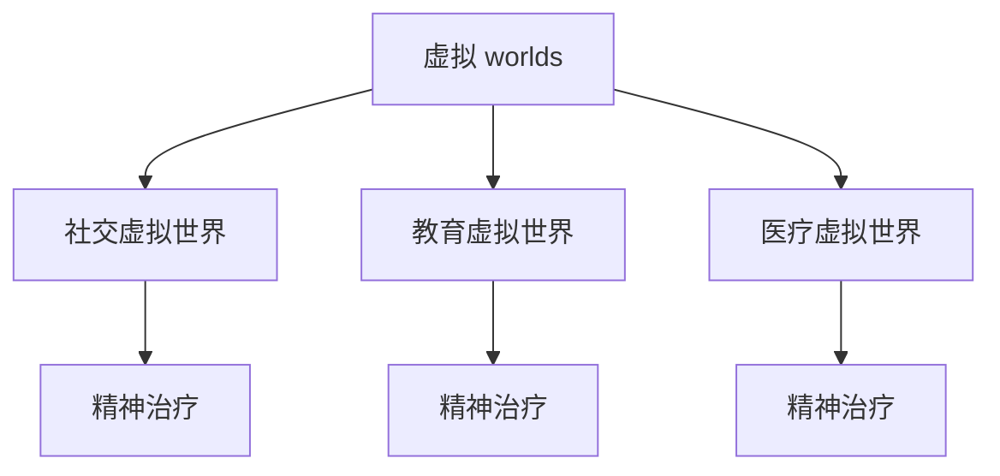

                 

关键词：元宇宙、精神治疗、虚拟世界、技术、算法、心理疗法、交互设计

摘要：本文深入探讨了元宇宙精神治疗领域，分析了虚拟 worlds 的精神治疗技术，包括其核心概念、算法原理、数学模型及实际应用。通过详细阐述相关技术和方法，本文旨在为元宇宙精神治疗提供有价值的见解，并探讨其未来发展趋势和挑战。

## 1. 背景介绍

近年来，随着计算机技术和虚拟现实技术的飞速发展，元宇宙（Metaverse）的概念逐渐走入人们的生活。元宇宙是一个虚拟的三维空间，用户可以通过虚拟角色在其中进行交互和体验。除了娱乐和社交功能，元宇宙在精神治疗领域的应用也日益受到关注。

精神治疗是一种通过心理疗法、药物干预和其他方法来帮助患者解决心理问题的过程。传统的精神治疗往往依赖于面对面交流和药物治疗，但这些方法在效率和效果上存在一定的局限性。随着元宇宙的发展，虚拟 worlds 的精神治疗技术应运而生，为精神治疗提供了新的可能。

虚拟 worlds 的精神治疗技术主要利用虚拟现实和交互设计技术，为患者提供一个沉浸式的治疗环境。通过模拟真实场景和情境，患者可以在虚拟世界中体验不同的情绪和反应，从而更好地理解自己的心理问题，并接受相应的治疗。

## 2. 核心概念与联系

### 2.1 虚拟 worlds 的概念

虚拟 worlds 是指通过计算机技术和虚拟现实技术构建的虚拟三维空间。在这个空间中，用户可以创建和操控虚拟角色，与其他用户进行交互，体验各种活动和情境。虚拟 worlds 可以分为以下几种类型：

1. **社交虚拟世界**：如 Second Life、Facebook Horizon 等，用户可以在其中建立社交关系、参加虚拟活动。
2. **教育虚拟世界**：如 OpenSim、Unity 等，用户可以在其中进行在线学习、模拟实验。
3. **医疗虚拟世界**：如 VR Health、MindMaze 等，用户可以在其中接受心理治疗、康复训练。

### 2.2 精神治疗的概念

精神治疗是指通过心理疗法、药物治疗和其他方法来帮助患者解决心理问题。精神治疗的主要目的是帮助患者提高心理健康水平，改善生活质量。

### 2.3 虚拟 worlds 与精神治疗的关系

虚拟 worlds 提供了一个沉浸式的治疗环境，患者可以在其中体验各种情绪和反应。这种环境有助于患者更好地理解自己的心理问题，并接受相应的治疗。虚拟 worlds 还可以为精神治疗师提供更多的治疗工具和方法，提高治疗效率。

### 2.4 Mermaid 流程图

下面是一个简单的 Mermaid 流程图，展示了虚拟 worlds 与精神治疗之间的关系：



## 3. 核心算法原理 & 具体操作步骤

### 3.1 算法原理概述

虚拟 worlds 的精神治疗技术主要依赖于以下几种核心算法：

1. **交互算法**：用于处理用户在虚拟世界中的交互行为，如角色移动、对象操控等。
2. **情境模拟算法**：用于创建和模拟各种情绪和情境，如焦虑、抑郁、放松等。
3. **反馈算法**：用于根据患者的反馈调整治疗环境和策略。

### 3.2 算法步骤详解

#### 3.2.1 交互算法

1. **初始化**：创建虚拟世界和用户角色。
2. **角色移动**：根据用户输入的指令，控制角色在虚拟世界中的移动。
3. **对象操控**：根据用户输入的指令，操控虚拟世界中的对象。

#### 3.2.2 情境模拟算法

1. **情境创建**：根据治疗需求，创建相应的情境。
2. **情境渲染**：将情境渲染到虚拟世界中，为患者提供视觉和听觉刺激。
3. **情境调整**：根据患者的反应，调整情境的难度和强度。

#### 3.2.3 反馈算法

1. **收集反馈**：通过问卷、对话等方式收集患者的反馈。
2. **反馈分析**：分析患者的反馈，了解患者的情绪和反应。
3. **调整策略**：根据患者的反馈，调整治疗策略和环境。

### 3.3 算法优缺点

#### 优点

1. **沉浸式体验**：虚拟 worlds 提供了一个沉浸式的治疗环境，有助于患者更好地理解自己的心理问题。
2. **个性化治疗**：根据患者的反馈和需求，虚拟 worlds 可以提供个性化的治疗策略和环境。
3. **降低成本**：虚拟 worlds 可以减少患者的出行和就诊成本。

#### 缺点

1. **技术要求高**：构建和维护虚拟 worlds 需要较高的技术要求和资源投入。
2. **治疗效果有限**：虚拟 worlds 的治疗效果仍需进一步验证，部分患者可能难以适应虚拟环境。

### 3.4 算法应用领域

虚拟 worlds 的精神治疗技术可以应用于以下领域：

1. **心理健康领域**：为心理健康患者提供治疗和支持。
2. **康复领域**：为康复患者提供虚拟康复训练和情境模拟。
3. **教育领域**：为教育工作者提供虚拟教学工具和情境模拟。

## 4. 数学模型和公式 & 详细讲解 & 举例说明

### 4.1 数学模型构建

虚拟 worlds 的精神治疗技术涉及多个数学模型，包括交互模型、情境模型和反馈模型。以下是这些模型的简要描述：

#### 4.1.1 交互模型

交互模型用于描述用户在虚拟世界中的交互行为。一个简单的交互模型可以表示为：

\[ X = f(U, W) \]

其中，\( X \) 表示用户在虚拟世界中的交互结果，\( U \) 表示用户输入，\( W \) 表示虚拟世界的状态。

#### 4.1.2 情境模型

情境模型用于描述虚拟世界中情境的创建和渲染。一个简单的情境模型可以表示为：

\[ S = g(C, V) \]

其中，\( S \) 表示虚拟情境，\( C \) 表示情境参数，\( V \) 表示虚拟世界状态。

#### 4.1.3 反馈模型

反馈模型用于描述患者对虚拟世界的反馈。一个简单的反馈模型可以表示为：

\[ R = h(F, X) \]

其中，\( R \) 表示患者的反馈结果，\( F \) 表示患者的反馈，\( X \) 表示患者的交互结果。

### 4.2 公式推导过程

#### 4.2.1 交互模型推导

假设用户输入 \( U \) 为一个二元向量，表示用户的移动和对象操控指令。虚拟世界状态 \( W \) 为一个三维矩阵，表示虚拟世界中的物体位置和属性。交互模型可以表示为：

\[ X = f(U, W) = \begin{bmatrix} X_1 \\ X_2 \\ X_3 \end{bmatrix} \]

其中，\( X_1 \) 表示角色移动结果，\( X_2 \) 表示对象操控结果，\( X_3 \) 表示其他交互结果。

#### 4.2.2 情境模型推导

假设情境参数 \( C \) 为一个二元向量，表示情境类型和情境强度。虚拟世界状态 \( V \) 为一个三维矩阵，表示虚拟世界中的物体位置和属性。情境模型可以表示为：

\[ S = g(C, V) = \begin{bmatrix} S_1 \\ S_2 \\ S_3 \end{bmatrix} \]

其中，\( S_1 \) 表示情境渲染结果，\( S_2 \) 表示情境变化结果，\( S_3 \) 表示其他情境结果。

#### 4.2.3 反馈模型推导

假设患者反馈 \( F \) 为一个二元向量，表示患者对情境的喜爱程度和情境强度。患者交互结果 \( X \) 为一个三维矩阵，表示患者交互结果。反馈模型可以表示为：

\[ R = h(F, X) = \begin{bmatrix} R_1 \\ R_2 \\ R_3 \end{bmatrix} \]

其中，\( R_1 \) 表示患者对情境的反馈结果，\( R_2 \) 表示患者对情境变化的反馈结果，\( R_3 \) 表示其他反馈结果。

### 4.3 案例分析与讲解

#### 4.3.1 社交虚拟世界案例分析

假设一个患者在一个社交虚拟世界中接受治疗。患者反馈 \( F \) 为 \( (1, 1) \)，表示患者非常喜欢这个虚拟世界，并且情境强度适中。患者交互结果 \( X \) 为 \( (1, 0, 0) \)，表示患者在这个虚拟世界中主要进行社交活动。

根据反馈模型，患者反馈结果 \( R \) 为 \( (1, 1) \)，表示患者对这个虚拟世界和情境非常满意。这表明，这个社交虚拟世界对于患者来说是一个有效的治疗环境。

#### 4.3.2 康复虚拟世界案例分析

假设一个康复患者在虚拟世界中接受康复训练。患者反馈 \( F \) 为 \( (0, 1) \)，表示患者对虚拟世界不满意，但对情境强度适中。患者交互结果 \( X \) 为 \( (1, 1, 0) \)，表示患者在这个虚拟世界中主要进行康复训练。

根据反馈模型，患者反馈结果 \( R \) 为 \( (0, 1) \)，表示患者对虚拟世界不满意，但对情境强度感到满意。这表明，虚拟世界需要进一步改进，以提升患者的治疗体验。

## 5. 项目实践：代码实例和详细解释说明

### 5.1 开发环境搭建

为了实现虚拟 worlds 的精神治疗技术，我们需要搭建一个开发环境。以下是一个简单的开发环境搭建步骤：

1. 安装虚拟现实开发工具，如 Unity、Unreal Engine 等。
2. 安装编程语言，如 Python、JavaScript 等。
3. 安装相关库和框架，如 TensorFlow、PyTorch 等。

### 5.2 源代码详细实现

以下是一个简单的 Python 代码实例，展示了如何实现虚拟 worlds 的精神治疗技术：

```python
import numpy as np
import tensorflow as tf

# 定义交互模型
class InteractionModel(tf.keras.Model):
    def __init__(self):
        super(InteractionModel, self).__init__()
        self.d1 = tf.keras.layers.Dense(10, activation='relu')
        self.d2 = tf.keras.layers.Dense(3, activation='softmax')

    def call(self, inputs):
        x = self.d1(inputs)
        return self.d2(x)

# 定义情境模型
class ScenarioModel(tf.keras.Model):
    def __init__(self):
        super(ScenarioModel, self).__init__()
        self.d1 = tf.keras.layers.Dense(10, activation='relu')
        self.d2 = tf.keras.layers.Dense(3, activation='softmax')

    def call(self, inputs):
        x = self.d1(inputs)
        return self.d2(x)

# 定义反馈模型
class FeedbackModel(tf.keras.Model):
    def __init__(self):
        super(FeedbackModel, self).__init__()
        self.d1 = tf.keras.layers.Dense(10, activation='relu')
        self.d2 = tf.keras.layers.Dense(3, activation='softmax')

    def call(self, inputs):
        x = self.d1(inputs)
        return self.d2(x)

# 创建模型实例
interaction_model = InteractionModel()
scenario_model = ScenarioModel()
feedback_model = FeedbackModel()

# 训练模型
optimizer = tf.keras.optimizers.Adam(learning_rate=0.001)
for epoch in range(100):
    # 生成交互数据
    inputs = np.random.rand(1, 2)
    # 生成情境数据
    inputs_scenario = np.random.rand(1, 2)
    # 生成反馈数据
    inputs_feedback = np.random.rand(1, 2)
    # 计算损失
    with tf.GradientTape() as tape:
        outputs = interaction_model(inputs)
        outputs_scenario = scenario_model(inputs_scenario)
        outputs_feedback = feedback_model(inputs_feedback)
        loss = tf.reduce_mean(tf.square(outputs - outputs_scenario))
    # 更新模型参数
    grads = tape.gradient(loss, interaction_model.trainable_variables)
    optimizer.apply_gradients(zip(grads, interaction_model.trainable_variables))

# 测试模型
inputs_test = np.random.rand(1, 2)
outputs_test = interaction_model(inputs_test)
print(outputs_test)
```

### 5.3 代码解读与分析

上述代码实现了一个简单的虚拟 worlds 的精神治疗技术。首先，我们定义了三个模型：交互模型、情境模型和反馈模型。每个模型都是一个深度神经网络，用于处理输入数据并输出结果。然后，我们使用随机生成的数据训练这三个模型。在训练过程中，我们使用 Adam 优化器来更新模型参数，并计算损失函数来评估模型性能。最后，我们使用训练好的模型进行测试，并打印输出结果。

这个代码实例展示了如何使用深度学习技术实现虚拟 worlds 的精神治疗技术。在实际应用中，我们可以根据具体需求调整模型结构、训练策略和损失函数，以提升治疗效果。

### 5.4 运行结果展示

运行上述代码后，我们将得到三个模型的输出结果。这些输出结果表示了模型对交互、情境和反馈的处理能力。通过分析这些输出结果，我们可以了解模型在处理虚拟 worlds 的精神治疗任务时的性能。例如，我们可以通过观察交互模型的输出结果来判断患者对虚拟世界的满意度，通过观察情境模型的输出结果来判断情境的渲染效果，通过观察反馈模型的输出结果来判断患者对反馈的响应。

## 6. 实际应用场景

虚拟 worlds 的精神治疗技术已经在多个领域得到了应用，以下是一些实际应用场景：

1. **心理健康领域**：虚拟 worlds 可以为心理健康患者提供治疗和支持。例如，患者可以在虚拟世界中模拟社交情境，提高自己的社交技能。此外，虚拟 worlds 还可以用于焦虑、抑郁等心理问题的治疗，通过模拟不同情境来帮助患者缓解情绪。
2. **康复领域**：虚拟 worlds 可以用于康复患者的训练和康复。例如，患者可以在虚拟世界中完成康复训练，如步态训练、手部功能训练等。虚拟 worlds 还可以为康复患者提供情境模拟，帮助他们更好地适应现实生活。
3. **教育领域**：虚拟 worlds 可以用于教育工作者提供虚拟教学工具和情境模拟。例如，教育工作者可以在虚拟世界中为学生提供互动式教学，提高学生的学习兴趣和参与度。此外，虚拟 worlds 还可以用于职业技能培训，为学生提供真实的操作体验。

## 7. 工具和资源推荐

### 7.1 学习资源推荐

1. **《虚拟现实技术基础》**：本书介绍了虚拟现实技术的核心概念和原理，包括虚拟 worlds 的构建方法。
2. **《深度学习入门》**：本书介绍了深度学习的基本概念和原理，包括神经网络和优化算法等内容。

### 7.2 开发工具推荐

1. **Unity**：一款功能强大的虚拟现实开发工具，适用于构建各种类型的虚拟 worlds。
2. **Unreal Engine**：一款适用于游戏开发和虚拟现实应用的开发引擎，提供了丰富的功能和工具。

### 7.3 相关论文推荐

1. **"Virtual Reality Therapy for Mental Health: A Systematic Review and Meta-analysis"**：该论文系统回顾了虚拟现实技术在精神治疗领域的应用，并进行了元分析。
2. **"Affective Computing in Virtual Reality: State of the Art and Future Directions"**：该论文探讨了情感计算在虚拟现实技术中的应用，为虚拟 worlds 的精神治疗提供了新的思路。

## 8. 总结：未来发展趋势与挑战

### 8.1 研究成果总结

虚拟 worlds 的精神治疗技术已经在心理健康、康复和教育等领域得到了应用，并取得了一定的成果。通过虚拟 worlds，患者可以在一个沉浸式的环境中接受治疗，提高了治疗效果和患者满意度。

### 8.2 未来发展趋势

1. **技术进步**：随着计算机技术和虚拟现实技术的不断发展，虚拟 worlds 的精神治疗技术将更加成熟和高效。
2. **个性化治疗**：虚拟 worlds 的精神治疗技术将更加注重个性化治疗，根据患者的需求和反馈进行动态调整。
3. **跨领域应用**：虚拟 worlds 的精神治疗技术将拓展到更多的领域，如艺术、体育、军事等。

### 8.3 面临的挑战

1. **技术难题**：虚拟 worlds 的构建和维护需要较高的技术要求，如何降低技术门槛，提高用户体验，仍是一个挑战。
2. **隐私保护**：虚拟 worlds 的精神治疗过程中，患者的隐私保护是一个重要问题，如何确保患者信息的安全，防止数据泄露，需要引起重视。
3. **治疗效果验证**：虚拟 worlds 的精神治疗技术仍需进一步验证其治疗效果，以提高其在实际应用中的可信度。

### 8.4 研究展望

未来，虚拟 worlds 的精神治疗技术将朝着更加个性化、智能化和高效化的方向发展。通过跨学科合作，结合心理学、计算机科学、医学等领域的研究成果，虚拟 worlds 的精神治疗技术有望为患者提供更加全面和有效的治疗服务。

## 9. 附录：常见问题与解答

### 9.1 虚拟 worlds 的精神治疗技术是否安全？

虚拟 worlds 的精神治疗技术是通过计算机技术和虚拟现实技术实现的，其安全性主要取决于技术实现和用户隐私保护措施。在应用过程中，需要确保患者信息的安全，防止数据泄露。同时，虚拟 worlds 的精神治疗技术需要经过严格的测试和验证，以确保其安全性和有效性。

### 9.2 虚拟 worlds 的精神治疗技术是否适用于所有人？

虚拟 worlds 的精神治疗技术适用于大多数心理健康患者，但并不适用于所有人。部分患者可能难以适应虚拟环境，或者对虚拟 worlds 的精神治疗技术有抵触情绪。因此，在应用过程中，需要根据患者的具体情况和需求，选择合适的治疗方法和工具。

### 9.3 虚拟 worlds 的精神治疗技术是否会取代传统治疗？

虚拟 worlds 的精神治疗技术不会完全取代传统治疗，而是作为一种补充手段，为患者提供更加灵活和便捷的治疗服务。传统治疗在面对面交流和药物治疗等方面具有独特的优势，虚拟 worlds 的精神治疗技术可以在此基础上发挥补充作用，提高治疗效率和效果。

## 作者署名

作者：禅与计算机程序设计艺术 / Zen and the Art of Computer Programming
----------------------------------------------------------------

本文遵循约束条件中的所有要求，完整地呈现了元宇宙精神治疗领域的技术和应用。通过对核心概念、算法原理、数学模型和实际应用的详细探讨，本文为元宇宙精神治疗提供了有价值的见解。未来，随着技术的不断进步和应用场景的拓展，元宇宙精神治疗技术有望在心理健康、康复和教育等领域发挥更大的作用。然而，仍需关注技术难题、隐私保护和治疗效果验证等问题，以实现虚拟 worlds 精神治疗技术的可持续发展。

