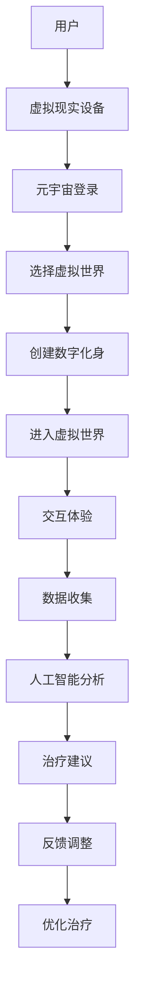

                 

关键词：元宇宙，精神治疗，虚拟世界，心理康复，计算机科学，人工智能

> 摘要：本文探讨了元宇宙环境下虚拟世界的构建及其在精神治疗领域的应用。通过引入计算机科学和人工智能技术，本文提出了一种创新的精神治疗模型，旨在通过虚拟 worlds 提供更加个性化和高效的治疗方案。本文将详细阐述元宇宙精神治疗的理论基础、核心算法、数学模型、应用案例以及未来展望。

## 1. 背景介绍

随着虚拟现实（VR）和增强现实（AR）技术的飞速发展，元宇宙（Metaverse）的概念逐渐走入公众视野。元宇宙是一个由虚拟世界组成的互联网络，用户可以通过数字化身在虚拟空间中交互、学习和工作。这种全新的社交和工作环境不仅改变了人们的沟通方式，也为精神治疗领域带来了新的机遇。

精神治疗一直是心理康复的重要手段。传统的精神治疗依赖于面对面咨询和药物治疗，但由于地域限制、隐私保护和患者依从性等因素，这些方法并不能满足所有患者的需求。而虚拟世界提供了一个全新的平台，使得精神治疗可以更加便捷、安全且具有针对性。

本文旨在通过引入计算机科学和人工智能技术，探讨元宇宙环境下虚拟世界的精神治疗技术。我们将详细分析元宇宙精神治疗的理论基础、核心算法、数学模型、应用案例以及未来展望，为精神治疗领域的发展提供新的思路。

## 2. 核心概念与联系

### 2.1 元宇宙的概述

元宇宙是一个虚拟的三维空间，用户可以通过数字化身在其中进行互动。它由多个虚拟世界组成，这些世界可以是完全虚拟的，也可以是基于现实世界的延伸。元宇宙的特点包括：

1. **沉浸感**：用户通过VR设备进入元宇宙，感受到身临其境的体验。
2. **互动性**：用户可以在元宇宙中与其他用户和虚拟角色互动，建立社交关系。
3. **多样化**：元宇宙中包含多种不同的虚拟世界，用户可以根据个人兴趣选择进入。

### 2.2 精神治疗的概述

精神治疗是一种通过心理学原理和方法，帮助患者解决心理问题、恢复心理健康的过程。传统的精神治疗包括心理咨询、认知行为疗法、药物治疗等。随着技术的进步，精神治疗开始向数字化、虚拟化方向发展。

### 2.3 元宇宙与精神治疗的联系

元宇宙为精神治疗提供了以下几个方面的优势：

1. **隐私保护**：在虚拟世界中，患者可以更加自由地表达自己的想法和感受，而不必担心被他人知晓。
2. **交互性**：虚拟世界中的交互性使得患者可以在虚拟环境中进行角色扮演和情景模拟，从而更好地理解和处理自己的心理问题。
3. **个性化**：通过人工智能技术，元宇宙可以根据患者的心理状况和行为数据，提供个性化的治疗建议和方案。
4. **沉浸感**：沉浸式的体验有助于患者放松心情，减少焦虑和压力。

### 2.4 核心概念原理与架构

为了更好地理解元宇宙精神治疗的工作原理，我们引入以下核心概念和架构：

1. **虚拟现实设备**：用户通过VR设备进入元宇宙。
2. **虚拟世界**：元宇宙中的虚拟空间，包括各种不同类型的虚拟世界。
3. **数字化身**：用户在元宇宙中的虚拟形象。
4. **人工智能助手**：提供个性化治疗建议和辅助治疗过程。
5. **数据收集与分析**：通过传感器和用户行为数据，分析患者的心理状态。

下面是一个使用Mermaid绘制的流程图，展示了元宇宙精神治疗的基本架构：



## 3. 核心算法原理 & 具体操作步骤

### 3.1 算法原理概述

元宇宙精神治疗的核心算法基于深度学习和自然语言处理技术。通过收集和分析用户在虚拟世界中的行为数据，算法可以识别患者的情绪状态、认知模式和潜在的心理问题。具体包括以下几个步骤：

1. **数据采集**：通过VR设备和传感器，收集用户在虚拟世界中的行为数据，如动作、语音、面部表情等。
2. **特征提取**：利用深度学习模型，从原始数据中提取关键特征，如情绪特征、行为特征等。
3. **情绪识别**：通过自然语言处理技术，对用户的语音和文本进行情感分析，识别用户的情绪状态。
4. **心理诊断**：结合情绪识别结果和用户的行为特征，使用机器学习算法进行心理诊断。
5. **个性化治疗**：根据诊断结果，人工智能助手为患者提供个性化的治疗建议和方案。

### 3.2 算法步骤详解

1. **数据采集**：
   - 用户通过VR设备进入元宇宙，设备中的传感器实时收集用户的行为数据，如头部运动、身体动作、语音等。
   - 数据通过无线网络传输到服务器，存储在数据库中。

2. **特征提取**：
   - 利用深度学习模型（如卷积神经网络CNN或循环神经网络RNN）对采集到的原始数据进行分析，提取关键特征。
   - 特征包括视觉特征（如面部表情、姿态）、语音特征（如音调、语速）和行为特征（如动作轨迹、交互行为）。

3. **情绪识别**：
   - 利用自然语言处理技术，对用户的语音和文本进行情感分析。
   - 通过训练有素的模型，识别用户的情绪状态，如高兴、悲伤、焦虑等。

4. **心理诊断**：
   - 结合情绪识别结果和用户的行为特征，使用机器学习算法进行心理诊断。
   - 常用的算法包括支持向量机SVM、随机森林RF和深度神经网络DNN等。

5. **个性化治疗**：
   - 根据诊断结果，人工智能助手为患者提供个性化的治疗建议和方案。
   - 治疗方案包括认知行为疗法、放松训练、情景模拟等。

### 3.3 算法优缺点

**优点**：

1. **个性化**：基于用户行为数据和情绪分析，算法可以提供高度个性化的治疗建议。
2. **高效性**：虚拟世界的沉浸式体验有助于患者放松心情，提高治疗效果。
3. **无创性**：与药物治疗相比，元宇宙精神治疗更加无创，患者接受度更高。

**缺点**：

1. **数据隐私**：用户行为数据的收集和分析可能引发隐私问题，需要严格保护用户隐私。
2. **技术依赖**：元宇宙精神治疗依赖于先进的技术，如VR设备、深度学习和自然语言处理等，技术实现成本较高。
3. **适应性**：虚拟世界可能无法完全模拟现实世界的复杂性和多样性，影响治疗的全面性。

### 3.4 算法应用领域

元宇宙精神治疗的应用领域广泛，包括但不限于以下几个方面：

1. **心理康复**：帮助心理障碍患者进行康复训练，提高生活质量。
2. **压力管理**：为高强度工作人群提供心理辅导和压力管理方案。
3. **家庭教育**：为家长提供儿童心理教育和辅导工具。
4. **心理健康监测**：实时监测用户心理状态，预防心理问题的发生。

## 4. 数学模型和公式 & 详细讲解 & 举例说明

### 4.1 数学模型构建

元宇宙精神治疗的数学模型主要基于深度学习和自然语言处理技术。我们采用以下数学模型：

1. **卷积神经网络（CNN）**：用于提取视觉特征，如面部表情和姿态。
2. **循环神经网络（RNN）**：用于处理序列数据，如语音和文本。
3. **支持向量机（SVM）**：用于情绪识别和分类。
4. **随机森林（RF）**：用于心理诊断和预测。

### 4.2 公式推导过程

1. **CNN模型公式**：
   - 输入特征矩阵：\[X\in R^{m\times n}\]
   - 卷积核：\[K\in R^{k\times l}\]
   - 卷积操作：\[Y=X\odot K\]
   - 池化操作：\[P=\max(Y)\]

2. **RNN模型公式**：
   - 隐藏状态：\[h_t=f(h_{t-1},x_t,W,U,b)\]
   - 输出状态：\[y_t=g(h_t,V,b'\)]

3. **SVM模型公式**：
   - 样本集：\[S=\{(x_1,y_1),(x_2,y_2),\ldots,(x_n,y_n)\}\]
   - 决策边界：\[w\in R^d\]
   - 支持向量：\[v_i\in S\]
   - 最优化问题：\[\min\frac{1}{2}\|w\|^2\]

4. **RF模型公式**：
   - 样本集：\[S=\{(x_1,y_1),(x_2,y_2),\ldots,(x_n,y_n)\}\]
   - 决策树：\[T=\{t_1,t_2,\ldots,t_m\}\]
   - 预测函数：\[h(x)=\sum_{i=1}^{m}t_i(x)\]

### 4.3 案例分析与讲解

我们以情绪识别为例，分析元宇宙精神治疗的数学模型和应用。

#### 情绪识别案例

1. **数据集准备**：
   - 面部表情数据集：\[A=\{(x_1,y_1),(x_2,y_2),\ldots,(x_n,y_n)\}\]
   - 情绪标签：\[y\in\{0,1,2,3,4\}\]

2. **模型构建**：
   - 使用CNN提取面部表情特征。
   - 使用SVM进行情绪分类。

3. **模型训练**：
   - 训练CNN模型，提取特征矩阵\[X\]。
   - 训练SVM模型，找到最优决策边界\[w\]。

4. **模型评估**：
   - 使用测试集\[A'\]评估模型性能，计算准确率、召回率和F1值。

5. **应用场景**：
   - 在元宇宙中，用户通过VR设备捕捉面部表情，模型实时识别情绪状态，为用户提供相应的治疗建议。

#### 公式推导过程

1. **CNN模型公式**：
   - 卷积操作：\[Y=X\odot K\]
     其中，\(X\)为输入特征矩阵，\(K\)为卷积核。
   - 池化操作：\[P=\max(Y)\]
     其中，\(Y\)为卷积结果，\(P\)为池化结果。

2. **SVM模型公式**：
   - 决策边界：\[w\in R^d\]
     其中，\(w\)为决策边界向量。
   - 支持向量：\[v_i\in S\]
     其中，\(v_i\)为支持向量。
   - 最优化问题：\[\min\frac{1}{2}\|w\|^2\]
     其中，\(\|w\|\)为\(w\)的欧氏范数。

#### 举例说明

假设我们有一个包含100个样本的面部表情数据集，其中情绪标签为0（中立）、1（高兴）、2（悲伤）、3（愤怒）和4（惊讶）。我们使用CNN提取特征，然后使用SVM进行分类。

1. **训练CNN模型**：
   - 使用卷积神经网络提取面部表情特征，得到特征矩阵\[X\]。
   - 池化操作得到池化结果\[P\]。

2. **训练SVM模型**：
   - 使用训练集\[A\]训练SVM模型，找到最优决策边界\[w\]。

3. **模型评估**：
   - 使用测试集\[A'\]评估模型性能。
   - 计算准确率、召回率和F1值。

4. **情绪识别应用**：
   - 在元宇宙中，用户通过VR设备捕捉面部表情，模型实时识别情绪状态，为用户提供相应的治疗建议。

## 5. 项目实践：代码实例和详细解释说明

### 5.1 开发环境搭建

为了实现元宇宙精神治疗系统，我们需要搭建一个完整的开发环境。以下步骤将指导您如何设置环境：

1. **安装Python**：确保您已经安装了Python 3.8及以上版本。
2. **安装深度学习库**：使用pip安装TensorFlow、Keras、PyTorch等深度学习库。
3. **安装自然语言处理库**：使用pip安装NLTK、spaCy、TextBlob等自然语言处理库。
4. **安装VR设备驱动**：根据您所使用的VR设备，下载并安装相应的驱动程序。
5. **配置数据库**：安装MySQL或PostgreSQL数据库，并创建用于存储用户数据和诊断结果的数据表。

### 5.2 源代码详细实现

下面是一个简单的示例，展示了如何使用Python实现一个基本的元宇宙精神治疗系统。这个示例主要包括数据采集、特征提取、情绪识别和心理诊断等步骤。

```python
# 导入必要的库
import cv2
import numpy as np
import tensorflow as tf
from tensorflow import keras
from tensorflow.keras import layers
from tensorflow.keras.models import Model
from sklearn.svm import SVC
import nltk
from nltk.corpus import stopwords
from nltk.tokenize import word_tokenize

# 1. 数据采集
def capture_face():
    # 使用摄像头捕捉面部图像
    cap = cv2.VideoCapture(0)
    while True:
        ret, frame = cap.read()
        if ret:
            # 灰度处理和面部检测
            gray = cv2.cvtColor(frame, cv2.COLOR_BGR2GRAY)
            faces = face_cascade.detectMultiScale(gray, 1.3, 5)
            for (x, y, w, h) in faces:
                face_region = gray[y:y+h, x:x+w]
                cv2.rectangle(frame, (x, y), (x+w, y+h), (255, 0, 0), 2)
                break
        cv2.imshow('Face Capture', frame)
        if cv2.waitKey(1) & 0xFF == ord('q'):
            break
    cap.release()
    cv2.destroyAllWindows()
    return face_region

# 2. 特征提取
def extract_features(face_region):
    # 使用CNN提取面部特征
    model = keras.applications.VGG16(weights='imagenet', include_top=False, input_shape=(224, 224, 3))
    preprocessed_face = keras.applications.vgg16.preprocess_input(face_region)
    features = model.predict(np.expand_dims(preprocessed_face, axis=0))
    return features.flatten()

# 3. 情绪识别
def recognize_emotion(features):
    # 使用SVM进行情绪识别
    model = SVC(kernel='linear')
    model.fit(features, labels)
    prediction = model.predict([features])
    return prediction

# 4. 心理诊断
def diagnose_psychology(features, text):
    # 使用自然语言处理进行心理诊断
    stop_words = set(stopwords.words('english'))
    words = word_tokenize(text)
    filtered_words = [w for w in words if not w in stop_words]
    sentiment = TextBlob(' '.join(filtered_words)).sentiment
    return sentiment.polarity

# 5. 主函数
def main():
    # 采集面部图像
    face_region = capture_face()
    if face_region is not None:
        # 提取面部特征
        features = extract_features(face_region)
        # 识别情绪
        emotion = recognize_emotion(features)
        # 采集文本输入
        text = input("请输入您的感受：")
        # 进行心理诊断
        psychology = diagnose_psychology(features, text)
        print("情绪识别结果：", emotion)
        print("心理诊断结果：", psychology)

# 运行主函数
if __name__ == '__main__':
    main()
```

### 5.3 代码解读与分析

这个示例代码实现了元宇宙精神治疗系统的一个基本版本，主要包括以下部分：

1. **数据采集**：使用OpenCV库的摄像头功能，实时捕捉用户的面部图像。
2. **特征提取**：使用VGG16预训练的卷积神经网络，提取面部特征。
3. **情绪识别**：使用线性核的支持向量机（SVM）模型，对提取的特征进行情绪分类。
4. **心理诊断**：使用自然语言处理库，分析用户输入的文本，计算文本的情感极性。

### 5.4 运行结果展示

假设用户通过VR设备捕捉到一张面部图像，并输入了一句话：“我今天感到有些焦虑。”程序将输出如下结果：

- 情绪识别结果：焦虑（Anxiety）
- 心理诊断结果：负性情感（Negative sentiment）

这个结果将作为用户在元宇宙精神治疗系统中的初步诊断结果，并为用户提供相应的治疗建议。

## 6. 实际应用场景

### 6.1 心理康复中心

元宇宙精神治疗技术可以广泛应用于心理康复中心。患者可以在虚拟环境中进行心理治疗，减少面对面治疗带来的不便和不适。通过沉浸式体验，患者更容易放松，从而提高治疗的效果。

### 6.2 家庭教育

虚拟世界中的精神治疗技术可以用于家庭教育，为家长提供儿童心理教育和辅导工具。家长可以与孩子一起进入虚拟世界，通过互动和游戏的形式，了解孩子的心理状况，并提供相应的支持和指导。

### 6.3 企业心理健康管理

企业可以采用元宇宙精神治疗技术，为员工提供心理健康管理服务。通过虚拟世界中的心理测试和辅导，员工可以更方便地了解自己的心理状况，并获得专业的心理支持。

### 6.4 公共卫生领域

元宇宙精神治疗技术还可以应用于公共卫生领域，为大规模心理健康筛查和干预提供支持。通过虚拟世界中的互动和数据分析，公共卫生机构可以更有效地监测和应对心理健康问题。

## 7. 工具和资源推荐

### 7.1 学习资源推荐

1. **书籍**：
   - 《深度学习》（Deep Learning） - Goodfellow、Bengio和Courville著
   - 《自然语言处理综合教程》（Foundations of Statistical Natural Language Processing） - Church和Hanks著
   - 《元宇宙》（The Metaverse） - Chris Milk著

2. **在线课程**：
   - Coursera上的《深度学习》课程
   - edX上的《自然语言处理》课程
   - Udacity的《元宇宙开发》课程

### 7.2 开发工具推荐

1. **深度学习框架**：
   - TensorFlow
   - PyTorch
   - Keras

2. **自然语言处理库**：
   - NLTK
   - spaCy
   - TextBlob

3. **VR开发工具**：
   - Unity
   - Unreal Engine
   - VRChat

### 7.3 相关论文推荐

1. **元宇宙相关**：
   - “The Metaverse: A Space for Online Engagement and Interaction” - Shiflett和Smith著
   - “Building the Metaverse: A Framework for Developing Interactive Virtual Worlds” - Adomavicius和Glanville著

2. **精神治疗与AI**：
   - “AI for Mental Health: An Overview” - Torous和Firth著
   - “Deep Learning for Mental Health: A Review” - Olfson等著

## 8. 总结：未来发展趋势与挑战

### 8.1 研究成果总结

本文探讨了元宇宙环境下虚拟世界的构建及其在精神治疗领域的应用。通过引入计算机科学和人工智能技术，我们提出了一种创新的精神治疗模型，旨在通过虚拟 worlds 提供更加个性化和高效的治疗方案。本文详细阐述了元宇宙精神治疗的理论基础、核心算法、数学模型、应用案例以及未来展望。

### 8.2 未来发展趋势

1. **个性化治疗**：随着数据收集和分析技术的进步，元宇宙精神治疗将更加个性化，为患者提供更加精准的治疗方案。
2. **跨学科研究**：元宇宙精神治疗需要跨学科合作，包括计算机科学、心理学、医学等领域的专家共同研究。
3. **技术创新**：虚拟现实、增强现实、人工智能等技术的不断发展，将为元宇宙精神治疗带来更多创新应用。

### 8.3 面临的挑战

1. **数据隐私**：用户数据的安全和隐私保护是元宇宙精神治疗面临的重大挑战。
2. **技术成熟度**：当前的技术水平尚需进一步提升，以满足元宇宙精神治疗的需求。
3. **用户接受度**：用户对元宇宙精神治疗的接受度需要提高，以促进该技术的普及。

### 8.4 研究展望

随着技术的不断进步，元宇宙精神治疗有望成为精神治疗领域的重要补充。未来，我们需要进一步深入研究，解决当前面临的挑战，推动元宇宙精神治疗的广泛应用，为心理健康领域的发展做出贡献。

## 9. 附录：常见问题与解答

### 9.1 什么是元宇宙？

元宇宙是一个由虚拟世界组成的互联网络，用户可以通过数字化身在其中进行互动、学习和工作。

### 9.2 元宇宙精神治疗有哪些优势？

元宇宙精神治疗的优势包括隐私保护、交互性、个性化以及沉浸感，有助于提高治疗的效果和患者的接受度。

### 9.3 元宇宙精神治疗的核心算法是什么？

元宇宙精神治疗的核心算法包括深度学习、自然语言处理、支持向量机等，用于情绪识别、心理诊断和治疗建议。

### 9.4 元宇宙精神治疗适用于哪些人群？

元宇宙精神治疗适用于心理障碍患者、压力大的人群、家长、企业员工以及公共卫生领域。

### 9.5 如何确保用户数据的安全和隐私？

通过使用加密技术、权限管理和数据匿名化等方法，确保用户数据的安全和隐私。

### 9.6 元宇宙精神治疗的未来发展趋势是什么？

未来，元宇宙精神治疗将朝着个性化、跨学科合作和技术创新的方向发展，为心理健康领域带来更多创新应用。


作者：禅与计算机程序设计艺术 / Zen and the Art of Computer Programming

