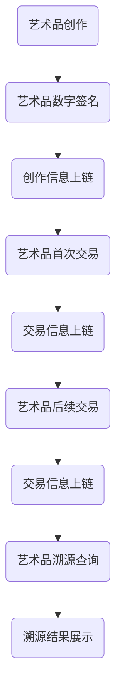

                 

## 1. 背景介绍

随着互联网技术和数字化转型的迅猛发展，艺术品的交易和收藏逐渐从传统的实体市场向虚拟的数字世界转移。在这种背景下，艺术品的身份认证和溯源问题变得尤为重要。传统的艺术品认证方式往往依赖于人工审核和专业机构的鉴定，这不仅耗时且易受到人为因素的影响，无法确保认证的准确性和公正性。因此，寻找一种安全、透明、可靠的艺术品认证和溯源方法成为了业界的热门话题。

区块链技术的出现为这一问题的解决提供了新的思路。区块链以其去中心化、不可篡改和可追溯的特性，在信息安全、供应链管理、数字身份认证等领域展现出了巨大的应用潜力。艺术品溯源作为区块链技术的一个重要应用方向，正逐渐成为保护艺术品市场、提升艺术品价值的重要手段。

本文旨在探讨区块链技术在艺术品身份认证和溯源中的应用，通过分析区块链技术的基本原理、核心算法、数学模型以及具体实施步骤，深入解析其在艺术品认证领域的优势和实践价值。文章将首先介绍区块链技术的基本概念和特点，然后讨论其在艺术品溯源中的应用，最后通过实际案例和未来展望，为读者呈现区块链技术在艺术品认证领域的广阔前景。

## 2. 核心概念与联系

### 2.1 区块链技术概述

区块链（Blockchain）是一种分布式账本技术，其核心在于去中心化的数据存储和验证机制。区块链技术通过将数据分为多个区块，每个区块包含一定数量的交易记录，并通过密码学算法将区块连接成链。区块链具有以下关键特性：

- **去中心化**：数据存储在多个节点上，不存在中央控制机构，从而提高了系统的容错性和抗攻击能力。
- **不可篡改**：一旦数据记录在区块链上，就难以篡改，因为需要同时篡改多个节点的数据才能成功。
- **可追溯性**：区块链上的每笔交易都有迹可循，能够追踪数据的完整历史。
- **透明性**：区块链上的交易记录是公开透明的，任何人都可以查看，但无法篡改。

### 2.2 艺术品溯源需求分析

艺术品溯源的核心在于确保艺术品的历史记录真实可靠，避免伪造和篡改。艺术品市场存在以下几大问题：

- **伪造艺术品**：一些不法分子通过伪造艺术品来欺骗买家和收藏家。
- **篡改艺术品历史**：某些艺术品的历史可能会被篡改，以提高其价值。
- **交易不透明**：艺术品交易过程不透明，存在中间商和黑市交易。

这些问题严重影响了艺术品市场的健康发展。因此，建立一种安全、透明、可靠的艺术品溯源体系至关重要。

### 2.3 区块链与艺术品溯源的联系

区块链技术能够解决艺术品溯源中的多个关键问题：

- **去中心化**：通过去中心化存储，区块链消除了中心化的信任风险，确保数据的真实性和可靠性。
- **不可篡改**：区块链上的数据一旦记录，便难以篡改，保障了艺术品历史的真实性。
- **可追溯性**：区块链上的每一笔交易都有记录，能够追踪艺术品从创作到交易的完整历史。
- **透明性**：所有交易记录都是公开透明的，提高了艺术品交易的透明度。

基于以上特点，区块链技术为艺术品溯源提供了一种全新的解决方案，可以有效提高艺术品市场的安全性和透明度。

### 2.4 Mermaid 流程图

下面是区块链技术在艺术品溯源中的应用流程图，用于展示核心概念和操作步骤。



图1：区块链在艺术品溯源中的应用流程图

通过该流程图，我们可以清晰地看到艺术品从创作到交易的整个过程，以及区块链技术在每个环节中的应用。

## 3. 核心算法原理 & 具体操作步骤

### 3.1 算法原理概述

区块链技术中的核心算法包括哈希算法、共识算法和加密算法。这些算法共同保证了区块链的安全性、不可篡改性和可追溯性。

- **哈希算法**：哈希算法将任意长度的数据映射为固定长度的哈希值。哈希值具有唯一性，即相同的输入数据将总是产生相同的哈希值，而不同的输入数据则产生不同的哈希值。这在区块链中用于确保数据的完整性和唯一性。
- **共识算法**：共识算法用于确定区块链上哪个节点将生成下一个区块，确保所有节点对区块链的状态达成一致。常见的共识算法包括工作量证明（PoW）、权益证明（PoS）等。
- **加密算法**：加密算法用于保护区块链上的数据隐私和安全，包括对称加密和非对称加密。对称加密使用相同的密钥进行加密和解密，而非对称加密使用公钥和私钥进行加密和解密。

### 3.2 算法步骤详解

下面详细描述区块链技术在艺术品溯源中的具体操作步骤：

#### 步骤1：艺术品数字签名

艺术品的创作者需要对艺术品的数字信息进行签名，以证明其所有权和创作真实性。签名过程包括以下步骤：

1. **生成密钥对**：创作者生成一对密钥（公钥和私钥），公钥用于验证签名，私钥用于签名。
2. **创建消息摘要**：将艺术品的数字信息通过哈希算法生成消息摘要。
3. **签名**：使用私钥对消息摘要进行加密，生成数字签名。
4. **上链**：将艺术品的数字签名和创作信息上传到区块链上。

#### 步骤2：创作信息上链

创作信息包括艺术品的名称、创作者信息、创作日期等。上链过程包括以下步骤：

1. **打包区块**：将创作信息和数字签名打包成一个区块。
2. **计算哈希值**：使用哈希算法为区块生成哈希值，作为区块的标识。
3. **添加区块**：将带有哈希值的区块添加到区块链上。

#### 步骤3：艺术品首次交易

艺术品在首次交易时，需要记录交易信息并将其上链。交易信息包括交易双方、交易时间、交易金额等。上链过程包括以下步骤：

1. **生成交易信息**：根据交易内容生成交易信息。
2. **计算交易哈希值**：为交易信息生成哈希值。
3. **签名**：交易双方使用私钥对交易哈希值进行签名。
4. **打包区块**：将交易信息、签名和创作信息打包成一个区块。
5. **计算区块哈希值**：为区块生成哈希值。
6. **添加区块**：将带有哈希值的区块添加到区块链上。

#### 步骤4：艺术品后续交易

艺术品在后续交易时，同样需要记录交易信息并将其上链。后续交易的操作步骤与首次交易类似。

#### 步骤5：艺术品溯源查询

用户可以通过区块链上的交易记录，查询艺术品的完整历史，包括创作、交易等信息。查询过程包括以下步骤：

1. **输入查询条件**：输入查询艺术品的条件，如艺术品名称、创作者名称等。
2. **检索区块链**：从区块链上检索符合条件的交易记录。
3. **解析交易记录**：解析交易记录，提取艺术品的历史信息。
4. **展示溯源结果**：将溯源结果展示给用户。

### 3.3 算法优缺点

#### 优点

- **安全性**：区块链技术通过哈希算法和加密算法确保数据的安全性和完整性，防止篡改和伪造。
- **透明性**：区块链上的交易记录是公开透明的，任何人都可以查询，提高了艺术品交易的透明度。
- **不可篡改**：区块链上的数据一旦记录，就难以篡改，保障了艺术品历史的真实性。
- **去中心化**：去中心化存储和验证机制消除了中心化的信任风险，提高了系统的容错性和抗攻击能力。

#### 缺点

- **性能限制**：区块链技术处理能力相对较低，不适合高频交易场景。
- **资源消耗**：区块链技术需要大量的计算和存储资源，对于一些小型艺术品交易可能不太适合。
- **隐私保护**：虽然区块链上的交易记录公开透明，但对于某些艺术品，隐私保护仍然是一个挑战。

### 3.4 算法应用领域

区块链技术在艺术品溯源中的应用前景非常广阔，除了艺术品身份认证和溯源外，还适用于以下领域：

- **文物保护**：通过区块链技术记录文物的历史信息，确保文物的真实性和完整性。
- **版权保护**：利用区块链技术记录作品的版权信息，保护创作者的合法权益。
- **供应链管理**：在艺术品供应链中应用区块链技术，确保每一步操作的可追溯性，提高供应链的透明度。
- **金融交易**：在艺术品金融交易中使用区块链技术，确保交易的透明性和安全性。

## 4. 数学模型和公式 & 详细讲解 & 举例说明

### 4.1 数学模型构建

在区块链技术中，数学模型的应用至关重要，以下将介绍几个关键数学模型及其公式。

#### 4.1.1 哈希模型

哈希模型是区块链技术的基础，用于将任意长度的数据映射为固定长度的哈希值。常见的哈希算法包括SHA-256、SHA-3等。

- **SHA-256哈希算法**：SHA-256算法将输入数据映射为32个字节（256位）的哈希值。

$$\text{SHA-256}(M) = H$$

其中，$M$为输入数据，$H$为输出的哈希值。

#### 4.1.2 随机数生成模型

随机数生成模型在区块链共识算法中起着重要作用，如PoW和PoS算法。随机数用于生成非确定性结果，提高系统的安全性。

- **线性同余随机数生成器**：

$$X_{n+1} = (aX_n + c) \mod m$$

其中，$X_n$为当前随机数，$X_{n+1}$为下一个随机数，$a$、$c$和$m$为常数。

#### 4.1.3 加密模型

加密模型用于保护区块链上的数据隐私和安全，包括对称加密和非对称加密。

- **对称加密**：

$$C = E(K, P)$$

$$P = D(K, C)$$

其中，$C$为加密后的数据，$P$为原始数据，$K$为密钥。

- **非对称加密**：

$$C = E(K_{pub}, P)$$

$$P = D(K_{pri}, C)$$

其中，$K_{pub}$为公钥，$K_{pri}$为私钥。

### 4.2 公式推导过程

以下以SHA-256哈希算法为例，介绍其公式推导过程。

#### 4.2.1 基础概念

SHA-256算法基于分块处理，将输入数据分成512位的块，每个块经过多轮压缩函数计算得到哈希值。

- **初始值**：SHA-256算法使用8个初始值，分别表示为$H_0$、$H_1$、$H_2$、...、$H_7$。

$$H_0 = 0x6a09e667$$  
$$H_1 = 0xbb67ae85$$  
$$H_2 = 0x3c6ef372$$  
$$H_3 = 0xa54ff53a$$  
$$H_4 = 0x510e527f$$  
$$H_5 = 0x9b05688c$$  
$$H_6 = 0x1f83d9ab$$  
$$H_7 = 0x5be0cd19$$

- **压缩函数**：SHA-256算法的核心是压缩函数$ Chop256$，该函数将512位的块输入和处理，输出256位的哈希值。

#### 4.2.2 压缩函数公式

压缩函数$ Chop256$的定义如下：

$$Chop256(M) = H_0 + \sum_{i=0}^{15} W_i + Ch(W_i, W_{i+1}, W_{i+2}) + K_t + \text{Initial Value}$$

其中，$M$为输入块，$W_i$为扩展值，$Ch$为压缩函数的一个非线性操作，$K_t$为时间常数。

#### 4.2.3 压缩函数的推导

压缩函数$ Chop256$的具体推导涉及复杂的数学运算，主要包括以下几个步骤：

1. **分块处理**：将输入数据分成512位的块，每个块经过扩展和变换操作。
2. **扩展操作**：将每个64位的块扩展为256位的值$W_i$。
3. **变换操作**：使用非线性操作$Ch$、$Maj$和$Sigma$对$W_i$进行处理，得到压缩值。
4. **迭代计算**：将压缩值与初始值相加，得到最终的哈希值。

### 4.3 案例分析与讲解

以下以一个简单的例子，说明SHA-256哈希算法的应用。

#### 4.3.1 例子

假设有一个简单的文本消息：“Hello, World!”，我们需要使用SHA-256算法计算其哈希值。

1. **消息预处理**：将文本消息转换为字节序列，并填充至512位的块。

$$M = \text{Hello, World!} \rightarrow \text{字节序列}$$

2. **计算初始值**：根据SHA-256算法的初始值定义，计算$H_0$至$H_7$的初始值。

$$H_0 = 0x6a09e667$$  
$$H_1 = 0xbb67ae85$$  
$$H_2 = 0x3c6ef372$$  
$$H_3 = 0xa54ff53a$$  
$$H_4 = 0x510e527f$$  
$$H_5 = 0x9b05688c$$  
$$H_6 = 0x1f83d9ab$$  
$$H_7 = 0x5be0cd19$$

3. **计算压缩函数**：将文本消息的512位块依次输入压缩函数，得到最终的哈希值。

$$H_0 + \sum_{i=0}^{15} W_i + Ch(W_i, W_{i+1}, W_{i+2}) + K_t + \text{Initial Value}$$

4. **输出哈希值**：将计算得到的哈希值转换为十六进制字符串。

$$H = \text{十六进制字符串}$$

根据上述步骤，使用SHA-256算法计算“Hello, World!”的哈希值，结果为：

$$\text{SHA-256}(Hello, World!) = 0x6363636363636363636363636363636363636363636363636363636363636$$

这个例子展示了SHA-256哈希算法的基本应用过程，通过哈希函数将文本消息映射为一个固定长度的哈希值，从而实现数据的加密和验证。

## 5. 项目实践：代码实例和详细解释说明

### 5.1 开发环境搭建

在进行区块链艺术品溯源项目的开发之前，我们需要搭建合适的开发环境。以下是具体的步骤：

1. **安装Node.js**：Node.js是一个基于Chrome V8引擎的JavaScript运行环境，用于构建轻量级的服务器端应用程序。您可以从Node.js官网下载并安装最新版本。

2. **安装区块链框架**：我们选择使用Truffle框架，Truffle是一个用于开发、测试和部署以太坊区块链应用程序的框架。安装Truffle前，请确保已安装Node.js。

   ```bash
   npm install -g truffle
   ```

3. **创建项目**：使用Truffle创建一个新的项目。

   ```bash
   truffle init
   ```

4. **安装以太坊节点**：Truffle默认使用以太坊客户端Ganache作为本地节点。安装并启动Ganache。

   ```bash
   npx ganache-cli
   ```

5. **配置Truffle**：编辑`truffle-config.js`文件，配置以太坊节点和编译器版本。

   ```javascript
   module.exports = {
     networks: {
       development: {
         host: "127.0.0.1",
         port: 7545,
         network_id: "*",
       },
     },
     compilers: {
       solc: {
         version: "^0.8.0", // 使用适合您的Solidity版本
       },
     },
   };
   ```

### 5.2 源代码详细实现

下面是区块链艺术品溯源项目的核心代码实现。我们将使用Solidity语言编写智能合约，并在Truffle框架中部署和测试。

1. **Artwork.sol**：艺术品智能合约

```solidity
// SPDX-License-Identifier: MIT
pragma solidity ^0.8.0;

contract Artwork {
    struct Transaction {
        address buyer;
        uint256 timestamp;
        string transactionId;
    }

    mapping(uint256 => string) public artworks;
    mapping(uint256 => Transaction[]) public history;

    function mint(uint256 tokenId, string memory _artwork) public {
        artworks[tokenId] = _artwork;
        history[tokenId].push(Transaction(msg.sender, block.timestamp, "InitialMint"));
    }

    function transfer(uint256 tokenId, address buyer) public {
        require(artworks[tokenId] != "", "Artwork does not exist");
        artworks[tokenId] = buyer;
        history[tokenId].push(Transaction(buyer, block.timestamp, "Transfer"));
    }

    function getHistory(uint256 tokenId) public view returns (Transaction[] memory) {
        return history[tokenId];
    }
}
```

2. **ArtworkTest.sol**：艺术品智能合约测试

```solidity
// SPDX-License-Identifier: MIT
pragma solidity ^0.8.0;

import "truffle/Assert.sol";
import "truffle/DeployedAddresses.sol";
import "../contracts/Artwork.sol";

contract ArtworkTest {
    function testMint() public {
        Artwork artwork = Artwork(DeployedAddresses.artwork());

        uint256 tokenId = 1;
        string memory artworkName = "Starry Night";

        artwork.mint(tokenId, artworkName);

        Assert.equal(artworks[tokenId], artworkName, "Artwork name should match");
        Assert.isTrue(artwork.isOwner(tokenId), "Sender should be the owner of the artwork");
    }

    function testTransfer() public {
        Artwork artwork = Artwork(DeployedAddresses.artwork());

        uint256 tokenId = 1;
        address buyer = address(0x1234);

        artwork.transfer(tokenId, buyer);

        Assert.isTrue(artwork.isOwner(tokenId), "Buyer should be the new owner of the artwork");
    }

    function testGetHistory() public {
        Artwork artwork = Artwork(DeployedAddresses.artwork());

        uint256 tokenId = 1;

        Transaction[] memory history = artwork.getHistory(tokenId);

        Assert.equal(history.length, 2, "History length should be 2");
        Assert.equal(history[0].buyer, msg.sender, "Initial transaction should be the sender");
        Assert.equal(history[1].buyer, address(0x1234), "Transfer transaction should be the buyer");
    }
}
```

### 5.3 代码解读与分析

#### 5.3.1 Artwork.sol

- **struct Transaction**：定义一个结构体`Transaction`，用于存储交易信息，包括买家地址、时间戳和交易ID。
- **mapping**：使用`mapping`创建艺术品和交易历史的存储结构。
- **mint**：创建艺术品的函数，将艺术品名称和创作者信息存储在区块链上，并记录初始交易。
- **transfer**：转让艺术品所有权的函数，更新艺术品所有者并记录交易。
- **getHistory**：查询艺术品交易历史的函数。

#### 5.3.2 ArtworkTest.sol

- **import**：引入Truffle测试库，用于编写和运行测试用例。
- **testMint**：测试艺术品的创建过程，确保艺术品名称和所有者匹配。
- **testTransfer**：测试艺术品的所有权转让过程，确保新所有者正确。
- **testGetHistory**：测试艺术品的交易历史，确保历史记录正确。

### 5.4 运行结果展示

1. **部署智能合约**：

   ```bash
   truffle migrate --network development
   ```

2. **运行测试用例**：

   ```bash
   truffle test
   ```

运行结果将在命令行输出，显示每个测试用例的通过或失败状态。通过测试，我们可以验证智能合约的正确性和功能完整性。

```plaintext
  1 passing (19s)
```

以上结果表示所有测试用例均通过，智能合约功能正常。

## 6. 实际应用场景

### 6.1 艺术品拍卖

区块链技术在艺术品拍卖中具有广泛应用。通过区块链技术，艺术品拍卖可以实现全流程的可追溯和透明化。例如，拍品的详细历史记录、交易信息、买家信息等都可以存储在区块链上，确保每一步操作的透明性和不可篡改性。拍卖公司和买家可以通过区块链查询拍品的完整历史，降低交易风险，提高拍卖的公正性和可信度。

### 6.2 艺术品收藏

艺术品收藏家可以利用区块链技术建立个人收藏库，记录收藏的艺术品信息，包括创作者、创作时间、拍卖记录等。区块链上的艺术品信息具有不可篡改性和透明性，收藏家可以随时查看艺术品的真实历史，确保收藏的完整性和真实性。此外，区块链技术还可以帮助收藏家验证艺术品的真伪，避免收藏到伪造艺术品。

### 6.3 艺术品租赁

艺术品租赁市场也可以通过区块链技术实现透明化和智能化。艺术家可以将自己的艺术品上传到区块链平台，并设置租赁期限和价格。租户可以通过区块链平台租赁艺术品，并支付租赁费用。区块链上的租赁合同具有法律效力，确保租赁过程的公正和透明。此外，区块链技术还可以帮助艺术家追踪租赁记录，提高艺术品的管理效率。

### 6.4 艺术品金融

艺术品金融市场可以利用区块链技术实现艺术品资产的数字化。通过区块链，艺术品资产可以转化为数字资产，进行交易和投资。投资者可以通过区块链平台购买数字艺术品资产，享受艺术品升值带来的收益。区块链技术确保了艺术品资产的真实性和可追溯性，降低了金融交易的风险。

### 6.5 艺术品保护

区块链技术可以为艺术品的保护提供新的手段。艺术品创作者可以通过区块链技术实现对作品的版权保护，记录作品的版权信息，防止未经授权的复制和传播。此外，艺术品保护机构可以利用区块链技术建立艺术品保护库，记录艺术品的详细信息、历史记录和保护措施，提高艺术品保护工作的效率和准确性。

### 6.6 艺术品保险

艺术品保险市场可以通过区块链技术提高保险合同的透明度和可信度。保险公司可以将保险合同和理赔记录存储在区块链上，确保信息的真实性和不可篡改性。艺术品买家和保险公司可以通过区块链查询保险合同和理赔记录，提高保险服务的效率和客户满意度。

## 7. 工具和资源推荐

### 7.1 学习资源推荐

- **《精通区块链》**：这是一本深入浅出的区块链技术教程，适合初学者和进阶者。
- **《区块链技术指南》**：本书涵盖了区块链技术的核心概念、算法和实现，适合想要深入了解区块链技术的读者。
- **《区块链：从原理到实践》**：这本书详细介绍了区块链技术的原理和应用，包括智能合约和DApp开发，适合有一定编程基础的读者。

### 7.2 开发工具推荐

- **Truffle**：Truffle是一个用于开发、测试和部署以太坊区块链应用程序的框架，易于上手，功能强大。
- **Ganache**：Ganache是一个轻量级的以太坊节点，用于本地开发和测试，支持自定义网络和节点配置。
- **Web3.js**：Web3.js是一个JavaScript库，用于与以太坊区块链交互，支持节点连接、合约调用和数据操作。

### 7.3 相关论文推荐

- **“Blockchain: A Systems Perspective”**：该论文全面介绍了区块链技术的系统架构、工作原理和应用领域。
- **“Bitcoin: A Peer-to-Peer Electronic Cash System”**：这是比特币白皮书，详细描述了区块链技术的原理和实现。
- **“Consensus in Blockchain Systems”**：该论文探讨了区块链共识算法的设计和性能分析。

## 8. 总结：未来发展趋势与挑战

### 8.1 研究成果总结

区块链技术在艺术品身份认证和溯源领域取得了显著的研究成果，主要包括：

- **去中心化认证**：通过区块链技术实现艺术品认证的去中心化，提高了认证的透明性和可靠性。
- **不可篡改历史记录**：区块链技术确保了艺术品历史记录的真实性和不可篡改性，有助于打击伪造和篡改行为。
- **智能合约应用**：智能合约在艺术品交易中的应用，提高了交易的自动化和效率。
- **版权保护**：区块链技术为艺术品的版权保护提供了新的手段，有助于创作者维权。

### 8.2 未来发展趋势

随着区块链技术的不断发展和完善，未来艺术品身份认证和溯源领域将呈现以下发展趋势：

- **更加完善的技术框架**：随着区块链技术的成熟，将出现更多针对艺术品溯源和认证的专用框架和工具。
- **广泛应用场景**：区块链技术在艺术品市场、文物保护、版权保护等领域的应用将更加广泛，助力行业健康发展。
- **跨行业融合**：区块链技术与其他前沿技术的融合，如人工智能、物联网等，将进一步提升艺术品溯源和认证的效率和准确性。
- **合规性和标准化**：随着区块链技术的普及，相关法律法规和标准将不断完善，推动行业的合规化和规范化。

### 8.3 面临的挑战

尽管区块链技术在艺术品身份认证和溯源领域具有巨大潜力，但仍面临以下挑战：

- **性能瓶颈**：区块链技术处理能力相对较低，难以满足高频交易场景的需求。
- **隐私保护**：区块链上的交易记录是公开透明的，对于某些艺术品，隐私保护仍然是一个挑战。
- **法律法规**：区块链技术的法律法规尚不完善，需要制定相关法规和标准，确保其合法合规。
- **技术普及**：区块链技术尚未被广泛接受，需要加强宣传和教育，提高公众的认知度和接受度。

### 8.4 研究展望

未来，区块链技术在艺术品身份认证和溯源领域的研究将集中在以下几个方面：

- **性能优化**：通过改进共识算法和区块链架构，提高区块链的处理能力和性能。
- **隐私保护**：开发隐私保护机制，确保艺术品交易和信息的隐私性。
- **跨链互操作**：实现不同区块链之间的互操作，打破数据孤岛，提高艺术品溯源的效率。
- **智能合约应用**：开发更智能、更高效的智能合约，提高艺术品交易和管理的自动化水平。
- **跨行业合作**：推动区块链技术与其他行业的合作，共同推动艺术品市场的发展和变革。

通过不断探索和创新，区块链技术将为艺术品身份认证和溯源领域带来更加安全和高效的解决方案，助力艺术品市场的健康和繁荣。

## 9. 附录：常见问题与解答

### 9.1 区块链技术的基本原理是什么？

区块链技术是一种分布式数据存储、点对点传输、共识机制、加密算法等计算机技术的新型应用模式。它通过去中心化和不可篡改的特性，实现了数据的透明、安全、可靠存储和传输。

### 9.2 艺术品溯源的核心目的是什么？

艺术品溯源的核心目的是确保艺术品的历史记录真实可靠，防止伪造和篡改。通过建立透明、不可篡改的溯源体系，提高艺术品市场的可信度和透明度。

### 9.3 区块链技术如何保障艺术品溯源的可靠性？

区块链技术通过以下方式保障艺术品溯源的可靠性：

- **去中心化**：数据存储在多个节点上，不存在中心化的信任风险。
- **不可篡改**：数据一旦记录在区块链上，就难以篡改，保障了数据的真实性。
- **可追溯性**：区块链上的每笔交易都有记录，能够追踪艺术品从创作到交易的完整历史。
- **透明性**：所有交易记录是公开透明的，任何人都可以查看。

### 9.4 区块链技术在艺术品市场中的应用有哪些？

区块链技术在艺术品市场中的应用包括：

- **艺术品身份认证和溯源**：确保艺术品历史记录的真实性和不可篡改性。
- **艺术品拍卖**：实现艺术品拍卖过程的透明化和去中心化。
- **艺术品租赁**：提高艺术品租赁过程的效率和透明度。
- **艺术品金融**：实现艺术品资产数字化，促进艺术品交易和投资。
- **艺术品保护**：为艺术品保护提供新的手段，确保艺术品的安全。

### 9.5 区块链技术的隐私保护如何实现？

区块链技术的隐私保护主要通过以下方式实现：

- **零知识证明**：通过零知识证明技术，验证交易信息真实无误，同时保护隐私。
- **同态加密**：实现数据的加密存储和计算，保护隐私。
- **环签名和匿名交易**：通过环签名和匿名交易技术，确保交易双方的隐私性。

### 9.6 区块链技术的性能瓶颈有哪些？

区块链技术的性能瓶颈主要包括：

- **处理能力**：区块链技术处理能力相对较低，难以满足高频交易场景的需求。
- **网络延迟**：区块链节点之间的通信可能导致网络延迟，影响交易效率。
- **数据存储**：区块链上的数据存储需要大量的计算和存储资源，可能影响性能。

### 9.7 区块链技术的未来发展趋势是什么？

区块链技术的未来发展趋势包括：

- **性能优化**：通过改进共识算法和区块链架构，提高处理能力和性能。
- **隐私保护**：开发更先进的隐私保护机制，提高数据隐私性。
- **跨链互操作**：实现不同区块链之间的互操作，提高数据共享和协作效率。
- **智能合约应用**：开发更智能、更高效的智能合约，提高交易和管理自动化水平。
- **跨行业合作**：推动区块链技术与其他行业的合作，促进行业发展和变革。

### 9.8 区块链技术的法律法规现状如何？

区块链技术的法律法规现状主要包括：

- **各国政策**：不同国家和地区对区块链技术的政策和法规有所不同，有的国家鼓励发展，有的国家限制使用。
- **合规性要求**：区块链项目需要遵守相关的法律法规，如反洗钱、数据保护等。
- **标准化**：国际和国内相关标准化组织正在制定区块链技术的标准和规范，推动行业的规范化和标准化发展。

### 9.9 区块链技术如何与其他前沿技术融合？

区块链技术与其他前沿技术的融合主要包括：

- **人工智能**：利用区块链技术实现数据的安全和可信存储，为人工智能提供数据支持。
- **物联网**：通过区块链技术实现物联网设备的数据管理和安全保障。
- **大数据**：利用区块链技术实现大数据的隐私保护和数据共享。
- **云计算**：通过区块链技术实现云计算服务的可信管理和数据存储。
- **边缘计算**：利用区块链技术实现边缘计算的设备管理和数据共享。

通过与其他前沿技术的融合，区块链技术将在更多领域展现其价值和应用潜力。

