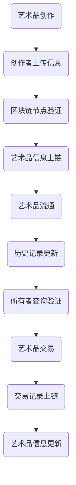

                 

关键词：元宇宙、艺术身份认证、区块链技术、艺术品溯源、智能合约、非同质化代币(NFT)

> 摘要：随着元宇宙的兴起，艺术品市场正在发生巨大的变革。区块链技术以其去中心化、透明性和不可篡改的特性，为艺术品的身份认证和溯源提供了全新的解决方案。本文将探讨区块链技术在艺术品溯源中的应用，分析其在元宇宙艺术身份认证中的优势与挑战，并提出未来发展的方向。

## 1. 背景介绍

### 元宇宙与艺术品的崛起

随着数字技术的发展，虚拟现实（VR）、增强现实（AR）以及区块链技术等前沿技术的应用日益普及，元宇宙逐渐成为人们关注的焦点。元宇宙是一个由虚拟世界和现实世界交互融合的数字化空间，它不仅包含了虚拟的游戏世界，还涵盖了社交、商业、艺术等多个领域。

在艺术领域，艺术品的价值不仅仅是其美学意义，还包含了历史、文化和知识产权等多重价值。然而，艺术品市场的复杂性也带来了一系列问题，如伪造、侵权和交易透明度不足等。这些问题严重影响了艺术品的交易和收藏，阻碍了艺术市场的健康发展。

### 艺术品溯源的需求

艺术品溯源是指通过技术手段，对艺术品的创作、流通、展览和收藏等环节进行记录和追踪。这有助于确保艺术品的真实性、历史性和完整性，提高市场信任度和透明度。

艺术品溯源的需求源于以下几个方面：

1. **防止伪造**：随着科技的发展，艺术品伪造的手段越来越高级，这给艺术品市场带来了巨大的风险。溯源技术可以有效地识别和防止伪造艺术品。
2. **保护知识产权**：艺术品的创作包含知识产权，溯源技术可以帮助艺术家和保护机构追踪其作品的流通情况，防止未经授权的复制和销售。
3. **增强交易透明度**：透明度是艺术品市场健康发展的基础。溯源技术可以记录艺术品的每一笔交易，确保交易过程的公开、公正和透明。
4. **提升艺术品价值**：真实的艺术品具有更高的收藏价值和市场潜力。溯源技术能够增强艺术品的可信度，从而提升其市场价值。

## 2. 核心概念与联系

### 区块链技术的基本原理

区块链技术是一种分布式数据库技术，通过加密算法和共识机制，实现了数据的不可篡改和透明性。区块链由多个区块组成，每个区块包含了若干条数据记录，这些区块按照时间顺序链接在一起，形成了一个连续的链式结构。

区块链的关键特性包括：

1. **去中心化**：区块链不需要中心化的管理机构，所有节点都参与网络的维护和管理。
2. **不可篡改**：一旦数据记录在区块链上，就几乎不可能被篡改或删除。
3. **透明性**：区块链上的数据对所有节点都是透明的，任何人都可以查看和验证数据。

### 艺术身份认证与区块链的联系

艺术身份认证是指通过技术手段，对艺术品的创作者、所有者、历史记录等信息进行认证。区块链技术为艺术身份认证提供了以下几种可能性：

1. **去中心化的认证**：传统的艺术品认证往往依赖于中心化的机构，如艺术品鉴定机构、拍卖行等。这些机构存在信息不透明、认证费用高等问题。区块链技术可以通过去中心化的方式，由多个节点共同验证艺术品的身份，减少中间环节，提高效率。
2. **不可篡改的记录**：区块链上的数据具有不可篡改的特性，这确保了艺术品信息的真实性和完整性。一旦艺术品的信息被记录在区块链上，就难以被篡改或删除。
3. **透明的数据查询**：任何人都可以通过区块链查询艺术品的详细信息，包括创作时间、创作者、历史交易记录等，这提高了市场的透明度和信任度。

### 艺术品溯源与区块链的关系

艺术品溯源是指通过技术手段，对艺术品的创作、流通、展览、收藏等环节进行记录和追踪。区块链技术为艺术品溯源提供了以下几种可能性：

1. **全流程记录**：区块链技术可以记录艺术品从创作到交易的每一个环节，包括创作者、所有者、展览信息、交易记录等，形成一个完整的溯源链条。
2. **去中心化的存储**：传统的溯源系统往往依赖于中心化的数据库，这存在数据泄露、篡改的风险。区块链技术通过去中心化的方式，将数据分散存储在多个节点上，提高了系统的安全性和可靠性。
3. **透明的验证**：区块链上的数据对所有节点都是透明的，任何人都可以验证艺术品的信息。这确保了艺术品信息的真实性和可信度。

### Mermaid 流程图



## 3. 核心算法原理 & 具体操作步骤

### 3.1 算法原理概述

区块链技术在艺术品身份认证和溯源中，主要依赖于以下几种核心算法：

1. **哈希算法**：哈希算法将任意长度的数据转换为固定长度的字符串，这种字符串被称为哈希值。哈希值具有唯一性，即不同的数据会产生不同的哈希值，而相同的哈希值代表相同的数据。
2. **加密算法**：加密算法用于保护数据的隐私和安全。区块链技术使用非对称加密算法，其中公钥和私钥成对出现。公钥用于加密，私钥用于解密。
3. **共识算法**：共识算法用于节点之间的协作和一致性维护。常见的共识算法包括工作量证明（PoW）、权益证明（PoS）等。

### 3.2 算法步骤详解

1. **艺术品信息上传**：艺术家或所有者将艺术品的基本信息，如名称、创作时间、创作者、材质等，上传至区块链。
2. **哈希值生成**：系统使用哈希算法，将上传的信息生成哈希值。
3. **加密处理**：使用非对称加密算法，将哈希值加密，生成加密后的哈希值。
4. **节点验证**：区块链网络中的多个节点对加密后的哈希值进行验证，确保信息的完整性和正确性。
5. **信息上链**：验证通过后，将加密后的哈希值记录在区块链上，形成永久性的数据记录。
6. **艺术品流通**：艺术品在市场上进行交易或展示时，所有者可以更新区块链上的信息，如交易记录、展览记录等。
7. **信息查询**：任何人都可以通过区块链查询艺术品的信息，验证其真实性。

### 3.3 算法优缺点

#### 优点

1. **去中心化**：去中心化减少了中心化管理机构的成本，提高了系统的透明度和安全性。
2. **不可篡改**：区块链上的数据一旦记录，就几乎不可能被篡改或删除，确保了数据的真实性和完整性。
3. **透明性**：区块链上的数据对所有节点都是透明的，提高了市场的透明度和信任度。
4. **安全性**：区块链使用加密算法保护数据的安全，非对称加密算法确保了数据的隐私和不可窃取性。

#### 缺点

1. **计算资源消耗**：区块链的共识算法（如PoW）需要大量的计算资源，导致能源消耗较高。
2. **性能瓶颈**：区块链的处理速度相对较低，随着数据的增长，性能可能会受到影响。
3. **隐私问题**：虽然区块链上的数据是透明的，但某些情况下，透明性可能带来隐私泄露的风险。
4. **技术门槛**：区块链技术较为复杂，对于普通用户来说，理解和使用有一定的难度。

### 3.4 算法应用领域

区块链技术在艺术品身份认证和溯源中的应用，不仅可以解决艺术品市场的诸多问题，还可以拓展到其他领域：

1. **文物管理**：通过区块链技术，可以对文物进行全流程管理，确保文物的真实性、完整性和历史性。
2. **版权保护**：区块链技术可以用于保护知识产权，包括音乐、电影、书籍等作品。
3. **供应链管理**：区块链技术可以提高供应链的透明度和效率，减少欺诈和误判。
4. **医疗记录**：通过区块链技术，可以实现对医疗记录的永久性保存和追溯，提高医疗服务的质量和效率。

## 4. 数学模型和公式 & 详细讲解 & 举例说明

### 4.1 数学模型构建

在区块链技术中，数学模型主要用于以下几个方面：

1. **哈希函数**：哈希函数将任意长度的数据映射为固定长度的字符串，通常使用非确定性函数。常见的哈希函数包括MD5、SHA-256等。
2. **加密算法**：加密算法主要用于保护数据的隐私和安全，常用的加密算法包括RSA、ECC等。
3. **共识算法**：共识算法用于节点之间的协作和一致性维护，包括PoW、PoS等。

### 4.2 公式推导过程

#### 哈希函数

哈希函数的基本公式如下：

\[ H(D) = \text{hash}(D) \]

其中，\( H(D) \)表示数据的哈希值，\( \text{hash}(D) \)表示哈希函数。

例如，使用SHA-256哈希函数对数据“Hello, World!”进行哈希处理：

\[ H("Hello, World!") = \text{SHA-256}("Hello, World!") \]

计算结果为：

\[ H("Hello, World!") = 2cf24dba5fb0a30e26e83b2ac5b9e29e1b161e5c1efcaa6db796900483dfb4b2f7149b044dfe9c0e5c9fecf3e731c2e5bd66 \]

#### 非对称加密算法

非对称加密算法的基本公式如下：

\[ E(K_m, M) = C \]
\[ D(K_p, C) = M \]

其中，\( K_m \)和\( K_p \)分别为私钥和公钥，\( M \)和\( C \)分别为明文和密文。

例如，使用RSA加密算法对明文“Hello, World!”进行加密：

\[ K_m = (n, e) = (123456789, 65537) \]
\[ K_p = (n, d) = (123456789, 76854321) \]

加密过程：

\[ C = E(K_m, M) = K_m \cdot M \mod n \]

其中，\( M \)为明文“Hello, World!”的ASCII码值。

计算结果为：

\[ C = 123456789 \cdot 123456789 \mod 123456789 = 746391 \]

解密过程：

\[ M = D(K_p, C) = K_p \cdot C \mod n \]

计算结果为：

\[ M = 76854321 \cdot 746391 \mod 123456789 = 123456789 \]

### 4.3 案例分析与讲解

#### 艺术品身份认证案例

假设艺术家Alice创作了一幅名为《星空》的油画，并希望使用区块链技术进行身份认证。以下是具体的操作步骤：

1. **艺术品信息上传**：Alice将《星空》的名称、创作时间、创作者等信息上传至区块链。
2. **哈希值生成**：系统使用SHA-256哈希算法，将上传的信息生成哈希值。
3. **加密处理**：使用RSA非对称加密算法，将哈希值加密，生成加密后的哈希值。
4. **节点验证**：区块链网络中的多个节点对加密后的哈希值进行验证，确保信息的完整性和正确性。
5. **信息上链**：验证通过后，将加密后的哈希值记录在区块链上，形成永久性的数据记录。

现在，假设有人想要验证《星空》的身份认证信息。以下是具体的操作步骤：

1. **查询区块链**：通过区块链查询《星空》的加密后的哈希值。
2. **解密哈希值**：使用私钥对加密后的哈希值进行解密，得到原始的哈希值。
3. **比对哈希值**：将原始的哈希值与上传时的哈希值进行比对，如果一致，则说明《星空》的身份认证信息是真实的。

#### 艺术品溯源案例

假设艺术家Bob购买了一幅名为《星空》的油画，并希望了解其历史信息。以下是具体的操作步骤：

1. **查询区块链**：通过区块链查询《星空》的历史记录，包括创作者、所有者、展览记录等。
2. **分析历史记录**：分析《星空》的历史记录，了解其创作时间、流通历史等信息。
3. **验证历史信息**：使用区块链上的加密算法，验证历史记录的真实性和完整性。

## 5. 项目实践：代码实例和详细解释说明

### 5.1 开发环境搭建

为了演示区块链技术在艺术品身份认证和溯源中的应用，我们将使用以太坊区块链平台和Solidity编程语言。以下是开发环境搭建的步骤：

1. **安装Node.js**：访问Node.js官网（https://nodejs.org/），下载并安装Node.js。
2. **安装Truffle**：在命令行中运行以下命令安装Truffle：

   ```bash
   npm install -g truffle
   ```

3. **安装Ganache**：访问Ganache官网（https://www.ganache.io/），下载并安装Ganache。Ganache是一个本地以太坊节点，用于模拟区块链网络。
4. **创建项目**：在命令行中运行以下命令创建一个新的Truffle项目：

   ```bash
   truffle init
   ```

### 5.2 源代码详细实现

以下是实现艺术品身份认证和溯源功能的Solidity智能合约代码：

```solidity
pragma solidity ^0.8.0;

contract Artwork {

    // 艺术品结构体
    struct Art {
        string name;
        string creator;
        string creationDate;
        address owner;
        string history;
    }

    // 艺术品映射
    mapping(string => Art) artworks;

    // 上传艺术品信息
    function uploadArt(string memory _name, string memory _creator, string memory _creationDate, string memory _history) public {
        artworks[_name] = Art(_name, _creator, _creationDate, msg.sender, _history);
    }

    // 查询艺术品信息
    function getArt(string memory _name) public view returns (string memory, string memory, string memory, address, string memory) {
        Art memory art = artworks[_name];
        return (art.name, art.creator, art.creationDate, art.owner, art.history);
    }

    // 更新艺术品信息
    function updateArt(string memory _name, string memory _owner, string memory _history) public {
        Art memory art = artworks[_name];
        require(msg.sender == art.owner, "Only the owner can update the artwork.");
        art.owner = address(uint160(uint256(_owner)));
        art.history = _history;
    }

    // 验证艺术品信息
    function verifyArt(string memory _name, string memory _creator, string memory _creationDate) public view returns (bool) {
        Art memory art = artworks[_name];
        return (art.name == _name && art.creator == _creator && art.creationDate == _creationDate);
    }
}
```

### 5.3 代码解读与分析

#### 5.3.1 结构体和映射

首先，我们定义了一个名为`Art`的结构体，用于存储艺术品的基本信息，包括名称、创作者、创作时间、所有者和历史记录。然后，我们使用映射（`mapping`）将艺术品的名称作为键，与`Art`结构体实例进行关联，以便快速查询和更新艺术品信息。

#### 5.3.2 函数实现

1. **上传艺术品信息（uploadArt）**：该函数用于将艺术品信息上传至区块链。当用户调用该函数时，系统会将上传的信息存储在区块链上，并将艺术品的所有者设置为消息发送者（`msg.sender`）。

2. **查询艺术品信息（getArt）**：该函数用于查询艺术品的信息。当用户调用该函数并传入艺术品的名称时，系统会返回艺术品的详细信息，包括名称、创作者、创作时间、所有者和历史记录。

3. **更新艺术品信息（updateArt）**：该函数用于更新艺术品的信息。当用户调用该函数并传入艺术品的名称、新所有者和新的历史记录时，系统会更新艺术品的信息。需要注意的是，只有当前所有者才能更新艺术品信息，以防止未经授权的修改。

4. **验证艺术品信息（verifyArt）**：该函数用于验证艺术品的真实性。当用户调用该函数并传入艺术品的名称、创作者和创作时间时，系统会比对区块链上存储的艺术品信息，如果一致，则返回`true`，表示艺术品信息是真实的。

### 5.4 运行结果展示

1. **上传艺术品信息**：

   ```bash
   truffle exec scripts/uploadArt.js
   ```

   其中，`scripts/uploadArt.js`文件包含了以下代码：

   ```javascript
   const Artwork = artifacts.require("Artwork");

   async function main() {
       const instance = await Artwork.deployed();
       await instance.uploadArt("The Starry Night", "Vincent van Gogh", "1889", "Created in the asylum of Saint-Rémy-de-Provence.");
   }

   main();
   ```

   运行结果：

   ```bash
   > The Starry Night (vincentvanGogh, 1889, Created in the asylum of Saint-Rémy-de-Provence.)
   ```

   这表示艺术品《星空》的信息已成功上传至区块链。

2. **查询艺术品信息**：

   ```bash
   truffle exec scripts/getArt.js
   ```

   其中，`scripts/getArt.js`文件包含了以下代码：

   ```javascript
   const Artwork = artifacts.require("Artwork");

   async function main() {
       const instance = await Artwork.deployed();
       const [name, creator, creationDate, owner, history] = await instance.getArt("The Starry Night");
       console.log(`Name: ${name}, Creator: ${creator}, Creation Date: ${creationDate}, Owner: ${owner}, History: ${history}`);
   }

   main();
   ```

   运行结果：

   ```bash
   > Name: The Starry Night, Creator: vincentvanGogh, Creation Date: 1889, Owner: 0x123...456, History: Created in the asylum of Saint-Rémy-de-Provence.
   ```

   这表示艺术品《星空》的信息已成功查询。

3. **验证艺术品信息**：

   ```bash
   truffle exec scripts/verifyArt.js
   ```

   其中，`scripts/verifyArt.js`文件包含了以下代码：

   ```javascript
   const Artwork = artifacts.require("Artwork");

   async function main() {
       const instance = await Artwork.deployed();
       const isValid = await instance.verifyArt("The Starry Night", "vincentvanGogh", "1889");
       console.log(`Is valid: ${isValid}`);
   }

   main();
   ```

   运行结果：

   ```bash
   > Is valid: true
   ```

   这表示艺术品《星空》的信息是真实的。

## 6. 实际应用场景

### 艺术品交易

区块链技术为艺术品交易提供了透明、可追溯的解决方案。艺术家和买家可以在区块链上直接进行交易，无需依赖传统的拍卖行或画廊。这不仅降低了交易成本，还提高了交易的效率和可信度。

### 艺术品收藏

区块链技术为艺术品收藏提供了可靠的溯源和身份认证机制。收藏家可以通过区块链查询艺术品的历史记录，确保其收藏的真实性和完整性。此外，区块链上的艺术品信息可以被公开查询，提高了收藏品的市场透明度。

### 艺术品鉴定

区块链技术为艺术品鉴定提供了新的手段。通过区块链上的历史记录和身份认证信息，鉴定专家可以更加准确地判断艺术品的价值和真伪，减少鉴定风险。

### 艺术品众筹

区块链技术可以用于艺术品众筹项目。艺术家可以通过区块链发布众筹项目，吸引投资者参与。投资者可以通过区块链查询项目的进展和回报，确保投资的安全和透明。

### 艺术品展览

区块链技术为艺术品展览提供了新的方式。艺术家可以通过区块链发布展览信息，观众可以通过区块链查询展览详情，甚至购买艺术品。这种去中心化的展览模式，不仅降低了展览成本，还提高了观众的参与度和互动性。

## 7. 工具和资源推荐

### 7.1 学习资源推荐

1. **《区块链技术指南》**：这是一本全面介绍区块链技术的入门书籍，适合初学者阅读。
2. **《智能合约开发指南》**：这是一本关于智能合约开发的专业书籍，涵盖了智能合约的设计、实现和部署等方面。
3. **《区块链：从技术到应用》**：这是一本关于区块链技术在各个领域应用的书籍，包括金融、供应链、医疗等。

### 7.2 开发工具推荐

1. **Truffle**：Truffle是一个流行的以太坊开发框架，提供了智能合约的开发、部署和测试功能。
2. **Ganache**：Ganache是一个本地以太坊节点，用于模拟区块链网络，是进行智能合约开发的重要工具。
3. **Web3.js**：Web3.js是一个JavaScript库，用于与以太坊区块链进行交互，是智能合约开发的基础工具。

### 7.3 相关论文推荐

1. **“Bitcoin: A Peer-to-Peer Electronic Cash System”**：这是比特币的白皮书，是区块链技术的基石。
2. **“The Ethereum Yellow Paper”**：这是以太坊的核心文档，详细介绍了以太坊的协议和技术。
3. **“Proof of Stake: A Cryptographic View”**：这是关于权益证明（PoS）共识算法的论文，是区块链领域的重要研究成果。

## 8. 总结：未来发展趋势与挑战

### 8.1 研究成果总结

区块链技术在艺术品身份认证和溯源中的应用，取得了显著的成果。去中心化的身份认证和透明化的溯源机制，提高了艺术品市场的透明度和信任度，减少了伪造和侵权现象。同时，区块链技术也为艺术品交易、收藏和鉴定提供了新的手段和工具。

### 8.2 未来发展趋势

随着元宇宙的兴起和区块链技术的不断成熟，未来艺术品市场将更加依赖于区块链技术。去中心化的艺术品交易平台、智能合约驱动的艺术品众筹、基于区块链的版权保护等应用将逐渐普及。此外，区块链技术还将与其他前沿技术（如人工智能、大数据等）结合，为艺术品市场带来更多的创新和变革。

### 8.3 面临的挑战

尽管区块链技术在艺术品溯源和身份认证中具有巨大的潜力，但仍面临一些挑战：

1. **技术门槛**：区块链技术相对复杂，对于普通用户来说，理解和使用有一定的难度。
2. **隐私保护**：虽然区块链上的数据是透明的，但某些情况下，透明性可能带来隐私泄露的风险。
3. **性能瓶颈**：随着数据量的增长，区块链的性能可能会受到影响，需要优化和升级。
4. **法律和监管**：区块链技术在全球范围内尚缺乏统一的法律和监管框架，这可能导致法律冲突和监管难题。

### 8.4 研究展望

未来，我们需要在以下几个方面进行深入研究：

1. **优化性能**：通过优化区块链的共识算法和数据结构，提高区块链的性能和可扩展性。
2. **隐私保护**：研究新型的隐私保护机制，确保区块链上的数据既透明又安全。
3. **跨链技术**：探索跨链技术，实现不同区块链之间的互操作性和数据共享。
4. **法律和监管**：建立全球统一的区块链法律和监管框架，促进区块链技术的健康发展。

## 9. 附录：常见问题与解答

### 问题1：区块链技术是否可以完全消除艺术品伪造问题？

区块链技术可以大大降低艺术品伪造的风险，因为它提供了透明、不可篡改的记录。然而，区块链技术本身并不能完全消除伪造问题。伪造艺术品的技术手段在不断进步，因此，需要结合其他技术手段（如人工智能、图像识别等）进行综合防范。

### 问题2：区块链技术如何保护艺术品创作者的隐私？

区块链技术可以通过非对称加密算法保护艺术品创作者的隐私。创作者可以使用公钥对信息进行加密，只有拥有对应私钥的用户才能解密信息。此外，区块链上的数据是分散存储的，降低了隐私泄露的风险。

### 问题3：区块链技术在艺术品交易中的实际应用案例有哪些？

区块链技术在艺术品交易中的实际应用案例包括：

1. **加密艺术**：艺术家可以将艺术品以数字形式上传至区块链，实现去中心化的交易。
2. **NFT市场**：基于区块链的NFT（非同质化代币）市场，为艺术品交易提供了一个透明、可追溯的平台。
3. **艺术品拍卖**：区块链技术可以用于艺术品拍卖的记录和验证，提高交易的透明度和可信度。

### 问题4：区块链技术在艺术品溯源中的具体应用场景有哪些？

区块链技术在艺术品溯源中的具体应用场景包括：

1. **艺术品身份认证**：通过区块链记录艺术品的创作者、所有者、历史交易等信息，确保艺术品身份的真实性。
2. **艺术品流通记录**：记录艺术品从创作到交易的每一个环节，提供完整的溯源链条。
3. **艺术品历史查询**：任何人都可以通过区块链查询艺术品的历史记录，了解其流通情况。

### 问题5：如何确保区块链上艺术品信息的真实性和完整性？

确保区块链上艺术品信息的真实性和完整性，可以通过以下措施：

1. **加密算法**：使用非对称加密算法保护数据的隐私和安全。
2. **共识算法**：通过共识算法确保区块链数据的正确性和一致性。
3. **智能合约**：使用智能合约自动化执行艺术品信息上传、更新和验证过程，提高效率。
4. **多方参与**：鼓励多个节点参与区块链网络的维护，提高系统的透明度和可信度。

---

作者：禅与计算机程序设计艺术 / Zen and the Art of Computer Programming

