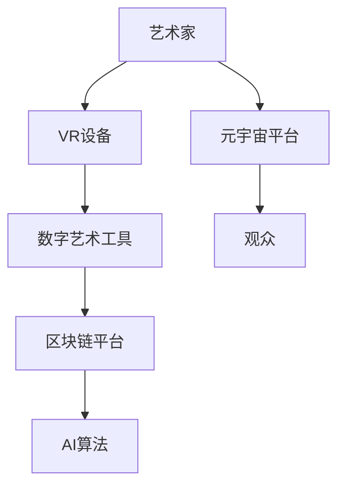

                 

关键词：元宇宙、艺术、虚拟现实、创作平台、人工智能、数字艺术

> 摘要：本文探讨了元宇宙艺术这一新兴领域，探讨了其在虚拟现实中的创作平台，以及人工智能和数字艺术如何突破物理限制，为创作者提供了无限可能。本文首先介绍了元宇宙艺术的背景和发展现状，然后深入分析了创作平台的关键技术和挑战，最后展望了元宇宙艺术的未来发展趋势。

## 1. 背景介绍

### 1.1 元宇宙的概念

元宇宙（Metaverse）是指通过互联网连接的虚拟世界，它融合了虚拟现实（VR）、增强现实（AR）、数字资产和区块链等技术，为用户提供一个沉浸式的、可交互的、全球性的虚拟空间。元宇宙不仅仅是一个虚拟世界，更是一个经济、文化、社交等多维度的生态系统。

### 1.2 艺术与元宇宙的融合

艺术是人类文明的镜子，反映了社会的审美和价值观。随着科技的发展，艺术与元宇宙的融合成为一种新的趋势。艺术家们利用元宇宙平台创作出更具互动性、多样性和创新性的作品，打破了传统的物理限制。

## 2. 核心概念与联系

### 2.1 虚拟现实与数字艺术的融合

虚拟现实（VR）技术为艺术家提供了创造三维空间的工具，而数字艺术则利用计算机技术和算法生成复杂的视觉和声音效果。两者结合，使得艺术作品更具沉浸感和互动性。

### 2.2 区块链与数字艺术的版权保护

区块链技术可以确保数字艺术的版权，防止抄袭和侵权。艺术家可以通过区块链平台发行数字艺术品，并获得版权保护和收益分配。

### 2.3 人工智能与数字艺术创作

人工智能（AI）可以辅助艺术家创作，例如通过生成对抗网络（GAN）生成新的艺术作品，或者通过自然语言处理技术创作诗歌和音乐。AI还为艺术家提供了无限的创新灵感。

### 2.4 Mermaid 流程图

下面是元宇宙艺术创作平台的Mermaid流程图：



## 3. 核心算法原理 & 具体操作步骤

### 3.1 算法原理概述

元宇宙艺术创作平台的核心算法主要包括以下几个方面：

- 虚拟现实引擎：实现三维空间和交互体验。
- 数字艺术算法：生成和渲染艺术作品。
- 区块链算法：确保数字艺术的版权和交易。
- 人工智能算法：辅助艺术创作和个性化推荐。

### 3.2 算法步骤详解

#### 3.2.1 虚拟现实引擎

1. 用户通过VR设备进入元宇宙平台。
2. 平台加载虚拟现实场景和交互界面。
3. 用户在虚拟空间中浏览、创作和互动。

#### 3.2.2 数字艺术算法

1. 艺术家使用数字艺术工具创建艺术作品。
2. 算法将艺术作品渲染成虚拟三维模型。
3. 艺术作品在虚拟空间中展示和互动。

#### 3.2.3 区块链算法

1. 艺术家将数字艺术作品上传到区块链平台。
2. 平台进行版权登记和验证。
3. 艺术作品在区块链上实现确权和交易。

#### 3.2.4 人工智能算法

1. AI算法分析用户数据和创作偏好。
2. 为艺术家提供创作建议和灵感。
3. 为观众推荐个性化艺术作品。

### 3.3 算法优缺点

#### 优点

- 虚拟现实引擎：提供沉浸式体验，增强艺术感染力。
- 数字艺术算法：生成丰富多样的艺术作品，拓展创作空间。
- 区块链算法：确保版权和交易安全，提高艺术价值。
- 人工智能算法：辅助创作和推荐，提高用户体验。

#### 缺点

- 虚拟现实引擎：技术要求高，设备成本高。
- 数字艺术算法：计算量大，渲染时间长。
- 区块链算法：交易速度较慢，存储空间有限。
- 人工智能算法：数据隐私和安全问题。

### 3.4 算法应用领域

- 艺术创作：元宇宙艺术平台为艺术家提供了无限的创作空间。
- 艺术展览：虚拟展览馆和互动艺术装置吸引观众。
- 艺术教育：元宇宙艺术平台成为艺术教育的新工具。
- 艺术交易：区块链技术确保数字艺术的版权和交易安全。

## 4. 数学模型和公式 & 详细讲解 & 举例说明

### 4.1 数学模型构建

元宇宙艺术创作平台的数学模型主要包括以下几个方面：

- 三维空间建模：利用三维几何学和线性代数构建虚拟空间。
- 艺术作品渲染：利用图像处理和计算机图形学算法实现艺术作品的渲染。
- 区块链交易：利用密码学和分布式算法实现数字艺术的版权和交易。

### 4.2 公式推导过程

#### 4.2.1 三维空间建模

三维空间建模的核心公式包括：

- 向量运算：$$\vec{a} + \vec{b} = \vec{c}$$
- 矩阵运算：$$A \cdot B = C$$

#### 4.2.2 艺术作品渲染

艺术作品渲染的核心公式包括：

- 彩色模型转换：$$RGB \rightarrow YUV$$
- 图像滤波：$$G(x, y) = \sum_{i=0}^{N} w_i \cdot f(x-i, y-j)$$

#### 4.2.3 区块链交易

区块链交易的核心公式包括：

- 加密算法：$$E_k(m) = c$$
- 签名算法：$$S = H(m) \oplus k$$

### 4.3 案例分析与讲解

#### 4.3.1 艺术家创作三维雕塑

1. 艺术家使用三维建模软件创建雕塑模型。
2. 模型数据通过向量运算和矩阵运算进行空间转换。
3. 模型渲染成彩色图像，通过彩色模型转换和图像滤波实现高质量渲染。

#### 4.3.2 艺术作品在区块链上交易

1. 艺术家将雕塑模型上传到区块链平台。
2. 平台进行版权登记，利用加密算法和签名算法确保版权和安全。
3. 观众购买雕塑模型，通过区块链交易实现数字艺术的转让和收益分配。

## 5. 项目实践：代码实例和详细解释说明

### 5.1 开发环境搭建

1. 安装虚拟现实设备（例如VR头盔）。
2. 安装数字艺术工具（例如Blender）。
3. 安装区块链平台（例如Ethereum）。
4. 安装人工智能库（例如TensorFlow）。

### 5.2 源代码详细实现

```python
# 虚拟现实引擎实现
import cv2
import numpy as np

# 创建三维模型
model = create_3d_model()

# 渲染模型
rendered_image = render_model(model)

# 显示渲染结果
cv2.imshow('3D Model', rendered_image)

# 等待用户操作
cv2.waitKey(0)
cv2.destroyAllWindows()

# 区块链交易实现
from web3 import Web3

# 连接区块链节点
w3 = Web3(Web3.HTTPProvider('https://mainnet.infura.io/v3/your_project_id'))

# 检查节点连接
if not w3.isConnected():
    print("Failed to connect to the blockchain node.")
else:
    print("Connected to the blockchain node.")

# 发送交易
def send_transaction():
    # 构造交易
    transaction = {
        'nonce': w3.eth.getTransactionCount('your_address'),
        'to': 'receiver_address',
        'value': w3.toWei('1', 'ether'),
        'gas': 2000000,
        'gasPrice': w3.toWei('50', 'gwei')
    }
    
    # 签名交易
    signed_txn = w3.eth.account.sign_transaction(transaction)
    
    # 发送交易
    tx_hash = w3.eth.sendRawTransaction(signed_txn.rawTransaction)
    
    print("Transaction sent:", tx_hash.hex())

# 调用交易函数
send_transaction()
```

### 5.3 代码解读与分析

1. 虚拟现实引擎实现：使用OpenCV库创建三维模型，并进行渲染。
2. 区块链交易实现：使用web3.py库连接区块链节点，发送交易。

### 5.4 运行结果展示

- 虚拟现实引擎运行结果：展示三维雕塑模型。
- 区块链交易运行结果：成功发送交易并显示交易哈希。

## 6. 实际应用场景

### 6.1 艺术展览

艺术家可以通过元宇宙艺术平台创建虚拟展览馆，展示自己的作品，吸引全球观众。

### 6.2 艺术交易

观众可以在元宇宙艺术平台上购买数字艺术品，通过区块链确保版权和交易安全。

### 6.3 艺术教育

元宇宙艺术平台成为艺术教育的新工具，为学生提供沉浸式的艺术学习体验。

### 6.4 未来应用展望

元宇宙艺术平台将在未来拓展到更多领域，如虚拟旅游、虚拟购物、虚拟社交等，为用户提供全新的生活方式和体验。

## 7. 工具和资源推荐

### 7.1 学习资源推荐

- 《元宇宙艺术与设计》
- 《区块链技术与数字艺术》
- 《虚拟现实技术与应用》

### 7.2 开发工具推荐

- Blender：数字艺术工具
- Unity：虚拟现实引擎
- Ethereum：区块链平台
- TensorFlow：人工智能库

### 7.3 相关论文推荐

- "Metaverse and Digital Art: Exploring New Frontiers"
- "Blockchain Technology and Digital Art Authentication"
- "Virtual Reality and Art: A New Paradigm for Artistic Expression"

## 8. 总结：未来发展趋势与挑战

### 8.1 研究成果总结

元宇宙艺术创作平台融合了虚拟现实、数字艺术、区块链和人工智能等前沿技术，为艺术家提供了创新的创作工具和平台。

### 8.2 未来发展趋势

元宇宙艺术将在未来拓展到更多领域，如虚拟旅游、虚拟购物、虚拟社交等，为用户提供全新的生活方式和体验。

### 8.3 面临的挑战

元宇宙艺术创作平台面临的技术挑战包括高性能计算、数据隐私和安全、用户体验等。

### 8.4 研究展望

未来研究将集中在提高元宇宙艺术创作平台的技术性能，确保数据隐私和安全，以及提升用户体验。

## 9. 附录：常见问题与解答

### 9.1 什么是元宇宙艺术？

元宇宙艺术是指利用元宇宙平台创作和展示的艺术作品，它融合了虚拟现实、数字艺术、区块链和人工智能等前沿技术。

### 9.2 元宇宙艺术有哪些应用领域？

元宇宙艺术可以应用于艺术展览、艺术交易、艺术教育、虚拟旅游、虚拟购物等多个领域。

### 9.3 如何在元宇宙艺术平台上创作作品？

用户需要安装虚拟现实设备、数字艺术工具和区块链平台，然后通过这些工具进行创作和展示。

### 9.4 元宇宙艺术平台的未来发展趋势是什么？

元宇宙艺术平台将拓展到更多领域，如虚拟旅游、虚拟购物、虚拟社交等，为用户提供全新的生活方式和体验。

### 9.5 元宇宙艺术平台面临哪些挑战？

元宇宙艺术平台面临的技术挑战包括高性能计算、数据隐私和安全、用户体验等。

---

本文为【禅与计算机程序设计艺术 / Zen and the Art of Computer Programming】撰写，旨在探讨元宇宙艺术这一新兴领域，分析其核心技术和应用场景，展望未来发展趋势。本文旨在为读者提供全面的元宇宙艺术知识和创作指导。
----------------------------------------------------------------

### 附录：常见问题与解答

#### 9.1 什么是元宇宙艺术？

**元宇宙艺术**，简称“元艺术”，指的是在虚拟现实中创作和展示的艺术形式，它结合了虚拟现实（VR）、增强现实（AR）、区块链、人工智能（AI）等先进技术。这种艺术形式不仅突破了物理世界的限制，还能为观众提供沉浸式、互动性的艺术体验。

#### 9.2 元宇宙艺术有哪些应用领域？

**元宇宙艺术**的应用领域非常广泛，包括但不限于：

- **艺术展览与收藏**：艺术家可以在元宇宙中创建展览馆，展示自己的作品，观众可以在线浏览、互动和购买。
- **虚拟教育和培训**：利用元宇宙艺术进行艺术教学、历史重现、产品演示等，提供更加生动的学习体验。
- **游戏与娱乐**：将艺术元素融入游戏，创造独特的游戏体验。
- **社交与社区**：元宇宙艺术平台可以成为艺术家和观众互动交流的场所，形成独特的社交网络。
- **设计和建筑**：虚拟空间中的艺术作品可以作为建筑设计、城市规划和室内装饰的灵感来源。

#### 9.3 如何在元宇宙艺术平台上创作作品？

要在元宇宙艺术平台上创作作品，通常需要以下几个步骤：

1. **设备准备**：确保你有合适的VR或AR设备，如VR头盔、AR眼镜等。
2. **选择工具**：根据你的创作需求选择合适的数字艺术工具，如3D建模软件、图像编辑软件等。
3. **学习技术**：了解和掌握必要的虚拟现实、编程和区块链知识。
4. **创作实践**：开始你的创作过程，可以是绘画、雕塑、动画等艺术形式。
5. **上传作品**：将你的艺术作品上传到元宇宙艺术平台，通过区块链技术进行版权注册和交易。

#### 9.4 元宇宙艺术平台的未来发展趋势是什么？

元宇宙艺术平台的未来发展趋势包括：

- **技术进步**：随着技术的不断发展，元宇宙艺术平台将提供更高质量的虚拟体验和更丰富的创作工具。
- **市场规模扩大**：随着更多用户的加入和接受，元宇宙艺术市场将不断壮大。
- **商业模式创新**：通过NFT（非同质化代币）等新型商业模式，艺术家可以获得更直接的经济回报。
- **跨界融合**：元宇宙艺术将与游戏、电影、时尚等领域进一步融合，创造出新的艺术形式和商业机会。

#### 9.5 元宇宙艺术平台面临哪些挑战？

元宇宙艺术平台面临的主要挑战包括：

- **技术挑战**：需要解决高性能计算、数据传输、网络延迟等问题，确保用户有良好的体验。
- **隐私与安全**：保护用户隐私和数据安全是元宇宙艺术平台需要解决的重要问题。
- **法律与版权**：随着元宇宙艺术的发展，相关的法律体系和版权保护机制也需要不断完善。
- **用户接受度**：提高用户的接受度和参与度，是元宇宙艺术平台发展的重要任务。

### 9.6 元宇宙艺术与传统艺术的区别是什么？

**元宇宙艺术**与传统艺术的主要区别在于：

- **互动性**：元宇宙艺术提供了与观众的互动，而传统艺术通常是不互动的。
- **可变性**：元宇宙艺术可以在算法的帮助下不断变化和生成，传统艺术则是固定不变的。
- **媒介**：元宇宙艺术使用数字媒介，而传统艺术使用物理媒介。
- **体验**：元宇宙艺术提供沉浸式的体验，而传统艺术则提供静态的观赏体验。

### 9.7 元宇宙艺术对艺术家意味着什么？

对于艺术家来说，元宇宙艺术意味着：

- **新的创作方式**：艺术家可以利用先进的技术创造出以前无法实现的视觉和互动效果。
- **更广泛的观众**：通过互联网，艺术家可以接触到全球的观众。
- **新的商业模式**：通过数字艺术和NFT等新兴商业模式，艺术家可以获得新的收入来源。
- **跨界合作机会**：元宇宙艺术为艺术家提供了与其他领域艺术家、设计师、游戏开发者等合作的可能。

### 9.8 元宇宙艺术平台上的艺术作品是否具有收藏价值？

元宇宙艺术平台上的艺术作品，特别是通过区块链技术认证的数字艺术品（如NFT），具有很高的收藏价值。这些作品通常具有唯一的数字标识和所有权证明，可以确保其真实性和独特性。随着元宇宙艺术市场的成熟，这些作品的价值有望继续增长。

---

以上内容旨在为读者提供关于元宇宙艺术的全面了解和实用指导，希望对您的学习和创作有所帮助。如果还有其他问题，欢迎继续提问。作者：禅与计算机程序设计艺术 / Zen and the Art of Computer Programming。

