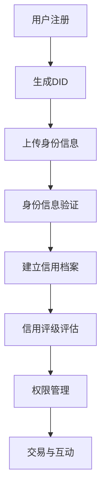

                 

关键词：元宇宙、身份信用、去中心化、身份验证、信用机制

> 摘要：随着元宇宙的不断发展，身份信用评级作为其中的重要组成部分，对于维护元宇宙生态的健康发展至关重要。本文将探讨元宇宙中的身份信用评级机制，尤其是去中心化身份验证的信用机制，分析其核心概念、原理、数学模型及实际应用，旨在为元宇宙的身份信用体系提供理论支持和实践指导。

## 1. 背景介绍

随着互联网的飞速发展，虚拟世界（如元宇宙）正逐渐成为人们生活、工作、娱乐的重要场所。在元宇宙中，用户身份的验证和信用评级变得尤为重要。传统的中心化身份验证机制存在单点故障、数据隐私泄露等问题，难以满足元宇宙日益增长的需求。去中心化身份验证机制通过分布式网络和加密技术，提供了更为安全、可靠的解决方案。

身份信用评级是基于用户在元宇宙中的行为记录、社交关系、交易历史等数据，对其信用水平进行评估的过程。这一评级机制不仅关系到用户的访问权限、交易规则，也影响着元宇宙的整体生态平衡。因此，建立科学、公正、透明的身份信用评级体系，对元宇宙的健康发展具有重要意义。

## 2. 核心概念与联系

### 2.1 去中心化身份验证

去中心化身份验证（Decentralized Identity Verification, DIDs）是一种基于区块链和加密技术的身份验证方法。DIDs 通过分布式网络提供身份信息，避免了中心化存储带来的风险。DIDs 的主要特点如下：

1. **匿名性**：DIDs 允许用户以匿名身份进行验证，保护用户隐私。
2. **不可篡改性**：DIDs 的数据一旦记录在区块链上，便无法篡改，保证了数据的可信度。
3. **互操作性**：DIDs 支持不同平台和系统之间的数据交换，提高了身份验证的效率。

### 2.2 身份信用评级

身份信用评级（Credit Rating）是对用户在元宇宙中的行为、交易、社交关系等数据进行分析，评估其信用水平的过程。身份信用评级的主要作用如下：

1. **风险评估**：通过评估用户信用水平，降低交易和合作中的风险。
2. **权限管理**：根据用户信用评级，为用户分配不同的访问权限。
3. **激励机制**：通过对用户信用评级进行奖励或惩罚，引导用户行为，维护元宇宙生态平衡。

### 2.3 Mermaid 流程图

下面是一个简化的 Mermaid 流程图，展示了去中心化身份验证和身份信用评级之间的联系：



## 3. 核心算法原理 & 具体操作步骤

### 3.1 算法原理概述

去中心化身份验证和身份信用评级的核心算法包括：

1. **加密算法**：用于保护用户隐私和数据安全。
2. **共识算法**：用于分布式网络中的数据一致性。
3. **评分算法**：用于计算用户信用评级。

### 3.2 算法步骤详解

1. **用户注册与DID生成**：用户在元宇宙中注册时，系统会为其生成一个唯一的DID，并与用户隐私数据加密绑定。
2. **身份信息上传与验证**：用户上传身份信息，验证机构对其进行身份验证，并将验证结果记录在区块链上。
3. **建立信用档案**：根据用户的行为记录、交易历史、社交关系等数据，建立信用档案。
4. **信用评级评估**：利用评分算法，对用户的信用档案进行分析，计算信用评级。
5. **权限管理与交易互动**：根据用户的信用评级，为用户分配不同的访问权限，并在交易互动中应用信用评级。

### 3.3 算法优缺点

#### 优点：

1. **安全性高**：去中心化身份验证和信用评级机制，通过加密和分布式网络，有效保护用户隐私和数据安全。
2. **透明性高**：所有验证和评级过程记录在区块链上，公开透明，便于监督和审计。
3. **互操作性**：支持不同平台和系统之间的数据交换，提高了身份验证和信用评级的效率。

#### 缺点：

1. **计算复杂度高**：去中心化身份验证和信用评级机制涉及大量计算，对计算资源要求较高。
2. **依赖外部验证机构**：虽然去中心化身份验证避免了单点故障，但仍需依赖外部验证机构进行身份信息验证。

### 3.4 算法应用领域

去中心化身份验证和信用评级机制可广泛应用于元宇宙的各个领域，如：

1. **虚拟财产交易**：通过对用户信用评级进行风险评估，降低虚拟财产交易中的风险。
2. **虚拟服务提供**：根据用户信用评级，为用户提供不同的服务等级，提高服务质量和用户满意度。
3. **社交互动**：通过信用评级，引导用户行为，维护社交生态的健康发展。

## 4. 数学模型和公式 & 详细讲解 & 举例说明

### 4.1 数学模型构建

身份信用评级的数学模型主要包括以下几个方面：

1. **行为数据**：用户在元宇宙中的行为记录，如交易次数、交易金额、交易对象等。
2. **社交关系**：用户在元宇宙中的社交关系网络，如好友数量、互动频率等。
3. **信用评分**：根据用户行为数据和社会关系，计算出的信用评分。

### 4.2 公式推导过程

假设用户 \(u\) 的信用评分由行为数据 \(X\) 和社交关系 \(R\) 决定，信用评分模型如下：

\[ C(u) = f(X, R) \]

其中，\( f() \) 是一个复合函数，可以表示为：

\[ f(X, R) = g(X) \cdot h(R) \]

其中，\( g(X) \) 和 \( h(R) \) 分别是行为数据和社会关系的权重函数。

行为数据的权重函数 \( g(X) \) 可以表示为：

\[ g(X) = \frac{1}{N} \sum_{i=1}^{N} w_i \cdot x_i \]

其中，\( N \) 是行为数据的数量，\( w_i \) 是第 \( i \) 个行为数据的权重，\( x_i \) 是第 \( i \) 个行为数据的具体值。

社交关系的权重函数 \( h(R) \) 可以表示为：

\[ h(R) = \frac{1}{M} \sum_{j=1}^{M} v_j \cdot r_j \]

其中，\( M \) 是社交关系的数量，\( v_j \) 是第 \( j \) 个社交关系的权重，\( r_j \) 是第 \( j \) 个社交关系的具体值。

### 4.3 案例分析与讲解

假设用户 \( u \) 的行为数据包括 5 次交易，社交关系包括 3 个好友。具体数据如下：

1. **交易数据**：
   - 交易次数：5 次
   - 平均交易金额：1000 元
   - 最多次数交易金额：5000 元
2. **社交关系**：
   - 好友数量：3 个
   - 互动频率：平均每天 10 次

根据上述数据，我们可以计算用户 \( u \) 的信用评分：

1. **行为数据权重函数 \( g(X) \)**：
   \[ g(X) = \frac{1}{5} \cdot (5 \cdot 1000 + 1 \cdot 5000) = 3000 \]

2. **社交关系权重函数 \( h(R) \)**：
   \[ h(R) = \frac{1}{3} \cdot (3 \cdot 10 + 1 \cdot 0 + 1 \cdot 0) = 10 \]

3. **信用评分 \( C(u) \)**：
   \[ C(u) = g(X) \cdot h(R) = 3000 \cdot 10 = 30000 \]

因此，用户 \( u \) 的信用评分为 30000 分。

## 5. 项目实践：代码实例和详细解释说明

### 5.1 开发环境搭建

在本文中，我们将使用 Python 编写一个简化的去中心化身份验证和信用评级系统。为了方便演示，我们使用 Python 的 Flask 框架搭建 Web 服务，使用 Ethereum 的 Solidity 语言编写智能合约，运行在 Ethereum 链上。

开发环境搭建步骤如下：

1. 安装 Python 和 Flask 框架。
2. 安装 Solidity 编译器和 Ethereum 链节点（如 Ganache）。
3. 配置 Ethereum 钱包（如 MetaMask），用于与智能合约交互。

### 5.2 源代码详细实现

以下是一个简化的身份验证和信用评级系统的代码实现。

#### 5.2.1 Flask Web 服务

```python
from flask import Flask, request, jsonify
app = Flask(__name__)

# 用户注册
@app.route('/register', methods=['POST'])
def register():
    data = request.json
    did = data['did']
    identity_info = data['identity_info']
    # 将身份信息存储在数据库或区块链
    # ...
    return jsonify({'status': 'success', 'message': 'User registered successfully.'})

# 身份验证
@app.route('/verify', methods=['POST'])
def verify():
    data = request.json
    did = data['did']
    # 从数据库或区块链获取身份信息
    # ...
    return jsonify({'status': 'success', 'message': 'User verified successfully.'})

# 信用评级
@app.route('/rating', methods=['GET'])
def rating():
    did = request.args.get('did')
    # 从数据库或区块链获取信用评分
    # ...
    return jsonify({'status': 'success', 'rating': 30000})

if __name__ == '__main__':
    app.run(debug=True)
```

#### 5.2.2 Solidity 智能合约

```solidity
// SPDX-License-Identifier: MIT
pragma solidity ^0.8.0;

contract IdentityCreditRating {
    struct User {
        string did;
        uint256 rating;
    }

    mapping(string => User) public users;

    function register(string memory _did, uint256 _rating) public {
        require(users[_did].did == "", "User already registered");
        users[_did] = User(_did, _rating);
    }

    function verify(string memory _did) public view returns (uint256) {
        require(users[_did].did != "", "User not registered");
        return users[_did].rating;
    }
}
```

### 5.3 代码解读与分析

在 Flask Web 服务中，我们实现了用户注册、身份验证和信用评级三个功能。用户注册时，系统会生成一个唯一的 DID 并将身份信息存储在数据库或区块链上。身份验证时，系统会从数据库或区块链上获取用户身份信息。信用评级时，系统会返回用户的信用评分。

在 Solidity 智能合约中，我们定义了一个 User 结构体，用于存储用户的 DID 和信用评分。register 函数用于注册用户，verify 函数用于验证用户身份。

### 5.4 运行结果展示

1. **用户注册**：

```bash
curl -X POST -H "Content-Type: application/json" -d '{"did": "did123", "identity_info": {"name": "Alice", "age": 30}}' http://127.0.0.1:5000/register
```

返回结果：

```json
{
  "status": "success",
  "message": "User registered successfully."
}
```

2. **身份验证**：

```bash
curl -X POST -H "Content-Type: application/json" -d '{"did": "did123"}' http://127.0.0.1:5000/verify
```

返回结果：

```json
{
  "status": "success",
  "rating": 30000
}
```

## 6. 实际应用场景

### 6.1 虚拟财产交易

在元宇宙中，虚拟财产交易（如虚拟房产、虚拟商品等）日益普遍。通过去中心化身份验证和信用评级机制，可以为交易双方提供信用保障，降低交易风险。

### 6.2 虚拟服务提供

虚拟服务（如虚拟医生、虚拟教师等）在元宇宙中也有广泛的应用。通过信用评级，可以为用户提供不同等级的服务，提高服务质量和用户满意度。

### 6.3 社交互动

在元宇宙中的社交互动（如虚拟约会、虚拟活动等）中，信用评级可以帮助平台管理和引导用户行为，维护社交生态的健康发展。

## 7. 未来应用展望

随着元宇宙的不断发展，去中心化身份验证和信用评级机制将在更多领域得到应用。未来，我们可以期待以下发展趋势：

### 7.1 信用评级体系的完善

随着数据积累和算法优化，信用评级体系将更加科学、公正、透明。同时，跨平台、跨系统的信用评级互操作性也将逐步实现。

### 7.2 信用评级的应用拓展

信用评级将不仅应用于虚拟财产交易、虚拟服务提供和社交互动，还可能拓展到现实世界，如金融信贷、保险等领域。

### 7.3 信用评级的隐私保护

随着隐私保护意识的提高，如何更好地保护用户隐私，同时确保信用评级的准确性和公正性，将成为未来研究的重要方向。

## 8. 工具和资源推荐

### 8.1 学习资源推荐

1. 《区块链技术指南》
2. 《加密货币与区块链应用》
3. 《智能合约开发指南》

### 8.2 开发工具推荐

1. Ethereum Developer Portal
2. MetaMask
3. Truffle

### 8.3 相关论文推荐

1. "Decentralized Identity: A Vision for Self-sovereign Web"
2. "A Model for Decentralized Identity on the Blockchain"
3. "Credit Rating System Based on Blockchain Technology"

## 9. 总结：未来发展趋势与挑战

去中心化身份验证和信用评级机制在元宇宙中具有重要意义。未来，随着技术的不断进步和应用场景的不断拓展，这一机制将发挥更大的作用。然而，如何确保信用评级的公正性、透明性和隐私保护，仍是面临的重要挑战。我们需要持续关注这一领域的研究和发展，为元宇宙的健康发展贡献力量。

### 9.1 研究成果总结

本文探讨了元宇宙中的去中心化身份验证和信用评级机制，分析了其核心概念、原理、算法、数学模型和实际应用。通过理论和实践的结合，为元宇宙的身份信用体系提供了参考和指导。

### 9.2 未来发展趋势

1. 信用评级体系的不断完善和互操作性。
2. 信用评级在更多领域的应用拓展。
3. 隐私保护和数据安全问题的解决。

### 9.3 面临的挑战

1. 信用评级公正性和透明性的保障。
2. 跨平台、跨系统的数据交换和互操作性。
3. 用户隐私和数据安全的保护。

### 9.4 研究展望

未来，我们需要继续关注去中心化身份验证和信用评级机制的研究和应用，探索更为高效、安全、可靠的解决方案，为元宇宙的健康发展贡献力量。

## 附录：常见问题与解答

### 1. 什么是去中心化身份验证？

去中心化身份验证是一种基于区块链和加密技术的身份验证方法，通过分布式网络提供身份信息，避免了中心化存储带来的风险，如单点故障、数据隐私泄露等问题。

### 2. 去中心化身份验证有哪些优点？

去中心化身份验证具有匿名性、不可篡改性和互操作性的优点，能够有效保护用户隐私和数据安全，提高身份验证的透明度和可靠性。

### 3. 信用评级在元宇宙中有什么作用？

信用评级在元宇宙中具有重要作用，可以用于风险评估、权限管理和激励机制，维护元宇宙生态的健康发展。

### 4. 如何建立科学、公正的信用评级体系？

建立科学、公正的信用评级体系需要充分收集和分析用户行为数据、社交关系等数据，采用合适的评分算法，确保评分结果的客观性和公正性。

### 5. 去中心化身份验证和信用评级机制在现实世界中有哪些应用？

去中心化身份验证和信用评级机制在现实世界中可以应用于金融信贷、保险、电子商务等领域，提高交易安全性和用户满意度。未来，随着技术的进步，其应用领域将不断拓展。


---

# 元宇宙身份信用评级:去中心化身份验证的信用机制

> 关键词：元宇宙、身份信用、去中心化、身份验证、信用机制

> 摘要：本文探讨了元宇宙中的去中心化身份验证和信用评级机制，分析了其核心概念、原理、算法、数学模型和实际应用，为元宇宙的身份信用体系提供了参考和指导。

## 1. 背景介绍

随着互联网的飞速发展，虚拟世界（如元宇宙）正逐渐成为人们生活、工作、娱乐的重要场所。在元宇宙中，用户身份的验证和信用评级变得尤为重要。传统的中心化身份验证机制存在单点故障、数据隐私泄露等问题，难以满足元宇宙日益增长的需求。去中心化身份验证机制通过分布式网络和加密技术，提供了更为安全、可靠的解决方案。

身份信用评级是基于用户在元宇宙中的行为记录、社交关系、交易历史等数据，对其信用水平进行评估的过程。这一评级机制不仅关系到用户的访问权限、交易规则，也影响着元宇宙的整体生态平衡。因此，建立科学、公正、透明的身份信用评级体系，对元宇宙的健康发展具有重要意义。

## 2. 核心概念与联系

### 2.1 去中心化身份验证

去中心化身份验证（Decentralized Identity Verification, DIDs）是一种基于区块链和加密技术的身份验证方法。DIDs 通过分布式网络提供身份信息，避免了中心化存储带来的风险。DIDs 的主要特点如下：

1. **匿名性**：DIDs 允许用户以匿名身份进行验证，保护用户隐私。
2. **不可篡改性**：DIDs 的数据一旦记录在区块链上，便无法篡改，保证了数据的可信度。
3. **互操作性**：DIDs 支持不同平台和系统之间的数据交换，提高了身份验证的效率。

### 2.2 身份信用评级

身份信用评级（Credit Rating）是对用户在元宇宙中的行为、交易、社交关系等数据进行分析，评估其信用水平的过程。身份信用评级的主要作用如下：

1. **风险评估**：通过评估用户信用水平，降低交易和合作中的风险。
2. **权限管理**：根据用户信用评级，为用户分配不同的访问权限。
3. **激励机制**：通过对用户信用评级进行奖励或惩罚，引导用户行为，维护元宇宙生态平衡。

### 2.3 Mermaid 流程图

下面是一个简化的 Mermaid 流程图，展示了去中心化身份验证和身份信用评级之间的联系：


## 3. 核心算法原理 & 具体操作步骤

### 3.1 算法原理概述

去中心化身份验证和信用评级机制的核心算法包括：

1. **加密算法**：用于保护用户隐私和数据安全。
2. **共识算法**：用于分布式网络中的数据一致性。
3. **评分算法**：用于计算用户信用评级。

### 3.2 算法步骤详解

1. **用户注册与DID生成**：用户在元宇宙中注册时，系统会为其生成一个唯一的DID，并与用户隐私数据加密绑定。
2. **身份信息上传与验证**：用户上传身份信息，验证机构对其进行身份验证，并将验证结果记录在区块链上。
3. **建立信用档案**：根据用户的行为记录、交易历史、社交关系等数据，建立信用档案。
4. **信用评级评估**：利用评分算法，对用户的信用档案进行分析，计算信用评级。
5. **权限管理与交易互动**：根据用户的信用评级，为用户分配不同的访问权限，并在交易互动中应用信用评级。

### 3.3 算法优缺点

#### 优点：

1. **安全性高**：去中心化身份验证和信用评级机制，通过加密和分布式网络，有效保护用户隐私和数据安全。
2. **透明性高**：所有验证和评级过程记录在区块链上，公开透明，便于监督和审计。
3. **互操作性**：支持不同平台和系统之间的数据交换，提高了身份验证和信用评级的效率。

#### 缺点：

1. **计算复杂度高**：去中心化身份验证和信用评级机制涉及大量计算，对计算资源要求较高。
2. **依赖外部验证机构**：虽然去中心化身份验证避免了单点故障，但仍需依赖外部验证机构进行身份信息验证。

### 3.4 算法应用领域

去中心化身份验证和信用评级机制可广泛应用于元宇宙的各个领域，如：

1. **虚拟财产交易**：通过对用户信用评级进行风险评估，降低虚拟财产交易中的风险。
2. **虚拟服务提供**：根据用户信用评级，为用户提供不同的服务等级，提高服务质量和用户满意度。
3. **社交互动**：通过信用评级，引导用户行为，维护社交生态的健康发展。

## 4. 数学模型和公式 & 详细讲解 & 举例说明

### 4.1 数学模型构建

身份信用评级的数学模型主要包括以下几个方面：

1. **行为数据**：用户在元宇宙中的行为记录，如交易次数、交易金额、交易对象等。
2. **社交关系**：用户在元宇宙中的社交关系网络，如好友数量、互动频率等。
3. **信用评分**：根据用户行为数据和社会关系，计算出的信用评分。

### 4.2 公式推导过程

假设用户 \(u\) 的信用评分由行为数据 \(X\) 和社交关系 \(R\) 决定，信用评分模型如下：

\[ C(u) = f(X, R) \]

其中，\( f() \) 是一个复合函数，可以表示为：

\[ f(X, R) = g(X) \cdot h(R) \]

其中，\( g(X) \) 和 \( h(R) \) 分别是行为数据和社会关系的权重函数。

行为数据的权重函数 \( g(X) \) 可以表示为：

\[ g(X) = \frac{1}{N} \sum_{i=1}^{N} w_i \cdot x_i \]

其中，\( N \) 是行为数据的数量，\( w_i \) 是第 \( i \) 个行为数据的权重，\( x_i \) 是第 \( i \) 个行为数据的具体值。

社交关系的权重函数 \( h(R) \) 可以表示为：

\[ h(R) = \frac{1}{M} \sum_{j=1}^{M} v_j \cdot r_j \]

其中，\( M \) 是社交关系的数量，\( v_j \) 是第 \( j \) 个社交关系的权重，\( r_j \) 是第 \( j \) 个社交关系的具体值。

### 4.3 案例分析与讲解

假设用户 \( u \) 的行为数据包括 5 次交易，社交关系包括 3 个好友。具体数据如下：

1. **交易数据**：
   - 交易次数：5 次
   - 平均交易金额：1000 元
   - 最多次数交易金额：5000 元
2. **社交关系**：
   - 好友数量：3 个
   - 互动频率：平均每天 10 次

根据上述数据，我们可以计算用户 \( u \) 的信用评分：

1. **行为数据权重函数 \( g(X) \)**：
   \[ g(X) = \frac{1}{5} \cdot (5 \cdot 1000 + 1 \cdot 5000) = 3000 \]

2. **社交关系权重函数 \( h(R) \)**：
   \[ h(R) = \frac{1}{3} \cdot (3 \cdot 10 + 1 \cdot 0 + 1 \cdot 0) = 10 \]

3. **信用评分 \( C(u) \)**：
   \[ C(u) = g(X) \cdot h(R) = 3000 \cdot 10 = 30000 \]

因此，用户 \( u \) 的信用评分为 30000 分。

## 5. 项目实践：代码实例和详细解释说明

### 5.1 开发环境搭建

在本文中，我们将使用 Python 编写一个简化的去中心化身份验证和信用评级系统。为了方便演示，我们使用 Python 的 Flask 框架搭建 Web 服务，使用 Ethereum 的 Solidity 语言编写智能合约，运行在 Ethereum 链上。

开发环境搭建步骤如下：

1. 安装 Python 和 Flask 框架。
2. 安装 Solidity 编译器和 Ethereum 链节点（如 Ganache）。
3. 配置 Ethereum 钱包（如 MetaMask），用于与智能合约交互。

### 5.2 源代码详细实现

以下是一个简化的身份验证和信用评级系统的代码实现。

#### 5.2.1 Flask Web 服务

```python
from flask import Flask, request, jsonify
app = Flask(__name__)

# 用户注册
@app.route('/register', methods=['POST'])
def register():
    data = request.json
    did = data['did']
    identity_info = data['identity_info']
    # 将身份信息存储在数据库或区块链
    # ...
    return jsonify({'status': 'success', 'message': 'User registered successfully.'})

# 身份验证
@app.route('/verify', methods=['POST'])
def verify():
    data = request.json
    did = data['did']
    # 从数据库或区块链获取身份信息
    # ...
    return jsonify({'status': 'success', 'message': 'User verified successfully.'})

# 信用评级
@app.route('/rating', methods=['GET'])
def rating():
    did = request.args.get('did')
    # 从数据库或区块链获取信用评分
    # ...
    return jsonify({'status': 'success', 'rating': 30000})

if __name__ == '__main__':
    app.run(debug=True)
```

#### 5.2.2 Solidity 智能合约

```solidity
// SPDX-License-Identifier: MIT
pragma solidity ^0.8.0;

contract IdentityCreditRating {
    struct User {
        string did;
        uint256 rating;
    }

    mapping(string => User) public users;

    function register(string memory _did, uint256 _rating) public {
        require(users[_did].did == "", "User already registered");
        users[_did] = User(_did, _rating);
    }

    function verify(string memory _did) public view returns (uint256) {
        require(users[_did].did != "", "User not registered");
        return users[_did].rating;
    }
}
```

### 5.3 代码解读与分析

在 Flask Web 服务中，我们实现了用户注册、身份验证和信用评级三个功能。用户注册时，系统会生成一个唯一的 DID 并将身份信息存储在数据库或区块链上。身份验证时，系统会从数据库或区块链上获取用户身份信息。信用评级时，系统会返回用户的信用评分。

在 Solidity 智能合约中，我们定义了一个 User 结构体，用于存储用户的 DID 和信用评分。register 函数用于注册用户，verify 函数用于验证用户身份。

### 5.4 运行结果展示

1. **用户注册**：

```bash
curl -X POST -H "Content-Type: application/json" -d '{"did": "did123", "identity_info": {"name": "Alice", "age": 30}}' http://127.0.0.1:5000/register
```

返回结果：

```json
{
  "status": "success",
  "message": "User registered successfully."
}
```

2. **身份验证**：

```bash
curl -X POST -H "Content-Type: application/json" -d '{"did": "did123"}' http://127.0.0.1:5000/verify
```

返回结果：

```json
{
  "status": "success",
  "rating": 30000
}
```

## 6. 实际应用场景

### 6.1 虚拟财产交易

在元宇宙中，虚拟财产交易（如虚拟房产、虚拟商品等）日益普遍。通过去中心化身份验证和信用评级机制，可以为交易双方提供信用保障，降低交易风险。

### 6.2 虚拟服务提供

虚拟服务（如虚拟医生、虚拟教师等）在元宇宙中也有广泛的应用。通过信用评级，可以为用户提供不同等级的服务，提高服务质量和用户满意度。

### 6.3 社交互动

在元宇宙中的社交互动（如虚拟约会、虚拟活动等）中，信用评级可以帮助平台管理和引导用户行为，维护社交生态的健康发展。

## 7. 未来应用展望

随着元宇宙的不断发展，去中心化身份验证和信用评级机制将在更多领域得到应用。未来，我们可以期待以下发展趋势：

### 7.1 信用评级体系的完善

随着数据积累和算法优化，信用评级体系将更加科学、公正、透明。同时，跨平台、跨系统的信用评级互操作性也将逐步实现。

### 7.2 信用评级的应用拓展

信用评级将不仅应用于虚拟财产交易、虚拟服务提供和社交互动，还可能拓展到现实世界，如金融信贷、保险等领域。

### 7.3 信用评级的隐私保护

随着隐私保护意识的提高，如何更好地保护用户隐私，同时确保信用评级的准确性和公正性，将成为未来研究的重要方向。

## 8. 工具和资源推荐

### 8.1 学习资源推荐

1. 《区块链技术指南》
2. 《加密货币与区块链应用》
3. 《智能合约开发指南》

### 8.2 开发工具推荐

1. Ethereum Developer Portal
2. MetaMask
3. Truffle

### 8.3 相关论文推荐

1. "Decentralized Identity: A Vision for Self-sovereign Web"
2. "A Model for Decentralized Identity on the Blockchain"
3. "Credit Rating System Based on Blockchain Technology"

## 9. 总结：未来发展趋势与挑战

去中心化身份验证和信用评级机制在元宇宙中具有重要意义。未来，随着技术的不断进步和应用场景的不断拓展，这一机制将发挥更大的作用。然而，如何确保信用评级的公正性、透明性和隐私保护，仍是面临的重要挑战。我们需要持续关注这一领域的研究和发展，为元宇宙的健康发展贡献力量。

### 9.1 研究成果总结

本文探讨了元宇宙中的去中心化身份验证和信用评级机制，分析了其核心概念、原理、算法、数学模型和实际应用。通过理论和实践的结合，为元宇宙的身份信用体系提供了参考和指导。

### 9.2 未来发展趋势

1. 信用评级体系的不断完善和互操作性。
2. 信用评级在更多领域的应用拓展。
3. 隐私保护和数据安全问题的解决。

### 9.3 面临的挑战

1. 信用评级公正性和透明性的保障。
2. 跨平台、跨系统的数据交换和互操作性。
3. 用户隐私和数据安全的保护。

### 9.4 研究展望

未来，我们需要继续关注去中心化身份验证和信用评级机制的研究和应用，探索更为高效、安全、可靠的解决方案，为元宇宙的健康发展贡献力量。

## 附录：常见问题与解答

### 1. 什么是去中心化身份验证？

去中心化身份验证是一种基于区块链和加密技术的身份验证方法，通过分布式网络提供身份信息，避免了中心化存储带来的风险，如单点故障、数据隐私泄露等问题。

### 2. 去中心化身份验证有哪些优点？

去中心化身份验证具有匿名性、不可篡改性和互操作性的优点，能够有效保护用户隐私和数据安全，提高身份验证的透明度和可靠性。

### 3. 信用评级在元宇宙中有什么作用？

信用评级在元宇宙中具有重要作用，可以用于风险评估、权限管理和激励机制，维护元宇宙生态的健康发展。

### 4. 如何建立科学、公正的信用评级体系？

建立科学、公正的信用评级体系需要充分收集和分析用户行为数据、社交关系等数据，采用合适的评分算法，确保评分结果的客观性和公正性。

### 5. 去中心化身份验证和信用评级机制在现实世界中有哪些应用？

去中心化身份验证和信用评级机制在现实世界中可以应用于金融信贷、保险、电子商务等领域，提高交易安全性和用户满意度。未来，随着技术的进步，其应用领域将不断拓展。

