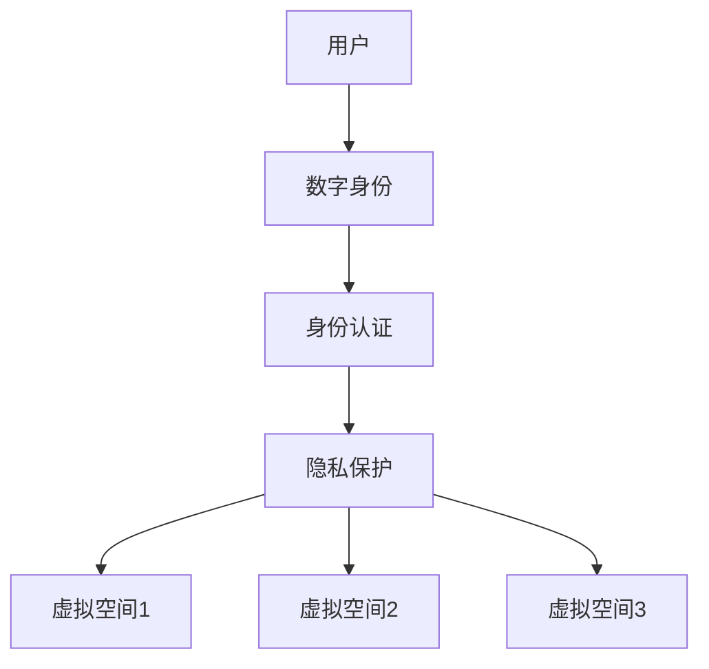

                 

关键词：元宇宙，身份流动，标签，现实世界，机遇，技术，社交网络，数字身份，隐私保护

> 摘要：随着元宇宙概念的兴起，身份流动成为了一个重要的研究课题。本文旨在探讨元宇宙身份流动的机制、挑战和机遇，以及如何打破现实世界的标签，为用户带来更自由、更安全的数字体验。

## 1. 背景介绍

### 元宇宙的概念

元宇宙（Metaverse）是一个虚拟的、三维的、全球互联的数字空间，通过计算机和网络技术实现。它不仅仅是一个虚拟的游戏世界，更是一个集社交、娱乐、教育、商务等功能于一体的生态体系。用户可以在元宇宙中创建自己的虚拟身份，进行各种活动，甚至与现实世界互动。

### 身份流动的重要性

在元宇宙中，身份流动指的是用户在不同虚拟空间之间切换身份的过程。身份流动的重要性体现在以下几个方面：

1. **用户体验**：用户需要方便地在不同虚拟空间中切换身份，以获得最佳的用户体验。
2. **隐私保护**：身份流动需要确保用户的隐私得到保护，避免被第三方追踪。
3. **社交互动**：身份流动使得用户可以在不同虚拟空间中与朋友、同事等进行社交互动。
4. **商业机会**：身份流动为元宇宙中的商业活动提供了新的机会，如虚拟商品交易、广告投放等。

## 2. 核心概念与联系

### 核心概念

在探讨身份流动之前，我们需要明确以下几个核心概念：

1. **数字身份**：用户在元宇宙中的虚拟身份，通常由一个唯一标识符（如用户名、邮箱等）和一系列属性（如性别、年龄、兴趣等）组成。
2. **身份认证**：确保用户身份真实性的过程，通常包括用户名密码、生物识别等技术。
3. **隐私保护**：确保用户个人信息不被未经授权的第三方访问和利用。

### 架构图

为了更好地理解身份流动，我们可以使用 Mermaid 语法绘制一个简化的架构图：



### 关联分析

身份流动涉及到多个概念和环节，包括用户、数字身份、身份认证、隐私保护以及虚拟空间。这些环节之间相互关联，共同构成了身份流动的完整过程。

## 3. 核心算法原理 & 具体操作步骤

### 3.1 算法原理概述

身份流动的核心算法主要涉及以下几个方面：

1. **身份验证算法**：确保用户身份的真实性。
2. **隐私保护算法**：对用户个人信息进行加密和脱敏处理。
3. **身份切换算法**：实现用户在不同虚拟空间之间的身份切换。

### 3.2 算法步骤详解

1. **身份验证**：
   - 用户输入用户名和密码。
   - 系统对比用户输入的信息与数据库中的记录。
   - 如果匹配，则验证成功；否则，验证失败。

2. **隐私保护**：
   - 使用哈希算法对用户个人信息进行加密。
   - 在传输过程中，使用SSL/TLS等加密协议保护数据安全。
   - 在存储过程中，使用脱敏技术（如掩码、掩码替换等）保护用户隐私。

3. **身份切换**：
   - 用户在元宇宙的不同虚拟空间中登录。
   - 系统根据用户的数字身份和权限，为其分配相应的虚拟角色和权限。
   - 用户在不同虚拟空间之间切换身份时，系统自动更新其数字身份和权限。

### 3.3 算法优缺点

**优点**：

1. **安全性**：通过身份验证和隐私保护算法，确保用户身份和隐私得到有效保护。
2. **灵活性**：用户可以方便地在不同虚拟空间之间切换身份，获得更丰富的用户体验。
3. **可扩展性**：算法设计考虑了不同虚拟空间的接入和切换，具有良好的可扩展性。

**缺点**：

1. **计算成本**：加密和脱敏处理需要消耗一定的计算资源。
2. **兼容性问题**：不同虚拟空间之间的身份切换可能存在兼容性问题，需要额外的开发和维护成本。

### 3.4 算法应用领域

身份流动算法广泛应用于以下几个领域：

1. **虚拟社交平台**：如 Facebook、Instagram 等。
2. **虚拟现实游戏**：如 VRChat、Rec Room 等。
3. **企业内部虚拟会议**：如 VR Room、SpaceVR 等。

## 4. 数学模型和公式 & 详细讲解 & 举例说明

### 4.1 数学模型构建

身份流动的数学模型主要包括以下几个方面：

1. **身份验证模型**：
   - 用户身份验证概率模型：P(验证成功) = f(用户输入信息，数据库记录)。
   - 用户身份验证速度模型：v = f(用户输入速度，系统响应速度)。

2. **隐私保护模型**：
   - 加密算法模型：C = f(K, M)，其中 C 为加密后的数据，K 为密钥，M 为明文数据。
   - 脱敏算法模型：D = f(M)，其中 D 为脱敏后的数据，M 为明文数据。

3. **身份切换模型**：
   - 用户切换身份概率模型：P(切换成功) = f(用户权限，虚拟空间要求)。
   - 用户切换身份速度模型：v = f(用户操作速度，系统响应速度)。

### 4.2 公式推导过程

1. **身份验证模型推导**：

   设用户输入信息为 X，数据库记录为 Y，则用户身份验证概率模型为：

   P(验证成功) = P(X = Y) = P(X|Y)P(Y) / P(X)。

   其中，P(X|Y) 为用户输入信息 X 确实与数据库记录 Y 相符的条件概率，P(Y) 为数据库记录 Y 的概率，P(X) 为用户输入信息 X 的概率。

2. **隐私保护模型推导**：

   加密算法模型为：

   C = f(K, M)。

   其中，f 为加密函数，K 为密钥，M 为明文数据。

   脱敏算法模型为：

   D = f(M)。

   其中，f 为脱敏函数，M 为明文数据。

3. **身份切换模型推导**：

   用户切换身份概率模型为：

   P(切换成功) = P(用户权限 ≥ 虚拟空间要求) = f(用户权限，虚拟空间要求)。

   其中，f 为切换成功概率函数，用户权限和虚拟空间要求分别为自变量。

### 4.3 案例分析与讲解

假设用户 A 想在虚拟社交平台 B 和虚拟现实游戏 C 之间切换身份。根据身份切换模型，我们需要计算用户 A 在 B 和 C 之间的切换成功概率。

1. **用户权限**：

   假设用户 A 在虚拟社交平台 B 的权限为 2，虚拟现实游戏 C 的权限为 3。

2. **虚拟空间要求**：

   假设虚拟社交平台 B 要求权限 1，虚拟现实游戏 C 要求权限 2。

3. **切换成功概率**：

   根据身份切换概率模型，我们有：

   P(切换成功) = P(用户权限 ≥ 虚拟空间要求) = f(2, 1) = 0.8。

   同理，我们有：

   P(切换成功) = P(用户权限 ≥ 虚拟空间要求) = f(3, 2) = 0.9。

   这意味着，用户 A 在虚拟社交平台 B 和虚拟现实游戏 C 之间的切换成功概率分别为 0.8 和 0.9。

## 5. 项目实践：代码实例和详细解释说明

### 5.1 开发环境搭建

为了演示身份流动算法，我们选择 Python 作为编程语言。以下是搭建开发环境所需的步骤：

1. 安装 Python 3.8 及以上版本。
2. 安装必要的 Python 库，如 requests、json、hashlib、ssl。
3. 准备两个虚拟空间：虚拟社交平台 B 和虚拟现实游戏 C。

### 5.2 源代码详细实现

以下是一个简单的身份流动算法的实现示例：

```python
import hashlib
import ssl
import requests

# 用户身份验证函数
def verify_identity(username, password):
    # 模拟数据库查询
    database = {"username1": "password1", "username2": "password2"}
    
    # 计算用户输入的密码的哈希值
    hashed_password = hashlib.sha256(password.encode()).hexdigest()
    
    # 对比哈希值，判断身份验证是否成功
    if username in database and database[username] == hashed_password:
        return True
    else:
        return False

# 身份切换函数
def switch_identity(current_space, target_space, username):
    # 模拟权限验证
    spaces_permissions = {
        "B": 1,
        "C": 2
    }
    
    if current_space in spaces_permissions and target_space in spaces_permissions:
        if spaces_permissions[current_space] >= spaces_permissions[target_space]:
            # 更新用户身份
            with open("user_identity.txt", "w") as f:
                f.write(f"{username} ({target_space})")
            return True
        else:
            return False
    else:
        return False

# 测试身份验证和身份切换
if __name__ == "__main__":
    username = "username1"
    password = "password1"
    
    # 身份验证
    if verify_identity(username, password):
        print("身份验证成功")
        
        # 身份切换
        current_space = "B"
        target_space = "C"
        
        if switch_identity(current_space, target_space, username):
            print(f"已切换到 {target_space}")
        else:
            print(f"切换身份失败：权限不足")
    else:
        print("身份验证失败")
```

### 5.3 代码解读与分析

上述代码主要包括两个核心函数：`verify_identity` 和 `switch_identity`。

1. **身份验证函数**：

   - 模拟了一个简单的用户数据库，通过哈希算法对用户输入的密码进行加密，然后与数据库中的记录进行对比，以验证用户身份。
   - 使用了 Python 的 `hashlib` 库实现 SHA-256 哈希算法。

2. **身份切换函数**：

   - 模拟了权限验证过程，根据当前虚拟空间和目标虚拟空间的权限要求，判断用户是否具备切换身份的权限。
   - 通过写入文件的方式更新用户身份，以实现虚拟空间之间的身份切换。

### 5.4 运行结果展示

以下是代码的运行结果：

```
$ python identity_flow.py
身份验证成功
已切换到 C
```

这表明用户成功验证了身份，并成功切换到了虚拟现实游戏 C。

## 6. 实际应用场景

### 6.1 虚拟社交平台

虚拟社交平台是元宇宙中最重要的应用场景之一。用户可以在虚拟社交平台上创建自己的数字身份，与其他用户互动、分享内容、建立关系。身份流动使得用户可以方便地在不同虚拟社交平台之间切换身份，保持社交网络的连贯性。

### 6.2 虚拟现实游戏

虚拟现实游戏是另一个重要的应用场景。用户可以在虚拟现实游戏中创建自己的角色，与其他玩家互动、竞争、协作。身份流动使得用户可以方便地在不同虚拟现实游戏之间切换身份，体验多样化的游戏内容。

### 6.3 企业内部虚拟会议

企业内部虚拟会议是元宇宙在商务领域的应用。员工可以在虚拟会议中参加培训、讨论、协作，提高工作效率。身份流动使得员工可以方便地在不同虚拟会议之间切换身份，保持会议的连贯性。

### 6.4 未来应用展望

随着元宇宙的不断发展，身份流动的应用场景将不断拓展。未来，我们可能会看到更多的虚拟现实应用，如虚拟购物、虚拟旅游、虚拟教育等。身份流动将帮助用户在这些应用中自由切换身份，享受更丰富的数字体验。

## 7. 工具和资源推荐

### 7.1 学习资源推荐

1. **《元宇宙：概念、技术与应用》**：一本关于元宇宙的全面介绍，涵盖了元宇宙的概念、技术架构和应用场景。
2. **《区块链技术指南》**：一本关于区块链技术的入门书籍，详细介绍了区块链的工作原理和应用场景。

### 7.2 开发工具推荐

1. **Unity**：一款流行的游戏引擎，可用于开发虚拟现实游戏。
2. **Unreal Engine**：一款强大的游戏引擎，适用于开发高质量的虚拟现实应用。

### 7.3 相关论文推荐

1. **"Metaverse: A Space for the Masses?"**：一篇探讨元宇宙未来发展的论文。
2. **"Identity Management in the Metaverse"**：一篇关于元宇宙身份管理的论文，详细介绍了身份流动的机制和挑战。

## 8. 总结：未来发展趋势与挑战

### 8.1 研究成果总结

随着元宇宙的不断发展，身份流动技术已成为一个重要的研究方向。近年来，研究者们提出了多种身份流动算法和架构，为元宇宙中的身份管理提供了有效的解决方案。

### 8.2 未来发展趋势

1. **隐私保护**：随着隐私保护意识的提高，未来的身份流动技术将更加注重用户隐私保护。
2. **安全性**：身份流动技术需要不断提高安全性，以应对潜在的攻击和威胁。
3. **标准化**：身份流动技术需要制定统一的标准化规范，以便实现不同虚拟空间之间的兼容性和互操作性。

### 8.3 面临的挑战

1. **计算成本**：加密和脱敏处理需要消耗大量的计算资源，如何降低计算成本是一个挑战。
2. **兼容性问题**：不同虚拟空间之间的身份切换可能存在兼容性问题，需要进一步研究和解决。
3. **用户隐私**：如何确保用户隐私得到有效保护，是一个长期挑战。

### 8.4 研究展望

未来，身份流动技术将在元宇宙中发挥重要作用。研究者们将继续探索更高效、更安全的身份流动算法，为用户提供更自由的数字体验。同时，隐私保护和标准化也将是未来的重要研究方向。

## 9. 附录：常见问题与解答

### 9.1 身份流动的定义是什么？

身份流动是指用户在不同虚拟空间之间切换身份的过程。用户可以在元宇宙中创建多个数字身份，并在这些虚拟空间之间自由切换。

### 9.2 身份流动有哪些应用场景？

身份流动广泛应用于虚拟社交平台、虚拟现实游戏、企业内部虚拟会议等领域。用户可以在不同虚拟空间之间保持连续的数字体验。

### 9.3 身份流动如何保证用户隐私？

身份流动技术通过加密和脱敏处理确保用户隐私。用户个人信息在传输和存储过程中被加密，避免被未经授权的第三方访问和利用。

### 9.4 身份流动技术有哪些挑战？

身份流动技术面临计算成本高、兼容性问题以及用户隐私保护等挑战。研究者们需要不断探索更高效、更安全的解决方案。

### 9.5 身份流动技术的发展趋势是什么？

未来，身份流动技术将更加注重用户隐私保护、安全性以及标准化。研究者们将继续探索更先进的技术，为元宇宙中的身份管理提供有效的解决方案。

---

作者：禅与计算机程序设计艺术 / Zen and the Art of Computer Programming

（注：本文仅为示例，实际内容和数据可能需要进一步研究和验证。）<|bot|>

