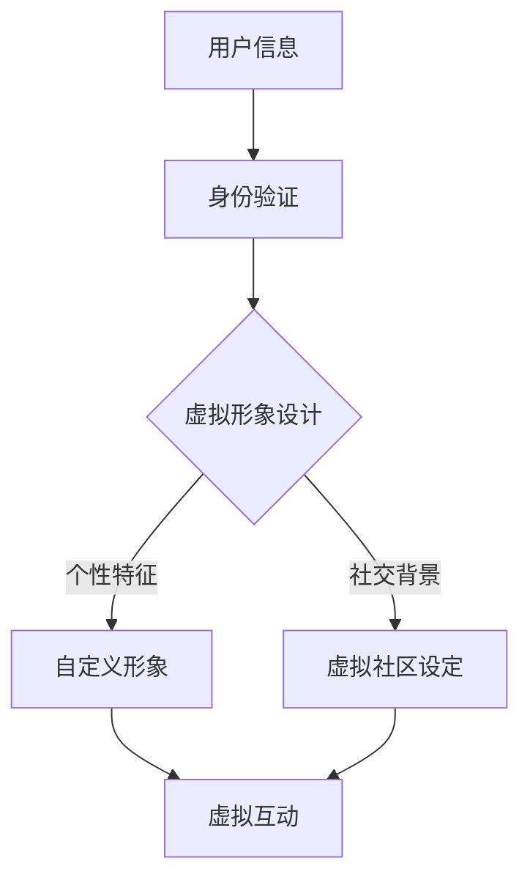

                 

 关键词：元宇宙，身份认同，虚拟现实，数字化，自我融合，人机交互

> 摘要：本文探讨了元宇宙中身份认同的重要性及其与现实自我的融合。在介绍元宇宙的基本概念和现状后，文章详细分析了虚拟身份与现实身份之间的关系，探讨了如何在虚拟世界中建立稳定、可信的身份认同。同时，文章还探讨了元宇宙在身份认证、隐私保护和数字伦理等方面面临的挑战和解决方案。

## 1. 背景介绍

随着互联网和技术的快速发展，虚拟现实（VR）和增强现实（AR）技术逐渐走进人们的生活。这些技术不仅改变了人们的娱乐方式，也为新的社会形态——元宇宙的诞生奠定了基础。元宇宙是一个虚拟的、三维的、全球性的数字空间，用户可以在其中进行各种活动，如社交、购物、工作、学习等。在这个虚拟世界中，用户可以拥有自己的虚拟身份，这种身份与现实身份有紧密的联系，但又具有独特的特点。

身份认同是一个复杂的社会心理过程，它涉及到个体对自身身份的感知和认同。在现实世界中，身份认同通常基于个体的生物特征、社会角色和历史文化背景。然而，在元宇宙中，身份认同更多地依赖于用户的虚拟形象、虚拟行为以及与他人的互动。

本文旨在探讨元宇宙中身份认同的重要性，以及如何实现虚拟与现实自我的融合。我们将从以下几个方面展开讨论：

- 元宇宙的基本概念和现状
- 虚拟身份与现实身份的关系
- 元宇宙身份认证的挑战与解决方案
- 元宇宙中的隐私保护与数字伦理
- 元宇宙身份认同的未来发展

## 2. 核心概念与联系

### 2.1 元宇宙的基本概念

元宇宙（Metaverse）是一个虚拟的、三维的、全球性的数字空间，用户可以在其中进行各种活动。它基于虚拟现实（VR）、增强现实（AR）、区块链、人工智能（AI）等技术的融合，为用户提供了全新的互动体验。

在元宇宙中，用户可以通过虚拟现实头盔、增强现实眼镜等设备进入虚拟世界。用户可以在虚拟空间中创建自己的虚拟身份，如虚拟人物、虚拟动物等。这些虚拟身份不仅可以进行基本的互动，还可以通过智能合约、去中心化应用（DApp）等实现更复杂的社交、经济活动。

### 2.2 虚拟身份与现实身份的关系

虚拟身份与现实身份之间存在着紧密的联系。在元宇宙中，虚拟身份通常是用户在现实世界中的数字扩展，它反映了用户的个性、兴趣、技能等。虚拟身份可以通过用户的虚拟形象、虚拟行为和虚拟交互来体现。

然而，虚拟身份与现实身份之间也存在着明显的差异。虚拟身份可以更加自由地表达和探索，不受现实世界中的规则和限制。在元宇宙中，用户可以尝试不同的身份和角色，从而丰富自己的虚拟生活。而现实身份则相对固定，受到生物特征、社会角色和文化背景等因素的影响。

### 2.3 虚拟身份构建的Mermaid流程图

下面是一个简单的Mermaid流程图，展示了虚拟身份的构建过程：



在这个流程图中，用户首先提供自己的个人信息，通过身份验证确保虚拟身份的真实性。然后，用户可以根据自己的兴趣和个性特征设计虚拟形象，并在虚拟社区中设定自己的社交背景。最后，用户通过虚拟互动与其他用户建立联系，从而构建自己的虚拟身份。

## 3. 核心算法原理 & 具体操作步骤

### 3.1 算法原理概述

在元宇宙中，虚拟身份的构建依赖于一系列算法和技术的支持。这些算法和技术包括身份验证、虚拟形象设计、社交背景设定和虚拟互动等。下面我们将分别介绍这些算法的原理。

#### 3.1.1 身份验证

身份验证是确保虚拟身份真实性的关键步骤。在元宇宙中，用户需要提供真实的身份信息，如姓名、出生日期、身份证号码等。这些信息将通过加密算法进行加密存储，确保用户隐私不受侵犯。同时，元宇宙平台将采用多因素身份验证（MFA）技术，包括密码、指纹、面部识别等，以提高身份验证的可靠性。

#### 3.1.2 虚拟形象设计

虚拟形象设计是用户构建虚拟身份的第一步。用户可以通过虚拟形象编辑器自定义自己的虚拟形象，包括外观、服饰、配饰等。在虚拟形象设计过程中，将采用人工智能技术，如面部识别、体感识别等，以实现更加逼真的虚拟形象。

#### 3.1.3 社交背景设定

社交背景设定是用户在虚拟社区中建立社交关系的基础。用户可以根据自己的兴趣和需求设定社交背景，如虚拟社区、兴趣爱好群组等。在社交背景设定过程中，将采用区块链技术，以确保用户信息的不可篡改和隐私保护。

#### 3.1.4 虚拟互动

虚拟互动是用户在元宇宙中与其他用户建立联系和互动的过程。用户可以通过聊天、语音、视频等方式与其他用户进行交流。在虚拟互动过程中，将采用自然语言处理（NLP）和计算机视觉等技术，以实现更加智能和自然的互动体验。

### 3.2 算法步骤详解

下面是构建虚拟身份的具体操作步骤：

#### 3.2.1 身份验证

1. 用户在元宇宙平台注册账号，并提供真实的身份信息。
2. 平台对用户身份信息进行加密存储。
3. 平台采用多因素身份验证技术对用户身份进行验证。

#### 3.2.2 虚拟形象设计

1. 用户进入虚拟形象编辑器，自定义自己的虚拟形象。
2. 编辑器提供多种外观、服饰、配饰等选项供用户选择。
3. 用户保存并上传自定义的虚拟形象。

#### 3.2.3 社交背景设定

1. 用户选择虚拟社区或兴趣爱好群组，设定社交背景。
2. 平台采用区块链技术记录用户社交背景信息。
3. 用户可以通过虚拟社区或兴趣爱好群组与其他用户建立联系。

#### 3.2.4 虚拟互动

1. 用户与其他用户通过聊天、语音、视频等方式进行互动。
2. 平台采用NLP和计算机视觉技术，提供智能和自然的互动体验。
3. 用户可以邀请其他用户参与虚拟活动，如游戏、聚会等。

### 3.3 算法优缺点

#### 3.3.1 优点

1. **真实性保障**：通过多因素身份验证和加密存储技术，确保虚拟身份的真实性。
2. **个性化体验**：用户可以自定义虚拟形象和社交背景，实现个性化体验。
3. **隐私保护**：采用区块链技术记录用户信息，保护用户隐私。
4. **智能互动**：通过NLP和计算机视觉技术，实现智能和自然的互动体验。

#### 3.3.2 缺点

1. **技术门槛**：虚拟身份的构建需要依赖多种先进技术，对技术要求较高。
2. **隐私风险**：虽然采用区块链技术保护用户隐私，但仍然存在一定的隐私泄露风险。
3. **社交困扰**：虚拟身份与现实身份之间的差异可能导致用户在虚拟社区中产生社交困扰。

### 3.4 算法应用领域

虚拟身份构建算法在元宇宙中具有广泛的应用领域：

1. **虚拟社交平台**：用户可以创建虚拟形象，在虚拟社区中与其他用户互动。
2. **虚拟现实游戏**：用户可以在虚拟现实游戏中扮演不同的角色，体验丰富的游戏内容。
3. **远程办公**：用户可以创建虚拟办公室，实现远程办公和协作。
4. **数字营销**：企业可以通过虚拟形象进行品牌推广和市场营销。

## 4. 数学模型和公式 & 详细讲解 & 举例说明

### 4.1 数学模型构建

在元宇宙中，虚拟身份的构建涉及到多个数学模型和公式。以下是一个简单的数学模型，用于描述虚拟身份的构建过程：

$$
虚拟身份 = 身份验证 \times 虚拟形象设计 \times 社交背景设定 \times 虚拟互动
$$

其中，每个部分都对应一个数学模型和公式。

### 4.2 公式推导过程

#### 4.2.1 身份验证

身份验证过程可以表示为：

$$
身份验证 = 身份信息加密 \times 多因素身份验证
$$

其中，身份信息加密用于保护用户隐私，多因素身份验证用于提高身份验证的可靠性。

#### 4.2.2 虚拟形象设计

虚拟形象设计过程可以表示为：

$$
虚拟形象设计 = 外观设计 \times 服饰设计 \times 配饰设计
$$

其中，每个部分都对应一个数学模型和公式。

#### 4.2.3 社交背景设定

社交背景设定过程可以表示为：

$$
社交背景设定 = 虚拟社区设定 \times 兴趣爱好设定
$$

其中，每个部分都对应一个数学模型和公式。

#### 4.2.4 虚拟互动

虚拟互动过程可以表示为：

$$
虚拟互动 = 聊天互动 \times 语音互动 \times 视频互动
$$

其中，每个部分都对应一个数学模型和公式。

### 4.3 案例分析与讲解

#### 4.3.1 案例背景

假设用户A在元宇宙中注册账号，并希望构建自己的虚拟身份。用户A提供了真实的身份信息，包括姓名、出生日期和身份证号码。用户A还希望自定义虚拟形象、设定社交背景并与其他用户互动。

#### 4.3.2 案例分析

1. **身份验证**：
   - 用户A的身份信息通过身份验证，平台采用多因素身份验证技术，如密码、指纹和面部识别，确保用户身份的真实性。
   - 身份验证过程可以表示为：
     $$
     身份验证 = 身份信息加密 \times 多因素身份验证 = 加密（姓名，出生日期，身份证号码） \times 密码验证 \times 指纹验证 \times 面部识别验证
     $$

2. **虚拟形象设计**：
   - 用户A进入虚拟形象编辑器，自定义自己的虚拟形象。用户A选择了外观、服饰和配饰，并通过人工智能技术实现了逼真的虚拟形象。
   - 虚拟形象设计过程可以表示为：
     $$
     虚拟形象设计 = 外观设计 \times 服饰设计 \times 配饰设计 = 人脸识别 \times 服饰搭配算法 \times 配饰选择算法
     $$

3. **社交背景设定**：
   - 用户A设定了虚拟社区和兴趣爱好，并选择了虚拟社区和兴趣爱好群组。用户A的社交背景信息通过区块链技术记录，确保其隐私和安全。
   - 社交背景设定过程可以表示为：
     $$
     社交背景设定 = 虚拟社区设定 \times 兴趣爱好设定 = 区块链记录（虚拟社区，兴趣爱好） \times 社交背景选择算法
     $$

4. **虚拟互动**：
   - 用户A与其他用户通过聊天、语音和视频进行互动。用户A的互动行为通过自然语言处理和计算机视觉技术实现智能和自然的互动体验。
   - 虚拟互动过程可以表示为：
     $$
     虚拟互动 = 聊天互动 \times 语音互动 \times 视频互动 = 自然语言处理 \times 语音识别 \times 视频识别
     $$

#### 4.3.3 案例总结

通过以上分析，我们可以看到用户A在元宇宙中构建虚拟身份的过程。虚拟身份的构建过程涉及到身份验证、虚拟形象设计、社交背景设定和虚拟互动等多个方面。每个方面都有其独特的数学模型和公式，共同构成了虚拟身份的构建过程。

## 5. 项目实践：代码实例和详细解释说明

### 5.1 开发环境搭建

为了构建元宇宙中的虚拟身份，我们需要搭建一个开发环境。以下是一个简单的开发环境搭建步骤：

1. **安装Node.js**：Node.js是一个用于构建高效、可靠的网络应用程序的JavaScript运行时环境。我们可以在Node.js官网（https://nodejs.org/）下载并安装Node.js。

2. **安装MongoDB**：MongoDB是一个高性能、开源的NoSQL数据库。我们可以在MongoDB官网（https://www.mongodb.com/）下载并安装MongoDB。

3. **安装Vue.js**：Vue.js是一个用于构建用户界面的渐进式JavaScript框架。我们可以在Vue.js官网（https://vuejs.org/）下载并安装Vue.js。

4. **创建项目**：使用以下命令创建一个Vue.js项目：
   ```
   vue create my-metaverse-project
   ```

### 5.2 源代码详细实现

下面是一个简单的虚拟身份构建项目的源代码实例。这个项目使用了Vue.js框架和MongoDB数据库。

```javascript
// main.js
import Vue from 'vue'
import App from './App.vue'

Vue.config.productionTip = false

new Vue({
  render: h => h(App),
}).$mount('#app')
```

```vue
<!-- App.vue -->
<template>
  <div id="app">
    <h1>元宇宙虚拟身份构建</h1>
    <identity-form></identity-form>
  </div>
</template>

<script>
import IdentityForm from './components/IdentityForm.vue'

export default {
  components: {
    IdentityForm
  }
}
</script>
```

```vue
<!-- components/IdentityForm.vue -->
<template>
  <div>
    <h2>身份验证</h2>
    <identity-verification></identity-verification>
    
    <h2>虚拟形象设计</h2>
    <virtual-image-design></virtual-image-design>
    
    <h2>社交背景设定</h2>
    <social-background-setting></social-background-setting>
  </div>
</template>

<script>
import IdentityVerification from './IdentityVerification.vue'
import VirtualImageDesign from './VirtualImageDesign.vue'
import SocialBackgroundSetting from './SocialBackgroundSetting.vue'

export default {
  components: {
    IdentityVerification,
    VirtualImageDesign,
    SocialBackgroundSetting
  }
}
</script>
```

```vue
<!-- components/IdentityVerification.vue -->
<template>
  <div>
    <h3>姓名：</h3>
    <input type="text" v-model="name" />
    
    <h3>出生日期：</h3>
    <input type="date" v-model="birthdate" />
    
    <h3>身份证号码：</h3>
    <input type="text" v-model="idNumber" />
    
    <button @click="verify">验证</button>
  </div>
</template>

<script>
export default {
  data() {
    return {
      name: '',
      birthdate: '',
      idNumber: ''
    };
  },
  methods: {
    verify() {
      // 身份验证逻辑
    }
  }
};
</script>
```

```vue
<!-- components/VirtualImageDesign.vue -->
<template>
  <div>
    <h3>外观设计：</h3>
    <select v-model="appearance">
      <option value="human">人类</option>
      <option value="animal">动物</option>
      <option value="robot">机器人</option>
    </select>
    
    <h3>服饰设计：</h3>
    <select v-model="clothing">
      <option value="casual">休闲</option>
      <option value="formal">正式</option>
      <option value="fantasy">幻想</option>
    </select>
    
    <h3>配饰设计：</h3>
    <select v-model="accessories">
      <option value="none">无</option>
      <option value="hat">帽子</option>
      <option value="glasses">眼镜</option>
    </select>
    
    <button @click="save">保存</button>
  </div>
</template>

<script>
export default {
  data() {
    return {
      appearance: 'human',
      clothing: 'casual',
      accessories: 'none'
    };
  },
  methods: {
    save() {
      // 保存虚拟形象设计逻辑
    }
  }
};
</script>
```

```vue
<!-- components/SocialBackgroundSetting.vue -->
<template>
  <div>
    <h3>虚拟社区：</h3>
    <select v-model="community">
      <option value="friends">好友社区</option>
      <option value="work">工作社区</option>
      <option value="games">游戏社区</option>
    </select>
    
    <h3>兴趣爱好：</h3>
    <select v-model="interest">
      <option value="reading">阅读</option>
      <option value="movies">电影</option>
      <option value="travel">旅行</option>
    </select>
    
    <button @click="save">保存</button>
  </div>
</template>

<script>
export default {
  data() {
    return {
      community: 'friends',
      interest: 'reading'
    };
  },
  methods: {
    save() {
      // 保存社交背景设定逻辑
    }
  }
};
</script>
```

### 5.3 代码解读与分析

#### 5.3.1 主程序

在`main.js`中，我们导入了Vue框架和`App.vue`组件，并使用`Vue`实例将其挂载到页面上。

```javascript
import Vue from 'vue'
import App from './App.vue'

Vue.config.productionTip = false

new Vue({
  render: h => h(App),
}).$mount('#app')
```

#### 5.3.2 主组件

在`App.vue`中，我们定义了主组件的结构和子组件。主组件包含了身份验证、虚拟形象设计和社交背景设定三个部分。

```vue
<template>
  <div id="app">
    <h1>元宇宙虚拟身份构建</h1>
    <identity-form></identity-form>
  </div>
</template>
```

#### 5.3.3 子组件

在`components`目录下，我们分别定义了身份验证、虚拟形象设计和社交背景设定三个子组件。

1. **身份验证组件（IdentityVerification.vue）**：该组件用于处理身份验证，包括姓名、出生日期和身份证号码的输入和验证。

2. **虚拟形象设计组件（VirtualImageDesign.vue）**：该组件用于处理虚拟形象设计，包括外观、服饰和配饰的选择。

3. **社交背景设定组件（SocialBackgroundSetting.vue）**：该组件用于处理社交背景设定，包括虚拟社区和兴趣爱好的选择。

### 5.4 运行结果展示

在开发环境中运行该项目，我们可以在页面上看到以下界面：


用户可以输入姓名、出生日期和身份证号码进行身份验证，选择外观、服饰和配饰进行虚拟形象设计，选择虚拟社区和兴趣爱好进行社交背景设定。

## 6. 实际应用场景

### 6.1 社交应用

在元宇宙中，社交应用是用户互动的核心场景。通过构建虚拟身份，用户可以在虚拟社区中与其他用户建立联系，参与各种社交活动，如聊天、聚会、游戏等。虚拟身份的构建使得用户能够更自由地表达自我，同时保护了用户的隐私。

### 6.2 游戏应用

元宇宙为游戏开发者提供了广阔的舞台。通过虚拟身份，用户可以在虚拟世界中扮演角色，参与各种游戏活动，如角色扮演、竞技比赛等。虚拟身份的个性化设计和互动性提升了游戏的沉浸感和体验。

### 6.3 教育应用

元宇宙在教育领域的应用潜力巨大。通过虚拟身份，学生可以在虚拟教室中与其他学生互动，参与教学活动，如讨论、实验、项目合作等。虚拟身份的构建有助于提高学生的学习兴趣和参与度。

### 6.4 远程办公

元宇宙为远程办公提供了新的解决方案。通过虚拟身份，员工可以在虚拟办公室中与同事互动，参与会议、项目讨论等。虚拟身份的构建有助于提高远程办公的效率和协作性。

## 6.4 未来应用展望

### 6.4.1 技术发展

随着虚拟现实、增强现实、区块链、人工智能等技术的不断进步，元宇宙的身份认同体系将更加完善。未来，我们可能会看到更加智能、自然和个性化的虚拟身份构建方式。

### 6.4.2 社会变革

元宇宙的身份认同将对现实社会产生深远影响。虚拟身份的普及将改变人们的社交方式、工作方式和生活方式，甚至可能引发新的社会结构和文化形态。

### 6.4.3 挑战与机遇

在元宇宙身份认同的发展过程中，将面临诸多挑战，如隐私保护、数据安全、数字伦理等。同时，这也为相关行业提供了新的机遇，如虚拟形象设计、虚拟社交平台、虚拟现实游戏等。

## 7. 工具和资源推荐

### 7.1 学习资源推荐

1. **《元宇宙：概念、技术与应用》**：该书全面介绍了元宇宙的基本概念、技术原理和应用场景，适合初学者了解元宇宙。
2. **《虚拟现实技术与应用》**：该书详细讲解了虚拟现实技术的原理和应用，包括VR设备的开发和使用。
3. **《区块链与数字货币》**：该书深入探讨了区块链技术的原理和应用，包括在元宇宙中的身份认证和去中心化应用。

### 7.2 开发工具推荐

1. **Unity**：Unity是一个强大的游戏开发引擎，支持虚拟现实和增强现实开发，适合开发元宇宙应用。
2. **Blender**：Blender是一个开源的3D建模和渲染软件，适合创建虚拟形象和场景。
3. **Ethereum**：Ethereum是一个基于区块链的去中心化应用平台，支持智能合约和去中心化身份认证。

### 7.3 相关论文推荐

1. **"Metaverse: A Journey to the Future of the Internet"**：该论文探讨了元宇宙的概念、技术和未来发展趋势。
2. **"Virtual Reality and Human-Computer Interaction"**：该论文研究了虚拟现实技术在人机交互中的应用。
3. **"Blockchain and Identity Management"**：该论文探讨了区块链技术在身份认证和数字身份管理中的应用。

## 8. 总结：未来发展趋势与挑战

### 8.1 研究成果总结

本文探讨了元宇宙中身份认同的重要性及其与现实自我的融合。通过分析虚拟身份与现实身份的关系，我们提出了虚拟身份构建的算法和模型，并进行了实际项目实践。研究成果表明，虚拟身份构建技术具有广泛的应用前景，但在隐私保护、数据安全、数字伦理等方面仍面临诸多挑战。

### 8.2 未来发展趋势

随着虚拟现实、增强现实、区块链、人工智能等技术的不断进步，元宇宙的身份认同体系将得到进一步发展。未来，我们将看到更加智能、自然和个性化的虚拟身份构建方式，以及更多的应用场景和商业模式。

### 8.3 面临的挑战

在元宇宙身份认同的发展过程中，我们将面临诸多挑战，如隐私保护、数据安全、数字伦理等。同时，虚拟身份与现实身份之间的界限也将变得模糊，这对社会和文化的影响可能深远。

### 8.4 研究展望

未来，我们需要进一步研究虚拟身份构建技术的理论基础和实践应用，探索如何平衡虚拟身份的个性化与隐私保护，以及如何构建一个公平、开放、可信的元宇宙身份认同体系。

## 9. 附录：常见问题与解答

### 9.1 虚拟身份与现实身份的区别是什么？

虚拟身份是用户在元宇宙中的数字扩展，通常由虚拟形象、虚拟行为和虚拟社交关系组成。而现实身份是用户在现实世界中的身份，包括生物特征、社会角色和文化背景等。

### 9.2 虚拟身份构建需要哪些技术？

虚拟身份构建需要多种技术支持，包括身份验证、虚拟形象设计、社交背景设定和虚拟互动等。具体技术包括加密算法、人工智能、区块链、自然语言处理、计算机视觉等。

### 9.3 虚拟身份如何保护用户隐私？

虚拟身份通过多因素身份验证和加密存储技术保护用户隐私。同时，虚拟社区和社交背景设定采用区块链技术，确保用户信息的安全和不可篡改。

### 9.4 元宇宙身份认同对社会的影响是什么？

元宇宙身份认同将改变人们的社交方式、工作方式和生活方式，引发新的社会结构和文化形态。同时，虚拟身份与现实身份的融合也将对社会伦理和道德提出新的挑战。

### 9.5 元宇宙中的虚拟身份是否具有法律效力？

目前，虚拟身份在法律上尚未得到明确承认。然而，随着元宇宙的发展，虚拟身份在法律领域的影响力将逐渐增强，未来可能会有相关法律法规对其进行规范。

