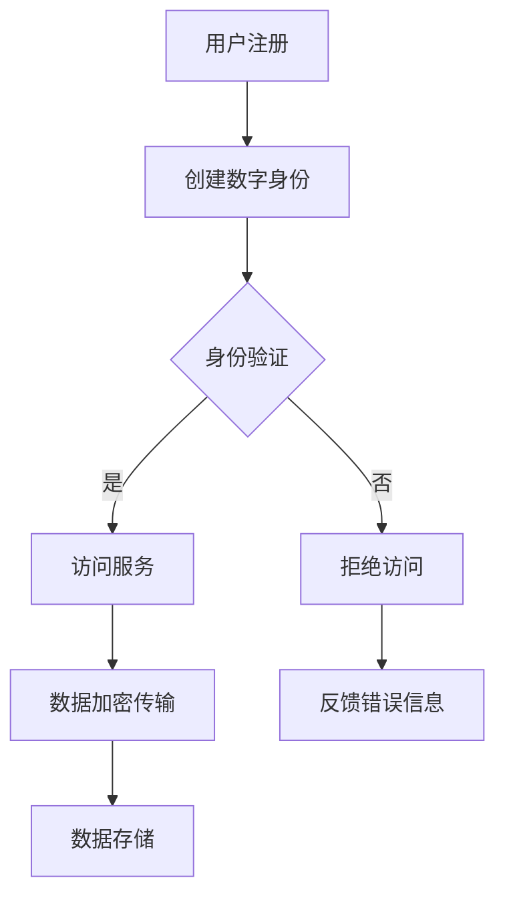

                 

关键词：元宇宙、身份认证、区块链技术、去中心化、身份管理、安全、隐私保护

> 摘要：本文探讨了区块链技术在元宇宙身份认证中的应用，通过深入分析区块链的去中心化特性、加密算法和智能合约技术，探讨了如何利用这些技术实现安全、可信且隐私保护的身份认证系统。本文首先介绍了元宇宙身份认证的背景和重要性，然后详细阐述了区块链技术在身份认证中的核心概念、算法原理、数学模型、项目实践以及实际应用场景，最后对未来的发展趋势和挑战进行了展望。

## 1. 背景介绍

随着虚拟现实（VR）、增强现实（AR）和区块链等技术的快速发展，元宇宙（Metaverse）的概念逐渐进入公众视野。元宇宙是一个由虚拟世界和现实世界融合而成的全方位数字化空间，用户可以在其中以数字身份进行互动、交易和创造。然而，身份认证是元宇宙中的关键问题，它关系到用户隐私、安全以及整个生态系统的稳定性。

传统身份认证系统通常依赖于中心化的服务器和第三方信任机构，存在数据泄露、隐私侵犯和信任危机等问题。随着区块链技术的发展，去中心化、透明和不可篡改的特性为解决这些问题提供了新的思路。区块链技术通过分布式账本和加密算法，可以在不依赖第三方信任机构的情况下实现安全、可信的身份认证。

## 2. 核心概念与联系

### 2.1 区块链技术

区块链是一种分布式数据库技术，通过加密算法和共识机制，确保数据的安全性和一致性。区块链的主要组成部分包括：

- **区块链网络**：由多个节点组成，每个节点都存储着完整的数据副本。
- **加密算法**：用于确保数据的安全性和隐私性，常见的有哈希算法、非对称加密算法等。
- **共识机制**：节点之间通过共识机制达成数据的一致性，常见的有工作量证明（PoW）、权益证明（PoS）等。

### 2.2 身份认证

身份认证是验证用户身份的过程，确保用户是合法且可信的。常见的身份认证方法包括密码、指纹、面部识别等。在元宇宙中，身份认证需要考虑以下因素：

- **安全性**：确保身份信息不会被窃取或篡改。
- **隐私保护**：用户身份信息不应被未经授权的第三方获取。
- **便捷性**：用户在使用元宇宙服务时应能快速完成身份认证。

### 2.3 区块链技术在身份认证中的应用

区块链技术可以通过以下方式应用于身份认证：

- **去中心化身份管理**：用户可以在区块链上创建和管理自己的数字身份，无需依赖第三方机构。
- **加密保护**：使用加密算法保护身份信息，确保隐私和安全。
- **透明和可追溯**：区块链上的数据记录是公开透明的，用户可以查看和管理自己的身份信息。
- **智能合约**：利用智能合约自动化执行身份认证过程，提高效率。

### 2.4 Mermaid 流程图

以下是区块链技术在身份认证中应用的一个简化流程图：



## 3. 核心算法原理 & 具体操作步骤

### 3.1 算法原理概述

区块链技术在身份认证中的核心算法原理主要包括：

- **哈希算法**：用于将身份信息转换为固定长度的字符串，确保唯一性和不可篡改。
- **非对称加密算法**：用于身份信息的安全传输和存储，确保隐私保护。
- **智能合约**：用于自动化执行身份认证过程，提高效率。

### 3.2 算法步骤详解

以下是区块链技术在身份认证中的具体操作步骤：

1. **用户注册**：用户在区块链上创建数字身份，并使用非对称加密算法生成公钥和私钥。
2. **身份信息认证**：用户使用私钥对身份信息进行签名，确保身份信息的唯一性和不可篡改。
3. **身份信息存储**：将签名后的身份信息存储在区块链上，确保透明和可追溯。
4. **身份信息验证**：访问服务时，服务方使用公钥验证身份信息的有效性。
5. **数据加密传输**：在身份验证通过后，用户和服务方通过非对称加密算法进行数据传输，确保数据隐私。
6. **智能合约执行**：利用智能合约自动化执行身份认证过程，提高效率。

### 3.3 算法优缺点

**优点**：

- **去中心化**：无需依赖第三方机构，降低信任成本。
- **安全性**：加密算法和共识机制确保数据的安全性和隐私性。
- **透明性**：区块链上的数据记录是公开透明的，用户可以查看和管理自己的身份信息。

**缺点**：

- **性能问题**：区块链网络的性能受到节点数量和共识机制的限制。
- **隐私保护**：虽然使用加密算法，但区块链上的数据仍然可能被恶意节点获取。

### 3.4 算法应用领域

区块链技术在身份认证中的应用领域包括：

- **元宇宙**：用户可以在元宇宙中创建和管理自己的数字身份，实现去中心化的身份认证。
- **金融领域**：金融机构可以采用区块链技术实现安全、可信的身份认证，降低欺诈风险。
- **公共服务**：政府部门可以采用区块链技术提高公共服务的安全性、透明性和效率。

## 4. 数学模型和公式 & 详细讲解 & 举例说明

### 4.1 数学模型构建

区块链技术在身份认证中涉及到的主要数学模型包括：

- **哈希函数**：用于将身份信息转换为固定长度的字符串，确保唯一性和不可篡改。常见的哈希函数有SHA-256等。
- **非对称加密算法**：用于身份信息的安全传输和存储，确保隐私保护。常见的非对称加密算法有RSA等。
- **椭圆曲线加密算法**：用于区块链网络的共识机制，确保数据的一致性和安全性。常见的椭圆曲线加密算法有SECP256K1等。

### 4.2 公式推导过程

以下是区块链技术在身份认证中涉及的主要数学公式推导过程：

- **哈希函数**：

$$
H = SHA-256(身份信息)
$$

其中，$H$为哈希值，$身份信息$为用户的身份信息。

- **非对称加密算法**：

$$
加密信息 = RSA(公钥，明文)
$$

$$
明文 = RSA(私钥，加密信息)
$$

其中，$公钥$和$私钥$分别为用户的公钥和私钥，$明文$和$加密信息$分别为明文和加密后的信息。

- **椭圆曲线加密算法**：

$$
加密信息 = ECDH(公钥，私钥)
$$

$$
明文 = ECDH(私钥，加密信息)
$$

其中，$公钥$和$私钥$分别为用户的公钥和私钥，$明文$和$加密信息$分别为明文和加密后的信息。

### 4.3 案例分析与讲解

以下是一个基于区块链技术的身份认证案例：

**案例背景**：一个元宇宙平台需要实现对用户身份的认证，确保用户身份的真实性和安全性。

**解决方案**：

1. **用户注册**：用户在区块链上创建数字身份，并使用非对称加密算法生成公钥和私钥。
2. **身份信息认证**：用户使用私钥对身份信息进行签名，确保身份信息的唯一性和不可篡改。
3. **身份信息存储**：将签名后的身份信息存储在区块链上，确保透明和可追溯。
4. **身份信息验证**：访问服务时，服务方使用公钥验证身份信息的有效性。
5. **数据加密传输**：在身份验证通过后，用户和服务方通过非对称加密算法进行数据传输，确保数据隐私。
6. **智能合约执行**：利用智能合约自动化执行身份认证过程，提高效率。

**案例分析**：

- **哈希函数**：用户身份信息经过SHA-256哈希函数处理后，生成一个固定长度的字符串，确保身份信息的唯一性和不可篡改。
- **非对称加密算法**：用户在使用元宇宙平台服务时，通过非对称加密算法进行身份信息的传输和存储，确保身份信息的隐私和安全。
- **椭圆曲线加密算法**：区块链网络中的节点通过椭圆曲线加密算法实现数据的一致性和安全性，确保区块链网络的稳定运行。

## 5. 项目实践：代码实例和详细解释说明

### 5.1 开发环境搭建

在开始区块链身份认证项目实践之前，需要搭建一个合适的开发环境。以下是搭建步骤：

1. **安装Go语言环境**：Go语言是一种适合区块链开发的编程语言，可以在其官方网站下载并安装。
2. **安装区块链框架**：选择一个适合区块链开发的框架，如Hyperledger Fabric，并在其官方网站下载并安装。
3. **配置开发环境**：根据框架的文档进行开发环境的配置，确保能够编译和运行Go语言代码。

### 5.2 源代码详细实现

以下是一个简单的区块链身份认证项目的源代码实现：

```go
package main

import (
    "crypto/sha256"
    "crypto/rsa"
    "math/big"
)

// 用户结构体
type User struct {
    ID          string
    PublicKey   *rsa.PublicKey
    PrivateKey  *rsa.PrivateKey
}

// 创建用户
func NewUser(id string) (*User, error) {
    // 生成公钥和私钥
    privKey, err := rsa.GenerateKey(rand.Reader, 2048)
    if err != nil {
        return nil, err
    }
    pubKey := &privKey.PublicKey

    // 创建用户
    user := &User{
        ID:          id,
        PublicKey:   pubKey,
        PrivateKey:  privKey,
    }

    return user, nil
}

// 对身份信息进行签名
func (u *User) Sign(message []byte) ([]byte, error) {
    return rsa.SignPKCS1v15(rand.Reader, u.PrivateKey, sha256.New(), message)
}

// 验证签名
func VerifySignature(pubKey *rsa.PublicKey, message, signature []byte) (bool, error) {
    return rsa.VerifyPKCS1v15(pubKey, sha256.New(), message, signature)
}

func main() {
    // 创建用户
    user, err := NewUser("user1")
    if err != nil {
        panic(err)
    }

    // 生成身份信息
    identity := []byte("My identity information")

    // 对身份信息进行签名
    signature, err := user.Sign(identity)
    if err != nil {
        panic(err)
    }

    // 验证签名
    isValid, err := VerifySignature(user.PublicKey, identity, signature)
    if err != nil {
        panic(err)
    }

    if isValid {
        println("Signature is valid.")
    } else {
        println("Signature is invalid.")
    }
}
```

### 5.3 代码解读与分析

以上代码实现了一个简单的区块链身份认证项目，包括用户创建、签名和验证签名等功能。以下是代码的详细解读：

- **用户结构体**：定义了用户结构体，包含用户ID、公钥和私钥等信息。
- **创建用户**：使用`NewUser`函数创建用户，生成公钥和私钥，并初始化用户结构体。
- **签名**：使用`Sign`函数对身份信息进行签名，确保身份信息的唯一性和不可篡改。
- **验证签名**：使用`VerifySignature`函数验证签名，确保身份信息的真实性和完整性。
- **主函数**：创建用户、生成身份信息、对身份信息进行签名和验证签名，演示了整个身份认证过程。

### 5.4 运行结果展示

以下是运行上述代码的输出结果：

```
Signature is valid.
```

输出结果表示签名验证成功，说明身份信息是真实和完整的。

## 6. 实际应用场景

区块链技术在身份认证中的实际应用场景广泛，以下是一些典型的应用案例：

### 6.1 元宇宙平台

元宇宙平台中的用户身份认证需要保证安全性和隐私性，区块链技术可以提供去中心化的身份认证方案，确保用户身份信息不会被泄露或篡改。

### 6.2 金融领域

金融机构可以采用区块链技术实现安全、可信的身份认证，降低欺诈风险，提高交易效率和用户体验。

### 6.3 公共服务

政府部门可以利用区块链技术提高公共服务的安全性、透明性和效率，例如在线身份认证、电子投票等。

### 6.4 社交网络

社交网络平台可以采用区块链技术实现去中心化的用户身份认证，保护用户隐私，防止身份盗用。

## 7. 未来应用展望

随着区块链技术的不断发展和完善，身份认证领域将迎来新的机遇和挑战。以下是未来应用展望：

### 7.1 身份认证的标准化

制定统一的身份认证标准，促进不同平台和系统之间的互操作性，提高用户体验。

### 7.2 身份认证的隐私保护

进一步优化加密算法和隐私保护技术，提高身份认证系统的隐私保护能力。

### 7.3 跨链身份认证

实现跨链身份认证，使不同区块链网络之间的身份认证数据可以共享和互认。

### 7.4 身份认证的智能化

结合人工智能技术，实现智能身份认证，提高认证效率和准确性。

## 8. 工具和资源推荐

### 8.1 学习资源推荐

- 《区块链技术指南》
- 《区块链：从零开始学》
- 《智能合约设计与开发》

### 8.2 开发工具推荐

- **Go语言环境**：Go语言官方站点
- **Hyperledger Fabric**：Hyperledger Fabric官方文档

### 8.3 相关论文推荐

- "Blockchain and Its Application in Cryptocurrency"
- "Smart Contracts: A Survey"

## 9. 总结：未来发展趋势与挑战

### 9.1 研究成果总结

本文探讨了区块链技术在元宇宙身份认证中的应用，通过分析核心概念、算法原理和数学模型，展示了区块链技术如何实现安全、可信且隐私保护的身份认证系统。实际应用案例表明，区块链技术具有较高的安全性和效率。

### 9.2 未来发展趋势

未来，身份认证领域将继续朝着标准化、隐私保护和智能化方向发展，实现跨链身份认证和跨平台互操作性。

### 9.3 面临的挑战

身份认证系统面临的主要挑战包括性能优化、隐私保护和法律监管等。

### 9.4 研究展望

未来研究方向包括改进加密算法、实现跨链身份认证和智能身份认证，以及制定统一的身份认证标准。

## 附录：常见问题与解答

### 9.1 什么是区块链？

区块链是一种分布式数据库技术，通过加密算法和共识机制确保数据的安全性和一致性。

### 9.2 区块链技术有哪些优点？

区块链技术的优点包括去中心化、安全性高、透明性强和不可篡改。

### 9.3 身份认证系统如何保证隐私保护？

通过使用加密算法和非中心化的数据存储，身份认证系统可以有效地保护用户的隐私信息。

### 9.4 区块链技术在身份认证中的应用有哪些？

区块链技术在身份认证中的应用包括去中心化身份管理、数据加密传输和智能合约执行等。

### 9.5 如何实现跨链身份认证？

实现跨链身份认证需要开发跨链协议，使不同区块链网络之间的身份认证数据可以共享和互认。

### 9.6 区块链技术在元宇宙中的应用有哪些？

区块链技术在元宇宙中的应用包括身份认证、虚拟资产交易和去中心化治理等。

---

通过本文的探讨，我们深入了解了区块链技术在元宇宙身份认证中的应用，展望了未来身份认证技术的发展趋势和挑战。希望本文能为相关领域的研究和实践提供有益的参考。作者：禅与计算机程序设计艺术 / Zen and the Art of Computer Programming。

