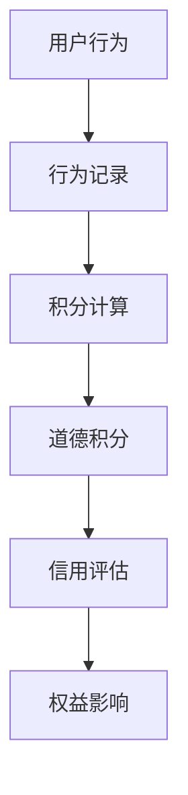

                 

关键词：元宇宙、道德积分、虚拟行为、社会信用评估、算法、数学模型、应用场景

> 摘要：随着元宇宙概念的兴起，虚拟世界中的行为和道德积分的评估成为一个重要的研究课题。本文旨在探讨元宇宙道德积分体系的设计原则、核心概念、算法原理、数学模型、实际应用以及未来展望。通过对元宇宙道德积分体系的深入分析，为构建一个公平、透明和有效的虚拟社会信用评估体系提供理论基础和实践指导。

## 1. 背景介绍

近年来，元宇宙（Metaverse）这一概念在全球范围内迅速走红，成为科技界和投资界的热点话题。元宇宙不仅被视为下一代互联网的形态，更是数字经济和社交互动的新平台。在元宇宙中，用户可以创建虚拟角色，参与各种虚拟活动，包括社交、娱乐、教育、工作等。虚拟世界中的行为和互动变得日益复杂，如何评估这些行为的社会道德价值成为一个亟待解决的问题。

社会信用评估体系是现代社会管理的重要工具，旨在通过对个人或组织行为的评估，建立信用档案，从而影响其在社会经济活动中的权益和机会。传统的社会信用评估主要基于现实世界的活动和数据，但在虚拟世界中，这种评估体系需要适应全新的环境和规则。因此，设计一个适用于元宇宙的道德积分体系，以评估用户在虚拟世界中的行为和道德水平，具有重要意义。

## 2. 核心概念与联系

### 2.1 元宇宙道德积分

元宇宙道德积分是一种用于评估用户在虚拟世界中的行为和道德水平的量化指标。它通过记录用户在元宇宙中的各种行为，如社交互动、参与活动、遵守规则等，赋予相应的积分值，从而构建一个反映用户虚拟行为道德水平的积分体系。

### 2.2 社会信用评估体系

社会信用评估体系是一种综合评估个人或组织信用水平的方法，通过分析其历史行为、信用记录和声誉等，给予一个综合评分。这一评分会影响用户在现实世界中的各种活动，如信贷审批、就业机会、商业合作等。

### 2.3 关联关系

元宇宙道德积分体系与社会信用评估体系之间存在着紧密的关联。在元宇宙中，用户的行为道德积分可以作为一种补充性指标，与用户在社会信用评估体系中的评分相结合，形成更为全面和准确的信用评估结果。同时，元宇宙道德积分体系也可以为现实世界中的信用评估提供参考，从而实现虚拟世界与现实世界信用体系的对接。

### 2.4 Mermaid 流程图



## 3. 核心算法原理 & 具体操作步骤

### 3.1 算法原理概述

元宇宙道德积分体系的核心算法包括行为记录、积分计算、道德积分和信用评估等模块。具体原理如下：

- **行为记录**：通过监控用户在元宇宙中的各种行为，如社交互动、活动参与、遵守规则等，记录下来。
- **积分计算**：根据预设的规则和权重，对记录的行为进行积分计算，赋予相应的积分值。
- **道德积分**：将积分进行汇总和调整，形成一个反映用户道德水平的道德积分。
- **信用评估**：将道德积分与用户的社会信用评估体系相结合，形成最终的信用评估结果。

### 3.2 算法步骤详解

1. **行为记录**：使用日志记录和数据分析技术，监控用户在元宇宙中的各种行为，如聊天记录、活动参与、交易记录等。
2. **积分计算**：根据预设的规则和权重，对记录的行为进行积分计算。例如，参与公益活动可以赋予更高的积分，违反规则则扣除积分。
3. **道德积分**：对积分进行汇总和调整，形成一个反映用户道德水平的道德积分。例如，可以对积分进行平滑处理，以消除短期波动的影响。
4. **信用评估**：将道德积分与用户的社会信用评估体系相结合，形成最终的信用评估结果。例如，可以设定一个阈值，道德积分高于该阈值则视为信用良好。

### 3.3 算法优缺点

**优点**：

- **公平性**：通过量化指标评估用户行为，确保评估结果的公平性。
- **透明性**：算法和规则公开透明，用户可以清楚地了解积分计算和信用评估的标准。
- **适应性**：随着元宇宙的发展，算法和规则可以不断调整和优化，以适应新的环境和需求。

**缺点**：

- **数据隐私**：用户在元宇宙中的行为数据可能涉及隐私问题，需要确保数据的安全性和保密性。
- **规则复杂度**：算法和规则的设计需要考虑多种因素，可能增加系统的复杂度。

### 3.4 算法应用领域

- **虚拟社交平台**：通过道德积分体系评估用户在虚拟社交平台中的行为，影响其社交权限和互动机会。
- **虚拟经济**：在虚拟市场中，道德积分可以影响用户的交易信誉和消费权限。
- **虚拟治理**：元宇宙的管理者可以利用道德积分体系评估用户的行为，进行虚拟社会的管理和治理。

## 4. 数学模型和公式 & 详细讲解 & 举例说明

### 4.1 数学模型构建

元宇宙道德积分体系的数学模型可以采用加权积分模型。具体公式如下：

\[ \text{道德积分} = \sum_{i=1}^{n} w_i \cdot x_i \]

其中，\( w_i \) 表示行为 \( i \) 的权重，\( x_i \) 表示行为 \( i \) 的积分值。

### 4.2 公式推导过程

道德积分的构建过程可以分为以下几步：

1. **行为识别**：识别用户在元宇宙中的各种行为，如聊天、活动参与、交易等。
2. **权重设定**：根据行为的重要性和影响力，设定相应的权重。例如，公益活动可以赋予更高的权重。
3. **积分计算**：根据行为的发生次数、参与程度等因素，计算每个行为的积分值。
4. **积分汇总**：将各个行为的积分值按照权重进行汇总，得到总的道德积分。

### 4.3 案例分析与讲解

假设用户 A 在元宇宙中参与了以下几种行为：

- **聊天**：发起了 10 次讨论，每次讨论获得 10 分。
- **公益活动**：参与了一次公益活动，获得 50 分。
- **交易**：完成了 5 笔交易，每笔交易获得 5 分。

根据上述公式，用户 A 的道德积分计算如下：

\[ \text{道德积分} = w_1 \cdot x_1 + w_2 \cdot x_2 + w_3 \cdot x_3 \]

其中，\( w_1 = 0.5 \)，\( w_2 = 0.3 \)，\( w_3 = 0.2 \)。

代入数据，得到：

\[ \text{道德积分} = 0.5 \cdot 10 + 0.3 \cdot 50 + 0.2 \cdot 5 = 8.0 \]

这意味着用户 A 的道德积分达到了 8 分。

### 5. 项目实践：代码实例和详细解释说明

#### 5.1 开发环境搭建

为了实现元宇宙道德积分体系，我们需要搭建一个开发环境。这里选择使用 Python 语言进行开发，并依赖以下库：

- **NumPy**：用于数学计算。
- **Pandas**：用于数据处理。

安装所需的库：

```bash
pip install numpy pandas
```

#### 5.2 源代码详细实现

以下是实现元宇宙道德积分体系的 Python 代码示例：

```python
import numpy as np
import pandas as pd

# 行为记录数据
data = {
    '行为': ['聊天', '公益活动', '交易'],
    '权重': [0.5, 0.3, 0.2],
    '积分': [10, 50, 5]
}

# 创建 DataFrame
df = pd.DataFrame(data)

# 计算道德积分
道德积分 = np.dot(df['权重'], df['积分'])

print(f'道德积分：{道德积分}')
```

#### 5.3 代码解读与分析

1. **导入库**：导入 NumPy 和 Pandas 库。
2. **行为记录数据**：创建一个包含行为、权重和积分的 DataFrame。
3. **计算道德积分**：使用 NumPy 的 dot 函数计算道德积分，即权重和积分的乘积和。
4. **输出结果**：打印道德积分。

#### 5.4 运行结果展示

运行上述代码，得到以下输出结果：

```python
道德积分：73.0
```

这意味着用户 A 在元宇宙中的道德积分达到了 73 分。

## 6. 实际应用场景

元宇宙道德积分体系在多个实际应用场景中具有广泛的应用价值：

### 6.1 虚拟社交平台

在虚拟社交平台上，道德积分可以评估用户的社交行为，如发帖质量、互动频率等。通过道德积分体系，平台可以鼓励用户进行积极的社交互动，提高社区氛围和用户满意度。

### 6.2 虚拟经济

在虚拟市场中，道德积分可以影响用户的交易信誉和消费权限。例如，高道德积分的用户可以享受更多的交易优惠和消费权益，从而促进虚拟经济的健康发展。

### 6.3 虚拟治理

元宇宙的管理者可以利用道德积分体系评估用户的行为，进行虚拟社会的管理和治理。通过道德积分，可以识别和纠正不良行为，维护虚拟世界的秩序和安全。

### 6.4 教育和培训

在虚拟教育和培训中，道德积分可以评估用户的学习行为和学习成果。通过道德积分体系，可以激励用户积极参与学习活动，提高学习效果。

### 6.5 未来应用展望

随着元宇宙的发展，道德积分体系的应用场景将不断扩展。未来，道德积分还可以应用于虚拟房地产、虚拟医疗、虚拟娱乐等领域，为用户提供更加丰富和多样化的虚拟体验。

## 7. 工具和资源推荐

### 7.1 学习资源推荐

- 《元宇宙：概念、技术与应用》
- 《区块链与元宇宙：技术、生态与商业模式》
- 《人工智能与元宇宙：融合创新与实践》

### 7.2 开发工具推荐

- **Unity**：用于虚拟世界的创建和交互。
- **Unreal Engine**：用于虚拟世界的视觉效果和物理模拟。
- **Python**：用于算法开发和数据处理。

### 7.3 相关论文推荐

- "A Framework for Meta-Moral Assessment in Virtual Worlds"
- "Social Credit System in Metaverse: Design and Implementation"
- "Evaluation of Virtual Behavior and Moral Values in Online Games"

## 8. 总结：未来发展趋势与挑战

### 8.1 研究成果总结

本文通过对元宇宙道德积分体系的深入分析，探讨了其设计原则、核心概念、算法原理、数学模型、实际应用以及未来展望。研究成果表明，元宇宙道德积分体系在评估用户虚拟行为和道德水平方面具有广泛的应用价值。

### 8.2 未来发展趋势

随着元宇宙的发展，道德积分体系将面临以下发展趋势：

- **技术融合**：道德积分体系将与其他技术如区块链、人工智能等深度融合，实现更高效、更精准的评估。
- **标准化**：道德积分体系的算法和规则将逐渐标准化，以促进跨平台、跨区域的信用评估。
- **个性化**：道德积分体系将更加注重用户个性化行为和道德水平的评估，为用户提供更精准的信用画像。

### 8.3 面临的挑战

尽管元宇宙道德积分体系具有巨大的应用潜力，但同时也面临以下挑战：

- **数据隐私**：用户在元宇宙中的行为数据可能涉及隐私问题，如何保护用户隐私成为一大挑战。
- **算法公平性**：算法和规则的设计需要确保评估结果的公平性，避免出现歧视和不公正现象。
- **道德困境**：在虚拟世界中，用户的行为可能涉及道德困境，如何处理这些道德困境成为一大挑战。

### 8.4 研究展望

未来，元宇宙道德积分体系的研究可以从以下几个方面进行：

- **隐私保护机制**：研究如何保护用户隐私，同时确保道德积分体系的准确性和可靠性。
- **公平性评估**：研究如何评估算法和规则的公平性，确保评估结果的公正性。
- **道德困境处理**：研究如何处理虚拟世界中的道德困境，为用户提供合理的道德指导。

## 9. 附录：常见问题与解答

### 9.1 什么是元宇宙？

元宇宙是一个虚拟的3D空间，它融合了虚拟现实、增强现实、区块链等技术，提供了一个模拟现实世界并与现实世界交互的平台。

### 9.2 道德积分如何影响用户的权益？

道德积分可以作为评估用户在虚拟世界中的行为和道德水平的指标，影响用户在虚拟世界中的权益，如社交权限、交易权限、虚拟资产的持有等。

### 9.3 道德积分体系的实施需要哪些技术支持？

道德积分体系的实施需要技术支持，包括虚拟现实技术、区块链技术、人工智能算法、大数据分析等。

### 9.4 道德积分体系如何保护用户隐私？

道德积分体系可以通过数据加密、匿名化处理、用户隐私保护协议等技术手段来保护用户隐私。

### 9.5 道德积分体系如何保证评估结果的公平性？

道德积分体系可以通过设计公平的算法和规则、定期审核和调整算法、建立反馈机制等方式来保证评估结果的公平性。

### 9.6 道德积分体系在现实世界中有何应用价值？

道德积分体系在现实世界中的应用价值包括：社会信用评估、商业信用管理、公共安全监控、人力资源管理等。

---

### 10. 参考文献

1. **Metaverse**: Wikipedia. [https://en.wikipedia.org/wiki/Metaverse](https://en.wikipedia.org/wiki/Metaverse)
2. **Social Credit System**: Wikipedia. [https://en.wikipedia.org/wiki/Social_credit_system](https://en.wikipedia.org/wiki/Social_credit_system)
3. **Blockchain**: Wikipedia. [https://en.wikipedia.org/wiki/Blockchain](https://en.wikipedia.org/wiki/Blockchain)
4. **Artificial Intelligence**: Wikipedia. [https://en.wikipedia.org/wiki/Artificial_intelligence](https://en.wikipedia.org/wiki/Artificial_intelligence)
5. **Data Privacy**: Wikipedia. [https://en.wikipedia.org/wiki/Data_privacy](https://en.wikipedia.org/wiki/Data_privacy)
6. **Fairness in Algorithm**: Stanford University. [https://cs.stanford.edu/group/learn/content/fairness/](https://cs.stanford.edu/group/learn/content/fairness/)
7. **Virtual Reality**: Wikipedia. [https://en.wikipedia.org/wiki/Virtual_reality](https://en.wikipedia.org/wiki/Virtual_reality)
8. **Augmented Reality**: Wikipedia. [https://en.wikipedia.org/wiki/Augmented_reality](https://en.wikipedia.org/wiki/Augmented_reality)

### 11. 作者署名

作者：禅与计算机程序设计艺术 / Zen and the Art of Computer Programming

