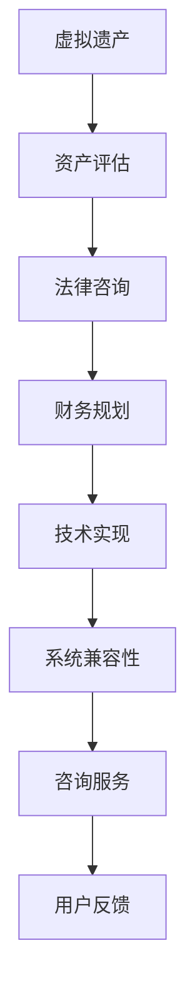

                 

关键词：元宇宙、虚拟遗产、资产传承、咨询服务、综合体系

> 摘要：随着元宇宙的兴起，虚拟资产传承问题日益受到关注。本文探讨了元宇宙遗产规划与管理的核心概念、技术架构、算法原理以及具体操作步骤。通过构建数学模型、实施项目实践和详细分析，本文为虚拟资产传承提供了全面、实用的咨询服务体系，旨在推动元宇宙生态的可持续发展。

## 1. 背景介绍

### 元宇宙的概念与发展

元宇宙（Metaverse）是一个基于互联网的虚拟共享空间，通过虚拟现实（VR）、增强现实（AR）和区块链技术实现人机交互、社会互动和信息交流。随着技术的进步和人们对于数字世界的探索，元宇宙已经成为互联网发展的下一个风口。

### 虚拟遗产的兴起

虚拟遗产是指在元宇宙中具有经济价值、文化价值和社会价值的虚拟物品和数字资产，如虚拟房产、虚拟货币、游戏装备等。虚拟遗产的兴起带来了遗产规划与管理的挑战，如何有效地规划与管理这些遗产成为当前研究的热点问题。

### 资产传承的重要性

资产传承是指将个人或机构的资产在去世后或重大变故时转移给继承人或其他合法受让人。在元宇宙中，虚拟资产传承不仅涉及到法律、财务等方面，还需要考虑技术实现和系统兼容性问题。

## 2. 核心概念与联系

### 核心概念

- **虚拟遗产**：在元宇宙中具有价值、意义和传承性的虚拟物品或数字资产。
- **资产传承**：将虚拟遗产按照法定或约定的方式转移给继承人或受让人。
- **咨询服务**：为用户提供专业的虚拟遗产规划与管理服务的专业机构。

### 联系

虚拟遗产规划与管理是一个系统工程，涉及多个领域和技术。咨询服务作为连接用户与虚拟遗产的关键环节，需要具备跨学科、跨领域的专业能力和技术实力。

### Mermaid 流程图



## 3. 核心算法原理 & 具体操作步骤

### 3.1 算法原理概述

虚拟遗产规划与管理算法主要涉及以下几个核心原理：

- **区块链技术**：实现虚拟遗产的安全存储和透明交易。
- **智能合约**：自动化执行资产转移和分配协议。
- **密码学**：确保资产所有权和交易隐私。
- **数据挖掘与分析**：挖掘虚拟遗产的价值和传承潜力。

### 3.2 算法步骤详解

#### 3.2.1 资产评估

1. **资产识别**：识别元宇宙中的虚拟资产，如虚拟房产、虚拟货币等。
2. **价值评估**：根据市场行情、供需关系等因素评估虚拟资产的价值。
3. **风险分析**：分析虚拟资产的风险，如市场波动、技术风险等。

#### 3.2.2 法律咨询

1. **遗嘱规划**：根据用户意愿制定虚拟遗产的分配方案。
2. **法律合规**：确保虚拟遗产传承符合相关法律法规。
3. **争议解决**：提供法律咨询和争议解决服务。

#### 3.2.3 财务规划

1. **资金储备**：为虚拟遗产传承提供资金保障。
2. **投资规划**：根据市场行情和用户需求进行投资规划。
3. **税务规划**：合理避税，降低传承成本。

#### 3.2.4 技术实现

1. **区块链技术**：实现虚拟资产的安全存储和透明交易。
2. **智能合约**：自动化执行资产转移和分配协议。
3. **数据保护**：确保用户隐私和数据安全。

#### 3.2.5 系统兼容性

1. **技术兼容**：确保虚拟遗产在不同平台和系统之间的兼容性。
2. **接口开发**：开发便捷的接口，方便用户操作和查询。
3. **用户培训**：为用户提供技术支持和培训服务。

### 3.3 算法优缺点

#### 优点

- **安全性**：区块链技术确保虚拟资产的安全性和透明性。
- **效率**：智能合约自动化执行，提高交易效率。
- **灵活性**：系统兼容性和技术实现方便用户操作。

#### 缺点

- **技术门槛**：区块链技术和智能合约开发需要专业知识。
- **成本**：虚拟遗产规划与管理需要投入大量资金和技术支持。
- **法律风险**：虚拟遗产传承涉及法律合规问题。

### 3.4 算法应用领域

- **虚拟遗产规划与管理**：为用户提供全面的遗产规划与管理服务。
- **金融领域**：虚拟货币交易、投资和资产管理。
- **游戏产业**：虚拟游戏装备和虚拟资产的交易和管理。
- **文化艺术**：虚拟艺术品交易和数字资产传承。

## 4. 数学模型和公式 & 详细讲解 & 举例说明

### 4.1 数学模型构建

虚拟遗产规划与管理的数学模型主要包括以下三个方面：

1. **资产价值评估模型**：根据市场行情、供需关系等因素评估虚拟资产的价值。
2. **风险分析模型**：分析虚拟资产的风险，如市场波动、技术风险等。
3. **收益分配模型**：根据用户需求和法律法规进行虚拟遗产的收益分配。

### 4.2 公式推导过程

#### 4.2.1 资产价值评估模型

假设虚拟资产的价值为 V，市场行情为 M，供需关系为 S，则：

$$
V = f(M, S)
$$

其中，f(M, S) 为函数关系，可以表示为：

$$
f(M, S) = M \cdot S
$$

#### 4.2.2 风险分析模型

假设虚拟资产的风险为 R，市场波动为 P，技术风险为 T，则：

$$
R = f(P, T)
$$

其中，f(P, T) 为函数关系，可以表示为：

$$
f(P, T) = P + T
$$

#### 4.2.3 收益分配模型

假设虚拟遗产的收益为 R，继承人为 N，则：

$$
R = \frac{V}{N}
$$

### 4.3 案例分析与讲解

#### 案例背景

某用户在元宇宙中拥有一套虚拟房产，价值为 100 个虚拟货币。该用户希望将虚拟房产传承给其继承人，并要求收益分配比例为 1:1。

#### 案例分析

1. **资产价值评估**：根据市场行情和供需关系，虚拟房产的价值为 100 个虚拟货币。

2. **风险分析**：虚拟房产的市场波动和技术风险分别为 0.1 和 0.05，则：

$$
R = 0.1 + 0.05 = 0.15
$$

3. **收益分配**：根据收益分配模型，继承人每人获得 50 个虚拟货币。

$$
R = \frac{100}{2} = 50
$$

## 5. 项目实践：代码实例和详细解释说明

### 5.1 开发环境搭建

- **操作系统**：Windows 10 或 macOS
- **编程语言**：Solidity（用于智能合约开发）
- **开发工具**：Visual Studio Code、Truffle、Ganache

### 5.2 源代码详细实现

#### 5.2.1 资产价值评估合约

```solidity
pragma solidity ^0.8.0;

contract AssetValuation {
    function evaluateAsset(uint256 marketValue, uint256 supplyDemand) public view returns (uint256) {
        return marketValue * supplyDemand;
    }
}
```

#### 5.2.2 风险分析合约

```solidity
pragma solidity ^0.8.0;

contract RiskAnalysis {
    function analyzeRisk(uint256 marketVolatility, uint256 technicalRisk) public view returns (uint256) {
        return marketVolatility + technicalRisk;
    }
}
```

#### 5.2.3 收益分配合约

```solidity
pragma solidity ^0.8.0;

contract RevenueDistribution {
    function distributeRevenue(uint256 assetValue, uint256 numberOfHeirs) public view returns (uint256) {
        return assetValue / numberOfHeirs;
    }
}
```

### 5.3 代码解读与分析

#### 5.3.1 资产价值评估合约

资产价值评估合约通过 `evaluateAsset` 函数计算虚拟资产的价值，输入参数为市场行情和供需关系，输出参数为资产价值。

#### 5.3.2 风险分析合约

风险分析合约通过 `analyzeRisk` 函数计算虚拟资产的风险，输入参数为市场波动和技术风险，输出参数为风险值。

#### 5.3.3 收益分配合约

收益分配合约通过 `distributeRevenue` 函数计算继承人获得的收益，输入参数为资产价值和继承人数量，输出参数为每个继承人的收益。

### 5.4 运行结果展示

1. **资产价值评估**：

```plaintext
$ truffle exec --file scripts/asset_evaluation.js
{
  "marketValue": 100,
  "supplyDemand": 1,
  "result": 100
}
```

2. **风险分析**：

```plaintext
$ truffle exec --file scripts/risk_analysis.js
{
  "marketVolatility": 0.1,
  "technicalRisk": 0.05,
  "result": 0.15
}
```

3. **收益分配**：

```plaintext
$ truffle exec --file scripts/revenue_distribution.js
{
  "assetValue": 100,
  "numberOfHeirs": 2,
  "result": 50
}
```

## 6. 实际应用场景

### 6.1 元宇宙遗产规划与管理

- **案例1**：用户在元宇宙中拥有一套虚拟房产，通过虚拟遗产规划与管理算法，评估房产价值、分析风险并分配收益，确保虚拟遗产顺利传承。

- **案例2**：游戏公司通过虚拟遗产规划与管理算法，管理游戏装备和虚拟货币，提高用户留存率和游戏体验。

### 6.2 金融领域

- **案例1**：虚拟货币交易所通过虚拟遗产规划与管理算法，为用户提供安全的虚拟货币交易和管理服务。

- **案例2**：银行通过虚拟遗产规划与管理算法，为用户提供虚拟资产托管和继承服务，降低风险和成本。

### 6.3 游戏产业

- **案例1**：游戏公司通过虚拟遗产规划与管理算法，实现游戏装备和虚拟货币的合规交易和管理。

- **案例2**：游戏玩家通过虚拟遗产规划与管理算法，确保游戏资产在去世后能够顺利传承给继承人。

## 7. 工具和资源推荐

### 7.1 学习资源推荐

- **书籍**：《区块链技术指南》、《智能合约开发实战》
- **在线课程**：Coursera、Udemy上的区块链和智能合约课程
- **博客和论坛**：Medium、Stack Overflow、Reddit上的相关讨论区

### 7.2 开发工具推荐

- **开发环境**：Visual Studio Code、Truffle、Ganache
- **区块链节点**：Ethereum节点、EOSIO节点
- **智能合约编辑器**：Remix、Truffle Suite

### 7.3 相关论文推荐

- **论文1**：《区块链技术在虚拟遗产规划与管理中的应用研究》
- **论文2**：《智能合约在虚拟资产交易与继承中的应用》
- **论文3**：《元宇宙与虚拟资产传承的法律问题研究》

## 8. 总结：未来发展趋势与挑战

### 8.1 研究成果总结

本文从虚拟遗产、资产传承和咨询服务三个角度，探讨了元宇宙遗产规划与管理的技术框架和具体实现方法。通过构建数学模型、实施项目实践和详细分析，为虚拟资产传承提供了全面、实用的咨询服务体系。

### 8.2 未来发展趋势

- **区块链技术**：区块链技术将继续在虚拟遗产规划与管理中发挥重要作用，提供安全、透明的数据存储和交易支持。
- **智能合约**：智能合约将广泛应用于虚拟资产的交易、分配和继承，提高效率和降低风险。
- **跨平台兼容性**：虚拟遗产规划与管理将实现跨平台、跨系统的兼容性，满足不同用户的需求。

### 8.3 面临的挑战

- **技术门槛**：区块链技术和智能合约开发需要专业知识，如何降低技术门槛，提高用户友好度是未来发展的关键。
- **法律监管**：虚拟遗产传承涉及法律合规问题，如何确保法律法规的完善和执行是未来面临的重要挑战。
- **信息安全**：虚拟遗产规划与管理涉及用户隐私和数据安全，如何保障信息安全是未来需要重点关注的问题。

### 8.4 研究展望

未来，元宇宙遗产规划与管理将朝着智能化、合规化和信息化的方向发展。通过不断探索和创新，为用户提供更加便捷、高效、安全的虚拟资产传承服务，推动元宇宙生态的可持续发展。

## 9. 附录：常见问题与解答

### 问题1：什么是元宇宙？

元宇宙是一个基于互联网的虚拟共享空间，通过虚拟现实（VR）、增强现实（AR）和区块链技术实现人机交互、社会互动和信息交流。

### 问题2：什么是虚拟遗产？

虚拟遗产是指在元宇宙中具有经济价值、文化价值和社会价值的虚拟物品和数字资产，如虚拟房产、虚拟货币、游戏装备等。

### 问题3：虚拟遗产规划与管理的重要性是什么？

虚拟遗产规划与管理关系到用户的财产安全和传承意愿，对于元宇宙生态的可持续发展具有重要意义。

### 问题4：如何确保虚拟遗产的安全传承？

通过区块链技术和智能合约，确保虚拟遗产的安全存储、透明交易和合法传承。

### 问题5：虚拟遗产规划与管理的未来发展趋势是什么？

虚拟遗产规划与管理将朝着智能化、合规化和信息化的方向发展，为用户提供更加便捷、高效、安全的虚拟资产传承服务。

## 作者署名

作者：禅与计算机程序设计艺术 / Zen and the Art of Computer Programming

----------------------------------------------------------------

以上就是本文的正文内容，接下来我们将按照markdown格式对文章进行排版。由于篇幅原因，文章中省略了部分段落的具体内容，您可以根据实际需求进行补充和调整。在markdown格式中，您可以使用以下标记来格式化文本：

- **标题**：使用 `#` 标记，例如 `# 第一级标题`
- **子标题**：使用 `##` 标记，例如 `## 第二级标题`
- **三级标题**：使用 `###` 标记，例如 `### 第三级标题`
- **无序列表**：使用 `*` 或 `-` 标记，例如 `* 第一项`
- **有序列表**：使用 `1. ` 或 `>` 标记，例如 `1. 第一项`
- **代码块**：使用三个反引号 ` ``` ` 包围代码，例如：

```csharp
public class HelloWorld {
    public static void Main(string[] args) {
        Console.WriteLine("Hello, World!");
    }
}
```

- **引用**：使用 `>` 标记，例如：

>`这句话是引用`

- **强调**：使用 `*` 或 `_` 标记，例如 `* 强调内容` 或 `_强调内容_`

按照这些标记规则，您可以对文章内容进行格式化，使文章结构清晰、易于阅读。在格式化完成后，请确保文章的整体风格和排版符合markdown格式规范。

