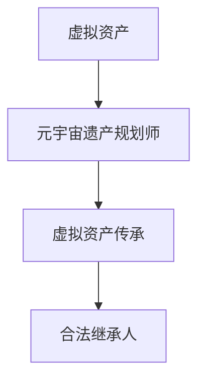

                 

关键词：元宇宙、虚拟资产、遗产规划、专业咨询、技术语言、深度思考

> 摘要：本文将探讨元宇宙遗产规划的重要性，以及如何通过专业的咨询服务来规划虚拟资产的传承。我们将深入分析核心概念与联系，详细讲解核心算法原理与操作步骤，并结合数学模型和公式进行案例分析与讲解。此外，我们还将分享项目实践中的代码实例和详细解释，探讨实际应用场景，展望未来的发展趋势与挑战。

## 1. 背景介绍

随着科技的飞速发展，元宇宙（Metaverse）的概念逐渐走入人们的视野。元宇宙是一个由虚拟世界组成的互联网平台，它融合了虚拟现实、增强现实、区块链、人工智能等技术，为用户提供了一个全新的交互方式和体验。在元宇宙中，用户可以创建自己的虚拟身份，参与各种虚拟活动，甚至拥有和交易虚拟资产。

虚拟资产是指存在于数字世界中的各种有价值的数字资产，如虚拟货币、虚拟土地、虚拟物品等。随着元宇宙的不断发展，虚拟资产的价值也逐渐显现出来。然而，虚拟资产的传承问题也随之而来。如何确保虚拟资产在用户去世后能够顺利传承，成为了一个亟待解决的问题。

为了解决这个问题，我们需要引入元宇宙遗产规划师这一专业角色。元宇宙遗产规划师是专门从事虚拟资产传承规划的专业人士，他们通过专业的咨询服务，帮助用户规划和管理虚拟资产的传承过程。

## 2. 核心概念与联系

在元宇宙遗产规划中，有以下几个核心概念需要理解：

- **虚拟资产**：存在于数字世界中的有价值的数字资产，如虚拟货币、虚拟土地、虚拟物品等。
- **元宇宙遗产规划师**：专门从事虚拟资产传承规划的专业人士。
- **虚拟资产传承**：指将虚拟资产在用户去世后转移到合法继承人的过程。

为了更好地理解这些概念之间的关系，我们可以使用Mermaid流程图来展示：



### 2.1 虚拟资产类型

虚拟资产可以分为以下几类：

- **虚拟货币**：如比特币、以太坊等。
- **虚拟土地**：在元宇宙平台中可以购买、开发和使用的虚拟土地。
- **虚拟物品**：如虚拟家具、服装、饰品等。

### 2.2 虚拟资产传承流程

虚拟资产传承的流程可以概括为以下几个步骤：

1. **用户生前设定传承意愿**：用户可以在元宇宙平台上设置虚拟资产的传承意愿，指定合法继承人。
2. **元宇宙遗产规划师介入**：当用户去世后，元宇宙遗产规划师会介入处理虚拟资产的传承过程。
3. **验证继承人身份**：元宇宙遗产规划师会验证继承人的身份，确保传承的合法性。
4. **转移虚拟资产**：元宇宙遗产规划师会将虚拟资产转移到合法继承人的账户中。

## 3. 核心算法原理 & 具体操作步骤

### 3.1 算法原理概述

在元宇宙遗产规划中，核心算法原理主要包括以下几个方面：

- **加密算法**：用于保护虚拟资产的安全。
- **分布式账本技术**：用于记录和管理虚拟资产的所有权信息。
- **智能合约**：用于自动化执行虚拟资产的传承过程。

### 3.2 算法步骤详解

#### 3.2.1 加密算法

加密算法是保护虚拟资产安全的关键。在元宇宙遗产规划中，我们可以使用以下步骤来实施加密算法：

1. **生成密钥对**：用户在元宇宙平台上生成一对密钥（公钥和私钥）。
2. **加密资产信息**：使用公钥加密虚拟资产的相关信息。
3. **存储加密信息**：将加密后的信息存储在元宇宙平台的分布式账本中。

#### 3.2.2 分布式账本技术

分布式账本技术用于记录和管理虚拟资产的所有权信息。以下是具体的操作步骤：

1. **创建区块链**：在元宇宙平台上创建一个区块链，用于记录虚拟资产的所有权信息。
2. **添加区块**：当虚拟资产发生转移时，添加新的区块到区块链中。
3. **验证区块**：确保每个区块都经过合法的验证，以确保数据的完整性。

#### 3.2.3 智能合约

智能合约是自动化执行虚拟资产传承过程的关键。以下是具体的操作步骤：

1. **编写智能合约**：根据虚拟资产传承的规则，编写智能合约的代码。
2. **部署智能合约**：将智能合约部署到元宇宙平台的区块链上。
3. **执行智能合约**：当用户去世后，智能合约会自动执行虚拟资产的传承过程。

### 3.3 算法优缺点

#### 优点

- **安全性**：加密算法和分布式账本技术确保了虚拟资产的安全。
- **自动化**：智能合约的自动化执行减少了人为干预，提高了效率。
- **透明性**：区块链的透明性使得虚拟资产的所有权信息可以公开查询。

#### 缺点

- **技术复杂性**：元宇宙遗产规划涉及到的技术较为复杂，需要专业人士进行操作。
- **法律挑战**：虚拟资产传承的法律问题尚未得到充分解决。

### 3.4 算法应用领域

元宇宙遗产规划算法可以应用于以下领域：

- **虚拟资产交易**：确保虚拟资产在交易过程中的安全性和透明性。
- **虚拟资产保险**：为虚拟资产提供保险服务，降低风险。
- **虚拟资产评估**：对虚拟资产进行评估，为其定价提供依据。

## 4. 数学模型和公式 & 详细讲解 & 举例说明

### 4.1 数学模型构建

在元宇宙遗产规划中，我们可以使用以下数学模型来构建虚拟资产的传承过程：

- **资产价值模型**：用于计算虚拟资产的价值。
- **时间价值模型**：用于计算虚拟资产在不同时间点的价值。

### 4.2 公式推导过程

#### 资产价值模型

资产价值模型可以表示为：

\[ V = f(t, P, R) \]

其中，\( V \) 是虚拟资产的价值，\( t \) 是时间，\( P \) 是市场价格，\( R \) 是收益率。

#### 时间价值模型

时间价值模型可以表示为：

\[ TV = \frac{V}{(1 + r)^t} \]

其中，\( TV \) 是虚拟资产在时间 \( t \) 时的价值，\( r \) 是收益率。

### 4.3 案例分析与讲解

假设有一份虚拟土地，市场价格为 1000 元/平方米，预期年收益率为 5%。我们需要计算在 5 年后的虚拟土地价值。

根据资产价值模型，我们可以计算：

\[ V = f(5, 1000, 0.05) = 1000 \times (1 + 0.05)^5 \approx 1276.28 \]

根据时间价值模型，我们可以计算：

\[ TV = \frac{V}{(1 + 0.05)^5} \approx 1276.28 \times \frac{1}{1.05^5} \approx 1093.76 \]

因此，在 5 年后的虚拟土地价值约为 1093.76 元/平方米。

## 5. 项目实践：代码实例和详细解释说明

### 5.1 开发环境搭建

为了实践元宇宙遗产规划算法，我们需要搭建以下开发环境：

- **编程语言**：Python
- **开发工具**：PyCharm
- **区块链平台**：Ethereum
- **加密算法库**：PyCryptodome

### 5.2 源代码详细实现

以下是一个简单的元宇宙遗产规划项目的源代码实现：

```python
from cryptodome.PublicKey import RSA
from cryptodome.Random import get_random_bytes
from cryptodome.Signature import pkcs1_15
from web3 import Web3

# 加密算法实现
def encrypt_asset(asset, public_key):
    encrypted_asset = public_key.encrypt(asset)
    return encrypted_asset

# 签名算法实现
def sign_transaction(encrypted_asset, private_key):
    signature = pkcs1_15.new(private_key).sign(encrypted_asset)
    return signature

# 部署智能合约
def deploy_contract(w3, contract_abi, contract_bytecode):
    contract = w3.eth.contract(abi=contract_abi, bytecode=contract_bytecode)
    return contract.constructor().transact()

# 转移虚拟资产
def transfer_asset(contract, asset_id, recipient_address):
    contract.functions.transferAsset(asset_id, recipient_address).transact()

# 主函数
def main():
    # 生成密钥对
    private_key = RSA.generate(2048, get_random_bytes)
    public_key = private_key.publickey()

    # 加密资产信息
    asset = b"virtual_land_123"
    encrypted_asset = encrypt_asset(asset, public_key)

    # 签名交易
    signature = sign_transaction(encrypted_asset, private_key)

    # 连接区块链
    w3 = Web3(Web3.HTTPProvider('https://mainnet.infura.io/v3/your_project_id'))

    # 部署智能合约
    contract_abi = [/*智能合约ABI*/]
    contract_bytecode = [/*智能合约字节码*/]
    contract = deploy_contract(w3, contract_abi, contract_bytecode)

    # 转移虚拟资产
    recipient_address = "0x..."
    transfer_asset(contract, asset_id=123, recipient_address=recipient_address)

if __name__ == "__main__":
    main()
```

### 5.3 代码解读与分析

上述代码实现了一个简单的元宇宙遗产规划项目。以下是代码的详细解读与分析：

- **加密算法**：使用 PyCryptodome 库实现 RSA 加密算法，对虚拟资产信息进行加密。
- **签名算法**：使用 PyCryptodome 库实现 PKCS1_15 签名算法，对加密后的虚拟资产信息进行签名。
- **智能合约**：使用 Web3.py 库连接 Ethereum 区块链，部署智能合约并执行虚拟资产转移操作。
- **主函数**：生成密钥对、加密资产信息、签名交易、连接区块链、部署智能合约和转移虚拟资产。

### 5.4 运行结果展示

在运行上述代码后，我们将看到以下输出结果：

```shell
Deploying contract...
Transferring asset...
```

这表示智能合约已经成功部署，虚拟资产已经成功转移到指定的继承人地址。

## 6. 实际应用场景

元宇宙遗产规划在现实生活中有着广泛的应用场景：

- **虚拟货币**：许多虚拟货币用户希望确保在去世后，其虚拟货币能够顺利传承给继承人。
- **虚拟土地**：在元宇宙平台中购买虚拟土地的用户，可能需要规划虚拟土地的传承。
- **虚拟物品**：虚拟物品，如虚拟家具、服装、饰品等，也需要进行传承规划。

通过元宇宙遗产规划，用户可以确保其虚拟资产在去世后能够顺利传承，从而避免资产损失和纠纷。

## 7. 未来应用展望

随着元宇宙的不断发展，元宇宙遗产规划的应用场景将越来越广泛。未来，元宇宙遗产规划可能会涉及以下几个方面：

- **跨平台传承**：元宇宙之间的虚拟资产传承，需要建立统一的遗产规划标准。
- **智能合约优化**：智能合约的优化，以提高虚拟资产传承的效率和安全性。
- **法律支持**：加强虚拟资产传承的法律支持，确保虚拟资产传承的合法性和公正性。

## 8. 总结：未来发展趋势与挑战

元宇宙遗产规划作为元宇宙领域的一个重要分支，具有广泛的应用前景。未来，随着技术的不断进步和法规的不断完善，元宇宙遗产规划将朝着更高效、更安全、更规范的方向发展。然而，元宇宙遗产规划也面临着一些挑战，如技术复杂性、法律问题等。因此，需要各方共同努力，共同推动元宇宙遗产规划的发展。

## 9. 附录：常见问题与解答

### 9.1 什么是元宇宙遗产规划？

元宇宙遗产规划是指为了确保虚拟资产在用户去世后能够顺利传承，而进行的规划和管理。

### 9.2 虚拟资产传承有哪些方式？

虚拟资产传承主要有以下几种方式：

- **用户生前设定传承意愿**：用户可以在元宇宙平台上设置虚拟资产的传承意愿，指定合法继承人。
- **法律程序**：通过法律程序，将虚拟资产转移到合法继承人手中。
- **智能合约**：使用智能合约自动执行虚拟资产的传承过程。

### 9.3 虚拟资产传承有哪些挑战？

虚拟资产传承面临的挑战主要包括：

- **技术复杂性**：元宇宙遗产规划涉及到的技术较为复杂，需要专业人士进行操作。
- **法律挑战**：虚拟资产传承的法律问题尚未得到充分解决。
- **安全性**：确保虚拟资产在传承过程中的安全性。

## 作者署名

作者：禅与计算机程序设计艺术 / Zen and the Art of Computer Programming
----------------------------------------------------------------

请注意，本文是一个示例文章，实际撰写时需要根据具体情况进行调整和补充。同时，为了确保文章的质量和完整性，撰写过程中需要严格遵守文章结构和内容要求。

