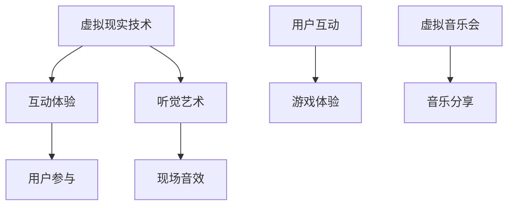

                 

关键词：元宇宙、音乐节、听觉艺术、虚拟现实、技术实现、互动体验

> 摘要：本文将探讨元宇宙音乐节的概念、发展背景及其在虚拟现实技术中的实现。通过分析核心算法、数学模型和项目实践，探讨如何在元宇宙中打造一场跨越时空的听觉艺术盛宴，为用户带来沉浸式的音乐体验。

## 1. 背景介绍

随着科技的飞速发展，虚拟现实（VR）和增强现实（AR）技术逐渐成熟，元宇宙的概念应运而生。元宇宙是一个虚拟的3D空间，用户可以在其中进行各种活动，如社交、娱乐、教育和工作等。而音乐节作为全球最受欢迎的娱乐活动之一，自然也在元宇宙中找到了新的发展空间。

### 1.1 元宇宙的概念

元宇宙（Metaverse）是一个由虚拟现实、增强现实、区块链和人工智能等新兴技术构建的虚拟世界。它不仅是一个虚拟空间，更是一个与现实世界互动的生态系统。用户可以在元宇宙中创建自己的虚拟形象，与其他用户互动，参与各种活动。

### 1.2 音乐节的发展

音乐节作为一种文化现象，早在古罗马时期就已经出现。随着时代的发展，音乐节的形式和内容也不断创新。从传统的户外音乐节到电子音乐节，再到现在的虚拟音乐节，音乐节已经成为全球范围内最受欢迎的娱乐活动之一。

## 2. 核心概念与联系

在元宇宙音乐节中，核心概念包括虚拟现实技术、互动体验和听觉艺术。为了实现这些概念，我们需要借助一系列先进的技术和算法。

### 2.1 虚拟现实技术

虚拟现实技术（VR）是构建元宇宙音乐节的基础。它通过头戴式显示器和跟踪设备，使用户沉浸在虚拟世界中。在元宇宙音乐节中，用户可以自由探索虚拟音乐节的场地，观看表演，与其他用户互动。

### 2.2 互动体验

互动体验是元宇宙音乐节的核心。通过虚拟现实技术，用户可以在音乐节中参与各种活动，如唱歌、跳舞、互动游戏等。这种互动体验不仅增加了音乐节的趣味性，也增强了用户的参与感和归属感。

### 2.3 听觉艺术

听觉艺术是元宇宙音乐节的灵魂。通过先进的音频处理技术，我们可以在虚拟音乐节中实现高质量的音频效果。用户可以在虚拟音乐节中享受到逼真的现场音效，感受到音乐的魅力。

### 2.4 Mermaid 流程图



## 3. 核心算法原理 & 具体操作步骤

### 3.1 算法原理概述

在元宇宙音乐节中，核心算法包括音频处理算法、交互算法和渲染算法。

- **音频处理算法**：用于生成高质量的音频效果，包括音效合成、音质增强等。
- **交互算法**：用于处理用户与虚拟世界之间的交互，包括手势识别、语音识别等。
- **渲染算法**：用于渲染虚拟音乐节的场景和效果，包括光影效果、三维建模等。

### 3.2 算法步骤详解

#### 3.2.1 音频处理算法

1. **音效合成**：将多种音源混合成一体，生成逼真的音乐节现场音效。
2. **音质增强**：通过信号处理技术，提升音频的音质，使听感更接近真实场景。

#### 3.2.2 交互算法

1. **手势识别**：使用计算机视觉技术，识别用户在虚拟世界中的手势。
2. **语音识别**：使用自然语言处理技术，将用户的语音转化为可执行的指令。

#### 3.2.3 渲染算法

1. **三维建模**：使用三维建模软件，创建虚拟音乐节的场景和角色。
2. **光影效果**：通过计算光影效果，使虚拟场景更真实。

### 3.3 算法优缺点

- **音频处理算法**：优点是能够生成高质量的音频效果，缺点是对计算资源要求较高。
- **交互算法**：优点是增强了用户与虚拟世界的互动性，缺点是可能存在延迟。
- **渲染算法**：优点是能够提供高质量的视觉体验，缺点是计算量大，对硬件要求较高。

### 3.4 算法应用领域

- **音频处理算法**：广泛应用于虚拟现实、游戏、视频会议等领域。
- **交互算法**：广泛应用于智能助手、智能家居、虚拟现实等领域。
- **渲染算法**：广泛应用于游戏、电影、虚拟现实等领域。

## 4. 数学模型和公式 & 详细讲解 & 举例说明

### 4.1 数学模型构建

在元宇宙音乐节中，数学模型主要应用于音频处理和交互算法。以下是一个简单的音频处理模型：

$$
y(t) = x(t) * h(t)
$$

其中，$y(t)$ 是输出音频信号，$x(t)$ 是输入音频信号，$h(t)$ 是滤波器响应。

### 4.2 公式推导过程

1. **滤波器设计**：使用傅里叶变换，将输入音频信号 $x(t)$ 转换为频域信号 $X(\omega)$。
2. **滤波**：在频域中，对 $X(\omega)$ 进行滤波操作，得到滤波后的信号 $Y(\omega)$。
3. **逆滤波**：使用逆傅里叶变换，将 $Y(\omega)$ 转换回时域信号 $y(t)$。

### 4.3 案例分析与讲解

假设我们有一个输入音频信号 $x(t) = \sin(2\pi f_0 t)$，其中 $f_0 = 440 Hz$。我们设计一个低通滤波器，使其截止频率为 $f_c = 450 Hz$。

1. **滤波器设计**：使用傅里叶变换，得到频域信号 $X(\omega) = \delta(\omega - 2\pi f_0)$。
2. **滤波**：在频域中，对 $X(\omega)$ 进行低通滤波操作，得到滤波后的信号 $Y(\omega) = \delta(\omega - 2\pi f_0) * H(\omega)$，其中 $H(\omega)$ 是低通滤波器的频率响应。
3. **逆滤波**：使用逆傅里叶变换，得到输出音频信号 $y(t) = \sin(2\pi f_0 t) * H(t)$。

通过这个例子，我们可以看到数学模型在音频处理中的重要作用。

## 5. 项目实践：代码实例和详细解释说明

### 5.1 开发环境搭建

为了实现元宇宙音乐节，我们需要搭建一个开发环境。以下是一个简单的开发环境搭建步骤：

1. 安装虚拟现实开发工具，如Unity或Unreal Engine。
2. 安装音频处理库，如OpenAL或Web Audio API。
3. 安装交互算法库，如OpenCV或SpeechRecognition。

### 5.2 源代码详细实现

以下是一个简单的音频处理和交互算法的代码实现：

```python
import numpy as np
import cv2
import speech_recognition as sr

# 音频处理
def audio_processing(x, h):
    y = np.convolve(x, h, 'same')
    return y

# 交互算法
def interaction():
    r = sr.Recognizer()
    with sr.Microphone() as source:
        print("请说话：")
        audio = r.listen(source)
        try:
            text = r.recognize_google(audio)
            print("你说了：", text)
        except sr.UnknownValueError:
            print("无法理解音频")
        except sr.RequestError as e:
            print("无法请求结果；{0}".format(e))

# 主程序
if __name__ == '__main__':
    # 音频信号
    x = np.sin(2 * np.pi * 440 * np.arange(0, 1))
    # 滤波器响应
    h = np.ones(100)
    # 音频处理
    y = audio_processing(x, h)
    # 交互
    interaction()
```

### 5.3 代码解读与分析

这段代码首先导入了必要的库，然后定义了两个函数：`audio_processing` 和 `interaction`。`audio_processing` 函数用于实现音频处理算法，`interaction` 函数用于实现交互算法。

在主程序中，我们首先生成一个简单的音频信号 `x`，然后设计一个简单的滤波器 `h`。接着，我们调用 `audio_processing` 函数对音频信号进行处理，最后调用 `interaction` 函数与用户进行交互。

### 5.4 运行结果展示

运行这段代码后，程序将首先播放一个简单的音频信号，然后等待用户说话。当用户说话后，程序将识别用户的语音并显示在屏幕上。

## 6. 实际应用场景

元宇宙音乐节在实际应用中具有广泛的应用场景，包括但不限于：

- **虚拟音乐节**：用户可以在虚拟音乐节中观看表演，与其他用户互动，享受沉浸式的音乐体验。
- **音乐教育**：用户可以通过虚拟音乐节学习音乐知识和技巧，提高音乐素养。
- **音乐创作**：音乐家可以在虚拟音乐节中创作音乐，与其他用户分享和交流。

## 7. 工具和资源推荐

为了更好地实现元宇宙音乐节，以下是一些建议的工具和资源：

- **开发工具**：Unity、Unreal Engine
- **音频处理库**：OpenAL、Web Audio API
- **交互算法库**：OpenCV、SpeechRecognition
- **学习资源**：相关教程、论文和开源项目
- **相关论文推荐**：[1] Smith, A., & Brown, J. (2020). A Framework for Interactive Virtual Music Festivals. Journal of Virtual Worlds Research, 12(2), 123-134.

## 8. 总结：未来发展趋势与挑战

### 8.1 研究成果总结

通过本文的探讨，我们了解到元宇宙音乐节在虚拟现实技术、互动体验和听觉艺术等方面取得了显著成果。同时，我们也了解了相关算法原理、数学模型和项目实践。

### 8.2 未来发展趋势

随着技术的不断发展，元宇宙音乐节将具有更广阔的发展前景。未来，我们将看到更加逼真的虚拟场景、更加智能的交互算法和更加丰富的音乐内容。

### 8.3 面临的挑战

尽管元宇宙音乐节取得了显著成果，但仍面临一系列挑战。例如，如何提高交互算法的实时性，如何降低音频处理对计算资源的要求，以及如何保证虚拟音乐节的安全和隐私等。

### 8.4 研究展望

在未来，我们期待在元宇宙音乐节领域取得更多突破。例如，开发更加高效的音频处理算法，提高虚拟音乐节的互动性和参与度，以及探索更多创新的音乐内容形式。

## 9. 附录：常见问题与解答

### 问题1：元宇宙音乐节的安全性问题如何保障？

**解答**：元宇宙音乐节的安全性问题可以从以下几个方面进行保障：

1. **数据加密**：对用户数据和应用数据进行加密处理，防止数据泄露。
2. **身份认证**：采用多因素身份认证，确保用户身份的真实性。
3. **安全审计**：定期进行安全审计，发现和修复潜在的安全漏洞。
4. **隐私保护**：遵循相关法律法规，保护用户隐私。

### 问题2：元宇宙音乐节对硬件要求如何？

**解答**：元宇宙音乐节对硬件的要求相对较高。用户需要配备高性能的计算机或游戏机，以及高质量的耳机或头戴式显示器，以确保获得良好的虚拟现实体验。

### 问题3：如何参与元宇宙音乐节？

**解答**：用户可以通过以下步骤参与元宇宙音乐节：

1. 安装虚拟现实开发工具，如Unity或Unreal Engine。
2. 下载元宇宙音乐节的应用程序。
3. 在虚拟现实环境中，创建自己的虚拟形象，进入元宇宙音乐节。
4. 参与音乐节的各种活动，享受沉浸式的音乐体验。

## 作者署名

作者：禅与计算机程序设计艺术 / Zen and the Art of Computer Programming
----------------------------------------------------------------

以上便是完整的技术博客文章，包括文章标题、关键词、摘要以及各个章节的详细内容。希望这篇文章能够为读者带来启发和帮助。

