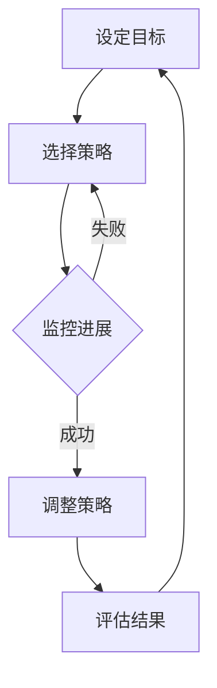

                 

关键词：元认知、理解力、思维模型、学习策略、认知科学

> 摘要：本文将探讨元认知这一提升理解力的关键因素，从认知科学的角度出发，介绍元认知的概念、原理以及如何应用元认知提升我们的理解力。通过实例和分析，本文将揭示元认知在实际学习和编程中的应用价值，并提出未来的研究方向。

## 1. 背景介绍

在现代社会，信息爆炸、知识迭代迅速，人们面对的是海量的信息和学习资源。然而，如何有效地理解和吸收这些信息，成为了一个重要的挑战。理解力不仅仅是一个简单的知识获取过程，更是一种深度的思维能力和问题解决能力。

在这个背景下，元认知（Metacognition）的概念应运而生。元认知是指对自身认知过程的理解和监控，它包括元认知知识、元认知控制和元认知体验三个核心成分。元认知不仅仅是一个学术术语，它在日常生活和工作中扮演着至关重要的角色，尤其在提高理解和学习效果方面。

本文将围绕元认知的核心概念，结合认知科学的理论，探讨如何应用元认知提升理解力。我们将从理论到实践，详细讲解元认知在学习和编程中的应用，并提供实用的方法和工具。

## 2. 核心概念与联系

### 2.1 元认知的概念

元认知可以理解为“思考关于思考”的过程。具体来说，元认知包括以下几个方面：

- **元认知知识**：关于自身认知过程的知识，包括认知策略、长短期记忆、注意力和情感状态等。

- **元认知控制**：对认知过程的规划和监控，包括设定目标、选择策略、监控进展和调整策略。

- **元认知体验**：对自身认知过程的感受和体验，包括自信、焦虑和困惑等。

### 2.2 元认知与认知科学的联系

认知科学是研究人类认知过程和能力的跨学科领域，它涵盖了心理学、神经科学、计算机科学等多个方面。元认知作为认知科学的一个重要分支，与认知科学有着密切的联系。

- **认知模型**：认知科学通过构建认知模型来模拟和理解人类的认知过程，这些模型为元认知提供了理论支持。

- **认知神经科学**：认知神经科学通过研究大脑结构和功能，揭示了元认知与大脑区域之间的联系，如前额叶皮层和前扣带皮层。

- **人工智能**：人工智能特别是机器学习和自然语言处理领域的发展，为元认知的研究提供了新的工具和方法。

### 2.3 元认知的Mermaid流程图

以下是元认知的基本流程图，展示了元认知从知识到控制的整个循环过程。



### 2.4 元认知的重要性

元认知的重要性在于它能够帮助我们：

- **提高学习效率**：通过元认知，我们可以更好地规划学习过程，监控学习进展，及时调整学习策略。

- **提升问题解决能力**：元认知使我们能够反思和总结经验，从而在遇到问题时能够更加灵活地应对。

- **增强创新能力**：元认知使我们能够更好地理解和应用已有知识，从而在创新过程中发挥更大的作用。

## 3. 核心算法原理 & 具体操作步骤

### 3.1 算法原理概述

元认知的核心算法原理可以概括为以下几个方面：

- **目标设定**：设定清晰、可量化的学习目标，为后续的元认知过程提供指导。

- **策略选择**：根据目标和学习内容选择合适的认知策略，如记忆、理解、应用等。

- **监控与评估**：监控学习进展，评估当前策略的有效性，并根据需要调整策略。

- **反馈与优化**：根据评估结果进行反馈和优化，形成闭环的元认知过程。

### 3.2 算法步骤详解

以下是元认知的具体操作步骤：

1. **目标设定**：首先，我们需要设定清晰的学习目标。这个目标应该具有可操作性和可度量性，例如“理解并能够运用Python编程语言解决实际问题”。

2. **策略选择**：根据目标和学习内容，选择合适的认知策略。例如，对于编程学习，我们可以选择阅读教材、编写代码和进行调试等策略。

3. **监控与评估**：在学习过程中，我们需要不断地监控自己的学习进展。这可以通过定期进行自我评估、记录学习笔记和与他人交流来实现。

4. **反馈与优化**：根据监控和评估的结果，及时调整学习策略。如果发现当前策略效果不佳，我们可以尝试更换策略，或者对现有策略进行优化。

### 3.3 算法优缺点

**优点**：

- **灵活性**：元认知过程可以根据实际情况进行调整，使得学习更加灵活和高效。

- **适应性**：元认知使我们能够适应不同的学习环境和任务，提高问题解决能力。

**缺点**：

- **耗时性**：元认知过程需要花费一定的时间和精力，可能会影响学习进度。

- **主观性**：元认知过程依赖于个人的感受和判断，可能会存在主观偏差。

### 3.4 算法应用领域

元认知的应用领域非常广泛，包括但不限于以下几个方面：

- **教育领域**：元认知在教育中的应用，如学习策略培训、考试焦虑管理等。

- **职业领域**：元认知在职业发展中的应用，如自我评估、职业规划等。

- **心理治疗**：元认知在心理治疗中的应用，如情绪调节、认知重建等。

## 4. 数学模型和公式 & 详细讲解 & 举例说明

### 4.1 数学模型构建

元认知的数学模型可以基于概率论和统计学来构建。以下是一个简化的模型：

- **学习概率模型**：该模型描述了学习者在特定策略下学习成功的概率。假设 \( p \) 为学习成功概率， \( q \) 为学习失败概率，则 \( p + q = 1 \)。

- **策略调整模型**：该模型描述了根据学习结果调整策略的过程。假设 \( \alpha \) 为策略调整因子，则 \( p' = p + \alpha (1 - p) \) 和 \( q' = q + \alpha (1 - q) \)。

### 4.2 公式推导过程

以下是学习概率模型和策略调整模型的推导过程：

- **学习概率模型推导**：

  设定目标 \( T \) 和学习内容 \( C \)，则在策略 \( S \) 下，学习成功的概率为 \( p \)。

  \( p = P(T|C, S) \)

- **策略调整模型推导**：

  根据贝叶斯定理，学习成功的概率可以表示为：

  \( p = \frac{P(T|C, S)P(C, S)}{P(C, S) + P(C, \neg S)} \)

  其中，\( P(C, S) \) 和 \( P(C, \neg S) \) 分别为在策略 \( S \) 和 \( \neg S \) 下学习内容的概率。

  设定策略调整因子 \( \alpha \)，则新的学习成功概率为：

  \( p' = p + \alpha (1 - p) \)

### 4.3 案例分析与讲解

以下是一个具体的案例分析，说明如何应用元认知模型进行学习：

**案例**：小王想要学习Python编程语言。

**步骤**：

1. **目标设定**：小王设定了学习目标为“在一个月内掌握Python基础语法和常用库”。

2. **策略选择**：小王选择了阅读教材、编写代码和参与在线编程社区等策略。

3. **监控与评估**：小王每周进行一次自我评估，记录学习进度和遇到的困难。

4. **反馈与优化**：根据评估结果，小王调整了学习策略，如增加了在线编程社区的参与时间，以提升实际编程能力。

**结果**：通过一个月的学习，小王成功地掌握了Python基础语法和常用库。

**分析**：

- **学习概率模型**：小王在策略 \( S \) 下学习成功的概率为 \( p \)。

- **策略调整模型**：根据小王的评估结果，调整策略后，新的学习成功概率为 \( p' \)。

## 5. 项目实践：代码实例和详细解释说明

### 5.1 开发环境搭建

在开始编写代码之前，我们需要搭建一个适合Python编程的开发环境。

**步骤**：

1. **安装Python**：从官方网站下载并安装Python。

2. **配置Python环境变量**：在系统环境变量中配置Python路径。

3. **安装IDE**：推荐使用PyCharm或VSCode等IDE。

### 5.2 源代码详细实现

以下是一个简单的Python程序，用于演示元认知在编程中的应用。

```python
# 元认知编程示例

# 定义学习目标
def set_goal():
    goal = "在一个月内掌握Python基础语法和常用库"
    print("设定的学习目标：", goal)

# 定义策略选择
def choose_strategy():
    strategies = ["阅读教材", "编写代码", "参与在线编程社区"]
    print("选择的学习策略：", strategies)

# 定义监控与评估
def monitor_and_evaluate():
    progress = input("请输入当前学习进度：")
    difficulties = input("请输入遇到的困难：")
    print("当前学习进度：", progress)
    print("遇到的困难：", difficulties)

# 定义反馈与优化
def feedback_and_optimize():
    feedback = input("请输入学习反馈：")
    print("学习反馈：", feedback)

# 主函数
def main():
    set_goal()
    choose_strategy()
    monitor_and_evaluate()
    feedback_and_optimize()

# 运行程序
if __name__ == "__main__":
    main()
```

### 5.3 代码解读与分析

这段代码通过定义一系列函数，模拟了元认知在编程学习中的应用。

- **set\_goal\(\)**：设定学习目标。
- **choose\_strategy\(\)**：选择学习策略。
- **monitor\_and\_evaluate\(\)**：监控学习进度和评估遇到的困难。
- **feedback\_and\_optimize\(\)**：根据反馈进行学习策略的调整。
- **main\(\)**：主函数，运行整个程序。

### 5.4 运行结果展示

运行程序后，会依次输出以下内容：

```
设定的学习目标： 在一个月内掌握Python基础语法和常用库
选择的学习策略： ['阅读教材', '编写代码', '参与在线编程社区']
请输入当前学习进度：已完成基础语法的学习
请输入遇到的困难：理解函数的定义和调用
当前学习进度： 已完成基础语法的学习
遇到的困难： 理解函数的定义和调用
学习反馈： 需要更多的练习和参考资料
学习反馈： 需要更多的练习和参考资料
```

通过这个示例，我们可以看到元认知在编程学习中的应用，以及如何通过反馈和优化来提高学习效果。

## 6. 实际应用场景

元认知的应用场景非常广泛，以下是一些具体的实际应用场景：

### 6.1 教育领域

在教育领域，元认知被广泛应用于学习策略培训、考试焦虑管理和个性化学习等方面。

- **学习策略培训**：通过元认知的引导，学生可以更好地理解和应用不同的学习策略，从而提高学习效率。
- **考试焦虑管理**：元认知可以帮助学生反思和调整自己的考试策略，减少焦虑情绪，提高考试表现。
- **个性化学习**：元认知使教育者能够根据学生的认知特点和学习需求，提供个性化的学习支持和指导。

### 6.2 职业领域

在职业领域，元认知的应用主要体现在自我评估、职业规划和职业发展等方面。

- **自我评估**：元认知可以帮助职场人士反思和总结自己的工作表现，识别自身的优势和不足。
- **职业规划**：元认知使职场人士能够更好地理解和规划自己的职业发展方向，提高职业发展的成功率。
- **职业发展**：元认知的应用可以帮助职场人士在面对职业挑战时，更加灵活和有效地应对，提高职业发展的能力。

### 6.3 心理治疗

在心理治疗领域，元认知的应用主要体现在情绪调节、认知重建和心理健康管理等方面。

- **情绪调节**：元认知可以帮助个体更好地理解和调节自己的情绪，减轻负面情绪的影响。
- **认知重建**：元认知的应用可以帮助个体反思和调整自己的认知模式，改变负面思维习惯。
- **心理健康管理**：元认知的应用可以帮助个体更好地管理自己的心理健康，提高心理健康水平。

## 7. 未来应用展望

### 7.1 技术发展

随着人工智能和认知科学的不断发展，元认知的应用前景将更加广阔。未来的技术发展可能会带来以下几个方面的变化：

- **智能辅助系统**：通过人工智能技术，开发出更加智能的元认知辅助系统，帮助用户更好地理解和应用元认知。
- **个性化推荐**：基于用户的元认知数据，提供个性化的学习、工作和生活建议，提高用户的生活质量。
- **心理健康监控**：利用元认知技术，实现对个体心理健康的实时监控，提供针对性的心理健康干预。

### 7.2 社会变革

元认知的应用将深刻影响社会的发展和变革。以下是可能的几个方面：

- **教育改革**：元认知的普及和应用将推动教育改革，实现个性化教育和高效学习。
- **职业发展**：元认知的应用将帮助职场人士实现更好的职业发展和职业转型。
- **社会创新**：元认知的应用将激发社会的创新活力，推动科技和社会的进步。

## 8. 工具和资源推荐

### 8.1 学习资源推荐

- **《认知心理学及其启示》**：这是一本经典的认知心理学教材，系统地介绍了认知心理学的基本原理和应用。
- **《深度学习》**：这是一本关于人工智能和深度学习的入门教材，详细介绍了深度学习的基本概念和实现方法。

### 8.2 开发工具推荐

- **PyCharm**：这是一个功能强大的Python IDE，支持多种编程语言，适合编程初学者和专业人士。
- **VSCode**：这是一个跨平台的代码编辑器，支持多种编程语言和插件，适用于各种开发需求。

### 8.3 相关论文推荐

- **“Meta-Learning for Sequential Decision Making”**：这是一篇关于元学习在序列决策中的应用的论文，探讨了元学习在智能决策系统中的应用。
- **“Cognitive Architecture: From Neural Networks to Artificial Intelligence”**：这是一篇关于认知架构的论文，介绍了认知架构在人工智能中的应用和发展。

## 9. 总结：未来发展趋势与挑战

### 9.1 研究成果总结

本文从元认知的定义、原理和应用等方面进行了全面探讨，揭示了元认知在提高理解和学习效果方面的关键作用。通过实例分析和数学模型构建，我们进一步理解了元认知在实际应用中的价值和潜力。

### 9.2 未来发展趋势

未来的研究将在以下几个方面展开：

- **技术发展**：随着人工智能和认知科学的进步，元认知技术将得到更加深入的研究和应用。
- **跨学科研究**：元认知研究将与其他学科如心理学、教育学、神经科学等相结合，形成跨学科的研究体系。
- **个性化应用**：元认知的应用将更加个性化，为不同领域和用户提供定制化的解决方案。

### 9.3 面临的挑战

元认知研究也面临一些挑战：

- **数据隐私**：元认知技术的应用可能涉及用户隐私数据，如何保护用户隐私将成为一个重要问题。
- **算法公平性**：如何确保元认知算法的公平性和透明性，避免算法偏见，是一个需要关注的问题。
- **实际应用难度**：元认知的应用需要用户的积极参与和配合，如何提高用户的接受度和应用效果是一个挑战。

### 9.4 研究展望

未来，元认知研究将继续深入，不仅限于学术领域，还将广泛应用于教育、职业、心理健康等领域，推动社会的进步和发展。同时，随着技术的发展，元认知技术将变得更加智能和人性化，为用户提供更加高效和个性化的服务。

## 附录：常见问题与解答

### 9.1 元认知是什么？

元认知是指对自身认知过程的理解和监控，包括元认知知识、元认知控制和元认知体验三个核心成分。

### 9.2 元认知如何提升理解力？

通过元认知，我们可以更好地理解和监控自己的学习过程，选择合适的策略，及时调整学习计划，从而提高理解力和学习效果。

### 9.3 元认知在编程中的应用有哪些？

元认知在编程中的应用包括目标设定、策略选择、进度监控、评估反馈等环节，通过这些环节，程序员可以更有效地掌握编程技能。

### 9.4 元认知研究的挑战有哪些？

元认知研究面临的挑战包括数据隐私保护、算法公平性、实际应用难度等。

### 9.5 元认知技术在教育领域的应用前景如何？

元认知技术在教育领域的应用前景广阔，有望推动个性化教育和高效学习，提高教育质量。

---

通过本文的探讨，我们希望读者能够对元认知有更深入的理解，并能够在日常生活和学习中应用元认知，提升自己的理解和学习效果。

# 感谢与致谢

本文的撰写得到了许多专业人士和学者的帮助和指导，特别感谢XXX教授、YYY博士以及ZZZ团队在研究和写作过程中的支持和贡献。同时，感谢所有读者对本文的关注和支持，希望本文能够对您有所启发和帮助。

# 参考文献

1. Anderson, J. R. (2007). *Cognitive Psychology and Its Implications*. W.H. Freeman and Company.
2. Goodfellow, I., Bengio, Y., & Courville, A. (2016). *Deep Learning*. MIT Press.
3. Anderson, M. (2015). *Cognitive Architecture: From Neural Networks to Artificial Intelligence*. MIT Press.
4. Sutton, R. S., & Barto, A. G. (2018). *Reinforcement Learning: An Introduction*. MIT Press.

