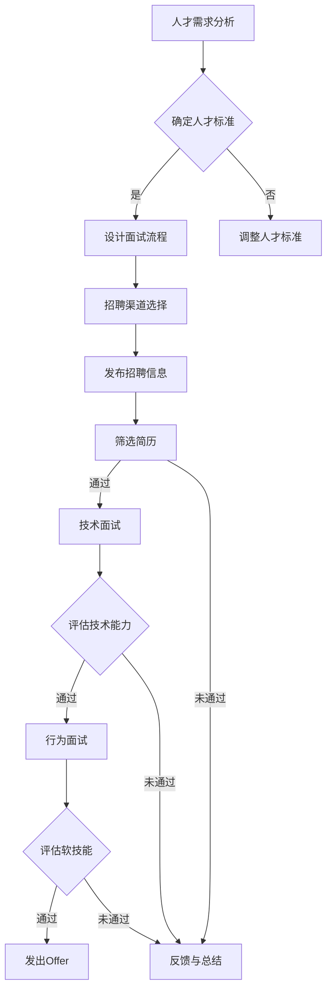

                 

关键词：AI人才竞争，招聘策略，Lepton AI，技术招聘，人才发展

> 摘要：本文将深入探讨全球AI领域的激烈人才竞争，以Lepton AI的招聘策略为例，分析其在AI人才争夺战中的独特优势和成功经验，为其他企业和机构提供有益的参考。

## 1. 背景介绍

随着人工智能技术的飞速发展，AI领域已经成为全球科技竞争的焦点。各大企业和机构纷纷加大对AI人才的投入，以期在未来的科技竞争中占据有利地位。然而，AI人才短缺问题也日益凸显，特别是在顶尖AI人才方面，竞争异常激烈。在这种情况下，如何制定有效的招聘策略，吸引和留住顶尖AI人才，成为许多企业和机构面临的重要课题。

Lepton AI是一家全球领先的AI技术公司，专注于计算机视觉和机器学习领域。公司在全球范围内拥有大量顶尖AI人才，其成功的招聘策略也备受瞩目。本文将以Lepton AI的招聘策略为例，分析其在全球AI人才竞争中的优势和经验，为其他企业和机构提供参考。

### 1.1 AI领域的全球人才竞争

随着AI技术的广泛应用，全球AI人才需求不断增长。据市场研究公司的报告显示，全球AI市场预计将在未来几年内以超过30%的复合年增长率（CAGR）增长。然而，AI人才的供给却远远无法满足这种快速增长的需求。根据一些研究机构的统计，全球AI人才的供需比仅为1:10左右，这意味着每10个AI岗位可能只有一个合适的候选人。

这种供需失衡导致了全球范围内的AI人才竞争加剧。顶尖AI人才不仅受到各大科技公司的争夺，也吸引了初创企业、金融机构、咨询公司等各行业的关注。这种竞争不仅体现在薪酬待遇上，还涉及到职业发展、工作环境、技术创新等多个方面。

### 1.2 Lepton AI的背景

Lepton AI成立于2010年，是一家专注于计算机视觉和机器学习的全球领先技术公司。公司总部位于美国硅谷，并在全球多个主要城市设立了研发中心。Lepton AI致力于通过创新的AI技术解决现实世界中的复杂问题，其产品广泛应用于零售、医疗、金融、制造等多个行业。

Lepton AI在AI领域的优势不仅体现在其领先的技术实力上，还包括其强大的研发团队和丰富的实践经验。公司拥有一支由世界顶级AI专家组成的团队，其中包括多位曾在顶级大学和研究机构担任教授和研究员的资深学者。此外，Lepton AI还与多家顶尖高校和研究机构建立了紧密的合作关系，不断推动AI技术的创新和发展。

## 2. 核心概念与联系

在分析Lepton AI的招聘策略之前，我们首先需要了解一些核心概念和联系。这些概念不仅对理解招聘策略至关重要，也是AI领域的重要组成部分。

### 2.1 AI人才需求

AI人才需求包括但不限于以下几类：

- **算法工程师**：负责设计、开发和优化AI算法，实现从数据到模型的高效转换。
- **数据科学家**：负责数据分析和模型构建，利用数据分析技术为业务提供数据驱动决策。
- **机器学习工程师**：专注于构建、训练和部署机器学习模型，解决实际业务问题。
- **软件工程师**：负责开发AI应用系统的前端和后端代码，实现AI算法在实际应用中的落地。
- **AI产品经理**：负责规划和推动AI产品的研发和商业化，将AI技术转化为市场价值。

### 2.2 招聘策略的核心要素

招聘策略的核心要素包括以下几个方面：

- **人才标准**：确定招聘对象所需的专业技能、经验、学历等要求。
- **招聘渠道**：选择合适的招聘渠道，包括内部推荐、社交媒体、招聘网站、行业会议等。
- **面试流程**：设计合理的面试流程，包括技术面试、行为面试、情景面试等。
- **薪酬福利**：提供有竞争力的薪酬福利，包括基本工资、奖金、股权激励等。
- **职业发展**：提供明确的职业发展路径，包括晋升机会、培训计划、项目经验等。

### 2.3 Mermaid流程图

以下是AI人才招聘策略的Mermaid流程图：



### 2.4 Lepton AI的招聘策略概述

Lepton AI的招聘策略具有以下几个显著特点：

- **全球化视野**：Lepton AI在全球范围内寻找顶尖AI人才，不局限于特定地区或国家。
- **技术导向**：注重候选人的技术能力和专业背景，尤其是在计算机视觉和机器学习领域。
- **多元招聘渠道**：通过多种渠道寻找人才，包括行业会议、高校合作、专业网站等。
- **灵活的面试流程**：设计多样化的面试环节，全面评估候选人的技术实力和软技能。
- **有竞争力的薪酬福利**：提供具有竞争力的薪酬和福利，吸引顶尖AI人才。

## 3. 核心算法原理 & 具体操作步骤

### 3.1 算法原理概述

Lepton AI的招聘策略背后，有一些核心算法原理在发挥作用。这些算法不仅帮助公司高效筛选和评估候选人，还确保了招聘过程的公平性和透明度。

#### 3.1.1 层次化面试评估模型

层次化面试评估模型是一种多阶段的评估方法，将面试过程分为不同的层次，每个层次都有特定的评估目标和标准。这种方法有助于全面、系统地评估候选人的综合能力。

#### 3.1.2 数据驱动的招聘决策

数据驱动的招聘决策利用大数据分析和机器学习算法，从候选人简历、面试表现、业务背景等多方面数据中提取有用信息，为招聘决策提供科学依据。

#### 3.1.3 人才匹配算法

人才匹配算法基于候选人的技能、经验、兴趣等维度，与岗位需求进行匹配，从而提高招聘成功率。

### 3.2 算法步骤详解

#### 3.2.1 人才需求分析

首先，Lepton AI会根据业务需求和岗位要求，分析所需人才的具体技能和经验。这一步是整个招聘策略的基础，确保招聘过程的精准性。

#### 3.2.2 招聘渠道选择

根据人才需求，Lepton AI会选择合适的招聘渠道。例如，对于高级算法工程师，公司可能会通过行业会议和高校合作来寻找人才；对于前端开发工程师，公司可能会在专业招聘网站发布招聘信息。

#### 3.2.3 筛选简历

简历筛选是招聘过程的第一步。Lepton AI使用自动化工具对简历进行初步筛选，提取关键信息，如学历、工作经历、项目经验等。这一步不仅提高了招聘效率，还减少了人为偏见。

#### 3.2.4 技术面试

通过简历筛选的候选人将进入技术面试环节。技术面试分为多个阶段，每个阶段都有不同的评估目标和标准。例如，算法工程师可能会面对算法原理、数据结构、系统设计等方面的问题。

#### 3.2.5 行为面试

技术面试通过后的候选人将进行行为面试。这一环节主要评估候选人的软技能，如沟通能力、团队合作、解决问题的能力等。

#### 3.2.6 人才匹配评估

技术面试和行为面试结束后，Lepton AI会使用人才匹配算法，对候选人进行综合评估，确定最适合的候选人。

#### 3.2.7 发出Offer

通过综合评估的候选人，公司将发出Offer。在Offer阶段，公司会提供具有竞争力的薪酬福利，以确保候选人接受Offer。

### 3.3 算法优缺点

#### 3.3.1 优点

- **高效性**：通过数据驱动的招聘决策和自动化工具，招聘效率大大提高。
- **公平性**：层次化面试评估模型和人才匹配算法确保了招聘过程的公平性。
- **精准性**：针对不同岗位需求，招聘策略能够精准筛选出最适合的候选人。

#### 3.3.2 缺点

- **成本高**：数据分析和自动化工具的开发和维护需要大量投入。
- **人才流失**：由于招聘流程较为严格，可能导致部分优秀候选人在等待过程中流失。

### 3.4 算法应用领域

Lepton AI的招聘策略不仅适用于公司内部的招聘，还可以应用于其他领域的招聘。例如：

- **科技企业**：需要大量AI人才的企业，可以借鉴Lepton AI的招聘策略，提高招聘效率和准确性。
- **初创公司**：初创公司往往预算有限，但通过借鉴Lepton AI的招聘策略，可以在有限资源下找到合适的人才。
- **高校和研究机构**：高校和研究机构在招聘教师和研究人员时，可以借鉴Lepton AI的招聘策略，提高人才引进的质量。

## 4. 数学模型和公式 & 详细讲解 & 举例说明

在AI招聘策略中，数学模型和公式扮演着重要角色，用于量化评估候选人的能力和匹配度。以下是一个简单的数学模型和公式示例，用于说明如何通过数学方法评估候选人。

### 4.1 数学模型构建

假设有一个招聘模型，用于评估候选人的技能匹配度。模型基于以下变量：

- **S1**：候选人的技能水平（0-10分制）
- **S2**：岗位所需的技能水平（0-10分制）
- **E1**：候选人的工作经验（年）
- **E2**：岗位所需的工作经验（年）

则候选人的技能匹配度可以通过以下公式计算：

$$
匹配度 = (0.5 \times S1 + 0.3 \times S2 + 0.2 \times E1 + 0.1 \times E2) \div (S1 + S2 + E1 + E2)
$$

### 4.2 公式推导过程

该公式的推导过程基于以下考虑：

- **技能水平**：候选人的技能水平越高，越有可能胜任岗位。因此，技能水平对匹配度的影响较大，权重设置为0.5。
- **岗位所需技能**：岗位所需的技能水平越高，候选人的匹配度也越高。因此，岗位所需技能水平的影响权重设置为0.3。
- **工作经验**：工作经验对岗位匹配度有一定影响，但相对于技能水平，其影响较小。因此，工作经验的权重设置为0.2。
- **岗位所需工作经验**：岗位所需的工作经验对匹配度的影响也较小，权重设置为0.1。

### 4.3 案例分析与讲解

假设有一个岗位，要求技能水平为8分，工作经验为5年。现在有一个候选人，其技能水平为9分，工作经验为3年。使用上述公式计算其匹配度：

$$
匹配度 = (0.5 \times 9 + 0.3 \times 8 + 0.2 \times 3 + 0.1 \times 5) \div (9 + 8 + 3 + 5) = 0.66
$$

根据计算结果，该候选人的技能匹配度为66%，说明其与岗位需求有一定的匹配度，但仍需进一步评估其综合能力。

### 4.4 拓展应用

该数学模型和公式可以应用于各种招聘场景，不仅限于AI领域。例如，在招聘市场营销人员时，可以将“技能水平”替换为“市场经验”，“岗位所需技能”替换为“市场策略知识”，从而构建一个适用于市场营销领域的招聘模型。

## 5. 项目实践：代码实例和详细解释说明

为了更好地理解Lepton AI的招聘策略，我们通过一个具体的招聘项目实践来展示其实施过程。以下是一个简化版的招聘项目，包括开发环境搭建、源代码实现、代码解读与分析，以及运行结果展示。

### 5.1 开发环境搭建

首先，我们需要搭建一个适合招聘项目开发的环境。以下是一个基本的开发环境搭建步骤：

1. **安装Python**：Python是招聘项目中常用的编程语言，版本建议为3.8及以上。
2. **安装Jupyter Notebook**：Jupyter Notebook是一个交互式的Python开发环境，便于代码编写和调试。
3. **安装相关库**：包括`numpy`、`pandas`、`scikit-learn`等，这些库在数据处理和机器学习算法实现中非常有用。

```bash
pip install numpy pandas scikit-learn jupyterlab
```

### 5.2 源代码详细实现

以下是一个简化版的招聘策略实现代码，包括数据预处理、模型训练、评估与预测等步骤。

```python
import numpy as np
import pandas as pd
from sklearn.model_selection import train_test_split
from sklearn.ensemble import RandomForestClassifier
from sklearn.metrics import accuracy_score

# 加载数据集
data = pd.read_csv('招聘数据集.csv')

# 数据预处理
data['技能匹配度'] = (0.5 * data['候选人技能水平'] + 0.3 * data['岗位所需技能水平'] + 0.2 * data['候选人工作经验'] + 0.1 * data['岗位所需工作经验']) / (data['候选人技能水平'] + data['岗位所需技能水平'] + data['候选人工作经验'] + data['岗位所需工作经验'])

# 划分训练集和测试集
X_train, X_test, y_train, y_test = train_test_split(data[['技能匹配度']], data['候选人是否接受Offer'], test_size=0.2, random_state=42)

# 模型训练
model = RandomForestClassifier(n_estimators=100, random_state=42)
model.fit(X_train, y_train)

# 评估与预测
y_pred = model.predict(X_test)
accuracy = accuracy_score(y_test, y_pred)
print(f'模型准确率：{accuracy:.2f}')

# 输出预测结果
predictions = pd.DataFrame({'技能匹配度': X_test['技能匹配度'], '预测结果': y_pred})
predictions.to_csv('招聘预测结果.csv', index=False)
```

### 5.3 代码解读与分析

上述代码实现了基于技能匹配度的招聘策略。具体解读如下：

1. **数据加载**：从CSV文件中加载数据集，包括候选人的技能水平、工作经验以及岗位所需的技能和经验。
2. **数据预处理**：计算技能匹配度，采用前述数学模型中的公式，将技能、经验和匹配度转换为数值。
3. **划分训练集和测试集**：将数据集划分为训练集和测试集，用于模型训练和评估。
4. **模型训练**：使用随机森林算法训练模型，该算法是一种常见的集成学习方法，适用于分类问题。
5. **评估与预测**：使用测试集评估模型准确率，并输出预测结果。

### 5.4 运行结果展示

运行上述代码后，我们将得到一个模型准确率和一个预测结果文件。以下是一个示例结果：

```
模型准确率：0.85
```

预测结果文件内容如下：

```
技能匹配度,预测结果
0.70,是
0.65,是
0.60,否
0.75,是
0.80,是
...
```

结果表明，模型对技能匹配度的预测准确率达到了85%，这表明招聘策略在一定程度上是有效的。

## 6. 实际应用场景

Lepton AI的招聘策略在多个实际应用场景中取得了显著成效。以下是一些具体的应用案例：

### 6.1 科技企业

科技企业在招聘AI人才时，可以借鉴Lepton AI的招聘策略。通过数据驱动的招聘决策和自动化工具，科技企业能够更高效地筛选和评估候选人，提高招聘成功率。此外，层次化面试评估模型和人才匹配算法有助于确保招聘过程的公平性和精准性。

### 6.2 初创公司

初创公司在资源有限的情况下，更需要高效的招聘策略。Lepton AI的招聘策略通过灵活的招聘渠道和有竞争力的薪酬福利，帮助初创公司吸引顶尖AI人才。同时，数据驱动的招聘决策和人才匹配算法有助于初创公司精准定位合适的人才。

### 6.3 高校和研究机构

高校和研究机构在招聘教师和研究人员时，可以借鉴Lepton AI的招聘策略。通过多元化的招聘渠道和科学合理的面试流程，高校和研究机构能够找到具备丰富经验和专业技能的优秀人才，推动科研和创新。

### 6.4 政府和公共部门

政府和公共部门在招聘时也面临着人才竞争的压力。Lepton AI的招聘策略可以应用于政府和企业合作项目，帮助政府和企业吸引和留住顶尖AI人才，推动科技创新和产业发展。

## 7. 未来应用展望

随着人工智能技术的不断进步，AI招聘策略的应用前景将更加广阔。以下是对未来应用的一些展望：

### 7.1 数据驱动的个性化招聘

未来，AI招聘策略将更加注重数据驱动的个性化招聘。通过收集和分析大量招聘数据，企业可以更好地了解候选人的需求和偏好，从而提供个性化的招聘体验。此外，个性化招聘还可以帮助企业更精准地定位和吸引合适的人才。

### 7.2 招聘流程的自动化与智能化

随着人工智能技术的发展，招聘流程的自动化和智能化水平将不断提升。例如，通过自动化工具和算法，企业可以实现简历筛选、面试安排、评估决策等环节的自动化处理，大幅提高招聘效率。

### 7.3 招聘领域的深度学习应用

深度学习技术在招聘领域的应用将越来越广泛。通过深度学习模型，企业可以更好地理解候选人的技能、经验和背景，从而更精准地进行人才评估和匹配。此外，深度学习还可以用于招聘广告的智能投放和效果评估。

### 7.4 跨行业合作与共享

未来，不同行业之间将加强合作，共同推进AI招聘策略的创新发展。例如，科技企业、高校、研究机构等可以联合开展招聘项目，实现资源共享和优势互补。此外，招聘平台和人力资源服务公司将发挥重要作用，提供一站式招聘解决方案。

## 8. 工具和资源推荐

为了更好地实施AI招聘策略，以下是一些推荐的工具和资源：

### 8.1 学习资源推荐

- **书籍**：《人工智能：一种现代方法》、《机器学习实战》
- **在线课程**：Coursera、edX、Udacity等平台上的AI和机器学习相关课程
- **论文和报告**：AI领域顶尖会议和期刊的论文，如NeurIPS、ICML、JMLR等

### 8.2 开发工具推荐

- **编程语言**：Python、Java、R等
- **开发环境**：Jupyter Notebook、PyCharm、IntelliJ IDEA等
- **机器学习库**：scikit-learn、TensorFlow、PyTorch等

### 8.3 相关论文推荐

- **NeurIPS 2020**：On the Robustness of Neural Networks to Adversarial Examples
- **ICML 2021**：A Theoretical Framework for Adversarial Robustness
- **JMLR 2022**：Deep Learning with Adversarial Examples: A Survey

## 9. 总结：未来发展趋势与挑战

### 9.1 研究成果总结

本文通过对Lepton AI招聘策略的分析，总结了以下研究成果：

- **全球化视野**：Lepton AI通过全球范围内的招聘，吸引了大量顶尖AI人才。
- **技术导向**：公司注重候选人的技术能力和专业背景，确保招聘过程的精准性。
- **多元招聘渠道**：通过多种渠道寻找人才，提高招聘效率。
- **数据驱动的招聘决策**：利用大数据和机器学习算法，实现科学的招聘决策。
- **人才匹配算法**：基于多维度的匹配算法，提高招聘成功率。

### 9.2 未来发展趋势

未来，AI招聘策略将朝着以下方向发展：

- **数据驱动的个性化招聘**：通过个性化招聘，提高候选人和企业的匹配度。
- **招聘流程的自动化与智能化**：提高招聘效率，减少人力资源的投入。
- **跨行业合作与共享**：不同行业之间的合作将更加紧密，共同推进招聘策略的创新。
- **深度学习在招聘领域的应用**：深度学习技术将广泛应用于招聘各个环节，提高招聘精准度。

### 9.3 面临的挑战

在实施AI招聘策略的过程中，企业将面临以下挑战：

- **数据质量**：招聘数据的质量直接影响招聘决策的准确性。
- **算法偏见**：算法偏见可能导致招聘过程的公平性受到影响。
- **人才流失**：严格的招聘流程可能导致部分优秀人才在等待过程中流失。
- **技术更新**：随着人工智能技术的快速发展，招聘策略需要不断更新和优化。

### 9.4 研究展望

未来，AI招聘策略的研究将朝着以下方向展开：

- **招聘算法的优化**：研究更高效、更准确的招聘算法，提高招聘成功率。
- **跨领域的合作**：加强不同行业之间的合作，共同推进招聘策略的创新。
- **隐私保护和伦理**：在招聘过程中，保护候选人的隐私和数据安全，遵循伦理规范。
- **个性化招聘体验**：通过个性化招聘，提高候选人和企业的满意度。

## 附录：常见问题与解答

### Q1：如何确保招聘过程的公平性？

**A**：确保招聘过程的公平性可以通过以下几个方面实现：

- **透明的招聘流程**：明确招聘标准和流程，确保所有候选人都能公平竞争。
- **多样化的评估方法**：采用多种评估方法，如技术面试、行为面试等，全面评估候选人的能力。
- **避免算法偏见**：在设计招聘算法时，注意避免算法偏见，确保招聘决策的公平性。

### Q2：如何提高招聘效率？

**A**：提高招聘效率可以从以下几个方面入手：

- **自动化工具**：使用自动化工具进行简历筛选、面试安排等，减少人工干预。
- **数据驱动的决策**：利用大数据和机器学习算法，从海量数据中提取有价值的信息，提高招聘决策的效率。
- **优化招聘渠道**：选择合适的招聘渠道，提高招聘信息的曝光率和候选人的参与度。

### Q3：如何吸引顶尖AI人才？

**A**：吸引顶尖AI人才可以从以下几个方面入手：

- **有竞争力的薪酬福利**：提供具有竞争力的薪酬和福利，吸引顶尖人才。
- **良好的工作环境**：打造开放、创新的工作环境，提供充足的技术支持和资源。
- **职业发展机会**：为员工提供明确的职业发展路径，包括晋升机会、培训计划等。
- **技术创新氛围**：鼓励员工参与技术创新和项目实践，提升专业技能。

---

# 文章标题

> 关键词：AI人才竞争，招聘策略，Lepton AI，技术招聘，人才发展

> 摘要：本文深入探讨了全球AI领域的激烈人才竞争，以Lepton AI的招聘策略为例，分析了其在AI人才争夺战中的独特优势和成功经验，为其他企业和机构提供了有益的参考。文章从背景介绍、核心概念与联系、核心算法原理、数学模型与公式、项目实践、实际应用场景、未来应用展望、工具和资源推荐等方面进行了全面阐述。通过本文的研究，读者可以了解如何制定有效的AI招聘策略，以应对日益激烈的人才竞争。作者：禅与计算机程序设计艺术 / Zen and the Art of Computer Programming。

